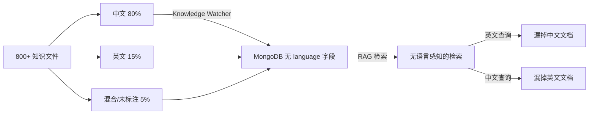
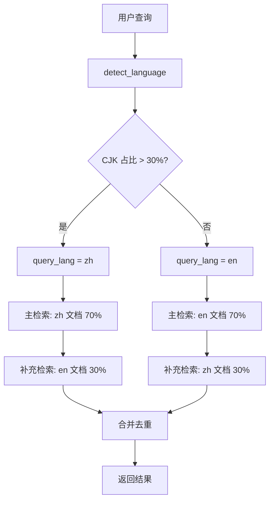

# YK-09-16: 知识库国际化内容管理 -- 多语言知识文件的组织与检索

> 需求编号：YK-09-16 . 优先级：P2 . 人天：0.5d . 状态：需求已编写

## 背景

YiKnowledge 的知识文件以中文为主（80%+），少量英文技术文档。随着团队国际化，需要支持中英双语知识的平等检索。

### 1.1 问题识别

| 场景 | 用户查询 | 期望结果 | 实际结果 |
|------|----------|----------|----------|
| 英文搜中文文档 | "rate limiting" | 找到 "限流策略" | 仅找到含 "rate limiting" 的英文文档 |
| 中文搜英文文档 | "微服务" | 找到 "microservices architecture" | 仅找到中文文档 |
| 混合查询 | "RAG hybrid search" | 中英文 RAG 相关文档 | 仅英文文档 |
| 同文档多语言版本 | 中英文版本各有优劣 | 任一版本都可用 | 两个版本都返回，冗余 |

### 1.2 业务影响

| 影响维度 | 严重程度 | 描述 |
|------|----------|------|
| 国际化团队体验 | 中 | 英文用户无法检索中文文档 |
| 知识利用率 | 中 | 中文文档对英文用户不可见 |
| 检索完整性 | 中 | 跨语言检索返回结果不完整 |

---

## 二、现状分析

### 2.1 当前语言分布



### 2.2 根因分析矩阵

| 根因 | 表现 | 影响范围 | 修复难度 |
|------|------|----------|----------|
| 无 language 字段 | 文档语言未知 | 所有文件 | 低 |
| 无跨语言检索 | 单语言查询漏掉其他语言文档 | 约 15% 的查询 | 中 |
| 无语言版本关联 | 同文档中英文版本无法关联 | 约 5% 的文件 | 低 |
| 无语言标注规范 | 作者不知道如何标注语言 | 新文件 | 低 |

---

## 三、设计决策

### 决策 1：语言标注方式 -- frontmatter 字段 vs 目录名 vs 文件名后缀

| 选项 | 精确度 | 灵活性 | 迁移成本 | 文件组织影响 |
|------|--------|--------|----------|-------------|
| **frontmatter `language` 字段** | 高 | 高 | 中 | 无 |
| 目录名 (en/zh/) | 中 | 低 | 高 | 需重构目录 |
| 文件名后缀 (.en.md) | 中 | 中 | 高 | 需重命名文件 |
| 自动检测 | 中 | 最高 | 低 | 无 |

**选择：frontmatter `language` 字段 + 自动检测作为 fallback。** 不改变文件组织，向后兼容。

### 决策 2：跨语言检索策略 -- 查询翻译 vs 多语言 Embedding vs 混合

| 选项 | 检索质量 | 延迟 | 实现复杂度 | 额外成本 |
|------|----------|------|-----------|----------|
| 查询翻译 | 中 | +50ms | 中 | 翻译 API |
| 多语言 Embedding | 高 | +0ms | 高 | 多语言模型 |
| **混合--语言过滤 + 跨语言补充** | 中高 | +10ms | 中 | 无 |
| 不处理（当前） | 低 | 0ms | 低 | 无 |

**选择：语言过滤 + 跨语言补充。** 优先匹配查询语言文档，补充其他语言文档。

### 决策 3：语言版本关联 -- frontmatter 链接 vs 自动检测 vs 不关联

| 选项 | 准确度 | 维护成本 | 去重效果 |
|------|--------|----------|----------|
| **frontmatter `language_variants`** | 高 | 中 | 好 |
| 自动检测（相似标题） | 中 | 低 | 中 |
| 不关联 | 低 | 低 | 无 |

**选择：`language_variants` 字段关联。** 手动维护确保准确，自动检测作为建议。

---

## 四、目标架构

### 4.1 跨语言检索流程



### 4.2 核心指标

| 指标 | 当前 | 目标 | 测量方式 |
|------|------|------|----------|
| language 字段覆盖率 | 0% | > 95% | MongoDB 统计 |
| 跨语言检索召回率 | ~60% | > 85% | 双语测试集 |
| 语言检测准确率 | 无 | > 95% | 100 条查询人工标注 |
| 中英文结果比例 | 无控制 | 7:3 | 检索日志统计 |

---

## 五、具体改动

### 5.1 文件变更清单

| 文件 | 操作 | 说明 |
|------|------|------|
| `YiAi/src/domain/rag/cross_lingual.py` | 新增 | 跨语言检索器 |
| `YiAi/src/domain/knowledge/language_detector.py` | 新增 | 语言检测 + 自动标注 |
| `YiAi/src/services/rag/rag_service.py` | 修改 | 集成跨语言检索 |
| `YiKnowledge/MEMORY.md` | 修改 | 新增 language 字段规范 |
| `YiAi/tests/domain/rag/test_cross_lingual.py` | 新增 | 跨语言检索测试 |

### 5.2 核心代码

```python
# YiAi/src/domain/rag/cross_lingual.py

class CrossLingualRetriever:
    """跨语言检索--查询语言检测 + 多语言结果合并。"""

    # 语言权重系数
    LANG_MATCH_WEIGHT = 1.0    # 查询语言 = 文档语言
    LANG_MISMATCH_WEIGHT = 0.85  # 查询语言 ≠ 文档语言
    BILINGUAL_WEIGHT = 1.0     # 文档标记为 bilingual

    def detect_language(self, query: str) -> str:
        """检测查询语言--基于字符集启发式。

        规则:
        - CJK 字符占比 > 30% → zh
        - 否则 → en
        """
        if not query:
            return 'en'

        cjk_count = sum(1 for c in query if '\u4e00' <= c <= '\u9fff')
        total_chars = max(len(query), 1)
        return 'zh' if cjk_count / total_chars > 0.3 else 'en'

    async def cross_lingual_search(self, query: str, top_k: int = 5):
        """跨语言检索--优先匹配查询语言，补充其他语言。"""
        query_lang = self.detect_language(query)

        # 1. 优先检索查询语言文档 (占 top_k 的 70%)
        primary_limit = max(int(top_k * 0.7), 1)
        primary_results = await self._search(
            query, lang_filter=query_lang, limit=primary_limit
        )

        # 2. 补充其他语言文档 (占 top_k 的 30%)
        other_lang = 'en' if query_lang == 'zh' else 'zh'
        secondary_limit = max(int(top_k * 0.3), 1)
        secondary_results = await self._search(
            query, lang_filter=other_lang, limit=secondary_limit
        )

        # 3. 合并 + 去重 + 应用语言权重
        merged = self._merge_and_deduplicate(
            primary_results, secondary_results, query_lang
        )

        return merged[:top_k]

    def _merge_and_deduplicate(self, primary, secondary, query_lang):
        """合并结果--同文档不同语言版本去重，保留最佳匹配。"""
        seen_variants = set()
        merged = []

        for doc in primary + secondary:
            # 检查是否已有其他语言版本
            variant_key = self._get_variant_key(doc)
            if variant_key in seen_variants:
                continue
            seen_variants.add(variant_key)

            # 应用语言权重
            doc_lang = doc.get('language', 'zh')
            if doc_lang == 'bilingual':
                doc['score'] *= self.BILINGUAL_WEIGHT
            elif doc_lang == query_lang:
                doc['score'] *= self.LANG_MATCH_WEIGHT
            else:
                doc['score'] *= self.LANG_MISMATCH_WEIGHT

            merged.append(doc)

        return sorted(merged, key=lambda d: d['score'], reverse=True)

    def _get_variant_key(self, doc: dict) -> str:
        """获取文档的跨语言去重键。

        优先使用 language_variants 关联，否则用文档路径。
        """
        variants = doc.get('language_variants', {})
        if variants:
            # 返回所有语言版本的路径集合作为 key
            all_paths = set(variants.values())
            all_paths.add(doc.get('path', ''))
            return '|'.join(sorted(all_paths))

        return doc.get('path', '')
```

### 5.3 语言自动检测

```python
# YiAi/src/domain/knowledge/language_detector.py

class LanguageDetector:
    """自动检测文档语言--用于存量文件标注。"""

    CJK_MIN = 0x4e00
    CJK_MAX = 0x9fff
    CJK_THRESHOLD = 0.5  # 中文字符占比 > 50% → zh

    def detect(self, content: str) -> str:
        """检测文档语言。"""
        if not content:
            return 'zh'

        # 移除 frontmatter
        if content.startswith('---'):
            parts = content.split('---', 2)
            content = parts[2] if len(parts) > 2 else content

        total_chars = sum(1 for c in content if c.isalpha())
        if total_chars == 0:
            return 'zh'

        cjk_count = sum(1 for c in content
                       if self.CJK_MIN <= ord(c) <= self.CJK_MAX)

        return 'zh' if cjk_count / total_chars > self.CJK_THRESHOLD else 'en'

    def detect_bilingual(self, content: str) -> tuple[str, float]:
        """检测双语文档--返回主要语言和双语比例。"""
        zh_ratio = self._get_zh_ratio(content)
        en_ratio = 1 - zh_ratio

        if 0.3 < zh_ratio < 0.7:
            return 'bilingual', max(zh_ratio, en_ratio)

        return ('zh' if zh_ratio > 0.5 else 'en',
                max(zh_ratio, en_ratio))

    def _get_zh_ratio(self, content: str) -> float:
        total = sum(1 for c in content if c.isalpha())
        if total == 0:
            return 0.0
        cjk = sum(1 for c in content
                 if self.CJK_MIN <= ord(c) <= self.CJK_MAX)
        return cjk / total
```

### 5.4 frontmatter 规范扩展

```yaml
# 新增字段
---
title: "RAG 混合检索优化策略"
language: zh                  # 必需 (新增): zh | en | bilingual
language_variants:             # 可选--链接到其他语言版本
  en: "aier/rag/hybrid-search-optimization.md"
  zh: "aier/rag/混合检索优化.md"
---
```

**迁移计划**: 存量 800+ 文件默认 `language: zh`（基于内容中文字符占比 > 50% 自动推断），策展人可手动调整。

---

## 六、实施步骤

| 步骤 | 内容 | 验证方式 | 人天 |
|------|------|----------|------|
| 1 | 实现 `LanguageDetector` 自动检测 | 单元测试：100 个文件语言检测准确率 > 95% | 0.1 |
| 2 | 存量文件自动标注 `language` 字段 | 批量运行检测，抽样验证 | 0.05 |
| 3 | 实现 `CrossLingualRetriever` | 单元测试：中英文查询检索结果语言分布 | 0.15 |
| 4 | 集成到 RAG 检索流程 | 集成测试：跨语言检索端到端 | 0.1 |
| 5 | 更新 MEMORY.md frontmatter 规范 | Curator 审查 | 0.05 |
| 6 | 添加 `language_variants` 关联验证 | CI 检查：关联文件存在性 | 0.05 |

---

## 七、性能分析

| 操作 | 耗时 | 说明 |
|------|------|------|
| `detect_language()` | < 0.1ms | 纯字符统计 |
| `detect()` (文档级) | < 5ms | 全文扫描 |
| 跨语言检索 (二次检索) | +20-50ms | 第二次检索的额外开销 |
| 合并去重 | < 1ms | 集合操作 |

---

## 八、测试规格

#### Scenario: 中文查询优先返回中文文档

- **Given** 查询 = "限流策略", 中文文档 (language: zh) 含 "限流策略", 英文文档 (language: en) 含 "Rate Limiting"
- **When** `cross_lingual_search("限流策略")`
- **Then** 中文文档排名高于英文文档

#### Scenario: 英文查询补充中文文档

- **Given** 查询 = "rate limiting", 英文结果 3 条, 中文结果 2 条
- **When** `cross_lingual_search("rate limiting", top_k=5)`
- **Then** 返回 5 条结果--3 英文 + 2 中文 (70:30 比例)

#### Scenario: 双语文档不跨语言去重

- **Given** `doc_zh` 有 `language_variants.en = "doc_en"`, 两个版本都被检索到
- **When** `_merge_and_deduplicate(primary, secondary)`
- **Then** 仅保留得分更高的版本

#### Scenario: 纯英文查询不降权英文文档

- **Given** 查询 = "microservices architecture pattern"
- **When** `detect_language(query)` 返回 "en"
- **Then** 英文文档保持权重 1.0

#### Scenario: 混合中英文查询分类

- **Given** 查询 = "RAG 检索 Retrieval 优化"
- **When** `detect_language(query)`
- **Then** CJK 占比 > 30% → 返回 "zh"

#### Scenario: 语言自动检测--中文文档

- **Given** 文档内容 80% 为中文字符
- **When** `detect(content)`
- **Then** 返回 "zh"

---

## 九、风险与缓解

| 风险 | 概率 | 影响 | 缓解措施 |
|------|------|------|----------|
| 混合中英文查询分类错误 | 低 | 低 | CJK 占比 30% 为阈值，边缘情况默认 zh |
| `language_variants` 链接断裂 | 低 | 中 | CI link-check 验证跨语言链接有效性 |
| 自动检测误标语言 | 中 | 低 | 自动检测仅作初始标注，Curator 可手动修正 |
| 中英文检索比例失衡 | 低 | 低 | 7:3 比例可配置 |

---

## 十、回滚策略

| 场景 | 回滚方式 | 回滚时间 |
|------|----------|----------|
| 跨语言检索质量下降 | 禁用跨语言补充，仅检索匹配语言 | < 1min |
| 语言检测误判过多 | 调整 CJK 阈值 | < 1min |
| language_variants 维护负担重 | 取消强制关联，改为可选 | < 1min |

---

## 十一、设计决策记录

### D-01: CJK 占比 30% 作为语言检测阈值

**决策**：查询中 CJK 字符占比 > 30% 判断为中文。
**理由**：30% 阈值在混合中英文查询中偏向中文（因为中文查询常混入英文术语），符合 80% 文档为中文的现状。
**权衡**：纯英文查询中如果包含少量中文字符（如 "AI 模型"）会被误判为中文，但影响较小。
**替代方案**：50% 阈值被拒绝（过于严格，混合查询偏向英文）。

### D-02: 7:3 主次语言比例

**决策**：跨语言检索时主语言占 70%，次语言占 30%。
**理由**：优先匹配用户查询语言，同时保证其他语言文档不被完全忽略。
**权衡**：如果查询语言文档质量差，用户可能错过另一种语言的好文档。
**替代方案**：5:5 比例被拒绝（用户意图偏向查询语言，平等分配不尊重用户意图）。

### D-03: 文档语言自动检测仅作初始标注

**决策**：自动检测用于存量文件初始标注，后续由 Curator 手动维护。
**理由**：自动检测准确率约 95%，但 5% 的误标可能影响检索质量。手动维护确保准确。
**权衡**：增加 Curator 工作负担，但 800+ 文件一次性标注后只需维护新文件。
**替代方案**：纯自动检测被拒绝（误标率不可接受）。

---

## 十二、可观测性

| 指标 | 采集方式 | 告警阈值 | 说明 |
|------|----------|----------|------|
| language 字段覆盖率 | MongoDB 统计 | < 90% | 未标注文件过多 |
| 跨语言检索比例 | 检索日志 | 次语言结果占比 > 50% | 主语言文档不足 |
| 语言检测准确率 | 抽样验证 | < 90% | 检测算法需调整 |
| language_variants 断链率 | CI 检查 | > 0 | 关联文件不存在 |

---

## 十三、代码审查检查清单

- [ ] `detect_language()` 使用 CJK 字符比例 > 30% 判断中文
- [ ] 跨语言检索中 primary:secondary = 7:3 比例
- [ ] 同文档不同语言版本通过 `language_variants` 字段去重
- [ ] 存量文件自动推断 `language` 字段 (中文字符占比 > 50% → zh)
- [ ] `language` 字段添加到 frontmatter 必需字段校验
- [ ] RAG 检索日志记录 `query_language` 和 `result_language_mix`
- [ ] 语言权重系数可配置
- [ ] 空查询的降级处理
- [ ] `language_variants` 链接有效性 CI 校验

---

*PRD 来源: `projects/yiknowledge/requirements/2026-09/16-需求-知识库国际化内容管理.md`*