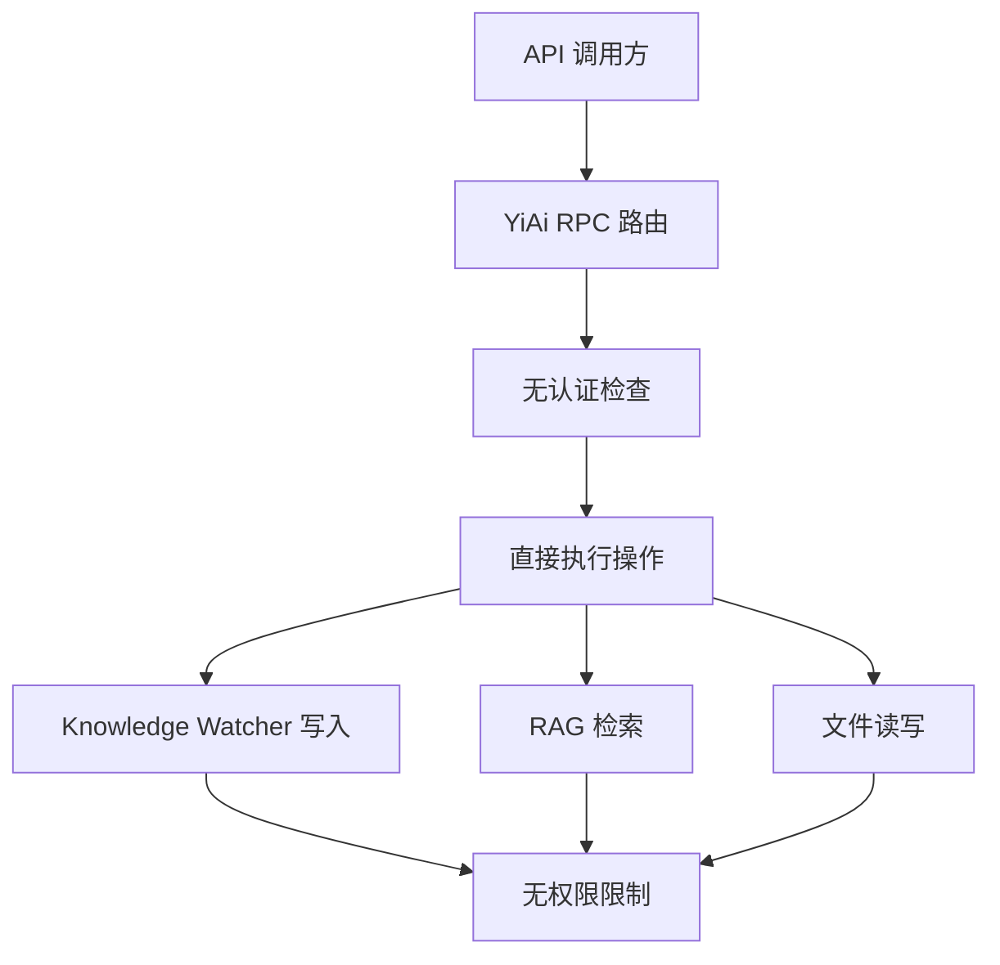
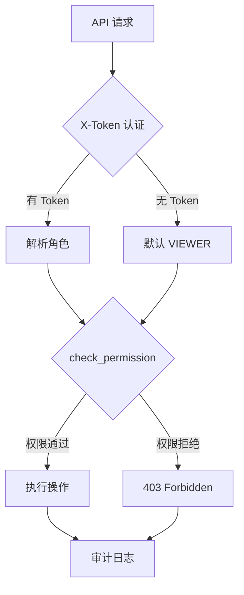

# YK-09-17: 知识库访问控制与权限模型 -- 角色级读写与审批流程

> 需求编号：YK-09-17 . 优先级：P2 . 人天：1.0d . 状态：需求已编写

## 背景

YiKnowledge 作为 Git 仓库管理知识文件，权限依赖 GitHub 仓库权限。但 YiAi 的 RAG 检索和 Knowledge Watcher 修改操作缺少细粒度权限：当前所有 API 调用方均可读写所有知识文件。

### 1.1 问题识别

| 场景 | 风险 | 当前状态 |
|------|------|----------|
| 任意用户修改治理文件 | 破坏知识库规则 | 无保护 |
| 任意用户修改同义词表 | 影响 RAG 检索质量 | 无保护 |
| 任意用户归档/删除知识文件 | 知识丢失 | 依赖 Git 恢复 |
| 无操作审计 | 无法追溯谁做了什么修改 | 依赖 Git log |
| RAG 检索无认证 | 匿名用户可检索所有知识 | 无控制 |

### 1.2 业务影响

| 影响维度 | 严重程度 | 描述 |
|------|----------|------|
| 知识完整性 | 高 | 无权限控制导致意外修改 |
| 治理合规 | 中 | 治理文件可被任意修改 |
| 审计追溯 | 中 | 无法区分不同角色的操作 |
| 安全合规 | 低 | 当前内部使用，外部威胁低 |

---

## 二、现状分析

### 2.1 当前权限模型



### 2.2 根因分析矩阵

| 根因 | 表现 | 影响范围 | 修复难度 |
|------|------|----------|----------|
| 无角色定义 | 所有用户权限相同 | 所有操作 | 低 |
| 无敏感路径保护 | 治理文件可被任意修改 | 治理文件 | 低 |
| 无操作审计 | 无法追溯操作来源 | 所有修改操作 | 中 |
| 无认证集成 | API 调用方身份未知 | 所有 API | 中 |

---

## 三、设计决策

### 决策 1：权限模型 -- ACL vs RBAC vs ABAC

| 选项 | 灵活性 | 复杂度 | 维护成本 | 适用场景 |
|------|--------|--------|----------|----------|
| ACL (用户-资源直接映射) | 低 | 低 | 高 | 小团队 |
| **RBAC (角色-权限映射)** | 中 | 中 | 中 | 中型团队 |
| ABAC (属性-策略) | 高 | 高 | 高 | 大型组织 |
| 无权限（当前） | 无 | 无 | 无 | 单人 |

**选择：RBAC (Role-Based Access Control)。** 5 个角色覆盖所有场景，实现简单，维护成本低。

### 决策 2：认证方式 -- X-Token JWT vs 无认证 vs OAuth

| 选项 | 安全性 | 实现复杂度 | 用户体验 |
|------|--------|-----------|----------|
| **X-Token JWT（已有）** | 中 | 低（复用现有） | 好 |
| 无认证 + 默认角色 | 低 | 最低 | 最好 |
| OAuth/GitHub | 高 | 高 | 中 |

**选择：复用 YiAi 现有 X-Token JWT 认证。** 默认无认证时分配 VIEWER 角色，需要写权限时提供 Token。

### 决策 3：敏感路径保护 -- 白名单 vs 黑名单 vs 角色检查

| 选项 | 安全性 | 误拦截率 | 维护成本 |
|------|--------|----------|----------|
| 白名单（仅 Curator+ 可修改） | 高 | 中 | 中 |
| 黑名单（禁止修改列表） | 中 | 低 | 低 |
| **角色检查（敏感路径 + CURATOR 角色）** | 高 | 低 | 低 |

**选择：敏感路径列表 + CURATOR 角色检查。** 明确列出敏感路径，仅 CURATOR 和 ADMIN 可修改。

---

## 四、目标架构

### 4.1 权限模型



### 4.2 核心指标

| 指标 | 当前 | 目标 | 测量方式 |
|------|------|------|----------|
| 权限拒绝率 | 0% | < 5% | 403 响应比例 |
| 敏感路径修改审计覆盖率 | 0% | 100% | 审计日志 |
| 角色分配准确率 | 无 | > 95% | 定期审查 |

---

## 五、具体改动

### 5.1 文件变更清单

| 文件 | 操作 | 说明 |
|------|------|------|
| `YiAi/src/domain/knowledge/permissions.py` | 新增 | 角色 + 权限定义 + 检查逻辑 |
| `YiAi/src/domain/knowledge/audit.py` | 新增 | 操作审计日志 |
| `YiAi/src/server/middleware/auth.py` | 修改 | 集成权限检查 |
| `YiAi/tests/domain/knowledge/test_permissions.py` | 新增 | 权限测试 |

### 5.2 核心代码

```python
# YiAi/src/domain/knowledge/permissions.py

from enum import Enum
from typing import Optional
import logging

logger = logging.getLogger(__name__)

class Role(str, Enum):
    VIEWER = "viewer"      # 只读--RAG 检索
    AUTHOR = "author"      # 读写自己的文件
    REVIEWER = "reviewer"  # 审查 + 读写
    CURATOR = "curator"    # 全部权限 + 治理
    ADMIN = "admin"        # 系统管理

class Permission(str, Enum):
    READ = "read"          # RAG 检索、文件读取
    WRITE = "write"        # 文件创建/修改/删除
    REVIEW = "review"      # 审查标记
    GOVERN = "govern"      # 状态管理、归档
    ADMIN = "admin"        # 系统配置

# 角色 → 权限映射
ROLE_PERMISSIONS: dict[Role, set[Permission]] = {
    Role.VIEWER:   {Permission.READ},
    Role.AUTHOR:   {Permission.READ, Permission.WRITE},
    Role.REVIEWER: {Permission.READ, Permission.WRITE, Permission.REVIEW},
    Role.CURATOR:  {Permission.READ, Permission.WRITE, Permission.REVIEW,
                    Permission.GOVERN},
    Role.ADMIN:    {Permission.READ, Permission.WRITE, Permission.REVIEW,
                    Permission.GOVERN, Permission.ADMIN},
}

# 敏感目录--仅 Curator+ 可修改
RESTRICTED_PATHS = [
    'curator/governance/',       # 治理文件
    'MEMORY.md',                 # 规则手册
    'INDEX.md',                  # 导航索引
    '_redirects.yml',            # 重定向配置
    'synonyms.yml',              # 同义词表
    'tag_governance.yml',        # 标签治理配置
    'templates/',                # 模板目录
    'README.md',                 # 项目说明
]

# 角色层级（用于判断"至少"某角色）
ROLE_HIERARCHY = {
    Role.VIEWER: 0,
    Role.AUTHOR: 1,
    Role.REVIEWER: 2,
    Role.CURATOR: 3,
    Role.ADMIN: 4,
}

def check_permission(
    user_role: Role,
    required: Permission,
    file_path: str = '',
    owner: Optional[str] = None,
    username: Optional[str] = None,
) -> bool:
    """检查用户是否有权限执行操作。

    Args:
        user_role: 用户角色
        required: 所需权限
        file_path: 文件路径（用于敏感目录检查）
        owner: 文件所有者（AUTHOR 角色仅能修改自己的文件）
        username: 当前用户名

    Returns:
        True 如果有权限
    """
    # 1. 检查角色是否有此权限
    if required not in ROLE_PERMISSIONS.get(user_role, set()):
        logger.debug(f"[Permission] 角色 {user_role} 无 {required} 权限")
        return False

    # 2. AUTHOR 角色仅能修改自己的文件
    if (user_role == Role.AUTHOR
        and required in (Permission.WRITE, Permission.REVIEW)
        and owner and username
        and owner != username):
        logger.debug(f"[Permission] AUTHOR {username} 不能修改 {owner} 的文件")
        return False

    # 3. 敏感目录额外保护--仅 Curator+ 可修改
    if required in (Permission.WRITE, Permission.GOVERN, Permission.ADMIN):
        if any(file_path.startswith(p) for p in RESTRICTED_PATHS):
            if user_role not in (Role.CURATOR, Role.ADMIN):
                logger.warning(
                    f"[Permission] 拒绝 {user_role} 修改敏感路径: {file_path}"
                )
                return False

    return True

def is_at_least(user_role: Role, minimum: Role) -> bool:
    """检查角色是否 >= 某角色层级。"""
    return ROLE_HIERARCHY.get(user_role, -1) >= ROLE_HIERARCHY.get(minimum, 999)

def get_default_role() -> Role:
    """获取默认角色（无认证时）。"""
    return Role.VIEWER
```

### 5.3 权限矩阵

| 操作 | VIEWER | AUTHOR | REVIEWER | CURATOR | ADMIN |
|------|--------|--------|----------|---------|-------|
| RAG 检索知识库 | YES | YES | YES | YES | YES |
| 浏览知识文件 | YES | YES | YES | YES | YES |
| 创建/编辑文件 | NO | YES (自己的) | YES | YES | YES |
| 删除文件 | NO | NO | YES | YES | YES |
| 审查标记 (approve/reject) | NO | NO | YES | YES | YES |
| 修改治理文件 | NO | NO | NO | YES | YES |
| 修改同义词表/重定向 | NO | NO | NO | YES | YES |
| 归档文件 | NO | NO | NO | YES | YES |
| 系统配置 | NO | NO | NO | NO | YES |
| 查看审计日志 | NO | NO | NO | YES | YES |

### 5.4 审计日志

```python
# YiAi/src/domain/knowledge/audit.py

from datetime import datetime
from typing import Optional

class AuditLogger:
    """操作审计日志--记录所有知识库修改操作。"""

    async def log(self, action: str, user: str, role: str,
                  file_path: str, details: Optional[dict] = None,
                  success: bool = True):
        """记录审计日志。"""
        entry = {
            'timestamp': datetime.utcnow(),
            'action': action,
            'user': user,
            'role': role,
            'file_path': file_path,
            'details': details or {},
            'success': success,
            'ip': self._get_client_ip(),
        }
        await self._db.knowledge_audit_logs.insert_one(entry)
        logger.info(f"[Audit] {user}({role}) {action} {file_path} "
                    f"{'OK' if success else 'DENIED'}")

    async def query(self, file_path: str = None, user: str = None,
                    days: int = 30, limit: int = 50) -> list[dict]:
        """查询审计日志。"""
        cutoff = datetime.utcnow() - timedelta(days=days)
        filt = {'timestamp': {'$gte': cutoff}}
        if file_path:
            filt['file_path'] = file_path
        if user:
            filt['user'] = user

        return await self._db.knowledge_audit_logs.find(filt) \
            .sort('timestamp', -1).limit(limit).to_list(None)
```

### 5.5 API 集成

```python
# YiAi/src/server/middleware/auth.py 中集成

from domain.knowledge.permissions import (
    Role, Permission, check_permission, get_default_role
)

async def check_knowledge_permission(
    request: Request,
    required: Permission,
    file_path: str = '',
    owner: str = None,
) -> None:
    """知识库权限中间件。"""
    token = request.headers.get('X-Token')
    user_role = get_default_role()
    username = 'anonymous'

    if token:
        # 解析 JWT Token（复用现有认证逻辑）
        payload = decode_jwt(token)
        if payload:
            user_role = Role(payload.get('role', 'viewer'))
            username = payload.get('username', 'unknown')

    if not check_permission(user_role, required, file_path, owner, username):
        raise HTTPException(
            status_code=403,
            detail=f"权限不足: {user_role} 角色无 {required} 权限"
        )

    # 记录审计日志
    request.state.user_role = user_role
    request.state.username = username
```

---

## 六、实施步骤

| 步骤 | 内容 | 验证方式 | 人天 |
|------|------|----------|------|
| 1 | 定义 5 角色 + 5 权限枚举 | 代码审查 | 0.05 |
| 2 | 实现 `check_permission()` | 单元测试：所有角色/权限组合 | 0.15 |
| 3 | 定义 `RESTRICTED_PATHS` 敏感路径 | Curator 确认路径列表 | 0.05 |
| 4 | 实现审计日志 | 集成测试：操作记录写入 MongoDB | 0.1 |
| 5 | 集成到 API 中间件 | 集成测试：403 响应验证 | 0.15 |
| 6 | 集成到 Knowledge Watcher 写入路径 | 集成测试：敏感路径写入被拒 | 0.1 |
| 7 | 集成到 YiVad 前端权限展示 | E2E 测试：不同角色看到不同操作按钮 | 0.2 |
| 8 | 实现审计日志查询 API | API 测试 | 0.1 |
| 9 | 默认角色分配策略 | 文档 + 初始配置 | 0.1 |

---

## 七、性能分析

| 操作 | 耗时 | 说明 |
|------|------|------|
| `check_permission()` | < 0.1ms | 纯内存操作 |
| JWT 解析 | < 5ms | 已有实现 |
| 审计日志写入 | < 5ms | MongoDB insert_one |
| 审计日志查询 (50 条) | < 20ms | MongoDB find + sort |

**容量规划**：
- 审计日志增长：约 100 条/天（开发活跃期），36500 条/年 ≈ 10MB

---

## 八、测试规格

#### Scenario: Viewer 可以 RAG 检索

- **Given** user_role = VIEWER
- **When** `check_permission(Role.VIEWER, Permission.READ)`
- **Then** 返回 True

#### Scenario: Author 不能修改治理文件

- **Given** user_role = AUTHOR, file_path = "curator/governance/readiness-checklist.md"
- **When** `check_permission(Role.AUTHOR, Permission.WRITE, file_path)`
- **Then** 返回 False (敏感目录需 Curator+)

#### Scenario: Curator 可修改治理文件

- **Given** user_role = CURATOR, file_path = "curator/governance/readiness-checklist.md"
- **When** `check_permission(Role.CURATOR, Permission.WRITE, file_path)`
- **Then** 返回 True

#### Scenario: Viewer 没有写权限

- **Given** user_role = VIEWER
- **When** `check_permission(Role.VIEWER, Permission.WRITE)`
- **Then** 返回 False

#### Scenario: AUTHOR 不能修改他人文件

- **Given** user_role = AUTHOR, username = "李华", owner = "陈铭"
- **When** `check_permission(Role.AUTHOR, Permission.WRITE, owner="陈铭", username="李华")`
- **Then** 返回 False

#### Scenario: 无认证默认 VIEWER

- **Given** 请求无 X-Token
- **When** 中间件解析角色
- **Then** 分配 VIEWER 角色

#### Scenario: 审计日志记录

- **Given** CURATOR 修改了治理文件
- **When** 操作执行
- **Then** 审计日志包含 user/role/action/file_path 和时间戳

---

## 九、风险与缓解

| 风险 | 概率 | 影响 | 缓解措施 |
|------|------|------|----------|
| 权限过严导致合法操作被拒 | 低 | 中 | 敏感目录可配置，默认仅保护治理文件 |
| 角色分配不准确 | 低 | 低 | 默认 VIEWER，按需提升 |
| 审计日志膨胀 | 低 | 低 | 90 天自动清理旧日志 |
| Token 泄露导致越权 | 低 | 高 | JWT 过期时间 24h，HTTPS 传输 |

---

## 十、回滚策略

| 场景 | 回滚方式 | 回滚时间 |
|------|----------|----------|
| 权限过严导致大量操作被拒 | 放宽敏感路径列表 | < 1min |
| 审计日志写入性能问题 | 异步写入审计日志 | < 1min |
| 角色分配错误 | 手动修正用户角色 | < 1min |

---

## 十一、设计决策记录

### D-01: 5 角色 RBAC 模型

**决策**：5 个角色（VIEWER/AUTHOR/REVIEWER/CURATOR/ADMIN）覆盖所有权限场景。
**理由**：角色数量适中，权限层级清晰，实现简单。足够覆盖 YiKnowledge 当前和近期的权限需求。
**权衡**：不支持用户自定义角色，但当前团队规模不需要。
**替代方案**：ACL 被拒绝（维护成本高），ABAC 被拒绝（过度设计）。

### D-02: 敏感路径列表而非全路径权限

**决策**：仅对敏感路径施加额外权限限制，普通文件保持宽松。
**理由**：知识库的核心价值在于开放性，过度限制会阻碍贡献。仅保护关键治理文件。
**权衡**：普通知识文件可能被误修改，但可通过 Git 恢复。
**替代方案**：全路径权限控制被拒绝（过于复杂，阻碍协作）。

### D-03: 默认 VIEWER 角色

**决策**：无认证时默认分配 VIEWER 角色。
**理由**：RAG 检索是知识库的核心价值，不应因权限阻碍匿名访问。写操作需要认证。
**权衡**：匿名用户可以检索所有知识，但内部知识库无敏感信息。
**替代方案**：强制认证被拒绝（阻碍 RAG 检索的便捷性）。

---

## 十二、可观测性

| 指标 | 采集方式 | 告警阈值 | 说明 |
|------|----------|----------|------|
| 权限拒绝次数 | 审计日志 | > 10 次/小时 | 权限配置问题或攻击 |
| 敏感目录修改次数 | 审计日志 | 手动审查 | 变更频率异常 |
| 审计日志写入失败率 | 日志错误 | > 0 | MongoDB 不可用 |

**告警规则**：
1. 权限拒绝 > 10 次/小时 → Slack 通知 Curator
2. 审计日志写入失败 → PagerDuty 告警

---

## 十三、安全合规

| 要求 | 实现 |
|------|------|
| 最小权限原则 | 默认 VIEWER，按需提升 |
| 操作可审计 | 所有修改操作记录到 audit_logs |
| 敏感路径保护 | RESTRICTED_PATHS 仅 Curator+ 可修改 |
| Token 安全 | JWT 24h 过期，HTTPS 传输 |

---

## 十四、代码审查检查清单

- [ ] 5 个角色层次：VIEWER < AUTHOR < REVIEWER < CURATOR < ADMIN
- [ ] `RESTRICTED_PATHS` 包含治理文件、规则手册、重定向、同义词表、模板目录
- [ ] Knowledge Watcher 写入前调用 `check_permission`
- [ ] RAG 检索仅需 READ 权限（无需认证，默认 VIEWER）
- [ ] 权限拒绝时返回 403 + 明确错误信息
- [ ] 审计日志记录所有修改操作
- [ ] AUTHOR 角色仅能修改自己的文件
- [ ] `is_at_least()` 支持层级比较
- [ ] 审计日志 90 天自动清理
- [ ] JWT 解析失败时降级为 VIEWER（非 500 错误）

---

*PRD 来源: `projects/yiknowledge/requirements/2026-09/17-需求-知识库访问控制.md`*