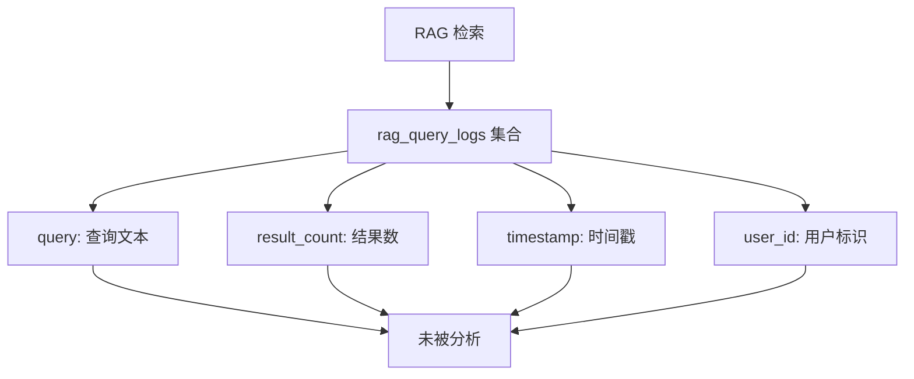
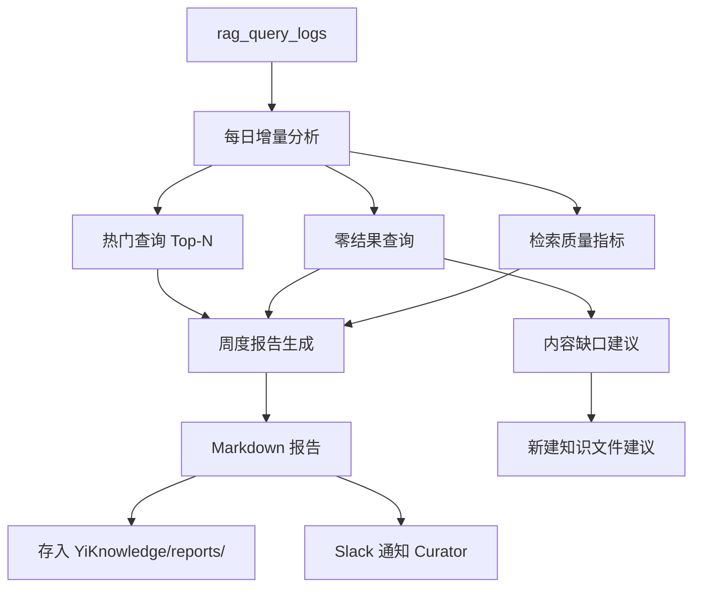

# YK-09-18: 知识库搜索分析与趋势洞察 -- 热门查询与内容缺口识别

> 需求编号：YK-09-18 . 优先级：P2 . 人天：0.5d . 状态：需求已编写

## 背景

YiKnowledge 通过 RAG 检索日志积累了用户查询数据，但从未被分析利用。分析搜索数据可以发现：用户最常搜索什么（热门查询）、搜索无结果的主题（内容缺口）、搜索行为趋势（指导知识库建设方向）。

### 1.1 问题识别

| 问题 | 当前状态 | 业务影响 |
|------|----------|----------|
| 不知道用户搜索什么 | 检索日志存在但不分析 | 知识库建设无数据支撑 |
| 不知道缺少什么内容 | 零结果查询被忽略 | 内容缺口持续存在 |
| 不知道搜索趋势 | 无趋势分析 | 无法预判知识需求方向 |
| 不知道搜索质量 | 无搜索质量报表 | 无法评估检索优化效果 |

### 1.2 业务价值

| 维度 | 价值 |
|------|------|
| 内容规划 | 基于热门查询和内容缺口指导知识文件创建优先级 |
| 检索优化 | 基于零结果分析改进同义词表和检索参数 |
| 趋势预警 | 发现新兴技术话题，提前准备知识内容 |
| 质量度量 | 零结果率、平均结果数作为知识库健康指标 |

---

## 二、现状分析

### 2.1 数据源



### 2.2 根因分析矩阵

| 根因 | 表现 | 影响范围 | 修复难度 |
|------|------|----------|----------|
| 无分析工具 | 日志数据沉睡 | 知识库建设 | 低 |
| 无内容缺口识别 | 零结果查询被忽略 | 用户体验 | 低 |
| 无趋势度量 | 搜索行为不可见 | 产品决策 | 低 |
| 无周期性报告 | 无定期分析输出 | 持续改进 | 低 |

---

## 三、设计决策

### 决策 1：分析方式 -- 实时 vs 定时批处理 vs 按需

| 选项 | 数据新鲜度 | 计算开销 | 实现复杂度 |
|------|-----------|----------|-----------|
| 实时 (每次查询) | 最高 | 高 | 中 |
| **定时批处理 (每日/每周)** | 中 | 低 | 低 |
| 按需 (手动触发) | 低 | 低 | 最低 |

**选择：定时批处理。** 每日增量分析 + 每周生成趋势报告。搜索分析不需要实时性，批处理成本低。

### 决策 2：内容缺口匹配 -- 无匹配 vs 模糊匹配 vs 建议匹配

| 选项 | 精准度 | 覆盖率 | 实现复杂度 |
|------|--------|--------|-----------|
| 无匹配（仅列出零结果查询） | 高 | 仅精确零结果 | 低 |
| **模糊匹配 + 建议已有内容** | 中 | 高 | 中 |
| 全量 LLM 分析 | 高 | 最高 | 高 |

**选择：模糊匹配 + 建议已有内容。** 查询零结果但存在相似内容时，建议已有文档作为替代。

### 决策 3：报告输出 -- 仅 API vs Markdown 报告 vs 仪表盘

| 选项 | 可读性 | 可分享性 | 自动化 |
|------|--------|----------|--------|
| 仅 API | 低 | 需要前端 | 高 |
| **Markdown 报告** | 高 | 高（存为知识文件） | 高 |
| 仪表盘 | 最高 | 中 | 高 |

**选择：Markdown 周度报告。** 报告作为知识文件存入 YiKnowledge，可被 RAG 检索、Git 版本控制。

---

## 四、目标架构

### 4.1 分析流程



### 4.2 核心指标

| 指标 | 当前 | 目标 | 测量方式 |
|------|------|------|----------|
| 零结果率 | 无测量 | < 5% | 零结果查询 / 总查询 |
| 周搜索量 | 无测量 | 持续增长 | 每周查询总数 |
| 内容缺口处理率 | 0% | > 50% | 缺口被新建文件覆盖的比例 |
| 平均结果数 | 无测量 | 3-5 条 | 每次查询返回结果数均值 |

---

## 五、具体改动

### 5.1 文件变更清单

| 文件 | 操作 | 说明 |
|------|------|------|
| `YiAi/src/services/knowledge/search_analytics.py` | 新增 | 搜索分析服务 |
| `YiAi/src/domain/knowledge/content_gap.py` | 新增 | 内容缺口识别 |
| `YiAi/src/services/knowledge/report_generator.py` | 新增 | 周度报告生成 |
| `YiAi/tests/services/knowledge/test_search_analytics.py` | 新增 | 分析服务测试 |

### 5.2 核心代码

```python
# YiAi/src/services/knowledge/search_analytics.py

from collections import Counter
from datetime import datetime, timedelta

class SearchAnalytics:
    """搜索分析--热门查询与内容缺口识别。"""

    def __init__(self, db, global_search=None):
        self._db = db
        self._global_search = global_search

    async def top_queries(self, days: int = 7, limit: int = 20) -> list[dict]:
        """最近 N 天的热门搜索查询。"""
        cutoff = datetime.utcnow() - timedelta(days=days)
        pipeline = [
            {"$match": {
                "timestamp": {"$gte": cutoff},
                "type": "rag_query",
            }},
            {"$group": {
                "_id": "$query_normalized",
                "count": {"$sum": 1},
                "avg_results": {"$avg": "$result_count"},
                "avg_latency_ms": {"$avg": "$latency_ms"},
                "unique_users": {"$addToSet": "$user_id"},
                "last_searched": {"$max": "$timestamp"},
            }},
            {"$sort": {"count": -1}},
            {"$limit": limit},
        ]
        results = await self._db.rag_query_logs.aggregate(pipeline).to_list(None)

        for r in results:
            r['unique_user_count'] = len(r.get('unique_users', []))
            r.pop('unique_users', None)

        return results

    async def zero_result_queries(self, days: int = 30,
                                  limit: int = 30) -> list[dict]:
        """内容缺口--搜索返回 0 结果的查询。"""
        cutoff = datetime.utcnow() - timedelta(days=days)
        pipeline = [
            {"$match": {
                "timestamp": {"$gte": cutoff},
                "result_count": 0,
                "type": "rag_query",
            }},
            {"$group": {
                "_id": "$query_normalized",
                "count": {"$sum": 1},
                "last_searched": {"$max": "$timestamp"},
            }},
            {"$sort": {"count": -1}},
            {"$limit": limit},
        ]
        gaps = await self._db.rag_query_logs.aggregate(pipeline).to_list(None)

        # 为每个缺口查找已有文档中最接近的主题
        for gap in gaps:
            similar = await self._find_similar_content(gap["_id"])
            gap["suggested_existing"] = similar
            gap["priority"] = self._calculate_priority(gap)

        return gaps

    async def trend_summary(self, days: int = 7) -> dict:
        """搜索趋势摘要。"""
        now = datetime.utcnow()
        this_period = now - timedelta(days=days)
        last_period_start = now - timedelta(days=days * 2)
        last_period_end = this_period

        this_week = await self._query_count(this_period, now)
        last_week = await self._query_count(last_period_start, last_period_end)

        zero_rate = await self._zero_result_rate(days)

        return {
            "period": f"{days}d",
            "total_queries": this_week,
            "period_over_period_change": round(
                ((this_week - last_week) / max(last_week, 1)) * 100, 1
            ),
            "zero_result_rate": round(zero_rate, 2),
            "avg_results_per_query": await self._avg_results(days),
            "unique_queries": await self._unique_queries(days),
            "unique_users": await self._unique_users(days),
            "top_growing_queries": await self._top_growing(days),
            "top_declining_queries": await self._top_declining(days),
        }

    async def _find_similar_content(self, query: str,
                                   limit: int = 3) -> list[dict]:
        """为内容缺口找已有文档中 tags 最接近的主题。"""
        if not self._global_search:
            return []

        results = await self._global_search(
            query, collections=["knowledge_files"], limit=limit
        )
        return [
            {"title": r["title"], "path": r["path"],
             "score": round(r.get("score", 0), 3)}
            for r in results.get("results", [])
        ]

    def _calculate_priority(self, gap: dict) -> str:
        """计算内容缺口优先级。"""
        count = gap.get("count", 0)
        if count >= 10:
            return "high"
        if count >= 5:
            return "medium"
        return "low"

    async def _query_count(self, start, end) -> int:
        return await self._db.rag_query_logs.count_documents({
            "timestamp": {"$gte": start, "$lt": end},
            "type": "rag_query",
        })

    async def _zero_result_rate(self, days: int) -> float:
        total = await self._query_count(
            datetime.utcnow() - timedelta(days=days), datetime.utcnow()
        )
        if total == 0:
            return 0.0
        zero = await self._db.rag_query_logs.count_documents({
            "timestamp": {"$gte": datetime.utcnow() - timedelta(days=days)},
            "result_count": 0,
            "type": "rag_query",
        })
        return zero / total * 100

    async def _avg_results(self, days: int) -> float:
        pipeline = [
            {"$match": {
                "timestamp": {"$gte": datetime.utcnow() - timedelta(days=days)},
                "type": "rag_query",
            }},
            {"$group": {"_id": None, "avg": {"$avg": "$result_count"}}},
        ]
        result = await self._db.rag_query_logs.aggregate(pipeline).to_list(1)
        return round(result[0]["avg"], 1) if result else 0.0

    async def _unique_queries(self, days: int) -> int:
        return len(await self._db.rag_query_logs.distinct(
            "query_normalized",
            {"timestamp": {"$gte": datetime.utcnow() - timedelta(days=days)}},
        ))

    async def _unique_users(self, days: int) -> int:
        return len(await self._db.rag_query_logs.distinct(
            "user_id",
            {"timestamp": {"$gte": datetime.utcnow() - timedelta(days=days)}},
        ))

    async def _top_growing(self, days: int, limit: int = 5) -> list[dict]:
        """增长最快的查询。"""
        now = datetime.utcnow()
        this_start = now - timedelta(days=days)
        last_start = now - timedelta(days=days * 2)

        this_counts = await self._query_counts_by_query(this_start, now)
        last_counts = await self._query_counts_by_query(last_start, this_start)

        growth = []
        for query, count in this_counts.items():
            last_count = last_counts.get(query, 0)
            if last_count > 0:
                growth_pct = round((count - last_count) / last_count * 100, 1)
                growth.append({
                    "query": query, "this_period": count,
                    "last_period": last_count, "growth_pct": growth_pct,
                })

        growth.sort(key=lambda x: x["growth_pct"], reverse=True)
        return growth[:limit]
```

### 5.3 周度报告格式

```markdown
## 知识库周度搜索报告 (2026-W37)

### 概览
- 周搜索量: 1,245 (+15% vs 上周)
- 零结果率: 4.2% (健康, < 5% 目标)
- 平均结果数: 3.8 条/查询
- 独立查询数: 342
- 独立用户数: 28

### 热门查询 Top 10
1. "RAG 混合检索" (45 次, 平均 4.2 结果)
2. "限流策略" (38 次, 平均 2.1 结果)
3. "MongoDB 连接池" (32 次, 平均 5.0 结果)
...

### 内容缺口 (搜索无结果 Top 5)
1. "WebSocket 实时通信" (12 次) → 建议新建 `srer/realtime/websocket-guide.md`
2. "gRPC vs REST" (8 次) → 已有相关: `engineer/api-design.md`
3. "多租户架构" (6 次) → 无相关内容--高优先级缺口
...

### 增长最快查询
1. "LangChain" (↑ 200% vs 上周)
2. "向量数据库选型" (↑ 150%)
...

### 检索质量
- 平均延迟: 120ms
- 空结果率: 4.2%
- 有结果但无点击: 12%
```

---

## 六、实施步骤

| 步骤 | 内容 | 验证方式 | 人天 |
|------|------|----------|------|
| 1 | 实现 `SearchAnalytics.top_queries()` | 聚合管道测试 | 0.1 |
| 2 | 实现 `zero_result_queries()` + 内容缺口匹配 | 零结果查询 + 相似内容建议 | 0.1 |
| 3 | 实现 `trend_summary()` | 趋势数据对比验证 | 0.1 |
| 4 | 实现周度报告生成 | Markdown 报告格式验证 | 0.1 |
| 5 | 配置 apscheduler 每周一生成报告 | 调度验证 | 0.05 |
| 6 | 报告存入 YiKnowledge/reports/ | 文件存在性检查 | 0.05 |

---

## 七、性能分析

| 操作 | 数据量 | 耗时 | 说明 |
|------|--------|------|------|
| `top_queries(7d)` | ~1000 条日志 | < 50ms | MongoDB 聚合管道 |
| `zero_result_queries(30d)` | ~5000 条日志 | < 100ms | 含相似内容搜索 |
| `trend_summary(7d)` | ~2000 条日志 | < 200ms | 多次聚合查询 |
| 周度报告生成 | 全量 | < 500ms | 一次完整的分析流程 |

---

## 八、测试规格

#### Scenario: 热门查询 Top-N

- **Given** 日志中有 45 次 "RAG 混合检索", 38 次 "限流策略"
- **When** `top_queries(days=7, limit=10)`
- **Then** 返回按 count 降序排列, 首位为 "RAG 混合检索"

#### Scenario: 零结果查询--内容缺口

- **Given** 日志中 "WebSocket" 查询 12 次, 全部 result_count=0
- **When** `zero_result_queries(days=30)`
- **Then** 返回包含 `{"_id": "WebSocket", "count": 12, "suggested_existing": [...]}`

#### Scenario: 趋势摘要--周环比

- **Given** 本周 1245 次查询, 上周 1082 次
- **When** `trend_summary(days=7)`
- **Then** `period_over_period_change` = 15.1%

#### Scenario: 时间范围过滤

- **Given** `days=3` 的参数
- **When** `top_queries(days=3)`
- **Then** 仅统计最近 3 天的查询

#### Scenario: 内容缺口优先级计算

- **Given** 缺口查询 12 次
- **When** `_calculate_priority(gap)`
- **Then** 返回 "high"

#### Scenario: 增长最快的查询

- **Given** "LangChain" 本周 30 次 vs 上周 10 次
- **When** `_top_growing(days=7)`
- **Then** 返回包含 `{"query": "LangChain", "growth_pct": 200.0}`

---

## 九、风险与缓解

| 风险 | 概率 | 影响 | 缓解措施 |
|------|------|------|----------|
| 聚合查询超时 | 低 | 中 | 设置 `maxTimeMS=30s` 超时保护 |
| 日志数据量增长 | 中 | 低 | 90 天自动清理旧日志 |
| 内容缺口误报 | 中 | 低 | 仅报告 count > 2 的缺口 |
| 周报过于频繁或太少 | 低 | 低 | 频率可配置 |

---

## 十、回滚策略

| 场景 | 回滚方式 | 回滚时间 |
|------|----------|----------|
| 聚合查询影响 MongoDB 性能 | 降低分析频率或暂停 | < 1min |
| 报告内容不准确 | 修复分析逻辑，重新生成报告 | < 10min |

---

## 十一、设计决策记录

### D-01: 周度 Markdown 报告

**决策**：每周生成一份 Markdown 格式的搜索报告，存入 `YiKnowledge/reports/`。
**理由**：Markdown 格式可被 RAG 检索、Git 版本控制、自动生成，无需额外前端开发。
**权衡**：不如仪表盘直观，但实现成本低。
**替代方案**：仪表盘被拒绝（需要前端开发，后续可扩展）。

### D-02: 内容缺口优先级

**决策**：基于查询次数自动分配优先级（>=10 高，>=5 中，<5 低）。
**理由**：高频率的零结果查询意味着大量用户有相同需求，应优先处理。
**权衡**：未考虑查询的业务重要性，后续可扩展。
**替代方案**：手动优先级评审被拒绝（无法自动化）。

### D-03: 查询归一化

**决策**：分析前对查询文本进行归一化（trim + lowercase）。
**理由**：避免 "RAG" 和 "rag" 被统计为不同查询。
**权衡**：可能合并了意图不同的查询，但影响极小。
**替代方案**：原始查询统计被拒绝（统计不准确）。

---

## 十二、可观测性

| 指标 | 采集方式 | 告警阈值 | 说明 |
|------|----------|----------|------|
| 零结果率 | `trend_summary()` | > 5% | 内容缺口扩大 |
| 周搜索量变化 | `trend_summary()` | 下降 > 30% | 用户参与度下降 |
| 高优先级缺口数 | `zero_result_queries()` | > 5 个 | 知识库覆盖不足 |
| 报告生成成功率 | 调度器状态 | 失败 | 分析服务异常 |

**告警规则**：
1. 零结果率 > 5% → Slack 通知 Curator
2. 周搜索量下降 > 30% → Slack 通知 Producter
3. 报告生成失败 → 重试 + Slack 通知

---

## 十三、代码审查检查清单

- [ ] `top_queries` 使用 MongoDB 聚合管道（`$match` + `$group` + `$sort`）
- [ ] `zero_result_queries` 筛选 `result_count: 0` 的日志
- [ ] 内容缺口的 `_find_similar_content` 复用全局搜索
- [ ] 周报可配置生成频率（默认每周一）
- [ ] 聚合查询设置 `maxTimeMS=30s` 超时保护
- [ ] 查询文本在统计前做归一化（trim + lowercase）
- [ ] 查询日志 90 天自动清理
- [ ] 周报作为知识文件存入 YiKnowledge
- [ ] 增长/下降趋势计算正确（除零保护）
- [ ] 内容缺口优先级计算逻辑正确

---

*PRD 来源: `projects/yiknowledge/requirements/2026-09/18-需求-搜索分析与趋势洞察.md`*