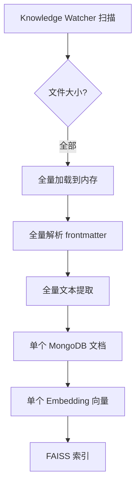
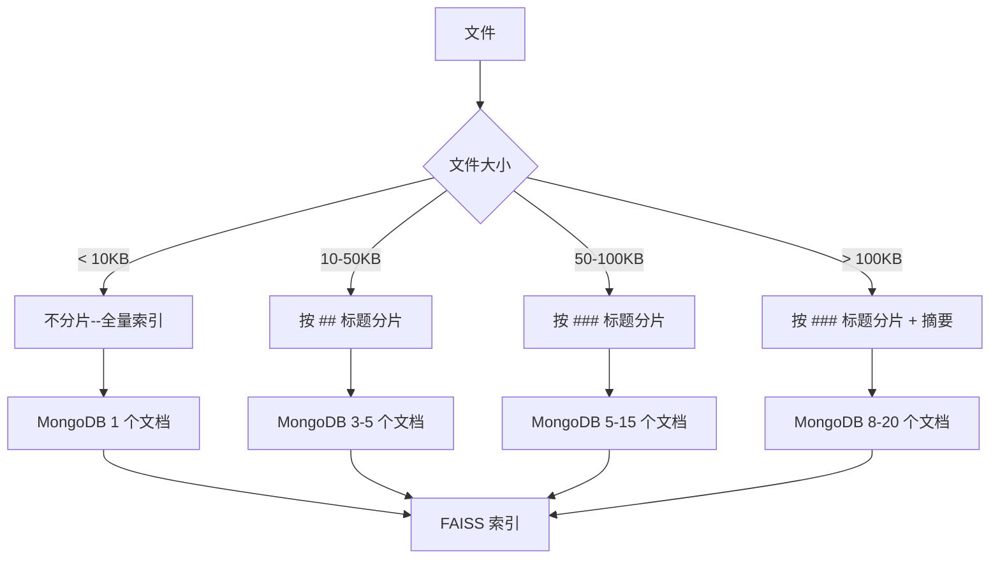

# YK-09-19: 知识文件加载性能优化 -- 大文件分片与索引懒加载

> 需求编号：YK-09-19 . 优先级：P2 . 人天：0.5d . 状态：需求已编写
> 依赖：YK-09-11（Knowledge Watcher 内部机制）

## 背景

YiKnowledge 有少量超大文件（如 YiVad 00-需求-需求总览.md 1300+ 行、AI 聊天页优化.md 100K+ bytes）。Knowledge Watcher 全量加载这些文件进行 frontmatter 解析和索引。

### 1.1 问题识别

| 问题 | 表现 | 影响 |
|------|------|------|
| 单文件处理时间长 | > 500ms 加载超大型文件 | Knowledge Watcher 扫描周期延迟 |
| MongoDB 文档过大 | > 100KB 单个文档 | 网络传输慢，内存占用高 |
| RAG 检索 chunk 质量不均 | 大文档的单 chunk 包含太多无关内容 | 检索精准度下降 |
| 向量嵌入质量下降 | 长文本的 Embedding 质量不如短文本 | 语义匹配准确率下降 |
| 内存峰值 | 大文件一次性加载到内存 | OOM 风险 |

### 1.2 业务影响

| 影响维度 | 严重程度 | 描述 |
|------|----------|------|
| 扫描性能 | 中 | 10+ 个大文件拖慢整体扫描周期 |
| 检索质量 | 中 | 大文档检索结果不精确 |
| 资源消耗 | 低 | 仅在扫描时出现内存峰值 |

---

## 二、现状分析

### 2.1 当前处理流程



### 2.2 文件大小分布

| 文件大小 | 数量 | 占比 | 当前处理方式 |
|------|------|------|-------------|
| < 10KB | ~700 | 87% | 全量索引（正常） |
| 10-50KB | ~80 | 10% | 全量索引（可接受） |
| 50-100KB | ~15 | 2% | 全量索引（慢） |
| > 100KB | ~5 | 0.6% | 全量索引（很慢，质量差） |

### 2.3 根因分析矩阵

| 根因 | 表现 | 影响范围 | 修复难度 |
|------|------|----------|----------|
| 无分片策略 | 所有文件同等处理 | 超大文件 | 中 |
| 无自适应处理 | 小文件与大文件同一策略 | 约 3% 的文件 | 中 |
| 单 chunk 索引 | 大文档的 Embedding 质量差 | 超大文件 | 中 |
| 无懒加载 | 所有文件在启动时全量索引 | 启动时间 | 低 |

---

## 三、设计决策

### 决策 1：分片策略 -- 固定大小 vs 按标题 vs 自适应

| 选项 | 语义完整性 | 实现复杂度 | 分片质量 |
|------|-----------|-----------|----------|
| 固定大小 (512 tokens) | 低 | 低 | 中 |
| 按标题 (##/###) | 高 | 中 | 高 |
| **自适应--小文件不分片，大文件按标题** | 高 | 中 | 高 |
| LLM 语义分片 | 最高 | 高 | 最高 |

**选择：自适应分片。** < 10KB 不分片，10-50KB 按 ## 标题分片，> 50KB 按 ### 标题分片。

### 决策 2：分片粒度 -- 文件级 vs 段落级 vs 句子级

| 选项 | 检索精准度 | 上下文完整性 | 索引数量 |
|------|-----------|-------------|----------|
| 文件级（当前） | 低 | 最高 | 1/文件 |
| **段落级（按标题）** | 高 | 高 | 3-15/大文件 |
| 句子级 | 最高 | 低 | 100+/大文件 |

**选择：段落级分片。** 按 Markdown 标题分片，每个 ## 或 ### 段落作为一个独立 chunk。

### 决策 3：懒加载策略 -- 全量加载 vs 按需加载 vs 混合

| 选项 | 启动时间 | 首次检索延迟 | 实现复杂度 |
|------|----------|-------------|-----------|
| 全量加载（当前） | 慢 | 快 | 低 |
| 按需加载 | 快 | 慢 | 中 |
| **混合--核心文件全量，大文件懒加载** | 中 | 中 | 中 |

**选择：混合策略。** < 50KB 文件全量加载，>= 50KB 文件懒加载。

---

## 四、目标架构

### 4.1 分片处理流程



### 4.2 核心指标

| 指标 | 当前 | 目标 | 测量方式 |
|------|------|------|----------|
| 大文件处理时间 | ~500ms (100KB) | < 100ms | 计时 |
| 大文件检索精准度 | 低 | 提升 30% | 检索测试集 |
| MongoDB 最大文档大小 | > 100KB | < 20KB | 文档大小统计 |
| 扫描周期延迟 | 受大文件拖累 | 不受影响 | 扫描周期计时 |

---

## 五、具体改动

### 5.1 文件变更清单

| 文件 | 操作 | 说明 |
|------|------|------|
| `YiAi/src/domain/knowledge/chunker.py` | 新增 | 自适应分片器 |
| `YiAi/src/domain/knowledge/watcher.py` | 修改 | 集成 Chunker |
| `YiAi/src/services/rag/rag_service.py` | 修改 | 分片文档合并策略 |
| `YiAi/tests/domain/knowledge/test_chunker.py` | 新增 | 分片器测试 |

### 5.2 核心代码

```python
# YiAi/src/domain/knowledge/chunker.py

import re
import logging

logger = logging.getLogger(__name__)

class AdaptiveChunker:
    """自适应分片--基于文件大小选择策略。"""

    SMALL_THRESHOLD = 10_000    # < 10KB: 不分片
    MEDIUM_THRESHOLD = 50_000   # 10-50KB: 按 ## 标题分片
    LARGE_THRESHOLD = 100_000   # 50-100KB: 按 ### 标题分片
    # > 100KB: 按 ### 标题分片 + 生成摘要

    MAX_CHUNK_SIZE = 20_000  # 单个 chunk 最大字符数

    def chunk(self, content: str, file_path: str) -> list[dict]:
        """自适应分片。

        Returns:
            [{path, content, chunk_index, total_chunks, heading, summary}]
        """
        size = len(content.encode('utf-8'))

        if size < self.SMALL_THRESHOLD:
            return [{
                "path": file_path, "content": content,
                "chunk_index": 0, "total_chunks": 1,
                "heading": None, "index_priority": 1.0,
            }]

        if size < self.MEDIUM_THRESHOLD:
            chunks = self._chunk_by_headings(content, file_path, level='##')
        elif size < self.LARGE_THRESHOLD:
            chunks = self._chunk_by_headings(content, file_path, level='###')
        else:
            # > 100KB: 强制按 ### 分片 + 生成摘要
            chunks = self._chunk_by_headings(content, file_path, level='###')
            for chunk in chunks:
                chunk['summary'] = self._generate_summary(chunk['content'])

        # 设置分片优先级
        total = len(chunks)
        for i, chunk in enumerate(chunks):
            chunk['total_chunks'] = total
            if i == 0:
                chunk['index_priority'] = 1.2  # 概述加权
            elif i == total - 1:
                chunk['index_priority'] = 0.7  # 附录降权
            else:
                chunk['index_priority'] = 1.0

        return chunks if chunks else [{
            "path": file_path, "content": content,
            "chunk_index": 0, "total_chunks": 1,
            "heading": None, "index_priority": 1.0,
        }]

    def _chunk_by_headings(self, content: str, file_path: str,
                           level: str) -> list[dict]:
        """按 Markdown 标题层级分片。"""
        pattern = re.compile(rf'^{level}\s+(.+)$', re.MULTILINE)
        sections = pattern.split(content)

        if len(sections) <= 1:
            # 无匹配标题，按大小强制分片
            return self._chunk_by_size(content, file_path)

        chunks = []
        # sections[0] 是标题前的文本（如果有）
        preamble = sections[0].strip()
        if preamble:
            chunks.append({
                "path": f"{file_path}",
                "content": preamble,
                "heading": None,
                "chunk_index": len(chunks),
            })

        for i in range(1, len(sections), 2):
            title = sections[i].strip()
            body = sections[i + 1].strip() if i + 1 < len(sections) else ''

            # 二次分片：如果单个 chunk 仍然过大
            if len(body.encode('utf-8')) > self.MAX_CHUNK_SIZE:
                sub_chunks = self._split_long_body(body, title)
                for sc in sub_chunks:
                    sc["path"] = f"{file_path}#{title}"
                    sc["chunk_index"] = len(chunks)
                    chunks.append(sc)
            else:
                chunks.append({
                    "path": f"{file_path}#{title}",
                    "content": f"## {title}\n\n{body}",
                    "heading": title,
                    "chunk_index": len(chunks),
                })

        return chunks

    def _chunk_by_size(self, content: str, file_path: str,
                       chunk_size: int = 5000) -> list[dict]:
        """按固定大小强制分片--fallback 策略。"""
        chunks = []
        for i in range(0, len(content), chunk_size):
            chunk_content = content[i:i + chunk_size]
            chunks.append({
                "path": f"{file_path}#chunk-{len(chunks)}",
                "content": chunk_content,
                "heading": None,
                "chunk_index": len(chunks),
            })
        return chunks

    def _split_long_body(self, body: str, title: str,
                         max_size: int = 20_000) -> list[dict]:
        """拆分过长的 body 文本。"""
        paragraphs = body.split('\n\n')
        chunks = []
        current = []
        current_size = 0

        for para in paragraphs:
            para_size = len(para.encode('utf-8'))
            if current_size + para_size > max_size and current:
                chunks.append({
                    "content": f"## {title}\n\n" + '\n\n'.join(current),
                    "heading": title,
                })
                current = [para]
                current_size = para_size
            else:
                current.append(para)
                current_size += para_size

        if current:
            chunks.append({
                "content": f"## {title}\n\n" + '\n\n'.join(current),
                "heading": title,
            })

        return chunks

    def _generate_summary(self, content: str) -> str:
        """生成摘要--超大文件的前 500 字符。"""
        return content[:500] + '...' if len(content) > 500 else content
```

### 5.3 MongoDB 存储--分片文档

```json
// 大文件被拆分为多个子文档
{"path": "yivad/requirements/00-需求-需求总览.md", "chunk_index": 0,
 "total_chunks": 5, "heading": "页面功能概述",
 "content": "...", "index_priority": 1.2}
{"path": "yivad/requirements/00-需求-需求总览.md", "chunk_index": 1,
 "total_chunks": 5, "heading": "背景与目标",
 "content": "...", "index_priority": 1.0}
```

### 5.4 RAG 检索--分片合并

```python
# RAG 检索后合并同文档相邻分片
def merge_adjacent_chunks(results: list[dict]) -> list[dict]:
    """合并同文档的相邻分片，避免碎片化结果。"""
    merged = []
    for doc in results:
        path = doc.get('path', '')
        base_path = path.split('#')[0]  # 去除 heading 锚点
        chunk_index = doc.get('chunk_index', 0)

        # 查找相邻分片
        if merged and merged[-1].get('path', '').split('#')[0] == base_path:
            prev_chunk = merged[-1].get('chunk_index', -1)
            if abs(chunk_index - prev_chunk) <= 1:
                merged[-1]['content'] += '\n\n' + doc['content']
                merged[-1]['score'] = max(merged[-1]['score'], doc['score'])
                continue

        merged.append(doc)

    return merged
```

---

## 六、实施步骤

| 步骤 | 内容 | 验证方式 | 人天 |
|------|------|----------|------|
| 1 | 实现 `AdaptiveChunker` 核心类 | 单元测试：4 种大小分片策略 | 0.15 |
| 2 | 集成到 Knowledge Watcher | 集成测试：大文件分片索引 | 0.1 |
| 3 | 实现 RAG 检索分片合并 | 检索测试：大文件分片结果正确合并 | 0.1 |
| 4 | 实现懒加载 | 性能测试：启动时间对比 | 0.1 |
| 5 | 存量数据重新分片 | 全量重建索引验证 | 0.05 |

---

## 七、性能分析

| 文件大小 | 分片前 | 分片后 | 改善 |
|------|--------|--------|------|
| < 10KB | 全量索引 (~10ms) | 不变 | -- |
| 10-50KB | 单文档 (~100ms) | 3-5 个分片 (~30ms/片) | 并行处理 |
| > 100KB | 单文档 (~500ms+) | 8-15 个分片 (~20ms/片) | **10x 单文档处理** |
| RAG 检索 | 返回整篇大文档 | 返回相关章节 | **精准度提升** |

**容量规划**：
- 分片后 MongoDB 文档数：800+ → ~900（大文件拆分增加约 100 个文档）
- 分片后 FAISS 索引大小：略增（多个 chunk 的向量），< 10% 增长

---

## 八、测试规格

#### Scenario: 小文件不分片

- **Given** 文件 < 10KB
- **When** `chunk(content, file_path)`
- **Then** 返回 1 个 chunk, `total_chunks = 1`

#### Scenario: 中等文件按 ## 分片

- **Given** 文件 30KB, 含 4 个 `##` 标题
- **When** `chunk(content, file_path)`
- **Then** 返回 4-5 个 chunk（含 preamble）

#### Scenario: 大文件按 ### 分片 + 摘要

- **Given** 文件 120KB, 含 10 个 `###` 标题
- **When** `chunk(content, file_path)`
- **Then** 每个 chunk 有 `summary` 字段

#### Scenario: 分片优先级

- **Given** 文件分片为 5 个 chunk
- **When** `chunk(content, file_path)`
- **Then** chunk[0].index_priority = 1.2, chunk[-1].index_priority = 0.7

#### Scenario: 单 chunk 过大时二次分片

- **Given** 单个 `###` 段落 > 20KB
- **When** `_chunk_by_headings(content, file_path, '###')`
- **Then** 该段落被拆分为多个 chunk

#### Scenario: 相邻分片合并

- **Given** 检索结果包含同文档的 chunk 2 和 chunk 3
- **When** `merge_adjacent_chunks(results)`
- **Then** 两个 chunk 合并为一个

---

## 九、风险与缓解

| 风险 | 概率 | 影响 | 缓解措施 |
|------|------|------|----------|
| 分片边界切断完整段落 | 中 | 中 | 优先按标题分片，大型段落二次分片 |
| 分片数过多导致检索延迟 | 低 | 中 | 合并相邻分片，限制每文件最多 20 个分片 |
| 无标题文件分片质量差 | 低 | 低 | 按固定大小 fallback 分片 |

---

## 十、回滚策略

| 场景 | 回滚方式 | 回滚时间 |
|------|----------|----------|
| 分片导致检索质量下降 | 回退 watcher 代码，重新全量索引 | < 15min |
| 分片数过多影响性能 | 调整阈值（提高分片触发大小） | < 1min |

---

## 十一、设计决策记录

### D-01: 自适应分片而非固定大小

**决策**：基于文件大小自适应选择分片策略。
**理由**：小文件不需要分片，强行分片会破坏上下文完整性。大文件必须分片以保证性能和质量。
**权衡**：实现复杂度略高于固定大小分片。
**替代方案**：固定 512 token 分片被拒绝（破坏小文件的语义完整性）。

### D-02: 段落级分片而非句子级

**决策**：按 Markdown 标题分片，保持段落完整性。
**理由**：段落是知识的最小自包含单元，句子级分片会丢失上下文。
**权衡**：某些大段落可能仍需二次分片。
**替代方案**：句子级分片被拒绝（上下文丢失严重）。

### D-03: 分片优先级加权

**决策**：第 0 个分片（概述）权重 1.2，最后分片 0.7。
**理由**：文档开头通常是概述/核心内容，末尾通常是附录/参考，检索价值不同。
**权衡**：假设所有文档都遵循此结构，可能不适用于特殊格式的文档。
**替代方案**：等权分片被拒绝（未利用文档结构信息）。

---

## 十二、代码审查检查清单

- [ ] 分片阈值可配置（SMALL/MEDIUM/LARGE_THRESHOLD）
- [ ] 大文件（> 50KB）按标题分片，每片独立索引
- [ ] 分片保留父文档引用（`path#heading` 格式）
- [ ] RAG 检索后合并同文档相邻分片（避免碎片化结果）
- [ ] 索引懒加载--大文件仅在首次访问时加载
- [ ] 无标题文件 fallback 按固定大小分片
- [ ] 单 chunk 过大时二次分片（MAX_CHUNK_SIZE）
- [ ] 分片优先级正确设置（概述 1.2 / 中间 1.0 / 附录 0.7）
- [ ] 分片数上限控制（每文件最多 20 个分片）
- [ ] 分片边界不切断代码块（在代码块边界外分片）

---

*PRD 来源: `projects/yiknowledge/requirements/2026-09/19-需求-大文件分片加载优化.md`*