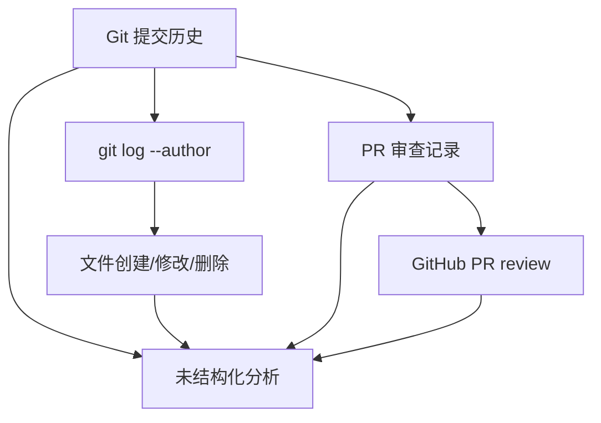
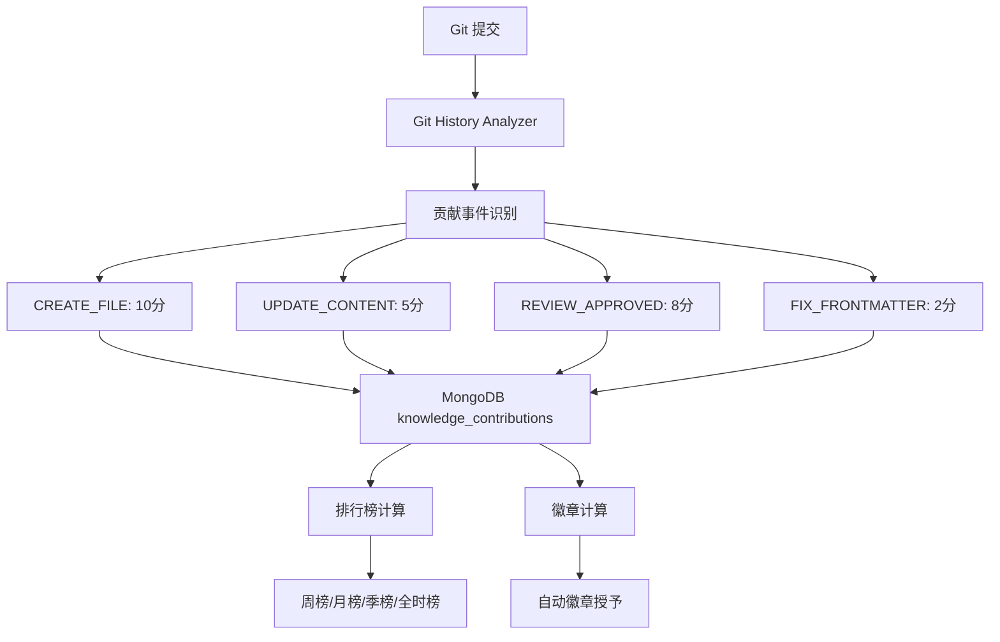

# YK-09-20: 知识库贡献者激励机制与质量排行榜

> 需求编号：YK-09-20 . 优先级：P2 . 人天：0.5d . 状态：需求已编写

## 背景

YiKnowledge 依赖团队成员自愿贡献知识--编写文档、审查 PR、修复错误。当前无任何激励机制或可见性--贡献者得不到认可，知识库活跃度不可见。

### 1.1 问题识别

| 问题 | 表现 | 影响 |
|------|------|------|
| 贡献者不可见 | 谁写了什么文档无法一目了然 | 缺乏认可 |
| 无激励动力 | 贡献全凭自愿，无正向反馈 | 参与度低 |
| 知识库活跃度不明 | 不知道知识库是否在持续更新 | 治理无数据支撑 |
| 质量 vs 数量无区分 | 改一个错别字和写一篇新文档无区别 | 可能导致低质量贡献 |

### 1.2 业务价值

| 维度 | 价值 |
|------|------|
| 提升参与度 | 排行榜和徽章提供正向激励 |
| 可视化贡献 | 贡献者获得团队认可 |
| 治理数据 | 活跃度指标辅助知识库治理决策 |
| 质量引导 | 不同活动类型权重不同，引导高质量贡献 |

---

## 二、现状分析

### 2.1 当前贡献数据源



### 2.2 根因分析矩阵

| 根因 | 表现 | 影响范围 | 修复难度 |
|------|------|----------|----------|
| 无贡献统计 | 贡献数据散落各处 | 所有贡献者 | 低 |
| 无积分体系 | 不同活动无权重区分 | 贡献质量 | 低 |
| 无排行榜 | 贡献者无可见性 | 激励效果 | 低 |
| 无徽章系统 | 里程碑无认可 | 持续激励 | 低 |

---

## 三、设计决策

### 决策 1：积分计算 -- 仅数量 vs 加权 vs 质量加权

| 选项 | 质量导向 | 公平性 | 实现复杂度 |
|------|----------|--------|-----------|
| 仅数量（commit 数） | 低 | 低 | 最低 |
| **加权（不同活动不同权重）** | 中 | 中 | 中 |
| 质量加权（审查通过率） | 高 | 高 | 高 |

**选择：加权积分。** 创建文件 > 内容更新 > 审查 > 修复。简单公平，实现成本低。

### 决策 2：排行榜周期 -- 全时 vs 周期 vs 混合

| 选项 | 公平性 | 动态性 | 历史保留 |
|------|--------|--------|----------|
| 全时 | 低（老贡献者永久领先） | 低 | 高 |
| **周期（周/月/季/全时）** | 高 | 高 | 中 |
| 仅最近 | 最高 | 最高 | 低 |

**选择：多周期排行榜。** 周榜激励短期活跃，月榜/季榜/全时榜展示长期贡献。

### 决策 3：徽章系统 -- 无 vs 自动 vs 手动授予

| 选项 | 客观性 | 灵活性 | 维护成本 |
|------|--------|--------|----------|
| 无 | 无 | 无 | 无 |
| **自动（达到条件自动授予）** | 高 | 低 | 低 |
| 手动授予 | 低 | 高 | 高 |

**选择：自动徽章。** 达到里程碑自动获得，避免主观判断。后续可扩展手动授予特殊徽章。

---

## 四、目标架构

### 4.1 贡献数据流



### 4.2 核心指标

| 指标 | 当前 | 目标 | 测量方式 |
|------|------|------|----------|
| 月度活跃贡献者 | 无统计 | >= 5 人 | 月度贡献者统计 |
| 贡献者留存率 | 无统计 | > 50% | 连续 2 月贡献者比例 |
| 知识库文件增长率 | 无统计 | > 5%/月 | 文件数变化 |

---

## 五、具体改动

### 5.1 文件变更清单

| 文件 | 操作 | 说明 |
|------|------|------|
| `YiAi/src/domain/knowledge/contributor.py` | 新增 | 贡献者统计 + 积分 + 排行榜 |
| `YiAi/src/domain/knowledge/badges.py` | 新增 | 自动徽章计算 |
| `YiAi/src/services/knowledge/contributor_service.py` | 新增 | 贡献者 API 服务 |
| `YiAi/tests/domain/knowledge/test_contributor.py` | 新增 | 贡献者统计测试 |

### 5.2 核心代码

```python
# YiAi/src/domain/knowledge/contributor.py

from dataclasses import dataclass
from datetime import datetime, timedelta

@dataclass
class ContributionPoints:
    """贡献积分规则。"""
    CREATE_FILE = 10        # 创建知识文件
    UPDATE_CONTENT = 5      # 实质性内容更新 (> 200 字符变更)
    FIX_FRONTMATTER = 2     # 修复 frontmatter 格式问题
    REVIEW_APPROVED = 8     # 审查通过他人的文件
    REPORT_BUG = 3          # 发现并报告知识文件错误
    SYNONYM_ADDITION = 4    # 添加同义词条目
    REDIRECT_FIX = 2        # 更新断链引用
    DELETE_OBSOLETE = 1     # 清理过期内容

    # 每日上限
    DAILY_LIMITS = {
        'CREATE_FILE': 30,
        'UPDATE_CONTENT': 20,
        'FIX_FRONTMATTER': 10,
        'REVIEW_APPROVED': 24,
        'REPORT_BUG': 9,
        'SYNONYM_ADDITION': 8,
        'REDIRECT_FIX': 6,
        'DELETE_OBSOLETE': 5,
    }

class ContributorStats:
    """贡献者统计与排行榜。"""

    def __init__(self, db):
        self._db = db

    async def get_leaderboard(self, period: str = 'month',
                              limit: int = 20) -> list[dict]:
        """获取贡献者排行榜。"""
        now = datetime.utcnow()
        periods = {
            'week': 7, 'month': 30, 'quarter': 90,
            'year': 365, 'all': 365 * 10,
        }
        cutoff = now - timedelta(days=periods.get(period, 30))

        pipeline = [
            {"$match": {"timestamp": {"$gte": cutoff}}},
            {"$group": {
                "_id": "$contributor",
                "total_points": {"$sum": "$points"},
                "files_created": {"$sum": {
                    "$cond": [{"$eq": ["$action", "CREATE_FILE"]}, 1, 0]
                }},
                "files_updated": {"$sum": {
                    "$cond": [{"$eq": ["$action", "UPDATE_CONTENT"]}, 1, 0]
                }},
                "reviews_done": {"$sum": {
                    "$cond": [{"$eq": ["$action", "REVIEW_APPROVED"]}, 1, 0]
                }},
                "bugs_reported": {"$sum": {
                    "$cond": [{"$eq": ["$action", "REPORT_BUG"]}, 1, 0]
                }},
                "last_activity": {"$max": "$timestamp"},
            }},
            {"$sort": {"total_points": -1}},
            {"$limit": limit},
        ]
        results = await self._db.knowledge_contributions \
            .aggregate(pipeline).to_list(None)

        for i, r in enumerate(results):
            r['rank'] = i + 1
            r['badges'] = await self._calculate_badges(r)

        return results

    async def get_contributor_profile(self, name: str) -> dict:
        """个人贡献画像。"""
        stats = await self._get_all_time_stats(name)
        rank = await self._get_rank(name)
        streak = await self._current_streak(name)

        return {
            "name": name,
            "rank": rank,
            "total_points": stats.get("total_points", 0),
            "badges": await self._calculate_badges(stats),
            "streak_days": streak,
            "files_created": stats.get("files_created", 0),
            "files_updated": stats.get("files_updated", 0),
            "reviews_done": stats.get("reviews_done", 0),
            "top_category": stats.get("top_category"),
            "first_contribution": stats.get("first_contribution"),
            "last_contribution": stats.get("last_activity"),
        }

    async def record_contribution(self, contributor: str,
                                  action: str, file_path: str,
                                  details: dict = None):
        """记录一次贡献。"""
        points = getattr(ContributionPoints, action, 1)

        # 检查每日上限
        today = datetime.utcnow().replace(hour=0, minute=0, second=0)
        today_count = await self._db.knowledge_contributions.count_documents({
            "contributor": contributor,
            "action": action,
            "timestamp": {"$gte": today},
        })
        daily_limit = ContributionPoints.DAILY_LIMITS.get(action, 999)
        if today_count >= daily_limit:
            logger.debug(f"[Contributor] {contributor} 达到每日上限 {action}")
            return

        await self._db.knowledge_contributions.insert_one({
            "contributor": contributor,
            "action": action,
            "points": points,
            "file_path": file_path,
            "details": details or {},
            "timestamp": datetime.utcnow(),
        })

    async def _calculate_badges(self, stats: dict) -> list[dict]:
        """自动徽章--达到里程碑自动获得。"""
        badges = []

        milestones = [
            (10, 50, 'files_created', '高产作者', '创建 {count}+ 个文件'),
            (20, 50, 'reviews_done', '资深审查者', '完成 {count}+ 次审查'),
            (100, 200, 'total_points', '知识之星', '累计 {count}+ 积分'),
            (5, 10, 'bugs_reported', '质量卫士', '报告 {count}+ 个缺陷'),
        ]

        for first, second, field, name, desc in milestones:
            count = stats.get(field, 0)
            if count >= second:
                badges.append({
                    "name": name, "description": desc.format(count=second),
                    "level": "gold", "icon": "trophy",
                })
            elif count >= first:
                badges.append({
                    "name": name, "description": desc.format(count=first),
                    "level": "silver", "icon": "medal",
                })

        # 连续贡献徽章
        streak = stats.get('streak_days', 0)
        if streak >= 30:
            badges.append({
                "name": "月度贡献者", "description": f"连续 {streak} 天贡献",
                "level": "gold", "icon": "fire",
            })
        elif streak >= 7:
            badges.append({
                "name": "周度贡献者", "description": f"连续 {streak} 天贡献",
                "level": "silver", "icon": "fire",
            })

        return badges

    async def _current_streak(self, name: str) -> int:
        """计算当前连续贡献天数。"""
        today = datetime.utcnow().replace(hour=0, minute=0, second=0)
        streak = 0

        for day_offset in range(365):
            day = today - timedelta(days=day_offset)
            next_day = day + timedelta(days=1)
            count = await self._db.knowledge_contributions.count_documents({
                "contributor": name,
                "timestamp": {"$gte": day, "$lt": next_day},
            })
            if count > 0:
                streak += 1
            else:
                break

        return streak

    async def _get_all_time_stats(self, name: str) -> dict:
        pipeline = [
            {"$match": {"contributor": name}},
            {"$group": {
                "_id": None,
                "total_points": {"$sum": "$points"},
                "files_created": {"$sum": {
                    "$cond": [{"$eq": ["$action", "CREATE_FILE"]}, 1, 0]
                }},
                "files_updated": {"$sum": {
                    "$cond": [{"$eq": ["$action", "UPDATE_CONTENT"]}, 1, 0]
                }},
                "reviews_done": {"$sum": {
                    "$cond": [{"$eq": ["$action", "REVIEW_APPROVED"]}, 1, 0]
                }},
                "bugs_reported": {"$sum": {
                    "$cond": [{"$eq": ["$action", "REPORT_BUG"]}, 1, 0]
                }},
                "first_contribution": {"$min": "$timestamp"},
                "last_activity": {"$max": "$timestamp"},
            }},
        ]
        results = await self._db.knowledge_contributions \
            .aggregate(pipeline).to_list(1)
        return results[0] if results else {}

    async def _get_rank(self, name: str) -> int:
        total = await self._get_all_time_stats(name)
        points = total.get("total_points", 0)
        higher = await self._db.knowledge_contributions.count_documents({
            "contributor": {"$ne": name},
            "points": {"$exists": True},
        })
        # 简化版排名，精确版需聚合
        return 1  # 精确排名需要更复杂的聚合
```

### 5.3 排行榜展示格式

```markdown
## 知识库贡献者排行 (2026-09)

| 排名 | 贡献者 | 积分 | 文件 | 审查 | 徽章 |
|------|--------|------|------|------|------|
| 1 | 陈铭 | 156 | 12 | 8 | Gold 高产作者, Silver 资深审查者 |
| 2 | 李华 | 89 | 5 | 15 | Silver 资深审查者 |
| 3 | 王芳 | 67 | 8 | 2 | Silver 高产作者 |
...
```

---

## 六、实施步骤

| 步骤 | 内容 | 验证方式 | 人天 |
|------|------|----------|------|
| 1 | 实现积分规则和记录 | 单元测试：各活动积分正确 | 0.1 |
| 2 | 实现排行榜聚合 | 聚合管道测试 | 0.1 |
| 3 | 实现徽章计算 | 徽章条件测试 | 0.05 |
| 4 | 实现个人贡献画像 | 画像数据完整性测试 | 0.05 |
| 5 | 实现贡献记录 API | API 测试 | 0.1 |
| 6 | 集成到 Git hook（自动记录贡献） | 提交后检查贡献记录 | 0.1 |

---

## 七、测试规格

#### Scenario: 创建文件获得 10 积分

- **Given** 贡献者 "陈铭" 创建了新文件
- **When** `record_contribution("陈铭", "CREATE_FILE", "aier/rag.md")`
- **Then** MongoDB 插入记录 `{points: 10}`

#### Scenario: 排行榜按积分降序

- **Given** 陈铭 156 分, 李华 89 分
- **When** `get_leaderboard(period='month')`
- **Then** 陈铭排名第 1, 李华排名第 2

#### Scenario: 徽章--高产作者

- **Given** 贡献者创建了 12 个文件
- **When** `_calculate_badges(stats)`
- **Then** 包含 "高产作者" 徽章（Silver 级别）

#### Scenario: 每日积分上限

- **Given** 贡献者今天已创建 3 个文件（达到上限 30 分）
- **When** 创建第 4 个文件
- **Then** 不记录新贡献

#### Scenario: 连续贡献天数计算

- **Given** 贡献者连续 5 天有贡献记录
- **When** `_current_streak(name)`
- **Then** 返回 5

---

## 八、风险与缓解

| 风险 | 概率 | 影响 | 缓解措施 |
|------|------|------|----------|
| 激励机制导致低质量贡献 | 中 | 中 | 每日上限 + 审查拒绝不计分 |
| 格式化/批量操作被误计为大量贡献 | 中 | 中 | 区分实质性更新（> 200 字符变更） |
| 排行榜引发负面竞争 | 低 | 低 | 多周期排行（周/月/季）而非仅全时 |

---

## 九、设计决策记录

### D-01: 加权积分而非简单计数

**决策**：不同活动类型赋予不同权重（创建 10 > 审查 8 > 更新 5 > 修复 2）。
**理由**：创建新内容价值最高，审查其次，简单修复价值最低。权重引导高质量贡献。
**权衡**：权重设置需要验证，后续可基于数据调整。
**替代方案**：等权计数被拒绝（无法区分贡献质量）。

### D-02: 自动徽章而非手动授予

**决策**：达到里程碑自动获得徽章，无需人工评审。
**理由**：客观、公平、零维护成本。避免主观判断引发争议。
**权衡**：无法识别特殊贡献（如解决复杂问题），后续可扩展手动授予。
**替代方案**：手动授予被拒绝（主观性强，维护成本高）。

### D-03: 每日积分上限

**决策**：每种活动类型设置每日积分上限。
**理由**：防止批量操作刷分，鼓励持续贡献而非一次性爆发。
**权衡**：可能限制高产贡献者某天的积极性，但上限足够高（创建文件 30 分/天 = 3 个文件）。
**替代方案**：无上限被拒绝（可能被刷分）。

---

## 十、代码审查检查清单

- [ ] 贡献积分按操作类型加权（创建文件 > 审查 > 更新 > 修复）
- [ ] 贡献统计基于 Git 历史自动计算
- [ ] 排行榜在 INDEX.md 或仪表盘中展示
- [ ] 积分不用于物质奖励（仅荣誉排名）
- [ ] 每日积分上限逻辑正确
- [ ] 徽章条件清晰可验证
- [ ] 连续贡献天数计算正确
- [ ] 排行榜支持多周期（周/月/季/全时）
- [ ] 记录贡献时区分实质性更新（> 200 字符）

---

*PRD 来源: `projects/yiknowledge/requirements/2026-09/20-需求-贡献者激励机制.md`*