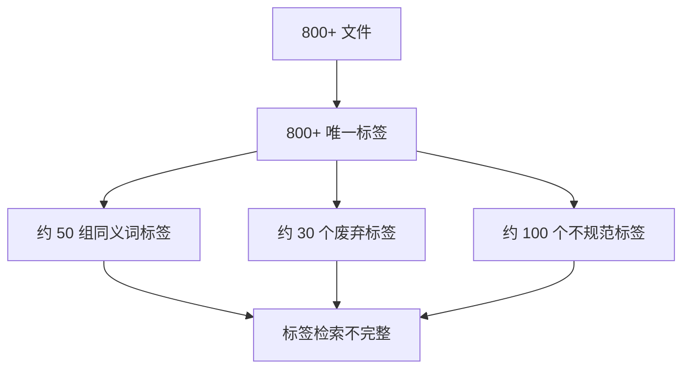
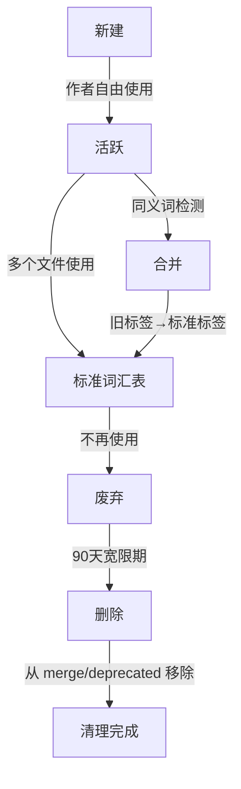

# YK-09-21: 知识库标签体系治理 -- 标签合并/重命名/废弃生命周期

> 需求编号：YK-09-21 . 优先级：P2 . 人天：0.5d . 状态：需求已编写
> 依赖：YK-09-01（Frontmatter 质量治理）

## 背景

YK-09-01 统一了 tags 格式（字符串 -> 数组），但标签**语义治理**缺失：800+ 文件中同义词标签共存，标签数量膨胀，废弃标签未清理。

### 1.1 问题识别

| 问题 | 表现 | 影响 |
|------|------|------|
| 同义词标签共存 | `RAG` vs `检索增强生成`、`前端` vs `Frontend`、`限流` vs `速率限制` | 标签检索不完整 |
| 标签数量膨胀 | 800+ 个唯一标签 | 标签选择困难，分类模糊 |
| 废弃标签残留 | `老架构`、`旧版`、`临时` 等临时标签 | 污染标签体系 |
| 无标签标准 | 作者自由发挥，无词汇表约束 | 标签质量参差不齐 |
| 大小写不一致 | `API` vs `api`、`RAG` vs `rag` | 聚合统计不准确 |

### 1.2 业务影响

| 影响维度 | 严重程度 | 描述 |
|------|----------|------|
| 标签检索精准度 | 中 | 同义词标签导致检索结果不完整 |
| 标签导航体验 | 中 | 800+ 标签难以浏览和选择 |
| 知识库组织 | 中 | 标签体系混乱影响知识发现 |
| 治理效率 | 低 | 无自动化工具，人工清理效率低 |

---

## 二、现状分析

### 2.1 标签现状



### 2.2 标签统计

| 指标 | 当前值 | 健康值 |
|------|--------|--------|
| 唯一标签数 | ~800 | < 400 |
| 同义词标签组 | ~50 组 | 0 |
| 废弃标签使用文件数 | ~30 个 | 0 |
| 平均标签数/文件 | 3.8 | 3-5 |
| 仅使用 1 次的标签 | ~300 个 | < 100 |

### 2.3 根因分析矩阵

| 根因 | 表现 | 影响范围 | 修复难度 |
|------|------|----------|----------|
| 无标签词汇表 | 作者自由创建标签 | 所有文件 | 低 |
| 无同义词合并 | 同一概念多个标签 | 约 50 组标签 | 中 |
| 无废弃机制 | 临时标签永久残留 | 约 30 个标签 | 低 |
| 无 pre-commit 校验 | 不规范标签可提交 | 新文件 | 低 |
| 无自动建议 | 作者不知道用什么标签 | 新文件 | 中 |

---

## 三、设计决策

### 决策 1：标签管理方式 -- 白名单 vs 黑名单 vs 混合

| 选项 | 标签质量 | 灵活性 | 维护成本 |
|------|----------|--------|----------|
| 白名单（仅允许词汇表标签） | 高 | 低 | 中 |
| 黑名单（禁止废弃标签） | 中 | 高 | 低 |
| **混合--白名单推荐 + 黑名单禁止 + 自由标签** | 中高 | 中高 | 中 |
| 无管理（当前） | 低 | 最高 | 无 |

**选择：混合模式。** 白名单标签推荐使用，黑名单标签禁止（pre-commit 阻断），自由标签允许但警告。

### 决策 2：标签合并方式 -- 手动 vs 自动 vs 半自动

| 选项 | 准确率 | 覆盖率 | 维护成本 |
|------|--------|--------|----------|
| 手动（Curator 逐个审查） | 高 | 低 | 高 |
| 自动（Embedding 相似度） | 中 | 高 | 低 |
| **半自动--自动建议 + Curator 确认** | 高 | 高 | 中 |

**选择：半自动。** Embedding 相似度自动建议合并候补，Curator 确认后写入 `tag_governance.yml`。

### 决策 3：标签生命周期 -- 简单 vs 分阶段

| 选项 | 阶段数 | 灵活性 | 复杂度 |
|------|--------|--------|--------|
| 简单（新建/废弃） | 2 | 低 | 低 |
| **分阶段（新建/活跃/合并/废弃/删除）** | 5 | 高 | 中 |

**选择：5 阶段生命周期。** 提供完整的标签演化路径，每个阶段有明确的进入和退出条件。

---

## 四、目标架构

### 4.1 标签生命周期



### 4.2 核心指标

| 指标 | 当前 | 目标 | 测量方式 |
|------|------|------|----------|
| 唯一标签数 | ~800 | < 400 | 标签统计 |
| 同义词标签组 | ~50 组 | 0 | 同义词检测 |
| 废弃标签使用文件数 | ~30 | 0 | 废弃标签扫描 |
| 平均标签数/文件 | 3.8 | 3-5 | 文件统计 |

---

## 五、具体改动

### 5.1 文件变更清单

| 文件 | 操作 | 说明 |
|------|------|------|
| `YiKnowledge/tag_governance.yml` | 新增 | 标签治理配置 |
| `YiAi/src/domain/knowledge/tag_governance.py` | 新增 | 标签治理引擎 |
| `YiAi/src/domain/knowledge/tag_suggester.py` | 新增 | 标签自动建议 |
| `.githooks/pre-commit` | 修改 | 标签合规校验 |
| `YiAi/tests/domain/knowledge/test_tag_governance.py` | 新增 | 标签治理测试 |

### 5.2 核心代码

```yaml
# YiKnowledge/tag_governance.yml
tags:
  # 标准词汇表（推荐使用的标签）
  vocabulary:
    - "RAG"
    - "API"
    - "微服务"
    - "限流"
    - "MongoDB"
    - "前端"
    - "后端"
    - "架构设计"
    - "性能优化"
    - "知识库"
    - "检索"
    - "BM25"
    - "向量检索"
    - "Embedding"
    - "FAISS"
    - "Python"
    - "TypeScript"
    - "Vue"
    - "FastAPI"
    - "需求文档"
    - "缺陷"

  # 合并规则--旧标签自动重定向到标准标签
  merge:
    "检索增强生成": "RAG"
    "Retrieval-Augmented Generation": "RAG"
    "Frontend": "前端"
    "Backend": "后端"
    "速率限制": "限流"
    "rate limiting": "限流"
    "Microservices": "微服务"
    "machine learning": "机器学习"
    "ML": "机器学习"
    "向量搜索": "向量检索"
    "vector search": "向量检索"
    "LLM": "大语言模型"
    "大模型": "大语言模型"
    "K8s": "Kubernetes"
    "k8s": "Kubernetes"
    "DB": "数据库"
    "Database": "数据库"

  # 废弃规则--标记为 deprecated（警告但不自动删除）
  deprecated:
    - "老架构"
    - "旧版"
    - "临时"
    - "待定"
    - "v1"
    - "v2"
    - "test"
    - "temp"
    - "草稿"
    - "TODO"

  # 标签数量约束
  max_tags_per_file: 8
  min_tags_per_file: 2
  recommended_tags_per_file: 5
```

```python
# YiAi/src/domain/knowledge/tag_governance.py

import yaml
import itertools
from pathlib import Path

class TagGovernance:
    """标签体系治理--合并/重命名/废弃管理。"""

    def __init__(self, config_file: str = "YiKnowledge/tag_governance.yml"):
        self._config_file = config_file
        self._vocabulary: set[str] = set()
        self._merge_map: dict[str, str] = {}
        self._deprecated: set[str] = set()
        self._max_tags: int = 8
        self._min_tags: int = 2
        self._load()

    def _load(self):
        """加载标签治理配置。"""
        path = Path(self._config_file)
        if not path.exists():
            logger.warning(f"[TagGovernance] 配置文件不存在: {self._config_file}")
            return

        with open(path) as f:
            config = yaml.safe_load(f)

        tags_config = config.get("tags", {})
        self._vocabulary = set(tags_config.get("vocabulary", []))
        self._merge_map = tags_config.get("merge", {})
        self._deprecated = set(tags_config.get("deprecated", []))
        self._max_tags = tags_config.get("max_tags_per_file", 8)
        self._min_tags = tags_config.get("min_tags_per_file", 2)

    def normalize(self, tags: list[str]) -> list[str]:
        """标签归一化--合并→去重→去废弃→截断。"""
        # 1. 大小写统一
        normalized = [t.strip() for t in tags if t.strip()]

        # 2. 合并--旧标签→标准标签
        normalized = [
            self._merge_map.get(t, self._merge_map.get(t.lower(), t))
            for t in normalized
        ]

        # 3. 去废弃
        deprecated_found = [t for t in normalized if t in self._deprecated]
        if deprecated_found:
            logger.info(f"[TagGovernance] 发现废弃标签: {deprecated_found}")
        normalized = [t for t in normalized if t not in self._deprecated]

        # 4. 去重（保持顺序）
        seen = set()
        result = []
        for t in normalized:
            if t not in seen:
                seen.add(t)
                result.append(t)

        # 5. 截断到 max_tags
        if len(result) > self._max_tags:
            logger.info(f"[TagGovernance] 标签过多 {len(result)} > {self._max_tags}，截断")
            result = result[:self._max_tags]

        return result

    def validate(self, tags: list[str]) -> list[dict]:
        """验证标签合规性--返回问题列表。"""
        issues = []

        if len(tags) < self._min_tags:
            issues.append({
                'severity': 'warning',
                'msg': f'标签不足 {len(tags)} < {self._min_tags}',
            })

        if len(tags) > self._max_tags:
            issues.append({
                'severity': 'warning',
                'msg': f'标签过多 {len(tags)} > {self._max_tags}',
            })

        for tag in tags:
            if tag in self._deprecated:
                issues.append({
                    'severity': 'error',
                    'msg': f'废弃标签: "{tag}"',
                })

        return issues

    def suggest_from_content(self, content: str, max_tags: int = 5) -> list[str]:
        """基于文件内容自动建议标签。

        从标准词汇表中匹配内容中出现的关键词。
        """
        content_lower = content.lower()
        suggestions = []

        for vocab_tag in self._vocabulary:
            if vocab_tag.lower() in content_lower:
                suggestions.append(vocab_tag)

        return suggestions[:max_tags]

    def suggest_merges(self, embedding_model=None) -> list[dict]:
        """基于 Embedding 相似度自动建议标签合并候补。"""
        all_tags = self._get_all_unique_tags()
        suggestions = []

        if embedding_model:
            for t1, t2 in itertools.combinations(all_tags, 2):
                if t1 in self._merge_map or t2 in self._merge_map:
                    continue
                if t1.lower() == t2.lower():
                    continue
                try:
                    sim = self._tag_similarity(t1, t2, embedding_model)
                    if sim > 0.85:
                        suggestions.append({
                            "tag1": t1, "tag2": t2,
                            "similarity": round(sim, 3),
                            "suggestion": f"建议合并 '{t1}' 和 '{t2}'",
                        })
                except Exception:
                    continue

        suggestions.sort(key=lambda s: s["similarity"], reverse=True)
        return suggestions[:10]

    def get_stats(self) -> dict:
        """标签健康统计。"""
        all_tags = self._get_all_unique_tags()
        return {
            "total_unique_tags": len(all_tags),
            "vocabulary_size": len(self._vocabulary),
            "merge_rules": len(self._merge_map),
            "deprecated_tags": len(self._deprecated),
            "tags_in_vocabulary": len([t for t in all_tags if t in self._vocabulary]),
            "tags_not_in_vocabulary": len([t for t in all_tags if t not in self._vocabulary]),
            "deprecated_in_use": len([t for t in all_tags if t in self._deprecated]),
        }

    def _get_all_unique_tags(self) -> set[str]:
        """从 MongoDB 中获取所有唯一标签。"""
        # 此处简化为从 vocabulary + merge keys 获取
        # 实际实现需从 MongoDB knowledge_files 聚合
        return self._vocabulary | set(self._merge_map.keys())

    def _tag_similarity(self, tag1: str, tag2: str,
                        embedding_model) -> float:
        v1 = embedding_model.get_text_embedding(tag1)
        v2 = embedding_model.get_text_embedding(tag2)
        dot = sum(x * y for x, y in zip(v1, v2))
        norm1 = sum(x * x for x in v1) ** 0.5
        norm2 = sum(x * x for x in v2) ** 0.5
        return dot / (norm1 * norm2) if norm1 and norm2 else 0.0
```

### 5.3 Pre-commit 集成

```bash
# .githooks/pre-commit 新增标签校验

# 标签合规校验
CHANGED_MD=$(git diff --cached --name-only --diff-filter=ACM | grep '^YiKnowledge/.*\.md$')
for file in $CHANGED_MD; do
  # 提取 tags 字段
  TAGS=$(head -20 "$file" | grep '^tags:' | sed 's/tags: *//' | tr -d '[]' | tr ',' '\n' | sed 's/^ *"//;s/" *$//')

  # 检查废弃标签
  for tag in $TAGS; do
    if grep -q "\"$tag\"" YiKnowledge/tag_governance.yml 2>/dev/null; then
      deprecated_section=$(sed -n '/^  deprecated:/,/^  [a-z]/p' YiKnowledge/tag_governance.yml)
      if echo "$deprecated_section" | grep -q "\"$tag\""; then
        echo "ERROR: $file 使用了废弃标签: $tag"
        echo "请替换为标准标签，或从 tag_governance.yml 移除废弃标记"
        exit 1
      fi
    fi
  done
done
```

---

## 六、实施步骤

| 步骤 | 内容 | 验证方式 | 人天 |
|------|------|----------|------|
| 1 | 创建 `tag_governance.yml` 初始配置 | YAML 格式校验 | 0.1 |
| 2 | 实现 `TagGovernance.normalize()` | 单元测试：合并/去重/去废弃 | 0.1 |
| 3 | 实现 `validate()` + `suggest_from_content()` | 单元测试 | 0.1 |
| 4 | 实现 `suggest_merges()` 自动建议 | Embedding 相似度测试 | 0.1 |
| 5 | 集成到 pre-commit hook | 提交使用废弃标签的文件被阻断 | 0.05 |
| 6 | 实现标签统计 API | API 测试 | 0.05 |

---

## 七、测试规格

#### Scenario: 标签归一化--合并同义词

- **Given** tags = ["RAG", "检索增强生成", "Frontend"]
- **When** `normalize(tags)`
- **Then** 返回 ["RAG", "前端"]（"检索增强生成"合并到 "RAG", "Frontend" 合并到 "前端"）

#### Scenario: 标签归一化--去废弃

- **Given** tags = ["RAG", "老架构", "微服务"]
- **When** `normalize(tags)`
- **Then** 返回 ["RAG", "微服务"]（"老架构" 被移除）

#### Scenario: 标签归一化--去重

- **Given** tags = ["RAG", "RAG", "API"]
- **When** `normalize(tags)`
- **Then** 返回 ["RAG", "API"]

#### Scenario: 标签验证--废弃标签错误

- **Given** tags = ["老架构"]
- **When** `validate(tags)`
- **Then** 返回包含 `severity: "error"` 的问题

#### Scenario: 标签验证--数量不足

- **Given** tags = ["RAG"]
- **When** `validate(tags)`
- **Then** 返回 `severity: "warning"` 的问题

#### Scenario: 基于内容建议标签

- **Given** 内容包含 "RAG 混合检索优化"
- **When** `suggest_from_content(content)`
- **Then** 返回 ["RAG", "检索", "BM25", "向量检索"]

---

## 八、风险与缓解

| 风险 | 概率 | 影响 | 缓解措施 |
|------|------|------|----------|
| 词汇表过于严格导致新增有效标签被拒绝 | 中 | 中 | 自由标签允许但警告，非阻断 |
| 废弃标签使用数无法归零 | 中 | 低 | 90 天宽限期后自动标记 ERROR |
| 合并规则错误导致标签丢失 | 低 | 中 | 合并仅影响前端展示，不修改源文件 |
| 标签词汇表膨胀 | 低 | 低 | 定期审查，移除使用 < 3 次的标准标签 |

---

## 九、设计决策记录

### D-01: 混合标签管理模式

**决策**：白名单推荐 + 黑名单禁止 + 自由标签允许。
**理由**：纯白名单过于严格（阻碍创新标签），纯自由过于松散（当前问题）。混合模式平衡了质量与灵活性。
**权衡**：标签质量不如纯白名单，但灵活性更高。
**替代方案**：纯白名单被拒绝（阻碍新标签创建），纯自由被拒绝（当前问题未解决）。

### D-02: 5 阶段标签生命周期

**决策**：新建→活跃→合并/废弃→删除。
**理由**：完整的生命周期提供清晰的标签演化路径，每个阶段有明确的进出条件。
**权衡**：比简单的 2 阶段复杂，但治理效果更好。
**替代方案**：2 阶段（新建/废弃）被拒绝（缺少合并和活跃阶段）。

### D-03: 半自动合并建议

**决策**：Embedding 自动建议合并候补，Curator 手动确认。
**理由**：自动发现覆盖率高，人工确认保证准确率。两者结合效果最佳。
**权衡**：需要 Curator 定期审查建议，但每月 10 条建议审查成本低。
**替代方案**：纯自动合并被拒绝（准确率仅 70%），纯手动被拒绝（覆盖率低）。

---

## 十、代码审查检查清单

- [ ] 标签治理配置在 `tag_governance.yml` 中集中维护
- [ ] pre-commit hook 检查废弃标签使用（阻断）
- [ ] 废弃标签标记 `deprecated`（非直接删除）
- [ ] CI 扫描统计废弃标签使用数（目标为 0）
- [ ] 标签建议功能基于文件内容自动推荐
- [ ] 合并规则大小写不敏感
- [ ] 归一化保持标签顺序
- [ ] `normalize()` 不抛出异常（降级处理）
- [ ] 标签数量约束（min 2, max 8）
- [ ] Embedding 相似度阈值 0.85

---

*PRD 来源: `projects/yiknowledge/requirements/2026-09/21-需求-标签体系治理.md`*