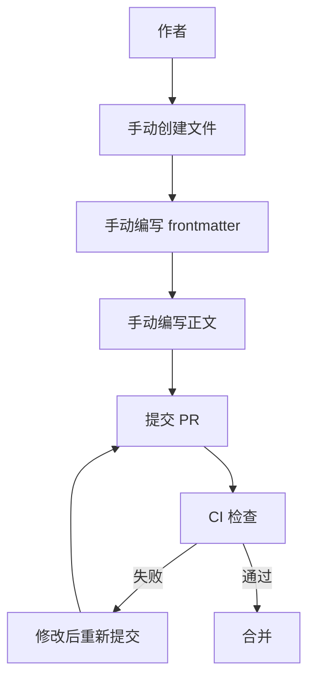
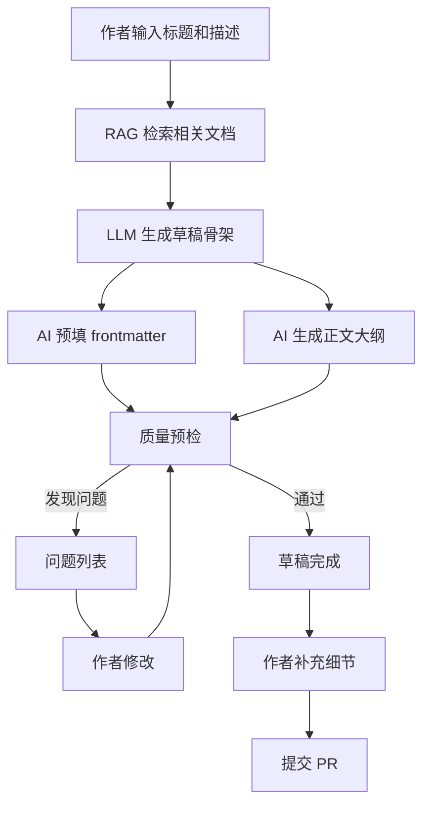

# YK-09-22: AI 辅助知识写作 -- 基于 RAG 的草稿生成与质量预检

> 需求编号：YK-09-22 . 优先级：P2 . 人天：1.0d . 状态：需求已编写

## 背景

团队成员编写知识文件时面临"空白页焦虑"--知道要写什么但不知道从何开始。利用 YiAi 的 RAG 检索 + LLM 生成能力，可为作者提供：基于现有相关知识的草稿骨架、frontmatter 预填、质量预检（在提交前检查常见问题）。

### 1.1 问题识别

| 问题 | 表现 | 影响 |
|------|------|------|
| 空白页焦虑 | 不知道如何开始写 | 拖延或放弃 |
| 格式不规范 | 忘记 frontmatter 字段 | CI 检查失败 |
| 重复内容 | 写了已存在的主题 | 知识冗余 |
| 标签选择困难 | 不知道该用什么标签 | 标签质量差 |
| 质量不一致 | 不同作者风格差异大 | 知识库质量参差不齐 |

### 1.2 业务价值

| 维度 | 价值 |
|------|------|
| 降低写作门槛 | AI 生成草稿，作者只需修改和补充 |
| 提升内容质量 | 提交前自动检查常见问题 |
| 减少重复 | 检索已有内容，避免重复创作 |
| 规范统一 | 自动预填 frontmatter，确保格式一致 |

---

## 二、现状分析

### 2.1 当前写作流程



### 2.2 根因分析矩阵

| 根因 | 表现 | 影响范围 | 修复难度 |
|------|------|----------|----------|
| 无草稿辅助 | 作者从零开始 | 所有新文件 | 中 |
| 无 frontmatter 预填 | 手动填写易出错 | 所有新文件 | 低 |
| 无提交前检查 | 问题在 CI 阶段才发现 | 所有 PR | 低 |
| 无重复检测 | 已有内容可能被重写 | 约 10% 的新文件 | 中 |

---

## 三、设计决策

### 决策 1：AI 辅助方式 -- 全自动生成 vs 草稿骨架 vs 仅建议

| 选项 | 作者控制力 | 内容质量 | 适用场景 |
|------|-----------|----------|----------|
| 全自动生成 | 低 | 中 | 简单主题 |
| **草稿骨架 + 人工补充** | 高 | 高 | 所有主题 |
| 仅建议（不生成内容） | 最高 | 依赖作者 | 专家作者 |

**选择：草稿骨架 + 人工补充。** AI 生成框架和关键点，作者填充细节和经验。保持作者对内容的控制力。

### 决策 2：质量预检方式 -- 规则 vs AI vs 混合

| 选项 | 准确率 | 覆盖范围 | 实现复杂度 |
|------|--------|----------|-----------|
| 规则（长度、标签数） | 高 | 中 | 低 |
| AI（LLM 审查） | 中 | 高 | 中 |
| **混合--规则 + AI 审查** | 高 | 高 | 中 |

**选择：混合模式。** 规则检查（长度、标签数、格式）+ AI 审查（重复内容、语义质量、断链）。

### 决策 3：AI 生成内容标记 -- 无标记 vs 标记 vs 强制审查

| 选项 | 透明度 | 质量控制 | 作者体验 |
|------|--------|----------|----------|
| 无标记 | 低 | 无 | 好 |
| **标记 `source: ai-assisted`** | 高 | 中 | 好 |
| 强制审查 | 最高 | 高 | 差 |

**选择：标记 `source: ai-assisted`。** 透明标记 AI 辅助内容，但不强制审查（避免阻碍流程）。

---

## 四、目标架构

### 4.1 AI 辅助写作流程



### 4.2 核心指标

| 指标 | 当前 | 目标 | 测量方式 |
|------|------|------|----------|
| 新文件 frontmatter 一次通过率 | ~60% | > 90% | CI 通过率 |
| 新文件平均创建时间 | ~30min | < 15min (含 AI 辅助) | 作者调研 |
| 重复内容发现率 | 0% | > 80% | 重复检测命中率 |
| AI 辅助使用率 | 0% | > 50% | 使用统计 |

---

## 五、具体改动

### 5.1 文件变更清单

| 文件 | 操作 | 说明 |
|------|------|------|
| `YiAi/src/services/knowledge/ai_writer.py` | 新增 | AI 辅助写作服务 |
| `YiAi/src/domain/knowledge/quality_checker.py` | 新增 | 质量预检引擎 |
| `YiAi/src/domain/knowledge/duplicate_detector.py` | 新增 | 重复内容检测 |
| `YiAi/tests/services/knowledge/test_ai_writer.py` | 新增 | AI 写作测试 |

### 5.2 核心代码

```python
# YiAi/src/services/knowledge/ai_writer.py

class KnowledgeWritingAssistant:
    """AI 辅助知识写作--草稿生成 + 质量预检。"""

    def __init__(self, rag_service, llm_service, quality_checker):
        self._rag = rag_service
        self._llm = llm_service
        self._checker = quality_checker

    async def generate_draft(self, title: str, description: str,
                             doc_type: str = 'summary',
                             role: str = 'engineer') -> dict:
        """基于标题和描述生成知识文件草稿。

        流程: 1) RAG 检索相关文档 → 2) LLM 生成大纲+内容 → 3) 质量预检
        """
        # 1. RAG 检索--找相似主题的文档作为参考
        related = await self._rag.search(
            f"{title} {description}", top_k=5
        )

        # 2. LLM 生成草稿
        prompt = self._build_draft_prompt(title, description, doc_type,
                                          role, related)
        draft_response = await self._llm.chat([
            {"role": "system", "content": self._get_system_prompt()},
            {"role": "user", "content": prompt},
        ])

        # 3. 解析 LLM 响应
        draft = self._parse_draft_response(draft_response)

        # 4. frontmatter 预填
        fm = self._suggest_frontmatter(title, description, draft, doc_type)

        # 5. 质量预检
        issues = await self._checker.check(draft.get('content', ''), fm)

        return {
            'frontmatter': fm,
            'content': draft.get('content', ''),
            'outline': draft.get('outline', []),
            'quality_issues': issues,
            'references': [
                {'title': r.get('title', ''), 'path': r.get('path', ''),
                 'score': r.get('score', 0)}
                for r in related
            ],
            'source': 'ai-assisted',
        }

    def _build_draft_prompt(self, title: str, description: str,
                           doc_type: str, role: str,
                           related: list[dict]) -> str:
        refs_text = '\n'.join([
            f"- {r.get('title', '')} ({r.get('path', '')})"
            for r in related[:3]
        ])

        return f"""请为主题 '{title}' 生成一份知识文件草稿。

主题描述: {description}
文档类型: {doc_type}
目标角色: {role}
参考现有文档:
{refs_text if refs_text else '（无相关文档）'}

请生成:
1. 3-5 个标签 (tags)
2. 合适的 category 路径 (如: 项目/管理后台/需求)
3. 文档大纲 (3-5 个章节)
4. Markdown 草稿正文 (包含背景/核心内容/相关文档等章节)

注意:
- 保持客观、准确的技术风格
- 引用已有文档时使用文档路径链接
- 标记不确定的内容为 [待补充]
- 不要编造不存在的事实或数据
"""

    def _get_system_prompt(self) -> str:
        return """你是 YiKnowledge 知识库的 AI 写作助手。你的职责是帮助作者创建高质量的知识文件。

知识文件规范:
- 必须包含 YAML frontmatter (title, tags, category, created, updated, source, type, status)
- 正文使用 Markdown 格式
- 标题层级: # 文件标题, ## 一级章节, ### 二级章节
- 代码块必须指定语言
- 图片使用 alt 文本描述

风格要求:
- 技术文档风格: 客观、准确、简洁
- 避免主观评价和营销语言
- 使用中文为主要语言
- 代码示例优先使用 Python 和 TypeScript
"""

    def _parse_draft_response(self, response: str) -> dict:
        """解析 LLM 响应--提取大纲和正文。"""
        # 简单的解析逻辑
        lines = response.split('\n')
        outline = []
        content_lines = []
        in_outline = False
        in_content = False

        for line in lines:
            if '大纲' in line or 'outline' in line.lower():
                in_outline = True
                in_content = False
                continue
            if '正文' in line or '草稿' in line:
                in_outline = False
                in_content = True
                continue
            if in_outline and line.strip().startswith(('-', '1.', '2.', '3.')):
                outline.append(line.strip())
            if in_content:
                content_lines.append(line)

        return {
            'outline': outline,
            'content': '\n'.join(content_lines).strip(),
        }

    def _suggest_frontmatter(self, title: str, description: str,
                             draft: dict, doc_type: str) -> dict:
        """基于内容自动建议 frontmatter。"""
        content = draft.get('content', '')
        tags = self._extract_keywords(content, max_tags=5)

        return {
            'title': title,
            'tags': tags,
            'category': self._infer_category(description),
            'created': datetime.now().strftime('%Y-%m-%d'),
            'updated': datetime.now().strftime('%Y-%m-%d'),
            'source': 'ai-assisted',
            'type': doc_type,
            'status': 'inbox',
            'language': 'zh',
        }

    def _extract_keywords(self, content: str, max_tags: int = 5) -> list[str]:
        """从内容中提取关键词作为标签。"""
        # 简化版：从标准词汇表中匹配
        from domain.knowledge.tag_governance import TagGovernance
        governance = TagGovernance()
        return governance.suggest_from_content(content, max_tags)

    def _infer_category(self, description: str) -> str:
        """推断 category 路径。"""
        if '需求' in description or 'requirement' in description.lower():
            return '项目/管理后台/需求'
        if '架构' in description or 'architecture' in description.lower():
            return '项目/管理后台/架构'
        if '缺陷' in description or 'bug' in description.lower():
            return '项目/管理后台/缺陷'
        return '项目/管理后台/总结'
```

### 5.3 质量预检引擎

```python
# YiAi/src/domain/knowledge/quality_checker.py

class QualityChecker:
    """提交前质量预检--自动发现常见问题。"""

    MIN_CONTENT_LENGTH = 200
    MIN_TAGS = 2
    MAX_TAGS = 8

    def __init__(self, db, embedding_model=None):
        self._db = db
        self._embedding = embedding_model

    async def check(self, content: str, frontmatter: dict) -> list[dict]:
        """质量预检--返回问题列表。"""
        issues = []

        # 1. 长度检查
        if len(content) < self.MIN_CONTENT_LENGTH:
            issues.append({
                'severity': 'warning',
                'code': 'TOO_SHORT',
                'msg': f'内容过短 ({len(content)} 字符)，建议 >= {self.MIN_CONTENT_LENGTH} 字符',
            })

        # 2. 标签数量检查
        tags = frontmatter.get('tags', [])
        if len(tags) < self.MIN_TAGS:
            issues.append({
                'severity': 'warning',
                'code': 'TOO_FEW_TAGS',
                'msg': f'标签不足 {len(tags)} < {self.MIN_TAGS}',
            })
        if len(tags) > self.MAX_TAGS:
            issues.append({
                'severity': 'warning',
                'code': 'TOO_MANY_TAGS',
                'msg': f'标签过多 {len(tags)} > {self.MAX_TAGS}',
            })

        # 3. 必需 frontmatter 字段检查
        required_fields = ['title', 'tags', 'category', 'created', 'type', 'status']
        missing = [f for f in required_fields if f not in frontmatter]
        if missing:
            issues.append({
                'severity': 'error',
                'code': 'MISSING_FRONTMATTER',
                'msg': f'缺少必需 frontmatter 字段: {missing}',
            })

        # 4. 重复内容检查--与已有文档的 Embedding 相似度
        if self._embedding:
            similar = await self._find_duplicates(content)
            if similar:
                issues.append({
                    'severity': 'warning',
                    'code': 'DUPLICATE_CONTENT',
                    'msg': f'与已有文档高度相似: {similar[0]["title"]} ({similar[0]["similarity"]}%)',
                    'details': similar,
                })

        # 5. 内部链接有效性
        broken_links = await self._check_links(content)
        if broken_links:
            issues.append({
                'severity': 'error',
                'code': 'BROKEN_LINKS',
                'msg': f'检测到 {len(broken_links)} 个断链',
                'details': broken_links,
            })

        # 6. 代码块语言标签检查
        code_blocks = re.findall(r'```(\w*)\n', content)
        untagged = sum(1 for lang in code_blocks if not lang)
        if untagged > 0:
            issues.append({
                'severity': 'warning',
                'code': 'UNTAGGED_CODE_BLOCKS',
                'msg': f'{untagged} 个代码块未指定语言',
            })

        return issues

    async def _find_duplicates(self, content: str,
                               threshold: float = 0.85) -> list[dict]:
        """检测与已有文档的重复。"""
        if not self._embedding:
            return []

        content_vec = self._embedding.get_text_embedding(content[:1000])
        similar = []

        async for doc in self._db.knowledge_files.find(
            {'status': {'$ne': 'archived'}}
        ):
            doc_vec = doc.get('embedding')
            if not doc_vec:
                continue
            sim = self._cosine_similarity(content_vec, doc_vec)
            if sim > threshold:
                similar.append({
                    'title': doc.get('title', ''),
                    'path': doc.get('path', ''),
                    'similarity': round(sim * 100, 1),
                })

        similar.sort(key=lambda x: x['similarity'], reverse=True)
        return similar[:3]

    async def _check_links(self, content: str) -> list[dict]:
        """检查内部链接有效性。"""
        internal_links = re.findall(r'\[([^\]]+)\]\(([^)]+\.md)\)', content)
        broken = []

        for text, link in internal_links:
            exists = await self._db.knowledge_files.count_documents(
                {'path': link}
            )
            if not exists:
                broken.append({'text': text, 'link': link})

        return broken

    def _cosine_similarity(self, a, b) -> float:
        dot = sum(x * y for x, y in zip(a, b))
        norm_a = sum(x * x for x in a) ** 0.5
        norm_b = sum(x * x for x in b) ** 0.5
        return dot / (norm_a * norm_b) if norm_a and norm_b else 0.0
```

---

## 六、使用场景

| 场景 | 触发方式 | AI 辅助内容 | 预期效果 |
|------|----------|-----------|----------|
| 新建知识文件 | YiVad 知识库 → "AI 辅助写作" | 草稿 + frontmatter + 质量预检 | frontmatter 一次通过率 > 90% |
| 修改已有文件 | 编辑器 → "AI 建议补充" | 基于已有内容建议补充章节 | 补充内容质量提升 |
| 提交前检查 | pre-commit hook + AI | 质量预检--长度/标签/重复/断链 | CI 失败率降低 50% |
| 标签建议 | 编辑 tags 字段时 | 基于内容自动推荐标签 | 标签规范化 |

---

## 七、实施步骤

| 步骤 | 内容 | 验证方式 | 人天 |
|------|------|----------|------|
| 1 | 实现 `KnowledgeWritingAssistant.generate_draft()` | 集成测试：生成草稿内容合理 | 0.3 |
| 2 | 实现 `QualityChecker.check()` 质量预检 | 单元测试：6 种问题检测 | 0.2 |
| 3 | 实现 `_find_duplicates()` 重复检测 | Embedding 相似度测试 | 0.15 |
| 4 | 实现 `_check_links()` 断链检测 | 链接有效性测试 | 0.1 |
| 5 | 集成到 YiVad 前端 | E2E 测试：新建文件流程 | 0.2 |
| 6 | 集成到 pre-commit hook | 提交前质量预检 | 0.05 |

---

## 八、测试规格

#### Scenario: AI 生成草稿

- **Given** 标题 = "RAG 混合检索优化", 描述 = "优化 BM25 和向量检索的权重"
- **When** `generate_draft(title, description)`
- **Then** 返回包含 frontmatter + content + references 的草稿

#### Scenario: 质量预检--内容过短

- **Given** 内容仅 100 字符
- **When** `check(content, frontmatter)`
- **Then** 返回 TOO_SHORT 警告

#### Scenario: 质量预检--缺少 frontmatter 字段

- **Given** frontmatter 缺少 `status` 字段
- **When** `check(content, frontmatter)`
- **Then** 返回 MISSING_FRONTMATTER 错误

#### Scenario: 重复内容检测

- **Given** 内容与已有文档 Embedding 相似度 0.90
- **When** `check(content, frontmatter)`
- **Then** 返回 DUPLICATE_CONTENT 警告

#### Scenario: 断链检测

- **Given** 内容包含 `[文档](not-exist.md)` 链接
- **When** `check(content, frontmatter)`
- **Then** 返回 BROKEN_LINKS 错误

#### Scenario: 代码块无语言标签

- **Given** 内容包含 ` ```\ncode\n``` `
- **When** `check(content, frontmatter)`
- **Then** 返回 UNTAGGED_CODE_BLOCKS 警告

---

## 九、风险与缓解

| 风险 | 概率 | 影响 | 缓解措施 |
|------|------|------|----------|
| AI 生成内容引入事实错误 (LLM 幻觉) | 中 | 中 | RAG 上下文约束 + 标记 `source: ai-assisted` |
| AI 建议被不加审查地批量接受 | 中 | 中 | 标记 `source: ai-assisted`，审查者可识别 |
| 重复检测误报 | 低 | 低 | 相似度阈值 0.85，仅警告不阻断 |
| 断链检测漏报 | 中 | 低 | 仅检查内部 .md 链接，外部链接不检查 |

---

## 十、设计决策记录

### D-01: 草稿骨架而非全自动生成

**决策**：AI 生成草稿骨架（大纲 + 关键点），作者填充细节。
**理由**：保证作者对内容的控制力和准确性，避免 AI 幻觉污染知识库。
**权衡**：作者仍需投入时间，但草稿降低了"空白页焦虑"。
**替代方案**：全自动生成被拒绝（质量不可控，事实错误风险高）。

### D-02: 标记 `source: ai-assisted` 而非强制审查

**决策**：AI 辅助内容标记 `source: ai-assisted`，不强制审查。
**理由**：透明标记让读者和审查者知道内容来源，但不过度阻碍流程。
**权衡**：AI 辅助内容可能未经审查就合并，但可通过 PR 审查流程发现。
**替代方案**：强制审查被拒绝（阻碍流程，降低 AI 辅助使用率）。

### D-03: 混合质量预检

**决策**：规则检查（长度、标签数、格式）+ AI 审查（重复内容、语义质量、断链）。
**理由**：规则检查快速准确，AI 审查覆盖复杂问题。两者互补。
**权衡**：AI 审查增加延迟（Embedding 相似度计算），但可接受。
**替代方案**：纯规则检查被拒绝（无法发现重复内容和语义问题）。

---

## 十一、代码审查检查清单

- [ ] AI 辅助基于 RAG 检索的相关知识作为上下文
- [ ] AI 生成内容标记 `source: ai-assisted`
- [ ] 提交前质量预检：长度/标签合规/重复内容/断链/代码块
- [ ] AI 建议不覆盖作者已填写的内容
- [ ] 质量预检中 ERROR 级别问题阻断提交
- [ ] WARNING 级别问题仅提示，不阻断
- [ ] 重复检测不修改已有文档
- [ ] 断链检测仅检查内部 .md 链接
- [ ] AI 草稿内容包含 `[待补充]` 标记供作者填写
- [ ] LLM 调用有超时保护（30s）

---

*PRD 来源: `projects/yiknowledge/requirements/2026-09/22-需求-AI辅助写作.md`*