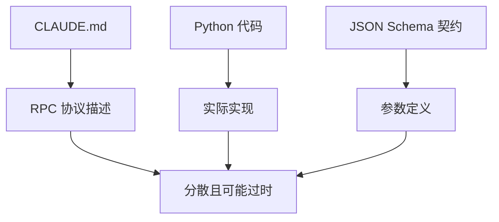
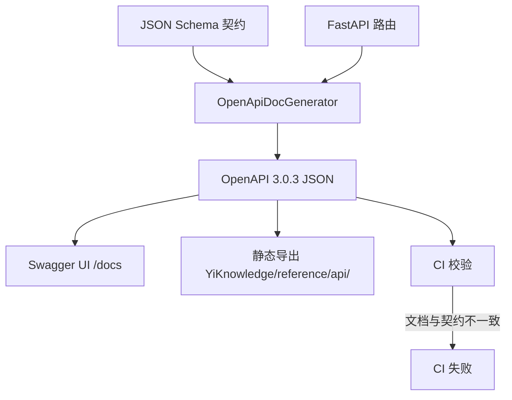

# YK-09-23: 知识库 API 文档自动生成 -- OpenAPI 格式交互式文档

> 需求编号：YK-09-23 . 优先级：P2 . 人天：0.5d . 状态：需求已编写

## 背景

YiAi RPC 信封协议的方法在 CLAUDE.md 中有文字描述，但缺少结构化 API 文档。YA-09-10 定义了 JSON Schema 参数契约，可复用为 OpenAPI 生成的数据源。

### 1.1 问题识别

| 问题 | 表现 | 影响 |
|------|------|------|
| API 文档分散 | 方法描述在 CLAUDE.md，参数在代码中 | 查阅困难 |
| 无交互式文档 | 无法在线尝试 API 调用 | 调试效率低 |
| 参数契约不同步 | 文档与代码参数名不一致 | 前端调用失败 |
| 废弃参数未标注 | 旧参数名仍在文档中 | 误导开发者 |
| 无版本化 | API 变更无历史记录 | 无法追溯变更 |

### 1.2 业务价值

| 维度 | 价值 |
|------|------|
| 开发效率 | 交互式文档降低 API 学习成本 |
| 契约一致性 | 基于 JSON Schema 生成，确保文档与代码一致 |
| 新成员上手 | 标准 OpenAPI 文档，降低学习曲线 |
| 跨项目协作 | YiVad/YiPet 开发者可快速查阅 API |

---

## 二、现状分析

### 2.1 当前 API 文档



### 2.2 根因分析矩阵

| 根因 | 表现 | 影响范围 | 修复难度 |
|------|------|----------|----------|
| 无自动化文档生成 | 文档手动维护 | 所有 API | 低 |
| 无 OpenAPI 集成 | 无交互式文档 | 所有 API | 低 |
| 无废弃参数标记 | 旧参数未标注 | 约 10 个 API | 低 |
| 无版本追踪 | 变更历史不可见 | 所有 API | 低 |

---

## 三、设计决策

### 决策 1：文档生成方式 -- 手动编写 vs 代码注释 vs 自动生成

| 选项 | 准确性 | 维护成本 | 交互性 |
|------|--------|----------|--------|
| 手动编写（当前） | 低 | 高 | 无 |
| 代码注释 + 提取 | 中 | 中 | 低 |
| **自动生成（JSON Schema + FastAPI）** | 高 | 低 | 高 |
| 混合 | 高 | 中 | 高 |

**选择：自动生成。** 基于 JSON Schema 契约 + FastAPI 路由自动生成 OpenAPI 文档。

### 决策 2：文档格式 -- OpenAPI 2.0 vs 3.0 vs 3.1

| 选项 | 工具支持 | 特性 | 兼容性 |
|------|----------|------|--------|
| OpenAPI 2.0 (Swagger) | 广泛 | 基础 | 旧 |
| **OpenAPI 3.0.3** | 广泛 | 完善 | 主流 |
| OpenAPI 3.1 | 最新 | 最新 | 部分工具不支持 |

**选择：OpenAPI 3.0.3。** 工具支持最广泛，特性满足需求。

### 决策 3：文档部署 -- 仅 Swagger UI vs 静态生成 vs 两者

| 选项 | 交互性 | 离线可用 | 维护成本 |
|------|--------|----------|----------|
| 仅 Swagger UI | 高 | 否 | 低 |
| 静态生成 | 无 | 是 | 中 |
| **Swagger UI + 静态导出** | 高 | 是 | 中 |

**选择：Swagger UI + 静态导出。** Swagger UI 提供交互式调试，静态导出作为知识文件存档。

---

## 四、目标架构

### 4.1 文档生成流程



### 4.2 核心指标

| 指标 | 当前 | 目标 | 测量方式 |
|------|------|------|----------|
| API 文档覆盖率 | ~50% (手动) | 100% | API 端点统计 |
| 参数名一致性 | 低 | 100% | CI 自动对比 |
| 文档更新延迟 | 手动（不确定） | 自动（每次构建） | CI 触发 |

---

## 五、具体改动

### 5.1 文件变更清单

| 文件 | 操作 | 说明 |
|------|------|------|
| `YiAi/src/server/openapi_generator.py` | 新增 | OpenAPI 文档生成器 |
| `YiAi/src/server/main.py` | 修改 | 添加 Swagger UI 路由 |
| `.github/workflows/api-docs-check.yml` | 新增 | CI 文档校验 |
| `YiKnowledge/reference/api/openapi.json` | 新增 | 静态导出文档 |

### 5.2 核心代码

```python
# YiAi/src/server/openapi_generator.py

from fastapi import FastAPI
from fastapi.openapi.utils import get_openapi
import json
from pathlib import Path

class OpenApiDocGenerator:
    """基于 JSON Schema 契约 + FastAPI 路由自动生成 OpenAPI 文档。"""

    def __init__(self, contracts_dir: str = "YiAi/contracts/schemas"):
        self._contracts_dir = contracts_dir

    def generate(self, app: FastAPI) -> dict:
        """生成 OpenAPI 3.0.3 文档。"""
        # 1. 加载 JSON Schema 契约
        schemas = self._load_schemas()

        # 2. 从 FastAPI 路由生成 paths
        paths = self._generate_paths(app, schemas)

        # 3. 构建完整的 OpenAPI 文档
        openapi_doc = {
            "openapi": "3.0.3",
            "info": {
                "title": "YiAi RPC API",
                "description": self._build_description(),
                "version": "1.0.0",
                "contact": {
                    "name": "YiKnowledge Team",
                },
            },
            "servers": [
                {"url": "http://localhost:10086", "description": "本地开发"},
                {"url": "https://yiai.example.com", "description": "生产环境"},
            ],
            "paths": paths,
            "components": {
                "schemas": self._generate_schemas(schemas),
            },
        }

        return openapi_doc

    def _load_schemas(self) -> dict:
        """加载所有 JSON Schema 契约文件。"""
        schemas = {}
        contracts_path = Path(self._contracts_dir)
        if not contracts_path.exists():
            logger.warning(f"[OpenAPI] 契约目录不存在: {self._contracts_dir}")
            return schemas

        for schema_file in contracts_path.glob("*.schema.json"):
            try:
                with open(schema_file) as f:
                    schema = json.load(f)
                    schema_id = schema.get("$id", schema_file.stem)
                    schemas[schema_id] = schema
            except Exception as e:
                logger.error(f"[OpenAPI] 加载 schema 失败: {schema_file} - {e}")

        return schemas

    def _generate_paths(self, app: FastAPI, schemas: dict) -> dict:
        """从 FastAPI 路由和 JSON Schema 生成 OpenAPI paths。"""
        paths = {}

        for route in app.routes:
            if not hasattr(route, 'methods'):
                continue

            path = route.path
            methods = route.methods

            for method in methods:
                if method in ('HEAD', 'OPTIONS'):
                    continue

                if path not in paths:
                    paths[path] = {}

                # 查找对应的 JSON Schema
                schema_id = self._path_to_schema_id(path, method)
                schema = schemas.get(schema_id, {})

                paths[path][method.lower()] = {
                    "summary": schema.get("title", f"{method} {path}"),
                    "description": schema.get("description", ""),
                    "operationId": f"{method}_{path.replace('/', '_')}",
                    "tags": [self._path_to_tag(path)],
                    "requestBody": self._build_request_body(schema),
                    "responses": {
                        "200": {
                            "description": "RPC 响应 {code, message, data}",
                            "content": {
                                "application/json": {
                                    "schema": {
                                        "type": "object",
                                        "properties": {
                                            "code": {
                                                "type": "integer",
                                                "description": "0=成功, 非0=错误码",
                                            },
                                            "message": {"type": "string"},
                                            "data": {"type": "object"},
                                        },
                                    },
                                },
                            },
                        },
                        "400": {"description": "参数错误"},
                        "403": {"description": "权限不足"},
                        "500": {"description": "服务器内部错误"},
                    },
                    "deprecated": schema.get("deprecated", False),
                }

        return paths

    def _build_request_body(self, schema: dict) -> dict:
        """构建 RPC 信封请求体。"""
        return {
            "required": True,
            "content": {
                "application/json": {
                    "schema": {
                        "type": "object",
                        "required": ["module_name", "method_name", "parameters"],
                        "properties": {
                            "module_name": {
                                "type": "string",
                                "description": "RPC 模块路径",
                                "example": "services.data.data_service",
                            },
                            "method_name": {
                                "type": "string",
                                "description": "RPC 方法名",
                                "example": "query_documents",
                            },
                            "parameters": {
                                "type": "object",
                                "description": "方法参数",
                                "properties": schema.get("properties", {}),
                                "required": schema.get("required", []),
                            },
                        },
                    },
                    "example": self._build_example(schema),
                },
            },
        }

    def _build_example(self, schema: dict) -> dict:
        """从 schema 构建示例请求。"""
        example = {
            "module_name": "services.data.data_service",
            "method_name": "query_documents",
            "parameters": {},
        }

        for prop, prop_schema in schema.get("properties", {}).items():
            if "example" in prop_schema:
                example["parameters"][prop] = prop_schema["example"]
            elif prop_schema.get("type") == "string":
                example["parameters"][prop] = "string"
            elif prop_schema.get("type") == "integer":
                example["parameters"][prop] = 0
            elif prop_schema.get("type") == "array":
                example["parameters"][prop] = []

        return example

    def _build_description(self) -> str:
        """构建 API 说明。"""
        return """## YiAi RPC API

所有 API 通过统一的 RPC 信封调用：

```json
{
  "module_name": "services.<domain>.<service>",
  "method_name": "<method>",
  "parameters": { <method-specific> }
}
```

### 关键参数名称契约

| 正确 | 错误 | 上下文 |
|------|------|--------|
| `filter` | `query` | data_service 查询参数 |
| `target_file` | `path` | 文件读写端点 |
| `cname` | `collection_name` | data_service collection 参数 |

### 认证

在请求头中提供 `X-Token` 进行认证（可选，默认允许匿名访问）。
"""

    def _path_to_schema_id(self, path: str, method: str) -> str:
        """从路径和方法推断 schema ID。"""
        # /rpc/services.data.data_service/query_documents
        # → services.data.data_service.query_documents
        parts = path.strip('/').split('/')
        if parts[0] == 'rpc':
            return '.'.join(parts[1:])
        return f"{method.lower()}_{path.replace('/', '_')}"

    def _path_to_tag(self, path: str) -> str:
        """从路径推断 API 标签。"""
        parts = path.strip('/').split('/')
        if len(parts) >= 3:
            return parts[2]  # domain 名称
        return parts[0] if parts else "default"

    def _generate_schemas(self, schemas: dict) -> dict:
        """生成 OpenAPI components/schemas。"""
        components = {}
        for schema_id, schema in schemas.items():
            # 简化 schema_id 为组件名
            component_name = schema_id.replace('.', '_')
            components[component_name] = {
                "type": "object",
                "properties": schema.get("properties", {}),
                "required": schema.get("required", []),
            }
        return components

    def export_static(self, openapi_doc: dict, output_path: str):
        """导出静态 OpenAPI JSON 文件。"""
        output = Path(output_path)
        output.parent.mkdir(parents=True, exist_ok=True)
        with open(output, 'w') as f:
            json.dump(openapi_doc, f, indent=2, ensure_ascii=False)
        logger.info(f"[OpenAPI] 静态文档已导出: {output_path}")
```

### 5.3 Swagger UI 集成

```python
# YiAi/src/server/main.py 新增

from fastapi.openapi.docs import get_swagger_ui_html
from server.openapi_generator import OpenApiDocGenerator

generator = OpenApiDocGenerator()

@app.get("/openapi.json", include_in_schema=False)
async def get_openapi():
    return generator.generate(app)

@app.get("/docs", include_in_schema=False)
async def custom_swagger():
    return get_swagger_ui_html(
        openapi_url="/openapi.json",
        title="YiAi RPC API -- 交互式文档",
        swagger_favicon_url="/static/favicon.ico",
    )

@app.get("/docs/export", include_in_schema=False)
async def export_docs():
    """导出静态 OpenAPI 文档到 YiKnowledge。"""
    doc = generator.generate(app)
    generator.export_static(doc, "YiKnowledge/reference/api/openapi.json")
    return {"message": "文档已导出", "path": "YiKnowledge/reference/api/openapi.json"}
```

### 5.4 CI 文档校验

```yaml
# .github/workflows/api-docs-check.yml
name: API Docs Validation
on:
  pull_request:
    paths:
      - 'YiAi/src/server/**'
      - 'YiAi/contracts/schemas/**'

jobs:
  validate:
    runs-on: ubuntu-latest
    steps:
      - uses: actions/checkout@v4
      - name: Generate OpenAPI doc
        run: |
          cd YiAi && python -c "
          from server.openapi_generator import OpenApiDocGenerator
          import json
          doc = OpenApiDocGenerator().generate(None)
          print(f'Generated {len(doc.get(\"paths\", {}))} paths')
          "
      - name: Validate OpenAPI spec
        uses: mbowman100/swagger-validator-action@master
        with:
          files: YiKnowledge/reference/api/openapi.json
```

---

## 六、实施步骤

| 步骤 | 内容 | 验证方式 | 人天 |
|------|------|----------|------|
| 1 | 实现 `OpenApiDocGenerator` 核心类 | 单元测试：生成 OpenAPI 文档 | 0.15 |
| 2 | 集成 Swagger UI 到 FastAPI | 浏览器访问 `/docs` | 0.05 |
| 3 | 实现静态导出 | 检查导出文件存在 | 0.05 |
| 4 | CI 文档校验 | PR 触发 CI 验证 | 0.1 |
| 5 | 添加参数名映射检查 | CI 对比 endpoints.ts 参数名 | 0.1 |
| 6 | 编写 API 文档使用指南 | Curator 审查 | 0.05 |

---

## 七、测试规格

#### Scenario: OpenAPI 文档生成

- **Given** FastAPI 有 10 个 RPC 路由
- **When** `generate(app)`
- **Then** 返回的 OpenAPI 文档 paths 包含 10 个端点

#### Scenario: 静态文档导出

- **Given** OpenAPI 文档已生成
- **When** `export_static(doc, "YiKnowledge/reference/api/openapi.json")`
- **Then** 文件存在，内容为有效 JSON

#### Scenario: Swagger UI 可访问

- **Given** YiAi 运行中
- **When** GET `/docs`
- **Then** 返回 HTML 页面，包含 Swagger UI

#### Scenario: 废弃参数标记

- **Given** schema 含 `deprecated: true`
- **When** `_generate_paths()`
- **Then** 对应端点 `deprecated: true`

#### Scenario: RPC 信封格式正确

- **Given** 生成的请求体 schema
- **When** 检查 requestBody
- **Then** 包含 `module_name`, `method_name`, `parameters` 三个必填字段

---

## 八、风险与缓解

| 风险 | 概率 | 影响 | 缓解措施 |
|------|------|------|----------|
| 新增 API 端点后文档未自动更新 | 低 | 中 | CI 自动生成并校验 |
| 参数名映射表与前端 endpoints.ts 不同步 | 中 | 中 | CI 对比参数名一致性 |
| JSON Schema 缺失导致文档不完整 | 中 | 低 | 优先完善 Schema 契约 |
| 生产环境暴露 Swagger UI | 低 | 中 | 环境变量控制 `/docs` 路由 |

---

## 九、设计决策记录

### D-01: OpenAPI 3.0.3

**决策**：使用 OpenAPI 3.0.3 格式。
**理由**：工具支持最广泛（Swagger UI、Redoc、Postman 导入），特性满足需求。
**权衡**：3.1 版本的新特性（如 webhooks）不需要。
**替代方案**：OpenAPI 2.0 被拒绝（过时），3.1 被拒绝（工具兼容性不够）。

### D-02: JSON Schema 作为数据源

**决策**：从 JSON Schema 契约生成 API 文档，而非从代码注释。
**理由**：JSON Schema 是 RPC 参数契约的权威来源，与代码实现独立验证。
**权衡**：需要维护 JSON Schema 文件，但这是 YA-09-10 已有工作。
**替代方案**：从代码注释提取被拒绝（注释容易过时）。

### D-03: Swagger UI + 静态导出

**决策**：同时提供 Swagger UI 交互式文档和静态 JSON 导出。
**理由**：Swagger UI 提供在线调试，静态导出可存档和离线使用。
**权衡**：维护两套输出，但生成逻辑相同。
**替代方案**：仅 Swagger UI 被拒绝（无法离线使用）。

---

## 十、代码审查检查清单

- [ ] API 文档基于 JSON Schema 契约自动生成
- [ ] 参数名映射表与前端的 `endpoints.ts` 保持同步
- [ ] 废弃参数名在文档中标记为 `deprecated`
- [ ] 文档包含 RPC 信封格式说明（`module_name.method_name`）
- [ ] 生成脚本在 CI 中自动运行，检查文档是否过时
- [ ] Swagger UI 在生产环境可配置关闭
- [ ] 静态导出文件存入 YiKnowledge
- [ ] 请求示例包含正确的参数值
- [ ] 错误响应包含 400/403/500 标准状态码
- [ ] 文档包含 RPC 参数名称契约表

---

*PRD 来源: `projects/yiknowledge/requirements/2026-09/23-需求-API文档自动生成.md`*