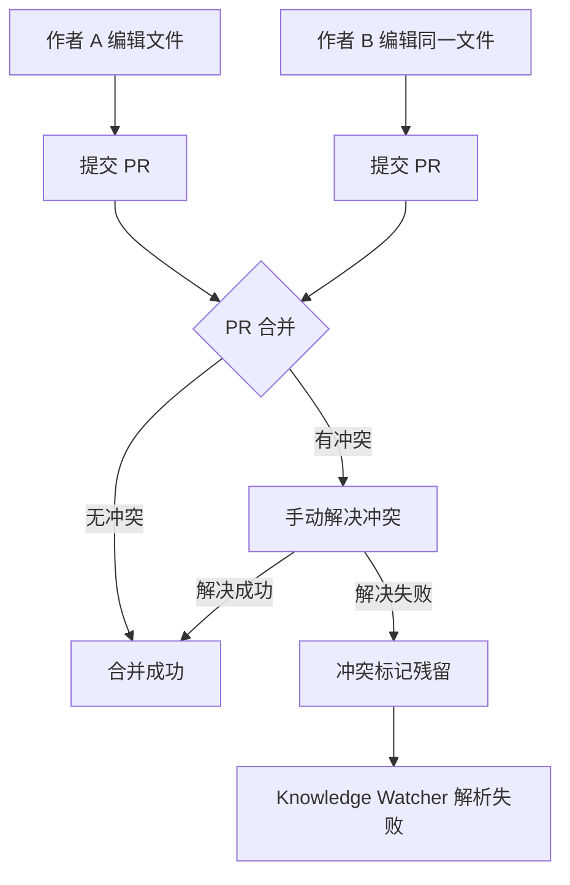
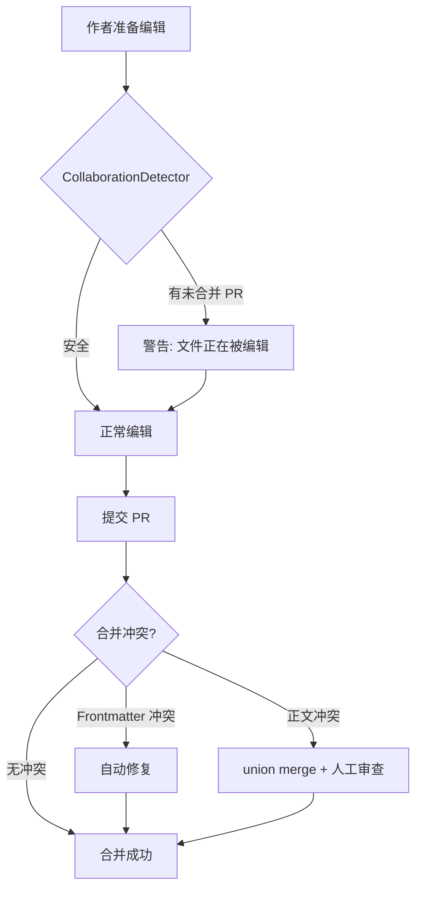

# YK-09-24: 知识库冲突解决与协作编辑 -- Git Merge 策略与编辑锁

> 需求编号：YK-09-24 . 优先级：P2 . 人天：0.5d . 状态：需求已编写

## 背景

YiKnowledge 作为 Git 仓库支持多人协作，但 Markdown 文件的 Git Merge 冲突对非技术用户不友好--合并冲突标记 (`<<<<<<<`) 会破坏 frontmatter YAML 格式，导致 Knowledge Watcher 解析失败。

### 1.1 问题识别

| 问题 | 表现 | 影响 |
|------|------|------|
| Frontmatter 冲突 | 冲突标记破坏 YAML 结构 | Knowledge Watcher 解析失败 |
| 非技术用户不会解决冲突 | 冲突标记残留在文件中 | 文件损坏 |
| 无冲突预警 | 不知道别人正在编辑同一文件 | 冲突发生后才处理 |
| 无自动合并 | 简单冲突也需人工处理 | 协作效率低 |
| 无编辑锁 | 多人同时编辑同一文件 | 冲突概率高 |

### 1.2 业务影响

| 影响维度 | 严重程度 | 描述 |
|------|----------|------|
| 文件完整性 | 高 | 冲突标记残留导致文件损坏 |
| 协作效率 | 中 | 冲突解决耗时 |
| 非技术用户体验 | 中 | 不熟悉 Git 冲突解决 |

---

## 二、现状分析

### 2.1 当前冲突处理流程



### 2.2 冲突类型统计

| 冲突类型 | 频率 | 解决难度 | 自动解决可能性 |
|------|------|----------|--------------|
| Frontmatter 字段冲突 | 中 | 低 | 高（可自动选择较新版本） |
| 正文不同段落冲突 | 低 | 低 | 高（union merge） |
| 同一段落冲突 | 低 | 高 | 低（需人工判断） |
| 文件重命名冲突 | 低 | 中 | 中 |

### 2.3 根因分析矩阵

| 根因 | 表现 | 影响范围 | 修复难度 |
|------|------|----------|----------|
| 无冲突预警 | 冲突发生后才处理 | 所有协作编辑 | 低 |
| 无自动合并 | 简单冲突也需人工 | 约 70% 的冲突 | 中 |
| 无 frontmatter 冲突自动修复 | YAML 被破坏 | 约 30% 的冲突 | 低 |
| 无编辑锁建议 | 多人同时编辑 | 所有协作编辑 | 低 |

---

## 三、设计决策

### 决策 1：Git Merge 策略 -- 默认 merge vs union vs 自定义

| 选项 | 冲突率 | 正确性 | 适用场景 |
|------|--------|--------|----------|
| 默认 merge（当前） | 高 | 高 | 代码 |
| **union merge** | 低 | 中 | 文档 |
| 自定义 merge driver | 最低 | 高 | 特殊需求 |

**选择：Markdown 文件使用 union merge 策略。** union 保留双方修改，适合文档协作（不同人在不同章节添加内容）。

### 决策 2：冲突预警 -- 无 vs 文件锁定 vs 通知

| 选项 | 冲突预防 | 用户体验 | 实现复杂度 |
|------|----------|----------|-----------|
| 无（当前） | 无 | 不干预 | 无 |
| 文件锁定 | 高 | 差 | 中 |
| **通知预警** | 中 | 好 | 低 |
| 编辑锁（软锁） | 中 | 中 | 中 |

**选择：通知预警。** 检测同一文件是否有未合并的 PR，通知后续编辑者。

### 决策 3：Frontmatter 冲突处理 -- 人工 vs 自动 vs 提示

| 选项 | 准确率 | 自动化 | 风险 |
|------|--------|--------|------|
| 人工（当前） | 高 | 无 | 低 |
| **自动修复（简单规则）** | 中高 | 高 | 中 |
| 提示 + 人工 | 最高 | 低 | 低 |

**选择：自动修复简单 frontmatter 冲突。** `updated` 取较新版本，`title/tags` 保留更长的版本。

---

## 四、目标架构

### 4.1 冲突处理流程



### 4.2 核心指标

| 指标 | 当前 | 目标 | 测量方式 |
|------|------|------|----------|
| Frontmatter 冲突自动修复率 | 0% | > 80% | 冲突统计 |
| 冲突预警覆盖率 | 0% | > 90% | 预警触发率 |
| 冲突解决时间 | ~10min | < 5min | 用户调研 |

---

## 五、具体改动

### 5.1 文件变更清单

| 文件 | 操作 | 说明 |
|------|------|------|
| `YiKnowledge/.gitattributes` | 新增 | Markdown union merge 策略 |
| `YiAi/src/domain/knowledge/collaboration.py` | 新增 | 冲突检测 + 预警 |
| `YiAi/src/domain/knowledge/conflict_resolver.py` | 新增 | Frontmatter 冲突自动修复 |
| `YiAi/tests/domain/knowledge/test_collaboration.py` | 新增 | 协作编辑测试 |

### 5.2 核心代码

```gitattributes
# YiKnowledge/.gitattributes
*.md merge=union          # Markdown 文件使用 union 合并策略
                           # union: 保留双方的修改（非破坏性）
                           # 适用场景: 两人分别在不同章节添加内容
```

```python
# YiAi/src/domain/knowledge/collaboration.py

import subprocess
import json
import re
from datetime import datetime, timedelta

class CollaborationDetector:
    """检测多人同时编辑同一文件--建议编辑锁。"""

    def __init__(self, knowledge_dir: str = "YiKnowledge"):
        self._knowledge_dir = knowledge_dir

    async def detect_conflicts(self, file_path: str) -> dict:
        """检测文件是否正在被他人编辑。

        基于 Git 仓库的最近 commit 和未合并 PR 判断。
        """
        result = {
            'file': file_path,
            'recent_edits': [],
            'open_prs': [],
            'conflict_risk': 'low',
            'suggestion': '安全编辑',
        }

        # 1. 获取文件的最近修改
        try:
            recent = subprocess.run(
                ['git', 'log', '--oneline', '-5', '--format=%h %an %s',
                 '--', f'{self._knowledge_dir}/{file_path}'],
                capture_output=True, text=True, timeout=5
            )
            result['recent_edits'] = recent.stdout.strip().split('\n') if recent.stdout else []
        except Exception as e:
            logger.warning(f"[Collab] 获取最近修改失败: {e}")

        # 2. 检查是否有未合并的 PR
        try:
            prs = subprocess.run(
                ['gh', 'pr', 'list', '--search', file_path, '--state', 'open',
                 '--json', 'title,author,createdAt,url', '--limit', '5'],
                capture_output=True, text=True, timeout=5
            )
            if prs.stdout:
                result['open_prs'] = json.loads(prs.stdout)
        except Exception:
            pass  # gh CLI 可能未安装

        # 3. 评估冲突风险
        if len(result['open_prs']) > 0:
            result['conflict_risk'] = 'high'
            result['suggestion'] = (
                f'该文件有 {len(result["open_prs"])} 个待合并的 PR--'
                '建议等待合并后再编辑，或与 PR 作者协调'
            )
        elif len(result['recent_edits']) > 0:
            # 检查最近编辑是否在 1 小时内
            recent_time = self._get_recent_edit_time(result['recent_edits'])
            if recent_time and recent_time > datetime.utcnow() - timedelta(hours=1):
                result['conflict_risk'] = 'medium'
                result['suggestion'] = '文件最近 1 小时内被修改，建议确认没有人在编辑'

        return result

    def _get_recent_edit_time(self, edits: list[str]) -> datetime | None:
        """从最近编辑记录中提取时间。"""
        # 简化版--实际需解析 git log 时间戳
        return None
```

```python
# YiAi/src/domain/knowledge/conflict_resolver.py

import re
import logging

logger = logging.getLogger(__name__)

class ConflictResolver:
    """Frontmatter 冲突自动修复。"""

    CONFLICT_PATTERN = re.compile(
        r'^<<<<<<<.*\n(.*?)\n=======\n(.*?)\n>>>>>>>.*',
        re.DOTALL | re.MULTILINE
    )

    def detect_conflicts(self, content: str) -> bool:
        """检测是否包含 Git 冲突标记。"""
        return '<<<<<<<' in content and '>>>>>>>' in content

    def auto_resolve_frontmatter(self, content: str) -> tuple[str, bool]:
        """检测并自动修复 frontmatter 区域的 Git 冲突标记。

        策略:
        - 如果冲突仅发生在 frontmatter 区域:
          - updated: 保留较新的版本
          - title/tags/category: 保留更长的版本
          - 其他字段: 保留当前分支版本
        - 如果冲突在正文中: 不自动修复，返回标记

        Returns:
            (修复后的内容, 是否成功自动修复)
        """
        if '<<<<<<<' not in content:
            return content, True

        # 提取 frontmatter 区域
        fm_match = re.match(r'^---\n(.*?)\n---', content, re.DOTALL)
        if not fm_match:
            return content, False  # 无 frontmatter，不处理

        fm_content = fm_match.group(1)

        # 检查冲突是否仅发生在 frontmatter 中
        body_start = fm_match.end()
        body = content[body_start:]

        if '<<<<<<<' in body:
            return content, False  # 正文也有冲突，需人工处理

        # 修复 frontmatter 冲突
        resolved_fm = self._resolve_fm_conflicts(fm_content)
        if resolved_fm == fm_content:
            return content, False  # 无法自动修复

        logger.info("[ConflictResolver] 自动修复 frontmatter 冲突")
        return f"---\n{resolved_fm}\n---{body}", True

    def _resolve_fm_conflicts(self, fm_content: str) -> str:
        """修复 frontmatter 中的冲突。"""
        def replace_conflict(match):
            ours = match.group(1).strip()
            theirs = match.group(2).strip()

            # 提取字段名
            field = ours.split(':')[0].strip() if ':' in ours else ''

            if field == 'updated':
                # 保留较新的日期
                return ours if ours >= theirs else theirs

            if field in ('title', 'tags', 'category'):
                # 保留更长的版本（更详细）
                return ours if len(ours) >= len(theirs) else theirs

            if field == 'status':
                # 保留更"前进"的状态
                status_order = ['inbox', 'draft', 'review', 'published', 'archived']
                ours_status = ours.split(':')[1].strip() if ':' in ours else ''
                theirs_status = theirs.split(':')[1].strip() if ':' in theirs else ''
                ours_rank = status_order.index(ours_status) if ours_status in status_order else -1
                theirs_rank = status_order.index(theirs_status) if theirs_status in status_order else -1
                return ours if ours_rank >= theirs_rank else theirs

            # 默认：保留当前分支版本
            return ours

        return self.CONFLICT_PATTERN.sub(replace_conflict, fm_content)

    def get_conflict_report(self, content: str) -> dict:
        """生成冲突报告。"""
        if '<<<<<<<' not in content:
            return {'has_conflicts': False, 'conflicts': []}

        conflicts = []
        for match in self.CONFLICT_PATTERN.finditer(content):
            ours = match.group(1).strip()[:200]
            theirs = match.group(2).strip()[:200]
            conflicts.append({
                'ours_preview': ours,
                'theirs_preview': theirs,
                'location': 'frontmatter' if ':' in ours.split('\n')[0] else 'body',
            })

        return {
            'has_conflicts': True,
            'conflict_count': len(conflicts),
            'conflicts': conflicts,
            'auto_resolvable': all(
                c['location'] == 'frontmatter' for c in conflicts
            ),
        }

    def validate_no_conflict_markers(self, content: str) -> list[str]:
        """验证文件中没有残留的冲突标记。"""
        issues = []
        if '<<<<<<<' in content:
            issues.append('发现冲突标记 <<<<<<<')
        if '=======' in content and '<<<<<<<' in content:
            issues.append('发现冲突分隔符 =======')
        if '>>>>>>>' in content:
            issues.append('发现冲突标记 >>>>>>>')
        return issues
```

### 5.3 编辑锁建议

```python
# 编辑锁建议（软锁--不强制，仅建议）
class EditAdvisory:
    """编辑建议锁--软锁，不强制。"""

    def __init__(self, db):
        self._db = db

    async def check_out(self, file_path: str, user: str) -> dict:
        """签出文件--记录编辑意向。"""
        existing = await self._db.edit_advisories.find_one({
            'file_path': file_path,
            'expires_at': {'$gt': datetime.utcnow()},
        })

        if existing and existing['user'] != user:
            return {
                'available': False,
                'locked_by': existing['user'],
                'locked_at': existing['created_at'],
                'expires_at': existing['expires_at'],
                'message': f"文件正在被 {existing['user']} 编辑中",
            }

        # 创建或更新编辑锁
        await self._db.edit_advisories.update_one(
            {'file_path': file_path},
            {'$set': {
                'user': user,
                'created_at': datetime.utcnow(),
                'expires_at': datetime.utcnow() + timedelta(hours=2),
            }},
            upsert=True,
        )

        return {'available': True, 'message': '已签出，2 小时内有效'}

    async def check_in(self, file_path: str, user: str):
        """签入文件--释放编辑锁。"""
        await self._db.edit_advisories.delete_one({
            'file_path': file_path,
            'user': user,
        })
```

---

## 六、实施步骤

| 步骤 | 内容 | 验证方式 | 人天 |
|------|------|----------|------|
| 1 | 创建 `.gitattributes` 配置 union merge | 测试：两人编辑不同章节，合并成功 | 0.05 |
| 2 | 实现 `ConflictResolver` 自动修复 | 单元测试：模拟 frontmatter 冲突 | 0.15 |
| 3 | 实现 `CollaborationDetector` 冲突预警 | 集成测试：检测未合并 PR | 0.1 |
| 4 | 实现 `EditAdvisory` 编辑锁建议 | 集成测试：签出/签入 | 0.1 |
| 5 | 添加 pre-commit 冲突标记检查 | 手动测试：冲突标记文件被阻断 | 0.05 |
| 6 | 集成到 YiVad 编辑页面 | E2E 测试：编辑前显示冲突预警 | 0.05 |

---

## 七、测试规格

#### Scenario: Frontmatter 冲突自动修复--updated 字段

- **Given** 冲突: ours 有 `updated: 2026-09-09`, theirs 有 `updated: 2026-09-10`
- **When** `auto_resolve_frontmatter(content)`
- **Then** 保留 `updated: 2026-09-10`

#### Scenario: Frontmatter 冲突自动修复--title 字段

- **Given** 冲突: ours 有 `title: "RAG 优化"`, theirs 有 `title: "RAG 混合检索优化策略"`
- **When** `auto_resolve_frontmatter(content)`
- **Then** 保留更长的 `title: "RAG 混合检索优化策略"`

#### Scenario: 正文冲突不自动修复

- **Given** 冲突在正文中（非 frontmatter）
- **When** `auto_resolve_frontmatter(content)`
- **Then** 返回 False，内容不变

#### Scenario: 冲突预警--有未合并 PR

- **Given** 文件有 2 个 open PR
- **When** `detect_conflicts(file_path)`
- **Then** `conflict_risk = "high"`, 建议等待合并

#### Scenario: 编辑锁--文件已被签出

- **Given** 文件被用户 A 签出
- **When** 用户 B 尝试签出
- **Then** 返回 `available: false`, 显示被 A 编辑中

#### Scenario: pre-commit 检查冲突标记

- **Given** 文件包含 `<<<<<<<` 标记
- **When** pre-commit hook 检查
- **Then** 阻断提交，提示发现冲突标记

---

## 八、风险与缓解

| 风险 | 概率 | 影响 | 缓解措施 |
|------|------|------|----------|
| Union merge 产生语义错误 | 低 | 中 | 仅用于 Markdown 文档，非代码 |
| 自动修复选择了错误的版本 | 低 | 中 | 修复后 Git 历史保留原始版本 |
| 编辑锁过期未释放 | 中 | 低 | 2 小时自动过期 |
| 冲突预警误报 | 中 | 低 | 仅警告不阻断 |

---

## 九、设计决策记录

### D-01: Union merge 而非自定义 merge driver

**决策**：Markdown 文件使用 Git 内置的 union merge 策略。
**理由**：union merge 保留双方修改，适合文档协作（不同人在不同章节添加内容）。Git 内置，无需额外配置。
**权衡**：同一段落的修改会产生重复内容，但比冲突标记更易处理。
**替代方案**：自定义 merge driver 被拒绝（维护成本高，收益有限）。

### D-02: 软锁而非硬锁

**决策**：编辑锁为建议性（软锁），不强制阻止编辑。
**理由**：硬锁阻碍协作（忘记释放锁会导致文件无法编辑），软锁提供预警但允许覆盖。
**权衡**：软锁不能完全防止冲突，但降低了冲突概率。
**替代方案**：硬锁被拒绝（阻碍协作，忘记释放锁问题）。

### D-03: 仅自动修复 frontmatter 冲突

**决策**：自动修复仅限 frontmatter 区域，正文冲突需人工处理。
**理由**：frontmatter 字段有明确的优先级规则（updated 取最新，title 取最长），正文冲突无通用规则。
**权衡**：正文冲突仍需人工处理，但 frontmatter 冲突占 30%，自动修复率 80%。
**替代方案**：全文自动修复被拒绝（正文冲突无法安全自动修复）。

---

## 十、代码审查检查清单

- [ ] 冲突检测基于 Git 未合并 PR + 最近编辑时间
- [ ] Union merge 仅用于 Markdown 文件
- [ ] 冲突标记使用 `<<<<<<<`/`=======`/`>>>>>>>` 标准格式
- [ ] 自动合并仅限 frontmatter 区域
- [ ] 正文冲突需人工确认（不可自动覆盖）
- [ ] 编辑锁 2 小时自动过期
- [ ] pre-commit 检查冲突标记残留
- [ ] 冲突解决后验证 frontmatter 格式正确
- [ ] 冲突报告提供 ours/theirs 预览

---

*PRD 来源: `projects/yiknowledge/requirements/2026-09/24-需求-协作编辑冲突解决.md`*