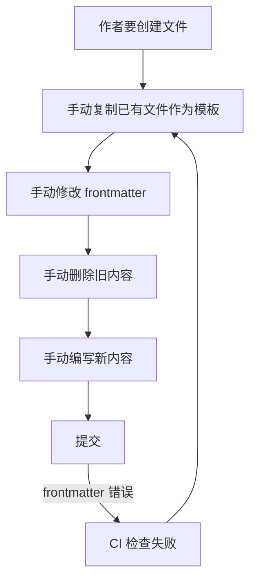
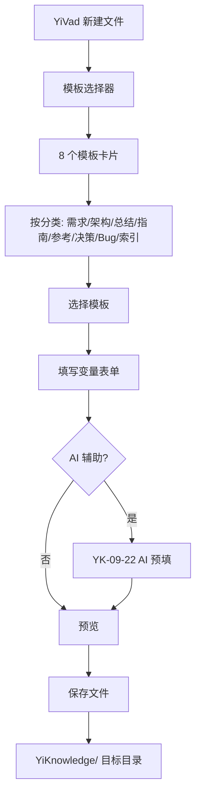

# YK-09-25: 知识库模板市场 -- 可复用的文件模板库与快速创建

> 需求编号：YK-09-25 . 优先级：P2 . 人天：0.5d . 状态：需求已编写

## 背景

MEMORY.md 定义了知识文件模板规范（5 种文档类型 + 标准 frontmatter），但作者每次创建文件仍需手动复制模板。YiVad 知识库页面可提供"从模板创建"功能--一键生成符合规范的骨架文件。

### 1.1 问题识别

| 问题 | 表现 | 影响 |
|------|------|------|
| 手动复制模板 | 每次创建文件需手动复制粘贴 | 效率低 |
| 模板不统一 | 作者可能使用过时或自定义模板 | 格式不一致 |
| 无模板发现 | 新作者不知道有哪些模板可用 | 入门困难 |
| 无模板变量 | 手动替换占位符 | 容易遗漏 |

### 1.2 业务价值

| 维度 | 价值 |
|------|------|
| 创建效率 | 一键生成符合规范的骨架文件，创建时间减少 50% |
| 格式一致性 | 所有文件使用统一模板，确保 frontmatter 规范 |
| 新成员上手 | 模板引导新作者了解知识文件结构 |
| 最佳实践分享 | 优秀模板可被其他作者复用 |

---

## 二、现状分析

### 2.1 当前创建流程



### 2.2 根因分析矩阵

| 根因 | 表现 | 影响范围 | 修复难度 |
|------|------|----------|----------|
| 无模板系统 | 作者手动复制修改 | 所有新文件 | 低 |
| 无变量替换 | 占位符手动修改 | 所有新文件 | 低 |
| 无模板市场 | 模板不可发现 | 新作者 | 低 |
| 无模板治理 | 模板质量无保障 | 所有模板 | 低 |

---

## 三、设计决策

### 决策 1：模板存储 -- 文件系统 vs MongoDB vs 代码内

| 选项 | 版本控制 | 可编辑性 | 发现性 | 实现复杂度 |
|------|----------|----------|--------|-----------|
| **文件系统 (YiKnowledge/templates/)** | Git 天然支持 | 高 | 中 | 低 |
| MongoDB | 需额外机制 | 中 | 高 | 中 |
| 代码内 (Python dict) | 需发版 | 低 | 低 | 最低 |

**选择：文件系统。** 模板作为 Markdown 文件存在 `YiKnowledge/templates/`，Git 版本控制，Knowledge Watcher 自动索引。

### 决策 2：模板变量语法 -- 无 vs Jinja2 vs 简单占位符

| 选项 | 功能 | 复杂度 | 学习成本 |
|------|------|--------|----------|
| 无 | 无 | 无 | 无 |
| Jinja2 | 强大 | 高 | 中 |
| **简单占位符 `{variable}`** | 基础 | 低 | 低 |

**选择：简单占位符 `{variable}`。** 满足基本需求，学习成本低，避免 Jinja2 的复杂语法和依赖。

### 决策 3：模板市场 -- 仅列表 vs 分类 vs 评分

| 选项 | 发现性 | 质量控制 | 实现复杂度 |
|------|--------|----------|-----------|
| 仅列表 | 低 | 无 | 最低 |
| **分类 + 描述** | 中 | 中 | 低 |
| 评分 + 评论 | 高 | 高 | 高 |

**选择：分类 + 描述。** 模板按文档类型分类，每个模板有 frontmatter 描述。评分评论后续扩展。

---

## 四、目标架构

### 4.1 模板创建流程



### 4.2 核心指标

| 指标 | 当前 | 目标 | 测量方式 |
|------|------|------|----------|
| 新文件 frontmatter 一次通过率 | ~60% | > 95% | CI 通过率 |
| 新文件创建时间 | ~30min | < 15min | 作者调研 |
| 模板使用率 | 0% | > 70% | 模板渲染调用统计 |

---

## 五、具体改动

### 5.1 文件变更清单

| 文件 | 操作 | 说明 |
|------|------|------|
| `YiKnowledge/templates/` 目录 | 新增 | 8 个模板文件 |
| `YiAi/src/services/knowledge/template_service.py` | 新增 | 模板管理服务 |
| `YiAi/tests/services/knowledge/test_template_service.py` | 新增 | 模板服务测试 |

### 5.2 模板文件

```
YiKnowledge/templates/
├── requirement-template.md    # 需求文档模板
├── architecture-template.md   # 架构设计模板
├── summary-template.md        # 概述类模板
├── guide-template.md          # 指南类模板
├── reference-template.md      # 参考类模板
├── decision-template.md       # 决策记录 (ADR) 模板
├── bug-report-template.md     # Bug 报告模板
└── index-template.md          # 目录索引模板
```

```markdown
<!-- YiKnowledge/templates/requirement-template.md -->
---
title: "{标题——简洁描述需求}"
tags: [需求文档, {项目}, {模块}, {类型}]
category: 项目/{项目}/需求
created: {YYYY-MM-DD}
updated: {YYYY-MM-DD}
source: internal
type: 需求
status: 需求已编写
priority: {P0/P1/P2/P3}
project: {项目名}
project_id: {项目id}
owner: {负责人}
prd_month: "{YYYYMM}"
prd_task_id: {任务编号}
estimate_frontend: {人天}
review_status: 待评审
issue_type: {功能/架构/质量/稳定性}
roles: [{角色}]
---

# {任务编号}: {标题}

> 需求编号：{任务编号} · 优先级：{P0/P1/P2/P3} · 人天：{人天}d · 状态：需求已编写

## 背景

{描述问题背景——为什么需要这个需求？}

### 问题识别

| 问题 | 表现 | 影响 |
|------|------|------|
| {问题1} | {表现} | {影响} |

### 业务影响

| 影响维度 | 严重程度 | 描述 |
|----------|----------|------|
| {维度} | {高/中/低} | {描述} |

---

## 现状分析

{描述当前状态，包括数据流和根因分析}

---

## 设计决策

### 决策 1：{决策标题}

| 选项 | 优点 | 缺点 | 适用场景 |
|------|------|------|----------|
| 选项 A | {优点} | {缺点} | {场景} |
| **选项 B（选择）** | {优点} | {缺点} | {场景} |

---

## 目标架构

{描述目标架构——mermaid 图 + 核心指标}

---

## 具体改动

| 文件 | 操作 | 说明 |
|------|------|------|
| {文件路径} | {新增/修改/删除} | {说明} |

---

## 实施步骤

| 步骤 | 内容 | 验证方式 | 人天 |
|------|------|----------|------|
| 1 | {内容} | {验证} | {人天} |

---

## 测试规格

#### Scenario: {场景描述}

- **Given** {前置条件}
- **When** {触发操作}
- **Then** {预期结果}

---

## 风险与缓解

| 风险 | 概率 | 影响 | 缓解措施 |
|------|------|------|----------|
| {风险} | {概率} | {影响} | {措施} |

---

## 代码审查检查清单

- [ ] {检查项}

---

*PRD 来源: `projects/{项目}/requirements/{YYYY-MM}/{文件编号}-{文件名}.md`*
```

### 5.3 模板服务

```python
# YiAi/src/services/knowledge/template_service.py

from pathlib import Path
import re
from datetime import datetime

class TemplateService:
    """知识文件模板管理。"""

    TEMPLATE_VARIABLE_PATTERN = re.compile(r'\{([^}]+)\}')

    def __init__(self, templates_dir: str = "YiKnowledge/templates"):
        self._templates_dir = Path(templates_dir)
        self._templates: dict[str, dict] = {}
        self._load_templates()

    def _load_templates(self):
        """加载所有模板文件。"""
        if not self._templates_dir.exists():
            logger.warning(f"[Template] 模板目录不存在: {self._templates_dir}")
            return

        self._templates = {}
        for tmpl_file in self._templates_dir.glob("*.md"):
            try:
                with open(tmpl_file) as f:
                    content = f.read()

                template_id = tmpl_file.stem.replace('-template', '')
                self._templates[template_id] = {
                    'id': template_id,
                    'file': tmpl_file.name,
                    'content': content,
                    'description': self._extract_description(content),
                    'variables': self._extract_variables(content),
                    'category': self._infer_category(template_id),
                }
            except Exception as e:
                logger.error(f"[Template] 加载模板失败: {tmpl_file} - {e}")

        logger.info(f"[Template] 加载了 {len(self._templates)} 个模板")

    def list_templates(self) -> list[dict]:
        """列出所有可用模板。"""
        return [
            {
                'id': t['id'],
                'description': t['description'],
                'category': t['category'],
                'variable_count': len(t['variables']),
                'variables': t['variables'],
            }
            for t in self._templates.values()
        ]

    def get_template(self, template_id: str) -> dict | None:
        """获取单个模板。"""
        return self._templates.get(template_id)

    def render_template(self, template_id: str,
                        variables: dict = None) -> str:
        """渲染模板--替换变量占位符。"""
        template = self._templates.get(template_id)
        if not template:
            raise ValueError(f"模板不存在: {template_id}")

        content = template['content']
        variables = variables or {}

        # 自动填充默认变量
        defaults = self._get_default_variables()
        for key, value in defaults.items():
            if key not in variables:
                variables[key] = value

        # 替换变量
        def replace_var(match):
            var_name = match.group(1)
            return str(variables.get(var_name, match.group(0)))

        return self.TEMPLATE_VARIABLE_PATTERN.sub(replace_var, content)

    def get_variables(self, template_id: str) -> list[str]:
        """获取模板所需变量列表。"""
        template = self._templates.get(template_id)
        if not template:
            return []
        return template['variables']

    def preview_template(self, template_id: str) -> str:
        """预览模板--用默认值填充变量。"""
        return self.render_template(template_id, self._get_default_variables())

    def _extract_description(self, content: str) -> str:
        """从模板中提取描述。"""
        # 从 frontmatter title 提取
        match = re.search(r'title:\s*"([^"]+)"', content)
        if match:
            return match.group(1)
        return ""

    def _extract_variables(self, content: str) -> list[str]:
        """提取模板中的变量名。"""
        variables = set()
        for match in self.TEMPLATE_VARIABLE_PATTERN.finditer(content):
            variables.add(match.group(1))
        return sorted(variables)

    def _infer_category(self, template_id: str) -> str:
        """推断模板分类。"""
        category_map = {
            'requirement': '需求文档',
            'architecture': '架构设计',
            'summary': '概述总结',
            'guide': '使用指南',
            'reference': '参考文档',
            'decision': '决策记录',
            'bug-report': '缺陷报告',
            'index': '目录索引',
        }
        return category_map.get(template_id, '其他')

    def _get_default_variables(self) -> dict:
        """获取默认变量值。"""
        now = datetime.now()
        return {
            'YYYY-MM-DD': now.strftime('%Y-%m-%d'),
            'YYYYMM': now.strftime('%Y%m'),
            'YYYY': str(now.year),
            '标题': '新知识文件',
            '项目': 'YiKnowledge',
            '项目名': 'YiKnowledge',
            '项目id': 'yiknowledge',
            '任务编号': f'YK-{now.strftime("%y%m")}-XX',
            '人天': '1.0',
            '负责人': '未分配',
            'P0/P1/P2/P3': 'P2',
            '高/中/低': '中',
            '功能/架构/质量/稳定性': '架构',
            '角色': 'engineer',
            '类型': '架构',
            '模块': '知识库',
        }
```

### 5.4 YiVad 集成

```
知识库页面 → "新建文件" 按钮
  → 弹出模板选择器（8 个模板卡片，按分类展示）
  → 选择模板 → 填写变量表单（必填/可选字段标记）
  → AI 辅助预填（YK-09-22 集成，可选的智能填充）
  → 实时预览（右侧 Markdown 渲染）
  → 保存到 YiKnowledge/ 目标目录
  → 自动提交（可选）
```

---

## 六、实施步骤

| 步骤 | 内容 | 验证方式 | 人天 |
|------|------|----------|------|
| 1 | 创建 8 个模板文件 | 模板文件 frontmatter 格式正确 | 0.1 |
| 2 | 实现 `TemplateService` 加载和渲染 | 单元测试：渲染后变量被正确替换 | 0.1 |
| 3 | 实现模板列表 API | API 测试：返回 8 个模板 | 0.05 |
| 4 | 实现模板预览 API | API 测试：预览内容有效 | 0.05 |
| 5 | YiVad 前端集成 | E2E 测试：选择模板 → 填写 → 保存 | 0.15 |
| 6 | AI 辅助预填集成 | 集成测试：AI 预填变量 | 0.05 |

---

## 七、测试规格

#### Scenario: 模板列表

- **Given** templates/ 目录有 8 个模板文件
- **When** `list_templates()`
- **Then** 返回 8 个模板，每个有 id/description/category

#### Scenario: 模板渲染--变量替换

- **Given** 模板包含 `{标题}`, 变量 `{"标题": "RAG 优化"}`
- **When** `render_template("requirement", {"标题": "RAG 优化"})`
- **Then** 返回内容中 `{标题}` 被替换为 "RAG 优化"

#### Scenario: 模板渲染--默认变量

- **Given** 模板包含 `{YYYY-MM-DD}`, 未提供该变量
- **When** `render_template("requirement", {})`
- **Then** 返回内容中 `{YYYY-MM-DD}` 被替换为今天的日期

#### Scenario: 模板渲染--缺失变量保留

- **Given** 模板包含 `{未知变量}`, 未提供该变量
- **When** `render_template("requirement", {})`
- **Then** 返回内容中保留 `{未知变量}`（不替换）

#### Scenario: 模板预览

- **Given** 模板包含多个变量
- **When** `preview_template("requirement")`
- **Then** 所有变量被默认值替换

#### Scenario: 不存在的模板报错

- **Given** 模板 "nonexistent" 不存在
- **When** `render_template("nonexistent", {})`
- **Then** 抛出 ValueError

---

## 八、风险与缓解

| 风险 | 概率 | 影响 | 缓解措施 |
|------|------|------|----------|
| 模板变量渲染失败产生残缺文件 | 低 | 中 | 预览阶段全变量渲染，失败时阻断 |
| 模板市场膨胀--低质量模板积累 | 低 | 低 | 仅 Curator 可添加模板 |
| 模板过时 | 中 | 低 | 模板存储在 YiKnowledge 中，随规范更新 |
| 变量名冲突 | 低 | 低 | 使用描述性变量名，如 `{任务编号}` |

---

## 九、设计决策记录

### D-01: 简单占位符而非 Jinja2

**决策**：使用 `{variable}` 简单占位符，不使用 Jinja2 模板引擎。
**理由**：知识文件模板不需要条件/循环等复杂逻辑，简单占位符满足需求。避免 Jinja2 依赖和学习成本。
**权衡**：不支持条件渲染和循环，但知识文件模板不需要。
**替代方案**：Jinja2 被拒绝（过度设计，增加依赖）。

### D-02: 文件系统存储模板

**决策**：模板存储在 `YiKnowledge/templates/` 目录下。
**理由**：Git 版本控制，Knowledge Watcher 自动索引，Curator 可像编辑普通文件一样编辑模板。
**权衡**：不如 MongoDB 灵活（如模板使用统计），但简单可靠。
**替代方案**：MongoDB 存储被拒绝（增加复杂度，模板变更不易追踪）。

### D-03: 模板分类而非评分

**决策**：模板按文档类型分类，暂不引入评分系统。
**理由**：当前 8 个模板，分类足够。评分系统需要更多模板和使用数据才有意义。
**权衡**：后续模板增多后可扩展评分系统。
**替代方案**：评分系统被拒绝（当前模板数量不足以支撑评分）。

---

## 十、代码审查检查清单

- [ ] 模板存储在 `YiKnowledge/templates/` 目录下
- [ ] 每个模板有 frontmatter 描述（title/tags/category）
- [ ] 模板使用 `{variable}` 占位符语法
- [ ] 模板按分类浏览（需求/架构/决策/总结/指南/参考/Bug/索引）
- [ ] 用户可提交新模板（PR + Curator 审查）
- [ ] 模板渲染支持默认变量值
- [ ] 缺失变量保留占位符（不替换为空）
- [ ] 模板预览在保存前可用
- [ ] 模板变量名清晰描述性
- [ ] 模板与 AI 辅助写作（YK-09-22）集成

---

*PRD 来源: `projects/yiknowledge/requirements/2026-09/25-需求-模板市场.md`*