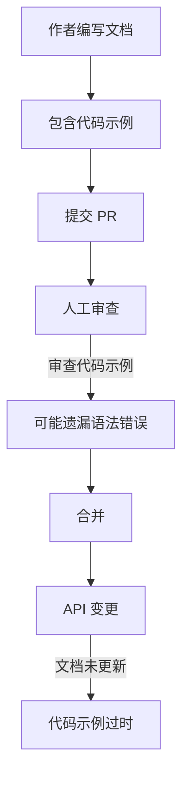
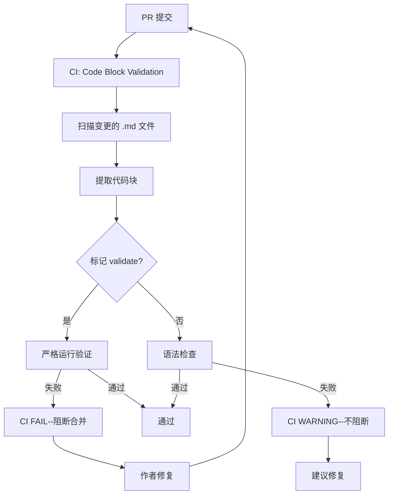

# YK-09-26: 知识文件代码示例可运行性验证 -- CI 自动化测试

> 需求编号：YK-09-26 . 优先级：P2 . 人天：0.5d . 状态：需求已编写

## 背景

YiKnowledge 的 Python/TypeScript 代码示例随文档更新而腐化--API 变更后文档中的代码示例未同步更新。CI 可自动提取代码块并运行验证。

### 1.1 问题识别

| 问题 | 表现 | 影响 |
|------|------|------|
| 代码示例过时 | API 变更后文档示例未更新 | 误导读者 |
| 语法错误 | 代码块包含语法错误 | 复制后无法运行 |
| 缺少导入 | 代码示例省略了必要的 import | 读者需要自行补充 |
| 版本不兼容 | 示例依赖旧版本 API | 新版本无法运行 |

### 1.2 业务价值

| 维度 | 价值 |
|------|------|
| 文档可靠性 | 代码示例通过 CI 验证，保证可运行 |
| 读者体验 | 复制代码后可直接运行 |
| 维护效率 | CI 自动发现代码示例问题 |

---

## 二、现状分析

### 2.1 当前流程



### 2.2 代码示例分布

| 语言 | 出现频率 | 可运行性 | 验证优先级 |
|------|----------|----------|-----------|
| Python | ~40% | 高 | 高 |
| Bash | ~20% | 中 | 中 |
| TypeScript/JavaScript | ~20% | 低（需 Node 环境） | 低 |
| YAML/JSON | ~10% | 中（格式验证） | 中 |
| 其他（SQL/Dockerfile） | ~10% | 低 | 低 |

### 2.3 根因分析矩阵

| 根因 | 表现 | 影响范围 | 修复难度 |
|------|------|----------|----------|
| 无代码验证 | 语法错误无法发现 | 约 40% Python 示例 | 低 |
| 无 CI 检查 | 代码示例只在 PR 时人工审查 | 所有文件 | 低 |
| API 变更未同步 | 文档未随代码更新 | 约 20% 的示例 | 中 |
| 无选择性验证 | 所有代码块都尝试运行 | 伪代码会失败 | 低 |

---

## 三、设计决策

### 决策 1：验证方式 -- 全部强制 vs 选择性标记 vs 仅语法检查

| 选项 | 覆盖率 | 误报率 | 适用场景 |
|------|--------|--------|----------|
| 全部强制 | 高 | 高（伪代码失败） | 仅可运行示例 |
| **选择性标记（` ```python validate`）** | 中 | 低 | 混合 |
| 仅语法检查 | 高 | 低 | 所有 |

**选择：选择性标记 + 语法检查。** 标记 `validate` 的代码块严格运行验证，未标记的仅语法检查。

### 决策 2：执行环境 -- 直接执行 vs Docker 沙箱 vs 进程隔离

| 选项 | 安全性 | 环境一致性 | 实现复杂度 |
|------|--------|-----------|-----------|
| 直接执行 | 低 | 低 | 最低 |
| Docker 沙箱 | 高 | 高 | 高 |
| **进程隔离 + 超时** | 中 | 中 | 低 |

**选择：进程隔离 + 超时保护。** 内部知识库，代码示例可信度高，进程隔离（subprocess + timeout + 内存限制）足够安全。

### 决策 3：失败处理 -- 阻断 vs 警告 vs 报告

| 选项 | 严格度 | 开发体验 | CI 影响 |
|------|--------|----------|---------|
| 阻断（CI fail） | 高 | 差 | 阻断合并 |
| **警告（CI warning）** | 中 | 中 | 不阻断 |
| 仅报告 | 低 | 好 | 无 |

**选择：标记 `validate` 的代码块失败时阻断，未标记的警告。** 明确标记的必须可运行，其他仅提示。

---

## 四、目标架构

### 4.1 验证流程



### 4.2 核心指标

| 指标 | 当前 | 目标 | 测量方式 |
|------|------|------|----------|
| Python 代码示例可运行率 | 未知 | > 90% | CI 验证通过率 |
| 代码示例语法错误发现时间 | 合并后 | PR 阶段 | CI 报告 |
| CI 验证耗时 | 无 | < 60s | CI 计时 |

---

## 五、具体改动

### 5.1 文件变更清单

| 文件 | 操作 | 说明 |
|------|------|------|
| `YiAi/tools/validate_code_blocks.py` | 新增 | 代码块验证脚本 |
| `.github/workflows/code-block-check.yml` | 新增 | CI 工作流 |
| `YiKnowledge/MEMORY.md` | 修改 | 代码块 validate 标记规范 |

### 5.2 核心代码

```python
# YiAi/tools/validate_code_blocks.py

import re
import subprocess
import sys
import json
import argparse
from pathlib import Path
from typing import Optional

class CodeBlockValidator:
    """从知识文件中提取代码块并在 CI 中验证可运行性。"""

    CODE_PATTERN = re.compile(
        r'```(\w+)(?:\s+validate)?\s*\n(.*?)```',
        re.DOTALL
    )

    # 可运行的语言
    RUNNABLE_LANGS = {
        'python': 'python',
        'py': 'python',
        'bash': 'bash',
        'sh': 'bash',
    }

    # 可做格式检查的语言
    FORMAT_CHECK_LANGS = {
        'yaml': 'yaml',
        'yml': 'yaml',
        'json': 'json',
    }

    TIMEOUT_SECONDS = 10

    def __init__(self, report_mode: str = 'ci'):
        """
        Args:
            report_mode: 'ci' (非零退出码) or 'json' (JSON 输出)
        """
        self._report_mode = report_mode

    def validate_file(self, file_path: str) -> list[dict]:
        """验证单个文件中的所有代码块。"""
        results = []

        try:
            with open(file_path) as f:
                content = f.read()
        except Exception as e:
            return [{'file': file_path, 'error': str(e)}]

        for match in self.CODE_PATTERN.finditer(content):
            lang = match.group(1).lower()
            code = match.group(2).strip()
            is_validate = 'validate' in match.group(0).split('\n')[0]

            if not code:
                continue

            result = {
                'file': file_path,
                'language': lang,
                'code_preview': code[:100],
                'is_validate': is_validate,
            }

            if lang in self.RUNNABLE_LANGS:
                success, output = self._run_code(lang, code)

                if is_validate:
                    result['severity'] = 'error'
                else:
                    result['severity'] = 'warning'

                result['success'] = success
                result['output'] = output[:500] if output else ''
                result['error'] = output[:200] if not success else None

            elif lang in self.FORMAT_CHECK_LANGS:
                success, output = self._check_format(lang, code)
                result['severity'] = 'warning'
                result['success'] = success
                result['error'] = output[:200] if output else None

            else:
                continue  # 跳过的语言

            results.append(result)

        return results

    def validate_directory(self, directory: str,
                          languages: list[str] = None) -> list[dict]:
        """验证目录中所有 Markdown 文件的代码块。"""
        all_results = []
        md_files = list(Path(directory).rglob('*.md'))

        for md_file in md_files:
            results = self.validate_file(str(md_file))
            all_results.extend(results)

        return all_results

    def _run_code(self, lang: str, code: str) -> tuple[bool, str]:
        """运行代码。"""
        if lang in ('python', 'py'):
            return self._run_python(code)
        elif lang in ('bash', 'sh'):
            return self._run_bash(code)
        return False, f'不支持的语言: {lang}'

    def _run_python(self, code: str) -> tuple[bool, str]:
        """运行 Python 代码。"""
        # 纠正常见错误：缺少 import
        wrapped_code = self._wrap_python_code(code)

        try:
            result = subprocess.run(
                ['python', '-c', wrapped_code],
                capture_output=True, text=True,
                timeout=self.TIMEOUT_SECONDS,
                env={'PYTHONPATH': '.', 'PATH': '/usr/local/bin:/usr/bin:/bin'},
            )
            if result.returncode == 0:
                return True, result.stdout
            else:
                return False, self._filter_traceback(result.stderr)
        except subprocess.TimeoutExpired:
            return False, f'执行超时 ({self.TIMEOUT_SECONDS}s)'
        except Exception as e:
            return False, str(e)

    def _run_bash(self, code: str) -> tuple[bool, str]:
        """运行 Bash 代码。"""
        # 安全：跳过危险命令
        danger_patterns = ['rm -rf', 'sudo', 'chmod 777', '> /dev/',
                          'mkfs', 'dd if=']
        for pattern in danger_patterns:
            if pattern in code.lower():
                return False, f'跳过危险命令: {pattern}'

        try:
            result = subprocess.run(
                ['bash', '-c', code],
                capture_output=True, text=True,
                timeout=self.TIMEOUT_SECONDS,
                cwd='/tmp',
            )
            if result.returncode == 0:
                return True, result.stdout
            else:
                return False, result.stderr
        except subprocess.TimeoutExpired:
            return False, f'执行超时 ({self.TIMEOUT_SECONDS}s)'
        except Exception as e:
            return False, str(e)

    def _wrap_python_code(self, code: str) -> str:
        """包装 Python 代码--纠正常见错误。"""
        # 如果代码中没有 import 但使用了常见库，尝试添加
        # 这里保持简单，不做自动 import
        return code

    def _filter_traceback(self, stderr: str) -> str:
        """过滤 Python traceback--仅保留关键错误行。"""
        lines = stderr.strip().split('\n')
        # 仅保留最后 5 行（错误信息）
        return '\n'.join(lines[-5:])

    def _check_format(self, lang: str, code: str) -> tuple[bool, str]:
        """检查代码格式（YAML/JSON）。"""
        if lang in ('yaml', 'yml'):
            try:
                import yaml
                yaml.safe_load(code)
                return True, ''
            except Exception as e:
                return False, f'YAML 格式错误: {e}'

        if lang == 'json':
            try:
                import json
                json.loads(code)
                return True, ''
            except Exception as e:
                return False, f'JSON 格式错误: {e}'

        return False, f'不支持的格式: {lang}'

    def generate_report(self, results: list[dict]) -> dict:
        """生成验证报告。"""
        errors = [r for r in results if r.get('severity') == 'error' and not r.get('success', True)]
        warnings = [r for r in results if r.get('severity') == 'warning' and not r.get('success', True)]
        passed = len(results) - len(errors) - len(warnings)

        return {
            'total': len(results),
            'passed': passed,
            'errors': len(errors),
            'warnings': len(warnings),
            'error_details': errors,
            'warning_details': warnings,
        }

    def run_ci(self, directory: str) -> int:
        """CI 模式运行--返回退出码。"""
        print(f"[CodeBlockValidator] 扫描目录: {directory}")
        results = self.validate_directory(directory)

        if not results:
            print("[CodeBlockValidator] 未发现代码块")
            return 0

        report = self.generate_report(results)

        print(f"\n[CodeBlockValidator] 验证报告:")
        print(f"  总计: {report['total']}")
        print(f"  通过: {report['passed']}")
        print(f"  错误: {report['errors']}")
        print(f"  警告: {report['warnings']}")

        if report['errors'] > 0:
            print(f"\n[ERRORS]")
            for err in report['error_details']:
                print(f"  {err['file']} ({err['language']}): {err.get('error', '')}")

        if report['warnings'] > 0:
            print(f"\n[WARNINGS]")
            for warn in report['warning_details']:
                print(f"  {warn['file']} ({warn['language']}): {warn.get('error', '')}")

        # 仅 error 导致 CI 失败
        return 1 if report['errors'] > 0 else 0


def main():
    parser = argparse.ArgumentParser(description='验证知识文件的代码块')
    parser.add_argument('directory', help='YiKnowledge 目录路径')
    parser.add_argument('--report', choices=['ci', 'json'], default='ci',
                       help='报告格式')
    args = parser.parse_args()

    validator = CodeBlockValidator(report_mode=args.report)

    if args.report == 'json':
        results = validator.validate_directory(args.directory)
        print(json.dumps(validator.generate_report(results), indent=2,
                        ensure_ascii=False))
        return 0
    else:
        return validator.run_ci(args.directory)


if __name__ == '__main__':
    sys.exit(main())
```

### 5.3 CI 工作流

```yaml
# .github/workflows/code-block-check.yml
name: Code Block Validation
on:
  pull_request:
    paths:
      - 'YiKnowledge/**/*.md'

jobs:
  validate:
    runs-on: ubuntu-latest
    steps:
      - uses: actions/checkout@v4

      - name: Setup Python
        uses: actions/setup-python@v5
        with:
          python-version: '3.12'

      - name: Install dependencies
        run: |
          pip install PyYAML

      - name: Validate Python code blocks
        run: |
          python YiAi/tools/validate_code_blocks.py YiKnowledge/ --report ci

      - name: Export JSON report
        if: always()
        run: |
          python YiAi/tools/validate_code_blocks.py YiKnowledge/ --report json > code-block-report.json

      - name: Upload report
        if: always()
        uses: actions/upload-artifact@v4
        with:
          name: code-block-report
          path: code-block-report.json
```

### 5.4 代码块标记规范

在 `YiKnowledge/MEMORY.md` 中添加：

````markdown
### 代码块验证标记

知识文件中需要 CI 验证可运行性的代码块，在语言标签后添加 `validate` 标记：

```python validate
import requests
response = requests.get("http://localhost:10086/health")
print(response.json())
```

- **标记 `validate`**：CI 会严格运行验证，失败时阻断合并
- **不标记**：CI 仅进行语法检查，失败时发出警告不阻断
- **适用语言**：Python、Bash（可运行）、YAML、JSON（格式检查）
````

---

## 六、实施步骤

| 步骤 | 内容 | 验证方式 | 人天 |
|------|------|----------|------|
| 1 | 实现 `CodeBlockValidator` 核心类 | 单元测试：Python/Bash/YAML 验证 | 0.15 |
| 2 | 实现 CI 工作流 | PR 触发 CI，检查运行结果 | 0.1 |
| 3 | 标记已有 validate 代码块 | 抽查 20 个文件的代码块可运行 | 0.1 |
| 4 | 更新 MEMORY.md 代码块标记规范 | Curator 审查 | 0.05 |
| 5 | 添加危险命令过滤 | 安全测试：危险命令被跳过 | 0.05 |
| 6 | 并行执行优化 | 性能测试：200+ 文件 < 60s | 0.05 |

---

## 七、测试规格

#### Scenario: Python 代码块验证通过

- **Given** 文件包含 ` ```python validate\nprint("hello")\n``` `
- **When** `validate_file(file_path)`
- **Then** 返回 `success: true`

#### Scenario: Python 代码块验证失败

- **Given** 文件包含 ` ```python validate\nprint(undefined_var)\n``` `
- **When** `validate_file(file_path)`
- **Then** 返回 `success: false`, `severity: "error"`

#### Scenario: 未标记代码块失败为警告

- **Given** 文件包含 ` ```python\nprint(undefined_var)\n``` `（无 validate 标记）
- **When** `validate_file(file_path)`
- **Then** 返回 `severity: "warning"`（不阻断 CI）

#### Scenario: YAML 格式检查

- **Given** 文件包含 ` ```yaml\nkey: value\n  bad_indent: x\n``` `
- **When** `validate_file(file_path)`
- **Then** 返回 `success: false`, `severity: "warning"`

#### Scenario: 危险 Bash 命令被跳过

- **Given** 文件包含 ` ```bash\nrm -rf /\n``` `
- **When** `_run_bash(code)`
- **Then** 返回 `success: false`, 错误信息包含 "跳过危险命令"

#### Scenario: 执行超时

- **Given** 代码包含无限循环
- **When** 执行代码
- **Then** 10s 后超时，返回 `success: false`, 错误信息包含 "超时"

#### Scenario: 无代码块的文件

- **Given** 文件不含任何代码块
- **When** `validate_file(file_path)`
- **Then** 返回空列表

---

## 八、风险与缓解

| 风险 | 概率 | 影响 | 缓解措施 |
|------|------|------|----------|
| 沙箱执行引入安全风险 | 低 | 中 | 危险命令黑名单 + 超时保护 + 进程隔离 |
| 代码块过多导致 CI 时间增长 | 中 | 低 | 仅检查变更文件 + 10s 超时 per block |
| 外部依赖缺失导致验证失败 | 中 | 中 | 仅标记 `validate` 的严格验证 |
| $PATH 和环境变量差异 | 低 | 低 | 使用标准 PATH，不依赖环境变量 |

---

## 九、设计决策记录

### D-01: 选择性标记而非全部强制

**决策**：仅 `validate` 标记的代码块严格运行验证，其他仅语法检查。
**理由**：知识文件中的代码示例有三类：(1) 完整可运行的示例；(2) 片段/伪代码；(3) 示意性代码。只有第一类应该严格验证。
**权衡**：需要作者添加 `validate` 标记，但这是低成本的意识性操作。
**替代方案**：全部强制验证被拒绝（伪代码和示意代码会大量失败）。

### D-02: CI WARNING 而非 CI FAIL

**决策**：未标记 `validate` 的代码块失败时发出 WARNING，不阻断 CI。
**理由**：伪代码/示意代码的语法错误不需要阻断合并，但应该提示作者关注。
**权衡**：可能导致一些真正错误的代码块被忽略，但作者关注 WARNING 的比例较高。
**替代方案**：全部 CI FAIL 被拒绝（误报率太高）。

### D-03: 进程隔离而非 Docker 沙箱

**决策**：使用 subprocess + timeout + 危险命令过滤，不使用 Docker。
**理由**：内部知识库，代码示例可信度高。Docker 沙箱增加 CI 复杂度和执行时间。
**权衡**：安全隔离不如 Docker，但内部风险低。
**替代方案**：Docker 沙箱被拒绝（CI 时间增加 3-5min，过度设计）。

---

## 十、代码审查检查清单

- [ ] 代码块按语言类型分别执行验证（Python/Bash/YAML/JSON）
- [ ] 进程隔离执行--每次执行有超时 + 危险命令过滤
- [ ] 验证结果标注：PASS/FAIL/WARNING
- [ ] 仅标记 `validate` 的代码块 CI FAIL（阻断合并）
- [ ] CI 中自动运行验证套件（PR 触发）
- [ ] Python traceback 过滤--仅显示最后 5 行
- [ ] Bash 危险命令黑名单（rm -rf / sudo / chmod 777）
- [ ] 超时 10s per block
- [ ] 验证报告 JSON 可导出
- [ ] 仅检查 PR 变更的文件（非全量）
- [ ] 跳过空代码块
- [ ] MEMORY.md 更新代码块标记规范

---

*PRD 来源: `projects/yiknowledge/requirements/2026-09/26-需求-代码示例验证.md`*