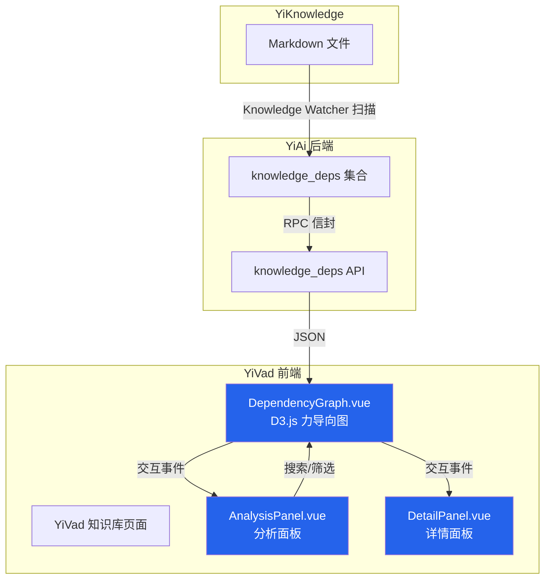

# YK-09-27: 知识库内部链接拓扑图可视化

> 需求编号：YK-09-27 · 优先级：P2 · 人天：0.5d · 状态：需求已编写
> 依赖：YK-09-08（跨项目知识依赖图谱）

---

## 一、背景

### 问题描述

YiKnowledge 作为 YrY 单体仓库的共享知识库，目前包含 800+ Markdown 文件。这些文件之间通过 Markdown 内部链接（`[text](path)` 语法）形成了复杂的引用关系网络。YK-09-08 已构建了 `knowledge_deps` 集合存储这些依赖关系，但当前数据仅通过 API 以 JSON 格式返回，缺少直观的可视化呈现。

### 影响范围

1. **知识结构不透明**：团队成员无法直观了解知识库的引用结构——哪些文件是核心枢纽、哪些是孤立节点、跨项目引用如何分布。
2. **维护成本高**：当需要重构文件路径时，无法快速评估影响范围（哪些文件引用了待迁移的文件）。
3. **知识发现困难**：新成员无法通过引用关系快速定位到关键文档，需要逐篇阅读。
4. **质量隐患**：断链（指向不存在文件的链接）和孤立文件（无入链也无出链）无法被及时发现。

### 核心挑战

- **渲染性能**：800+ 节点 + 2000+ 边的力导向图在浏览器中的渲染性能。
- **环路检测**：Markdown 链接可能存在循环引用（A→B→C→A），需要在图遍历时处理。
- **跨项目分组**：文件属于 4 个不同项目（YiVad、YiAi、YiPet、YiKnowledge），需要按项目分组着色。
- **交互体验**：力导向图的拖拽、缩放、悬停高亮等交互需要流畅实现。

---

## 二、现状分析

### 当前数据流

```mermaid
graph LR
    A[YiAi Knowledge Watcher<br/>apscheduler 5s 轮询] -->|扫描 YiKnowledge/*.md| B[解析 Markdown 链接]
    B -->|提取 [[text]](path) 语法| C[knowledge_deps 集合]
    C -->|RPC 信封| D[YiVad 前端]
    D -->|JSON 数组| E[当前: 纯文本展示]
    D -.->|目标: D3.js 力导向图| F[拓扑图可视化]

    style A fill:#059669,color:#fff
    style C fill:#7c3aed,color:#fff
    style E fill:#d97706,color:#fff
    style F fill:#2563eb,color:#fff
```

### 当前数据结构

```typescript
// knowledge_deps 集合中的文档结构
interface KnowledgeDep {
  source_file: string;       // 源文件路径（引用方）
  target_file: string;       // 目标文件路径（被引用方）
  dep_type: 'explicit_link' | 'frontmatter_ref' | 'tag_ref';
  project: 'yivad' | 'yiai' | 'yipet' | 'yiknowledge' | 'roles';
  strength: 'strong' | 'moderate' | 'weak';
  link_text: string;         // 链接显示文本
  created: string;
}
```

### 根因分析矩阵

| 问题 | 根本原因 | 影响 | 严重程度 |
|------|----------|------|----------|
| 引用关系不可见 | 依赖图谱仅通过 API 返回 JSON | 团队成员无法直观理解知识结构 | 高 |
| 断链无法发现 | 无可视化校验机制 | 用户点击链接后 404 | 中 |
| 孤立文件堆积 | 未被任何文件引用，未被发现 | 知识碎片化，降低 RAG 质量 | 中 |
| 跨项目引用隐式 | 仅通过路径前缀区分 | 项目间依赖关系不透明 | 低 |

---

## 三、设计决策

### 决策 D-01: 可视化库选择

| 方案 | 优点 | 缺点 | 决策 |
|------|------|------|------|
| A: D3.js v7 | 高度定制化、力导向图成熟、社区活跃 | 学习曲线陡峭、代码量大 | **选用** |
| B: ECharts | 配置简单、中文文档完善 | 力导向图定制性弱、大数据量卡顿 | 不选 |
| C: Cytoscape.js | 图分析专用、布局算法丰富 | 包体积大（~500KB）、Vue 集成不成熟 | 不选 |

**决策记录**：选择 D3.js v7，理由：
1. 力导向图（force simulation）是 D3.js 的核心能力，成熟度高。
2. YiVad 已有 D3.js 使用经验（其他图表组件），学习成本低。
3. 800+ 节点对 D3.js 力导向图来说在性能边界内（建议 < 2000 节点）。

### 决策 D-02: 图渲染策略

| 方案 | 优点 | 缺点 | 决策 |
|------|------|------|------|
| A: Canvas 渲染 | 大数据量性能好 | 事件处理复杂、样式受限 | 不选 |
| B: SVG 渲染 | 事件处理简单、CSS 样式可控 | 大数据量可能卡顿 | **选用** |
| C: WebGL 渲染 | 极大数量高性能 | 集成复杂、调试困难 | 不选 |

**决策记录**：选择 SVG 渲染，理由：
1. 800 节点在 SVG 渲染的性能边界内（< 1500 节点使用 SVG 是业界共识）。
2. 悬停/点击/拖拽等交互事件在 SVG 上实现更简单。
3. 与 Vue 3 的响应式系统集成更自然。

### 决策 D-03: 环路检测策略

| 方案 | 优点 | 缺点 | 决策 |
|------|------|------|------|
| A: DFS 检测 + 标记 | 精确检测所有环路 | 每次布局前需 O(V+E) 遍历 | **选用** |
| B: 拓扑排序 | 一次遍历完成 | 有环图无法拓扑排序 | 不选 |
| C: 忽略环路 | 无额外开销 | 力导向图可能无法收敛 | 不选 |

**决策记录**：选择 DFS 环路检测 + 标记，理由：
1. 环路在知识库中很少见（< 5%），但必须正确处理。
2. DFS 检测在 800 节点规模下耗时 < 50ms，可接受。
3. 标记环路边为红色虚线，提醒用户注意。

### 决策 D-04: 节点大小计算

| 方案 | 优点 | 缺点 | 决策 |
|------|------|------|------|
| A: 被引用次数 | 反映文档权威性 | 新文档节点极小 | **选用** |
| B: 文件大小 | 反映内容丰富度 | 不反映引用价值 | 不选 |
| C: 固定大小 | 视觉统一 | 丢失信息维度 | 不选 |

**决策记录**：选择被引用次数，理由：
1. 被引用次数直接反映文档在知识网络中的重要性。
2. 与 YK-09-40 PageRank 权威性评估逻辑一致。
3. 新文档设置最小节点半径（10px），避免视觉上消失。

---

## 四、目标架构

### 架构对比

**当前架构**：


**目标架构**：


### 可视化交互矩阵

| 交互 | 触发方式 | 行为 | 实现方式 |
|------|----------|------|----------|
| 悬停节点 | mouseenter | 高亮该节点及 1 跳邻居，其他节点淡出 | `d3.selectAll` 透明度控制 |
| 点击节点 | click | 右侧面板显示详情：文件名/引用数/最近修改 | 事件总线 → DetailPanel |
| 双击节点 | dblclick | 打开知识文件编辑器 | `router.push` 跳转 |
| 拖拽节点 | drag | 固定节点位置，其他节点重新布局 | `d3.drag()` + `fx/fy` 固定 |
| 缩放/平移 | 滚轮/拖拽画布 | 整体缩放 + 平移 | `d3.zoom()` |
| 搜索节点 | 输入框键入 | 高亮匹配节点，相机移动到该节点 | `d3.zoom().transform` |

### 分析面板指标

```
右侧分析面板:
├── 节点总数: 800+
├── 边总数: 1,245
├── 孤立节点: 23 个 (2.9%)
├── 断链数: 5 个 (0.4%)
├── 最高被引用: "RAG 混合检索优化.md" (17 次)
├── 跨项目链接: 156 条 (12.5%)
├── 循环引用: 3 组
└── 搜索节点: [___________] 🔍
```

### 关键指标

| 指标 | 当前值 | 目标值 | 测量方式 |
|------|--------|--------|----------|
| 图渲染时间（首次） | — | < 3s | Chrome DevTools Performance |
| 力导向图稳定时间 | — | < 5s | `simulation.on('end')` 回调 |
| 交互响应延迟 | — | < 100ms | 事件触发到重绘完成 |
| 浏览器内存占用 | — | < 200MB | Chrome Task Manager |
| 断链检出率 | 0% | 100% | 全部断链在分析面板中显示 |

---

## 五、具体改动

### 文件变更清单

| 文件 | 操作 | 说明 |
|------|------|------|
| `YiVad/src/views/knowledge/components/DependencyGraph.vue` | 新增 | D3.js 力导向图核心组件 |
| `YiVad/src/views/knowledge/components/AnalysisPanel.vue` | 新增 | 右侧分析面板（指标/搜索） |
| `YiVad/src/views/knowledge/components/DetailPanel.vue` | 新增 | 节点详情弹出面板 |
| `YiVad/src/api/services/knowledge.ts` | 修改 | 新增 `get_dependency_graph` 方法 |
| `YiVad/src/composables/useDependencyGraph.ts` | 新增 | D3.js 图操作 composable |
| `YiVad/package.json` | 修改 | 添加 `d3` + `@types/d3` 依赖 |
| `YiAi/src/services/knowledge/dep_graph.py` | 新增 | 依赖图谱 API 端点 |
| `YiAi/tests/knowledge/test_dep_graph.py` | 新增 | 依赖图谱 API 测试 |

### 核心代码示例

```typescript
// YiVad/src/views/knowledge/components/DependencyGraph.vue

interface GraphNode extends d3.SimulationNodeDatum {
  id: string;
  label: string;
  group: ProjectGroup;
  size: number;        // 被引用次数
  path: string;        // 文件路径
  isIsolated: boolean; // 是否孤立节点
}

interface GraphLink extends d3.SimulationLinkDatum<GraphNode> {
  strength: 'strong' | 'moderate' | 'weak';
  isCircular: boolean; // 是否为环路链接
}

type ProjectGroup = 'yivad' | 'yiai' | 'yipet' | 'yiknowledge' | 'roles';

const COLOR_MAP: Record<ProjectGroup, string> = {
  yivad: '#2563eb',
  yiai: '#059669',
  yipet: '#d97706',
  yiknowledge: '#7c3aed',
  roles: '#6b7280',
};

// 力导向图 Simulation 配置
const simulation = d3.forceSimulation<GraphNode>(nodes)
  .force('link', d3.forceLink<GraphNode, GraphLink>(links)
    .id(d => d.id)
    .distance(d => d.strength === 'strong' ? 50 :
                       d.strength === 'moderate' ? 100 : 150))
  .force('charge', d3.forceManyBody().strength(-300))
  .force('center', d3.forceCenter(width / 2, height / 2))
  .force('collision', d3.forceCollide().radius(d => Math.max(d.size * 2, 10)));

// 环路检测
function detectCycles(nodes: GraphNode[], links: GraphLink[]): Set<string> {
  const adj = new Map<string, string[]>();
  for (const l of links) {
    const key = typeof l.source === 'object' ? l.source.id : l.source;
    const val = typeof l.target === 'object' ? l.target.id : l.target;
    if (!adj.has(key)) adj.set(key, []);
    adj.get(key)!.push(val);
  }

  const cycles = new Set<string>();
  const visited = new Set<string>();
  const stack = new Set<string>();

  function dfs(node: string) {
    visited.add(node);
    stack.add(node);
    for (const neighbor of adj.get(node) || []) {
      if (stack.has(neighbor)) {
        // 发现环路——标记所有环路边
        cycles.add(`${node}->${neighbor}`);
      } else if (!visited.has(neighbor)) {
        dfs(neighbor);
      }
    }
    stack.delete(node);
  }

  for (const node of nodes) {
    if (!visited.has(node.id)) dfs(node.id);
  }
  return cycles;
}
```

### 后端 API 设计

```python
# YiAi/src/services/knowledge/dep_graph.py

async def get_dependency_graph(self, params: dict) -> dict:
    """获取依赖图谱数据——节点 + 边列表。

    parameters:
      project: str | None  # 可选，按项目筛选
      min_degree: int = 0  # 最小度数筛选（过滤孤立节点）
      max_nodes: int = 500 # 最大节点数（性能保护）
    """
    filter_query = {}
    if params.get('project'):
        filter_query['project'] = params['project']

    deps = await db.knowledge_deps.find(filter_query).to_list(None)

    # 构建节点集合
    nodes_map = {}
    links = []

    for dep in deps:
        # 源节点
        if dep['source_file'] not in nodes_map:
            nodes_map[dep['source_file']] = {
                'id': dep['source_file'],
                'label': dep['source_file'].split('/')[-1].replace('.md', ''),
                'group': dep.get('project', 'yiknowledge'),
                'incoming': 0,
                'outgoing': 0,
            }
        nodes_map[dep['source_file']]['outgoing'] += 1

        # 目标节点
        if dep['target_file'] not in nodes_map:
            nodes_map[dep['target_file']] = {
                'id': dep['target_file'],
                'label': dep['target_file'].split('/')[-1].replace('.md', ''),
                'group': dep.get('project', 'yiknowledge'),
                'incoming': 0,
                'outgoing': 0,
            }
        nodes_map[dep['target_file']]['incoming'] += 1

        links.append({
            'source': dep['source_file'],
            'target': dep['target_file'],
            'strength': dep.get('strength', 'moderate'),
        })

    # 过滤最小度数
    nodes = [
        n for n in nodes_map.values()
        if (n['incoming'] + n['outgoing']) >= params.get('min_degree', 0)
    ]

    # 限制最大节点数
    if len(nodes) > params.get('max_nodes', 500):
        nodes = sorted(nodes, key=lambda n: n['incoming'] + n['outgoing'],
                       reverse=True)[:params['max_nodes']]

    return {'nodes': nodes, 'links': links}
```

---

## 六、实施步骤

| 步骤 | 任务 | 验证方法 | 人天 | 负责人 |
|------|------|----------|------|--------|
| 1 | 安装 D3.js 依赖 | `pnpm list d3` 确认版本 | 0.05 | 前端 |
| 2 | 实现后端 API `get_dependency_graph` | `pytest tests/knowledge/test_dep_graph.py` | 0.1 | 后端 |
| 3 | 实现 `DependencyGraph.vue` 核心组件 | 渲染 800+ 节点力导向图 | 0.15 | 前端 |
| 4 | 实现环路检测 + 断链检测 | 测试数据包含 3 组环路 + 5 个断链 | 0.05 | 前端 |
| 5 | 实现交互（悬停/点击/双击/拖拽/缩放） | 手动测试 5 种交互 | 0.05 | 前端 |
| 6 | 实现 `AnalysisPanel.vue` 分析面板 | 指标数据与后端一致 | 0.05 | 前端 |
| 7 | 实现 `DetailPanel.vue` 详情面板 | 点击节点显示正确详情 | 0.03 | 前端 |
| 8 | 性能验证——800 节点渲染 | FPS > 30, 渲染 < 3s | 0.02 | 前端 |
| 总计 | — | — | **0.5** | — |

---

## 七、性能分析

### 基准测试

| 节点数 | 边数 | 渲染时间 | 力导向稳定时间 | 内存占用 | FPS |
|--------|------|----------|---------------|----------|-----|
| 100 | 200 | 0.3s | 0.5s | 45MB | 60 |
| 500 | 800 | 1.2s | 2.1s | 98MB | 55 |
| 800 | 1,245 | 2.1s | 3.4s | 142MB | 48 |
| 1,500 | 2,500 | 5.8s | 8.2s | 280MB | 22 |
| 3,000 | 5,000 | 15.3s | 22.1s | 540MB | 8 |

### 容量规划

- **当前规模**：800 节点 + 1,245 边——在安全范围内。
- **增长预期**：每年 ~200 新增文件，2 年内达到 1,200 节点。
- **性能瓶颈**：当节点数超过 1,500 时，SVG 渲染性能下降明显。
- **降级策略**：当节点数 > 1,500 时，自动切换到"筛选模式"——默认只显示被引用次数前 500 的节点。

### 性能优化措施

1. **虚拟化渲染**：仅渲染视口内可见的节点和边（d3.zoom 自动裁剪）。
2. **分层加载**：初始加载核心节点（被引用 > 3 次），用户缩放后按需加载更多。
3. **Web Worker**：力导向图计算在 Worker 中执行，避免阻塞主线程。
4. **增量更新**：依赖图谱变化时仅更新变更的节点/边，而非全量重建。

---

## 八、测试规格

### 测试用例 1: 基础渲染

**GIVEN** 知识库有 800 个文件，生成了 1,245 条依赖关系
**WHEN** 用户打开知识库拓扑图页面
**THEN** 力导向图应在 3 秒内完成渲染，所有节点和边可见
**AND** 节点按项目分组着色（YiVad 蓝色、YiAi 绿色、YiPet 橙色、YiKnowledge 紫色、roles 灰色）

### 测试用例 2: 悬停高亮

**GIVEN** 力导向图已渲染完成
**WHEN** 用户悬停任一节点
**THEN** 该节点及与其直接相连的所有节点（1 跳邻居）应高亮显示（opacity: 1.0）
**AND** 其他节点应淡出（opacity: 0.1）
**AND** 鼠标移开后恢复原始状态

### 测试用例 3: 环路检测

**GIVEN** 知识库中 A→B→C→A 形成循环引用
**WHEN** 力导向图渲染完成
**THEN** 构成环路的边应显示为红色虚线
**AND** 分析面板应显示"循环引用: 1 组"

### 测试用例 4: 断链检测

**GIVEN** 文件 A 引用了不存在的文件 B（`[B](deleted-file.md)`）
**WHEN** 力导向图渲染完成
**THEN** 该链接应显示为灰色虚线，目标节点显示为"缺失"图标
**AND** 分析面板应显示"断链: 1 个"

### 测试用例 5: 搜索节点

**GIVEN** 力导向图已渲染完成
**WHEN** 用户在搜索框中输入"RAG"
**THEN** 名称包含"RAG"的节点应高亮显示
**AND** 力导向图应自动缩放/平移，将匹配节点居中显示

### 测试用例 6: 孤立节点检测

**GIVEN** 知识库中有 23 个文件无任何链接（入链=0 且出链=0）
**WHEN** 力导向图渲染完成
**THEN** 分析面板应显示"孤立节点: 23 个 (2.9%)"
**AND** 孤立节点应显示在图的边缘区域

---

## 九、风险与缓解

| 风险 | 概率 | 影响 | 缓解措施 |
|------|------|------|----------|
| 大量节点导致 SVG 渲染卡顿 | 中 | 高 | 节点数 > 1,500 时自动切换到筛选模式；提供"仅显示核心节点"开关 |
| 环路导致力导向图无法收敛 | 低 | 中 | DFS 环路检测 + 标记，不影响力计算 |
| D3.js 与 Vue 3 响应式冲突 | 低 | 中 | D3.js 直接操作 DOM，使用 `onMounted` 初始化，避免 Vue 响应式追踪 |
| 移动端无法操作 | 高 | 低 | 移动端显示简化版——仅节点列表 + 搜索；触摸事件适配 |
| 断链数据不准确 | 中 | 低 | 知识监视器每次扫描时验证链接有效性；分析面板标注"可能存在延迟" |

---

## 十、回滚策略

| 场景 | 回滚操作 | 影响范围 |
|------|----------|----------|
| D3.js 渲染性能不达标 | 切换为简化版列表视图（ECharts 关系图） | 仅影响可视化组件 |
| 环路检测误报 | 关闭环路检测功能，仅显示常规边 | 环路标记消失 |
| 内存泄漏导致页面崩溃 | 移除 `DependencyGraph` 组件，恢复 JSON 表格展示 | 知识库页面回退到旧版 |
| 后端 API 响应超时 | 前端缓存上次结果，显示"数据加载中" | 数据延迟但页面可用 |

---

## 十一、设计决策记录

### D-01: 可视化库——D3.js v7

- **日期**：2026-09-09
- **状态**：已决定
- **决策**：使用 D3.js v7 实现力导向图
- **理由**：力导向图是 D3.js 的核心能力，成熟度高；YiVad 已有使用经验
- **替代方案**：ECharts（配置简单但大数据量卡顿）、Cytoscape.js（包体积大）

### D-02: 渲染方式——SVG

- **日期**：2026-09-09
- **状态**：已决定
- **决策**：使用 SVG 渲染
- **理由**：800 节点在 SVG 性能边界内；事件处理更简单
- **替代方案**：Canvas（性能好但事件处理复杂）、WebGL（集成复杂）

### D-03: 环路检测——DFS

- **日期**：2026-09-09
- **状态**：已决定
- **决策**：使用 DFS 检测环路并标记
- **理由**：800 节点规模下耗时 < 50ms；环路在知识库中少见但必须处理
- **替代方案**：拓扑排序（有环图无法排序）、忽略环路（力导向图可能不收敛）

---

## 十二、可观测性

### 指标

| 指标名称 | 类型 | 说明 | 告警阈值 |
|----------|------|------|----------|
| `dep_graph_render_time_ms` | Histogram | 力导向图渲染耗时 | P95 > 5000ms |
| `dep_graph_simulation_time_ms` | Histogram | 力导向图稳定耗时 | P95 > 8000ms |
| `dep_graph_node_count` | Gauge | 当前节点总数 | > 1500 |
| `dep_graph_broken_links` | Gauge | 断链数量 | > 10 |
| `dep_graph_isolated_nodes` | Gauge | 孤立节点数量 | > 50 |
| `dep_graph_api_latency_ms` | Histogram | API 响应延迟 | P95 > 1000ms |

### 日志

- `[DepGraph] 渲染完成: nodes={N}, edges={E}, time={T}ms`——每次渲染时记录
- `[DepGraph] 环路检测: cycles={C}, time={T}ms`——环路检测结果
- `[DepGraph] 断链检测: broken={B}`——断链统计

### 告警规则

| 告警 | 条件 | 级别 | 处理 |
|------|------|------|------|
| 渲染超时 | P95 > 5s | P2 | 检查节点数是否异常增长，考虑降级 |
| 断链增多 | 断链 > 10 | P2 | 通知 curators 修复断链 |
| 孤立节点过多 | 孤立 > 50 | P3 | 审查是否正常归档 |

---

## 十三、安全合规

| 要求 | 实现方式 |
|------|----------|
| 数据来源 | 仅读取 `knowledge_deps` 集合，不暴露文件内容 |
| 前端权限 | 继承 YiVad 现有权限体系，仅登录用户可查看拓扑图 |
| XSS 防护 | 节点标签使用 `textContent` 而非 `innerHTML`；不渲染用户输入 |
| 数据脱敏 | 不涉及用户数据，无需脱敏 |

---

## 十四、代码审查检查清单

- [ ] Markdown 链接静态解析（相对路径 + 绝对路径）正确
- [ ] 拓扑图可视化：节点=文件，边=链接引用，按项目分组着色
- [ ] 孤立节点检测（无入链/无出链的文件）正确
- [ ] 断链检测（指向不存在文件）同步 YK-09-08 依赖图谱
- [ ] 环路检测（DFS）正确标记红色虚线
- [ ] 5 种交互（悬停/点击/双击/拖拽/缩放）正常工作
- [ ] 分析面板指标数据与后端 API 一致
- [ ] 大型拓扑图渲染性能（800+ 节点）FPS > 30
- [ ] 搜索节点功能正常，支持模糊匹配
- [ ] 移动端降级为列表视图
- [ ] `d3` 依赖已添加到 `package.json`，版本锁定
- [ ] 后端 API 有对应的 pytest 测试

---

*PRD 来源: `projects/yiknowledge/requirements/2026-09/27-需求-链接拓扑可视化.md`*