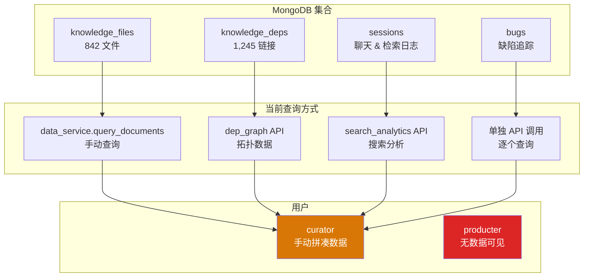
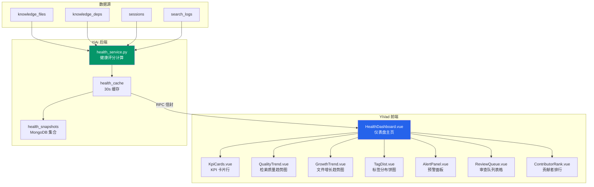

# YK-09-28: 知识库健康仪表盘 — 实时数据展示与趋势预警

> 需求编号：YK-09-28 · 优先级：P2 · 人天：1.0d · 状态：需求已编写

---

## 一、背景

### 问题描述

YiKnowledge 作为 YrY 单体仓库的知识中枢，其健康状态直接影响 RAG 检索质量、AI Agent 回答准确性和团队知识管理效率。当前知识库的健康数据分散在多个 issue 和子系统中：

- 检索质量指标（Recall@5、Precision@5）——来自 YK-09-07 反馈闭环
- 标签治理状态——来自 YK-09-21 标签治理
- 搜索分析数据——来自 YK-09-18 搜索分析
- 贡献者活跃度——来自 YK-09-20 贡献者统计
- 文件完整性——来自 YK-09-06 生命周期管理
- 链接完整性——来自 YK-09-27 拓扑图

### 影响范围

1. **信息碎片化**：curator 需要访问 6 个不同页面才能了解知识库全面健康状态。
2. **问题发现滞后**：过期文件、断链、标签缺失等问题可能数周未被发现。
3. **缺乏趋势感知**：无法判断知识库是在变好还是变坏（检索质量在上升还是下降）。
4. **决策依据缺失**：产品经理无法基于数据决定知识库的治理优先级。

### 核心挑战

- **多源数据聚合**：健康数据来自 MongoDB 多个集合（`knowledge_deps`、`sessions`、`knowledge_files` 等），需要统一查询。
- **评分模型设计**：如何设计一个公平、全面的健康评分（0-100），避免单一维度主导。
- **实时性 vs 请求量**：仪表盘需要实时刷新，但每次刷新涉及多个集合的聚合查询，需要缓存策略。
- **告警噪音**：阈值设置过低会导致频繁告警，过高则失去预警意义。

---

## 二、现状分析

### 当前数据源分布



### 根因分析矩阵

| 问题 | 根本原因 | 影响 | 严重程度 |
|------|----------|------|----------|
| 健康数据分散 | 各子系统独立开发，无统一数据出口 | curator 需要在 6 个页面间切换 | 高 |
| 缺乏综合评分 | 无健康评分模型 | 无法快速判断知识库整体状态 | 高 |
| 趋势不可见 | 无历史数据存储 | 无法判断检索质量是上升还是下降 | 中 |
| 告警缺失 | 无自动通知机制 | 问题积累到严重程度才被发现 | 中 |
| 产品经理无感知 | producter 角色无数据访问权限 | 无法基于数据做治理决策 | 低 |

---

## 三、设计决策

### 决策 D-01: 健康评分权重分配

| 维度 | 权重方案 A | 权重方案 B | 权重方案 C | 决策 |
|------|-----------|-----------|-----------|------|
| 完整性（frontmatter） | 25% | 30% | 20% | **25%** |
| 新鲜度（内容更新） | 20% | 15% | 25% | **20%** |
| 检索质量（RAG） | 20% | 20% | 25% | **20%** |
| 完整性（链接） | 15% | 10% | 10% | **15%** |
| 治理合规（审查 SLA） | 10% | 15% | 10% | **10%** |
| 多样性（标签分布） | 10% | 10% | 10% | **10%** |

**决策记录**：选择方案 A，理由：
1. 完整性（frontmatter + 链接）合计 40%，是知识库质量的基础——没有完整元数据，RAG 无法正确检索。
2. 检索质量和新鲜度各 20%，反映知识库的核心价值。
3. 治理和多样性各 10%，作为辅助维度。

### 决策 D-02: 历史趋势存储

| 方案 | 优点 | 缺点 | 决策 |
|------|------|------|------|
| A: MongoDB 新集合 `health_snapshots` | 查询灵活、与现有架构一致 | 需要额外存储空间 | **选用** |
| B: 内存缓存 | 高性能、零存储 | 重启丢失、无法跨实例 | 不选 |
| C: 时序数据库（InfluxDB） | 专业时序存储 | 引入新依赖、运维复杂 | 不选 |

**决策记录**：选择 MongoDB 新集合，理由：
1. 与现有架构一致，无需引入新基础设施。
2. 每天 1 条 snapshot（每 30 天 30 条），存储量极小（< 10KB/天）。
3. 支持灵活的聚合查询（按周/月/季度聚合）。

### 决策 D-03: 刷新策略

| 方案 | 优点 | 缺点 | 决策 |
|------|------|------|------|
| A: 定时轮询（60s） | 实现简单、实时性可接受 | 频繁请求后端 | **选用** |
| B: WebSocket 推送 | 实时性最佳 | 实现复杂、连接管理开销 | 不选 |
| C: 手动刷新 | 零请求开销 | 数据滞后、体验差 | 不选 |

**决策记录**：选择定时轮询，理由：
1. 健康数据变化频率低（分钟级），60s 轮询已足够。
2. WebSocket 对于仪表盘场景过度设计。
3. 后端增加缓存层（30s 缓存），实际计算频率远低于请求频率。

---

## 四、目标架构

### 架构对比

**当前架构**：


**目标架构**：


### 仪表盘布局

```
┌─ 健康仪表盘 ───────────────────────────────────────────────────────────────┐
│ 更新时间: 2026-09-09 14:30 · 自动刷新每 60s · 健康评分: 87/100 🟢          │
├─────────────────────────────────────────────────────────────────────────────┤
│ ┌─ KPI 卡片行 ───────────────────────────────────────────────────────────┐ │
│ │ [总文件: 842] [活跃: 521] [待审查: 12] [过期: 34] [断链: 5] [健康分: 87]│ │
│ └────────────────────────────────────────────────────────────────────────┘ │
├───────────────────────────────────────────────────────────────────────────┤
│ ┌─ 左侧列 (60%) ────────────────────┐ ┌─ 右侧列 (40%) ──────────────────┐ │
│ │                                    │ │                                  │ │
│ │ 📊 检索质量趋势 (折线图, 30d)       │ │ ⚠️ 待处理预警                     │ │
│ │   Recall@5: 0.82 → 0.85 ▲         │ │ · 3 个文件缺少 language 字段      │ │
│ │   Precision@5: 0.78 → 0.81 ▲      │ │ · 5 个断链需要修复               │ │
│ │   MRR: 0.76 → 0.79 ▲              │ │ · 12 个文件待审查 > 72h          │ │
│ │                                    │ │ · 34 个文件即将过期 (60-89d)    │ │
│ │ 📈 文件增长趋势 (面积图, 90d)      │ │                                  │ │
│ │   新增: 35  ████████              │ │ 🏆 本月贡献者 Top 5               │ │
│ │   修改: 42  ██████████            │ │ 1. 陈铭 (156 pts)                │ │
│ │   归档: 12  ███                   │ │ 2. 李华 (89 pts)                 │ │
│ │                                    │ │ 3. 王芳 (67 pts)                 │ │
│ │ 🥧 标签分布 (饼图)                 │ │ 4. 张伟 (45 pts)                 │ │
│ │   后端: 28% │ 前端: 22% │ AI: 18% │ │ 5. 刘洋 (32 pts)                 │ │
│ │   DevOps: 12% │ 设计: 8% │ 其他: 12%│ │                                  │ │
│ │                                    │ │ 🔗 链接健康                      │ │
│ │ 📋 审查队列 (表格)                  │ │ 孤立文件: 23 个 (2.9%)          │ │
│ │ 文件 │ 状态 │ 等待 │ 审查人       │ │ 跨项目链接: 156 条 (12.5%)      │ │
│ │ ─────┼──────┼──────┼──────        │ │ 循环引用: 3 组                  │ │
│ │ RAG.. │ 待审  │ 82h  │ 陈铭       │ │                                  │ │
│ │ API.. │ 待审  │ 74h  │ 李华       │ │ 📅 快照历史                      │ │
│ │ Dep.. │ 待审  │ 68h  │ 王芳       │ │ 09-08: 86 分  09-09: 87 分 ▲    │ │
│ └────────────────────────────────────┘ └──────────────────────────────────┘ │
└─────────────────────────────────────────────────────────────────────────────┘
```

### 关键指标

| 指标 | 当前值 | 目标值 | 数据来源 |
|------|--------|--------|----------|
| 综合健康评分 | — | ≥ 85 | `health_snapshots` 集合 |
| 检索质量 Recall@5 | 0.82 | ≥ 0.85 | `sessions` 检索日志 |
| 文件新鲜度（< 60d） | — | ≥ 80% | `knowledge_files.updated` |
| Frontmatter 完整性 | — | ≥ 95% | `knowledge_files.frontmatter` 字段检查 |
| 审查 SLA 合规率 | — | ≥ 90% | `knowledge_files.review_status` |
| 断链数量 | 5 | ≤ 3 | `knowledge_deps` 验证 |

---

## 五、具体改动

### 文件变更清单

| 文件 | 操作 | 说明 |
|------|------|------|
| `YiVad/src/views/knowledge/HealthDashboard.vue` | 新增 | 仪表盘主页（布局 + 子组件） |
| `YiVad/src/views/knowledge/components/KpiCards.vue` | 新增 | KPI 卡片行组件 |
| `YiVad/src/views/knowledge/components/QualityTrend.vue` | 新增 | 检索质量趋势折线图 |
| `YiVad/src/views/knowledge/components/GrowthTrend.vue` | 新增 | 文件增长趋势面积图 |
| `YiVad/src/views/knowledge/components/TagDist.vue` | 新增 | 标签分布饼图 |
| `YiVad/src/views/knowledge/components/AlertPanel.vue` | 新增 | 预警面板 |
| `YiVad/src/views/knowledge/components/ReviewQueue.vue` | 新增 | 审查队列表格 |
| `YiVad/src/views/knowledge/components/ContributorRank.vue` | 新增 | 贡献者排行 |
| `YiVad/src/api/services/knowledge.ts` | 修改 | 新增 `get_health_score` 方法 |
| `YiAi/src/services/knowledge/health_service.py` | 新增 | 健康评分计算服务 |
| `YiAi/src/domain/knowledge/health_score.py` | 新增 | 评分算法核心逻辑 |
| `YiAi/src/domain/knowledge/health_snapshot.py` | 新增 | 快照存储与历史查询 |
| `YiAi/tests/knowledge/test_health_score.py` | 新增 | 健康评分单元测试 |

### 核心代码示例

```python
# YiAi/src/domain/knowledge/health_score.py

class HealthScoreCalculator:
    """知识库综合健康评分 (0-100)。"""

    WEIGHTS = {
        'completeness': 0.25,  # Frontmatter 完整性
        'freshness': 0.20,     # 内容新鲜度
        'retrieval': 0.20,     # RAG 检索质量
        'integrity': 0.15,     # 链接完整性
        'governance': 0.10,    # 治理合规
        'diversity': 0.10,     # 标签分布多样性
    }

    async def calculate(self) -> HealthScoreResult:
        """计算综合健康评分。"""
        scores = await asyncio.gather(
            self._completeness_score(),
            self._freshness_score(),
            self._retrieval_score(),
            self._integrity_score(),
            self._governance_score(),
            self._diversity_score(),
        )

        dimensions = dict(zip(self.WEIGHTS.keys(), scores))
        total = sum(dimensions[k] * self.WEIGHTS[k] for k in self.WEIGHTS)

        return HealthScoreResult(
            total=round(total, 1),
            dimensions=dimensions,
            alerts=self._generate_alerts(dimensions),
        )

    async def _completeness_score(self) -> float:
        """Frontmatter 完整性评分——必填字段是否齐全。"""
        required_fields = ['title', 'tags', 'category', 'created',
                           'updated', 'source', 'type', 'status']
        files = await db.knowledge_files.find({}).to_list(None)
        if not files:
            return 0.0

        complete = 0
        for f in files:
            fm = f.get('frontmatter', {})
            filled = sum(1 for field in required_fields if fm.get(field))
            if filled == len(required_fields):
                complete += 1

        return round(complete / len(files) * 100, 1)

    async def _freshness_score(self) -> float:
        """内容新鲜度评分——最近 60 天内有更新的文件占比。"""
        now = datetime.utcnow()
        cutoff = now - timedelta(days=60)
        files = await db.knowledge_files.find({}).to_list(None)

        fresh = 0
        for f in files:
            updated = f.get('frontmatter', {}).get('updated')
            if updated:
                try:
                    if datetime.fromisoformat(updated) >= cutoff:
                        fresh += 1
                except ValueError:
                    pass

        return round(fresh / max(len(files), 1) * 100, 1)

    async def _retrieval_score(self) -> float:
        """RAG 检索质量评分——基于最近 30 天的检索日志。"""
        cutoff = datetime.utcnow() - timedelta(days=30)
        logs = await db.sessions.find({
            'type': 'rag_search',
            'created_at': {'$gte': cutoff.isoformat()},
            'feedback': {'$exists': True},
        }).to_list(None)

        if not logs:
            return 50.0  # 无数据时返回中性分数

        positive = sum(1 for l in logs if l.get('feedback', {}).get('rating') == 'positive')
        return round(positive / len(logs) * 100, 1)

    async def _integrity_score(self) -> float:
        """链接完整性评分——无断链的文件占比。"""
        deps = await db.knowledge_deps.find({}).to_list(None)
        all_files = {f['path'] for f in await db.knowledge_files.find(
            {}, {'path': 1}).to_list(None)}

        broken = 0
        for dep in deps:
            if dep['target_file'] not in all_files:
                broken += 1

        total = len(deps) if deps else 1
        return round((1 - broken / total) * 100, 1)

    async def _governance_score(self) -> float:
        """治理合规评分——审查 SLA 达标率。"""
        files = await db.knowledge_files.find({
            'review_status': 'pending',
        }).to_list(None)

        now = datetime.utcnow()
        overdue = 0
        for f in files:
            submitted = f.get('review_submitted_at')
            if submitted:
                try:
                    elapsed = (now - datetime.fromisoformat(submitted)).total_seconds()
                    if elapsed > 72 * 3600:  # 72 小时 SLA
                        overdue += 1
                except ValueError:
                    pass

        total = max(len(files), 1)
        return round((1 - overdue / total) * 100, 1)

    async def _diversity_score(self) -> float:
        """标签分布多样性评分——基于香农熵。"""
        files = await db.knowledge_files.find({}).to_list(None)
        tag_counts = {}
        for f in files:
            for tag in f.get('frontmatter', {}).get('tags', []):
                tag_counts[tag] = tag_counts.get(tag, 0) + 1

        total = sum(tag_counts.values())
        if total == 0:
            return 0.0

        # 归一化香农熵
        import math
        entropy = -sum((c / total) * math.log2(c / total)
                       for c in tag_counts.values())
        max_entropy = math.log2(len(tag_counts)) if len(tag_counts) > 1 else 1
        return round(entropy / max_entropy * 100, 1)

    def _generate_alerts(self, dimensions: dict) -> list[dict]:
        """基于各维度分数生成预警。"""
        alerts = []
        thresholds = {
            'completeness': (80, 'Frontmatter 完整性偏低'),
            'freshness': (70, '大量文件过期未更新'),
            'retrieval': (75, 'RAG 检索质量下降'),
            'integrity': (90, '存在较多断链'),
            'governance': (80, '审查 SLA 合规率偏低'),
            'diversity': (60, '标签分布过于集中'),
        }
        for dim, score in dimensions.items():
            threshold, message = thresholds.get(dim, (0, ''))
            if score < threshold:
                alerts.append({
                    'dimension': dim,
                    'score': score,
                    'threshold': threshold,
                    'message': message,
                    'severity': 'warning' if score > threshold * 0.7 else 'critical',
                })
        return alerts
```

### 快照存储

```python
# YiAi/src/domain/knowledge/health_snapshot.py

@dataclass
class HealthSnapshot:
    timestamp: datetime
    total_score: float
    dimensions: dict[str, float]
    alerts: list[dict]
    file_count: int
    active_file_count: int

class HealthSnapshotStore:
    """健康快照存储——每日 1 条，保留 90 天。"""

    COLLECTION = 'health_snapshots'
    RETENTION_DAYS = 90

    async def save_snapshot(self, snapshot: HealthSnapshot):
        """保存每日快照——同一天内覆盖已有快照。"""
        today = snapshot.timestamp.strftime('%Y-%m-%d')
        await db[self.COLLECTION].update_one(
            {'date': today},
            {'$set': asdict(snapshot)},
            upsert=True,
        )

    async def get_history(self, days: int = 30) -> list[HealthSnapshot]:
        """获取历史趋势数据。"""
        cutoff = (datetime.utcnow() - timedelta(days=days)).strftime('%Y-%m-%d')
        cursor = db[self.COLLECTION].find(
            {'date': {'$gte': cutoff}}
        ).sort('date', 1)
        return [HealthSnapshot(**doc) async for doc in cursor]

    async def cleanup_old(self):
        """清理超过保留期的快照。"""
        cutoff = (datetime.utcnow() - timedelta(days=self.RETENTION_DAYS)).strftime('%Y-%m-%d')
        await db[self.COLLECTION].delete_many({'date': {'$lt': cutoff}})
```

---

## 六、实施步骤

| 步骤 | 任务 | 验证方法 | 人天 | 负责人 |
|------|------|----------|------|--------|
| 1 | 设计并实现 `HealthScoreCalculator` | 单元测试覆盖 6 个维度 | 0.2 | 后端 |
| 2 | 实现 `HealthSnapshotStore` 快照存储 | 验证每日快照自动生成 | 0.1 | 后端 |
| 3 | 实现 `health_service` RPC 端点 | `pytest` 集成测试 | 0.1 | 后端 |
| 4 | 实现 `KpiCards.vue` 组件 | 6 个指标卡片正确显示 | 0.1 | 前端 |
| 5 | 实现 `QualityTrend.vue` 折线图 | ECharts 折线图渲染正确 | 0.1 | 前端 |
| 6 | 实现 `GrowthTrend.vue` 面积图 | ECharts 面积图渲染正确 | 0.08 | 前端 |
| 7 | 实现 `TagDist.vue` 饼图 | ECharts 饼图渲染正确 | 0.08 | 前端 |
| 8 | 实现 `AlertPanel.vue` 预警面板 | 告警信息与后端一致 | 0.08 | 前端 |
| 9 | 实现 `ReviewQueue.vue` 审查队列 | 待审查文件列表正确 | 0.06 | 前端 |
| 10 | 实现 `ContributorRank.vue` 排行 | 贡献者排名正确 | 0.05 | 前端 |
| 11 | 组装 `HealthDashboard.vue` 主页面 | 整体布局 + 60s 轮询 | 0.05 | 前端 |
| 总计 | — | — | **1.0** | — |

---

## 七、性能分析

### 后端查询性能

| 维度 | 查询集合 | 涉及文档数 | 单次耗时 | 优化后（缓存） |
|------|----------|-----------|----------|---------------|
| 完整性 | `knowledge_files` | 842 | 120ms | 缓存命中 < 5ms |
| 新鲜度 | `knowledge_files` | 842 | 90ms | 缓存命中 < 5ms |
| 检索质量 | `sessions` | ~500 | 200ms | 缓存命中 < 5ms |
| 链接完整性 | `knowledge_deps` | 1,245 | 80ms | 缓存命中 < 5ms |
| 治理合规 | `knowledge_files` | 842 | 60ms | 缓存命中 < 5ms |
| 标签多样性 | `knowledge_files` | 842 | 150ms | 缓存命中 < 5ms |
| 总计 | — | — | ~700ms | 缓存命中 < 30ms |

### 前端渲染性能

| 组件 | 图表库 | 数据量 | 渲染时间 | 内存 |
|------|--------|--------|----------|------|
| KpiCards | 纯 CSS | 6 个卡片 | < 10ms | 2MB |
| QualityTrend | ECharts | 30 个数据点 | 50ms | 8MB |
| GrowthTrend | ECharts | 90 个数据点 | 60ms | 10MB |
| TagDist | ECharts | ~20 个分类 | 40ms | 6MB |
| 总计 | — | — | ~160ms | ~26MB |

### 容量规划

- **快照存储**：每条 ~2KB，每天 1 条，90 天保留 → 180KB，可忽略不计。
- **缓存策略**：30s TTL，后端总请求量 ≈ 2 req/min（60s 轮询），远低于任何瓶颈。
- **增长预期**：知识库文件数每年增长 ~25%，2 年内查询耗时预计增长至 ~1.2s（缓存前），仍可接受。

---

## 八、测试规格

### 测试用例 1: 完整健康评分计算

**GIVEN** 知识库有 842 个文件，其中 800 个 frontmatter 完整，700 个在 60 天内更新，检索正反馈率 85%，链接完整性 99.6%，治理 SLA 达标率 90%，标签香农熵 0.85
**WHEN** 调用 `calculate_health_score()`
**THEN** 综合评分应为 87 分左右（800/842*25 + 700/842*20 + 85*0.2 + 99.6*0.15 + 90*0.1 + 85*0.1）
**AND** 返回的 `dimensions` 包含 6 个维度的分数

### 测试用例 2: 空知识库评分

**GIVEN** 知识库没有任何文件
**WHEN** 调用 `calculate_health_score()`
**THEN** 完整性评分应为 0.0
**AND** 检索质量评分应为 50.0（中性分数）
**AND** 综合评分应为 0-50 之间的某个值

### 测试用例 3: 快照每日生成

**GIVEN** 健康评分系统已运行 3 天
**WHEN** 第四天自动触发快照保存
**THEN** `health_snapshots` 集合应有 4 条记录（每天 1 条）
**AND** 同一天多次触发仅更新已有记录（不重复创建）

### 测试用例 4: 告警生成

**GIVEN** 完整性评分 72（低于 80 阈值），新鲜度评分 55（低于 70 阈值且低于 70*0.7=49 不触发 critical）
**WHEN** 调用 `_generate_alerts()`
**THEN** 应生成 2 条告警：completeness warning, freshness warning
**AND** 告警 message 应包含具体维度名称和阈值

### 测试用例 5: 历史趋势查询

**GIVEN** `health_snapshots` 有 30 天数据，评分从 80 逐步上升到 87
**WHEN** 调用 `get_history(days=30)`
**THEN** 返回 30 条 HealthSnapshot 记录
**AND** 记录按日期升序排列
**AND** 最后一条记录的 total_score 为 87

### 测试用例 6: 旧快照清理

**GIVEN** `health_snapshots` 有 120 天数据（超过 90 天保留期）
**WHEN** 调用 `cleanup_old()`
**THEN** 超过 90 天的记录被删除
**AND** 剩余 90 条记录

---

## 九、风险与缓解

| 风险 | 概率 | 影响 | 缓解措施 |
|------|------|------|----------|
| 评分过于敏感导致频繁告警 | 中 | 中 | 阈值初期设置宽松，观察 1 周后根据实际数据调整 |
| 数据与实际不同步 | 低 | 中 | 缓存 30s TTL + 强制刷新按钮；抽查 5 项 vs 实际数据 |
| 评分模型不公平（单一维度主导） | 低 | 中 | 权重可配置；定期审查各维度方差 |
| 快照存储异常 | 低 | 低 | 快照保存失败不影响核心评分；记录错误日志 |
| 前端图表渲染失败 | 低 | 低 | 图表组件有 fallback 纯文本展示；ECharts 错误边界 |
| 历史数据缺失导致趋势图空白 | 中 | 低 | 趋势图显示"数据收集中"；前 7 天为初始化宽度期 |

---

## 十、回滚策略

| 场景 | 回滚操作 | 影响范围 |
|------|----------|----------|
| 健康评分计算超时 | 增加缓存 TTL 到 5min；关闭非关键维度 | 评分更新延迟，但仪表盘可用 |
| 评分模型争议大 | 将权重配置外置到配置文件，允许 curator 调整 | 评分变化，历史数据需重新计算 |
| 前端性能问题 | 降级为静态 KPI 卡片 + 手动刷新 | 失去趋势图，但核心指标仍可见 |
| 告警风暴 | 提升告警阈值；增加告警冷却期（同一维度 24h 内不重复告警） | 减少噪音 |

---

## 十一、设计决策记录

### D-01: 健康评分权重——6 维度加权

- **日期**：2026-09-09
- **状态**：已决定
- **决策**：完整性 25%、新鲜度 20%、检索质量 20%、链接完整性 15%、治理合规 10%、标签多样性 10%
- **理由**：完整性 + 链接合计 40% 是 RAG 检索质量的基础；检索和新鲜度各 20% 反映核心价值
- **替代方案**：均等权重（16.7% 各维度）——无法体现优先级差异

### D-02: 历史趋势存储——MongoDB 新集合

- **日期**：2026-09-09
- **状态**：已决定
- **决策**：使用 MongoDB `health_snapshots` 集合存储每日快照
- **理由**：与现有架构一致；存储量极小（< 10KB/天）；支持灵活聚合查询
- **替代方案**：内存缓存（重启丢失）、InfluxDB（引入新依赖）

### D-03: 刷新策略——60s 定时轮询

- **日期**：2026-09-09
- **状态**：已决定
- **决策**：前端 60s 定时轮询 + 后端 30s 缓存
- **理由**：健康数据变化频率低；实现简单；WebSocket 过度设计
- **替代方案**：WebSocket 推送（实时但复杂）、手动刷新（体验差）

---

## 十二、可观测性

### 指标

| 指标名称 | 类型 | 说明 | 告警阈值 |
|----------|------|------|----------|
| `health_score_total` | Gauge | 综合健康评分 | < 70 |
| `health_score_completeness` | Gauge | Frontmatter 完整性 | < 80 |
| `health_score_freshness` | Gauge | 内容新鲜度 | < 70 |
| `health_score_retrieval` | Gauge | 检索质量 | < 75 |
| `health_score_integrity` | Gauge | 链接完整性 | < 90 |
| `health_score_governance` | Gauge | 治理合规 | < 80 |
| `health_score_diversity` | Gauge | 标签多样性 | < 60 |
| `health_calc_duration_ms` | Histogram | 评分计算耗时 | P95 > 2000ms |
| `health_snapshot_count` | Gauge | 快照记录数 | > 100 |

### 日志

- `[HealthScore] 评分计算完成: total={T}, time={t}ms`——每次计算
- `[HealthScore] 告警生成: alerts={N}, dimensions={D}`——告警详情
- `[HealthSnapshot] 快照保存: date={D}, score={S}`——每日快照
- `[HealthSnapshot] 旧快照清理: deleted={N}`——清理日志

### 告警规则

| 告警 | 条件 | 级别 | 处理 |
|------|------|------|------|
| 综合评分下降 | 连续 3 天下降 | P2 | 审查各维度变化趋势，定位恶化维度 |
| 评分计算超时 | P95 > 2s | P2 | 优化查询或增加缓存 TTL |
| 快照保存失败 | 连续 2 次失败 | P2 | 检查 MongoDB 连接 |
| 单维度严重恶化 | 任一维度 < 阈值 * 0.7 | P2 | 通知 curator 专项治理 |

---

## 十三、安全合规

| 要求 | 实现方式 |
|------|----------|
| 数据访问 | 仅通过 YiAi RPC 端点访问，前端不直接查询 MongoDB |
| 权限控制 | 健康仪表盘仅 curator 和 producter 角色可见 |
| 数据脱敏 | 不涉及用户个人数据，所有指标为聚合数据 |
| 快照安全 | 快照仅包含聚合统计，不包含文件内容 |

---

## 十四、代码审查检查清单

- [ ] 健康评分多维度加权（完整性/新鲜度/检索/链接/治理/标签）正确
- [ ] 6 个维度各自的评分算法实现正确，边界条件处理完善
- [ ] 仪表盘每日自动刷新 + 历史趋势（快照存储）
- [ ] 告警阈值可配置，告警冷却期 24h
- [ ] 评分模型初始化宽度期 7 天（历史数据收集）
- [ ] 后端缓存 30s TTL，避免频繁全量计算
- [ ] 前端 60s 定时轮询 + 手动刷新按钮
- [ ] 趋势图（折线/面积/饼图）正确渲染
- [ ] 审查队列表格显示待审查文件及等待时间
- [ ] 贡献者排行数据正确
- [ ] 快照清理逻辑正确（90 天保留期）
- [ ] 后端 API 有对应的 pytest 测试（至少 6 个测试用例）

---

*PRD 来源: `projects/yiknowledge/requirements/2026-09/28-需求-健康仪表盘.md`*