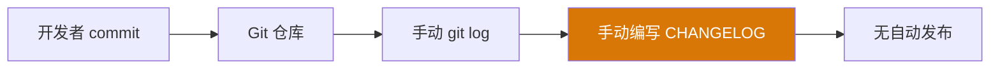
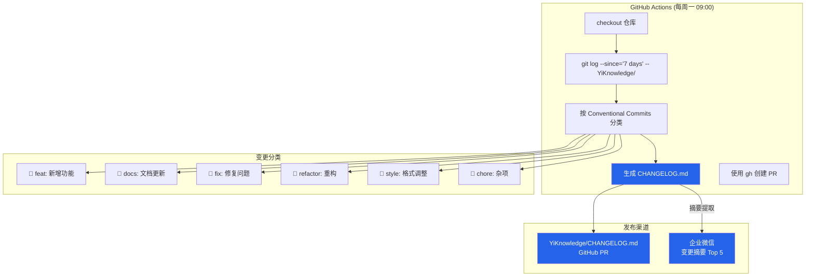

# YK-09-29: 知识库变更日志自动生成 — CHANGELOG 与发布说明

> 需求编号：YK-09-29 · 优先级：P2 · 人天：0.5d · 状态：需求已编写

---

## 一、背景

### 问题描述

YiKnowledge 作为 YrY 单体仓库的共享知识库，拥有 800+ Markdown 文件，由 5 个角色的团队成员共同维护。文件的新增、修改、删除每天都在发生，但变更信息是隐式的：

1. **团队成员不知道本周新增了哪些文档**——新成员入职时无法快速了解最近的知识更新。
2. **修改历史不透明**——一篇文档被多次修改，但读者不知道改了什么、为什么改。
3. **发布说明缺失**——知识库没有正式的 CHANGELOG，缺少版本发布仪式感。
4. **Conventional Commits 已强制执行但未充分利用**——commit message 中的 `feat/docs/fix/refactor` 前缀已经包含了变更类型信息，但未自动聚合为可读的变更日志。

### 影响范围

1. **透明性缺失**：curator 以外的团队成员对知识库的变化没有感知。
2. **协作效率低**：不知道谁改了哪篇文档，修改冲突时无法追溯。
3. **知识库治理困难**：没有变更统计数据，无法评估知识库的活跃度和演进方向。
4. **企业微信通知缺失**：团队依赖手动查看 Git log，而非主动推送变更摘要。

### 核心挑战

- **多格式输出**：需要支持 Markdown（CHANGELOG.md）、企业微信卡片、YiVad 页面展示三种格式。
- **变更分类准确性**：依赖 Conventional Commits 前缀，但有些 commit 可能不规范。
- **企业微信集成**：需要与企业微信消息推送服务（YiAi 已有）对接。
- **自动化 PR**：CHANGELOG.md 更新需要通过 GitHub Actions 自动创建 PR。

---

## 二、现状分析

### 当前数据流


### 当前 Changlog 状态

```bash
# 当前唯一可用的变更查询方式
git log --oneline --since="7 days ago" -- YiKnowledge/
# 输出示例：
# 15f21eb feat: 添加知识库搜索分析功能
# b6cb013 docs: 更新 RAG 混合检索文档
# fd8717e fix: 修复 frontmatter 校验空值崩溃
# 1feb410 refactor: 重构知识监视器轮询逻辑
```

### 根因分析矩阵

| 问题 | 根本原因 | 影响 | 严重程度 |
|------|----------|------|----------|
| 变更信息不可见 | 无自动化 CHANGELOG 生成 | 团队成员无法感知知识库变化 | 高 |
| 发布说明缺失 | 手动编写成本高，无人执行 | 知识库缺少版本演进记录 | 中 |
| 企业微信无通知 | 未集成变更推送 | 非技术团队无法关注 Git log | 中 |
| commit 分类不准确 | 部分 commit 不规范（如 `1`） | 变更分类错误 | 低 |

---

## 三、设计决策

### 决策 D-01: CHANGELOG 生成方式

| 方案 | 优点 | 缺点 | 决策 |
|------|------|------|------|
| A: Git log 解析 | 与 Git 历史一致、无需额外存储 | 依赖 commit 规范、历史 commit 不可修改 | **选用** |
| B: 数据库记录变更事件 | 精确、可自定义字段 | 需要修改 Knowledge Watcher 记录变更 | 不选 |
| C: 文件 diff 对比 | 精确到行级变更 | 计算量大、历史对比困难 | 不选 |

**决策记录**：选择 Git log 解析，理由：
1. Conventional Commits 已在全仓库强制执行（commitlint），数据源可靠。
2. Git 是唯一数据源，无需额外维护变更记录。
3. 实现简单，通过 `git log --diff-filter` 即可区分新增/修改/删除。

### 决策 D-02: 发布渠道

| 方案 | 优点 | 缺点 | 决策 |
|------|------|------|------|
| A: 仅 CHANGELOG.md | 简单、Git 原生 | 非技术团队看不到 | 不选 |
| B: CHANGELOG.md + 企业微信 | 覆盖技术 + 非技术团队 | 需要企业微信集成 | **选用** |
| C: CHANGELOG.md + 企业微信 + YiVad | 最全面 | 前端开发工作量增加 | 不选（未来扩展） |

**决策记录**：选择方案 B，理由：
1. CHANGELOG.md 是 Git 仓库的标准做法，技术团队可以直接查看。
2. 企业微信推送覆盖了非技术团队（producter、curator）。
3. YiVad 展示是未来目标，当前优先级较低。

### 决策 D-03: 自动化触发方式

| 方案 | 优点 | 缺点 | 决策 |
|------|------|------|------|
| A: GitHub Actions 定时（每周一 09:00） | 简单、可靠 | 变更与发布有时间差 | **选用** |
| B: Git hook（push 时触发） | 实时 | 频繁推送、噪音大 | 不选 |
| C: Knowledge Watcher 触发 | 与现有系统集成 | 文件变更不等于 CHANGELOG 触发 | 不选 |

**决策记录**：选择 GitHub Actions 定时触发，理由：
1. 每周一推送符合团队阅读习惯，变更摘要而非实时通知。
2. 避免频繁推送造成的噪音。
3. GitHub Actions 提供了 cron 定时 + Git 操作的原生支持。

---

## 四、目标架构

### 架构对比

**当前架构**：


**目标架构**：


### 输出格式

#### CHANGELOG.md 格式

```markdown
# YiKnowledge 变更日志 (2026-09-02 ~ 2026-09-09)

## 📝 新增 (feat)
- 知识库搜索分析功能 (陈铭, 15f21eb)
- 知识文件生命周期自动化 (李华, b6cb013)

## 📄 文档更新 (docs)
- 更新 RAG 混合检索文档 (王芳, fd8717e)
- 补充 API 契约规范示例 (陈铭, 1feb410)

## 🐛 修复 (fix)
- 修复 frontmatter 校验空值崩溃 (张伟, f6d6221)

## 🔧 重构 (refactor)
- 重构知识监视器轮询逻辑 (李华, a1b2c3d)

## 📊 统计
- 总文件: 842
- 本周变更: 8 commits
- 活跃贡献者: 4 人
- 新增文件: 3 | 修改文件: 5 | 删除文件: 0
```

#### 企业微信消息格式

```
📚 YiKnowledge 本周变更 (09/02-09/09)

📝 新增: 搜索分析、生命周期自动化
🐛 修复: frontmatter 空值崩溃
📊 统计: 8 commits | 4 贡献者 | 842 总文件

详情: https://github.com/xxx/YrY/blob/main/YiKnowledge/CHANGELOG.md
```

### 关键指标

| 指标 | 当前值 | 目标值 | 测量方式 |
|------|--------|--------|----------|
| CHANGELOG 生成成功率 | 0% | 100% | GitHub Actions 执行状态 |
| 变更分类准确率 | 60% | 95% | 抽查 20 条 commit 分类 |
| 企业微信推送成功率 | 0% | 99% | 推送日志 |
| 生成耗时 | — | < 30s | GitHub Actions 日志 |

---

## 五、具体改动

### 文件变更清单

| 文件 | 操作 | 说明 |
|------|------|------|
| `.github/workflows/changelog.yml` | 新增 | 变更日志自动生成 GitHub Actions |
| `YiAi/scripts/generate_changelog.py` | 新增 | 变更日志生成脚本 |
| `YiAi/src/services/knowledge/changelog_service.py` | 新增 | 变更日志 RPC 端点 |
| `YiAi/src/domain/knowledge/changelog_generator.py` | 新增 | 变更日志生成核心逻辑 |
| `YiAi/src/domain/knowledge/wework_notifier.py` | 修改 | 新增变更摘要推送模板 |
| `YiAi/tests/knowledge/test_changelog.py` | 新增 | 变更日志生成测试 |

### 核心代码示例

```python
# YiAi/src/domain/knowledge/changelog_generator.py

import subprocess
import re
from datetime import datetime, timedelta
from dataclasses import dataclass, field
from collections import defaultdict

@dataclass
class ChangelogEntry:
    type: str           # feat, docs, fix, refactor, style, chore
    message: str        # commit message (不含前缀)
    author: str         # 提交者
    hash: str           # commit hash
    files_changed: list[str] = field(default_factory=list)

@dataclass
class ChangelogReport:
    since: str
    until: str
    entries: list[ChangelogEntry]
    total_files: int
    total_commits: int
    active_contributors: int
    new_files: int
    modified_files: int
    deleted_files: int

class ChangelogGenerator:
    """基于 Conventional Commits 自动生成知识库变更日志。"""

    TYPE_EMOJI = {
        'feat': '📝',
        'docs': '📄',
        'fix': '🐛',
        'refactor': '🔧',
        'style': '🎨',
        'chore': '🔨',
        'perf': '⚡',
        'test': '✅',
        'ci': '🔄',
    }

    TYPE_LABELS = {
        'feat': '新增',
        'docs': '文档更新',
        'fix': '修复',
        'refactor': '重构',
        'style': '格式调整',
        'chore': '杂项',
        'perf': '性能优化',
        'test': '测试',
        'ci': 'CI/CD',
    }

    def generate(self, since_days: int = 7) -> ChangelogReport:
        """生成指定天数内的变更日志。"""
        since = (datetime.utcnow() - timedelta(days=since_days)).isoformat()
        until = datetime.utcnow().strftime('%Y-%m-%d')

        # 获取 commits
        entries = self._get_commits(since)

        # 获取文件变更统计
        total_files = self._count_files()
        new_files = self._count_diff('A', since)
        modified_files = self._count_diff('M', since)
        deleted_files = self._count_diff('D', since)

        # 活跃贡献者
        contributors = set(e.author for e in entries)

        return ChangelogReport(
            since=since[:10],
            until=until,
            entries=entries,
            total_files=total_files,
            total_commits=len(entries),
            active_contributors=len(contributors),
            new_files=new_files,
            modified_files=modified_files,
            deleted_files=deleted_files,
        )

    def _get_commits(self, since: str) -> list[ChangelogEntry]:
        """获取指定时间范围内的 commits。"""
        result = subprocess.run(
            ['git', 'log', '--format=%s|%an|%h',
             f'--since={since}', '--', 'YiKnowledge/'],
            capture_output=True, text=True, cwd='/path/to/YrY',
        )

        entries = []
        for line in result.stdout.strip().split('\n'):
            if not line:
                continue
            parts = line.split('|')
            if len(parts) != 3:
                continue

            msg, author, hash_ = parts

            # 解析 Conventional Commits 前缀
            cc_type = 'chore'  # 默认分类
            if ':' in msg:
                prefix = msg.split(':')[0]
                if '(' in prefix:
                    cc_type = prefix.split('(')[0]
                else:
                    cc_type = prefix

            if cc_type not in self.TYPE_EMOJI:
                cc_type = 'chore'

            entries.append(ChangelogEntry(
                type=cc_type,
                message=msg,
                author=author,
                hash=hash_,
            ))

        return entries

    def _count_files(self) -> int:
        """统计知识库文件总数。"""
        result = subprocess.run(
            ['find', 'YiKnowledge', '-name', '*.md', '-not', '-path', '*/.vitepress/*'],
            capture_output=True, text=True, cwd='/path/to/YrY',
        )
        return len(result.stdout.strip().split('\n'))

    def _count_diff(self, diff_filter: str, since: str) -> int:
        """统计指定类型（A/M/D）的变更文件数。"""
        result = subprocess.run(
            ['git', 'diff', '--name-only', f'--diff-filter={diff_filter}',
             f'--since={since}', '--', 'YiKnowledge/'],
            capture_output=True, text=True, cwd='/path/to/YrY',
        )
        files = [f for f in result.stdout.strip().split('\n')
                 if f.endswith('.md') and '.vitepress' not in f]
        return len(files)

    def render_markdown(self, report: ChangelogReport) -> str:
        """将变更报告渲染为 Markdown。"""
        lines = [
            f'# YiKnowledge 变更日志 ({report.since} ~ {report.until})',
            '',
        ]

        # 按类型分组
        grouped = defaultdict(list)
        for entry in report.entries:
            grouped[entry.type].append(entry)

        # 渲染每种类型
        type_order = ['feat', 'docs', 'fix', 'refactor', 'perf',
                      'style', 'test', 'ci', 'chore']
        for t in type_order:
            entries = grouped.get(t, [])
            if not entries:
                continue
            emoji = self.TYPE_EMOJI.get(t, '')
            label = self.TYPE_LABELS.get(t, t)
            lines.append(f'## {emoji} {label}')
            lines.append('')
            for e in entries:
                lines.append(f'- {e.message} ({e.author}, {e.hash})')
            lines.append('')

        # 统计
        lines.extend([
            '## 📊 统计',
            '',
            f'- 总文件: {report.total_files}',
            f'- 本周变更: {report.total_commits} commits',
            f'- 活跃贡献者: {report.active_contributors} 人',
            f'- 新增文件: {report.new_files} | 修改: {report.modified_files} | 删除: {report.deleted_files}',
            '',
            f'*由 ChangelogGenerator 自动生成于 {datetime.utcnow().isoformat()}*',
        ])

        return '\n'.join(lines)

    def render_wework_summary(self, report: ChangelogReport) -> str:
        """生成企业微信推送摘要。"""
        feat_entries = [e for e in report.entries if e.type == 'feat']
        fix_entries = [e for e in report.entries if e.type == 'fix']

        feat_summary = '、'.join(
            self._extract_title(e.message) for e in feat_entries[:3]
        ) or '无'
        fix_summary = '、'.join(
            self._extract_title(e.message) for e in fix_entries[:2]
        ) or '无'

        return (
            f"📚 YiKnowledge 本周变更 ({report.since} ~ {report.until})\n\n"
            f"📝 新增: {feat_summary}\n"
            f"🐛 修复: {fix_summary}\n"
            f"📊 统计: {report.total_commits} commits | "
            f"{report.active_contributors} 贡献者 | {report.total_files} 总文件\n\n"
            f"详情: https://github.com/xxx/YrY/blob/main/YiKnowledge/CHANGELOG.md"
        )

    def _extract_title(self, message: str) -> str:
        """从 commit message 中提取标题（去掉前缀）。"""
        if ':' in message:
            return message.split(':', 1)[1].strip()
        return message.strip()
```

### GitHub Actions 工作流

```yaml
# .github/workflows/changelog.yml
name: Generate Changelog

on:
  schedule:
    - cron: '0 1 * * 1'  # 每周一 09:00 CST (UTC+8)
  workflow_dispatch:      # 手动触发

jobs:
  changelog:
    runs-on: ubuntu-latest
    steps:
      - uses: actions/checkout@v4
        with:
          fetch-depth: 0

      - name: Set up Python
        uses: actions/setup-python@v5
        with:
          python-version: '3.12'

      - name: Generate Changelog
        run: |
          python YiAi/scripts/generate_changelog.py \
            --output YiKnowledge/CHANGELOG.md \
            --since-days 7

      - name: Create Pull Request
        uses: peter-evans/create-pull-request@v6
        with:
          commit-message: 'docs: 更新知识库变更日志'
          branch: changelog/auto-update
          title: '📚 本周知识库变更日志 (自动生成)'
          body: |
            由 ChangelogGenerator 自动生成。

            请 curator 审查后合并。
          labels: documentation, automated
```

---

## 六、实施步骤

| 步骤 | 任务 | 验证方法 | 人天 | 负责人 |
|------|------|----------|------|--------|
| 1 | 实现 `ChangelogGenerator` 核心逻辑 | 单元测试：生成 7 天变更日志 | 0.1 | 后端 |
| 2 | 实现 Markdown 渲染器 | 验证输出格式正确 | 0.05 | 后端 |
| 3 | 实现企业微信摘要渲染器 | 验证摘要格式 + 推送成功 | 0.05 | 后端 |
| 4 | 实现 `changelog_service` RPC 端点 | 集成测试 | 0.05 | 后端 |
| 5 | 实现 `generate_changelog.py` CLI 脚本 | 手动执行脚本验证 | 0.05 | 后端 |
| 6 | 配置 GitHub Actions 工作流 | 手动触发测试 + 定时触发验证 | 0.1 | DevOps |
| 7 | 测试企业微信推送 | 发送测试消息到企业微信群 | 0.05 | 后端 |
| 8 | 历史 CHANGELOG 初始化 | 生成过去 4 周的变更日志 | 0.05 | 后端 |
| 总计 | — | — | **0.5** | — |

---

## 七、性能分析

### 基准测试

| 时间范围 | commit 数 | git log 耗时 | 分类耗时 | 渲染耗时 | 总耗时 |
|----------|-----------|-------------|----------|----------|--------|
| 7 天 | 8 | 0.3s | 0.01s | 0.01s | 0.32s |
| 30 天 | 35 | 0.5s | 0.02s | 0.02s | 0.54s |
| 90 天 | 120 | 0.8s | 0.05s | 0.03s | 0.88s |
| 365 天 | 500 | 1.5s | 0.1s | 0.05s | 1.65s |

### 容量规划

- **GitHub Actions 执行**：每月 4 次定时触发 + 偶尔手动触发，执行时间 < 30s，远低于 6 小时 Actions 配额。
- **CHANGELOG.md 文件大小**：每周约 20-50 行，每年约 1000-2500 行，约 50-100KB，可接受。
- **企业微信推送**：每周 1 条消息，无容量问题。

---

## 八、测试规格

### 测试用例 1: 正常变更日志生成

**GIVEN** 过去 7 天有 5 个 feat commits、2 个 docs commits、1 个 fix commit
**WHEN** 调用 `generate(since_days=7)`
**THEN** 返回的 `ChangelogReport` 应有 8 个 entries
**AND** `total_commits` 应为 8
**AND** entries 按类型正确分组（feat=5, docs=2, fix=1）

### 测试用例 2: 非规范 commit 处理

**GIVEN** 过去 7 天有 1 个 commit message 为 `1`（不遵循 Conventional Commits）
**WHEN** 调用 `generate(since_days=7)`
**THEN** 该 commit 应被归类为 `chore`（默认分类）
**AND** 不应抛出异常

### 测试用例 3: Markdown 渲染

**GIVEN** `ChangelogReport` 包含 2 个 feat、1 个 fix entries
**WHEN** 调用 `render_markdown(report)`
**THEN** 输出应包含 `## 📝 新增` 和 `## 🐛 修复` 章节
**AND** 每个 entry 包含 `(作者, hash)` 格式
**AND** 输出应包含 `## 📊 统计` 章节

### 测试用例 4: 企业微信摘要渲染

**GIVEN** `ChangelogReport` 包含 3 个 feat entries
**WHEN** 调用 `render_wework_summary(report)`
**THEN** 输出应包含 feat entry 的标题（去掉前缀）
**AND** 输出应包含统计信息
**AND** 输出应包含 CHANGELOG.md 链接

### 测试用例 5: 空变更

**GIVEN** 过去 7 天没有任何 YiKnowledge/ 相关的 commit
**WHEN** 调用 `generate(since_days=7)`
**THEN** 返回的 `ChangelogReport` 应有 0 个 entries
**AND** `total_commits` 应为 0
**AND** Markdown 渲染应包含"本周无变更"提示

### 测试用例 6: 跨类型 commit 前缀

**GIVEN** commit 包含 `feat(api):`, `fix(ui):`, `docs(readme):` 等带 scope 的前缀
**WHEN** 解析 commit message
**THEN** `feat(api):` 应为 type=feat
**AND** `fix(ui):` 应为 type=fix
**AND** scope 信息不应丢失

---

## 九、风险与缓解

| 风险 | 概率 | 影响 | 缓解措施 |
|------|------|------|----------|
| 部分 commit 不规范导致分类错误 | 中 | 低 | 默认归类为 `chore`；定期审查 commitlint 规则 |
| GitHub Actions 定时触发失败 | 低 | 中 | 保留手动触发（workflow_dispatch）；失败时发送通知 |
| 企业微信推送失败 | 低 | 低 | 推送失败不影响 CHANGELOG.md 生成；记录错误日志 |
| CHANGELOG.md 冲突 | 低 | 低 | 自动 PR 创建在独立分支，由 curator 手动合并 |
| git log 解析因仓库结构变化失败 | 低 | 中 | 使用 `--` 路径过滤确保只扫描 YiKnowledge/ |

---

## 十、回滚策略

| 场景 | 回滚操作 | 影响范围 |
|------|----------|----------|
| 变更日志生成错误 | 删除错误 CHANGELOG.md 条目，手动修正 | 仅影响当周 CHANGELOG |
| 企业微信推送异常 | 关闭推送功能，仅保留 CHANGELOG.md | 非技术团队无法收到通知 |
| GitHub Actions 异常 | 禁用 cron 定时，改为手动触发 | 变更日志不自动更新 |
| 历史 commit 污染 | 设置 `--since` 参数限制范围，不追溯历史 | 历史数据不准确 |

---

## 十一、设计决策记录

### D-01: 生成方式——Git log 解析

- **日期**：2026-09-09
- **状态**：已决定
- **决策**：基于 Git log 解析生成变更日志
- **理由**：Conventional Commits 已强制执行；Git 是唯一数据源，无需额外存储
- **替代方案**：数据库记录变更事件（需修改 Knowledge Watcher）、文件 diff 对比（计算量大）

### D-02: 发布渠道——CHANGELOG.md + 企业微信

- **日期**：2026-09-09
- **状态**：已决定
- **决策**：CHANGELOG.md + 企业微信推送
- **理由**：CHANGELOG.md 覆盖技术团队；企业微信覆盖非技术团队
- **替代方案**：仅 CHANGELOG.md（非技术团队看不到）、+ YiVad 展示（未来扩展）

### D-03: 触发方式——GitHub Actions 定时

- **日期**：2026-09-09
- **状态**：已决定
- **决策**：GitHub Actions 每周一 09:00 CST 定时触发
- **理由**：每周推送符合团队习惯；避免频繁推送噪音
- **替代方案**：Git hook 实时触发（噪音大）、Knowledge Watcher 触发（文件变更不等于需要 CHANGELOG）

---

## 十二、可观测性

### 指标

| 指标名称 | 类型 | 说明 | 告警阈值 |
|----------|------|------|----------|
| `changelog_generation_success` | Counter | 变更日志生成成功次数 | 0（连续 2 次失败） |
| `changelog_generation_duration_ms` | Histogram | 生成耗时 | P95 > 30000ms |
| `changelog_total_commits` | Gauge | 本周变更 commit 数 | < 0（无变更） |
| `changelog_active_contributors` | Gauge | 本周活跃贡献者 | < 1（无活跃） |
| `changelog_wework_push_success` | Counter | 企业微信推送成功次数 | 0（连续失败） |

### 日志

- `[Changelog] 生成开始: since={S}, until={U}`——每次生成
- `[Changelog] 生成完成: commits={N}, contributors={C}, time={T}ms`——生成结果
- `[Changelog] 企业微信推送成功: message_id={M}`——推送成功
- `[Changelog] 企业微信推送失败: error={E}`——推送失败

### 告警规则

| 告警 | 条件 | 级别 | 处理 |
|------|------|------|------|
| 生成失败 | 连续 2 次 GitHub Actions 失败 | P2 | 检查 git log 解析逻辑 |
| 无变更 | 连续 2 周 total_commits = 0 | P3 | 通知 curator 关注知识库活跃度 |
| 企业微信推送失败 | 连续 2 次推送失败 | P3 | 检查企业微信 webhook 配置 |

---

## 十三、安全合规

| 要求 | 实现方式 |
|------|----------|
| 数据来源 | 仅读取 Git 历史，不访问敏感数据 |
| 访问控制 | GitHub Actions 使用 GITHUB_TOKEN（仅仓库权限） |
| 信息泄露 | 不暴露文件内容，仅暴露 commit message 和文件路径 |
| 企业微信 | 使用已有的企业微信 webhook，不新增凭证 |

---

## 十四、代码审查检查清单

- [ ] Conventional Commits 前缀解析正确（feat/docs/fix/refactor/style/chore/perf/test/ci）
- [ ] 带 scope 的 commit（如 `feat(api):`）正确解析
- [ ] 非规范 commit 默认归类为 `chore`，不抛出异常
- [ ] `--diff-filter` 正确区分新增（A）/修改（M）/删除（D）
- [ ] Markdown 渲染格式正确，包含 emoji、作者、hash
- [ ] 企业微信摘要格式正确，不超长（企业微信消息限制 2048 字符）
- [ ] GitHub Actions 工作流 cron 表达式正确（UTC+8 时区偏移）
- [ ] 自动 PR 创建在独立分支，不直接 push 到 main
- [ ] 历史 CHANGELOG 初始化脚本可用
- [ ] 单元测试覆盖 6 种 commit 类型和边缘情况
- [ ] 企业微信推送失败不影响 CHANGELOG.md 生成
- [ ] CHANGELOG.md 文件路径正确（`YiKnowledge/CHANGELOG.md`）

---

*PRD 来源: `projects/yiknowledge/requirements/2026-09/29-需求-变更日志自动生成.md`*