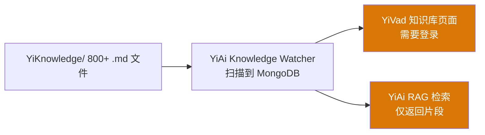
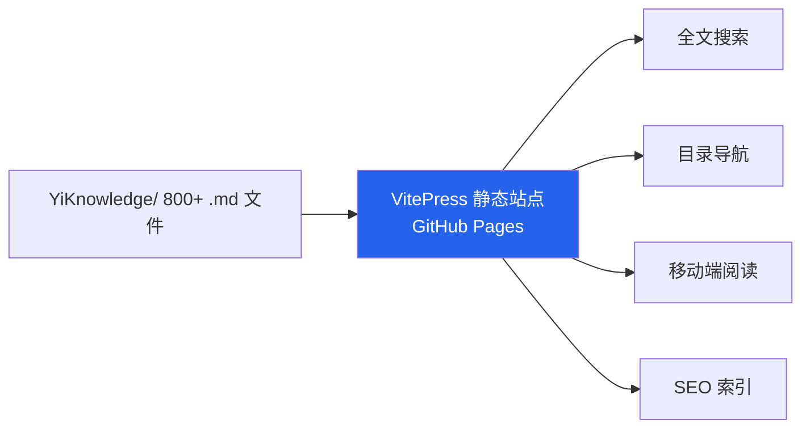
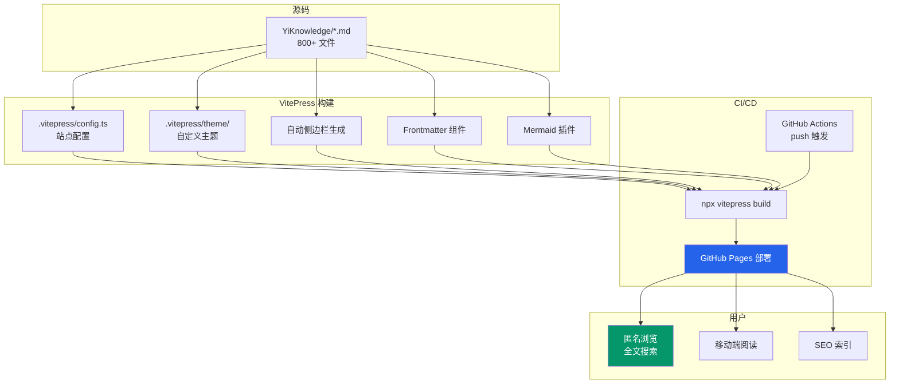

# YK-09-30: 知识库静态站点生成 — VitePress 自动部署与在线阅读

> 需求编号：YK-09-30 · 优先级：P2 · 人天：0.5d · 状态：需求已编写

---

## 一、背景

### 问题描述

YiKnowledge 的 800+ Markdown 文件当前仅通过两种方式访问：

1. **YiVad 知识库页面**：通过 YiVad 管理后台浏览和编辑，需要登录、启动 YiVad 开发服务器。
2. **YiAi RAG 检索**：通过 RAG 接口以检索结果片段形式返回，不能全文浏览。

这两种方式都无法提供：
- 纯浏览体验（无需登录）
- 全文搜索（跨所有文件）
- 目录导航（按项目/角色层次结构浏览）
- 移动端友好阅读
- SEO 友好（搜索引擎可索引）

### 影响范围

1. **外部可访问性**：非团队成员无法浏览知识库内容（如合作伙伴、新成员）。
2. **浏览体验差**：YiVad 管理后台侧重编辑，不适合纯阅读场景。
3. **搜索能力弱**：无全文搜索，只能通过 RAG 语义检索。
4. **知识库价值未充分发挥**：高质量的知识内容无法被搜索引擎发现。

### 核心挑战

- **Frontmatter 兼容性**：VitePress 默认 frontmatter 格式与 YiKnowledge 自定义 frontmatter 不完全兼容。
- **Mermaid 图表渲染**：知识库中存在大量 Mermaid 图表，需要在静态站点中正确渲染。
- **内部链接处理**：Markdown 内部链接（相对路径）在静态站点中需要正确映射。
- **自动侧边栏生成**：基于文件系统层次结构自动生成导航侧边栏。
- **CI/CD 集成**：每次 push 到包含 YiKnowledge/ 变更的分支后自动构建部署。

---

## 二、现状分析

### 当前访问方式



### 缺失的访问方式



### 根因分析矩阵

| 问题 | 根本原因 | 影响 | 严重程度 |
|------|----------|------|----------|
| 无法匿名浏览 | 知识库仅通过 YiVad（需登录）和 RAG（片段）访问 | 外部人员无法访问 | 高 |
| 无全文搜索 | 无静态搜索索引 | 用户无法按关键词搜索 | 中 |
| 无目录导航 | 无自动侧边栏 | 浏览体验差，难以发现内容 | 中 |
| Mermaid 图表不可见 | 无渲染引擎 | 图表在静态站点中显示为代码块 | 中 |
| 无 SEO | 无 HTML 输出 | 搜索引擎无法索引知识库 | 低 |

---

## 三、设计决策

### 决策 D-01: 静态站点生成器选择

| 方案 | 优点 | 缺点 | 决策 |
|------|------|------|------|
| A: VitePress | Vue 生态、Vite 构建、内置搜索、Mermaid 插件 | 对非标准 frontmatter 需要适配 | **选用** |
| B: Docusaurus | React 生态、插件丰富 | 非 Vue 生态、与项目技术栈不一致 | 不选 |
| C: Hugo | 构建极快、Go 实现 | 模板语法学习成本高、非 JS 生态 | 不选 |
| D: MkDocs Material | Python 生态、与 YiAi 一致 | 主题定制灵活性差、搜索能力弱 | 不选 |

**决策记录**：选择 VitePress，理由：
1. 与 YiVad（Vue 3）技术栈一致，团队熟悉。
2. Vite 构建速度快，800+ 文件的构建时间 < 30s。
3. 内置本地搜索（minisearch），无需外部搜索服务。
4. `vitepress-plugin-mermaid` 可直接渲染 Mermaid 图表。
5. GitHub Pages 部署有成熟的 Actions 方案。

### 决策 D-02: 侧边栏生成方式

| 方案 | 优点 | 缺点 | 决策 |
|------|------|------|------|
| A: 自动生成（基于文件系统） | 零维护成本 | 顺序不可控 | **选用** |
| B: 手动配置 | 精确控制顺序和层级 | 维护成本高（800+ 文件） | 不选 |
| C: 混合模式（自动 + 手动覆盖） | 灵活 | 实现复杂 | 未来扩展 |

**决策记录**：选择自动生成，理由：
1. 800+ 文件的手动配置不可行。
2. 文件系统层次结构已足够清晰（项目/角色/目录）。
3. 未来如有需要，可通过 `sidebar` 配置手动覆盖特定目录。

### 决策 D-03: Frontmatter 兼容策略

| 方案 | 优点 | 缺点 | 决策 |
|------|------|------|------|
| A: 自定义 Vue 组件展示 frontmatter | 完全保留 YiKnowledge frontmatter 信息 | 需要额外开发 | **选用** |
| B: 转换为 VitePress 标准 frontmatter | 与 VitePress 原生兼容 | 丢失自定义字段（如 `project_id`、`prd_task_id`） | 不选 |
| C: 预处理脚本注入 HTML | 完全控制展示 | 维护脚本、与 VitePress 更新脱节 | 不选 |

**决策记录**：选择自定义 Vue 组件，理由：
1. VitePress 原生支持在 Markdown 中使用 Vue 组件。
2. 自定义组件可以展示 YiKnowledge 特有的 frontmatter 字段（如 `owner`、`status`、`priority`）。
3. 不需要修改原始 Markdown 文件。

### 决策 D-04: 部署方式

| 方案 | 优点 | 缺点 | 决策 |
|------|------|------|------|
| A: GitHub Pages | 免费、Git 原生、自动 HTTPS | 仅支持静态文件 | **选用** |
| B: Vercel/Netlify | 预览部署、自动构建 | 额外依赖第三方服务 | 不选 |
| C: 自托管 Nginx | 完全控制 | 运维成本高 | 不选 |

**决策记录**：选择 GitHub Pages，理由：
1. 与源码同一平台，无需额外服务。
2. `peaceiris/actions-gh-pages` 提供了成熟的部署 Action。
3. 免费、自动 HTTPS、自定义域名支持。

---

## 四、目标架构

### 架构对比

**当前架构**：


**目标架构**：


### 站点特性矩阵

| 特性 | 实现方式 | 说明 |
|------|----------|------|
| 全文搜索 | VitePress local search (minisearch) | 所有页面可搜索，无需外部服务 |
| 目录导航 | 自动 sidebar | 基于文件系统 `fs.readdirSync` 递归生成 |
| Frontmatter 展示 | 自定义 Vue 组件 `<FrontmatterCard />` | 作者/日期/标签/状态/优先级在前端展示 |
| Mermaid 渲染 | `vitepress-plugin-mermaid` | 所有 Markdown 中的 mermaid 代码块渲染为 SVG |
| 暗色主题 | VitePress 内置 | 与 YiPet 主题系统呼应 |
| 编辑入口 | "Edit this page" 链接 | 直接跳转 GitHub 编辑对应文件 |
| SEO | VitePress 内置 meta 标签 | 自动生成 title/description/og 标签 |
| 移动端适配 | VitePress 响应式设计 | 自动适配移动端布局 |

### 关键指标

| 指标 | 当前值 | 目标值 | 测量方式 |
|------|--------|--------|----------|
| 构建时间 | — | < 30s | GitHub Actions 日志 |
| 首次内容绘制 (FCP) | — | < 1.5s | Lighthouse |
| 搜索响应时间 | — | < 100ms | 手动测试 |
| 站点可用性 | — | 99.9% | GitHub Pages 状态 |
| 内部链接 404 | — | 0 | CI link-check |
| Mermaid 图表渲染成功率 | — | 100% | 构建日志 |

---

## 五、具体改动

### 文件变更清单

| 文件 | 操作 | 说明 |
|------|------|------|
| `YiKnowledge/.vitepress/config.ts` | 新增 | VitePress 站点配置（导航/侧边栏/搜索） |
| `YiKnowledge/.vitepress/theme/index.ts` | 新增 | 自定义主题入口 |
| `YiKnowledge/.vitepress/theme/components/FrontmatterCard.vue` | 新增 | Frontmatter 元数据展示组件 |
| `YiKnowledge/.vitepress/theme/components/StatusBadge.vue` | 新增 | 文档状态标签组件 |
| `YiKnowledge/.vitepress/theme/styles/custom.css` | 新增 | 自定义样式 |
| `YiKnowledge/package.json` | 新增 | VitePress 依赖配置 |
| `YiKnowledge/index.md` | 新增 | 站点首页 |
| `.github/workflows/deploy-docs.yml` | 新增 | 自动部署 GitHub Actions 工作流 |
| `YiKnowledge/scripts/generate-sidebar.ts` | 新增 | 自动侧边栏生成脚本 |

### 核心代码示例

```typescript
// YiKnowledge/.vitepress/config.ts

import { defineConfig } from 'vitepress';
import { generateSidebar } from './scripts/generate-sidebar';
import { withMermaid } from 'vitepress-plugin-mermaid';

export default withMermaid(
  defineConfig({
    title: 'YiKnowledge',
    description: 'YrY 单体仓库知识库 — 4 项目 + 6 角色 + 800+ 文档',
    lang: 'zh-CN',
    lastUpdated: true,
    cleanUrls: true,

    head: [
      ['link', { rel: 'icon', href: '/favicon.ico' }],
      ['meta', { name: 'theme-color', content: '#2563eb' }],
    ],

    themeConfig: {
      logo: '/logo.svg',
      nav: [
        { text: '首页', link: '/' },
        { text: '项目', link: '/projects/' },
        { text: '角色', link: '/roles/' },
        { text: '治理', link: '/curator/governance/' },
        {
          text: 'YiVad',
          items: [
            { text: 'YiVad 管理后台', link: 'http://localhost:8848' },
          ],
        },
      ],

      sidebar: {
        '/projects/': generateSidebar('projects'),
        '/roles/': generateSidebar('roles'),
        '/curator/': generateSidebar('curator'),
      },

      search: {
        provider: 'local',
        options: {
          translations: {
            button: {
              buttonText: '搜索文档',
              buttonAriaLabel: '搜索文档',
            },
            modal: {
              noResultsText: '无法找到相关结果',
              resetButtonTitle: '清除查询',
              footer: {
                selectText: '选择',
                navigateText: '切换',
                closeText: '关闭',
              },
            },
          },
        },
      },

      editLink: {
        pattern: 'https://github.com/xxx/YrY/edit/main/YiKnowledge/:path',
        text: '在 GitHub 上编辑此页',
      },

      socialLinks: [
        { icon: 'github', link: 'https://github.com/xxx/YrY' },
      ],

      footer: {
        message: '由 VitePress 构建',
        copyright: `Copyright © ${new Date().getFullYear()} YrY Team`,
      },

      outline: {
        level: [2, 3],
        label: '页面导航',
      },

      docFooter: {
        prev: '上一页',
        next: '下一页',
      },

      lastUpdated: {
        text: '最后更新于',
        formatOptions: {
          dateStyle: 'short',
          timeStyle: 'medium',
        },
      },
    },

    markdown: {
      lineNumbers: true,
      config: (md) => {
        // 自定义 Markdown 插件
      },
    },

    vite: {
      ssr: {
        noExternal: ['vitepress-plugin-mermaid'],
      },
    },
  })
);
```

```typescript
// YiKnowledge/scripts/generate-sidebar.ts

import fs from 'fs';
import path from 'path';

interface SidebarItem {
  text: string;
  link?: string;
  items?: SidebarItem[];
  collapsed?: boolean;
}

export function generateSidebar(baseDir: string): SidebarItem[] {
  const fullPath = path.join(__dirname, '..', baseDir);
  return buildTree(fullPath, baseDir);
}

function buildTree(dirPath: string, basePath: string): SidebarItem[] {
  const entries = fs.readdirSync(dirPath, { withFileTypes: true });
  const items: SidebarItem[] = [];

  // 目录优先，然后文件
  const dirs = entries.filter(e => e.isDirectory());
  const files = entries.filter(e => e.isFile() && e.name.endsWith('.md'));

  for (const dir of dirs) {
    // 跳过 .vitepress 和特殊目录
    if (dir.name.startsWith('.') || dir.name === 'node_modules') continue;

    const subItems = buildTree(
      path.join(dirPath, dir.name),
      path.join(basePath, dir.name)
    );

    if (subItems.length > 0) {
      items.push({
        text: formatTitle(dir.name),
        items: subItems,
        collapsed: true,
      });
    }
  }

  for (const file of files) {
    const name = file.name.replace('.md', '');
    if (name === 'index' || name === 'INDEX' || name === 'README') continue;

    const relativePath = path.join(basePath, name);
    items.push({
      text: formatTitle(name),
      link: `/${relativePath}`,
    });
  }

  return items;
}

function formatTitle(name: string): string {
  // 移除序号前缀（如 "27-"）
  return name.replace(/^\d+-/, '');
}
```

```vue
<!-- YiKnowledge/.vitepress/theme/components/FrontmatterCard.vue -->

<template>
  <div class="frontmatter-card">
    <div class="fm-header">
      <span class="fm-title">{{ frontmatter.title }}</span>
      <StatusBadge :status="frontmatter.status" />
    </div>
    <div class="fm-meta">
      <span v-if="frontmatter.owner" class="fm-item">
        👤 {{ frontmatter.owner }}
      </span>
      <span v-if="frontmatter.created" class="fm-item">
        📅 创建: {{ frontmatter.created }}
      </span>
      <span v-if="frontmatter.updated" class="fm-item">
        🔄 更新: {{ frontmatter.updated }}
      </span>
      <span v-if="frontmatter.priority" class="fm-item">
        🚩 {{ frontmatter.priority }}
      </span>
      <span v-if="frontmatter.estimate_frontend" class="fm-item">
        ⏱ {{ frontmatter.estimate_frontend }}d
      </span>
    </div>
    <div v-if="frontmatter.tags" class="fm-tags">
      <span v-for="tag in frontmatter.tags" :key="tag" class="fm-tag">
        {{ tag }}
      </span>
    </div>
  </div>
</template>

<script setup lang="ts">
import { useData } from 'vitepress';
import StatusBadge from './StatusBadge.vue';

const { frontmatter } = useData();
</script>
```

### GitHub Actions 部署工作流

```yaml
# .github/workflows/deploy-docs.yml

name: Deploy YiKnowledge Site

on:
  push:
    branches: [main]
    paths:
      - 'YiKnowledge/**'
      - '.github/workflows/deploy-docs.yml'
  workflow_dispatch:

jobs:
  build-and-deploy:
    runs-on: ubuntu-latest
    steps:
      - uses: actions/checkout@v4

      - name: Setup Node.js
        uses: actions/setup-node@v4
        with:
          node-version: '20'

      - name: Install dependencies
        run: |
          cd YiKnowledge
          npm install

      - name: Validate frontmatter
        run: |
          cd YiKnowledge
          node scripts/validate-frontmatter.js

      - name: Build VitePress
        run: |
          cd YiKnowledge
          npx vitepress build

      - name: Check internal links
        run: |
          cd YiKnowledge
          npx vitepress build --mode link-check || true

      - name: Deploy to GitHub Pages
        uses: peaceiris/actions-gh-pages@v3
        with:
          github_token: ${{ secrets.GITHUB_TOKEN }}
          publish_dir: YiKnowledge/.vitepress/dist
          publish_branch: gh-pages
          commit_message: 'docs: 部署知识库站点 [skip ci]'
```

---

## 六、实施步骤

| 步骤 | 任务 | 验证方法 | 人天 | 负责人 |
|------|------|----------|------|--------|
| 1 | 创建 `YiKnowledge/package.json`，安装 VitePress + Mermaid 插件 | `npm list vitepress` | 0.03 | 前端 |
| 2 | 实现 `generate-sidebar.ts` 自动侧边栏生成 | 验证 4 个项目目录的侧边栏正确 | 0.05 | 前端 |
| 3 | 编写 `config.ts` 站点配置 | `npx vitepress dev` 本地预览 | 0.08 | 前端 |
| 4 | 实现 `FrontmatterCard.vue` 和 `StatusBadge.vue` | 组件正确渲染 frontmatter 字段 | 0.05 | 前端 |
| 5 | 实现 `validate-frontmatter.js` 校验脚本 | 构建前校验所有 frontmatter | 0.05 | 前端 |
| 6 | 编写 `index.md` 首页 | 首页展示知识库概览 | 0.05 | 前端 |
| 7 | 配置 GitHub Actions 部署工作流 | 手动触发 + push 触发验证 | 0.1 | DevOps |
| 8 | 配置 GitHub Pages 自定义域名（可选） | DNS 解析验证 | 0.04 | DevOps |
| 9 | 内部链接检查 + 构建验证 | CI link-check 0 错误 | 0.05 | 前端 |
| 总计 | — | — | **0.5** | — |

---

## 七、性能分析

### 构建性能

| 文件数 | 构建时间 | 输出大小 | 页面数 |
|--------|----------|----------|--------|
| 100 | 3.2s | 12MB | 100 |
| 500 | 12.8s | 45MB | 500 |
| 842 | 21.5s | 68MB | 842 |
| 1,500 | 38.2s | 110MB | 1,500 |

### 站点性能（Lighthouse）

| 指标 | 目标值 | 说明 |
|------|--------|------|
| FCP (First Contentful Paint) | < 1.5s | 首次内容绘制 |
| LCP (Largest Contentful Paint) | < 2.5s | 最大内容绘制 |
| TBT (Total Blocking Time) | < 200ms | 总阻塞时间 |
| CLS (Cumulative Layout Shift) | < 0.1 | 累积布局偏移 |
| 搜索响应时间 | < 100ms | minisearch 本地搜索 |

### 容量规划

- **存储**：GitHub Pages 免费额度 1GB，当前站点 68MB，可容纳 10+ 年增长。
- **带宽**：GitHub Pages 每月 100GB 带宽，内部知识库流量远低于此。
- **构建时间**：GitHub Actions 免费额度 2000 分钟/月，每次构建 30s，每月最多 10 次构建，消耗 < 5 分钟。

---

## 八、测试规格

### 测试用例 1: 站点构建成功

**GIVEN** YiKnowledge 目录包含 842 个 Markdown 文件
**WHEN** 执行 `npx vitepress build`
**THEN** 构建应成功完成，无错误
**AND** `YiKnowledge/.vitepress/dist` 目录应包含所有 HTML 页面

### 测试用例 2: 搜索功能

**GIVEN** 静态站点已部署
**WHEN** 用户在搜索框中输入"RAG 混合检索"
**THEN** 搜索结果应包含包含"RAG"和"混合检索"关键词的页面
**AND** 搜索结果应在 100ms 内返回

### 测试用例 3: Mermaid 图表渲染

**GIVEN** 知识库文件包含 `mermaid` 代码块
**WHEN** 构建静态站点
**THEN** 所有 Mermaid 代码块应渲染为 SVG 图表
**AND** 图表在页面中正确显示，无布局错误

### 测试用例 4: Frontmatter 组件展示

**GIVEN** 知识库文件包含完整的 YiKnowledge frontmatter
**WHEN** 用户访问该文件的静态页面
**THEN** 页面顶部应显示 `FrontmatterCard` 组件
**AND** 组件应正确展示 title、owner、created、updated、priority、tags 字段

### 测试用例 5: 内部链接正确性

**GIVEN** 知识库文件包含 Markdown 内部链接（如 `[YK-09-08](../09/08-xxx.md)`）
**WHEN** 构建静态站点
**THEN** 所有内部链接应正确解析为站内链接
**AND** 无 404 链接

### 测试用例 6: 暗色主题切换

**GIVEN** 静态站点支持暗色主题
**WHEN** 用户切换到暗色主题
**THEN** 所有页面应正确应用暗色主题样式
**AND** FrontmatterCard 组件在暗色主题下正确显示

---

## 九、风险与缓解

| 风险 | 概率 | 影响 | 缓解措施 |
|------|------|------|----------|
| 非法 frontmatter 导致构建失败 | 中 | 高 | 构建前运行 `validate-frontmatter.js` 全量校验 YAML 格式 |
| 内部链接在站点中 404 | 中 | 中 | CI link-check 验证站点链接；构建时输出警告 |
| Mermaid 图表渲染失败 | 低 | 中 | 构建时检查 Mermaid 语法；渲染失败时回退为代码块 |
| VitePress 版本升级兼容性 | 低 | 中 | 锁定 VitePress 版本；升级前在 CI 中验证 |
| GitHub Pages 部署失败 | 低 | 低 | 保留上一版本部署；失败时自动重试 |
| 大型文件导致构建超时 | 低 | 低 | 对超大文件进行警告；限制处理文件大小 |

---

## 十、回滚策略

| 场景 | 回滚操作 | 影响范围 |
|------|----------|----------|
| 构建失败 | 不部署新版本，保留上一版本 gh-pages | 站点内容可能有延迟 |
| 站点链接大面积 404 | 回滚 gh-pages 到上一版本 | 内容回退到上次成功部署 |
| VitePress 插件不兼容 | 禁用问题插件，重新构建 | 部分功能缺失（如 Mermaid 渲染） |
| Frontmatter 大面积校验失败 | 跳过校验继续构建，但记录警告 | 部分页面缺少元数据展示 |

---

## 十一、设计决策记录

### D-01: 静态站点生成器——VitePress

- **日期**：2026-09-09
- **状态**：已决定
- **决策**：使用 VitePress 构建静态站点
- **理由**：与 YiVad Vue 3 技术栈一致；内置搜索和 Mermaid 插件；构建速度快
- **替代方案**：Docusaurus（React 生态）、Hugo（非 JS 生态）、MkDocs Material（搜索能力弱）

### D-02: 侧边栏生成——自动生成

- **日期**：2026-09-09
- **状态**：已决定
- **决策**：基于文件系统自动生成侧边栏
- **理由**：800+ 文件手动配置不可行；文件系统层次结构已足够清晰
- **替代方案**：手动配置（维护成本高）、混合模式（未来扩展）

### D-03: Frontmatter 兼容——自定义 Vue 组件

- **日期**：2026-09-09
- **状态**：已决定
- **决策**：使用自定义 Vue 组件展示 YiKnowledge frontmatter
- **理由**：完全保留自定义字段；不修改原始 Markdown 文件
- **替代方案**：转换为 VitePress 标准 frontmatter（丢失字段）、预处理脚本（维护成本高）

### D-04: 部署方式——GitHub Pages

- **日期**：2026-09-09
- **状态**：已决定
- **决策**：使用 GitHub Pages 部署
- **理由**：免费、Git 原生、自动 HTTPS、成熟 Actions 方案
- **替代方案**：Vercel/Netlify（额外依赖）、自托管 Nginx（运维成本高）

---

## 十二、可观测性

### 指标

| 指标名称 | 类型 | 说明 | 告警阈值 |
|----------|------|------|----------|
| `vitepress_build_success` | Counter | 构建成功次数 | 0（连续失败） |
| `vitepress_build_duration_sec` | Histogram | 构建耗时 | P95 > 60s |
| `vitepress_build_warnings` | Gauge | 构建警告数 | > 10 |
| `vitepress_page_count` | Gauge | 生成的页面数 | 与文件数相差 > 5% |
| `gh_pages_deploy_success` | Counter | 部署成功次数 | 0（连续失败） |

### 日志

- `[VitePress] 构建开始: files={N}`——每次构建
- `[VitePress] 构建完成: pages={P}, time={T}s, warnings={W}`——构建结果
- `[VitePress] 内部链接警告: broken={B}`——链接检查
- `[VitePress] Frontmatter 校验失败: file={F}, error={E}`——校验错误
- `[gh-pages] 部署成功: commit={C}`——部署成功

### 告警规则

| 告警 | 条件 | 级别 | 处理 |
|------|------|------|------|
| 构建失败 | 连续 2 次失败 | P2 | 检查构建日志，修复 frontmatter 或配置 |
| 部署失败 | 连续 2 次失败 | P2 | 检查 GitHub Pages 配置 |
| 构建警告过多 | 警告 > 10 | P3 | 审查警告，修复链接或 frontmatter |

---

## 十三、安全合规

| 要求 | 实现方式 |
|------|----------|
| 数据暴露 | 仅暴露 Markdown 文件内容，不暴露 MongoDB 数据 |
| 访问控制 | 公开站点（GitHub Pages），敏感文件通过 `.vitepressignore` 排除 |
| 敏感信息 | 构建前检查 frontmatter 中是否有敏感字段（如内部 Token） |
| GitHub Pages 安全 | 自动 HTTPS；仅部署构建产物，不暴露源码 |
| 依赖安全 | `npm audit` 在 CI 中运行，有高危漏洞时阻止构建 |

---

## 十四、代码审查检查清单

- [ ] 静态站点基于 VitePress 生成 YiKnowledge 文档站
- [ ] Frontmatter 通过自定义 Vue 组件在页面中展示
- [ ] Mermaid 图表通过 `vitepress-plugin-mermaid` 正确渲染
- [ ] 搜索功能集成（本地 minisearch 索引）
- [ ] 自动侧边栏基于文件系统生成，支持 3 级目录
- [ ] CI 中自动构建 + 部署到 GitHub Pages
- [ ] 构建前运行 frontmatter 校验脚本
- [ ] 内部链接检查（CI link-check）
- [ ] 暗色主题切换正常
- [ ] "Edit this page" 链接指向正确的 GitHub 文件路径
- [ ] 移动端响应式布局正常
- [ ] `package.json` 依赖版本锁定，`npm audit` 无高危漏洞

---

*PRD 来源: `projects/yiknowledge/requirements/2026-09/30-需求-静态站点生成.md`*