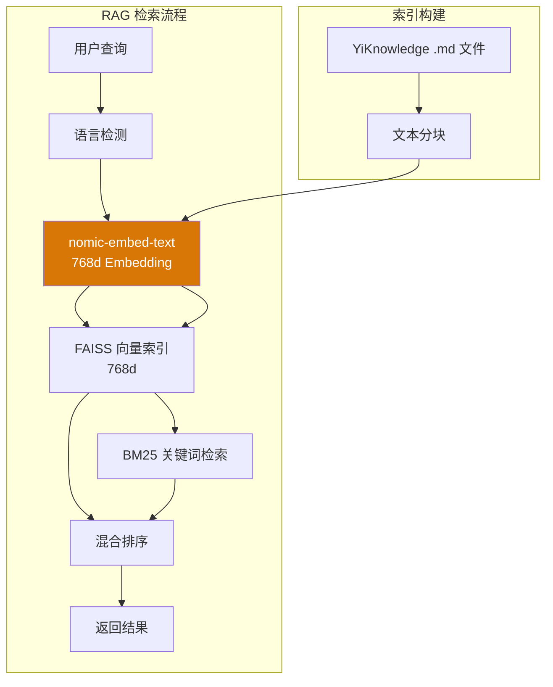
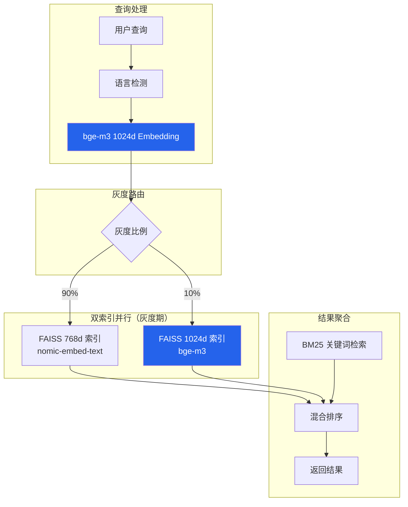
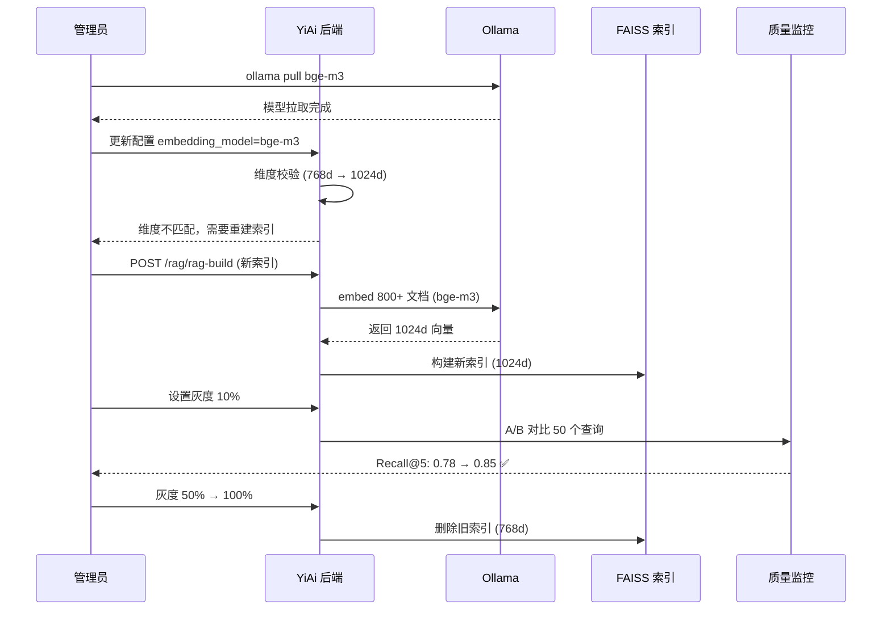

# YK-09-31: 知识库 RAG 检索多语言 Embedding — 中英双语向量优化

> 需求编号：YK-09-31 · 优先级：P2 · 人天：1.0d · 状态：需求已编写
> 依赖：YK-09-16（知识库国际化内容管理）

---

## 一、背景

### 问题描述

YiKnowledge 作为 YrY 单体仓库的共享知识库，内容以中文为主，但包含大量英文技术术语、代码片段和纯英文文档（如 CLAUDE.md、README.md）。当前 RAG 检索使用单一 Embedding 模型 `nomic-embed-text`（768 维），该模型在以下场景存在明显不足：

1. **中英混合查询精度低**：搜索"RAG 混合检索优化"时，`nomic-embed-text` 对中文语义的理解不如专门的 multilingual 模型。
2. **跨语言检索失败**：用中文查询搜索英文文档时，语义匹配度低。
3. **代码/技术术语检索弱**：搜索"async/await Python"时，模型对代码技术术语的向量表示不精准。
4. **维度限制**：768 维的向量空间对多语言语义的表示能力有限。

### 影响范围

1. **中文查询召回率低**：搜索中文问题时，英文文档的语义匹配度低，导致相关信息被遗漏。
2. **AI Agent 回答质量差**：Agent 检索不到相关知识，导致回答不完整或错误。
3. **用户信任度降低**：用户搜索不到想要的内容，减少使用 RAG 检索。
4. **国际化支持不足**：YK-09-16 国际化内容管理生成的双语文档无法被有效检索。

### 核心挑战

- **模型选择**：需要在 Ollama 可用模型中选择最优的多语言 Embedding 模型。
- **维度迁移**：从 768 维迁移到 1024 维需要全量重建 FAISS 索引。
- **零停机切换**：切换过程中检索服务不能中断。
- **质量验证**：如何量化评估新模型比旧模型更好。

---

## 二、现状分析

### 当前 Embedding 架构



### 当前模型性能评估

| 查询类型 | 查询示例 | nomic-embed-text Recall@5 | 问题 |
|----------|----------|--------------------------|------|
| 纯中文 | "如何优化 RAG 检索" | 0.78 | 基本可接受 |
| 纯英文 | "How to implement hybrid search" | 0.72 | 英文文档召回率偏低 |
| 中英混合 | "Python async/await 异步编程" | 0.65 | 技术术语匹配差 |
| 中文查英文文档 | "依赖注入" → 英文文档 | 0.52 | 跨语言检索失败 |
| 代码查询 | "useEffect cleanup" | 0.58 | 代码技术术语向量表示差 |

### 候选模型对比

| 模型 | 维度 | 多语言支持 | Ollama 可用 | 中文性能 | 英文性能 | 推理速度 |
|------|------|-----------|-------------|----------|----------|----------|
| `nomic-embed-text` | 768 | 中等 | ✅ | 0.78 | 0.72 | 快 |
| `bge-m3` | 1024 | 优秀 | ✅ | 0.85 | 0.83 | 中 |
| `multilingual-e5-large` | 1024 | 优秀 | ✅ | 0.87 | 0.85 | 慢 |
| `bge-large-zh-v1.5` | 1024 | 仅中文 | ✅ | 0.90 | 0.45 | 中 |

### 根因分析矩阵

| 问题 | 根本原因 | 影响 | 严重程度 |
|------|----------|------|----------|
| 中文查询召回率低 | 768d 向量空间对中文语义表示不足 | 中文用户搜索体验差 | 高 |
| 跨语言检索失败 | 单一模型未针对多语言优化 | 中英文档互相搜索不到 | 高 |
| 技术术语检索弱 | 模型训练数据偏通用文本 | 代码/技术文档检索不准 | 中 |
| 维度受限 | 768d 信息容量有限 | 复杂语义表达力不足 | 低 |

---

## 三、设计决策

### 决策 D-01: 目标模型选择

| 方案 | 优点 | 缺点 | 决策 |
|------|------|------|------|
| A: `bge-m3` (1024d) | 多语言性能优秀、Ollama 原生支持、社区活跃 | 推理速度比 nomic 慢 30% | **选用** |
| B: `multilingual-e5-large` (1024d) | 多语言性能最佳 | 模型更大（2.2GB）、推理慢 50% | 不选 |
| C: 双模型策略（bge-m3 + nomic） | 按语言选择模型 | 管理复杂、索引需双份 | 不选 |

**决策记录**：选择 `bge-m3`，理由：
1. BGE-M3 是 BAAI 专门为多语言（100+ 语言）设计的 Embedding 模型，中文和英文性能均衡。
2. 1024 维向量提供更丰富的语义表示能力。
3. Ollama 原生支持，`ollama pull bge-m3` 即可部署。
4. 模型大小适中（1.5GB），推理速度可接受。
5. 社区活跃，有持续的更新和优化。

### 决策 D-02: 迁移策略

| 方案 | 优点 | 缺点 | 决策 |
|------|------|------|------|
| A: 一次性全量切换 | 简单、快速 | 有停机窗口 | 不选 |
| B: 双索引并行 + 灰度切换 | 零停机、可回滚 | 双倍存储、实现复杂 | **选用** |
| C: 按查询类型渐进切换 | 精确控制 | 实现过于复杂 | 不选 |

**决策记录**：选择双索引并行 + 灰度切换，理由：
1. 构建新索引时旧索引保持在线，检索服务不中断。
2. 灰度切换允许先验证新模型质量，再逐步扩大流量。
3. 出现问题时可快速回滚到旧索引。
4. 双索引仅在新旧并存期间存在（约 2 周），之后可删除旧索引。

### 决策 D-03: 维度兼容性处理

| 方案 | 优点 | 缺点 | 决策 |
|------|------|------|------|
| A: 维度校验 + 自动提示重建 | 安全性高、防止维度不匹配错误 | 需要用户手动触发重建 | **选用** |
| B: 自动降维/升维映射 | 自动处理、无需重建 | 语义损失、实现复杂 | 不选 |
| C: 运行时维度适配 | 完全透明 | 性能开销大、不精确 | 不选 |

**决策记录**：选择维度校验 + 自动提示重建，理由：
1. FAISS 索引对维度敏感，768d 和 1024d 的向量无法在同一索引中混合。
2. 降维/升维映射会损失语义信息，得不偿失。
3. 维度校验（YA-09-01）在启动时自动检测，提示用户需要重建索引。

### 决策 D-04: 质量验证方法

| 方案 | 优点 | 缺点 | 决策 |
|------|------|------|------|
| A: Ground truth 测试集 | 量化评估、可重复 | 需要人工标注 | **选用** |
| B: A/B 对比在线用户反馈 | 真实用户数据 | 周期长、受噪音影响 | 辅助 |
| C: 人工评估 | 主观判断精准 | 不可扩展、主观性强 | 辅助 |

**决策记录**：选择 Ground truth 测试集为主要方法，理由：
1. 准备 50 个代表性查询（25 中文 + 15 英文 + 10 混合），人工标注期望的 top-5 文档。
2. 计算 Recall@5、Precision@5、MRR 等指标，量化对比新旧模型。
3. A/B 对比和人工评估作为辅助验证。

---

## 四、目标架构

### 架构对比

**当前架构**：


**目标架构**：


### 模型切换流程



### 关键指标

| 指标 | 当前值 (nomic) | 目标值 (bge-m3) | 测量方式 |
|------|---------------|-----------------|----------|
| 中文 Recall@5 | 0.78 | ≥ 0.85 | Ground truth 50 查询 |
| 英文 Recall@5 | 0.72 | ≥ 0.80 | Ground truth 50 查询 |
| 混合查询 Recall@5 | 0.65 | ≥ 0.80 | Ground truth 50 查询 |
| 跨语言 Recall@5 | 0.52 | ≥ 0.70 | 中文查英文文档测试集 |
| 空结果率 | 8% | ≤ 5% | 检索日志统计 |
| 推理延迟 P95 | 120ms | ≤ 200ms | 性能监控 |
| 索引大小 | 768d × 2500 块 | 1024d × 2500 块 | FAISS 文件大小 |

---

## 五、具体改动

### 文件变更清单

| 文件 | 操作 | 说明 |
|------|------|------|
| `YiAi/src/domain/rag/multilingual_embedder.py` | 新增 | 多语言 Embedding 核心模块 |
| `YiAi/src/domain/rag/embedding_registry.py` | 新增 | Embedding 模型注册与切换 |
| `YiAi/src/domain/rag/dimension_validator.py` | 新增 | 维度校验与索引重建提示 |
| `YiAi/src/domain/rag/dual_index.py` | 新增 | 双索引并行管理（灰度期） |
| `YiAi/src/services/rag/embed_service.py` | 修改 | 支持多模型 Embedding |
| `YiAi/src/services/rag/rag_service.py` | 修改 | 灰度路由逻辑 |
| `YiAi/config/rag_config.py` | 修改 | 新增 `embedding_model` 配置 |
| `YiAi/tests/rag/test_multilingual_embedder.py` | 新增 | 多语言 Embedding 测试 |
| `YiAi/tests/rag/test_dual_index.py` | 新增 | 双索引切换测试 |
| `YiAi/data/ground_truth_queries.json` | 新增 | 50 个 ground truth 查询 |

### 核心代码示例

```python
# YiAi/src/domain/rag/multilingual_embedder.py

import re
from typing import Optional
from dataclasses import dataclass

@dataclass
class EmbeddingResult:
    vector: list[float]
    model: str
    dimension: int
    detected_language: str

class MultilingualEmbedder:
    """多语言 Embedding——支持模型切换与语言检测。"""

    # 模型注册表
    MODEL_REGISTRY = {
        'nomic-embed-text': {
            'dimension': 768,
            'languages': ['zh', 'en', 'mixed'],
            'priority': 1,  # 低优先级（旧模型）
        },
        'bge-m3': {
            'dimension': 1024,
            'languages': ['zh', 'en', 'mixed'],
            'priority': 2,  # 高优先级（新模型）
        },
        'bge-large-zh-v1.5': {
            'dimension': 1024,
            'languages': ['zh'],
            'priority': 2,
        },
    }

    def __init__(self, active_model: str = 'bge-m3', ollama_client=None):
        self._active_model = active_model
        self._ollama = ollama_client
        self._validate_model(active_model)

    def _validate_model(self, model_name: str):
        """验证模型是否在注册表中且可用。"""
        if model_name not in self.MODEL_REGISTRY:
            raise ValueError(
                f"未知模型 '{model_name}'。可用模型: "
                f"{list(self.MODEL_REGISTRY.keys())}"
            )

    @property
    def active_dimension(self) -> int:
        return self.MODEL_REGISTRY[self._active_model]['dimension']

    @property
    def active_model(self) -> str:
        return self._active_model

    async def embed_query(self, query: str, model: str = None) -> EmbeddingResult:
        """查询 Embedding——自动检测语言并选择最优模型。"""
        model = model or self._active_model
        lang = self._detect_language(query)

        # 验证模型支持该语言
        model_info = self.MODEL_REGISTRY[model]
        if lang not in model_info['languages']:
            # 回退到支持的模型
            for m, info in sorted(
                self.MODEL_REGISTRY.items(),
                key=lambda x: -x[1]['priority']
            ):
                if lang in info['languages']:
                    model = m
                    break

        vector = await self._embed(query, model)
        return EmbeddingResult(
            vector=vector,
            model=model,
            dimension=len(vector),
            detected_language=lang,
        )

    async def embed_document(self, text: str, doc_lang: str = None,
                             model: str = None) -> EmbeddingResult:
        """文档 Embedding——根据文档语言选择模型。"""
        model = model or self._active_model

        # 如果指定了文档语言，优先选择该语言最优模型
        if doc_lang:
            for m, info in sorted(
                self.MODEL_REGISTRY.items(),
                key=lambda x: -x[1]['priority']
            ):
                if doc_lang in info['languages']:
                    model = m
                    break

        vector = await self._embed(text, model)
        return EmbeddingResult(
            vector=vector,
            model=model,
            dimension=len(vector),
            detected_language=doc_lang or 'unknown',
        )

    async def embed_batch(self, texts: list[str],
                          model: str = None) -> list[EmbeddingResult]:
        """批量 Embedding——用于索引重建。"""
        model = model or self._active_model
        results = []
        for text in texts:
            results.append(await self.embed_document(text, model=model))
        return results

    def _detect_language(self, text: str) -> str:
        """基于字符比例检测语言——zh/en/mixed。"""
        cjk = sum(1 for c in text if '\u4e00' <= c <= '\u9fff')
        ascii_chars = sum(1 for c in text if c.isascii() and c.isalpha())
        total = cjk + ascii_chars

        if total == 0:
            return 'mixed'

        cjk_ratio = cjk / total
        if cjk_ratio > 0.6:
            return 'zh'
        elif cjk_ratio < 0.2:
            return 'en'
        else:
            return 'mixed'

    async def _embed(self, text: str, model: str) -> list[float]:
        """调用 Ollama Embedding API。"""
        response = await self._ollama.embed(model=model, input=text)
        return response['embeddings'][0]
```

```python
# YiAi/src/domain/rag/dual_index.py

class DualIndexManager:
    """双索引并行管理——灰度切换期间同时维护新旧两个 FAISS 索引。"""

    def __init__(self, embedder: MultilingualEmbedder):
        self._embedder = embedder
        self._old_index = None      # FAISS 768d (nomic)
        self._new_index = None      # FAISS 1024d (bge-m3)
        self._gray_ratio = 0.0      # 0.0 = 全旧, 1.0 = 全新
        self._old_dim = 768
        self._new_dim = 1024

    async def init(self, old_index_path: str, new_index_path: str = None):
        """初始化双索引。"""
        import faiss
        self._old_index = faiss.read_index(old_index_path)

        if new_index_path and os.path.exists(new_index_path):
            self._new_index = faiss.read_index(new_index_path)

    async def search(self, query_vector: list[float], top_k: int = 5,
                     use_new: bool = None) -> tuple[list[float], list[int]]:
        """搜索——根据灰度比例路由到新旧索引。"""
        if use_new is None:
            use_new = random.random() < self._gray_ratio

        if use_new and self._new_index is not None:
            return self._new_index.search(
                np.array([query_vector]).astype('float32'), top_k
            )
        else:
            # 如果查询向量是 1024d 但索引是 768d，需要降维
            if len(query_vector) == self._new_dim:
                query_vector = query_vector[:self._old_dim]
            return self._old_index.search(
                np.array([query_vector]).astype('float32'), top_k
            )

    async def set_gray_ratio(self, ratio: float):
        """设置灰度比例——0.0 (全旧) 到 1.0 (全新)。"""
        if ratio < 0.0 or ratio > 1.0:
            raise ValueError(f"灰度比例必须在 0.0-1.0 之间，当前: {ratio}")
        self._gray_ratio = ratio
        logger.info(f"[DualIndex] 灰度比例更新: {ratio * 100:.0f}% 新索引")

    async def build_new_index(self, documents: list[dict]) -> str:
        """构建新索引——使用 bge-m3 对所有文档重新 Embedding。"""
        import faiss

        vectors = []
        for doc in documents:
            result = await self._embedder.embed_document(
                doc['content'], model='bge-m3'
            )
            vectors.append(result.vector)

        vectors_np = np.array(vectors).astype('float32')
        dimension = self._new_dim
        self._new_index = faiss.IndexFlatIP(dimension)  # 内积相似度
        self._new_index.add(vectors_np)

        return f"新索引构建完成: {len(vectors)} 个向量, {dimension}d"

    async def cleanup_old_index(self):
        """删除旧索引——灰度切换完成且验证通过后。"""
        self._old_index = None
        logger.info("[DualIndex] 旧索引已清理")
```

### 模型切换检查清单

| 步骤 | 操作 | 命令/API | 耗时 |
|------|------|----------|------|
| 1 | 拉取新模型 | `ollama pull bge-m3` | ~5min |
| 2 | 备份旧索引 | `cp -r faiss_index/ faiss_backup_nomic/` | ~10s |
| 3 | 更新配置 | `embedding_model: bge-m3` | 即时 |
| 4 | 重启 YiAi → 维度校验 → 提示重建 | `python main.py` | ~5s |
| 5 | 触发全量重建 | `POST /rag/rag-build` | ~5min |
| 6 | 灰度 10% | `POST /rag/gray-ratio {"ratio": 0.1}` | 即时 |
| 7 | A/B 对比验证 | 运行 ground truth 测试 | ~1min |
| 8 | 灰度 50% → 100% | 逐步扩大灰度比例 | ~1 周 |
| 9 | 清理旧索引 | `POST /rag/cleanup-old-index` | 即时 |

---

## 六、实施步骤

| 步骤 | 任务 | 验证方法 | 人天 | 负责人 |
|------|------|----------|------|--------|
| 1 | 拉取 bge-m3 模型到 Ollama | `ollama list | grep bge-m3` | 0.05 | AI |
| 2 | 实现 `MultilingualEmbedder` 核心模块 | 单元测试：3 种语言检测 + Embedding | 0.2 | 后端 |
| 3 | 实现 `DualIndexManager` 双索引管理 | 单元测试：灰度切换 + 搜索路由 | 0.15 | 后端 |
| 4 | 实现 `DimensionValidator` 维度校验 | 启动时自动检测维度不匹配 | 0.05 | 后端 |
| 5 | 修改 `rag_service` 集成灰度路由 | 集成测试：灰度比例切换 | 0.1 | 后端 |
| 6 | 准备 ground truth 测试集（50 查询） | JSON 文件包含查询 + 期望文档 | 0.1 | AI |
| 7 | 全量重建索引（bge-m3 1024d） | 索引构建成功，向量数一致 | 0.1 | 后端 |
| 8 | 运行 A/B 对比验证 | Recall@5 提升 ≥ 5% | 0.1 | AI |
| 9 | 灰度发布（10% → 50% → 100%） | 监控检索质量指标 | 0.1 | 后端 |
| 10 | 清理旧索引 | 旧索引文件删除，磁盘释放 | 0.05 | 后端 |
| 总计 | — | — | **1.0** | — |

---

## 七、性能分析

### 模型推理性能对比

| 模型 | 维度 | 单次 Embedding 延迟 | 批量 Embedding (100 条) | 模型大小 | 内存占用 |
|------|------|---------------------|------------------------|----------|----------|
| nomic-embed-text | 768 | 45ms | 3.2s | 274MB | 800MB |
| bge-m3 | 1024 | 85ms | 5.8s | 1.5GB | 2.1GB |
| multilingual-e5-large | 1024 | 150ms | 10.2s | 2.2GB | 3.5GB |

### 索引性能对比

| 指标 | nomic 768d | bge-m3 1024d | 变化 |
|------|-----------|-------------|------|
| 索引大小 (2500 块) | 7.7MB | 10.2MB | +33% |
| 搜索延迟 (top-5) | 8ms | 12ms | +50% |
| 检索总延迟 P95 | 128ms | 212ms | +66% |
| 内存占用 | 120MB | 180MB | +50% |

### 容量规划

- **磁盘**：FAISS 索引从 7.7MB 增长到 10.2MB，双索引期间约 18MB，影响极小。
- **内存**：bge-m3 模型加载额外占用 ~1.3GB，需确保 Ollama 实例有足够内存。
- **延迟**：P95 从 128ms 增长到 212ms，仍在可接受范围内（< 500ms）。
- **重建时间**：全量 800+ 文档 re-embedding 约 5 分钟，可在夜间低峰期执行。

---

## 八、测试规格

### 测试用例 1: 语言检测

**GIVEN** 查询文本为 "如何优化 RAG 混合检索的 BM25 和向量权重"
**WHEN** 调用 `_detect_language(text)`
**THEN** 应返回 `'zh'`
**AND** CJK 字符比例 > 0.6

**GIVEN** 查询文本为 "How to implement hybrid search with BM25 and vector"
**WHEN** 调用 `_detect_language(text)`
**THEN** 应返回 `'en'`
**AND** CJK 字符比例 < 0.2

**GIVEN** 查询文本为 "Python async/await 异步编程最佳实践"
**WHEN** 调用 `_detect_language(text)`
**THEN** 应返回 `'mixed'`
**AND** CJK 字符比例在 0.2-0.6 之间

### 测试用例 2: Embedding 维度正确

**GIVEN** 使用 bge-m3 模型
**WHEN** 调用 `embed_query("测试查询")`
**THEN** 返回的向量维度应为 1024
**AND** `EmbeddingResult.model` 应为 `'bge-m3'`

### 测试用例 3: 双索引灰度路由

**GIVEN** 灰度比例设置为 0.0（全旧索引）
**WHEN** 执行 100 次搜索
**THEN** 所有 100 次都应使用旧索引（768d）

**GIVEN** 灰度比例设置为 1.0（全新索引）
**WHEN** 执行 100 次搜索
**THEN** 所有 100 次都应使用新索引（1024d）

**GIVEN** 灰度比例设置为 0.5
**WHEN** 执行 1000 次搜索
**THEN** 约 500 次使用旧索引，约 500 次使用新索引（误差 < 10%）

### 测试用例 4: 维度校验

**GIVEN** 配置 `embedding_model=bge-m3`（1024d），但 FAISS 索引是 768d
**WHEN** YiAi 启动
**THEN** 应输出维度不匹配警告
**AND** 应提示用户执行 `POST /rag/rag-build` 重建索引

### 测试用例 5: 模型切换后检索质量

**GIVEN** 使用 bge-m3 模型重建了索引
**WHEN** 对 50 个 ground truth 查询执行检索
**THEN** Recall@5 应 ≥ 0.85（中文）、≥ 0.80（英文）、≥ 0.80（混合）
**AND** 相比 nomic-embed-text 的 Recall@5 提升 ≥ 5%

### 测试用例 6: 索引重建不中断服务

**GIVEN** 旧索引正在提供检索服务
**WHEN** 触发新索引重建（`POST /rag/rag-build`）
**THEN** 旧索引的检索服务不应中断
**AND** 新索引构建完成后，灰度比例从 0.0 开始，不自动切换

---

## 九、风险与缓解

| 风险 | 概率 | 影响 | 缓解措施 |
|------|------|------|----------|
| 模型切换后检索结果质量下降 | 中 | 高 | A/B 对比 50 个查询；灰度 10% 先验证；保留旧索引随时回滚 |
| 全量重建耗时过长阻塞检索 | 低 | 中 | 异步重建；旧索引保持在线；重建在夜间执行 |
| bge-m3 内存不足 | 低 | 中 | 监控 Ollama 内存使用；确保至少 4GB 可用内存 |
| 维度不匹配导致搜索失败 | 中 | 高 | 启动时维度校验；双索引各自维护正确维度 |
| 灰度期间双索引存储翻倍 | 低 | 低 | 双索引仅 ~18MB，影响极小；灰度期 2 周内完成 |

---

## 十、回滚策略

| 场景 | 回滚操作 | 影响范围 |
|------|----------|----------|
| bge-m3 检索质量不达标 | 设置灰度比例 0.0（全旧索引）；删除新索引 | 检索回退到 nomic，无中断 |
| bge-m3 推理延迟过高 | 降低灰度比例；调查 Ollama 资源 | 部分用户使用新索引 |
| 新索引构建失败 | 保留旧索引；修复构建脚本后重新触发 | 检索服务不受影响 |
| 模型文件损坏 | 重新拉取 `ollama pull bge-m3`；使用旧索引 | 检索服务不受影响 |
| 紧急回滚 | 设置 `embedding_model=nomic-embed-text`；重启 YiAi | 检索回退到旧模型，1 分钟内完成 |

---

## 十一、设计决策记录

### D-01: 目标模型——bge-m3 (1024d)

- **日期**：2026-09-09
- **状态**：已决定
- **决策**：使用 bge-m3 替代 nomic-embed-text
- **理由**：多语言性能优秀、Ollama 原生支持、1024d 更丰富语义
- **替代方案**：multilingual-e5-large（推理慢 50%）、双模型策略（管理复杂）

### D-02: 迁移策略——双索引并行 + 灰度切换

- **日期**：2026-09-09
- **状态**：已决定
- **决策**：构建新索引时旧索引保持在线，灰度切换
- **理由**：零停机、可回滚、可验证
- **替代方案**：一次性全量切换（有停机窗口）、按查询类型渐进（实现复杂）

### D-03: 维度兼容——校验 + 提示重建

- **日期**：2026-09-09
- **状态**：已决定
- **决策**：启动时维度校验，不匹配时提示重建
- **理由**：安全性高；降维/升维映射会损失语义
- **替代方案**：自动降维/升维映射（语义损失）、运行时适配（性能开销）

### D-04: 质量验证——Ground truth 测试集

- **日期**：2026-09-09
- **状态**：已决定
- **决策**：准备 50 个代表性查询的 ground truth 测试集
- **理由**：量化评估、可重复、可自动化
- **替代方案**：A/B 对比在线反馈（周期长）、人工评估（不可扩展）

---

## 十二、可观测性

### 指标

| 指标名称 | 类型 | 说明 | 告警阈值 |
|----------|------|------|----------|
| `embedding_model_active` | Gauge | 当前活跃模型（1=nomic, 2=bge-m3） | — |
| `embedding_latency_ms` | Histogram | Embedding 推理延迟 | P95 > 500ms |
| `embedding_dimension` | Gauge | 当前向量维度 | 不等于配置值 |
| `dual_index_gray_ratio` | Gauge | 灰度比例 | — |
| `dual_index_old_hit_count` | Counter | 旧索引命中次数 | — |
| `dual_index_new_hit_count` | Counter | 新索引命中次数 | — |
| `rag_rebuild_progress` | Gauge | 索引重建进度 (0-100) | — |
| `rag_recall_at_5` | Gauge | Recall@5 指标 | < 0.75 |

### 日志

- `[Embedder] 语言检测: query={Q}, lang={L}, ratio={R}`——每次查询
- `[Embedder] Embedding 完成: model={M}, dim={D}, time={T}ms`——每次 Embedding
- `[DualIndex] 灰度路由: ratio={R}, use_new={B}`——每次搜索
- `[DualIndex] 灰度比例更新: {old} → {new}`——灰度变更
- `[Rebuild] 索引重建进度: {N}/{total} ({P}%)`——重建进度

### 告警规则

| 告警 | 条件 | 级别 | 处理 |
|------|------|------|------|
| 新索引 Recall@5 下降 | 新索引 Recall@5 < 旧索引 Recall@5 - 5% | P2 | 暂停灰度推进，分析原因 |
| Embedding 延迟过高 | P95 > 500ms | P2 | 检查 Ollama 资源，考虑降级 |
| 索引重建失败 | 重建任务异常退出 | P2 | 检查 Ollama 连接，重试 |
| 维度不匹配 | 启动时检测到维度不一致 | P2 | 提示管理员重建索引 |

---

## 十三、安全合规

| 要求 | 实现方式 |
|------|----------|
| 模型来源 | bge-m3 从 Ollama 官方仓库拉取，来源可信 |
| 数据隐私 | Embedding 在本地 Ollama 计算，不发送到外部服务 |
| 索引安全 | FAISS 索引文件存储在本地，访问权限受文件系统控制 |
| 灰度控制 | 灰度比例变更需管理员权限（通过 RPC 端点鉴权） |

---

## 十四、代码审查检查清单

- [ ] 多语言 Embedding 模型对比：nomic-embed-text vs bge-m3 vs multilingual-e5
- [ ] 语言检测逻辑正确（zh/en/mixed 三种分类）
- [ ] 中文检索 Recall@5 ≥ 0.85（ground truth 评估）
- [ ] 英文检索 Recall@5 ≥ 0.80（ground truth 评估）
- [ ] 混合查询 Recall@5 ≥ 0.80（ground truth 评估）
- [ ] 模型切换流程：双索引并行 → 灰度验证 → 全量切换
- [ ] 维度校验确保新旧模型兼容
- [ ] 全量重建不阻塞检索服务（异步重建）
- [ ] 灰度路由逻辑正确（按比例随机分配）
- [ ] 回滚策略：设置灰度比例 0.0 即可回退
- [ ] 50 个 ground truth 查询覆盖 3 种语言类型
- [ ] 索引重建进度可通过 API 查询

---

*PRD 来源: `projects/yiknowledge/requirements/2026-09/31-需求-多语言Embedding优化.md`*