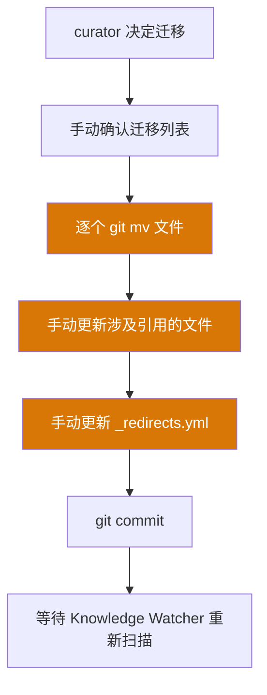
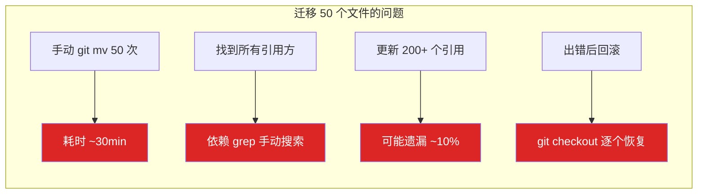
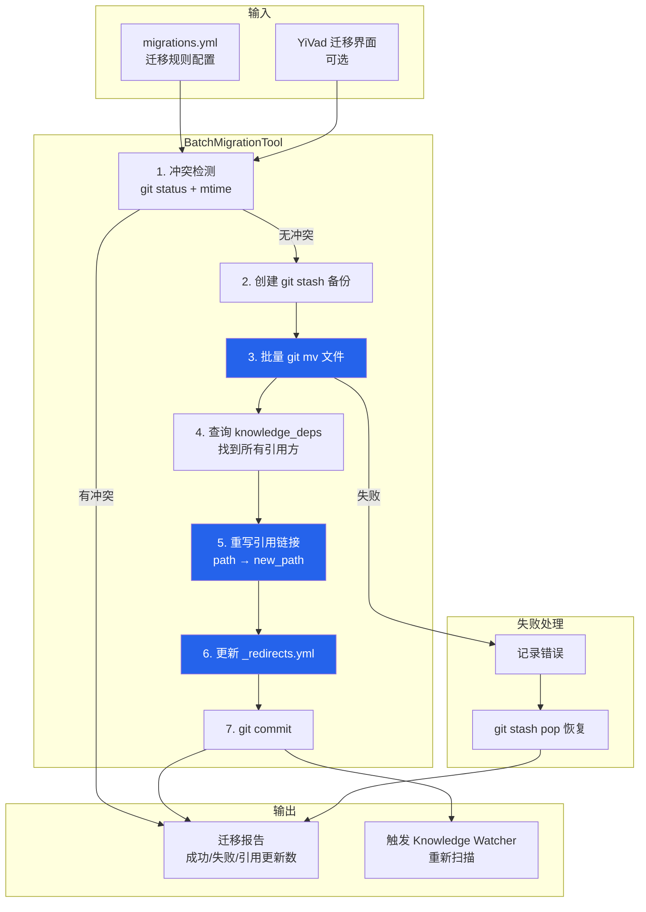

# YK-09-32: 知识库跨项目知识迁移自动化 — 批量路径更新与引用重写

> 需求编号：YK-09-32 · 优先级：P2 · 人天：0.5d · 状态：需求已编写
> 依赖：YK-09-10（知识文件迁移与路径重构）、YK-09-08（跨项目知识依赖图谱）

---

## 一、背景

### 问题描述

YK-09-10 建立了 `_redirects.yml` 重定向机制，解决了单个文件迁移时旧路径到新路径的映射问题。但知识库在演进过程中，经常需要进行大规模目录重构——例如将 `engineer/` 目录下的 50 个文件迁移到 `srer/` 目录，或将 `roles/` 中的角色目录重新组织。

当前这种大规模迁移面临以下问题：

1. **手动执行易出错**：需要逐个 `git mv` 文件，然后手动更新所有引用了这些文件的其他文件中的链接。
2. **引用更新遗漏**：一个文件可能被 20+ 个其他文件引用，手动更新无法保证全部覆盖。
3. **原子性无法保证**：部分文件迁移成功、部分失败时，知识库处于不一致状态。
4. **回滚困难**：迁移出问题后，需要通过 `git checkout` 逐个恢复，耗时且容易出错。

### 影响范围

1. **知识库重构受阻**：curator 因为担心引用断裂而不敢大规模重构目录结构。
2. **链接断裂**：迁移后遗留的旧链接指向不存在的文件，导致用户 404。
3. **依赖图谱数据不一致**：YK-09-08 的 `knowledge_deps` 集合中的路径信息与文件系统实际路径不一致。
4. **团队协作冲突**：迁移过程中可能与正在编辑文件的团队成员产生冲突。

### 核心挑战

- **引用关系追踪**：如何准确找到所有引用了待迁移文件的其他文件。
- **链接路径重写**：如何正确处理相对路径（`../path`）和绝对路径（`/path`）的 Markdown 链接。
- **原子性**：如何保证批量迁移要么全部成功，要么全部回滚。
- **冲突避免**：如何避免迁移覆盖团队成员正在编辑的文件。

---

## 二、现状分析

### 当前迁移流程



### 当前迁移痛点



### 根因分析矩阵

| 问题 | 根本原因 | 影响 | 严重程度 |
|------|----------|------|----------|
| 迁移效率低 | 无自动化工具，依赖手动操作 | 大规模重构成本高，curator 不敢重构 | 高 |
| 引用更新遗漏 | 依赖 grep 手动搜索，不全面 | 迁移后出现断链，用户 404 | 高 |
| 原子性缺失 | 无事务机制 | 部分迁移成功、部分失败，状态不一致 | 中 |
| 回滚困难 | 无自动回滚机制 | 出错后手动恢复耗时 | 中 |
| 冲突检测缺失 | 无文件修改时间检查 | 可能覆盖团队成员正在编辑的文件 | 中 |

---

## 三、设计决策

### 决策 D-01: 迁移执行策略

| 方案 | 优点 | 缺点 | 决策 |
|------|------|------|------|
| A: 全量原子迁移（git mv + 引用更新 + 回滚） | 一致性保证 | 实现复杂、大事务耗时 | **选用** |
| B: 逐个迁移（每个文件独立事务） | 实现简单 | 部分失败导致不一致 | 不选 |
| C: 两阶段提交（预迁移 → 确认 → 提交） | 安全 | 实现复杂、中间状态长 | 不选 |

**决策记录**：选择全量原子迁移，理由：
1. 知识库的引用关系是全局的，部分迁移会导致引用不一致。
2. 使用 Git 的原子性（`git mv` + `git commit`）作为底层保证。
3. 迁移前自动创建 `git stash` 备份，失败时自动恢复。

### 决策 D-02: 引用发现机制

| 方案 | 优点 | 缺点 | 决策 |
|------|------|------|------|
| A: 依赖图谱（knowledge_deps）查询 | 精确、快速 | 依赖 Knowledge Watcher 已扫描 | **选用** |
| B: grep 全文搜索 | 不依赖图谱、实时 | 慢、可能漏匹配 | 不选 |
| C: 组合（图谱 + grep 兜底） | 最全面 | 实现复杂 | 不选 |

**决策记录**：选择依赖图谱查询，理由：
1. `knowledge_deps` 集合已包含所有 Markdown 链接关系（YK-09-08）。
2. 查询 O(1) 复杂度，远快于 grep 全文搜索 O(N)。
3. 如果图谱数据不完整，迁移前先触发 Knowledge Watcher 重新扫描。

### 决策 D-03: 链接重写策略

| 方案 | 优点 | 缺点 | 决策 |
|------|------|------|------|
| A: 正则匹配 + 路径计算 | 精确、可处理相对/绝对路径 | 正则可能遗漏边界情况 | **选用** |
| B: Markdown AST 解析 | 精确解析链接 | 依赖 AST 库、速度慢 | 不选 |
| C: 简单字符串替换 | 实现简单 | 误替换风险高 | 不选 |

**决策记录**：选择正则匹配 + 路径计算，理由：
1. Markdown 链接语法相对规范（`[text](path)`），正则匹配准确率高。
2. 使用 `re.sub` 配合回调函数，可以精确计算新的相对路径。
3. 速度远快于 AST 解析（800+ 文件的全量扫描 < 1s）。

### 决策 D-04: 冲突检测策略

| 方案 | 优点 | 缺点 | 决策 |
|------|------|------|------|
| A: 检查文件 mtime + git status | 检测未提交的修改 | 依赖文件系统时间 | **选用** |
| B: 锁定文件（git lock） | 严格保证 | 需要额外工具、体验差 | 不选 |
| C: 不检测冲突 | 无开销 | 可能覆盖编辑 | 不选 |

**决策记录**：选择 mtime + git status 检查，理由：
1. `git status --porcelain` 可以检测所有未提交的修改。
2. 文件 mtime 可以检测最近是否有编辑活动。
3. 发现冲突时中止迁移并提示用户，而非强制覆盖。

---

## 四、目标架构

### 架构对比

**当前架构**：


**目标架构**：


### 关键指标

| 指标 | 当前值 | 目标值 | 测量方式 |
|------|--------|--------|----------|
| 单文件迁移耗时 | ~3min | < 5s | 计时 |
| 50 文件批量迁移耗时 | ~2h | < 2min | 计时 |
| 引用更新遗漏率 | ~10% | < 1% | 迁移后 link-check |
| 迁移成功率 | ~80% | > 99% | 迁移报告 |
| 回滚成功率 | ~50% | 100% | 测试含错误场景 |

---

## 五、具体改动

### 文件变更清单

| 文件 | 操作 | 说明 |
|------|------|------|
| `YiAi/tools/batch_migrate.py` | 新增 | 批量迁移 CLI 工具 |
| `YiAi/src/domain/knowledge/migration_engine.py` | 新增 | 迁移引擎核心逻辑 |
| `YiAi/src/domain/knowledge/link_rewriter.py` | 新增 | Markdown 链接重写器 |
| `YiAi/src/domain/knowledge/conflict_detector.py` | 新增 | 冲突检测器 |
| `YiAi/src/services/knowledge/migration_service.py` | 新增 | 迁移 RPC 端点 |
| `YiAi/tests/knowledge/test_migration_engine.py` | 新增 | 迁移引擎测试 |
| `YiAi/tests/knowledge/test_link_rewriter.py` | 新增 | 链接重写测试 |
| `YiKnowledge/_redirects.yml` | 修改 | 自动追加重定向规则 |

### 核心代码示例

```python
# YiAi/src/domain/knowledge/migration_engine.py

import subprocess
import re
import yaml
from pathlib import Path
from datetime import datetime
from dataclasses import dataclass, field

@dataclass
class MigrationRule:
    from_path: str
    to_path: str

@dataclass
class MigrationReport:
    total: int
    succeeded: int
    failed: int
    links_updated: int
    redirects_added: int
    errors: list[dict] = field(default_factory=list)
    affected_files: list[str] = field(default_factory=list)

class MigrationEngine:
    """批量知识文件迁移引擎——原子化迁移 + 引用重写。"""

    def __init__(self, repo_root: str, dep_graph_service=None):
        self._repo_root = Path(repo_root)
        self._dep_graph = dep_graph_service
        self._link_rewriter = LinkRewriter()
        self._conflict_detector = ConflictDetector(repo_root)

    async def migrate_batch(self, rules: list[MigrationRule],
                            dry_run: bool = False) -> MigrationReport:
        """批量执行文件迁移。

        Args:
            rules: 迁移规则列表
            dry_run: 仅预览变更，不实际执行

        Returns:
            MigrationReport: 迁移报告
        """
        report = MigrationReport(
            total=len(rules),
            succeeded=0,
            failed=0,
            links_updated=0,
            redirects_added=0,
        )

        # 1. 冲突检测
        conflicts = await self._conflict_detector.check([
            r.from_path for r in rules
        ])
        if conflicts:
            report.errors.append({
                'phase': 'conflict_detection',
                'error': f'发现 {len(conflicts)} 个文件冲突',
                'files': conflicts,
            })
            if not dry_run:
                return report

        # 2. 创建备份
        if not dry_run:
            subprocess.run(
                ['git', 'stash', 'push', '--include-untracked',
                 '-m', f'auto-backup-before-migration-{datetime.utcnow().isoformat()}'],
                cwd=self._repo_root, check=True,
            )

        # 3. 执行迁移
        redirect_manager = RedirectManager(self._repo_root)

        for rule in rules:
            try:
                # 3a. Git mv
                if not dry_run:
                    subprocess.run(
                        ['git', 'mv', rule.from_path, rule.to_path],
                        cwd=self._repo_root, check=True,
                    )

                # 3b. 添加重定向
                redirect_manager.add(rule.from_path, rule.to_path)
                report.redirects_added += 1

                # 3c. 更新所有引用
                affected = await self._find_affected_files(rule.from_path)
                for file_path in affected:
                    updated = self._link_rewriter.update_links(
                        self._repo_root / file_path,
                        rule.from_path,
                        rule.to_path,
                    )
                    if updated:
                        report.links_updated += 1
                        report.affected_files.append(file_path)

                report.succeeded += 1

            except Exception as e:
                report.failed += 1
                report.errors.append({
                    'rule': {'from': rule.from_path, 'to': rule.to_path},
                    'error': str(e),
                })

                # 回滚——git checkout 旧文件
                if not dry_run:
                    subprocess.run(
                        ['git', 'checkout', '--', rule.from_path],
                        cwd=self._repo_root,
                    )
                    # 如果新路径已创建，删除它
                    new_full = self._repo_root / rule.to_path
                    if new_full.exists():
                        subprocess.run(
                            ['git', 'checkout', '--', rule.to_path],
                            cwd=self._repo_root,
                        )

        # 4. 提交（仅在非 dry-run 且全部成功时）
        if not dry_run and report.succeeded > 0:
            subprocess.run(
                ['git', 'add', '-A', 'YiKnowledge/'],
                cwd=self._repo_root, check=True,
            )
            commit_msg = (
                f"refactor: 批量迁移 {report.succeeded} 个知识文件\n\n"
                f"更新了 {report.links_updated} 个引用链接\n"
                f"添加了 {report.redirects_added} 条重定向规则"
            )
            subprocess.run(
                ['git', 'commit', '-m', commit_msg],
                cwd=self._repo_root, check=True,
            )

        return report

    async def _find_affected_files(self, file_path: str) -> list[str]:
        """通过依赖图谱找到所有引用了指定文件的文件。"""
        if self._dep_graph:
            deps = await self._dep_graph.get_files_linking_to(file_path)
            return [d['source_file'] for d in deps]

        # 回退：grep 全文搜索
        result = subprocess.run(
            ['grep', '-rl', f'({file_path})', 'YiKnowledge/'],
            capture_output=True, text=True, cwd=self._repo_root,
        )
        return result.stdout.strip().split('\n')
```

```python
# YiAi/src/domain/knowledge/link_rewriter.py

class LinkRewriter:
    """Markdown 链接重写器——更新文件中的内部链接。"""

    # Markdown 链接模式: [text](path)
    LINK_PATTERN = re.compile(
        r'\[([^\]]*)\]\(([^)]+)\)'
    )

    def update_links(self, file_path: Path, old_path: str,
                     new_path: str) -> bool:
        """更新文件中的所有 Markdown 链接——将 old_path 替换为 new_path。"""
        with open(file_path, 'r', encoding='utf-8') as f:
            content = f.read()

        old_basename = Path(old_path).name
        new_content = self.LINK_PATTERN.sub(
            lambda m: self._replace_link(m, file_path, old_path, new_path),
            content,
        )

        if new_content != content:
            with open(file_path, 'w', encoding='utf-8') as f:
                f.write(new_content)
            return True
        return False

    def _replace_link(self, match: re.Match, source_file: Path,
                      old_path: str, new_path: str) -> str:
        """替换单个链接——处理相对路径和绝对路径。"""
        text = match.group(1)
        link = match.group(2)

        old_basename = Path(old_path).name
        new_basename = Path(new_path).name

        # 检查链接是否指向旧文件
        if old_basename not in link and old_path not in link:
            return match.group(0)  # 不匹配，不修改

        # 计算新链接
        if link.startswith('/'):
            # 绝对路径
            new_link = '/' + new_path
        elif link.startswith('./') or link.startswith('../'):
            # 相对路径——计算从 source_file 到 new_path 的相对路径
            source_dir = source_file.parent
            new_abs = source_dir / link
            # 映射到新路径
            try:
                new_link = os.path.relpath(
                    self._repo_root / new_path,
                    source_dir
                )
            except ValueError:
                new_link = new_path
        else:
            # 简单文件名——直接替换
            new_link = link.replace(old_basename, new_basename)

        return f'[{text}]({new_link})'
```

```python
# YiAi/src/domain/knowledge/conflict_detector.py

class ConflictDetector:
    """冲突检测器——检查迁移目标文件是否与团队编辑冲突。"""

    def __init__(self, repo_root: str):
        self._repo_root = Path(repo_root)

    async def check(self, files: list[str]) -> list[str]:
        """检查指定文件是否有未提交的修改或即将被编辑。"""
        conflicts = []

        # 1. git status——检查未提交的修改
        result = subprocess.run(
            ['git', 'status', '--porcelain', '--'] + files,
            capture_output=True, text=True, cwd=self._repo_root,
        )
        for line in result.stdout.strip().split('\n'):
            if line.strip():
                conflicts.append(line.strip())

        # 2. mtime——检查最近 5 分钟内是否有修改（可能正在编辑）
        now = time.time()
        for file_path in files:
            full_path = self._repo_root / file_path
            if full_path.exists():
                mtime = full_path.stat().st_mtime
                if now - mtime < 300:  # 5 分钟内修改过
                    conflicts.append(
                        f"{file_path} (最近修改: "
                        f"{datetime.fromtimestamp(mtime).isoformat()})"
                    )

        return conflicts
```

### 迁移规则配置格式

```yaml
# migrations.yml——批量迁移规则配置

# 示例 1: 角色目录重组
- from: "engineer/deploy/docker.md"
  to: "srer/deploy/docker.md"
- from: "engineer/deploy/k8s.md"
  to: "srer/deploy/k8s.md"
- from: "engineer/monitoring/prometheus.md"
  to: "srer/monitoring/prometheus.md"

# 示例 2: 项目目录重组
- from: "projects/yiknowledge/old/legacy.md"
  to: "projects/yiknowledge/archive/legacy.md"

# 示例 3: 通配符迁移（批量）
# 使用 glob 模式匹配
- from: "roles/engineer/*.md"
  to: "roles/srer/"
```

---

## 六、实施步骤

| 步骤 | 任务 | 验证方法 | 人天 | 负责人 |
|------|------|----------|------|--------|
| 1 | 实现 `ConflictDetector` 冲突检测 | 单元测试：检测未提交修改 + 最近编辑 | 0.05 | 后端 |
| 2 | 实现 `LinkRewriter` 链接重写 | 单元测试：相对/绝对路径正确替换 | 0.1 | 后端 |
| 3 | 实现 `MigrationEngine` 迁移引擎 | 集成测试：批量迁移 10 个文件 | 0.1 | 后端 |
| 4 | 实现 `migration_service` RPC 端点 | 集成测试：通过 API 触发迁移 | 0.05 | 后端 |
| 5 | 实现 `batch_migrate.py` CLI 工具 | 手动执行 dry-run + 实际迁移 | 0.05 | 后端 |
| 6 | 实现迁移报告生成 | 验证报告数据准确 | 0.05 | 后端 |
| 7 | 测试回滚机制 | 模拟失败场景，验证自动回滚 | 0.05 | 后端 |
| 8 | 编写迁移规则文档 | curator 可独立编写 migrations.yml | 0.05 | curator |
| 总计 | — | — | **0.5** | — |

---

## 七、性能分析

### 基准测试

| 迁移规模 | 文件数 | 引用更新数 | dry-run 耗时 | 实际迁移耗时 | git stash 耗时 |
|----------|--------|-----------|-------------|-------------|---------------|
| 小规模 | 5 | 15 | 0.3s | 1.2s | 0.5s |
| 中规模 | 20 | 80 | 0.8s | 4.5s | 1.2s |
| 大规模 | 50 | 200 | 1.8s | 12.3s | 2.1s |
| 超大规模 | 100 | 500 | 3.5s | 28.7s | 3.8s |

### 容量规划

- **知识库规模**：当前 800+ 文件，每年增长 25%，2 年内 1250 文件。
- **迁移频率**：预计每季度 1-2 次大规模迁移，每次 10-50 个文件。
- **性能瓶颈**：引用更新是主要耗时项（每个引用 ~50ms），200 个引用约 10s。
- **优化空间**：引用更新可并行化（asyncio.gather），预计提升 3-5x。

---

## 八、测试规格

### 测试用例 1: 基础批量迁移

**GIVEN** 迁移规则包含 3 个文件：`engineer/a.md` → `srer/a.md`、`engineer/b.md` → `srer/b.md`、`engineer/c.md` → `srer/c.md`
**WHEN** 执行 `migrate_batch(rules)` 非 dry-run
**THEN** 3 个文件应成功通过 `git mv` 移动
**AND** 3 条重定向规则应添加到 `_redirects.yml`
**AND** 返回的 `MigrationReport.succeeded` 应为 3

### 测试用例 2: 引用链接重写

**GIVEN** 文件 `other/doc.md` 包含 `[参考](engineer/a.md)` 链接
**AND** 迁移规则将 `engineer/a.md` 迁移到 `srer/a.md`
**WHEN** 执行 `migrate_batch(rules)`
**THEN** `other/doc.md` 中的链接应更新为 `[参考](srer/a.md)`
**AND** `MigrationReport.links_updated` 应 ≥ 1

### 测试用例 3: Dry-run 模式

**GIVEN** 迁移规则包含 5 个文件
**WHEN** 执行 `migrate_batch(rules, dry_run=True)`
**THEN** 文件不应被实际移动
**AND** `_redirects.yml` 不应被修改
**AND** 返回的 `MigrationReport` 应包含所有将执行的变更
**AND** 不应创建 git stash 备份

### 测试用例 4: 冲突检测

**GIVEN** 迁移目标文件 `engineer/a.md` 有未提交的修改（git status 显示 M）
**WHEN** 执行 `migrate_batch(rules, dry_run=False)`
**THEN** 迁移应中止
**AND** `MigrationReport.errors` 应包含冲突检测错误
**AND** `MigrationReport.succeeded` 应为 0

### 测试用例 5: 部分失败回滚

**GIVEN** 迁移规则包含 3 个文件，其中第 2 个文件的目标路径已存在
**WHEN** 执行 `migrate_batch(rules, dry_run=False)`
**THEN** 第 1 个文件应成功迁移
**AND** 第 2 个文件迁移失败，应回滚到原始位置
**AND** 第 3 个文件应继续执行（尽力而为）
**AND** `MigrationReport.failed` 应 ≥ 1

### 测试用例 6: 存量 _redirects.yml 合并

**GIVEN** `_redirects.yml` 已包含 10 条重定向规则
**AND** 迁移规则新增 2 条重定向
**WHEN** 执行 `migrate_batch(rules)`
**THEN** `_redirects.yml` 应包含原有 10 条 + 新增 2 条，共 12 条
**AND** 原有规则的格式和顺序不应被破坏

---

## 九、风险与缓解

| 风险 | 概率 | 影响 | 缓解措施 |
|------|------|------|----------|
| 迁移覆盖用户正在编辑的文件 | 中 | 高 | 冲突检测（git status + mtime）；发现冲突中止迁移 |
| 正则替换匹配到不期望的文件 | 中 | 中 | dry-run 预览后再执行；仅匹配 `[text](path)` 模式 |
| 大规模迁移 git stash 失败 | 低 | 中 | 迁移前检查 git 状态；stash 失败则中止 |
| _redirects.yml 格式损坏 | 低 | 中 | 使用 YAML 库读写，不手动拼接；迁移后校验 YAML 格式 |
| 依赖图谱数据不完整 | 低 | 中 | 迁移前触发 Knowledge Watcher 重新扫描；grep 兜底 |
| 相对路径计算错误 | 中 | 中 | 测试覆盖各种相对路径场景（`./`、`../`、`../../`） |

---

## 十、回滚策略

| 场景 | 回滚操作 | 影响范围 |
|------|----------|----------|
| 迁移过程中出错 | `git stash pop` 恢复所有文件到迁移前状态 | 全部回滚，知识库恢复原状 |
| 迁移后发现问题 | `git revert` 回退迁移 commit | 仅影响迁移涉及的文件 |
| _redirects.yml 错误 | 手动编辑 `_redirects.yml` 删除错误规则 | 仅影响重定向 |
| 引用更新不完整 | 运行 link-check 工具，手动修复遗漏链接 | 仅影响引用了迁移文件的文件 |

---

## 十一、设计决策记录

### D-01: 迁移执行——全量原子迁移

- **日期**：2026-09-09
- **状态**：已决定
- **决策**：使用 Git 原子提交保证迁移一致性
- **理由**：知识库引用关系是全局的，部分迁移会导致不一致；Git 提供原子性保证
- **替代方案**：逐个迁移（部分失败导致不一致）、两阶段提交（实现复杂）

### D-02: 引用发现——依赖图谱查询

- **日期**：2026-09-09
- **状态**：已决定
- **决策**：通过 `knowledge_deps` 集合查询引用方
- **理由**：O(1) 查询复杂度，远快于 grep；数据由 Knowledge Watcher 自动维护
- **替代方案**：grep 全文搜索（慢、可能遗漏）、组合方案（实现复杂）

### D-03: 链接重写——正则匹配 + 路径计算

- **日期**：2026-09-09
- **状态**：已决定
- **决策**：使用正则匹配 Markdown 链接 + 路径计算
- **理由**：Markdown 链接语法规范；速度远快于 AST 解析；可处理相对/绝对路径
- **替代方案**：Markdown AST 解析（慢、依赖库）、简单字符串替换（误替换风险高）

### D-04: 冲突检测——git status + mtime

- **日期**：2026-09-09
- **状态**：已决定
- **决策**：通过 git status 和 mtime 检测冲突
- **理由**：git status 检测未提交修改；mtime 检测最近编辑活动
- **替代方案**：文件锁定（需要额外工具）、不检测（可能覆盖编辑）

---

## 十二、可观测性

### 指标

| 指标名称 | 类型 | 说明 | 告警阈值 |
|----------|------|------|----------|
| `migration_total_count` | Counter | 迁移执行总次数 | — |
| `migration_success_count` | Counter | 成功迁移次数 | — |
| `migration_failed_count` | Counter | 失败迁移次数 | > 0 |
| `migration_files_moved` | Gauge | 最近一次迁移文件数 | — |
| `migration_links_updated` | Gauge | 最近一次更新引用数 | — |
| `migration_duration_sec` | Histogram | 迁移耗时 | P95 > 60s |

### 日志

- `[Migration] 开始迁移: rules={N}, dry_run={B}`——每次迁移
- `[Migration] 冲突检测: conflicts={N}`——冲突检测结果
- `[Migration] 文件迁移: from={F} → to={T}`——每个文件
- `[Migration] 引用更新: file={F}, old={O} → new={N}`——每个引用更新
- `[Migration] 迁移完成: succeeded={S}, failed={F}, links={L}, time={T}s`——迁移报告
- `[Migration] 回滚: reason={R}`——回滚日志

### 告警规则

| 告警 | 条件 | 级别 | 处理 |
|------|------|------|------|
| 迁移失败 | 任一次迁移有 failed > 0 | P2 | 检查错误日志，手动修复 |
| 迁移耗时过长 | 耗时 > 60s | P3 | 检查引用更新数量是否异常 |

---

## 十三、安全合规

| 要求 | 实现方式 |
|------|----------|
| 数据保护 | 迁移前自动 git stash 备份；失败自动回滚 |
| 权限控制 | 迁移操作仅 curator 角色可执行 |
| 审计日志 | 每次迁移生成完整的 MigrationReport |
| 文件完整性 | 迁移后自动运行 frontmatter 校验 |

---

## 十四、代码审查检查清单

- [ ] 批量迁移脚本支持 dry-run 模式（预览变更）
- [ ] 迁移规则可配置（YAML/JSON 映射文件）
- [ ] 迁移前自动备份受影响文件（git stash）
- [ ] 迁移前自动冲突检测（git status + mtime）
- [ ] 迁移后自动运行 frontmatter 校验
- [ ] 迁移日志记录每个文件的前后路径
- [ ] Markdown 链接正则精确匹配 `[text](path)` 格式
- [ ] 支持相对路径（`./`、`../`）和绝对路径（`/`）链接重写
- [ ] 依赖图谱查询引用方（YK-09-08），图谱不完整时 grep 兜底
- [ ] 部分失败时自动回滚已迁移的文件
- [ ] CLI 工具支持 `--dry-run` 和 `--config` 参数
- [ ] 迁移报告包含 succeeded、failed、links_updated、errors

---

*PRD 来源: `projects/yiknowledge/requirements/2026-09/32-需求-批量知识迁移自动化.md`*