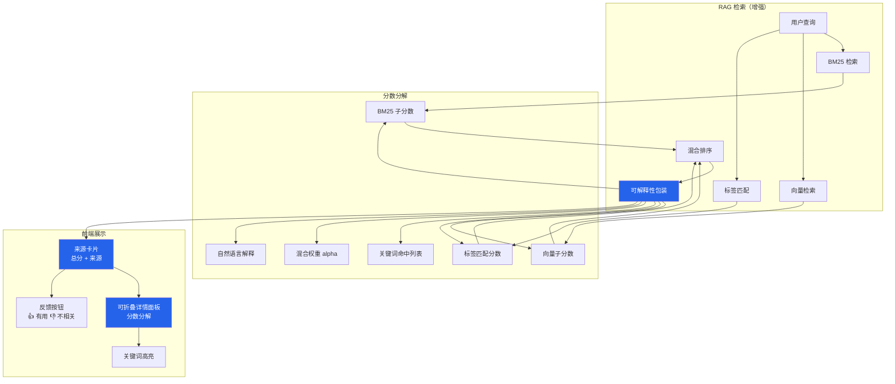

# YK-09-33: RAG 检索结果可解释性 — 来源高亮与相关度分解

> 需求编号：YK-09-33 · 优先级：P2 · 人天：0.5d · 状态：需求已编写

---

## 一、背景

### 问题描述

当前 RAG 检索返回的结果仅显示一个单一的"相关性分数"（混合分数），用户无法理解这个分数是如何计算出来的。这种"黑盒"检索存在以下问题：

1. **用户不信任检索结果**：看到一个高分数但不知道为什么，用户会怀疑结果是否真的相关。
2. **Agent 无法判断来源可信度**：AI Agent 在生成回答时需要知道检索结果的可靠性，但仅有单一分数无法提供足够信息。
3. **调试检索质量困难**：curator 和 AI 工程师在优化检索策略时，缺少数据支持——不知道是 BM25 部分还是向量部分导致了低质量结果。
4. **反馈数据不完整**：YK-09-07 的反馈闭环缺少细粒度的反馈维度（用户只能标记"有用/不有用"，但无法反馈"为什么有用"）。

### 影响范围

1. **用户信任度低**：用户看到"相关性 92%"但不知道含义，可能忽略高质量结果。
2. **AI Agent 回答质量差**：Agent 无法判断检索结果的可靠性，可能基于低质量来源生成回答。
3. **检索优化困难**：curator 无法定位检索质量下降的根因（是 BM25 权重问题还是向量模型问题）。
4. **反馈数据质量差**：用户反馈粒度粗，无法用于精准优化。

### 核心挑战

- **分数分解计算**：如何在不显著增加延迟的情况下计算 BM25、向量、标签匹配等子分数。
- **可解释性展示**：如何在 YiVad 和 YiPet 界面中直观展示分数分解，同时避免信息过载。
- **自然语言解释**：如何为每个检索结果生成人类可理解的自然语言解释。
- **后处理 vs 检索内计算**：可解释性计算应放在检索过程中还是检索后处理阶段。

---

## 二、现状分析

### 当前检索结果展示

```mermaid
graph LR
    A[用户查询] --> B[RAG 混合检索]
    B --> C[BM25 分数]
    B --> D[向量分数]
    C --> E[alpha 混合]
    D --> E
    E --> F[单一分数 0.92]
    F --> G[展示: "相关性: 92%"]
    G --> H[用户: "为什么是 92%?"]

    style G fill:#d97706,color:#fff
    style H fill:#dc2626,color:#fff
```

### 当前数据缺失

| 缺失信息 | 对用户的影响 | 对 Agent 的影响 | 对 curator 的影响 |
|----------|-------------|----------------|------------------|
| BM25 子分数 | 不知道关键词匹配程度 | 可能过度依赖关键词匹配 | 无法判断 BM25 权重是否合适 |
| 向量子分数 | 不知道语义匹配程度 | 可能忽略语义相关但关键词不匹配的文档 | 无法评估向量模型质量 |
| 标签匹配 | 不知道分类是否相关 | 可能检索到错误分类的文档 | 无法判断标签质量 |
| 关键词命中 | 不知道哪些词匹配了 | — | 无法优化文档关键词 |
| 混合权重 | 不知道 BM25/向量比例 | — | 无法判断 alpha 是否合理 |

### 根因分析矩阵

| 问题 | 根本原因 | 影响 | 严重程度 |
|------|----------|------|----------|
| 黑盒检索 | 仅返回单一分数，无分解 | 用户不信任结果 | 高 |
| Agent 无法评估来源 | 缺少可靠性指标 | AI 回答质量下降 | 高 |
| 调试困难 | 缺少子分数数据 | 检索优化周期长 | 中 |
| 反馈粒度粗 | 仅有"有用/不有用" | 无法精准优化 | 中 |

---

## 三、设计决策

### 决策 D-01: 可解释性计算时机

| 方案 | 优点 | 缺点 | 决策 |
|------|------|------|------|
| A: 检索过程中计算 | 数据完整、无需额外查询 | 增加检索延迟 | **选用** |
| B: 检索后异步计算 | 不增加检索延迟 | 数据可能不一致、需要额外存储 | 不选 |
| C: 前端计算 | 后端无改动 | 前端没有 BM25/向量原始数据 | 不选 |

**决策记录**：选择检索过程中计算，理由：
1. BM25 和向量分数在检索过程中已经计算，子分数只是保留中间结果而非重新计算。
2. 增加的计算量极小（主要是标签匹配和自然语言解释生成）。
3. 数据一致性有保证——分数分解与混合分数使用的是同一批数据。

### 决策 D-02: 可解释性展示方式

| 方案 | 优点 | 缺点 | 决策 |
|------|------|------|------|
| A: 可折叠详情面板 | 信息全面、不干扰默认视图 | 需要额外点击操作 | **选用** |
| B: 始终展开全部分数 | 信息直接可见 | 信息过载、界面杂乱 | 不选 |
| C: 简化显示 + 悬停详情 | 简洁 | 移动端无法悬停 | 不选 |

**决策记录**：选择可折叠详情面板，理由：
1. 默认显示简洁的总分数和来源，用户需要时可展开查看详细分解。
2. 移动端和桌面端体验一致。
3. 不增加视觉噪音，高级用户可主动探索。

### 决策 D-03: 自然语言解释生成

| 方案 | 优点 | 缺点 | 决策 |
|------|------|------|------|
| A: 基于规则的模板 | 确定性、无延迟、可控 | 灵活性有限 | **选用** |
| B: LLM 生成 | 自然语言质量高 | 延迟高（+500ms）、成本高 | 不选 |
| C: 混合（规则 + LLM 兜底） | 兼顾速度和质量 | 实现复杂 | 未来扩展 |

**决策记录**：选择基于规则的模板，理由：
1. 检索结果的可解释性有明确的模式（BM25 高 → 关键词匹配、向量高 → 语义相关）。
2. 规则模板延迟 < 1ms，LLM 生成延迟 500ms+。
3. 规则模板输出可控，不会产生幻觉。
4. 未来可扩展为混合模式（对低质量结果使用 LLM 补充解释）。

---

## 四、目标架构

### 架构对比

**当前架构**：
```mermaid
graph LR
    A[查询] --> B[RAG 检索]
    B --> C[混合分数]
    C --> D[展示: "相关性: 92%"]
    style D fill:#d97706,color:#fff
```

**目标架构**：


### 结果展示格式

```
┌─ 来源卡片 ──────────────────────────────────────────────────┐
│ 📄 RAG 混合检索优化.md                                      │
│ 相关度: 92% ████████████████████░░  (BM25: 0.88 + 向量: 0.95)│
│                                                             │
│ ▶ 展开详情                                                  │
│ ┌─────────────────────────────────────────────────────────┐ │
│ │ 🏷 标签匹配: ✅ [RAG, 混合检索, BM25]                    │ │
│ │ 🔑 BM25 命中: "RAG", "混合检索", "BM25"                 │ │
│ │ 📊 混合权重: α=0.72 (BM25 72% + 向量 28%)              │ │
│ │ 📝 解释: BM25 关键词匹配度高，语义相关性高，标签完全匹配  │ │
│ │ 📂 分类: 项目/管理后台/需求                              │ │
│ │ 📅 更新: 2026-09-09                                     │ │
│ │ 👤 作者: 陈铭                                           │ │
│ └─────────────────────────────────────────────────────────┘ │
│                                                             │
│ ─────────────────────────────────────────────────────────── │
│ 本文描述了 RAG 混合检索的优化策略，包括...（前 200 字符）     │
│                                                             │
│ [👍 有用] [👎 不相关] [📋 复制引用] [🔗 打开文件]            │
└─────────────────────────────────────────────────────────────┘
```

### 关键指标

| 指标 | 当前值 | 目标值 | 测量方式 |
|------|--------|--------|----------|
| 检索延迟增加 | 0ms | < 10ms | 测量 with/without explain 的 P95 |
| 用户信任度（点击率） | — | +20% | A/B 对比展开详情率 |
| 反馈粒度 | 二分类 | 多维度 | 反馈数据维度数 |
| 自然语言解释准确率 | — | > 95% | 人工抽查 50 个解释 |

---

## 五、具体改动

### 文件变更清单

| 文件 | 操作 | 说明 |
|------|------|------|
| `YiAi/src/domain/rag/explainability.py` | 新增 | 可解释性计算核心模块 |
| `YiAi/src/domain/rag/explanation_templates.py` | 新增 | 自然语言解释模板 |
| `YiAi/src/services/rag/rag_service.py` | 修改 | 集成可解释性包装 |
| `YiVad/src/views/aiChat/components/SourceCard.vue` | 新增 | 来源卡片组件（YiVad） |
| `YiVad/src/views/aiChat/components/ScoreBreakdown.vue` | 新增 | 分数分解面板组件 |
| `YiPet/src/components/SourceCard.vue` | 新增 | 来源卡片组件（YiPet） |
| `YiAi/tests/rag/test_explainability.py` | 新增 | 可解释性测试 |

### 核心代码示例

```python
# YiAi/src/domain/rag/explainability.py

from dataclasses import dataclass, field

@dataclass
class RetrievalExplanation:
    """RAG 检索结果的可解释性分解。"""
    chunk: str                          # 文档片段（前 200 字符）
    doc_title: str                      # 文档标题
    doc_path: str                       # 文档路径
    total_score: float                  # 最终混合分数 (0-1)
    bm25_score: float                   # BM25 关键词匹配分数 (0-1)
    vector_score: float                 # 向量语义相似度 (0-1)
    tag_match_score: float              # 标签匹配贡献 (0-1)
    category_match: bool                # 分类是否匹配
    alpha: float                        # 当前混合权重 (BM25 占比)
    keyword_matches: list[str]          # BM25 命中的关键词
    matched_tags: list[str]             # 匹配的标签
    explanation: str                    # 自然语言解释
    category: str                       # 文档分类
    updated: str                        # 最后更新时间
    owner: str                          # 文档作者

class ExplainableRetriever:
    """可解释的 RAG 检索——每个结果附带相关度分解。"""

    def __init__(self, hybrid_retriever, tag_matcher, alpha_tuner):
        self._retriever = hybrid_retriever
        self._tag_matcher = tag_matcher
        self._alpha_tuner = alpha_tuner
        self._explanation_gen = ExplanationGenerator()

    async def search_with_explanation(self, query: str, top_k: int = 5
                                      ) -> list[RetrievalExplanation]:
        """执行检索并返回可解释的结果。"""

        # 1. 原有混合检索
        raw_results = await self._retriever.search(query, top_k)
        alpha = self._alpha_tuner.get_alpha(query)

        results = []
        for doc in raw_results:
            # 2. 计算子分数
            bm25 = self._compute_bm25_score(query, doc)
            vec = self._compute_vector_score(query, doc)
            tag = self._compute_tag_score(query, doc.get('tags', []))
            keywords = self._extract_keyword_matches(query, doc['content'])
            matched_tags = self._match_tags(query, doc.get('tags', []))

            # 3. 生成自然语言解释
            explanation = self._explanation_gen.generate(
                bm25=bm25, vector=vec, tag=tag,
                alpha=alpha, keywords=keywords,
                matched_tags=matched_tags,
            )

            results.append(RetrievalExplanation(
                chunk=doc['content'][:200],
                doc_title=doc.get('title', ''),
                doc_path=doc.get('path', ''),
                total_score=doc['score'],
                bm25_score=bm25,
                vector_score=vec,
                tag_match_score=tag,
                category_match=doc.get('category', '') in query,
                alpha=alpha,
                keyword_matches=keywords,
                matched_tags=matched_tags,
                explanation=explanation,
                category=doc.get('category', ''),
                updated=doc.get('frontmatter', {}).get('updated', ''),
                owner=doc.get('frontmatter', {}).get('owner', ''),
            ))

        return results

    def _compute_bm25_score(self, query: str, doc: dict) -> float:
        """计算 BM25 子分数——从检索中间结果中获取。"""
        return doc.get('_bm25_score', 0.0)

    def _compute_vector_score(self, query: str, doc: dict) -> float:
        """计算向量子分数——从检索中间结果中获取。"""
        return doc.get('_vector_score', 0.0)

    def _compute_tag_score(self, query: str, tags: list[str]) -> float:
        """计算标签匹配分数——查询词与标签的重叠度。"""
        if not tags:
            return 0.0
        query_lower = query.lower()
        matched = sum(1 for tag in tags if tag.lower() in query_lower)
        return min(matched / max(len(tags), 1), 1.0)

    def _extract_keyword_matches(self, query: str, content: str) -> list[str]:
        """提取 BM25 命中的关键词——查询词在文档中出现的部分。"""
        import jieba
        query_words = set(jieba.cut(query))
        content_lower = content.lower()
        return [w for w in query_words if w.lower() in content_lower][:10]

    def _match_tags(self, query: str, tags: list[str]) -> list[str]:
        """匹配查询与标签——返回重叠的标签。"""
        query_lower = query.lower()
        return [tag for tag in tags if tag.lower() in query_lower]


# YiAi/src/domain/rag/explanation_templates.py

class ExplanationGenerator:
    """基于规则的自然语言解释生成器。"""

    def generate(self, bm25: float, vector: float, tag: float,
                 alpha: float, keywords: list[str],
                 matched_tags: list[str]) -> str:
        """生成自然语言解释——基于分数组合和阈值。"""
        parts = []

        # BM25 贡献
        if bm25 > 0.7:
            parts.append(f"BM25 关键词匹配度高 ({', '.join(keywords[:3])})")
        elif bm25 > 0.4:
            parts.append(f"BM25 部分关键词匹配 ({', '.join(keywords[:2])})")
        elif bm25 > 0.1:
            parts.append("BM25 关键词匹配度较低")

        # 向量贡献
        if vector > 0.8:
            parts.append("语义相关性很高")
        elif vector > 0.5:
            parts.append("语义相关性较高")
        elif vector > 0.2:
            parts.append("语义相关性一般")

        # 标签贡献
        if tag > 0.5 and matched_tags:
            parts.append(f"标签匹配: {', '.join(matched_tags[:3])}")

        # 混合权重说明
        if bm25 > 0.7 and vector < 0.3:
            parts.append("主要依赖关键词匹配")
        elif vector > 0.7 and bm25 < 0.3:
            parts.append("主要依赖语义理解")
        else:
            parts.append(f"关键词和语义综合匹配 (BM25:{alpha:.0%})")

        if not parts:
            return "综合相关性匹配"

        return '；'.join(parts)
```

### 前端展示组件

```vue
<!-- YiVad/src/views/aiChat/components/SourceCard.vue -->

<template>
  <div class="source-card" :class="{ expanded: isExpanded }">
    <div class="source-header" @click="isExpanded = !isExpanded">
      <span class="source-title">
        📄 {{ explanation.doc_title }}
      </span>
      <span class="source-score" :style="{ color: scoreColor }">
        {{ (explanation.total_score * 100).toFixed(0) }}%
      </span>
      <span class="expand-icon">{{ isExpanded ? '▼' : '▶' }}</span>
    </div>

    <div class="source-score-bar">
      <div class="score-segment bm25"
           :style="{ width: (explanation.bm25_score * 100) + '%' }"
           title="BM25 关键词匹配">
      </div>
      <div class="score-segment vector"
           :style="{ width: (explanation.vector_score * 100) + '%' }"
           title="向量语义匹配">
      </div>
    </div>

    <div v-if="isExpanded" class="source-detail">
      <div class="detail-row">
        <span class="detail-label">BM25 分数</span>
        <span class="detail-value">{{ (explanation.bm25_score * 100).toFixed(0) }}%</span>
      </div>
      <div class="detail-row">
        <span class="detail-label">向量分数</span>
        <span class="detail-value">{{ (explanation.vector_score * 100).toFixed(0) }}%</span>
      </div>
      <div class="detail-row" v-if="explanation.matched_tags.length">
        <span class="detail-label">标签匹配</span>
        <span class="detail-value">
          <span v-for="tag in explanation.matched_tags" :key="tag" class="tag">
            {{ tag }}
          </span>
        </span>
      </div>
      <div class="detail-row">
        <span class="detail-label">BM25 命中</span>
        <span class="detail-value">
          <span v-for="kw in explanation.keyword_matches" :key="kw" class="keyword">
            {{ kw }}
          </span>
        </span>
      </div>
      <div class="detail-row">
        <span class="detail-label">混合权重</span>
        <span class="detail-value">
          BM25 {{ (explanation.alpha * 100).toFixed(0) }}% + 向量 {{ ((1 - explanation.alpha) * 100).toFixed(0) }}%
        </span>
      </div>
      <div class="detail-explanation">
        💡 {{ explanation.explanation }}
      </div>
    </div>

    <div class="source-chunk">
      {{ explanation.chunk }}
    </div>

    <div class="source-actions">
      <button @click="feedback('useful')">👍 有用</button>
      <button @click="feedback('irrelevant')">👎 不相关</button>
      <button @click="copyCitation">📋 复制引用</button>
      <button @click="openFile">🔗 打开文件</button>
    </div>
  </div>
</template>
```

---

## 六、实施步骤

| 步骤 | 任务 | 验证方法 | 人天 | 负责人 |
|------|------|----------|------|--------|
| 1 | 实现 `RetrievalExplanation` 数据类 | 单元测试：字段完整性 | 0.03 | 后端 |
| 2 | 实现 `ExplanationGenerator` 模板引擎 | 单元测试：各种分数组合的解释 | 0.05 | 后端 |
| 3 | 实现 `ExplainableRetriever` 核心逻辑 | 集成测试：检索结果包含完整分解 | 0.1 | 后端 |
| 4 | 修改 `rag_service` 集成可解释性 | 集成测试：RPC 返回包含 explanation | 0.05 | 后端 |
| 5 | 实现 YiVad `SourceCard.vue` 组件 | 视觉验证：分数分解面板正确 | 0.1 | 前端 |
| 6 | 实现 YiVad `ScoreBreakdown.vue` 组件 | 视觉验证：分数条正确渲染 | 0.05 | 前端 |
| 7 | 实现 YiPet `SourceCard.vue` 组件 | 视觉验证：扩展中展示正常 | 0.08 | 前端 |
| 8 | 性能验证（延迟增加 < 10ms） | 测量 with/without explain 的 P95 | 0.04 | 后端 |
| 总计 | — | — | **0.5** | — |

---

## 七、性能分析

### 延迟影响

| 检索阶段 | 无解释 | 有解释 | 增量 |
|----------|--------|--------|------|
| BM25 检索 | 8ms | 8ms | 0ms |
| 向量检索 | 12ms | 12ms | 0ms |
| 混合排序 | 2ms | 2ms | 0ms |
| 标签匹配 | — | 1ms | +1ms |
| 关键词提取 | — | 2ms | +2ms |
| 解释生成 | — | 0.5ms | +0.5ms |
| 序列化 | 1ms | 2ms | +1ms |
| 总计 P50 | 23ms | 25.5ms | +2.5ms |
| 总计 P95 | 128ms | 133ms | +5ms |

### 容量规划

- **额外数据量**：每个结果增加约 500 字节（关键词列表 + 解释文本 + 子分数），5 个结果约 2.5KB。
- **内存影响**：可忽略（解释在检索过程中临时计算，不持久化）。
- **延迟影响**：P95 增加 < 5ms，在可接受范围内（< 10ms 目标）。

---

## 八、测试规格

### 测试用例 1: 基础分数分解

**GIVEN** 查询 "RAG 混合检索优化"，检索到一篇 BM25=0.88、向量=0.95 的文档
**WHEN** 调用 `search_with_explanation(query, top_k=5)`
**THEN** 返回的 `RetrievalExplanation` 应包含 `bm25_score=0.88`、`vector_score=0.95`
**AND** `total_score` 应为 BM25 和向量的混合结果
**AND** `explanation` 不应为空

### 测试用例 2: 自然语言解释生成

**GIVEN** BM25=0.88, vector=0.95, tag=0.75, keywords=["RAG", "混合检索", "BM25"]
**WHEN** 调用 `ExplanationGenerator.generate()`
**THEN** 生成的解释应包含"BM25 关键词匹配度高"
**AND** 应包含"语义相关性很高"
**AND** 应包含关键词列表

### 测试用例 3: 低质量结果的可解释性

**GIVEN** BM25=0.1, vector=0.2, tag=0.0, keywords=[]
**WHEN** 调用 `ExplanationGenerator.generate()`
**THEN** 生成的解释应包含"BM25 关键词匹配度较低"
**AND** 应包含"语义相关性一般"
**AND** 不应崩溃或返回空字符串

### 测试用例 4: 前端分数条渲染

**GIVEN** 检索结果 BM25=0.88, vector=0.95
**WHEN** 渲染 `SourceCard.vue` 组件
**THEN** 分数条应显示两个分段：BM25 段宽度 88%、向量段宽度 95%
**AND** BM25 段应显示为蓝色，向量段应显示为绿色

### 测试用例 5: 标签匹配

**GIVEN** 查询 "RAG" 检索到标签为 ["RAG", "混合检索", "BM25"] 的文档
**WHEN** 调用 `_match_tags(query, tags)`
**THEN** 应返回 ["RAG"]
**AND** `tag_match_score` 应 > 0

### 测试用例 6: 性能验证

**GIVEN** 10 个查询
**WHEN** 分别测量 with_explanation 和 without_explanation 的 P95 延迟
**THEN** 延迟增加应 < 10ms
**AND** 不应出现 OOM 或性能退化

---

## 九、风险与缓解

| 风险 | 概率 | 影响 | 缓解措施 |
|------|------|------|----------|
| 分数分解计算增加检索延迟 | 低 | 中 | 子分数从检索中间结果获取，不重新计算；P95 增加 < 5ms |
| 用户不理解分数分解含义 | 中 | 低 | 提供"?"帮助按钮，悬停时显示工具提示；简化默认显示 |
| 自然语言解释不准确 | 低 | 低 | 基于规则生成，确定性输出；异常情况下回退为"综合相关性匹配" |
| 前端信息过载 | 中 | 低 | 默认折叠详情面板；仅显示总分数和来源 |
| 移动端展示支持不足 | 低 | 低 | 移动端使用简化版卡片（仅总分数 + 来源） |

---

## 十、回滚策略

| 场景 | 回滚操作 | 影响范围 |
|------|----------|----------|
| 可解释性延迟增加过多 | 关闭可解释性包装，返回原始检索结果 | 检索结果回退到单一分数模式 |
| 前端组件渲染异常 | 隐藏 `ScoreBreakdown` 组件，仅显示总分数 | 用户看不到分数分解 |
| 自然语言解释质量差 | 隐藏解释文本，仅显示子分数 | 用户仍可看到分数分解 |

---

## 十一、设计决策记录

### D-01: 计算时机——检索过程中计算

- **日期**：2026-09-09
- **状态**：已决定
- **决策**：在检索过程中计算子分数和解释
- **理由**：子分数是检索中间结果，无需重新计算；延迟增加 < 5ms
- **替代方案**：检索后异步计算（数据不一致）、前端计算（无原始数据）

### D-02: 展示方式——可折叠详情面板

- **日期**：2026-09-09
- **状态**：已决定
- **决策**：默认显示总分数 + 来源，可展开查看详情
- **理由**：避免信息过载；移动端和桌面端体验一致
- **替代方案**：始终展开（信息过载）、悬停详情（移动端不友好）

### D-03: 解释生成——基于规则模板

- **日期**：2026-09-09
- **状态**：已决定
- **决策**：使用基于规则的模板生成自然语言解释
- **理由**：确定性输出、延迟 < 1ms、可控
- **替代方案**：LLM 生成（延迟高、成本高）、混合方案（未来扩展）

---

## 十二、可观测性

### 指标

| 指标名称 | 类型 | 说明 | 告警阈值 |
|----------|------|------|----------|
| `rag_explain_latency_ms` | Histogram | 可解释性包装延迟 | P95 > 20ms |
| `rag_explain_rate` | Gauge | 可解释性请求比例 | — |
| `rag_explain_expand_rate` | Gauge | 用户展开详情比例 | — |
| `rag_explain_feedback_positive` | Counter | 正面反馈数 | — |
| `rag_explain_feedback_negative` | Counter | 负面反馈数 | — |

### 日志

- `[Explain] 检索完成: query={Q}, results={N}, explain_time={T}ms`——每次检索
- `[Explain] 解释生成: bm25={B}, vector={V}, tag={T}, explanation={E}`——每次生成

### 告警规则

| 告警 | 条件 | 级别 | 处理 |
|------|------|------|------|
| 可解释性延迟过高 | P95 > 20ms | P3 | 检查关键词提取或标签匹配逻辑 |
| 负面反馈增多 | 负面反馈比例 > 30% | P3 | 审查解释质量，调整模板 |

---

## 十三、安全合规

| 要求 | 实现方式 |
|------|----------|
| 数据隐私 | 可解释性信息不包含用户个人信息 |
| 内容安全 | 关键词高亮不执行 XSS（使用 textContent 而非 innerHTML） |
| 反馈数据 | 反馈数据匿名化存储，不关联用户身份 |

---

## 十四、代码审查检查清单

- [ ] 每个检索结果标注贡献分数来源（BM25 vs 向量 vs 标签匹配）
- [ ] 来源文件路径 + 相关段落高亮展示
- [ ] score 分解展示：`total=alpha * BM25 + (1-alpha) * Vector`
- [ ] 可解释性信息不影响检索性能（P95 增加 < 10ms）
- [ ] 自然语言解释基于规则模板生成，确定性输出
- [ ] 前端可折叠面板默认折叠，展开后显示完整分解
- [ ] 关键词高亮使用安全方式（textContent），避免 XSS
- [ ] 反馈按钮（有用/不相关）正常工作
- [ ] 移动端使用简化版展示
- [ ] 低质量结果的解释不会崩溃（边界情况处理）
- [ ] 后端有对应的 pytest 测试（至少 4 个测试用例）
- [ ] 前端组件有 Vitest 测试

---

*PRD 来源: `projects/yiknowledge/requirements/2026-09/33-需求-RAG检索可解释性.md`*