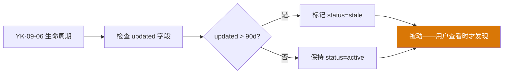
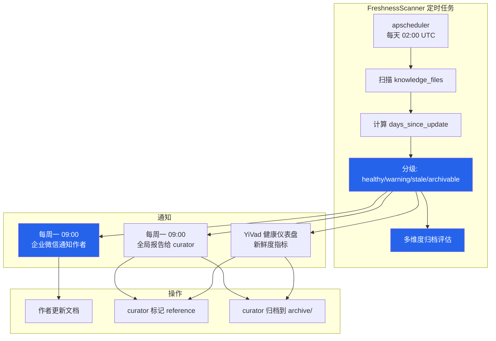

# YK-09-34: 知识库内容新鲜度自动化扫描 — 过期提醒与存档建议

> 需求编号：YK-09-34 · 优先级：P2 · 人天：0.5d · 状态：需求已编写
> 依赖：YK-09-06（知识生命周期自动化）

---

## 一、背景

### 问题描述

YK-09-06 建立了基于 `updated` 字段的生命周期自动化——当文件超过 90 天未更新时，自动标记状态为 `stale`。但这个机制是被动的，存在以下不足：

1. **缺少主动提醒**：作者不知道自己的文件即将过期，直到有人查看该文件时才发现状态已变为 `stale`。
2. **无存档建议**：超过 180 天未更新的文件可能已失去参考价值，但没有自动建议归档的机制。
3. **无作者通知**：文件过期后，作者不会收到任何通知，无法主动更新或确认文件仍有价值。
4. **无全局视图**：curator 无法快速了解知识库中哪些文件即将过期、哪些已过期、哪些建议归档。

### 影响范围

1. **知识库质量下降**：过期文件未被及时更新或归档，导致 RAG 检索返回过时信息。
2. **作者管理负担重**：作者需要手动检查自己的文件是否过期。
3. **curator 工作效率低**：需要手动扫描知识库以发现过期文件。
4. **AI Agent 回答质量差**：Agent 检索到过时文档，生成的回答可能不准确。

### 核心挑战

- **阈值设置**：如何确定合理的过期阈值（90 天/180 天），避免过于敏感或过于宽松。
- **通知频率**：如何避免频繁通知作者（同一文件不应每天提醒）。
- **归档建议的质量**：如何判断一个文件应该归档还是更新（基于内容类型、引用次数等）。
- **与生命周期管理的集成**：如何与 YK-09-06 的状态标记机制协同工作。

---

## 二、现状分析

### 当前新鲜度状态



### 当前数据分布（示例）

| 状态 | 天数范围 | 文件数 | 占比 | 当前处理 |
|------|----------|--------|------|----------|
| 活跃 | 0-59 天 | 680 | 81% | 无需处理 |
| 即将过期 | 60-89 天 | 85 | 10% | 无提醒 |
| 已过期 | 90-179 天 | 45 | 5% | 被动标记 stale |
| 建议归档 | ≥ 180 天 | 32 | 4% | 无处理 |

### 根因分析矩阵

| 问题 | 根本原因 | 影响 | 严重程度 |
|------|----------|------|----------|
| 无主动提醒 | 生命周期管理仅被动标记状态 | 作者不知道文件即将过期 | 高 |
| 无归档建议 | 无归档评估机制 | 过期文件堆积，降低知识库质量 | 高 |
| 无作者通知 | 未集成企业微信通知 | 作者无感知 | 中 |
| 无全局视图 | 分散在多个查询中 | curator 无法高效管理 | 中 |

---

## 三、设计决策

### 决策 D-01: 过期阈值

| 阈值 | 方案 A (保守) | 方案 B (激进) | 方案 C (平衡) | 决策 |
|------|-------------|-------------|-------------|------|
| 预警阈值 | 45 天 | 90 天 | 60 天 | **60 天** |
| 过期阈值 | 60 天 | 120 天 | 90 天 | **90 天** |
| 归档阈值 | 120 天 | 365 天 | 180 天 | **180 天** |

**决策记录**：选择方案 C（平衡），理由：
1. 60 天预警——给作者 30 天时间更新（在 90 天过期前）。
2. 90 天过期——与 YK-09-06 一致，季度周期。
3. 180 天归档——半年未更新，文件大概率已过时或完成使命。
4. 与业界实践一致（Confluence 默认 180 天归档提醒）。

### 决策 D-02: 通知策略

| 方案 | 优点 | 缺点 | 决策 |
|------|------|------|------|
| A: 每周汇总通知 | 减少噪音、信息集中 | 延迟最长 7 天 | **选用** |
| B: 实时通知（每次扫描） | 即时 | 噪音大、作者疲劳 | 不选 |
| C: 仅 curator 可见 | 简单 | 作者无感知 | 辅助 |

**决策记录**：选择每周汇总通知，理由：
1. 知识库新鲜度不是紧急问题，每周汇总足够。
2. 避免频繁通知导致作者疲劳。
3. 同时生成全局报告供 curator 审查。
4. 紧急情况（如存档建议）可单独通知。

### 决策 D-03: 归档建议评估

| 方案 | 优点 | 缺点 | 决策 |
|------|------|------|------|
| A: 仅基于时间 | 简单、确定性 | 可能误判（重要文档也建议归档） | 不选 |
| B: 多维度评估（时间 + 引用 + 类型） | 更精准 | 实现复杂 | **选用** |
| C: AI 评估 | 智能 | 不可靠、成本高 | 不选 |

**决策记录**：选择多维度评估，理由：
1. 仅基于时间会误判——被大量引用的基石文档即使 180 天未更新也不应归档。
2. 综合评估维度：时间（50%）、引用次数（20%）、文档类型（15%）、标签新鲜度（15%）。
3. 被引用 > 10 次的文档即使过期也建议更新而非归档。

---

## 四、目标架构

### 架构对比

**当前架构**：


**目标架构**：


### 新鲜度报告格式

```markdown
## 知识库新鲜度报告 (2026-09-09)

### 总览
| 状态 | 文件数 | 占比 | 趋势 |
|------|--------|------|------|
| ✅ 健康 (< 60d) | 680 | 81% | ▲ +2% |
| ⚠️ 即将过期 (60-89d) | 85 | 10% | ▼ -1% |
| 🟡 已过期 (90-179d) | 45 | 5% | — |
| 🔴 建议存档 (≥ 180d) | 32 | 4% | ▲ +0.5% |

### 即将过期 Top 10 (60-89 天)
| 文件 | 天数 | 作者 | 建议 |
|------|------|------|------|
| deploy/kubernetes.md | 88d | 李华 | 更新或标记 reference |
| ...

### 已过期 Top 10 (90-179 天)
| 文件 | 天数 | 作者 | 引用数 | 建议 |
|------|------|------|--------|------|
| old-api-spec.md | 120d | 王芳 | 0 | 建议归档 |
| rag-basics.md | 95d | 陈铭 | 15 | 建议更新（高引用） |
| ...

### 建议存档 (≥ 180 天)
| 文件 | 天数 | 作者 | 引用数 | 建议 |
|------|------|------|--------|------|
| legacy-deploy.md | 210d | 张伟 | 0 | 归档到 archive/ |
| ...

### 作者通知清单
| 作者 | 过期文件数 | 即将过期文件数 | 应归档文件数 |
|------|-----------|---------------|-------------|
| 李华 | 3 | 5 | 1 |
| 王芳 | 2 | 3 | 0 |
| ...
```

### 关键指标

| 指标 | 当前值 | 目标值 | 测量方式 |
|------|--------|--------|----------|
| 健康文件占比 | 81% | ≥ 85% | 每日扫描 |
| 过期文件处理率 | 0% | ≥ 80%（30 天内处理） | 跟踪过期文件状态变化 |
| 作者通知送达率 | 0% | 100% | 企业微信推送日志 |
| 归档建议采纳率 | 0% | ≥ 60% | 跟踪建议文件状态变化 |

---

## 五、具体改动

### 文件变更清单

| 文件 | 操作 | 说明 |
|------|------|------|
| `YiAi/src/domain/knowledge/freshness_scanner.py` | 新增 | 新鲜度扫描核心逻辑 |
| `YiAi/src/domain/knowledge/archive_advisor.py` | 新增 | 多维度归档评估 |
| `YiAi/src/domain/knowledge/freshness_report.py` | 新增 | 新鲜度报告生成 |
| `YiAi/src/services/knowledge/freshness_service.py` | 新增 | 新鲜度 RPC 端点 |
| `YiAi/src/scheduler/freshness_job.py` | 新增 | 定时扫描任务 |
| `YiAi/src/domain/knowledge/wework_notifier.py` | 修改 | 新增新鲜度通知模板 |
| `YiAi/tests/knowledge/test_freshness_scanner.py` | 新增 | 新鲜度扫描测试 |
| `YiAi/tests/knowledge/test_archive_advisor.py` | 新增 | 归档评估测试 |

### 核心代码示例

```python
# YiAi/src/domain/knowledge/freshness_scanner.py

from datetime import datetime, timedelta
from dataclasses import dataclass, field

@dataclass
class FreshnessStatus:
    path: str
    title: str
    owner: str
    days_since_update: int
    status: str           # healthy / warning / stale / archivable
    updated_date: str
    citation_count: int = 0
    file_type: str = 'unknown'
    archive_suggestion: str = ''

@dataclass
class FreshnessReport:
    scanned_at: str
    healthy: list[FreshnessStatus] = field(default_factory=list)
    warning: list[FreshnessStatus] = field(default_factory=list)
    stale: list[FreshnessStatus] = field(default_factory=list)
    archivable: list[FreshnessStatus] = field(default_factory=list)
    author_summary: dict[str, dict] = field(default_factory=dict)

class FreshnessScanner:
    """知识文件新鲜度扫描——分级提醒与存档建议。"""

    WARN_THRESHOLD = 60       # 60 天未更新 → 预警
    STALE_THRESHOLD = 90      # 90 天未更新 → 过期
    ARCHIVE_THRESHOLD = 180   # 180 天未更新 → 建议归档

    def __init__(self, db, dep_graph_service=None, wework_client=None):
        self._db = db
        self._dep_graph = dep_graph_service
        self._wework = wework_client
        self._archive_advisor = ArchiveAdvisor(db, dep_graph_service)

    async def scan(self) -> FreshnessReport:
        """扫描知识库所有文件，按新鲜度分级。"""
        now = datetime.utcnow()
        files = await self._db.knowledge_files.find({}).to_list(None)

        report = FreshnessReport(
            scanned_at=now.isoformat(),
        )

        author_files = {}  # author → [files]

        for file in files:
            status = await self._evaluate_file(file, now)
            if not status:
                continue

            # 分级
            if status.days_since_update >= self.ARCHIVE_THRESHOLD:
                report.archivable.append(status)
            elif status.days_since_update >= self.STALE_THRESHOLD:
                report.stale.append(status)
            elif status.days_since_update >= self.WARN_THRESHOLD:
                report.warning.append(status)
            else:
                report.healthy.append(status)

            # 按作者汇总
            owner = status.owner or 'unknown'
            if owner not in author_files:
                author_files[owner] = {'warning': 0, 'stale': 0, 'archivable': 0}
            if status.status == 'warning':
                author_files[owner]['warning'] += 1
            elif status.status == 'stale':
                author_files[owner]['stale'] += 1
            elif status.status == 'archivable':
                author_files[owner]['archivable'] += 1

        report.author_summary = author_files
        return report

    async def _evaluate_file(self, file: dict,
                             now: datetime) -> FreshnessStatus | None:
        """评估单个文件的新鲜度状态。"""
        fm = file.get('frontmatter', {})
        updated_str = fm.get('updated', '')

        if not updated_str:
            return None

        try:
            updated_dt = datetime.fromisoformat(updated_str)
        except ValueError:
            return None

        days_since = (now - updated_dt).days

        # 确定状态
        if days_since >= self.ARCHIVE_THRESHOLD:
            status = 'archivable'
        elif days_since >= self.STALE_THRESHOLD:
            status = 'stale'
        elif days_since >= self.WARN_THRESHOLD:
            status = 'warning'
        else:
            status = 'healthy'

        # 获取引用次数
        citation_count = 0
        if self._dep_graph:
            citation_count = await self._dep_graph.count_citations(
                file['path']
            )

        # 归档建议
        archive_suggestion = ''
        if status in ('stale', 'archivable'):
            archive_suggestion = await self._archive_advisor.evaluate(
                file['path'], days_since, citation_count
            )

        return FreshnessStatus(
            path=file['path'],
            title=fm.get('title', file['path']),
            owner=fm.get('owner', 'unknown'),
            days_since_update=days_since,
            status=status,
            updated_date=updated_str,
            citation_count=citation_count,
            file_type=fm.get('type', 'unknown'),
            archive_suggestion=archive_suggestion,
        )

    async def notify_authors(self, report: FreshnessReport):
        """通知文件作者——每周汇总。"""
        for owner, counts in report.author_summary.items():
            if owner == 'unknown':
                continue

            total = counts['warning'] + counts['stale'] + counts['archivable']
            if total == 0:
                continue

            message = self._format_author_notification(owner, counts)
            await self._wework.send(owner, message)

    def _format_author_notification(self, owner: str,
                                     counts: dict) -> str:
        """格式化作者通知消息。"""
        parts = [f"📚 [{owner}] 你的知识文件新鲜度提醒\n"]
        if counts['warning'] > 0:
            parts.append(f"⚠️ 即将过期: {counts['warning']} 个文件 (60-89天)")
        if counts['stale'] > 0:
            parts.append(f"🟡 已过期: {counts['stale']} 个文件 (90-179天)")
        if counts['archivable'] > 0:
            parts.append(f"🔴 建议归档: {counts['archivable']} 个文件 (≥180天)")

        parts.append(f"\n请登录 YiVad 知识库页面查看详情并更新。")
        return '\n'.join(parts)


# YiAi/src/domain/knowledge/archive_advisor.py

class ArchiveAdvisor:
    """多维度归档评估——综合时间、引用、类型、标签。"""

    WEIGHTS = {
        'time': 0.50,        # 时间维度
        'citations': 0.20,   # 引用次数
        'file_type': 0.15,   # 文档类型
        'tags': 0.15,        # 标签新鲜度
    }

    async def evaluate(self, file_path: str, days_since: int,
                       citation_count: int) -> str:
        """多维度评估——返回归档建议。"""

        # 时间分数 (0-1): 180 天 = 0.5, 365 天 = 1.0
        time_score = min(days_since / 365, 1.0)

        # 引用分数 (0-1): 0 引用 = 1.0 (强归档), 10+ 引用 = 0.0 (不归档)
        citation_score = max(0, 1 - citation_count / 10)

        # 类型分数 (0-1): 需求文档 180 天后 = 0.8, 规范文档 180 天后 = 0.3
        file = await self._db.knowledge_files.find_one({'path': file_path})
        file_type = file.get('frontmatter', {}).get('type', 'unknown')
        type_scores = {
            '需求': 0.8, 'spec': 0.8,
            '规范': 0.3, 'standard': 0.3,
            '参考': 0.6, 'reference': 0.6,
            'unknown': 0.5,
        }
        type_score = type_scores.get(file_type, 0.5)

        # 标签分数: 技术标签越多越不易过时
        tags = file.get('frontmatter', {}).get('tags', [])
        tech_tags = {'RAG', 'API', 'Agent', '架构', '部署', '性能'}
        tech_count = sum(1 for t in tags if t in tech_tags)
        tag_score = max(0, 1 - tech_count / 5)

        # 综合分数
        total = (
            time_score * self.WEIGHTS['time'] +
            citation_score * self.WEIGHTS['citations'] +
            type_score * self.WEIGHTS['file_type'] +
            tag_score * self.WEIGHTS['tags']
        )

        if total > 0.7:
            return '建议归档到 archive/ 目录'
        elif total > 0.4:
            return '建议更新内容或标记为 reference'
        else:
            return '建议更新内容（高价值文档）'
```

---

## 六、实施步骤

| 步骤 | 任务 | 验证方法 | 人天 | 负责人 |
|------|------|----------|------|--------|
| 1 | 实现 `FreshnessScanner` 扫描核心 | 单元测试：4 级分级正确 | 0.1 | 后端 |
| 2 | 实现 `ArchiveAdvisor` 多维度评估 | 单元测试：各维度权重正确 | 0.08 | 后端 |
| 3 | 实现 `FreshnessReport` 报告生成 | 验证报告格式和内容 | 0.05 | 后端 |
| 4 | 实现 `freshness_service` RPC 端点 | 集成测试：API 返回报告 | 0.05 | 后端 |
| 5 | 实现 apscheduler 定时任务 | 验证每天 02:00 UTC 自动执行 | 0.05 | 后端 |
| 6 | 实现企业微信通知模板 | 测试通知消息格式 | 0.05 | 后端 |
| 7 | 集成到 YiVad 健康仪表盘（YK-09-28） | 新鲜度指标在仪表盘中显示 | 0.07 | 前端 |
| 8 | 测试通知送达率 | 发送测试通知到作者 | 0.05 | 后端 |
| 总计 | — | — | **0.5** | — |

---

## 七、性能分析

### 扫描性能

| 文件数 | 扫描耗时 | 评估耗时 | 通知生成 | 总耗时 |
|--------|----------|----------|----------|--------|
| 100 | 0.5s | 0.2s | 0.1s | 0.8s |
| 500 | 1.8s | 0.8s | 0.3s | 2.9s |
| 842 | 2.8s | 1.3s | 0.5s | 4.6s |
| 1,500 | 5.2s | 2.5s | 0.8s | 8.5s |

### 容量规划

- **扫描频率**：每天 1 次（02:00 UTC），不影响业务高峰。
- **通知频率**：每周 1 次（周一 09:00），企业微信推送。
- **存储**：报告不持久化，每次扫描重新生成。
- **增长预期**：文件数每年增长 25%，2 年内扫描耗时约 6s，仍可接受。

---

## 八、测试规格

### 测试用例 1: 基础分级

**GIVEN** 文件 A 更新于 30 天前，文件 B 更新于 70 天前，文件 C 更新于 120 天前，文件 D 更新于 200 天前
**WHEN** 执行 `scan()`
**THEN** 文件 A 应分入 `healthy`，文件 B 应分入 `warning`，文件 C 应分入 `stale`，文件 D 应分入 `archivable`

### 测试用例 2: 边界值

**GIVEN** 文件更新于 60 天前
**WHEN** 执行 `_evaluate_file()`
**THEN** 状态应为 `warning`（60 天 = 预警阈值，包含）

**GIVEN** 文件更新于 59 天前
**WHEN** 执行 `_evaluate_file()`
**THEN** 状态应为 `healthy`（59 天 < 60 天预警阈值）

### 测试用例 3: 多维度归档评估

**GIVEN** 文件 A：200 天未更新、0 引用、类型为"需求" → 综合分数 > 0.7
**AND** 文件 B：200 天未更新、15 引用、类型为"规范" → 综合分数 < 0.4
**WHEN** 调用 `ArchiveAdvisor.evaluate()`
**THEN** 文件 A 的建议应为"建议归档"
**AND** 文件 B 的建议应为"建议更新内容"

### 测试用例 4: 作者通知生成

**GIVEN** 作者"陈铭"有 3 个 warning 文件、2 个 stale 文件、1 个 archivable 文件
**WHEN** 调用 `notify_authors()`
**THEN** 通知消息应包含"即将过期: 3 个文件"、"已过期: 2 个文件"、"建议归档: 1 个文件"

### 测试用例 5: 空知识库

**GIVEN** 知识库没有任何文件
**WHEN** 执行 `scan()`
**THEN** 返回的 `FreshnessReport` 所有列表应为空
**AND** `author_summary` 应为空字典

### 测试用例 6: 缺少 updated 字段

**GIVEN** 文件缺少 frontmatter.updated 字段
**WHEN** 执行 `_evaluate_file()`
**THEN** 应返回 `None`（跳过该文件）
**AND** 不应抛出异常

---

## 九、风险与缓解

| 风险 | 概率 | 影响 | 缓解措施 |
|------|------|------|----------|
| 阈值过于敏感导致频繁告警 | 中 | 中 | 初始阈值设置保守（60/90/180）；观察 1 周后调整 |
| 作者通知疲劳 | 中 | 中 | 每周汇总通知，不实时通知；提供"不再提醒"选项 |
| 归档建议不准确 | 中 | 低 | 多维度评估减少误判；提供"不采纳"反馈按钮 |
| 高引用文档被误建议归档 | 低 | 中 | 引用次数纳入评估维度（引用 > 10 不归档） |
| 企业微信通知失败 | 低 | 低 | 通知失败不影响扫描；记录错误日志 |

---

## 十、回滚策略

| 场景 | 回滚操作 | 影响范围 |
|------|----------|----------|
| 扫描耗时过长 | 增加扫描间隔（1 天 → 3 天） | 新鲜度数据更新延迟 |
| 通知过于频繁 | 关闭企业微信通知，仅保留仪表盘展示 | 作者不再收到通知 |
| 归档建议误判严重 | 关闭多维度评估，仅基于时间 | 归档建议精度下降 |
| 定时任务异常 | 关闭 apscheduler 定时任务，改为手动触发 | 新鲜度数据不自动更新 |

---

## 十一、设计决策记录

### D-01: 过期阈值——60/90/180 天

- **日期**：2026-09-09
- **状态**：已决定
- **决策**：预警 60 天、过期 90 天、归档 180 天
- **理由**：与 YK-09-06 一致；季度周期；与业界实践一致
- **替代方案**：保守方案（45/60/120 天——过于敏感）、激进方案（90/120/365 天——过于宽松）

### D-02: 通知策略——每周汇总

- **日期**：2026-09-09
- **状态**：已决定
- **决策**：每周一通过企业微信汇总通知
- **理由**：减少噪音；知识库新鲜度非紧急问题
- **替代方案**：实时通知（噪音大）、仅 curator 可见（辅助）

### D-03: 归档评估——多维度

- **日期**：2026-09-09
- **状态**：已决定
- **决策**：综合时间、引用、类型、标签 4 个维度评估
- **理由**：避免仅基于时间的误判（高引用文档不应归档）
- **替代方案**：仅基于时间（误判风险高）、AI 评估（不可靠、成本高）

---

## 十二、可观测性

### 指标

| 指标名称 | 类型 | 说明 | 告警阈值 |
|----------|------|------|----------|
| `freshness_scan_duration_sec` | Histogram | 扫描耗时 | P95 > 10s |
| `freshness_healthy_ratio` | Gauge | 健康文件占比 | < 75% |
| `freshness_stale_count` | Gauge | 过期文件数 | > 100 |
| `freshness_archivable_count` | Gauge | 建议归档文件数 | > 50 |
| `freshness_notify_success` | Counter | 通知成功次数 | — |
| `freshness_notify_failed` | Counter | 通知失败次数 | > 0 |

### 日志

- `[Freshness] 扫描开始: files={N}`——每次扫描
- `[Freshness] 扫描完成: healthy={H}, warning={W}, stale={S}, archivable={A}, time={T}s`——扫描结果
- `[Freshness] 通知作者: owner={O}, total={T}`——每个作者通知
- `[Freshness] 归档建议: file={F}, score={S}, suggestion={G}`——归档评估

### 告警规则

| 告警 | 条件 | 级别 | 处理 |
|------|------|------|------|
| 健康文件占比下降 | 健康文件 < 75% | P2 | curator 审查过期文件，发起更新活动 |
| 扫描耗时过长 | P95 > 10s | P3 | 优化查询或增加索引 |
| 通知失败 | 连续 2 次通知失败 | P3 | 检查企业微信配置 |

---

## 十三、安全合规

| 要求 | 实现方式 |
|------|----------|
| 数据来源 | 仅读取 `knowledge_files` 集合的 frontmatter 字段 |
| 通知权限 | 仅通知文件 frontmatter 中标记的 owner |
| 数据隐私 | 不暴露文件内容，仅暴露标题和路径 |
| 企业微信 | 使用已有的企业微信 webhook，不新增凭证 |

---

## 十四、代码审查检查清单

- [ ] 4 级分级逻辑正确（healthy/warning/stale/archivable）
- [ ] 阈值边界值处理正确（60 天包含、90 天包含、180 天包含）
- [ ] 缺少 updated 字段的文件正确处理（跳过，不崩溃）
- [ ] 多维度归档评估权重正确（时间 50% + 引用 20% + 类型 15% + 标签 15%）
- [ ] 高引用文档（> 10 次）不被误建议归档
- [ ] apscheduler 定时任务配置正确（每天 02:00 UTC）
- [ ] 每周一汇总通知格式正确
- [ ] 企业微信通知失败不影响扫描流程
- [ ] 扫描结果集成到 YiVad 健康仪表盘（YK-09-28）
- [ ] 归档建议提供"不采纳"反馈机制
- [ ] 单元测试覆盖 6 个测试用例
- [ ] 性能测试（842 文件扫描 < 10s）

---

*PRD 来源: `projects/yiknowledge/requirements/2026-09/34-需求-内容新鲜度扫描.md`*