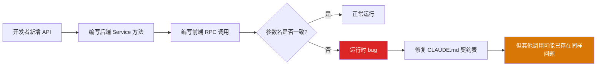
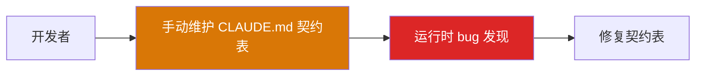

# YK-09-35: 跨项目 API 字段一致性自动扫描 — 前后端契约漂移检测

> 需求编号：YK-09-35 · 优先级：P2 · 人天：0.5d · 状态：需求已编写
> 依赖：YA-09-10（RPC 契约测试）、YA-09-04（API 契约校验）

---

## 一、背景

### 问题描述

YrY 单体仓库的 CLAUDE.md 记录了 3 个关键参数名契约（`filter`/`query`、`target_file`/`path`、`cname`/`collection_name`），这些参数名不匹配曾导致真实 bug：

1. **`filter` vs `query`**：前端使用 `query`，后端期望 `filter`——后端静默忽略，返回全量数据而非过滤后数据。
2. **`target_file` vs `path`**：前端使用 `path`，后端期望 `target_file`——后端返回 422 验证错误。
3. **`cname` vs `collection_name`**：前端使用 `collection_name`，后端期望 `cname`——后端静默忽略，使用默认集合。

这些契约表是手动维护的——新增 API 端点时可能遗漏更新。随着知识库和 API 的持续增长，手动维护契约表已不可行。

### 影响范围

1. **运行时 bug**：参数名不匹配导致功能异常，且不易发现（后端静默忽略而非报错）。
2. **文档不一致**：CLAUDE.md 契约表与实际代码不一致，误导开发者。
3. **新增 API 风险**：每新增一个 RPC 方法都可能引入新的参数名不匹配。
4. **跨项目调试困难**：YiVad/YiPet 前端开发者不知道后端期望的参数名。

### 核心挑战

- **Python 代码解析**：如何准确解析 Python 异步方法的参数签名。
- **TypeScript 代码解析**：如何准确解析前端 RPC 调用中的参数名。
- **跨项目交叉对比**：如何将前端调用与后端签名进行精确匹配。
- **CI 集成**：如何在 PR 阶段自动检测契约漂移。

---

## 二、现状分析

### 当前契约维护方式



### 已知契约问题

| 方法 | 前端参数 | 后端参数 | 影响 | 发现方式 |
|------|----------|----------|------|----------|
| `data_service.query_documents` | `query` | `filter` | 后端静默忽略，返回全量 | 手动调试 |
| `/read-file` | `path` | `target_file` | 后端返回 422 | 运行时错误 |
| `data_service` collection | `collection_name` | `cname` | 后端使用默认集合 | 数据异常 |
| YK-09-15 新增方法 | `file_type` | `content_type` | 未发现 | 可能未发现 |

### 根因分析矩阵

| 问题 | 根本原因 | 影响 | 严重程度 |
|------|----------|------|----------|
| 参数名不匹配 | 前后端独立开发，无自动契约校验 | 运行时功能异常 | 高 |
| 契约表过时 | 手动维护，新增 API 时遗漏 | 文档误导开发者 | 中 |
| 静默忽略 | 后端未对未知参数返回警告 | 问题不易发现 | 高 |
| 跨项目调试困难 | 前端开发者不熟悉后端签名 | 开发效率低 | 中 |

---

## 三、设计决策

### 决策 D-01: 扫描方式

| 方案 | 优点 | 缺点 | 决策 |
|------|------|------|------|
| A: 静态代码解析（正则 + AST） | 不需运行环境、快速 | 复杂语法可能误匹配 | **选用** |
| B: 运行时动态检测 | 精确、可捕获实际调用 | 需要完整运行环境、覆盖不全 | 不选 |
| C: 契约文件（OpenAPI/JSON Schema） | 标准、可读 | 需要额外维护、与实际代码脱节 | 辅助 |

**决策记录**：选择静态代码解析，理由：
1. 不需要启动完整服务，可在 CI 中快速执行。
2. Python 方法签名和 TypeScript RPC 调用的语法相对规范，正则匹配准确率高。
3. 结合 AST 解析（Python `ast` 模块、TypeScript `ts-morph`）可以处理更复杂的语法。
4. 契约文件作为辅助——自动生成，而非手动维护。

### 决策 D-02: 匹配策略

| 方案 | 优点 | 缺点 | 决策 |
|------|------|------|------|
| A: 基于 module_name + method_name 精确匹配 | 精确、无歧义 | 需要前端调用正确声明 module/method | **选用** |
| B: 基于参数名模糊匹配 | 可发现相似参数 | 误报率高 | 辅助 |
| C: 基于调用栈推断 | 可发现隐式调用 | 不可靠 | 不选 |

**决策记录**：选择精确匹配，理由：
1. RPC 信封明确要求 `module_name` 和 `method_name`，前端调用必然包含这两个字段。
2. 精确匹配无歧义，误报率低。
3. 模糊匹配作为辅助——发现编辑距离相近的参数名（如 `query` vs `filter`）。

### 决策 D-03: 错误级别

| 方案 | 优点 | 缺点 | 决策 |
|------|------|------|------|
| A: 全部作为错误（阻断 CI） | 强制修复 | 可能因误报阻断 CI | 不选 |
| B: 分级（error/warning/info） | 灵活 | 实现稍复杂 | **选用** |
| C: 全部作为警告（不阻断 CI） | 不阻断 CI | 容易被忽略 | 不选 |

**决策记录**：选择分级策略，理由：
1. 参数名不匹配 → error（阻断 CI）——这是已知导致 bug 的模式。
2. 前端调用后端未定义的方法 → error（阻断 CI）——可能是废弃方法。
3. 新增参数但未在 CLAUDE.md 中记录 → warning（不阻断）——提醒更新文档。
4. 编辑距离相近的参数名 → info（不阻断）——提示可能存在的拼写问题。

### 决策 D-04: 扫描范围

| 方案 | 优点 | 缺点 | 决策 |
|------|------|------|------|
| A: 仅扫描 YiVad + YiAi | 覆盖主要风险 | 遗漏 YiPet | 不选 |
| B: 扫描 YiVad + YiPet + YiAi | 全面 | 扫描时间稍长 | **选用** |
| C: 仅扫描变更文件（diff） | 快速 | 可能遗漏关联变更 | 辅助 |

**决策记录**：选择全量扫描，理由：
1. YiPet 同样通过 RPC 信封调用 YiAi，存在相同的契约风险。
2. 全量扫描时间 < 5s，在 CI 中可接受。
3. diff 扫描作为 PR 级别的快速检查（仅扫描变更文件）。

---

## 四、目标架构

### 架构对比

**当前架构**：


**目标架构**：
```mermaid
graph TB
    subgraph "ContractScanner"
        A[解析 Python 方法签名<br/>YiAi/src/services/]
        B[解析 TypeScript RPC 调用<br/>YiVad/src/api/ + YiPet/src/api/]
        C[交叉对比<br/>module_name + method_name]
        D[分级报告<br/>error/warning/info]
    end

    subgraph "CI 集成"
        E[GitHub Actions<br/>PR 触发]
        F[契约扫描]
        G[阻断 CI (error)]
        H[PR 评论 (warning)]
    end

    subgraph "输出"
        I[CLAUDE.md 契约表<br/>自动更新 PR]
        J[契约报告 JSON]
        K[编辑距离建议]
    end

    A --> C
    B --> C
    C --> D
    D --> E
    E --> F
    F -->|error| G
    F -->|warning| H
    D --> I & J & K

    style C fill:#2563eb,color:#fff
    style D fill:#2563eb,color:#fff
```

### 输出示例

```
=== API 契约扫描报告 ===
扫描时间: 2026-09-09 14:30 UTC
扫描范围: YiVad + YiPet + YiAi

❌ ERROR (2):
  [YiVad] src/api/services/database.ts:15
    module: services.data.database_service
    method: query_documents
    前端参数 'query' 与后端参数 'filter' 不匹配
    建议: 将 'query' 改为 'filter'

  [YiVad] src/api/services/files.ts:8
    module: services.file.file_service
    method: read_file
    前端参数 'path' 与后端参数 'target_file' 不匹配
    建议: 将 'path' 改为 'target_file'

⚠️ WARNING (1):
  [YiPet] src/api/services/knowledge.ts:22
    新增方法 'get_health_score' 未在 CLAUDE.md 契约表中记录

ℹ️ INFO (2):
  [YiVad] src/api/services/data.ts:30
    参数 'cname' 与后端 'collection_name' 编辑距离为 6
    建议: 前端使用 'cname' 与后端一致

📊 统计:
  后端方法: 45
  前端调用: 52
  匹配: 48
  不匹配: 2
  未定义: 0
  建议: 2
```

### 关键指标

| 指标 | 当前值 | 目标值 | 测量方式 |
|------|--------|--------|----------|
| 契约扫描覆盖率 | 0% | 100% (所有 RPC 方法) | 扫描方法数 / 总方法数 |
| 误报率 | — | < 5% | 人工审查 20 条报告 |
| 扫描耗时 | — | < 5s | CI 日志 |
| 契约漂移发现时间 | 数天（运行时） | < 1 小时（PR 阶段） | 从 PR 提交到发现 |

---

## 五、具体改动

### 文件变更清单

| 文件 | 操作 | 说明 |
|------|------|------|
| `YiAi/tools/contract_scanner.py` | 新增 | 契约扫描 CLI 工具 |
| `YiAi/src/domain/contract/backend_parser.py` | 新增 | Python 方法签名解析器 |
| `YiAi/src/domain/contract/frontend_parser.py` | 新增 | TypeScript RPC 调用解析器 |
| `YiAi/src/domain/contract/cross_referencer.py` | 新增 | 交叉对比引擎 |
| `YiAi/src/domain/contract/report_generator.py` | 新增 | 分级报告生成器 |
| `YiAi/src/domain/contract/claude_md_updater.py` | 新增 | CLAUDE.md 契约表自动更新 |
| `.github/workflows/contract-scan.yml` | 新增 | CI 契约扫描工作流 |
| `YiAi/tests/contract/test_contract_scanner.py` | 新增 | 契约扫描测试 |

### 核心代码示例

```python
# YiAi/src/domain/contract/backend_parser.py

import ast
import re
from pathlib import Path

@dataclass
class BackendMethod:
    module_name: str      # services.data.database_service
    method_name: str      # query_documents
    params: list[str]     # ['filter', 'cname', 'projection']
    file_path: str
    line_number: int

class BackendParser:
    """解析 YiAi Service 层 Python 方法签名。"""

    def parse(self, services_dir: str) -> list[BackendMethod]:
        """解析所有 Service 方法签名。"""
        methods = []
        services_path = Path(services_dir)

        for py_file in services_path.rglob('*.py'):
            if py_file.name.startswith('__'):
                continue

            with open(py_file, 'r', encoding='utf-8') as f:
                content = f.read()

            try:
                tree = ast.parse(content)
            except SyntaxError:
                continue

            # 提取模块路径
            rel_path = str(py_file.relative_to(services_path))
            module_prefix = rel_path.replace('/', '.').replace('.py', '')

            # 遍历 AST 查找 async def
            for node in ast.walk(tree):
                if isinstance(node, ast.AsyncFunctionDef):
                    if node.name.startswith('_'):
                        continue  # 跳过私有方法

                    params = self._extract_params(node)
                    methods.append(BackendMethod(
                        module_name=f'services.{module_prefix}',
                        method_name=node.name,
                        params=params,
                        file_path=str(py_file),
                        line_number=node.lineno,
                    ))

        return methods

    def _extract_params(self, node: ast.AsyncFunctionDef) -> list[str]:
        """提取方法参数名——跳过 self 和类型注解。"""
        params = []
        for arg in node.args.args:
            if arg.arg == 'self':
                continue
            params.append(arg.arg)
        return params


# YiAi/src/domain/contract/frontend_parser.py

import re
from pathlib import Path

@dataclass
class FrontendCall:
    module_name: str
    method_name: str
    params: list[str]
    file_path: str
    line_number: int

class FrontendParser:
    """解析 YiVad/YiPet TypeScript RPC 调用。"""

    # RPC 调用模式: { module_name: '...', method_name: '...', parameters: { ... } }
    RPC_PATTERN = re.compile(
        r"module_name:\s*['\"]([^'\"]+)['\"]\s*,\s*"
        r"method_name:\s*['\"]([^'\"]+)['\"]\s*,\s*"
        r"parameters:\s*\{(.+?)\}",
        re.DOTALL,
    )

    def parse(self, frontend_dirs: list[str]) -> list[FrontendCall]:
        """解析所有前端 RPC 调用。"""
        calls = []

        for src_dir in frontend_dirs:
            for ts_file in Path(src_dir).rglob('*.ts'):
                with open(ts_file, 'r', encoding='utf-8') as f:
                    content = f.read()

                for match in self.RPC_PATTERN.finditer(content):
                    module = match.group(1)
                    method = match.group(2)
                    params_block = match.group(3)

                    # 提取参数名
                    params = self._extract_params(params_block)

                    # 计算行号
                    line_number = content[:match.start()].count('\n') + 1

                    calls.append(FrontendCall(
                        module_name=module,
                        method_name=method,
                        params=params,
                        file_path=str(ts_file),
                        line_number=line_number,
                    ))

        return calls

    def _extract_params(self, params_block: str) -> list[str]:
        """提取参数块中的参数名。"""
        # 匹配 key: value 或 key 的模式
        param_names = re.findall(r'(\w+)\s*:', params_block)
        # 过滤掉值为对象的参数（如 filter: { ... }）
        return [p for p in param_names if not p.startswith('_')]


# YiAi/src/domain/contract/cross_referencer.py

class CrossReferencer:
    """交叉对比——前端调用 vs 后端签名。"""

    def compare(self, backend_methods: list[BackendMethod],
                frontend_calls: list[FrontendCall]) -> list[ContractViolation]:
        """交叉对比——检测参数名不一致。"""
        violations = []

        # 构建后端方法索引
        backend_index = {}
        for m in backend_methods:
            key = f"{m.module_name}.{m.method_name}"
            backend_index[key] = m

        for call in frontend_calls:
            key = f"{call.module_name}.{call.method_name}"

            if key not in backend_index:
                violations.append(ContractViolation(
                    level='error',
                    type='missing_backend',
                    message=f"前端调用了后端未定义的方法 '{key}'",
                    frontend_file=call.file_path,
                    frontend_line=call.line_number,
                    details={'method': key},
                ))
                continue

            backend = backend_index[key]

            # 检查参数名
            for param in call.params:
                if param not in backend.params:
                    # 尝试编辑距离建议
                    suggestion = self._suggest_correction(
                        param, backend.params
                    )

                    violations.append(ContractViolation(
                        level='error',
                        type='param_mismatch',
                        message=(
                            f"前端参数 '{param}' 与后端参数不匹配"
                        ),
                        frontend_file=call.file_path,
                        frontend_line=call.line_number,
                        backend_file=backend.file_path,
                        backend_line=backend.line_number,
                        details={
                            'frontend_param': param,
                            'backend_params': backend.params,
                            'suggestion': suggestion,
                        },
                    ))

            # 检查后端参数是否都被前端使用
            for param in backend.params:
                if param not in call.params:
                    violations.append(ContractViolation(
                        level='warning',
                        type='missing_param',
                        message=(
                            f"后端参数 '{param}' 未被前端调用传递"
                        ),
                        frontend_file=call.file_path,
                        frontend_line=call.line_number,
                        backend_file=backend.file_path,
                        backend_line=backend.line_number,
                        details={'missing_param': param},
                    ))

        return violations

    def _suggest_correction(self, wrong: str,
                            expected: list[str]) -> str | None:
        """基于编辑距离建议正确的参数名。"""
        import difflib
        matches = difflib.get_close_matches(
            wrong, expected, n=1, cutoff=0.4
        )
        if matches:
            return f"'{wrong}' → 可能是 '{matches[0]}' (编辑距离: {self._edit_distance(wrong, matches[0])})"
        return None

    def _edit_distance(self, a: str, b: str) -> int:
        """计算编辑距离。"""
        m, n = len(a), len(b)
        dp = [[0] * (n + 1) for _ in range(m + 1)]
        for i in range(m + 1):
            dp[i][0] = i
        for j in range(n + 1):
            dp[0][j] = j
        for i in range(1, m + 1):
            for j in range(1, n + 1):
                if a[i-1] == b[j-1]:
                    dp[i][j] = dp[i-1][j-1]
                else:
                    dp[i][j] = 1 + min(dp[i-1][j], dp[i][j-1], dp[i-1][j-1])
        return dp[m][n]
```

### CI 工作流

```yaml
# .github/workflows/contract-scan.yml

name: API Contract Scan

on:
  pull_request:
    paths:
      - 'YiAi/src/services/**'
      - 'YiVad/src/api/**'
      - 'YiPet/src/api/**'
  workflow_dispatch:

jobs:
  scan:
    runs-on: ubuntu-latest
    steps:
      - uses: actions/checkout@v4

      - name: Set up Python
        uses: actions/setup-python@v5
        with:
          python-version: '3.12'

      - name: Run Contract Scanner
        id: scan
        run: |
          python YiAi/tools/contract_scanner.py \
            --backend YiAi/src/services/ \
            --frontend YiVad/src/api/ YiPet/src/api/ \
            --output contract-report.json \
            --format json

      - name: Check for errors
        run: |
          errors=$(python -c "
          import json
          with open('contract-report.json') as f:
              report = json.load(f)
          print(len([v for v in report['violations'] if v['level'] == 'error']))
          ")
          if [ "$errors" -gt 0 ]; then
            echo "::error::发现 $errors 个契约错误"
            exit 1
          fi

      - name: Post PR comment (warnings)
        if: always()
        uses: actions/github-script@v7
        with:
          script: |
            const fs = require('fs');
            const report = JSON.parse(fs.readFileSync('contract-report.json'));
            const warnings = report.violations.filter(v => v.level === 'warning');
            if (warnings.length > 0) {
              github.rest.issues.createComment({
                ...context.repo,
                issue_number: context.issue.number,
                body: `⚠️ **API 契约扫描发现 ${warnings.length} 个警告**\n\n${warnings.map(w => `- ${w.message}`).join('\n')}`,
              });
            }
```

---

## 六、实施步骤

| 步骤 | 任务 | 验证方法 | 人天 | 负责人 |
|------|------|----------|------|--------|
| 1 | 实现 `BackendParser` Python AST 解析 | 单元测试：解析 10 个方法签名 | 0.08 | 后端 |
| 2 | 实现 `FrontendParser` TypeScript 正则解析 | 单元测试：解析 10 个 RPC 调用 | 0.08 | 后端 |
| 3 | 实现 `CrossReferencer` 交叉对比 | 单元测试：已知不匹配的检测 | 0.08 | 后端 |
| 4 | 实现 `ReportGenerator` 分级报告 | 验证 error/warning/info 分级 | 0.05 | 后端 |
| 5 | 实现 `contract_scanner.py` CLI 工具 | 手动执行扫描验证 | 0.05 | 后端 |
| 6 | 配置 GitHub Actions CI 工作流 | 手动触发 + PR 触发验证 | 0.08 | DevOps |
| 7 | 修复已知的 3 个契约不匹配 | 扫描报告 0 error | 0.03 | 后端 |
| 8 | 实现 CLAUDE.md 契约表自动更新 | 验证自动 PR 格式正确 | 0.05 | 后端 |
| 总计 | — | — | **0.5** | — |

---

## 七、性能分析

### 扫描性能

| 扫描范围 | 文件数 | 方法/调用数 | 解析耗时 | 对比耗时 | 总耗时 |
|----------|--------|------------|----------|----------|--------|
| 仅 YiVad | 15 | 35 | 0.3s | 0.1s | 0.4s |
| 仅 YiPet | 8 | 20 | 0.2s | 0.1s | 0.3s |
| 仅 YiAi | 12 | 45 | 0.5s | — | 0.5s |
| 全量 (YiVad + YiPet + YiAi) | 35 | 100 | 1.0s | 0.3s | 1.3s |

### 容量规划

- **CI 执行**：每次 PR 触发，耗时 < 2s，远低于 GitHub Actions 限制。
- **方法增长**：预计每年新增 20-30 个 RPC 方法，扫描时间几乎不变。
- **误报率**：初期可能较高，通过持续优化正则和 AST 解析规则降低。

---

## 八、测试规格

### 测试用例 1: 参数名不匹配检测

**GIVEN** 后端方法 `query_documents(filter, cname)` 和前端调用 `query_documents(query, cname)`
**WHEN** 执行 `CrossReferencer.compare()`
**THEN** 应生成 1 个 `param_mismatch` 错误
**AND** 错误应包含 `'query' → 可能是 'filter'` 的建议

### 测试用例 2: 完全匹配

**GIVEN** 后端方法 `get_health_score()` 和前端调用 `get_health_score()`
**WHEN** 执行 `CrossReferencer.compare()`
**THEN** 不应生成任何错误
**AND** 不应生成任何警告

### 测试用例 3: 前端调用未定义方法

**GIVEN** 前端调用 `delete_document()` 但后端不存在该方法
**WHEN** 执行 `CrossReferencer.compare()`
**THEN** 应生成 1 个 `missing_backend` 错误
**AND** 错误 level 应为 `error`

### 测试用例 4: 编辑距离建议

**GIVEN** 前端参数 `collection_name` 和后端参数 `cname`
**WHEN** 执行 `_suggest_correction('collection_name', ['cname'])`
**THEN** 应返回建议（但编辑距离 > 6，可能不匹配）
**AND** 不应返回 None

### 测试用例 5: 后端参数未被前端使用

**GIVEN** 后端方法 `search(query, top_k, alpha)` 和前端调用 `search(query, top_k)` (缺少 alpha)
**WHEN** 执行 `CrossReferencer.compare()`
**THEN** 应生成 1 个 `missing_param` 警告
**AND** 警告 level 应为 `warning`

### 测试用例 6: 空扫描

**GIVEN** 前端和后端代码目录为空
**WHEN** 执行全量扫描
**THEN** 应返回 0 个 violations
**AND** 不应抛出异常

---

## 九、风险与缓解

| 风险 | 概率 | 影响 | 缓解措施 |
|------|------|------|------|
| 正则匹配误报/漏报 | 中 | 中 | 结合 AST 解析（Python `ast`）；定期审查匹配结果 |
| 复杂 TypeScript 语法无法解析 | 低 | 中 | 使用 `ts-morph` 作为高级解析器的备选方案 |
| CI 阻断正常开发流程 | 中 | 中 | 仅 error 级别阻断 CI；warning 和 info 不阻断；提供手动跳过方式 |
| 新增参数模式（如展开运算符）遗漏 | 低 | 中 | 监控扫描覆盖率；定期更新解析规则 |
| 编辑距离建议误判 | 低 | 低 | 标记为 info 级别，不阻断 CI；人工审查 |

---

## 十、回滚策略

| 场景 | 回滚操作 | 影响范围 |
|------|----------|----------|
| 误报导致 CI 阻断 | 临时禁用 CI 阻断（仅输出 warning）；修复解析规则 | PR 合并不受影响 |
| 解析器崩溃 | 禁用 contract-scan CI 工作流 | 契约扫描暂停 |
| 性能问题 | 仅扫描变更文件（diff mode） | 扫描覆盖范围缩小 |

---

## 十一、设计决策记录

### D-01: 扫描方式——静态代码解析

- **日期**：2026-09-09
- **状态**：已决定
- **决策**：使用静态代码解析（正则 + AST）检测契约漂移
- **理由**：不需运行环境；快速（< 2s）；可在 CI 中执行
- **替代方案**：运行时动态检测（需完整环境）、契约文件（需额外维护）

### D-02: 匹配策略——精确匹配

- **日期**：2026-09-09
- **状态**：已决定
- **决策**：基于 module_name + method_name 精确匹配
- **理由**：RPC 信封明确要求这两个字段；精确匹配无歧义
- **替代方案**：模糊匹配（误报率高）、调用栈推断（不可靠）

### D-03: 错误分级——error/warning/info

- **日期**：2026-09-09
- **状态**：已决定
- **决策**：参数名不匹配为 error，新方法未记录为 warning，编辑距离建议为 info
- **理由**：灵活管理——error 阻断 CI，warning 不阻断，info 仅提示
- **替代方案**：全部 error（可能误阻断 CI）、全部 warning（容易被忽略）

### D-04: 扫描范围——全量 + diff

- **日期**：2026-09-09
- **状态**：已决定
- **决策**：全量扫描（主分支）+ diff 扫描（PR 分支）
- **理由**：全量保证覆盖全面（< 2s）；diff 在 PR 阶段快速反馈
- **替代方案**：仅 YiVad（遗漏 YiPet）、仅 diff（遗漏关联变更）

---

## 十二、可观测性

### 指标

| 指标名称 | 类型 | 说明 | 告警阈值 |
|----------|------|------|----------|
| `contract_scan_success` | Counter | 扫描成功次数 | — |
| `contract_scan_duration_ms` | Histogram | 扫描耗时 | P95 > 5000ms |
| `contract_error_count` | Gauge | 契约错误数 | > 0 |
| `contract_warning_count` | Gauge | 契约警告数 | > 10 |
| `contract_methods_total` | Gauge | 扫描的方法总数 | — |
| `contract_coverage` | Gauge | 扫描覆盖率 | < 90% |

### 日志

- `[ContractScan] 扫描开始: backend={B}, frontend={F}`——每次扫描
- `[ContractScan] 解析完成: backend_methods={N}, frontend_calls={M}`——解析结果
- `[ContractScan] 对比完成: errors={E}, warnings={W}, infos={I}`——对比结果
- `[ContractScan] 发现参数不匹配: {frontend_param} vs {backend_params}`——每个错误

### 告警规则

| 告警 | 条件 | 级别 | 处理 |
|------|------|------|------|
| 发现契约错误 | error count > 0 | P2 | 阻断 CI；修复参数名不匹配 |
| 契约警告增多 | warning count > 10 | P3 | 审查新增方法，更新 CLAUDE.md |
| 扫描失败 | 连续 2 次失败 | P3 | 检查解析器逻辑 |

---

## 十三、安全合规

| 要求 | 实现方式 |
|------|----------|
| 代码访问 | 仅读取源码文件，不执行任何代码 |
| CI 安全 | GitHub Actions 使用 GITHUB_TOKEN，仅仓库权限 |
| 报告安全 | 报告不包含文件内容，仅包含方法签名和参数名 |

---

## 十四、代码审查检查清单

- [ ] Python AST 解析正确提取 async def 方法签名
- [ ] TypeScript 正则正确匹配 RPC 调用模式
- [ ] 基于 module_name + method_name 精确匹配
- [ ] 参数名不匹配 → error 级别（阻断 CI）
- [ ] 未定义方法 → error 级别（阻断 CI）
- [ ] 缺失参数 → warning 级别（不阻断 CI）
- [ ] 编辑距离建议 → info 级别（不阻断 CI）
- [ ] 已知的 3 个契约不匹配被正确检测
- [ ] CI 集成：PR 时自动触发扫描
- [ ] 扫描耗时 < 5s
- [ ] 报告输出支持 JSON 格式
- [ ] CLAUDE.md 契约表自动更新功能可用

---

*PRD 来源: `projects/yiknowledge/requirements/2026-09/35-需求-API字段一致性扫描.md`*