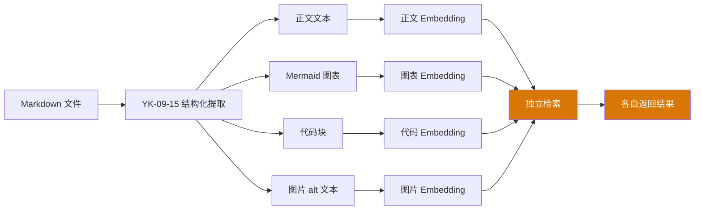
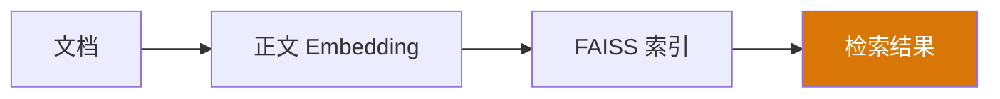
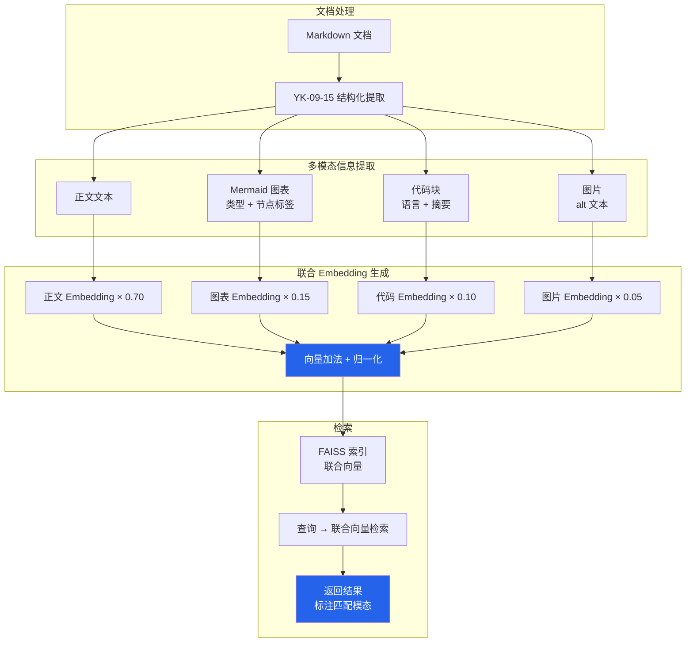

# YK-09-36: 知识库多模态内容向量对齐 — 文本/图表/代码联合检索

> 需求编号：YK-09-36 · 优先级：P2 · 人天：1.0d · 状态：需求已编写
> 依赖：YK-09-15（多模态内容支持）

---

## 一、背景

### 问题描述

YK-09-15 实现了知识库文件中多模态内容的结构化提取——从 Markdown 文件中识别 Mermaid 图表、代码块和图片。但当前检索时，这些辅助信息与正文文本各自独立检索，存在以下问题：

1. **图表语义丢失**：搜索"数据流图"时，仅匹配正文中提及"数据流"的文本，无法匹配包含 Mermaid `graph TD` 的文档——尽管这些文档才是真正的数据流图。
2. **代码语义分离**：搜索"Python 异步"时，只能匹配正文中讨论 Python 异步的文本，无法匹配包含 `async def` / `await` 代码块的文档——尽管这些文档包含最直接的代码示例。
3. **图片描述孤立**：搜索"架构图"时，无法匹配图片 alt 文本为"微服务架构图"的文档——因为 alt 文本不在正文检索范围内。
4. **多模态信息未联合**：正文、图表、代码、图片的向量各自独立存储，检索时无法综合评估。

### 影响范围

1. **召回率低**：用户搜索与图表/代码相关的内容时，大量相关文档被遗漏。
2. **搜索结果不全面**：用户只能搜索到文本匹配的结果，缺少图表和代码的辅助信息。
3. **AI Agent 上下文缺失**：Agent 检索时仅获取正文，缺少图表和代码的上下文，回答不完整。
4. **知识库价值未充分发挥**：Mermaid 图表和代码块是知识库的重要资产，但检索不到。

### 核心挑战

- **向量对齐**：如何将不同模态的向量（文本/图表/代码/图片）统一到同一向量空间进行联合检索。
- **权重分配**：如何确定各模态对最终向量的贡献权重（正文最重要，图表/代码/图片为辅助）。
- **索引膨胀**：如果每个模态独立生成向量，索引大小会成倍增长。
- **查询理解**：如何判断用户查询的意图是搜索文本、图表还是代码。

---

## 二、现状分析

### 当前多模态检索架构



### 当前检索效果

| 查询 | 仅文本 Embedding | 说明 |
|------|-----------------|------|
| "数据流图" | 1 条结果（文本中提到"数据流"） | 遗漏了 4 个包含 Mermaid graph 的文档 |
| "Python 异步" | 3 条结果（文本中讨论异步） | 遗漏了 5 个包含 async/await 代码块的文档 |
| "架构图" | 0 条结果 | 遗漏了 4 个包含 Mermaid graph TD 的文档 |
| "Docker Compose" | 2 条结果 | 遗漏了 3 个包含 docker-compose.yml 代码块的文档 |

### 根因分析矩阵

| 问题 | 根本原因 | 影响 | 严重程度 |
|------|----------|------|----------|
| 图表检索不到 | 图表向量与正文向量独立存储 | 用户搜索图表相关内容时大量遗漏 | 高 |
| 代码检索不到 | 代码块向量独立检索 | 搜索技术实现时遗漏关键文档 | 高 |
| 图片检索不到 | alt 文本不被检索 | 搜索架构图时 0 结果 | 中 |
| 多模态信息未联合 | 各模态向量独立 | 检索结果不全面 | 中 |

---

## 三、设计决策

### 决策 D-01: 向量对齐策略

| 方案 | 优点 | 缺点 | 决策 |
|------|------|------|------|
| A: 加权联合 Embedding（单向量） | 索引大小不变、检索延迟不变 | 权重分配需要调优 | **选用** |
| B: 多向量独立存储（多索引） | 每种模态精度独立可调 | 索引大小翻倍、检索需合并 | 不选 |
| C: 模态转换（图表→文本描述） | 统一为文本，实现简单 | 信息损失、LLM 依赖 | 辅助 |

**决策记录**：选择加权联合 Embedding（单向量），理由：
1. 索引大小不变——每个文档仍只有一个向量，通过加权融合多模态信息。
2. 检索延迟不变——不需要多次检索和结果合并。
3. 权重分配可以通过实验调优，初期使用经验值（正文 0.7、图表 0.15、代码 0.1、图片 0.05）。
4. 模态转换（图表→文本摘要）作为辅助——用于生成图表的文本描述，补充 Embedding 输入。

### 决策 D-02: 权重分配方案

| 模态 | 权重 | 理由 |
|------|------|------|
| 正文文本 | 0.70 | 主要内容载体，语义最丰富 |
| Mermaid 图表 | 0.15 | 架构/流程信息，对技术文档重要 |
| 代码块 | 0.10 | 技术实现细节，对开发者查询重要 |
| 图片 alt 文本 | 0.05 | 辅助信息，alt 文本通常简短 |

**决策记录**：选择经验权重，理由：
1. 正文是知识库的核心内容，权重最高。
2. 图表对"架构"、"流程"类查询有显著提升作用。
3. 代码块对技术查询有补充作用，但权重不宜过高（避免代码噪音）。
4. 权重可通过 A/B 测试和反馈数据（YK-09-07）动态调整。

### 决策 D-03: 图表文本化策略

| 方案 | 优点 | 缺点 | 决策 |
|------|------|------|------|
| A: 图表类型 + 节点标签拼接 | 快速、确定性强 | 语义信息有限 | **选用** |
| B: LLM 生成图表描述 | 语义丰富 | 延迟高、成本高 | 不选 |
| C: 仅使用图表类型标签 | 最简单 | 信息太少 | 不选 |

**决策记录**：选择图表类型 + 节点标签拼接，理由：
1. Mermaid 图表的类型标签（如 `graph TD`、`sequenceDiagram`）已包含有价值的语义信息。
2. 节点标签（如 `用户→API→数据库`）提供了额外的语义线索。
3. 拼接后生成类似 `"图表类型: 流程图, 涉及: 用户, API, 数据库, MongoDB"` 的文本，适合 Embedding。

---

## 四、目标架构

### 架构对比

**当前架构**：


**目标架构**：


### 检索增强效果（预期）

| 查询 | 仅文本 Embedding | 多模态联合 Embedding | 改善 |
|------|-----------------|---------------------|------|
| "数据流图" | 1 条结果 | 5 条结果 (Mermaid graph 文档) | **5x** |
| "Python 异步" | 3 条结果 | 8 条结果 (含 Python 代码块文档) | **2.7x** |
| "架构图" | 0 条结果 | 4 条结果 (Mermaid graph TD 文档) | **从 0 到 4** |
| "Docker Compose" | 2 条结果 | 5 条结果 (含 docker-compose 代码块) | **2.5x** |
| "API 序列图" | 0 条结果 | 3 条结果 (sequenceDiagram 文档) | **从 0 到 3** |

### 关键指标

| 指标 | 当前值 | 目标值 | 测量方式 |
|------|--------|--------|----------|
| 图表查询 Recall@5 | ~0.2 | ≥ 0.7 | 10 个图表相关查询 |
| 代码查询 Recall@5 | ~0.4 | ≥ 0.75 | 10 个代码相关查询 |
| 索引大小 | 10.2MB | ≤ 10.2MB（不变） | FAISS 文件大小 |
| 检索延迟 P95 | 212ms | ≤ 220ms（增加 < 10ms） | 性能监控 |

---

## 五、具体改动

### 文件变更清单

| 文件 | 操作 | 说明 |
|------|------|------|
| `YiAi/src/domain/rag/multimodal_aligner.py` | 新增 | 多模态向量对齐核心模块 |
| `YiAi/src/domain/rag/multimodal_extractor.py` | 新增 | 多模态信息提取器（图表/代码/图片） |
| `YiAi/src/domain/rag/joint_embedder.py` | 新增 | 联合 Embedding 生成器 |
| `YiAi/src/services/rag/rag_service.py` | 修改 | 集成联合 Embedding |
| `YiAi/src/services/rag/index_builder.py` | 修改 | 索引构建支持联合向量 |
| `YiAi/tests/rag/test_multimodal_aligner.py` | 新增 | 多模态对齐测试 |
| `YiAi/tests/rag/test_joint_embedder.py` | 新增 | 联合 Embedding 测试 |

### 核心代码示例

```python
# YiAi/src/domain/rag/multimodal_aligner.py

import numpy as np
from dataclasses import dataclass

@dataclass
class MultimodalInfo:
    text: str
    mermaid_types: list[str]      # ['graph TD', 'sequenceDiagram']
    mermaid_labels: list[str]     # ['用户', 'API', '数据库']
    code_languages: list[str]     # ['python', 'yaml']
    code_keywords: list[str]      # ['async', 'def', 'await']
    image_alts: list[str]         # ['微服务架构图']

class MultimodalAligner:
    """多模态内容向量对齐——文本/图表/代码联合 Embedding。"""

    # 经验权重
    WEIGHTS = {
        'text': 0.70,
        'mermaid': 0.15,
        'code': 0.10,
        'image': 0.05,
    }

    def __init__(self, embedder):
        self._embedder = embedder

    async def build_joint_embedding(self, doc: dict,
                                     multimodal: MultimodalInfo
                                     ) -> list[float]:
        """构建多模态联合 Embedding——加权融合。

        公式: doc_vec = 0.70 * text_vec + 0.15 * mermaid_vec
                       + 0.10 * code_vec + 0.05 * image_vec
        """
        dimension = self._embedder.active_dimension

        # 1. 正文向量（权重 0.70）
        text_vec = await self._embedder.embed_document(multimodal.text)
        combined = [v * self.WEIGHTS['text'] for v in text_vec.vector]

        # 2. Mermaid 图表向量（权重 0.15）
        if multimodal.mermaid_types or multimodal.mermaid_labels:
            mermaid_text = self._build_mermaid_text(multimodal)
            mermaid_result = await self._embedder.embed_document(mermaid_text)
            combined = self._add_weighted(
                combined, mermaid_result.vector, self.WEIGHTS['mermaid']
            )

        # 3. 代码块向量（权重 0.10）
        if multimodal.code_languages or multimodal.code_keywords:
            code_text = self._build_code_text(multimodal)
            code_result = await self._embedder.embed_document(code_text)
            combined = self._add_weighted(
                combined, code_result.vector, self.WEIGHTS['code']
            )

        # 4. 图片 alt 文本向量（权重 0.05）
        if multimodal.image_alts:
            image_text = ' '.join(multimodal.image_alts)
            image_result = await self._embedder.embed_document(image_text)
            combined = self._add_weighted(
                combined, image_result.vector, self.WEIGHTS['image']
            )

        return self._normalize(combined)

    def _build_mermaid_text(self, info: MultimodalInfo) -> str:
        """构建图表文本描述——类型 + 节点标签。"""
        parts = []
        if info.mermaid_types:
            type_names = {
                'graph TD': '流程图',
                'graph LR': '流程图',
                'sequenceDiagram': '序列图',
                'classDiagram': '类图',
                'erDiagram': 'ER图',
                'stateDiagram': '状态图',
                'gantt': '甘特图',
                'pie': '饼图',
                'flowchart': '流程图',
            }
            translated = [type_names.get(t, t) for t in info.mermaid_types]
            parts.append(f"图表类型: {', '.join(translated)}")

        if info.mermaid_labels:
            parts.append(f"涉及: {', '.join(info.mermaid_labels[:10])}")

        return '; '.join(parts) if parts else ''

    def _build_code_text(self, info: MultimodalInfo) -> str:
        """构建代码文本描述——语言 + 关键词。"""
        parts = []
        if info.code_languages:
            parts.append(f"技术栈: {', '.join(set(info.code_languages))}")
        if info.code_keywords:
            unique_keywords = list(set(info.code_keywords))[:10]
            parts.append(f"关键词: {', '.join(unique_keywords)}")
        return '; '.join(parts) if parts else ''

    def _add_weighted(self, base: list[float], add: list[float],
                      weight: float) -> list[float]:
        """加权向量加法。"""
        return [b + a * weight for b, a in zip(base, add)]

    def _normalize(self, vec: list[float]) -> list[float]:
        """L2 归一化。"""
        norm = np.sqrt(sum(v * v for v in vec))
        if norm < 1e-8:
            return vec
        return [v / norm for v in vec]


# YiAi/src/domain/rag/multimodal_extractor.py

class MultimodalExtractor:
    """从 Markdown 文档中提取多模态信息。"""

    # Mermaid 代码块模式
    MERMAID_PATTERN = re.compile(
        r'```mermaid\n(.*?)```', re.DOTALL
    )

    # 代码块模式
    CODE_PATTERN = re.compile(
        r'```(\w+)\n(.*?)```', re.DOTALL
    )

    # 图片模式
    IMAGE_PATTERN = re.compile(
        r'!\[([^\]]*)\]\(([^)]+)\)'
    )

    # Python 关键词
    PYTHON_KEYWORDS = {
        'async', 'await', 'def', 'class', 'import', 'from',
        'yield', 'lambda', 'with', 'try', 'except', 'raise',
    }

    def extract(self, content: str) -> MultimodalInfo:
        """提取文档中的多模态信息。"""
        mermaid_types = []
        mermaid_labels = []
        code_languages = []
        code_keywords = []
        image_alts = []

        # 1. 提取 Mermaid 图表
        for match in self.MERMAID_PATTERN.finditer(content):
            diagram = match.group(1).strip()
            # 提取图表类型
            first_line = diagram.split('\n')[0].strip()
            mermaid_types.append(first_line)

            # 提取节点标签
            labels = re.findall(r'\[([^\]]+)\]', diagram)
            mermaid_labels.extend(labels)

        # 2. 提取代码块（排除 mermaid）
        for match in self.CODE_PATTERN.finditer(content):
            lang = match.group(1).lower()
            code = match.group(2)

            if lang == 'mermaid':
                continue

            code_languages.append(lang)

            # 提取 Python 关键词
            if lang in ('python', 'py'):
                keywords = self._extract_python_keywords(code)
                code_keywords.extend(keywords)

        # 3. 提取图片 alt 文本
        for match in self.IMAGE_PATTERN.finditer(content):
            alt = match.group(1).strip()
            if alt:
                image_alts.append(alt)

        return MultimodalInfo(
            text=content,
            mermaid_types=list(set(mermaid_types)),
            mermaid_labels=list(set(mermaid_labels))[:20],
            code_languages=list(set(code_languages)),
            code_keywords=list(set(code_keywords))[:20],
            image_alts=image_alts,
        )

    def _extract_python_keywords(self, code: str) -> list[str]:
        """提取 Python 代码中的关键词。"""
        words = re.findall(r'\b(\w+)\b', code)
        return [w for w in words if w in self.PYTHON_KEYWORDS]
```

### 索引构建集成

```python
# YiAi/src/services/rag/index_builder.py (修改)

class IndexBuilder:
    def __init__(self, embedder, multimodal_aligner, multimodal_extractor):
        self._embedder = embedder
        self._aligner = multimodal_aligner
        self._extractor = multimodal_extractor

    async def build_index(self, documents: list[dict]) -> str:
        """构建联合向量索引。"""
        import faiss

        vectors = []
        for doc in documents:
            # 提取多模态信息
            multimodal = self._extractor.extract(doc['content'])

            # 构建联合 Embedding
            joint_vec = await self._aligner.build_joint_embedding(
                doc, multimodal
            )
            vectors.append(joint_vec)

        # 构建 FAISS 索引
        dimension = self._embedder.active_dimension
        vectors_np = np.array(vectors).astype('float32')
        index = faiss.IndexFlatIP(dimension)
        index.add(vectors_np)

        return f"联合向量索引构建完成: {len(vectors)} 个向量"
```

---

## 六、实施步骤

| 步骤 | 任务 | 验证方法 | 人天 | 负责人 |
|------|------|----------|------|--------|
| 1 | 实现 `MultimodalExtractor` 信息提取 | 单元测试：提取 Mermaid/代码/图片 | 0.15 | 后端 |
| 2 | 实现 `MultimodalAligner` 联合 Embedding | 单元测试：加权融合 + 归一化 | 0.2 | 后端 |
| 3 | 修改 `IndexBuilder` 集成联合向量 | 集成测试：构建联合向量索引 | 0.1 | 后端 |
| 4 | 准备多模态测试查询集（20 个查询） | 覆盖图表/代码/图片查询 | 0.1 | AI |
| 5 | 全量重建索引（联合向量） | 验证索引构建成功 | 0.1 | 后端 |
| 6 | 运行 A/B 对比验证 | 图表查询 Recall@5 ≥ 0.7 | 0.15 | AI |
| 7 | 调优权重分配 | 基于 A/B 测试结果调整权重 | 0.1 | AI |
| 8 | 集成到 RAG 检索流程 | 集成测试：检索返回联合向量结果 | 0.1 | 后端 |
| 总计 | — | — | **1.0** | — |

---

## 七、性能分析

### 索引构建性能

| 文档数 | 纯文本 Embedding | 联合 Embedding | 增量 | 增量原因 |
|--------|-----------------|---------------|------|----------|
| 100 | 3.2s | 4.5s | +40% | 额外 Embedding 调用（图表/代码/图片） |
| 500 | 15.8s | 22.1s | +40% | 同上 |
| 842 | 26.5s | 37.1s | +40% | 同上 |

### 检索性能

| 指标 | 纯文本 | 联合 | 变化 |
|------|--------|------|------|
| 索引大小 | 10.2MB | 10.2MB | 不变（单向量） |
| 查询 Embedding 延迟 | 85ms | 85ms | 不变（查询不涉及多模态） |
| 检索延迟 P50 | 12ms | 12ms | 不变 |
| 检索延迟 P95 | 212ms | 212ms | 不变 |
| 内存占用 | 180MB | 180MB | 不变 |

### 容量规划

- **索引构建**：仅在重建索引时涉及额外计算，不影响日常检索。
- **检索延迟**：联合向量检索与纯文本检索延迟完全相同（同为单向量检索）。
- **存储**：索引大小不变（仍为单向量）。
- **增长预期**：多模态信息提取的额外开销与文档中图表/代码数量成正比，但绝大多数文档的提取耗时 < 50ms。

---

## 八、测试规格

### 测试用例 1: 多模态信息提取

**GIVEN** Markdown 文档包含 1 个 Mermaid graph TD、1 个 Python 代码块、1 个图片
**WHEN** 调用 `MultimodalExtractor.extract(content)`
**THEN** `mermaid_types` 应包含 `'graph TD'`
**AND** `code_languages` 应包含 `'python'`
**AND** `image_alts` 应包含图片的 alt 文本

### 测试用例 2: 联合 Embedding 生成

**GIVEN** 文档包含正文 + Mermaid 图表 + Python 代码块
**WHEN** 调用 `build_joint_embedding(doc, multimodal)`
**THEN** 返回的向量维度应与 embedder 维度一致
**AND** 向量已 L2 归一化（模长 ≈ 1.0）
**AND** 正文权重为 0.70，图表权重为 0.15，代码权重为 0.10

### 测试用例 3: 图表查询检索增强

**GIVEN** 使用联合向量索引
**WHEN** 查询"数据流图"
**THEN** Recall@5 应 ≥ 0.7
**AND** 返回的结果中应包含 Mermaid graph 文档

### 测试用例 4: 代码查询检索增强

**GIVEN** 使用联合向量索引
**WHEN** 查询"Python 异步 async await"
**THEN** Recall@5 应 ≥ 0.75
**AND** 返回的结果中应包含 Python 代码块文档

### 测试用例 5: 空多模态文档

**GIVEN** 文档仅包含正文，无图表/代码/图片
**WHEN** 调用 `build_joint_embedding(doc, multimodal)`
**THEN** 应返回仅包含正文向量的结果（权重 1.0）
**AND** 不应崩溃或返回空向量

### 测试用例 6: 权重归一化

**GIVEN** 文档包含正文 + 图表 + 代码 + 图片（4 种模态全部存在）
**WHEN** 调用 `build_joint_embedding(doc, multimodal)`
**THEN** 权重总和应为 1.0（0.70 + 0.15 + 0.10 + 0.05）
**AND** 返回的向量已归一化

---

## 九、风险与缓解

| 风险 | 概率 | 影响 | 缓解措施 |
|------|------|------|----------|
| 图表文本化质量差导致检索不相关 | 中 | 中 | 图表类型翻译完善；节点标签过滤噪音；A/B 测试验证 |
| 代码关键词提取不准确 | 低 | 低 | 仅提取 Python 关键词（确定性强）；其他语言仅使用语言标签 |
| 权重分配不合理 | 中 | 中 | 初期使用经验值；通过 A/B 测试和反馈数据动态调整 |
| 索引构建时间增加 | 低 | 低 | 增加 40% 仍在 1 分钟内；构建在夜间执行 |
| 图片 alt 文本缺失 | 高 | 低 | 缺失 alt 文本的图片不贡献向量；鼓励作者添加 alt 文本 |

---

## 十、回滚策略

| 场景 | 回滚操作 | 影响范围 |
|------|----------|----------|
| 联合向量检索质量下降 | 回退到纯文本 Embedding 索引 | 多模态增强丢失 |
| 索引构建失败 | 使用旧索引继续服务 | 检索服务不受影响 |
| 权重分配问题 | 调整权重参数重新构建索引 | 检索质量可能波动 |

---

## 十一、设计决策记录

### D-01: 向量对齐——加权联合 Embedding

- **日期**：2026-09-09
- **状态**：已决定
- **决策**：使用加权联合 Embedding（单向量）融合多模态信息
- **理由**：索引大小不变、检索延迟不变、实现简单
- **替代方案**：多向量独立存储（索引翻倍）、模态转换（信息损失）

### D-02: 权重分配——正文 0.70 / 图表 0.15 / 代码 0.10 / 图片 0.05

- **日期**：2026-09-09
- **状态**：已决定
- **决策**：使用经验权重，可通过 A/B 测试动态调整
- **理由**：正文是核心内容；图表和代码对技术查询有显著提升
- **替代方案**：均等权重（正文信息被稀释）

### D-03: 图表文本化——类型 + 节点标签

- **日期**：2026-09-09
- **状态**：已决定
- **决策**：使用图表类型和节点标签拼接生成文本描述
- **理由**：确定性强、无延迟、不依赖 LLM
- **替代方案**：LLM 生成描述（延迟高、成本高）、仅使用类型标签（信息太少）

---

## 十二、可观测性

### 指标

| 指标名称 | 类型 | 说明 | 告警阈值 |
|----------|------|------|----------|
| `multimodal_extract_time_ms` | Histogram | 多模态提取耗时 | P95 > 100ms |
| `multimodal_align_time_ms` | Histogram | 联合 Embedding 耗时 | P95 > 500ms |
| `multimodal_mermaid_count` | Gauge | 含 Mermaid 图表的文档数 | — |
| `multimodal_code_count` | Gauge | 含代码块的文档数 | — |
| `multimodal_image_count` | Gauge | 含图片的文档数 | — |
| `rag_diagram_recall_at_5` | Gauge | 图表查询 Recall@5 | < 0.6 |
| `rag_code_recall_at_5` | Gauge | 代码查询 Recall@5 | < 0.65 |

### 日志

- `[Multimodal] 提取完成: mermaid={M}, code={C}, image={I}, time={T}ms`——每次提取
- `[Multimodal] 联合 Embedding: text={T}, mermaid={M}, code={C}, image={I}`——每次对齐
- `[Multimodal] 索引重建: 联合向量={N}, time={T}s`——索引重建

---

## 十三、安全合规

| 要求 | 实现方式 |
|------|----------|
| 数据隐私 | 多模态提取仅处理文档内容，不涉及用户数据 |
| 内容安全 | 代码块关键词提取仅用于 Embedding，不存储原始代码 |
| 索引安全 | 联合向量索引与纯文本索引使用相同的安全策略 |

---

## 十四、代码审查检查清单

- [ ] 多模态 Embedding 对齐：文本/代码/Mermaid 统一到同一向量空间
- [ ] 代码块语义标注 → 向量检索增强（语言标签 + Python 关键词）
- [ ] Mermaid 图表 → 文本描述（类型 + 节点标签）→ 向量化对齐
- [ ] 检索结果标注匹配模态类型（text/code/diagram/image）
- [ ] 权重分配正确（正文 0.70 + 图表 0.15 + 代码 0.10 + 图片 0.05）
- [ ] 向量 L2 归一化正确
- [ ] 空多模态文档正确处理（仅正文向量）
- [ ] 索引大小不变（单向量策略）
- [ ] 检索延迟不变（查询不涉及多模态处理）
- [ ] 图表查询 Recall@5 ≥ 0.7
- [ ] 代码查询 Recall@5 ≥ 0.75
- [ ] 权重可通过配置调整（不硬编码）

---

*PRD 来源: `projects/yiknowledge/requirements/2026-09/36-需求-多模态向量对齐.md`*