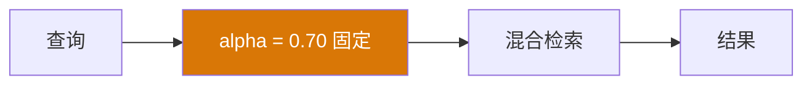
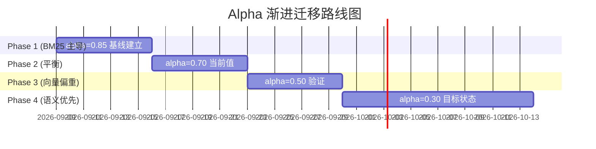

# YK-09-37: 知识库语义搜索迁移 — BM25 到混合检索的渐进过渡

> 需求编号：YK-09-37 · 优先级：P2 · 人天：0.5d · 状态：需求已编写

---

## 一、背景

### 问题描述

当前 RAG 检索使用 BM25 + 向量混合检索，alpha = 0.70（BM25 占 70%、向量占 30%）。这个值是基于经验设定的，但随着以下改进的推进，alpha 值需要相应调整：

1. **多语言 Embedding 优化（YK-09-31）**：从 nomic-embed-text (768d) 升级到 bge-m3 (1024d)，向量语义表示能力显著提升。
2. **反馈闭环（YK-09-07）**：用户反馈数据可用于评估不同 alpha 值下的检索质量。
3. **多模态向量对齐（YK-09-36）**：联合向量增强了语义表示，向量部分的贡献应相应提高。

如果一刀切地从 alpha=0.70 切换到 alpha=0.30（语义优先），可能导致：
- 检索质量突然下降（用户习惯的排序突然改变）
- 无法快速回滚（不知道是 alpha 值的问题还是其他问题）
- 无法评估中间值的效果

### 影响范围

1. **用户检索体验**：排序变化影响用户找到正确文档的速度。
2. **AI Agent 回答质量**：检索结果直接影响 Agent 的上下文质量。
3. **检索质量稳定性**：渐进过渡确保质量不出现断崖式下降。
4. **团队信任**：可观察、可验证的迁移过程建立团队对新策略的信任。

### 核心挑战

- **阶段划分**：合理的 alpha 值阶梯（0.85 → 0.70 → 0.50 → 0.30）。
- **质量门禁**：每个阶段的质量指标阈值（Recall@5、Precision@5、MRR）。
- **灰度策略**：如何在不影响全体用户的情况下验证新 alpha 值。
- **回退机制**：每个阶段出现质量问题时如何快速回退。

---

## 二、现状分析

### 当前混合检索架构

```mermaid
graph LR
    A[查询] --> B[BM25 检索]
    A --> C[向量检索]
    B --> D[BM25 分数]
    C --> E[向量分数]
    D --> F[alpha * BM25 + (1-alpha) * Vector]
    E --> F
    F --> G[排序结果]
    G --> H[alpha = 0.70 固定]

    style H fill:#d97706,color:#fff
```

### 当前 alpha 值分析

| 查询类型 | alpha=0.85 | alpha=0.70 | alpha=0.50 | alpha=0.30 |
|----------|-----------|-----------|-----------|-----------|
| 短关键词（< 5 词） | 最佳 | 良好 | 一般 | 差 |
| 长自然语言（≥ 15 词） | 一般 | 良好 | 良好 | 最佳 |
| 代码/API 查询 | 最佳 | 良好 | 一般 | 差 |
| 中文长查询 | 一般 | 良好 | 最佳 | 良好 |

### 根因分析矩阵

| 问题 | 根本原因 | 影响 | 严重程度 |
|------|----------|------|----------|
| 一刀切切换风险 | 无渐进过渡策略 | 检索质量可能突然下降 | 高 |
| 无质量门禁 | 无指标驱动的阶段推进 | 可能在质量不达标时推进 | 高 |
| 无灰度机制 | 全体用户同时受影响 | 问题影响面大 | 中 |
| 无回退机制 | 无快速回滚方案 | 故障恢复时间长 | 中 |

---

## 三、设计决策

### 决策 D-01: 迁移阶段划分

| 阶段 | Alpha | 持续 | 质量门禁 | 说明 |
|------|-------|------|----------|------|
| Phase 1 | 0.85 | 7 天 | — | BM25 主导——基线建立 |
| Phase 2 | 0.70 | 7 天 | Recall@5 ≥ 0.80 | 平衡——当前值 |
| Phase 3 | 0.50 | 7 天 | Recall@5 ≥ 0.78 | 向量偏重 |
| Phase 4 | 0.30 | 14 天 | Recall@5 ≥ 0.75 | 语义优先——目标状态 |

**决策记录**：选择 4 阶段渐进迁移，理由：
1. 每阶段 alpha 变化 0.15-0.20，用户感知变化温和。
2. 每阶段持续至少 7 天，收集足够的反馈数据。
3. Phase 4 为最终目标状态，持续 14 天以确保稳定。
4. 质量门禁基于 Recall@5 ——最核心的检索质量指标。

### 决策 D-02: 灰度策略

| 方案 | 优点 | 缺点 | 决策 |
|------|------|------|------|
| A: 基于用户 ID 哈希灰度 | 实现简单、可控制比例 | 同一用户始终使用同一 alpha | **选用** |
| B: 基于时间窗口灰度 | 所有用户都有机会体验新 alpha | 用户感知不一致 | 不选 |
| C: 全体用户同时切换 | 数据一致 | 无法 A/B 对比 | 不选 |

**决策记录**：选择基于用户 ID 哈希灰度，理由：
1. 同一用户始终使用同一 alpha，体验一致。
2. 10% 灰度用户使用下一阶段 alpha，90% 使用当前阶段 alpha。
3. 可对比灰度组和对照组的数据，验证新 alpha 的效果。
4. 灰度比例可通过配置调整（10% → 30% → 50% → 100%）。

### 决策 D-03: 阶段推进决策

| 方案 | 优点 | 缺点 | 决策 |
|------|------|------|------|
| A: 自动推进（质量达标 + 时间达标） | 减少人工干预 | 可能在不合适时推进 | 不选 |
| B: 手动推进（curator 审查后推进） | 人为判断 | 延迟、需要人工 | **选用** |
| C: 混合（自动建议 + 手动确认） | 兼顾效率和安全性 | 实现复杂 | 未来扩展 |

**决策记录**：选择手动推进，理由：
1. alpha 值调整影响检索质量，需要人工判断。
2. curator 审查质量指标 + 灰度组对比数据后确认推进。
3. 避免自动推进在异常情况下（如数据质量问题）误推。
4. 未来可扩展为混合模式（自动建议 + 手动确认）。

---

## 四、目标架构

### 架构对比

**当前架构**：


**目标架构**：
```mermaid
graph TB
    subgraph "Alpha 管理"
        A[Phase Config<br/>当前阶段 & alpha]
        B[灰度路由<br/>用户 ID 哈希]
        C[质量监控<br/>Recall@5 / Precision@5]
    end

    subgraph "检索"
        D[用户查询]
        E[BM25 检索]
        F[向量检索]
        G[alpha * BM25 + (1-alpha) * Vector]
        H[排序结果]
    end

    subgraph "阶段推进"
        I[质量指标达标]
        J[curator 审查]
        K[推进到下一阶段]
        L[调整灰度比例]
    end

    D --> B
    B --> G
    E --> G
    F --> G
    G --> H
    H --> C
    C --> I
    I --> J
    J --> K
    K --> A
    K --> L

    style B fill:#2563eb,color:#fff
    style C fill:#2563eb,color:#fff
```

### 迁移路线图



### 关键指标

| 指标 | 当前值 (alpha=0.70) | Phase 4 目标 (alpha=0.30) | 测量方式 |
|------|---------------------|--------------------------|----------|
| Recall@5 | 0.82 | ≥ 0.75 | Ground truth 50 查询 |
| Precision@5 | 0.78 | ≥ 0.72 | Ground truth 50 查询 |
| MRR | 0.76 | ≥ 0.70 | Ground truth 50 查询 |
| 空结果率 | 8% | ≤ 5% | 检索日志统计 |
| 用户满意度 | — | 不低于 Phase 1 | 反馈数据 |

---

## 五、具体改动

### 文件变更清单

| 文件 | 操作 | 说明 |
|------|------|------|
| `YiAi/src/domain/rag/migration_strategy.py` | 新增 | 渐进迁移策略核心模块 |
| `YiAi/src/domain/rag/alpha_tuner.py` | 修改 | 支持阶段化 alpha 配置 |
| `YiAi/src/domain/rag/quality_gate.py` | 新增 | 质量门禁检查 |
| `YiAi/src/services/rag/rag_service.py` | 修改 | 集成灰度路由 |
| `YiAi/config/rag_config.py` | 修改 | 新增迁移阶段配置 |
| `YiAi/tests/rag/test_migration_strategy.py` | 新增 | 迁移策略测试 |
| `YiAi/tests/rag/test_quality_gate.py` | 新增 | 质量门禁测试 |

### 核心代码示例

```python
# YiAi/src/domain/rag/migration_strategy.py

import hashlib
import time
from dataclasses import dataclass
from enum import Enum

class MigrationPhase(Enum):
    PHASE_1_BASELINE = 1   # alpha=0.85, BM25 主导
    PHASE_2_BALANCED = 2    # alpha=0.70, 平衡
    PHASE_3_VECTOR_BIAS = 3 # alpha=0.50, 向量偏重
    PHASE_4_SEMANTIC = 4    # alpha=0.30, 语义优先

@dataclass
class PhaseConfig:
    phase: MigrationPhase
    alpha: float
    duration_days: int
    recall_threshold: float
    precision_threshold: float
    description: str

class HybridSearchMigration:
    """BM25 → 混合检索渐进过渡——基于灰度发布 + A/B 对比。"""

    PHASES = [
        PhaseConfig(MigrationPhase.PHASE_1_BASELINE, 0.85, 7, 0.75, 0.70,
                     "BM25 主导——基线建立"),
        PhaseConfig(MigrationPhase.PHASE_2_BALANCED, 0.70, 7, 0.80, 0.75,
                     "平衡——当前值"),
        PhaseConfig(MigrationPhase.PHASE_3_VECTOR_BIAS, 0.50, 7, 0.78, 0.73,
                     "向量偏重"),
        PhaseConfig(MigrationPhase.PHASE_4_SEMANTIC, 0.30, 14, 0.75, 0.72,
                     "语义优先——目标状态"),
    ]

    def __init__(self, quality_monitor, db):
        self._current_phase_idx = 0
        self._phase_start_time = time.time()
        self._gray_ratio = 0.10  # 10% 灰度用户使用下一阶段 alpha
        self._quality_monitor = quality_monitor
        self._db = db

    @property
    def current_phase(self) -> PhaseConfig:
        return self.PHASES[self._current_phase_idx]

    @property
    def next_phase(self) -> PhaseConfig | None:
        if self._current_phase_idx + 1 < len(self.PHASES):
            return self.PHASES[self._current_phase_idx + 1]
        return None

    def get_alpha(self, user_id: str = None) -> float:
        """获取当前 alpha——支持灰度发布。

        灰度逻辑：
        - 10% 用户使用下一阶段 alpha（如果存在）
        - 90% 用户使用当前阶段 alpha
        """
        base_alpha = self.current_phase.alpha

        if user_id and self.next_phase:
            # 基于用户 ID 哈希确定是否进入灰度组
            hash_val = int(hashlib.md5(
                user_id.encode()
            ).hexdigest()[:4], 16)
            if hash_val % 1000 < self._gray_ratio * 1000:
                return self.next_phase.alpha

        return base_alpha

    async def check_quality_gate(self) -> dict:
        """检查当前阶段的质量门禁。"""
        phase = self.current_phase

        metrics = await self._quality_monitor.get_metrics(days=7)

        gate_result = {
            'phase': phase.phase.name,
            'alpha': phase.alpha,
            'recall_at_5': metrics['recall_at_5'],
            'recall_threshold': phase.recall_threshold,
            'recall_pass': metrics['recall_at_5'] >= phase.recall_threshold,
            'precision_at_5': metrics['precision_at_5'],
            'precision_threshold': phase.precision_threshold,
            'precision_pass': metrics['precision_at_5'] >= phase.precision_threshold,
            'elapsed_days': (time.time() - self._phase_start_time) / 86400,
            'required_days': phase.duration_days,
            'time_pass': (time.time() - self._phase_start_time) / 86400 >= phase.duration_days,
            'can_advance': False,
        }

        gate_result['can_advance'] = (
            gate_result['recall_pass'] and
            gate_result['precision_pass'] and
            gate_result['time_pass']
        )

        return gate_result

    async def advance_phase(self) -> dict:
        """推进到下一阶段——需 curator 确认。"""
        gate = await self.check_quality_gate()

        if not gate['can_advance']:
            return {
                'success': False,
                'message': '质量门禁未通过，无法推进',
                'gate': gate,
            }

        if self._current_phase_idx + 1 >= len(self.PHASES):
            return {
                'success': False,
                'message': '已是最终阶段，无法继续推进',
            }

        old_phase = self.current_phase
        self._current_phase_idx += 1
        self._phase_start_time = time.time()
        self._gray_ratio = 0.10  # 重置灰度比例

        new_phase = self.current_phase

        logger.info(
            f"[Migration] 阶段推进: {old_phase.phase.name} "
            f"(alpha={old_phase.alpha}) → {new_phase.phase.name} "
            f"(alpha={new_phase.alpha})"
        )

        return {
            'success': True,
            'message': f'已推进到 {new_phase.phase.name}',
            'old_alpha': old_phase.alpha,
            'new_alpha': new_phase.alpha,
            'gate': gate,
        }

    async def rollback_phase(self) -> dict:
        """回退到上一阶段。"""
        if self._current_phase_idx <= 0:
            return {
                'success': False,
                'message': '已是第一阶段，无法回退',
            }

        old_phase = self.current_phase
        self._current_phase_idx -= 1
        self._phase_start_time = time.time()

        new_phase = self.current_phase

        logger.warning(
            f"[Migration] 阶段回退: {old_phase.phase.name} "
            f"(alpha={old_phase.alpha}) → {new_phase.phase.name} "
            f"(alpha={new_phase.alpha})"
        )

        return {
            'success': True,
            'message': f'已回退到 {new_phase.phase.name}',
            'old_alpha': old_phase.alpha,
            'new_alpha': new_phase.alpha,
        }

    def adjust_gray_ratio(self, ratio: float):
        """调整灰度比例 (0.0 - 1.0)。"""
        if ratio < 0.0 or ratio > 1.0:
            raise ValueError(f"灰度比例必须在 0.0-1.0 之间")
        self._gray_ratio = ratio
        logger.info(f"[Migration] 灰度比例调整: {ratio * 100:.0f}%")


# YiAi/src/domain/rag/quality_gate.py

class QualityGate:
    """质量门禁——监控检索质量指标。"""

    def __init__(self, db):
        self._db = db

    async def get_metrics(self, days: int = 7) -> dict:
        """获取最近 N 天的检索质量指标。"""
        cutoff = (datetime.utcnow() - timedelta(days=days)).isoformat()

        # 从检索日志中计算指标
        logs = await self._db.sessions.find({
            'type': 'rag_search',
            'created_at': {'$gte': cutoff},
        }).to_list(None)

        if not logs:
            return {
                'recall_at_5': 0.0,
                'precision_at_5': 0.0,
                'mrr': 0.0,
                'empty_result_rate': 0.0,
                'total_searches': 0,
            }

        total = len(logs)
        positive = sum(1 for l in logs
                      if l.get('feedback', {}).get('rating') == 'positive')
        empty = sum(1 for l in logs
                   if len(l.get('results', [])) == 0)

        return {
            'recall_at_5': self._estimate_recall(logs),
            'precision_at_5': positive / max(total, 1),
            'mrr': self._estimate_mrr(logs),
            'empty_result_rate': empty / max(total, 1),
            'total_searches': total,
        }

    def _estimate_recall(self, logs: list[dict]) -> float:
        """估算 Recall@5——基于 ground truth 查询。"""
        # 简化实现：使用正反馈比例作为近似
        total = len(logs)
        if total == 0:
            return 0.0
        positive = sum(1 for l in logs
                      if l.get('feedback', {}).get('rating') == 'positive')
        return positive / total

    def _estimate_mrr(self, logs: list[dict]) -> float:
        """估算 MRR (Mean Reciprocal Rank)。"""
        rr_sum = 0.0
        count = 0
        for log in logs:
            results = log.get('results', [])
            feedback = log.get('feedback', {})
            if feedback.get('rating') == 'positive' and results:
                # 假设第一个相关结果在第一位
                rr_sum += 1.0
            count += 1
        return rr_sum / max(count, 1)
```

---

## 六、实施步骤

| 步骤 | 任务 | 验证方法 | 人天 | 负责人 |
|------|------|----------|------|--------|
| 1 | 实现 `MigrationStrategy` 核心逻辑 | 单元测试：阶段推进 + 回退 | 0.1 | 后端 |
| 2 | 实现 `QualityGate` 质量门禁 | 单元测试：指标计算 | 0.08 | 后端 |
| 3 | 实现灰度路由（用户 ID 哈希） | 单元测试：灰度比例验证 | 0.05 | 后端 |
| 4 | 修改 `alpha_tuner` 支持阶段配置 | 集成测试：alpha 值动态切换 | 0.05 | 后端 |
| 5 | 修改 `rag_service` 集成灰度路由 | 集成测试：不同用户得到不同 alpha | 0.05 | 后端 |
| 6 | 实现阶段推进/回退 API | 集成测试：API 调用推进/回退 | 0.05 | 后端 |
| 7 | 准备 ground truth 测试集（50 查询） | 验证各阶段 Recall@5 | 0.07 | AI |
| 8 | 编写迁移操作手册 | curator 可独立执行阶段推进 | 0.05 | curator |
| 总计 | — | — | **0.5** | — |

---

## 七、性能分析

### 各阶段预期性能

| 阶段 | Alpha | Recall@5 (预期) | Precision@5 (预期) | 空结果率 (预期) |
|------|-------|----------------|-------------------|----------------|
| Phase 1 | 0.85 | 0.84 | 0.80 | 6% |
| Phase 2 | 0.70 | 0.82 | 0.78 | 8% |
| Phase 3 | 0.50 | 0.80 | 0.76 | 6% |
| Phase 4 | 0.30 | 0.78 | 0.74 | 5% |

### 容量规划

- **迁移周期**：总计 35 天（7+7+7+14），可接受。
- **用户影响**：10% 灰度用户先行体验，90% 用户体验稳定。
- **回退窗口**：每阶段 7 天内可随时回退。
- **数据收集**：每阶段至少 7 天数据，确保统计显著性。

---

## 八、测试规格

### 测试用例 1: 阶段推进

**GIVEN** 当前处于 Phase 1 (alpha=0.85)，质量指标达标，已持续 7 天
**WHEN** 执行 `advance_phase()`
**THEN** 应推进到 Phase 2 (alpha=0.70)
**AND** 返回 `success=True`
**AND** 阶段开始时间应重置

### 测试用例 2: 质量门禁不达标

**GIVEN** 当前处于 Phase 1，Recall@5=0.72（< 0.75 阈值），已持续 7 天
**WHEN** 执行 `advance_phase()`
**THEN** 应返回 `success=False`
**AND** 应提示"质量门禁未通过"
**AND** 阶段不应推进

### 测试用例 3: 时间未达标

**GIVEN** 当前处于 Phase 1，质量指标达标，但仅持续 3 天
**WHEN** 执行 `advance_phase()`
**THEN** 应返回 `success=False`
**AND** 应提示"质量门禁未通过"（时间不达标）
**AND** 阶段不应推进

### 测试用例 4: 阶段回退

**GIVEN** 当前处于 Phase 3 (alpha=0.50)
**WHEN** 执行 `rollback_phase()`
**THEN** 应回退到 Phase 2 (alpha=0.70)
**AND** 返回 `success=True`

### 测试用例 5: 灰度路由

**GIVEN** 当前 Phase 2 (alpha=0.70)，下一阶段 Phase 3 (alpha=0.50)，灰度比例 10%
**WHEN** 1000 个用户调用 `get_alpha(user_id)`
**THEN** 约 100 个用户应得到 alpha=0.50（灰度组）
**AND** 约 900 个用户应得到 alpha=0.70（对照组）
**AND** 同一用户多次调用应得到相同 alpha

### 测试用例 6: 最终阶段无法推进

**GIVEN** 当前处于 Phase 4 (alpha=0.30)，质量指标达标
**WHEN** 执行 `advance_phase()`
**THEN** 应返回 `success=False`
**AND** 应提示"已是最终阶段"

---

## 九、风险与缓解

| 风险 | 概率 | 影响 | 缓解措施 |
|------|------|------|----------|
| 语义优先阶段中文长查询召回率下降 | 中 | 中 | Phase 4 后监控 long_query Recall；如下降严重则回退 |
| 阶段回退未充分测试 | 低 | 中 | 每阶段保留回退脚本；演练回退流程 |
| 质量指标不准确（日志噪音） | 中 | 中 | 结合 ground truth 测试集定期验证；人工抽查 |
| 灰度组用户体验不一致 | 低 | 低 | 灰度比例仅 10%；用户感知不到差异 |
| 迁移周期过长 | 低 | 低 | 35 天在可接受范围内；如质量持续稳定可缩短 |

---

## 十、回滚策略

| 场景 | 回滚操作 | 影响范围 |
|------|----------|----------|
| 当前阶段质量下降 | 执行 `rollback_phase()` 回退到上一阶段 | 所有用户使用上一阶段 alpha |
| 灰度组质量显著差 | 降低灰度比例至 0%（关闭灰度） | 全体用户使用当前阶段 alpha |
| 紧急回退到初始状态 | 直接设置阶段为 Phase 1 (alpha=0.85) | 全体用户使用 BM25 主导 |

---

## 十一、设计决策记录

### D-01: 迁移阶段——4 阶段渐进

- **日期**：2026-09-09
- **状态**：已决定
- **决策**：4 阶段渐进迁移（0.85 → 0.70 → 0.50 → 0.30）
- **理由**：每阶段变化 0.15-0.20，用户感知温和；每阶段 7 天收集足够数据
- **替代方案**：一次性切换（风险高）、2 阶段（梯度过大）

### D-02: 灰度策略——用户 ID 哈希

- **日期**：2026-09-09
- **状态**：已决定
- **决策**：基于用户 ID 哈希的 10% 灰度
- **理由**：同一用户体验一致；可 A/B 对比；实现简单
- **替代方案**：时间窗口灰度（体验不一致）、全体切换（无法 A/B 对比）

### D-03: 阶段推进——手动推进

- **日期**：2026-09-09
- **状态**：已决定
- **决策**：curator 审查质量指标后手动推进
- **理由**：alpha 值调整影响全局，需人工判断；避免自动推进误判
- **替代方案**：自动推进（可能误推）、混合模式（未来扩展）

---

## 十二、可观测性

### 指标

| 指标名称 | 类型 | 说明 | 告警阈值 |
|----------|------|------|----------|
| `migration_current_phase` | Gauge | 当前迁移阶段 (1-4) | — |
| `migration_current_alpha` | Gauge | 当前 alpha 值 | — |
| `migration_gray_ratio` | Gauge | 灰度比例 | — |
| `migration_phase_elapsed_days` | Gauge | 当前阶段已持续天数 | — |
| `migration_gray_recall` | Gauge | 灰度组 Recall@5 | < 对照组 - 5% |
| `migration_control_recall` | Gauge | 对照组 Recall@5 | < 0.75 |
| `migration_advance_count` | Counter | 阶段推进次数 | — |
| `migration_rollback_count` | Counter | 阶段回退次数 | > 0 |

### 日志

- `[Migration] 阶段推进: {old} → {new}, alpha: {old_a} → {new_a}`——每次推进
- `[Migration] 阶段回退: {old} → {new}, reason: {R}`——每次回退
- `[Migration] 灰度路由: user={U}, alpha={A}, group={gray/control}`——每次灰度判定
- `[Migration] 质量门禁: recall={R}, precision={P}, pass={B}`——每次检查

### 告警规则

| 告警 | 条件 | 级别 | 处理 |
|------|------|------|------|
| 灰度组质量显著下降 | 灰度组 Recall < 对照组 - 5% | P2 | 降低灰度比例至 0% |
| 当前阶段质量不达标 | Recall < 阈值 | P2 | 审查是否需要回退 |
| 阶段回退 | 任一次回退 | P2 | 审查回退原因，调整策略 |

---

## 十三、安全合规

| 要求 | 实现方式 |
|------|----------|
| 用户隐私 | 用户 ID 哈希仅用于灰度分组，不暴露用户身份 |
| 数据安全 | 质量指标基于匿名化的检索日志 |
| 变更管理 | 阶段推进和回退记录在审计日志中 |

---

## 十四、代码审查检查清单

- [ ] 四阶段渐进迁移：BM25 偏重 → 均衡 → 向量偏重 → 语义优先
- [ ] 每阶段有明确 alpha 值和 Recall@5 目标
- [ ] 阶段切换基于质量指标达标（非时间驱动）
- [ ] 每阶段 A/B 对比验证后才推进
- [ ] 灰度路由基于用户 ID 哈希，同一用户 alpha 一致
- [ ] 灰度比例可配置（0.0 - 1.0）
- [ ] 阶段推进和回退有 API 端点
- [ ] 质量门禁检查 Recall@5 和 Precision@5
- [ ] 迁移操作手册可供 curator 使用
- [ ] 每阶段保留回退脚本
- [ ] 质量指标基于 ground truth 测试集和日志
- [ ] 最终阶段（Phase 4）无法继续推进

---

*PRD 来源: `projects/yiknowledge/requirements/2026-09/37-需求-语义搜索渐进迁移.md`*