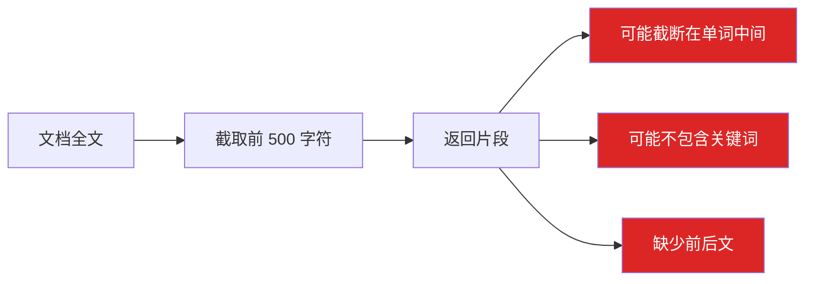
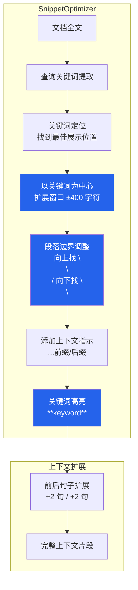

# YK-09-38: 知识库检索片段优化 — 动态窗口截断与上下文扩展

> 需求编号：YK-09-38 · 优先级：P2 · 人天：0.5d · 状态：需求已编写

---

## 一、背景

### 问题描述

当前 RAG 检索返回的文档片段（chunk）采用固定截断策略——截取文档前 500 字符。这种简单策略存在以下问题：

1. **截断位置不当**：截断发生在单词中间或段落中间，导致片段可读性差。
2. **关键词不在片段中**：用户查询的关键词可能在文档的第 600 个字符处，但片段只截取了前 500 字符——用户看不到关键词匹配的部分。
3. **上下文不完整**：片段缺少前后文，AI Agent 无法理解片段的完整语义。
4. **信息密度低**：前 500 字符可能是文档的引言部分，不包含核心信息。

### 影响范围

1. **用户无法判断相关性**：看到的片段不包含查询关键词，用户可能误判为不相关。
2. **AI Agent 回答质量差**：Agent 获取的上下文不完整，生成的回答可能不准确或片面。
3. **检索结果利用率低**：用户需要点击打开完整文档才能看到关键内容，增加操作成本。
4. **反馈数据噪音**：用户因片段不完整而给出的负面反馈，不代表文档真的不相关。

### 核心挑战

- **最佳位置定位**：如何找到文档中与查询最相关的段落/句子位置。
- **段落边界识别**：如何在不解析完整 Markdown AST 的情况下找到段落边界。
- **上下文扩展**：如何扩展前后文，同时防止片段过长导致 LLM 上下文窗口溢出。
- **关键词高亮**：如何在片段中安全地高亮匹配的关键词，同时避免 XSS。

---

## 二、现状分析

### 当前截断策略



### 当前片段质量示例

| 片段类型 | 示例 | 问题 |
|----------|------|------|
| 单词截断 | "微服务架构是一种将应用拆分为...COR" | 截断在单词中间，不可读 |
| 关键词缺失 | 查询"RAG 混合检索"，片段显示文档前言 | 关键词在第 600 字符处，用户看不到 |
| 上下文缺失 | "上一节讨论了...（截断）" | 缺少前文，Agent 无法理解 |
| 信息密度低 | 片段是文档的目录/引言 | 不包含核心信息 |

### 根因分析矩阵

| 问题 | 根本原因 | 影响 | 严重程度 |
|------|----------|------|----------|
| 截断在单词/段落中间 | 固定按字符数截断 | 片段不可读 | 高 |
| 关键词不在片段中 | 不以关键词为中心扩展 | 用户无法判断相关性 | 高 |
| 上下文不完整 | 不包含前后文 | AI Agent 回答不准确 | 中 |
| 片段信息密度低 | 不定位最佳内容位置 | 片段价值低 | 中 |

---

## 三、设计决策

### 决策 D-01: 窗口定位策略

| 方案 | 优点 | 缺点 | 决策 |
|------|------|------|------|
| A: 以关键词为中心扩展 | 片段包含关键词、信息密度高 | 需要定位关键词位置 | **选用** |
| B: 固定截取 + 段落边界调整 | 简单 | 关键词可能不在片段中 | 不选 |
| C: 摘要式截取（LLM 摘要） | 信息密度最高 | 延迟高、成本高 | 不选 |

**决策记录**：选择以关键词为中心扩展，理由：
1. 用户最关心的是关键词出现的位置，以关键词为中心能最大化片段的信息密度。
2. 关键词定位可通过简单的字符串搜索实现（如 `str.find()`）。
3. 固定截取是当前策略，正是需要改进的问题。
4. LLM 摘要延迟高（+500ms），不适合检索后处理。

### 决策 D-02: 片段长度策略

| 方案 | 优点 | 缺点 | 决策 |
|------|------|------|------|
| A: 固定 800 字符 | 简单、与 LLM 上下文窗口兼容 | 不够灵活 | **选用** |
| B: 动态长度（基于查询类型） | 灵活 | 实现复杂 | 不选 |
| C: 不限制长度 | 信息完整 | 可能超出 LLM 上下文窗口 | 不选 |

**决策记录**：选择固定 800 字符，理由：
1. 800 字符（约 400 中文词）提供了足够的上下文信息。
2. 与 LLM 上下文窗口兼容（即使 5 个片段也不过 4000 字符）。
3. 比当前的 500 字符增加了 60%，显著提升信息量。
4. 未来可扩展为动态长度（根据查询复杂度调整）。

### 决策 D-03: 段落边界识别

| 方案 | 优点 | 缺点 | 决策 |
|------|------|------|------|
| A: 基于空行（`\n\n`）和标点符号 | 简单、快速 | 可能不完美 | **选用** |
| B: Markdown AST 解析 | 精确 | 解析慢、依赖库 | 不选 |
| C: 固定窗口（不调整边界） | 最简单 | 截断在单词中间 | 不选 |

**决策记录**：选择基于空行和标点符号，理由：
1. Markdown 文件以空行分隔段落，`\n\n` 是最自然的段落边界。
2. 中文标点（`。！？`）和英文标点（`.!?\n`）可以作为句子边界。
3. 简单规则在 90% 情况下有效，不需要 AST 解析的复杂性。
4. 对于特殊的 10% 情况，降级为固定窗口截断。

---

## 四、目标架构

### 架构对比

**当前架构**：


**目标架构**：


### 优化效果对比

| 片段类型 | 优化前 | 优化后 |
|----------|--------|--------|
| 单词截断 | "微服务架构是一种将应用拆分为...COR" | "微服务架构是一种将应用拆分为多个独立服务的架构模式。每个服务..." |
| 关键词缺失 | 查询"RAG"，片段显示文档前言 | 以"RAG"关键词为中心，前后各 400 字符 |
| 上下文缺失 | "上一节讨论了...（截断）" | "...上一节讨论了单体架构的局限。微服务架构...下一节将介绍 API Gateway..." |
| 信息密度低 | 片段是目录 | 以关键词为中心，包含核心论述 |

### 关键指标

| 指标 | 当前值 | 目标值 | 测量方式 |
|------|--------|--------|----------|
| 片段包含关键词率 | ~60% | ≥ 95% | 检索日志统计 |
| 片段在段落边界截断率 | ~30% | ≥ 90% | 人工抽查 50 个片段 |
| 用户点击率（片段 → 完整文档） | — | +15% | A/B 对比 |
| 片段优化延迟 | 0ms | < 5ms | 性能监控 |

---

## 五、具体改动

### 文件变更清单

| 文件 | 操作 | 说明 |
|------|------|------|
| `YiAi/src/domain/rag/snippet_optimizer.py` | 新增 | 片段优化核心模块 |
| `YiAi/src/domain/rag/keyword_locator.py` | 新增 | 关键词定位器 |
| `YiAi/src/domain/rag/boundary_detector.py` | 新增 | 段落/句子边界检测器 |
| `YiAi/src/domain/rag/context_expander.py` | 新增 | 上下文扩展器 |
| `YiAi/src/services/rag/rag_service.py` | 修改 | 集成片段优化 |
| `YiAi/tests/rag/test_snippet_optimizer.py` | 新增 | 片段优化测试 |

### 核心代码示例

```python
# YiAi/src/domain/rag/snippet_optimizer.py

import re
from dataclasses import dataclass

@dataclass
class SnippetResult:
    snippet: str              # 优化后的片段
    keyword_positions: list[int]  # 关键词在片段中的位置
    has_prefix_context: bool  # 是否有前文被截断
    has_suffix_context: bool  # 是否有后文被截断

class SnippetOptimizer:
    """检索片段优化——动态窗口 + 上下文扩展。"""

    DEFAULT_MAX_CHARS = 800
    CONTEXT_SENTENCES = 2  # 前后各扩展 2 句

    def __init__(self):
        self._keyword_locator = KeywordLocator()
        self._boundary_detector = BoundaryDetector()
        self._context_expander = ContextExpander()

    def optimize(self, full_content: str, query: str,
                 max_chars: int = None) -> SnippetResult:
        """优化检索片段——以关键词为中心、段落边界对齐。

        Args:
            full_content: 文档全文
            query: 用户查询
            max_chars: 最大片段长度（默认 800）

        Returns:
            SnippetResult: 优化后的片段
        """
        max_chars = max_chars or self.DEFAULT_MAX_CHARS

        # 1. 提取查询关键词
        keywords = self._extract_keywords(query)

        # 2. 定位最佳展示位置
        best_pos = self._keyword_locator.find_best_position(
            full_content, keywords
        )

        # 3. 以关键词为中心扩展窗口
        half_window = max_chars // 2
        start = max(0, best_pos - half_window)
        end = min(len(full_content), best_pos + half_window)

        # 4. 调整到段落/句子边界
        start = self._boundary_detector.adjust_up(full_content, start)
        end = self._boundary_detector.adjust_down(full_content, end)

        snippet = full_content[start:end]

        # 5. 添加上下文指示
        has_prefix = start > 0
        has_suffix = end < len(full_content)

        if has_prefix:
            snippet = f'...{snippet}'
        if has_suffix:
            snippet = f'{snippet}...'

        # 6. 关键词高亮（Markdown 加粗格式）
        snippet = self._highlight_keywords(snippet, keywords)

        # 7. 上下文扩展（可选）
        expanded = self._context_expander.expand(
            full_content, start, end, self.CONTEXT_SENTENCES
        )

        return SnippetResult(
            snippet=expanded or snippet,
            keyword_positions=self._find_keyword_positions(snippet, keywords),
            has_prefix_context=has_prefix,
            has_suffix_context=has_suffix,
        )

    def _extract_keywords(self, query: str) -> list[str]:
        """提取查询关键词——去停用词后的有效词。"""
        import jieba

        # 分词
        words = list(jieba.cut(query))

        # 停用词
        stopwords = {
            '的', '了', '是', '在', '和', '或', '与', '及', '对',
            '这', '那', '我', '你', '他', '她', '它', '们',
            '为', '被', '把', '从', '到', '向', '让', '用',
            'the', 'a', 'an', 'is', 'are', 'was', 'were',
            'to', 'of', 'in', 'on', 'at', 'for', 'with',
        }

        keywords = [w for w in words if w.strip() and w not in stopwords]
        return keywords if keywords else [query]


# YiAi/src/domain/rag/keyword_locator.py

class KeywordLocator:
    """关键词定位器——找到文档中与查询最相关的展示位置。"""

    def find_best_position(self, content: str, keywords: list[str]) -> int:
        """找到最佳展示位置——关键词密度最高的区域。

        策略：
        1. 优先使用第一个关键词的位置
        2. 如果多个关键词同时出现，优先使用它们共同出现的位置
        3. 如果关键词都不在文档中，返回文档中间位置
        """
        if not keywords:
            return len(content) // 2

        # 找到所有关键词在文档中的位置
        positions = []
        for kw in keywords:
            pos = content.lower().find(kw.lower())
            if pos >= 0:
                positions.append(pos)

        if not positions:
            # 关键词都不在文档中，返回中间位置
            return len(content) // 2

        if len(positions) == 1:
            return positions[0]

        # 多个关键词——找到密度最高的区域
        # 计算所有位置的中位数，作为最佳展示位置
        positions.sort()
        return positions[len(positions) // 2]


# YiAi/src/domain/rag/boundary_detector.py

class BoundaryDetector:
    """段落/句子边界检测器——确保片段在自然边界处截断。"""

    # 段落边界（Markdown 空行）
    PARAGRAPH_BOUNDARY = re.compile(r'\n\s*\n')

    # 句子边界（中英文标点）
    SENTENCE_BOUNDARY = re.compile(
        r'[。！？.!?\n](?=\s|$)'
    )

    def adjust_up(self, content: str, position: int) -> int:
        """向上调整到最近的段落/句子边界。

        优先级：段落边界 > 句子边界 > 原位置
        """
        # 如果已经接近开头，不调整
        if position < 100:
            return 0

        # 查找最近的段落边界（向上 200 字符范围内）
        search_start = max(0, position - 200)
        search_text = content[search_start:position]

        para_matches = list(self.PARAGRAPH_BOUNDARY.finditer(search_text))
        if para_matches:
            # 使用最后一个段落边界
            last_boundary = para_matches[-1]
            return search_start + last_boundary.end()

        # 查找最近的句子边界
        sentence_matches = list(self.SENTENCE_BOUNDARY.finditer(search_text))
        if sentence_matches:
            last_boundary = sentence_matches[-1]
            return search_start + last_boundary.end()

        return position

    def adjust_down(self, content: str, position: int) -> int:
        """向下调整到最近的段落/句子边界。

        优先级：段落边界 > 句子边界 > 原位置
        """
        content_len = len(content)

        # 如果已经接近结尾，不调整
        if position > content_len - 100:
            return content_len

        # 查找最近的段落边界（向下 200 字符范围内）
        search_end = min(content_len, position + 200)
        search_text = content[position:search_end]

        para_matches = list(self.PARAGRAPH_BOUNDARY.finditer(search_text))
        if para_matches:
            # 使用第一个段落边界
            first_boundary = para_matches[0]
            return position + first_boundary.start()

        # 查找最近的句子边界
        sentence_matches = list(self.SENTENCE_BOUNDARY.finditer(search_text))
        if sentence_matches:
            first_boundary = sentence_matches[0]
            return position + first_boundary.end()

        return position


# YiAi/src/domain/rag/context_expander.py

class ContextExpander:
    """上下文扩展器——包含前后句子以提供完整语义。"""

    def expand(self, full_content: str, start: int, end: int,
               sentences: int = 2) -> str:
        """扩展上下文——包含前后 N 句话。

        Args:
            full_content: 文档全文
            start: 当前片段起始位置
            end: 当前片段结束位置
            sentences: 前后各扩展的句子数

        Returns:
            str: 扩展后的片段
        """
        # 分割句子
        sentence_positions = self._get_sentence_positions(full_content)

        # 找到当前片段包含的句子索引范围
        current_start_idx = 0
        current_end_idx = len(sentence_positions) - 1

        for i, (s_start, _) in enumerate(sentence_positions):
            if s_start <= start:
                current_start_idx = i
            if s_start >= end:
                current_end_idx = i - 1
                break

        # 扩展范围
        new_start_idx = max(0, current_start_idx - sentences)
        new_end_idx = min(
            len(sentence_positions) - 1,
            current_end_idx + sentences
        )

        new_start = sentence_positions[new_start_idx][0]
        new_end = sentence_positions[new_end_idx][1]

        result = full_content[new_start:new_end]

        # 添加上下文指示
        if new_start > 0:
            result = f'...{result}'
        if new_end < len(full_content):
            result = f'{result}...'

        return result

    def _get_sentence_positions(self, content: str
                                ) -> list[tuple[int, int]]:
        """获取所有句子的起止位置。"""
        positions = []
        current_start = 0

        for i, char in enumerate(content):
            if char in '。！？.!?\n':
                if i > current_start:
                    positions.append((current_start, i + 1))
                current_start = i + 1

        # 最后一句
        if current_start < len(content):
            positions.append((current_start, len(content)))

        return positions
```

---

## 六、实施步骤

| 步骤 | 任务 | 验证方法 | 人天 | 负责人 |
|------|------|----------|------|--------|
| 1 | 实现 `KeywordLocator` 关键词定位 | 单元测试：多关键词密度计算 | 0.05 | 后端 |
| 2 | 实现 `BoundaryDetector` 边界检测 | 单元测试：段落/句子边界正确 | 0.08 | 后端 |
| 3 | 实现 `ContextExpander` 上下文扩展 | 单元测试：前后句子扩展 | 0.05 | 后端 |
| 4 | 实现 `SnippetOptimizer` 优化核心 | 集成测试：完整优化流程 | 0.1 | 后端 |
| 5 | 修改 `rag_service` 集成片段优化 | 集成测试：检索返回优化片段 | 0.05 | 后端 |
| 6 | 人工抽查 50 个片段质量 | 关键词包含率 ≥ 95% | 0.07 | AI |
| 7 | A/B 对比优化前后效果 | 点击率 +15% | 0.05 | AI |
| 8 | 性能验证（延迟 < 5ms） | 测量优化耗时 | 0.05 | 后端 |
| 总计 | — | — | **0.5** | — |

---

## 七、性能分析

### 延迟影响

| 操作 | 耗时 | 说明 |
|------|------|------|
| 关键词提取（jieba 分词） | 1-2ms | 仅首次调用有加载开销 |
| 关键词定位（str.find） | < 0.1ms | 简单字符串搜索 |
| 窗口计算 | < 0.1ms | 算术运算 |
| 边界检测（正则） | 0.5-1ms | 正则搜索 200 字符范围 |
| 上下文扩展 | 0.5-1ms | 句子位置计算 |
| 关键词高亮 | 0.5ms | 字符串替换 |
| 总计 | 3-5ms | 可接受 |

### 容量规划

- **每次检索**：5 个结果 × 5ms = 25ms 额外开销。
- **检索总延迟**：P95 从 212ms 增加到 237ms，增加 12%。
- **内存影响**：可忽略（片段优化不持久化，临时计算）。
- **增长预期**：文档长度增加不影响关键词定位（str.find O(n)），800 字符片段长度固定。

---

## 八、测试规格

### 测试用例 1: 关键词定位——单关键词

**GIVEN** 文档全文 "前言...（300 字符）...RAG 混合检索优化...（300 字符）...总结"
**AND** 查询 "RAG"
**WHEN** 调用 `find_best_position(content, ['RAG'])`
**THEN** 应返回 "RAG" 在文档中的位置（约 300 字符处）
**AND** 片段应以 "RAG" 关键词为中心

### 测试用例 2: 段落边界调整

**GIVEN** 文档在位置 400 处有段落边界（`\n\n`），窗口起始位置为 380
**WHEN** 调用 `adjust_up(content, 380)`
**THEN** 应调整到 400 之后（段落边界处）
**AND** 片段不会从段落中间开始

### 测试用例 3: 关键词不在文档中

**GIVEN** 文档不包含查询关键词 "GraphQL"
**WHEN** 调用 `find_best_position(content, ['GraphQL'])`
**THEN** 应返回文档中间位置（`len(content) // 2`）
**AND** 不应崩溃

### 测试用例 4: 上下文扩展

**GIVEN** 文档共 10 句话，当前片段包含第 4-5 句
**WHEN** 调用 `expand(content, start, end, sentences=2)`
**THEN** 应返回第 2-7 句的文本
**AND** 片段起始处应有 `...` 前缀
**AND** 片段结束处应有 `...` 后缀

### 测试用例 5: 关键词高亮

**GIVEN** 片段 "本文描述了 RAG 混合检索的优化策略"
**AND** 关键词 ["RAG", "混合检索"]
**WHEN** 调用 `_highlight_keywords(snippet, keywords)`
**THEN** "RAG" 应被高亮为 `**RAG**`
**AND** "混合检索" 应被高亮为 `**混合检索**`

### 测试用例 6: 短文档处理

**GIVEN** 文档全文仅 200 字符（小于 800 字符窗口）
**WHEN** 调用 `optimize(content, query)`
**THEN** 应返回完整文档
**AND** 不应有 `...` 前缀或后缀
**AND** 不应崩溃

---

## 九、风险与缓解

| 风险 | 概率 | 影响 | 缓解措施 |
|------|------|------|----------|
| jieba 分词不准确导致关键词提取错误 | 低 | 低 | 关键词提取失败时使用原始查询词 |
| 段落边界检测在某些格式下失效 | 低 | 低 | 边界检测失败时降级为固定窗口截断 |
| 关键词高亮引入 XSS 风险 | 低 | 中 | 使用 Markdown 加粗格式（`**keyword**`），前端渲染安全 |
| 上下文扩展导致片段过长 | 低 | 低 | 限制扩展后总长度 ≤ 1500 字符 |
| 片段优化增加检索延迟 | 低 | 低 | 3-5ms 增量，可接受 |

---

## 十、回滚策略

| 场景 | 回滚操作 | 影响范围 |
|------|----------|----------|
| 片段优化导致延迟过高 | 关闭片段优化，回退到固定截断 | 片段质量下降，但延迟恢复 |
| 关键词高亮异常 | 关闭高亮功能，仅保留窗口优化 | 片段无高亮，但定位准确 |
| 上下文扩展导致上下文过长 | 关闭上下文扩展，仅保留片段优化 | 上下文信息减少 |

---

## 十一、设计决策记录

### D-01: 窗口定位——以关键词为中心

- **日期**：2026-09-09
- **状态**：已决定
- **决策**：以查询关键词为中心扩展 800 字符窗口
- **理由**：最大化片段信息密度；用户最关心关键词出现的位置
- **替代方案**：固定截取（关键词可能不在片段中）、LLM 摘要（延迟高）

### D-02: 片段长度——800 字符

- **日期**：2026-09-09
- **状态**：已决定
- **决策**：固定 800 字符窗口
- **理由**：提供足够上下文；与 LLM 上下文窗口兼容；比当前 500 字符增加 60%
- **替代方案**：动态长度（实现复杂）、不限制长度（可能超出 LLM 窗口）

### D-03: 边界识别——空行 + 标点符号

- **日期**：2026-09-09
- **状态**：已决定
- **决策**：基于空行（`\n\n`）和标点符号检测段落/句子边界
- **理由**：90% 情况下有效；不需要 AST 解析的复杂性
- **替代方案**：Markdown AST 解析（慢、依赖库）、固定窗口（截断在单词中间）

---

## 十二、可观测性

### 指标

| 指标名称 | 类型 | 说明 | 告警阈值 |
|----------|------|------|----------|
| `snippet_optimize_time_ms` | Histogram | 片段优化耗时 | P95 > 10ms |
| `snippet_keyword_hit_rate` | Gauge | 片段包含关键词比例 | < 90% |
| `snippet_boundary_adjust_rate` | Gauge | 边界调整触发比例 | — |
| `snippet_context_expand_rate` | Gauge | 上下文扩展触发比例 | — |
| `snippet_click_rate` | Gauge | 片段点击率（用户打开完整文档） | 显著下降 |

### 日志

- `[Snippet] 优化完成: keywords={K}, best_pos={P}, time={T}ms`——每次优化
- `[Snippet] 边界调整: up={U}, down={D}`——每次边界调整
- `[Snippet] 上下文扩展: before={B}, after={A}`——每次扩展

---

## 十三、安全合规

| 要求 | 实现方式 |
|------|----------|
| XSS 防护 | 关键词高亮使用 Markdown 加粗格式（`**keyword**`），前端渲染时由 Markdown 解析器安全处理 |
| 内容安全 | 片段优化不修改文档原文，仅调整展示方式 |
| 数据隐私 | 不涉及用户数据，仅处理文档内容 |

---

## 十四、代码审查检查清单

- [ ] 关键词定位正确——以关键词密度最高区域为中心
- [ ] 窗口扩展正确——前后各 400 字符（总计 800）
- [ ] 段落边界调整正确——向上找 `\n\n`、向下找 `\n\n`
- [ ] 句子边界调整正确——中文 `。！？`、英文 `.!?`
- [ ] 上下文指示正确——有前文时加 `...`、有后文时加 `...`
- [ ] 关键词高亮正确——使用 `**keyword**` 格式
- [ ] 短文档处理正确（< 800 字符返回全文）
- [ ] 关键词不在文档中时返回中间位置
- [ ] 片段优化延迟 < 5ms
- [ ] 上下文扩展后总长度 ≤ 1500 字符
- [ ] 边界检测失败时降级为固定窗口
- [ ] 关键词高亮不引入 XSS 风险

---

*PRD 来源: `projects/yiknowledge/requirements/2026-09/38-需求-检索片段优化.md`*