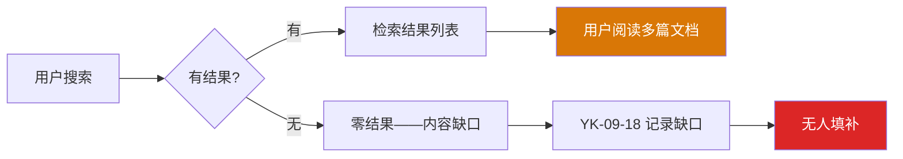
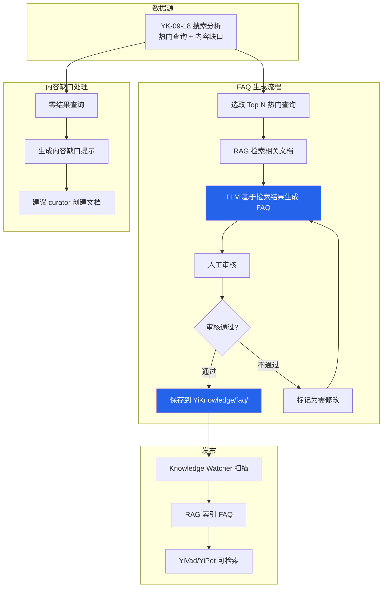

# YK-09-39: 知识库 Agent 辅助问答 — 基于知识库的智能 FAQ 自动生成

> 需求编号：YK-09-39 · 优先级：P2 · 人天：1.0d · 状态：需求已编写
> 依赖：YK-09-18（搜索分析与趋势洞察）

---

## 一、背景

### 问题描述

YK-09-18 识别了用户的搜索趋势和内容缺口——知道用户在搜索什么、哪些查询没有结果。但当前这些数据仅用于分析，并未主动填补发现的内容缺口。具体问题：

1. **热门查询无直接答案**：用户反复搜索"如何优化 RAG alpha 值"，但知识库中没有专门的 FAQ 文档回答这个问题——用户需要阅读多篇文档才能拼凑答案。
2. **内容缺口未填补**：YK-09-18 识别了零结果查询（如"WebSocket 实时通信"），但没有人主动创建相关文档。
3. **FAQ 价值未被发掘**：知识库中已有大量高质量内容，但缺少面向用户的问答对形式——用户需要自己从长文档中提取答案。
4. **新成员上手困难**：新成员不知道从哪里开始阅读，FAQ 可以快速解答常见问题。

### 影响范围

1. **用户搜索体验差**：热门查询需要阅读多篇文档才能找到答案，效率低。
2. **知识库价值未充分发挥**：已有内容未以 FAQ 形式呈现，利用率低。
3. **内容缺口持续存在**：零结果查询反映了真实需求，但无人填补。
4. **AI Agent 回答质量**：Agent 需要从多篇文档中拼凑答案，而非直接引用 FAQ。

### 核心挑战

- **FAQ 质量**：基于 LLM 生成的 FAQ 需要保证准确性（基于知识库内容，不产生幻觉）。
- **内容缺口处理**：零结果查询无法生成 FAQ（无相关文档），需要建议创建新文档。
- **FAQ 存储和管理**：生成后的 FAQ 如何存储、如何更新、如何与原始文档关联。
- **人工审核**：LLM 生成的 FAQ 需要人工审核后才能发布。

---

## 二、现状分析

### 当前搜索与内容关系



### 当前 FAQ 生成需求

| 热门查询 | 搜索次数（30天） | 有结果？ | 需要 FAQ？ | 优先级 |
|----------|-----------------|---------|-----------|--------|
| "RAG alpha 调优" | 45 | 有（3 篇文档） | 是 | 高 |
| "frontmatter 规范" | 38 | 有（1 篇文档） | 是 | 高 |
| "WebSocket 实时通信" | 22 | 无 | 是（内容缺口） | 高 |
| "Ollama 模型部署" | 18 | 有（2 篇文档） | 是 | 中 |
| "YiPet 跨项目桥接" | 15 | 有（1 篇文档） | 是 | 中 |

### 根因分析矩阵

| 问题 | 根本原因 | 影响 | 严重程度 |
|------|----------|------|----------|
| 热门查询无直接答案 | 无 FAQ 生成机制 | 用户需要阅读多篇文档 | 高 |
| 内容缺口未填补 | 无从缺口到创建的流程 | 用户需求不能满足 | 高 |
| 知识库利用不充分 | 缺少问答对形式 | 知识价值未充分发挥 | 中 |
| 新成员上手困难 | 无结构化 FAQ | 学习曲线陡峭 | 中 |

---

## 三、设计决策

### 决策 D-01: FAQ 生成方式

| 方案 | 优点 | 缺点 | 决策 |
|------|------|------|------|
| A: LLM 基于 RAG 检索生成 | 自然语言质量高、基于真实内容 | 需要人工审核、可能产生幻觉 | **选用** |
| B: 手动编写 | 质量最高 | 扩展性差、效率低 | 辅助 |
| C: 模板填充 | 确定性、无幻觉 | 灵活性差、语言生硬 | 不选 |

**决策记录**：选择 LLM 基于 RAG 检索生成，理由：
1. LLM 可以从多篇相关文档中提取关键信息，生成结构化的问答对。
2. 基于 RAG 检索结果生成，而非凭空生成，幻觉风险可控。
3. 人工审核作为质量保证的最后一道防线。
4. 手动编写作为补充——curator 可以手动创建高质量 FAQ。

### 决策 D-02: FAQ 存储方式

| 方案 | 优点 | 缺点 | 决策 |
|------|------|------|------|
| A: Markdown 文件（YiKnowledge/faq/） | 版本控制、RAG 可索引、人工可编辑 | 需要文件管理 | **选用** |
| B: MongoDB 集合 | 查询灵活、结构化 | 非文件系统、RAG 索引需额外处理 | 不选 |
| C: 仅在前端展示（不存储） | 无存储成本 | 每次重新生成、不一致 | 不选 |

**决策记录**：选择 Markdown 文件，理由：
1. 与 YiKnowledge 现有架构一致——Knowledge Watcher 自动扫描并索引。
2. Git 版本控制——FAQ 变更可追溯。
3. 人工可编辑——curator 可以直接修改 FAQ 文件。
4. RAG 自动索引——FAQ 可以被检索到。

### 决策 D-03: 内容缺口处理

| 方案 | 优点 | 缺点 | 决策 |
|------|------|------|------|
| A: 生成提示 + 建议创建文档 | 引导 curator 创建内容 | 不自动生成 | **选用** |
| B: 自动生成空文档框架 | 减少人工工作 | 可能产生低质量文档 | 不选 |
| C: 仅记录不处理 | 最简单 | 缺口持续存在 | 不选 |

**决策记录**：选择生成提示 + 建议创建文档，理由：
1. 零结果查询无法生成 FAQ（无相关文档），强行生成会产生幻觉。
2. 生成提示包含：建议的文档标题、建议的分类、相关的搜索关键词。
3. 引导 curator 创建对应的知识文档，填补内容缺口。

---

## 四、目标架构

### 架构对比

**当前架构**：


**目标架构**：


### FAQ 输出格式

```markdown
---
title: "FAQ: 如何优化 RAG 混合检索的 BM25 和向量权重？"
tags: [FAQ, RAG, 混合检索, BM25, alpha]
category: faq
created: 2026-09-09
updated: 2026-09-09
source: auto-generated
type: faq
status: draft
faq_source_queries: ["RAG alpha 调优", "BM25 向量权重"]
faq_source_docs:
  - projects/yiknowledge/requirements/2026-09/14-需求-混合检索Alpha调优.md
  - projects/yiknowledge/requirements/2026-09/37-需求-语义搜索渐进迁移.md
---

### Q: 如何优化 RAG 混合检索的 BM25 和向量权重？

### A: 

BM25 和向量检索的混合权重（alpha）应基于查询类型动态调整：

1. **短关键词查询（< 5 词）**：alpha ≈ 0.80，偏重 BM25 精确匹配
   - 示例："RAG 混合检索"、"MongoDB 索引"
   - 原因：短查询缺乏语义上下文，BM25 关键词匹配更可靠

2. **长自然语言查询（≥ 15 词）**：alpha ≈ 0.50，偏重语义理解
   - 示例："如何在 FastAPI 中实现异步的 RAG 检索并优化响应时间"
   - 原因：长查询有丰富的语义信息，向量检索效果更好

3. **代码/API 查询**：alpha ≈ 0.85，偏重精确匹配
   - 示例："async def query_documents"、"useEffect cleanup"
   - 原因：代码符号需要精确匹配，语义相似度不够

4. **默认值**：alpha = 0.70，适用于大多数场景

**自动调优**：系统通过用户反馈数据（YK-09-07）自动调整 alpha 值。
当前正在进行 4 阶段渐进迁移（YK-09-37），从 alpha=0.85 逐步过渡到 alpha=0.30。

*来源: [RAG 混合检索 Alpha 调优](projects/yiknowledge/requirements/2026-09/14-需求-混合检索Alpha调优.md)*
*来源: [语义搜索渐进迁移](projects/yiknowledge/requirements/2026-09/37-需求-语义搜索渐进迁移.md)*
```

### 关键指标

| 指标 | 当前值 | 目标值 | 测量方式 |
|------|--------|--------|----------|
| FAQ 生成数量 | 0 | ≥ 10/月 | 统计 YiKnowledge/faq/ 文件数 |
| FAQ 审核通过率 | — | ≥ 80% | 审核日志 |
| 热门查询覆盖度 | 0% | ≥ 50% | FAQ 覆盖的热门查询比例 |
| 内容缺口填补率 | 0% | ≥ 30% | 缺口提示 → 创建文档的比例 |
| FAQ 检索命中率 | — | ≥ 60% | FAQ 被检索到的比例 |

---

## 五、具体改动

### 文件变更清单

| 文件 | 操作 | 说明 |
|------|------|------|
| `YiAi/src/services/knowledge/faq_generator.py` | 新增 | FAQ 生成 RPC 端点 |
| `YiAi/src/domain/knowledge/faq_engine.py` | 新增 | FAQ 生成引擎核心逻辑 |
| `YiAi/src/domain/knowledge/faq_reviewer.py` | 新增 | FAQ 审核管理 |
| `YiAi/src/domain/knowledge/content_gap_advisor.py` | 新增 | 内容缺口处理 |
| `YiAi/src/services/ai/llm_service.py` | 修改 | 新增 FAQ 生成 Prompt |
| `YiKnowledge/faq/` | 新增 | FAQ 文件存储目录 |
| `YiKnowledge/faq/INDEX.md` | 新增 | FAQ 索引 |
| `YiAi/tests/knowledge/test_faq_generator.py` | 新增 | FAQ 生成测试 |

### 核心代码示例

```python
# YiAi/src/domain/knowledge/faq_engine.py

from dataclasses import dataclass, field

@dataclass
class FaqEntry:
    query: str                    # 原始搜索查询
    search_count: int             # 搜索次数
    question: str                 # 生成的 FAQ 问题
    answer: str                   # 生成的 FAQ 答案
    sources: list[str]            # 来源文档路径
    status: str                   # draft / reviewed / published
    suggested_file_path: str      # 建议的 FAQ 文件路径

@dataclass
class ContentGap:
    query: str
    search_count: int
    suggestion: str               # 内容缺口建议
    suggested_title: str          # 建议的文档标题
    suggested_category: str       # 建议的分类
    related_queries: list[str]    # 相关查询

class FaqEngine:
    """基于知识库内容 + 搜索趋势自动生成 FAQ。"""

    FAQ_PROMPT = """你是一个技术文档专家。基于以下知识库内容，为查询"{query}"生成一个 FAQ 问答对。

知识上下文:
{context}

要求:
1. 问题（Q）: 用简洁的自然语言表达常见疑问，一个问题只问一件事
2. 答案（A）: 基于知识库内容回答，引用来源
   - 分点列出关键信息
   - 包含示例（如果有）
   - 注明适用场景和限制
3. 格式: 使用 Markdown
4. 必须在答案末尾列出所有来源文档

注意:
- 答案必须基于提供的知识上下文，不要编造信息
- 如果知识上下文不足以回答查询，请明确指出
- 答案应简洁但完整，200-500 字
"""

    CONTENT_GAP_PROMPT = """你是一个知识库管理专家。以下查询在知识库中没有任何结果，请生成内容缺口建议。

零结果查询: {query}
搜索次数: {count}
相关查询: {related}

请生成:
1. 建议的文档标题（简洁、描述性）
2. 建议的分类（从以下选择: 项目/管理后台/需求, 项目/管理后台/设计, 角色/engineer, 角色/aier）
3. 建议的内容大纲（3-5 个要点）
4. 为什么这个内容很重要（基于搜索次数和相关性）
"""

    def __init__(self, rag_service, llm_service, search_analytics, db):
        self._rag = rag_service
        self._llm = llm_service
        self._analytics = search_analytics
        self._db = db

    async def generate_from_trends(self, top_n: int = 10,
                                   min_search_count: int = 5
                                   ) -> tuple[list[FaqEntry], list[ContentGap]]:
        """从热门搜索和内容缺口中生成 FAQ。"""
        faqs = []
        gaps = []

        # 1. 获取热门查询
        top_queries = await self._analytics.top_queries(
            days=30, limit=top_n
        )
        top_queries = [q for q in top_queries
                       if q['count'] >= min_search_count]

        # 2. 获取零结果查询
        zero_result = await self._analytics.zero_result_queries(
            days=30, limit=top_n
        )

        # 3. 为有结果的查询生成 FAQ
        for query_info in top_queries:
            query = query_info['_id']
            count = query_info['count']

            # RAG 检索相关文档
            docs = await self._rag.search(query, top_k=3)

            if not docs:
                continue  # 理论上不会出现（top_queries 是有结果的）

            # 检查是否已有 FAQ 覆盖此查询
            existing = await self._check_existing_faq(query)
            if existing:
                continue

            # LLM 生成 FAQ
            context = self._format_context(docs)
            prompt = self.FAQ_PROMPT.format(
                query=query, context=context
            )
            answer = await self._llm.chat([
                {"role": "user", "content": prompt}
            ])

            # 解析问答对
            question, answer_text = self._parse_faq(answer)

            faqs.append(FaqEntry(
                query=query,
                search_count=count,
                question=question or f"关于 {query} 的常见问题",
                answer=answer_text or answer,
                sources=[d['path'] for d in docs],
                status='draft',
                suggested_file_path=self._suggest_file_path(query),
            ))

        # 4. 为内容缺口生成建议
        for gap_info in zero_result[:5]:
            query = gap_info['_id']
            count = gap_info['count']

            prompt = self.CONTENT_GAP_PROMPT.format(
                query=query,
                count=count,
                related=', '.join(gap_info.get('related', [])[:5]),
            )
            suggestion = await self._llm.chat([
                {"role": "user", "content": prompt}
            ])

            gaps.append(ContentGap(
                query=query,
                search_count=count,
                suggestion=suggestion,
                suggested_title=f"关于 {query} 的知识文档",
                suggested_category='项目/管理后台/需求',
                related_queries=gap_info.get('related', []),
            ))

        return faqs, gaps

    async def save_faq(self, entry: FaqEntry) -> str:
        """将 FAQ 保存为 Markdown 文件。"""
        file_path = f"YiKnowledge/faq/{entry.suggested_file_path}"

        content = f"""---
title: "FAQ: {entry.question}"
tags: [FAQ, auto-generated]
category: faq
created: {datetime.utcnow().strftime('%Y-%m-%d')}
updated: {datetime.utcnow().strftime('%Y-%m-%d')}
source: auto-generated
type: faq
status: {entry.status}
faq_source_queries: [{entry.query}]
faq_source_docs:
{chr(10).join(f'  - {s}' for s in entry.sources)}
---

### Q: {entry.question}

### A:

{entry.answer}

*来源: {chr(10).join(f'- [{s}]({s})' for s in entry.sources)}*
"""

        with open(file_path, 'w', encoding='utf-8') as f:
            f.write(content)

        return file_path

    def _format_context(self, docs: list[dict]) -> str:
        """格式化知识上下文供 LLM 使用。"""
        parts = []
        for i, doc in enumerate(docs):
            parts.append(
                f"来源 {i+1} [{doc.get('title', 'Unknown')}]:\n"
                f"{doc.get('content', '')[:500]}"
            )
        return '\n\n---\n\n'.join(parts)

    def _parse_faq(self, text: str) -> tuple[str, str]:
        """解析 LLM 生成的 FAQ 问答对。"""
        # 匹配 ### Q: ... ### A: ... 格式
        q_match = re.search(r'###\s*Q:\s*(.+?)(?=###\s*A:|\Z)',
                            text, re.DOTALL)
        a_match = re.search(r'###\s*A:\s*(.+?)(?=\Z)',
                            text, re.DOTALL)

        question = q_match.group(1).strip() if q_match else ''
        answer = a_match.group(1).strip() if a_match else text

        return question, answer

    async def _check_existing_faq(self, query: str) -> bool:
        """检查是否已有 FAQ 覆盖此查询。"""
        existing = await self._db.knowledge_files.find_one({
            'path': {'$regex': '^YiKnowledge/faq/'},
            '$text': {'$search': query},
        })
        return existing is not None

    def _suggest_file_path(self, query: str) -> str:
        """根据查询生成建议的文件路径。"""
        # 简化文件名：取前 6 个词，用 kebab-case
        words = query.lower().split()[:6]
        slug = '-'.join(words)
        slug = re.sub(r'[^a-z0-9-]', '', slug)
        return f"{slug}.md"
```

---

## 六、实施步骤

| 步骤 | 任务 | 验证方法 | 人天 | 负责人 |
|------|------|----------|------|--------|
| 1 | 实现 `FaqEngine` 核心逻辑 | 单元测试：从热门查询生成 FAQ | 0.2 | 后端 |
| 2 | 实现 LLM Prompt 模板 | 验证生成的 FAQ 格式和质量 | 0.1 | AI |
| 3 | 实现 `ContentGapAdvisor` 内容缺口处理 | 验证缺口建议的可操作性 | 0.08 | 后端 |
| 4 | 实现 FAQ Markdown 文件保存 | 验证文件格式正确 | 0.05 | 后端 |
| 5 | 实现 `faq_service` RPC 端点 | 集成测试：API 触发 FAQ 生成 | 0.1 | 后端 |
| 6 | 实现 `FaqReviewer` 审核管理 | 审核流程：draft → reviewed → published | 0.1 | 后端 |
| 7 | 创建 `YiKnowledge/faq/` 目录 + INDEX | 目录结构正确 | 0.05 | curator |
| 8 | 首次批量生成 FAQ（Top 10 查询） | 人工审核 10 个 FAQ 质量 | 0.15 | AI + curator |
| 9 | 集成到 YiVad 知识库页面 | 展示 FAQ 列表 | 0.1 | 前端 |
| 10 | 定期自动生成（每周） | 验证定时任务 | 0.07 | 后端 |
| 总计 | — | — | **1.0** | — |

---

## 七、性能分析

### 生成性能

| 操作 | 耗时 | 说明 |
|------|------|------|
| 获取热门查询 | 50ms | 从 search_analytics 查询 |
| RAG 检索（每个查询） | 200ms | 检索 3 篇相关文档 |
| LLM 生成 FAQ | 2-5s | 主要耗时项 |
| 文件保存 | 10ms | 写入 Markdown 文件 |
| 总计（10 个 FAQ） | 30-60s | 取决于 LLM 推理速度 |

### 容量规划

- **生成频率**：每周 1 次（批量生成 Top 10 查询的 FAQ）。
- **LLM 调用**：每周 10 次 LLM 调用，对 Ollama 负载影响极小。
- **存储**：每个 FAQ 文件约 2-5KB，100 个 FAQ 约 500KB。
- **增长预期**：每月约 10 个新 FAQ，1 年约 120 个，存储 < 1MB。

---

## 八、测试规格

### 测试用例 1: 基础 FAQ 生成

**GIVEN** 热门查询 "RAG alpha 调优"（搜索 45 次），RAG 检索到 3 篇相关文档
**WHEN** 调用 `generate_from_trends(top_n=10)`
**THEN** 应生成 1 个 FaqEntry
**AND** FAQ 应包含 question 和 answer
**AND** answer 应引用至少 1 篇来源文档
**AND** status 应为 'draft'

### 测试用例 2: 内容缺口处理

**GIVEN** 零结果查询 "WebSocket 实时通信"（搜索 22 次）
**WHEN** 调用 `generate_from_trends(top_n=10)`
**THEN** 应生成 1 个 ContentGap
**AND** ContentGap 应包含 suggestion 和 suggested_title
**AND** 不应生成 FaqEntry（无相关文档）

### 测试用例 3: 已有 FAQ 覆盖

**GIVEN** 热门查询 "RAG alpha 调优"，但已存在 FAQ 文件覆盖此查询
**WHEN** 调用 `generate_from_trends(top_n=10)`
**THEN** 不应生成新的 FaqEntry（跳过已有覆盖）
**AND** 不应抛出异常

### 测试用例 4: FAQ 文件保存

**GIVEN** 生成的 FaqEntry 包含 question、answer、sources
**WHEN** 调用 `save_faq(entry)`
**THEN** 应创建 Markdown 文件到 `YiKnowledge/faq/` 目录
**AND** 文件应包含正确的 frontmatter
**AND** frontmatter 应包含 faq_source_queries 和 faq_source_docs

### 测试用例 5: 审核流程

**GIVEN** FAQ 状态为 'draft'
**WHEN** curator 审核通过
**THEN** 状态应变更为 'reviewed'
**AND** FAQ 文件 frontmatter 的 status 应更新

### 测试用例 6: 搜索次数过滤

**GIVEN** 热门查询 "测试查询"（仅搜索 2 次，< min_search_count=5）
**WHEN** 调用 `generate_from_trends(top_n=10, min_search_count=5)`
**THEN** 不应生成该查询的 FAQ
**AND** 不应抛出异常

---

## 九、风险与缓解

| 风险 | 概率 | 影响 | 缓解措施 |
|------|------|------|----------|
| LLM 生成 FAQ 产生幻觉 | 中 | 高 | 强制 LLM 基于检索上下文生成；人工审核作为最后防线 |
| FAQ 质量不一致 | 中 | 中 | 人工审核 + 评分机制；低质量 FAQ 退回重新生成 |
| 内容缺口建议不准确 | 低 | 低 | 建议仅作参考，curator 决定是否创建文档 |
| FAQ 与原始文档不同步 | 低 | 中 | FAQ 标注来源文档；原始文档变更时标记 FAQ 为需更新 |
| LLM 生成耗时过长 | 低 | 低 | 异步生成，不阻塞 API；批量定时生成 |

---

## 十、回滚策略

| 场景 | 回滚操作 | 影响范围 |
|------|----------|----------|
| FAQ 质量严重不达标 | 关闭自动生成，仅保留手动创建 | FAQ 生成暂停 |
| LLM 不可用 | 跳过生成，记录错误日志 | FAQ 不更新 |
| FAQ 文件格式错误 | 修复生成脚本，重新生成 | FAQ 文件重新生成 |

---

## 十一、设计决策记录

### D-01: 生成方式——LLM 基于 RAG 检索

- **日期**：2026-09-09
- **状态**：已决定
- **决策**：使用 LLM 基于 RAG 检索结果生成 FAQ
- **理由**：自然语言质量高；基于真实内容而非凭空生成；需要人工审核
- **替代方案**：手动编写（扩展性差）、模板填充（语言生硬）

### D-02: 存储方式——Markdown 文件

- **日期**：2026-09-09
- **状态**：已决定
- **决策**：FAQ 存储为 `YiKnowledge/faq/` 目录下的 Markdown 文件
- **理由**：版本控制、Knowledge Watcher 自动索引、人工可编辑
- **替代方案**：MongoDB 集合（RAG 索引需额外处理）、仅前端展示（不持久化）

### D-03: 内容缺口——提示 + 建议

- **日期**：2026-09-09
- **状态**：已决定
- **决策**：为内容缺口生成提示和建议，引导 curator 创建文档
- **理由**：零结果查询无法生成 FAQ（无相关文档）；引导 curator 填补缺口
- **替代方案**：自动生成空文档（可能低质量）、仅记录不处理（缺口持续存在）

---

## 十二、可观测性

### 指标

| 指标名称 | 类型 | 说明 | 告警阈值 |
|----------|------|------|----------|
| `faq_generated_count` | Counter | 生成的 FAQ 总数 | — |
| `faq_reviewed_count` | Counter | 审核通过的 FAQ 数 | — |
| `faq_rejected_count` | Counter | 审核退回的 FAQ 数 | rejection_rate > 50% |
| `faq_generation_duration_sec` | Histogram | 批量生成耗时 | P95 > 120s |
| `faq_coverage_rate` | Gauge | 热门查询 FAQ 覆盖率 | < 30% |
| `content_gap_count` | Gauge | 未填补的内容缺口数 | > 20 |

### 日志

- `[FAQ] 批量生成开始: top_n={N}`——每次生成
- `[FAQ] 生成完成: faqs={F}, gaps={G}, time={T}s`——生成结果
- `[FAQ] LLM 生成: query={Q}, length={L}`——每个 FAQ
- `[FAQ] 审核: file={F}, status={S}, reviewer={R}`——每次审核
- `[FAQ] 内容缺口: query={Q}, suggestion={S}`——每个缺口

### 告警规则

| 告警 | 条件 | 级别 | 处理 |
|------|------|------|------|
| FAQ 退回率过高 | 退回率 > 50% | P2 | 审查 Prompt 模板和生成质量 |
| 生成耗时过长 | P95 > 120s | P3 | 减少批量数量或优化 LLM |
| 内容缺口过多 | 未填补缺口 > 20 | P3 | 通知 curator 集中处理 |

---

## 十三、安全合规

| 要求 | 实现方式 |
|------|----------|
| 内容安全 | FAQ 生成基于知识库检索结果，不产生外部内容 |
| LLM 安全 | 使用本地 Ollama，不发送数据到外部服务 |
| 审核机制 | 所有 FAQ 需人工审核后才能发布 |
| 版本控制 | FAQ 文件通过 Git 管理，变更可追溯 |

---

## 十四、代码审查检查清单

- [ ] FAQ 生成基于 RAG 检索结果，LLM Prompt 强制引用来源
- [ ] 内容缺口生成提示和建议，而非空文档
- [ ] FAQ 文件保存到 `YiKnowledge/faq/` 目录
- [ ] Frontmatter 包含 faq_source_queries 和 faq_source_docs
- [ ] 审核流程：draft → reviewed → published
- [ ] 已有 FAQ 覆盖的查询不重复生成
- [ ] 搜索次数低于阈值的查询不生成 FAQ
- [ ] FAQ 格式符合 Markdown 规范（Knowledge Watcher 可索引）
- [ ] LLM 生成失败时不影响其他查询
- [ ] 批量生成为异步操作，不阻塞 API
- [ ] 定时任务配置（每周自动生成）
- [ ] 人工审核界面可用（YiVad 知识库页面）

---

*PRD 来源: `projects/yiknowledge/requirements/2026-09/39-需求-Agent辅助FAQ生成.md`*