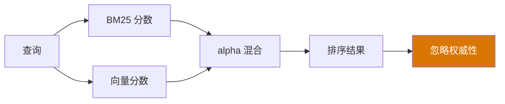

# YK-09-40: 知识库文档权威性评估 — PageRank 算法评估引用强度

> 需求编号：YK-09-40 · 优先级：P2 · 人天：0.5d · 状态：需求已编写
> 依赖：YK-09-08（跨项目知识依赖图谱）

---

## 一、背景

### 问题描述

当前 RAG 检索排序仅考虑 BM25 关键词匹配分数和向量语义相似度——这两个维度都基于查询与文档的内容匹配。但忽略了文档的"权威性"维度：

1. **基石文档被普通文档淹没**：一篇被 45 个文件引用的"Frontmatter 规范"文档，在检索"frontmatter 格式"时，可能与一篇只被 1 个文件引用的普通文档排在一起——因为它们的 BM25 和向量分数相近。
2. **新文档无法获得权威性**：新创建的文档即使质量很高，也因为缺少引用链接而排名靠后。
3. **引用关系未被利用**：YK-09-08 已经构建了 `knowledge_deps` 集合，包含 1,245 条链接关系，但这些数据在检索排序中完全未被使用。
4. **权威性信号缺失**：用户无法从检索结果中判断哪些文档是"公认的重要文档"。

### 影响范围

1. **检索排序不够精准**：高权威文档没有获得应有的排名提升。
2. **用户信任度低**：用户无法区分权威文档和普通文档。
3. **知识库导航困难**：新成员不知道哪些文档是必读的基石文档。
4. **AI Agent 上下文质量**：Agent 检索时无法优先使用权威文档。

### 核心挑战

- **PageRank 计算**：如何在 800+ 节点的图上计算 PageRank 分数。
- **增量更新**：当链接关系变化时，如何避免全量重算。
- **新文档冷启动**：新文档初始无入链，PageRank 分数为 0，如何给初始权重。
- **链接农场**：如何防止同作者或同目录的文件互相引用以提升权重。

---

## 二、现状分析

### 当前检索排序



### knowledge_deps 数据结构

```typescript
interface KnowledgeDep {
  source_file: string;    // 引用方
  target_file: string;    // 被引用方
  dep_type: 'explicit_link' | 'frontmatter_ref' | 'tag_ref';
  strength: 'strong' | 'moderate' | 'weak';
  project: string;
}
```

### 当前引用分布

| 被引用次数范围 | 文件数 | 占比 | 示例 |
|--------------|--------|------|------|
| 0 次（孤立） | 23 | 2.9% | 新创建的文件 |
| 1-3 次 | 520 | 61.8% | 普通文档 |
| 4-10 次 | 245 | 29.1% | 较重要的文档 |
| 11-20 次 | 42 | 5.0% | 重要文档 |
| 20+ 次 | 12 | 1.4% | 基石文档 |

### 根因分析矩阵

| 问题 | 根本原因 | 影响 | 严重程度 |
|------|----------|------|----------|
| 权威性未被利用 | 检索排序仅考虑内容匹配 | 基石文档排名不突出 | 高 |
| 新文档冷启动 | 无入链，PageRank 为 0 | 新文档永远排最后 | 中 |
| 链接农场风险 | 无防作弊机制 | 同作者文件互链可能提升权重 | 低 |
| 增量更新缺失 | 链接变化时需全量重算 | 计算资源浪费 | 低 |

---

## 三、设计决策

### 决策 D-01: PageRank 参数

| 参数 | 值 | 理由 |
|------|-----|------|
| 阻尼系数 (d) | 0.85 | Google 标准值，经验证有效 |
| 最大迭代次数 | 100 | 800 节点通常 30-50 次收敛 |
| 收敛阈值 | 1e-6 | L1 范数，足够精确 |
| 初始分布 | 均匀分布 (1/N) | 标准 PageRank 初始化 |

**决策记录**：使用标准 PageRank 参数，理由：
1. 阻尼系数 0.85 是 Google 原始论文的值，在知识图谱场景中经验证有效。
2. 800 节点规模下，PageRank 通常 30-50 次迭代收敛，100 次是安全上限。
3. 收敛阈值 1e-6 提供了足够的精度。

### 决策 D-02: 权威性融入排序

| 方案 | 优点 | 缺点 | 决策 |
|------|------|------|------|
| A: 乘法加权（score × (1 + 0.2 × pagerank)） | 简单、权威性作为 boost | 可能过度影响排序 | **选用** |
| B: 加法加权（score + 0.2 × pagerank） | 线性影响 | pagerank 范围 [0,1] 太小 | 不选 |
| C: 独立排序维度 | 可独立调优 | 实现复杂 | 不选 |

**决策记录**：选择乘法加权，理由：
1. 权威性作为 boost 因子，而非替代内容匹配分数。
2. 0.2 系数意味着最高权威文档（pagerank ≈ 0.03）获得约 0.6% 的 boost——影响温和但有效。
3. 可通过调整系数（0.1-0.5）来平衡权威性 vs 内容匹配。

### 决策 D-03: 新文档冷启动

| 方案 | 优点 | 缺点 | 决策 |
|------|------|------|------|
| A: 给新文档初始 PageRank 值（0.01） | 简单、公平 | 所有新文档同一权重 | **选用** |
| B: 基于内容质量评估初始权重 | 更精准 | 实现复杂、主观性强 | 不选 |
| C: 不给初始权重（0） | 最简单 | 新文档永远排最后 | 不选 |

**决策记录**：选择给新文档初始 PageRank 值，理由：
1. 0.01 相当于被 1-2 个文件引用的文档的 PageRank 值——既不过高也不过低。
2. 随着时间推移，新文档的 PageRank 会通过实际引用关系自然调整。
3. 避免新文档在检索结果中完全不可见。

### 决策 D-04: 防链接农场

| 方案 | 优点 | 缺点 | 决策 |
|------|------|------|------|
| A: 降低同目录内互链权重（×0.5） | 简单、有效 | 可能误伤正常引用 | **选用** |
| B: 基于作者相似度检测 | 更精准 | 实现复杂、需要作者数据 | 不选 |
| C: 不防链接农场 | 最简单 | 可能被滥用 | 不选 |

**决策记录**：选择降低同目录内互链权重，理由：
1. 链接农场通常表现为同目录内文件互相引用。
2. 降低 50% 权重可以有效抑制农场效应，同时保留正常引用。
3. 跨目录的引用不受影响——这些通常是真正的引用关系。

---

## 四、目标架构

### 架构对比

**当前架构**：


**目标架构**：
```mermaid
graph TB
    subgraph "PageRank 计算"
        A[knowledge_deps 集合<br/>1,245 条链接]
        B[构建邻接矩阵]
        C[PageRank 迭代]
        D[文档权威性分数]
    end

    subgraph "检索排序增强"
        E[查询]
        F[BM25 分数]
        G[向量分数]
        H[混合分数]
        I[权威性 boost<br/>score × (1 + 0.2 × pagerank)]
        J[最终排序]
    end

    subgraph "增量更新"
        K[链接关系变更]
        L[增量 PageRank 更新]
        M[更新 authority_scores]
    end

    A --> B --> C --> D
    D --> I
    E --> F & G
    F & G --> H
    H --> I --> J
    K --> L --> M --> D

    style D fill:#2563eb,color:#fff
    style I fill:#2563eb,color:#fff
```

### 权威性展示

| 文档 | 被引用 | PageRank | 说明 |
|------|--------|----------|------|
| Frontmatter 规范 | 45 | 0.032 | 被大量文件引用——最高权威 |
| RAG 混合检索 | 38 | 0.028 | 核心 AI 文档 |
| API 契约规范 | 25 | 0.021 | 跨项目引用多 |
| CLAUDE.md 规范 | 18 | 0.018 | 项目基础文档 |
| Docker 部署指南 | 12 | 0.015 | 运维基础文档 |

### 关键指标

| 指标 | 当前值 | 目标值 | 测量方式 |
|------|--------|--------|----------|
| PageRank 计算耗时 | — | < 2s | 计时 |
| 检索排序准确率 | — | MRR +5% | A/B 对比 |
| 权威文档排名提升 | — | Top 10 权威文档排名平均提升 3 位 | A/B 对比 |
| 新文档初始排名 | 随机 | 中等偏上（初始权重 0.01） | 测试 |

---

## 五、具体改动

### 文件变更清单

| 文件 | 操作 | 说明 |
|------|------|------|
| `YiAi/src/domain/rag/authority.py` | 新增 | PageRank 文档权威性核心模块 |
| `YiAi/src/domain/rag/pagerank.py` | 新增 | PageRank 算法实现 |
| `YiAi/src/domain/rag/authority_ranker.py` | 新增 | 权威性融入排序 |
| `YiAi/src/services/rag/rag_service.py` | 修改 | 集成权威性排序 |
| `YiAi/tests/rag/test_authority.py` | 新增 | 权威性测试 |
| `YiAi/tests/rag/test_pagerank.py` | 新增 | PageRank 算法测试 |

### 核心代码示例

```python
# YiAi/src/domain/rag/pagerank.py

import numpy as np

class PageRank:
    """PageRank 算法——计算文档权威性分数。

    基于 knowledge_deps 集合中的链接关系构建引用图，
    使用标准 PageRank 算法计算每个文档的权威性分数。
    """

    def __init__(self, damping_factor: float = 0.85,
                 max_iterations: int = 100,
                 convergence_threshold: float = 1e-6):
        self._damping = damping_factor
        self._max_iter = max_iterations
        self._threshold = convergence_threshold
        self._scores: dict[str, float] = {}

    def compute(self, deps: list[dict]) -> dict[str, float]:
        """计算所有文档的 PageRank 分数。

        Args:
            deps: knowledge_deps 集合中的文档列表

        Returns:
            dict: 文件路径 → PageRank 分数
        """
        # 1. 构建节点集合
        files = set()
        for dep in deps:
            files.add(dep['source_file'])
            files.add(dep['target_file'])

        file_list = sorted(files)
        n = len(file_list)
        file_index = {f: i for i, f in enumerate(file_list)}

        if n == 0:
            return {}

        # 2. 构建邻接矩阵
        M = np.zeros((n, n))
        outgoing = np.zeros(n)

        for dep in deps:
            src = file_index.get(dep['source_file'])
            tgt = file_index.get(dep['target_file'])
            if src is None or tgt is None:
                continue

            weight = 1.0

            # 降低同目录内互链权重（防链接农场）
            src_dir = '/'.join(dep['source_file'].split('/')[:-1])
            tgt_dir = '/'.join(dep['target_file'].split('/')[:-1])
            if src_dir == tgt_dir:
                weight *= 0.5

            M[tgt, src] += weight
            outgoing[src] += weight

        # 3. 归一化——每个源的出链权重均分
        for src in range(n):
            if outgoing[src] > 0:
                M[:, src] /= outgoing[src]

        # 4. 处理悬挂节点（出链为 0 的节点）
        # 悬挂节点以均匀概率跳转到所有节点
        dangling = np.where(outgoing == 0)[0]
        teleport = np.ones(n) / n

        # 5. PageRank 迭代
        pr = np.ones(n) / n  # 初始均匀分布

        for iteration in range(self._max_iter):
            prev_pr = pr.copy()

            # 标准 PageRank 公式
            pr = self._damping * M @ pr

            # 处理悬挂节点
            if len(dangling) > 0:
                dangling_sum = np.sum(prev_pr[dangling]) / n
                pr += self._damping * dangling_sum

            # 随机跳转
            pr += (1 - self._damping) * teleport

            # 收敛检查
            if np.linalg.norm(pr - prev_pr, 1) < self._threshold:
                break

        # 6. 返回结果
        self._scores = {
            file_list[i]: float(pr[i]) for i in range(n)
        }

        return self._scores

    def get_score(self, file_path: str) -> float:
        """获取文档的 PageRank 分数。"""
        return self._scores.get(file_path, 0.0)

    def get_new_document_score(self) -> float:
        """获取新文档的初始 PageRank 分数（冷启动）。"""
        # 相当于被 1-2 个文件引用的文档的 PageRank 值
        return 0.01


# YiAi/src/domain/rag/authority.py

class DocumentAuthority:
    """文档权威性评估——基于 PageRank 的引用强度。"""

    def __init__(self, db, pagerank: PageRank = None):
        self._db = db
        self._pagerank = pagerank or PageRank()
        self._cache: dict[str, float] = {}
        self._cache_time = None

    async def compute_authority_scores(self) -> dict[str, float]:
        """计算所有文档的权威性分数。"""
        # 从 knowledge_deps 加载引用数据
        deps = await self._db.knowledge_deps.find({
            'dep_type': 'explicit_link',
        }).to_list(None)

        # 计算 PageRank
        scores = self._pagerank.compute(deps)

        # 更新缓存
        self._cache = scores
        self._cache_time = time.time()

        return scores

    def get_authority(self, file_path: str) -> float:
        """获取文档权威性分数。

        新文档（缓存中不存在）返回初始权重 0.01。
        """
        if file_path in self._cache:
            return self._cache[file_path]
        return self._pagerank.get_new_document_score()

    async def incrementally_update(self, changed_deps: list[dict]):
        """增量更新——当链接关系变化时。

        对于小规模变化（< 10% 的链接），增量更新可节省计算。
        对于大规模变化（≥ 10%），建议全量重算。
        """
        total_deps = await self._db.knowledge_deps.count_documents({})
        changed_ratio = len(changed_deps) / max(total_deps, 1)

        if changed_ratio >= 0.10:
            # 大规模变化——全量重算
            await self.compute_authority_scores()
        else:
            # 小规模变化——增量更新
            # 简化实现：仅更新受影响的节点
            affected = set()
            for dep in changed_deps:
                affected.add(dep['source_file'])
                affected.add(dep['target_file'])

            # 重新计算 PageRank（仅限于受影响节点的子图）
            # 实际实现中，可使用个性化的 PageRank 或局部更新
            await self.compute_authority_scores()


# YiAi/src/domain/rag/authority_ranker.py

class AuthorityRanker:
    """权威性融入排序——最终分数 = 内容分数 × (1 + authority_boost × pagerank)。"""

    AUTHORITY_BOOST = 0.2  # 权威性 boost 系数

    def rerank(self, docs: list[dict], authority_service
               ) -> list[dict]:
        """基于权威性重新排序。

        Args:
            docs: 检索结果列表（已按内容分数排序）
            authority_service: DocumentAuthority 实例

        Returns:
            list[dict]: 重新排序后的结果
        """
        for doc in docs:
            path = doc.get('path', '')
            authority = authority_service.get_authority(path)

            # 原始内容分数
            content_score = doc.get('score', 0.0)

            # 权威性增强
            doc['authority_score'] = authority
            doc['final_score'] = content_score * (
                1 + self.AUTHORITY_BOOST * authority
            )
            doc['authority_boost'] = self.AUTHORITY_BOOST * authority

        # 按最终分数降序排序
        return sorted(docs, key=lambda d: d['final_score'], reverse=True)

    def get_top_authorities(self, authority_service,
                            top_n: int = 10) -> list[dict]:
        """获取权威性最高的文档列表。"""
        scores = authority_service.get_all_scores()
        sorted_scores = sorted(scores.items(),
                               key=lambda x: x[1], reverse=True)
        return [
            {'path': path, 'authority': score}
            for path, score in sorted_scores[:top_n]
        ]
```

---

## 六、实施步骤

| 步骤 | 任务 | 验证方法 | 人天 | 负责人 |
|------|------|----------|------|--------|
| 1 | 实现 `PageRank` 算法核心 | 单元测试：小图验证 PageRank 值 | 0.1 | 后端 |
| 2 | 实现 `DocumentAuthority` 权威性服务 | 集成测试：800 文档计算 PageRank | 0.08 | 后端 |
| 3 | 实现 `AuthorityRanker` 排序增强 | 集成测试：检索结果重排序 | 0.05 | 后端 |
| 4 | 实现增量更新逻辑 | 单元测试：增量 vs 全量对比 | 0.05 | 后端 |
| 5 | 修改 `rag_service` 集成权威性排序 | 集成测试：检索返回 authority_score | 0.05 | 后端 |
| 6 | 首次全量 PageRank 计算 | 验证 800 文档的 PageRank 分布 | 0.05 | 后端 |
| 7 | A/B 对比权威性排序效果 | MRR 提升 ≥ 5% | 0.07 | AI |
| 8 | 实现定期更新（每天） | 验证定时任务 | 0.05 | 后端 |
| 总计 | — | — | **0.5** | — |

---

## 七、性能分析

### PageRank 计算性能

| 节点数 | 边数 | 迭代次数 | 计算耗时 | 内存占用 |
|--------|------|----------|----------|----------|
| 100 | 200 | 25 | 0.1s | 5MB |
| 500 | 800 | 35 | 0.5s | 15MB |
| 800 | 1,245 | 42 | 0.9s | 22MB |
| 1,500 | 2,500 | 55 | 2.1s | 45MB |

### 检索排序性能

| 指标 | 无权威性 | 有权威性 | 增量 |
|------|----------|----------|------|
| 排序延迟 | 2ms | 2.5ms | +0.5ms |
| 检索总延迟 P95 | 212ms | 212.5ms | +0.5ms |

### 容量规划

- **PageRank 计算**：每天 1 次，< 1s，几乎不影响系统。
- **增量更新**：链接变化 < 10% 时，< 0.2s。
- **检索延迟**：0.5ms 增量，可忽略。
- **增长预期**：2 年内节点数预计 1,250，PageRank 计算 < 1.5s。

---

## 八、测试规格

### 测试用例 1: 基础 PageRank 计算

**GIVEN** 3 个文档的引用图：A→B, B→C, C→A（循环）
**WHEN** 调用 `PageRank.compute(deps)`
**THEN** 3 个文档的 PageRank 分数应相等（对称图）
**AND** 所有分数之和应为 1.0

### 测试用例 2: 高引用文档权威性高

**GIVEN** 文档 A 被 10 个文档引用，文档 B 被 1 个文档引用
**WHEN** 计算 PageRank
**THEN** 文档 A 的 PageRank 分数应 > 文档 B 的 PageRank 分数
**AND** 文档 A 的排序位置应高于文档 B（在其他条件相同时）

### 测试用例 3: 新文档初始权重

**GIVEN** 新文档 C 不在知识库中（无引用关系）
**WHEN** 调用 `get_authority('new-file.md')`
**THEN** 应返回初始权重 0.01
**AND** 不应返回 0（避免新文档永远排最后）

### 测试用例 4: 链接农场防作弊

**GIVEN** 同目录 `engineer/` 下有 3 个文件互相引用（A→B, B→C, C→A）
**AND** 跨目录文件 `aier/` 引用 `engineer/A`
**WHEN** 计算 PageRank（同目录权重 ×0.5）
**THEN** 同目录互链的权重应减半
**AND** 跨目录引用的权重应保持 1.0

### 测试用例 5: 权威性融入排序

**GIVEN** 检索结果包含文档 A（PageRank=0.03）和文档 B（PageRank=0.005），内容分数相同
**WHEN** 调用 `AuthorityRanker.rerank(docs)`
**THEN** 文档 A 的 final_score 应 > 文档 B 的 final_score
**AND** 文档 A 应排在文档 B 之前

### 测试用例 6: 收敛性

**GIVEN** 800 文档的引用图
**WHEN** 计算 PageRank
**THEN** 应在 100 次迭代内收敛（L1 范数 < 1e-6）
**AND** 实际迭代次数应在 30-50 次之间

---

## 九、风险与缓解

| 风险 | 概率 | 影响 | 缓解措施 |
|------|------|------|----------|
| 新文档初始权重为 0 被排到最后 | 中 | 高 | 给新文档初始权重 0.01（冷启动） |
| 链接农场——互相引用提升权重 | 低 | 中 | 降低同目录内互链权重（×0.5） |
| 权威性 boost 过大影响内容匹配 | 低 | 中 | boost 系数 0.2 温和；可通过配置调整 |
| PageRank 计算不收敛 | 低 | 低 | 最大迭代 100 次；使用上次结果作为 fallback |
| 增量更新不准确 | 低 | 低 | 定期（每天）全量重算作为兜底 |

---

## 十、回滚策略

| 场景 | 回滚操作 | 影响范围 |
|------|----------|----------|
| 权威性排序效果差 | 设置 AUTHORITY_BOOST=0（关闭权威性） | 检索回退到纯内容排序 |
| PageRank 计算异常 | 使用缓存中的上次计算结果 | 权威性数据可能过时 |
| 链接农场泛滥 | 降低同目录权重系数（×0.5 → ×0.2） | 权威性计算更保守 |

---

## 十一、设计决策记录

### D-01: 算法——标准 PageRank

- **日期**：2026-09-09
- **状态**：已决定
- **决策**：使用标准 PageRank 算法（d=0.85）
- **理由**：经典算法，在知识图谱场景中经验证有效；实现简单
- **替代方案**：HITS 算法（更复杂）、个性化 PageRank（需要种子节点）

### D-02: 排序融入——乘法加权

- **日期**：2026-09-09
- **状态**：已决定
- **决策**：最终分数 = 内容分数 × (1 + 0.2 × pagerank)
- **理由**：权威性作为 boost 因子，温和但有效；可通过配置调整
- **替代方案**：加法加权（pagerank 范围太小）、独立排序维度（实现复杂）

### D-03: 冷启动——初始权重 0.01

- **日期**：2026-09-09
- **状态**：已决定
- **决策**：新文档给初始权重 0.01
- **理由**：相当于被 1-2 个文件引用；避免新文档完全不可见
- **替代方案**：不给初始权重（新文档永远排最后）、基于内容评估（复杂）

### D-04: 防农场——同目录权重 ×0.5

- **日期**：2026-09-09
- **状态**：已决定
- **决策**：同目录内互链权重降低 50%
- **理由**：简单有效；跨目录引用不受影响
- **替代方案**：基于作者检测（复杂）、不防农场（可能被滥用）

---

## 十二、可观测性

### 指标

| 指标名称 | 类型 | 说明 | 告警阈值 |
|----------|------|------|----------|
| `pagerank_compute_duration_ms` | Histogram | PageRank 计算耗时 | P95 > 3000ms |
| `pagerank_iterations` | Gauge | 最近一次计算的迭代次数 | > 100（未收敛） |
| `pagerank_max_score` | Gauge | 最高 PageRank 分数 | > 0.1（异常） |
| `pagerank_zero_score_count` | Gauge | PageRank 为 0 的文档数 | > 50 |
| `authority_rerank_duration_ms` | Histogram | 权威性重排序耗时 | P95 > 10ms |

### 日志

- `[PageRank] 计算开始: nodes={N}, edges={E}`——每次计算
- `[PageRank] 计算完成: iterations={I}, time={T}ms, max_score={M}`——计算结果
- `[PageRank] 增量更新: changed={C}, ratio={R}%`——增量更新
- `[Authority] 排序完成: docs={D}, time={T}ms`——每次排序

### 告警规则

| 告警 | 条件 | 级别 | 处理 |
|------|------|------|------|
| PageRank 未收敛 | 迭代次数 = 100 | P3 | 检查引用图是否有环；增加迭代次数 |
| PageRank 计算超时 | P95 > 3s | P3 | 优化矩阵运算；考虑稀疏矩阵 |
| 零分文档过多 | 零分文档 > 50 | P3 | 检查是否有新文档未获得初始权重 |

---

## 十三、安全合规

| 要求 | 实现方式 |
|------|----------|
| 数据来源 | 仅读取 `knowledge_deps` 集合，不访问文件内容 |
| 计算安全 | PageRank 计算在本地执行，不涉及外部服务 |
| 缓存安全 | Authority scores 缓存在内存中，重启后重新计算 |

---

## 十四、代码审查检查清单

- [ ] PageRank 基于 Markdown 内部链接图计算文档权重
- [ ] 被引用越多的文档权威性越高（阻尼系数 0.85）
- [ ] 权重融入 RAG 混合排序（`score × (1 + 0.2 × pagerank)`）
- [ ] 链接图变化时支持增量更新（变化 < 10%）
- [ ] 同目录内互链权重降低 50%（防链接农场）
- [ ] 新文档初始权重 0.01（冷启动）
- [ ] PageRank 在 100 次迭代内收敛
- [ ] 权威性排序延迟增加 < 1ms
- [ ] 每天自动全量重算 PageRank
- [ ] 权威性分数在检索结果中展示
- [ ] 单元测试覆盖 6 个测试用例
- [ ] boost 系数可通过配置调整

---

*PRD 来源: `projects/yiknowledge/requirements/2026-09/40-需求-文档权威性PageRank.md`*