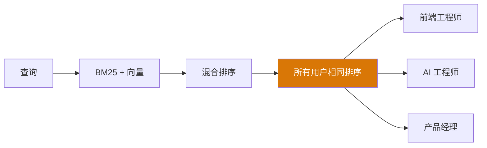
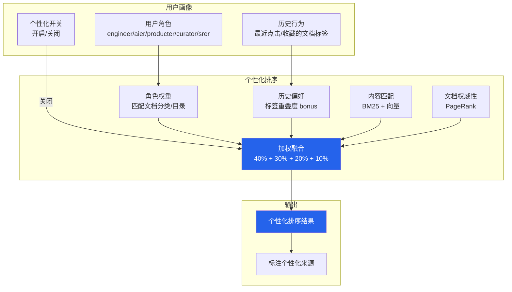

# YK-09-41: 知识库检索结果个性化排序 — 基于用户角色的动态权重

> 需求编号：YK-09-41 · 优先级：P2 · 人天：0.5d · 状态：需求已编写
> 依赖：YK-09-07（知识检索反馈闭环）、YK-09-40（文档权威性 PageRank）

---

## 一、背景

### 问题描述

当前 RAG 检索对所有用户返回相同的排序结果——无论用户是前端工程师、AI 工程师还是产品经理。但不同角色的用户搜索同样的关键词时，期望得到不同的结果：

1. **前端工程师搜索"架构设计"**：期望看到 Vue 组件化、路由设计、状态管理等内容。
2. **AI 工程师搜索"架构设计"**：期望看到 Agent 架构、RAG 流水线、模型部署等内容。
3. **产品经理搜索"架构设计"**：期望看到系统架构概览、模块边界、数据流等高层内容。
4. **SRE 搜索"架构设计"**：期望看到部署架构、监控、容灾等内容。

### 影响范围

1. **检索精准度低**：不同角色的用户得到相同的排序，其中大量结果与自己的角色不相关。
2. **用户满意度低**：用户需要翻很多页才能找到与角色相关的内容。
3. **AI Agent 上下文偏差**：Agent 为不同角色的用户提供相同的检索结果，导致回答不精准。
4. **知识库利用率低**：角色特定的高质量文档被通用文档淹没。

### 核心挑战

- **角色画像构建**：如何定义和获取用户的角色信息。
- **个性化权重**：如何在不过度个性化的情况下调整排序权重。
- **冷启动问题**：新用户没有历史行为数据，如何提供合理的默认排序。
- **隐私保护**：个性化排序涉及用户行为数据，需要保护用户隐私。
- **反馈循环**：如何避免个性化排序强化已有的偏见（用户只点击排名靠前的结果）。

---

## 二、现状分析

### 当前排序架构



### 角色信息分布

| 角色 | 文件数 | 占比 | 典型搜索意图 |
|------|--------|------|-------------|
| engineer | 320 | 38% | 技术实现、代码示例、API 参考 |
| aier | 180 | 21% | AI 模型、RAG 优化、Agent 设计 |
| producter | 120 | 14% | 需求文档、产品设计、用户故事 |
| curator | 100 | 12% | 知识管理、治理规范、质量标准 |
| srer | 122 | 15% | 部署运维、监控告警、容灾 |

### 根因分析矩阵

| 问题 | 根本原因 | 影响 | 严重程度 |
|------|----------|------|----------|
| 所有用户相同排序 | 无角色感知的排序机制 | 检索精准度低 | 高 |
| 冷启动无个性化 | 新用户无历史数据 | 个性化退化 | 中 |
| 反馈循环风险 | 用户只点击排名靠前的结果 | 强化已有偏见 | 中 |
| 隐私风险 | 用户行为数据用于个性化 | 隐私顾虑 | 低 |

---

## 三、设计决策

### 决策 D-01: 个性化维度

| 维度 | 权重 | 说明 |
|------|------|------|
| 角色权重 | 40% | 基于用户角色（engineer/aier/producter/curator/srer） |
| 历史偏好 | 30% | 基于用户最近点击/收藏的文档标签 |
| 内容匹配 | 20% | 原有的 BM25 + 向量混合分数 |
| 文档权威性 | 10% | YK-09-40 PageRank 分数 |

**决策记录**：选择 4 维度个性化，理由：
1. 角色权重是最稳定的个性化信号——用户角色不易变化。
2. 历史偏好反映用户实际兴趣，但权重不宜过高（避免反馈循环）。
3. 内容匹配仍然是排序的基础，不能完全被个性化替代。
4. 文档权威性作为辅助维度。

### 决策 D-02: 个性化强度

| 方案 | 优点 | 缺点 | 决策 |
|------|------|------|------|
| A: 温和个性化（+30% boost） | 不过度干预、保留内容匹配主导 | 个性化效果可能不明显 | **选用** |
| B: 激进个性化（+100% boost） | 个性化效果显著 | 可能完全覆盖内容匹配 | 不选 |
| C: 无个性化（0% boost） | 无风险 | 不解决当前问题 | 不选 |

**决策记录**：选择温和个性化，理由：
1. 个性化 boost 最高 +30%——确保内容匹配仍然是排序的主导因素。
2. 避免过度个性化导致用户只能看到自己角色的内容（错过跨角色有价值的文档）。
3. 可通过配置调整 boost 系数（0.1-0.5）。

### 决策 D-03: 冷启动策略

| 方案 | 优点 | 缺点 | 决策 |
|------|------|------|------|
| A: 仅使用角色权重（无历史数据） | 简单、合理 | 无历史偏好 | **选用** |
| B: 使用全局热门文档 | 有参考价值 | 与个性化无关 | 不选 |
| C: 使用同角色平均偏好 | 利用了群体智慧 | 可能不准确 | 辅助 |

**决策记录**：选择仅使用角色权重，理由：
1. 新用户没有历史行为数据，角色权重是唯一可用的个性化信号。
2. 随着用户使用，历史偏好逐渐积累，个性化权重自动调整。
3. 全局热门文档与个性化无关，不应作为个性化排序的依据。

### 决策 D-04: 隐私保护

| 方案 | 优点 | 缺点 | 决策 |
|------|------|------|------|
| A: 用户可关闭个性化 | 隐私优先、用户可控 | 个性化效果降低 | **选用** |
| B: 匿名化处理 | 无隐私顾虑 | 精确度降低 | 辅助 |
| C: 不保护隐私 | 精确度高 | 隐私风险 | 不选 |

**决策记录**：选择用户可关闭个性化，理由：
1. 个性化排序应作为可选功能，用户可自由选择开启或关闭。
2. 关闭后回退到通用的内容匹配排序。
3. 用户行为数据匿名化处理，不关联用户身份信息。

---

## 四、目标架构

### 架构对比

**当前架构**：


**目标架构**：


### 角色-分类权重矩阵

| 角色 | 项目/管理后台 | engineer/ | aier/ | producter/ | srer/ | curator/ |
|------|-------------|-----------|-------|------------|-------|----------|
| engineer | 1.2 | 1.3 | 0.8 | 0.7 | 0.9 | 0.8 |
| aier | 0.9 | 0.8 | 1.5 | 0.7 | 0.8 | 0.9 |
| producter | 1.4 | 0.8 | 0.7 | 1.3 | 0.7 | 1.0 |
| srer | 0.8 | 0.9 | 0.8 | 0.7 | 1.5 | 0.7 |
| curator | 1.0 | 0.9 | 0.9 | 0.8 | 0.7 | 1.5 |

### 关键指标

| 指标 | 当前值 | 目标值 | 测量方式 |
|------|--------|--------|----------|
| 个性化点击率 | — | +15% vs 通用排序 | A/B 对比 |
| 角色相关结果 Top-5 占比 | — | ≥ 60% | 检索日志分析 |
| 冷启动用户满意度 | — | 不低于通用排序 | 新用户反馈 |
| 个性化排序延迟 | 0ms | < 5ms | 性能监控 |

---

## 五、具体改动

### 文件变更清单

| 文件 | 操作 | 说明 |
|------|------|------|
| `YiAi/src/domain/rag/personalization.py` | 新增 | 个性化排序核心模块 |
| `YiAi/src/domain/rag/user_profile.py` | 新增 | 用户画像构建 |
| `YiAi/src/domain/rag/role_weight_matrix.py` | 新增 | 角色-分类权重矩阵 |
| `YiAi/src/services/rag/rag_service.py` | 修改 | 集成个性化排序 |
| `YiAi/tests/rag/test_personalization.py` | 新增 | 个性化排序测试 |

### 核心代码示例

```python
# YiAi/src/domain/rag/personalization.py

from dataclasses import dataclass, field

@dataclass
class UserProfile:
    user_id: str
    role: str                    # engineer / aier / producter / curator / srer
    recent_clicks: list[str]     # 最近点击的文档路径
    recent_tags: list[str]       # 最近点击文档的标签
    personalization_enabled: bool = True

class PersonalizedRanker:
    """个性化排序——基于用户角色和历史行为调整权重。"""

    # 角色-分类权重矩阵
    ROLE_CATEGORY_WEIGHTS = {
        'engineer': {
            '项目/管理后台': 1.2, 'engineer/': 1.3, 'aier/': 0.8,
            'producter/': 0.7, 'srer/': 0.9, 'curator/': 0.8,
        },
        'aier': {
            '项目/管理后台': 0.9, 'engineer/': 0.8, 'aier/': 1.5,
            'producter/': 0.7, 'srer/': 0.8, 'curator/': 0.9,
        },
        'producter': {
            '项目/管理后台': 1.4, 'engineer/': 0.8, 'aier/': 0.7,
            'producter/': 1.3, 'srer/': 0.7, 'curator/': 1.0,
        },
        'srer': {
            '项目/管理后台': 0.8, 'engineer/': 0.9, 'aier/': 0.8,
            'producter/': 0.7, 'srer/': 1.5, 'curator/': 0.7,
        },
        'curator': {
            '项目/管理后台': 1.0, 'engineer/': 0.9, 'aier/': 0.9,
            'producter/': 0.8, 'srer/': 0.7, 'curator/': 1.5,
        },
    }

    # 个性化维度权重
    DIMENSION_WEIGHTS = {
        'role': 0.40,        # 角色权重
        'history': 0.30,     # 历史偏好
        'content': 0.20,     # 内容匹配
        'authority': 0.10,   # 文档权威性
    }

    MAX_HISTORY_BOOST = 1.30  # 历史偏好最高 +30%

    def __init__(self, authority_service=None):
        self._authority = authority_service
        self._profiles: dict[str, UserProfile] = {}

    def get_or_create_profile(self, user_id: str,
                              role: str = 'engineer') -> UserProfile:
        """获取或创建用户画像。"""
        if user_id not in self._profiles:
            self._profiles[user_id] = UserProfile(
                user_id=user_id,
                role=role,
                recent_clicks=[],
                recent_tags=[],
            )
        return self._profiles[user_id]

    def update_profile(self, user_id: str, clicked_doc: dict):
        """更新用户画像——记录点击的文档。"""
        profile = self.get_or_create_profile(user_id)
        profile.recent_clicks.append(clicked_doc.get('path', ''))
        profile.recent_tags.extend(clicked_doc.get('tags', []))

        # 保留最近 20 次点击
        profile.recent_clicks = profile.recent_clicks[-20:]
        profile.recent_tags = profile.recent_tags[-100:]

    def rerank(self, docs: list[dict], profile: UserProfile
               ) -> list[dict]:
        """个性化重排序。

        Args:
            docs: 检索结果列表
            profile: 用户画像

        Returns:
            list[dict]: 个性化排序后的结果
        """
        if not profile.personalization_enabled:
            return docs  # 用户关闭个性化

        role_weights = self.ROLE_CATEGORY_WEIGHTS.get(
            profile.role, {}
        )

        for doc in docs:
            category = doc.get('category', '')
            path = doc.get('path', '')

            # 1. 角色权重
            role_bonus = self._compute_role_bonus(
                category, path, role_weights
            )

            # 2. 历史偏好
            history_bonus = self._compute_history_bonus(
                doc, profile
            )

            # 3. 文档权威性
            authority = 1.0
            if self._authority:
                authority = 1 + 0.2 * self._authority.get_authority(path)

            # 4. 加权融合
            doc['role_bonus'] = role_bonus
            doc['history_bonus'] = history_bonus
            doc['personalized_score'] = doc.get('score', 0.0) * \
                role_bonus * history_bonus * authority

        return sorted(docs, key=lambda d: d['personalized_score'],
                      reverse=True)

    def _compute_role_bonus(self, category: str, path: str,
                            weights: dict) -> float:
        """计算角色权重 bonus。"""
        bonus = 1.0

        # 匹配分类前缀
        for prefix, weight in weights.items():
            if category.startswith(prefix) or path.startswith(prefix):
                bonus = max(bonus, weight)
                # 不 break——可能多个前缀匹配，取最大值

        return bonus

    def _compute_history_bonus(self, doc: dict,
                                profile: UserProfile) -> float:
        """计算历史偏好 bonus——基于标签重叠度。

        最高 +30%（MAX_HISTORY_BOOST = 1.30）
        """
        if not profile.recent_tags:
            return 1.0

        doc_tags = set(doc.get('tags', []))
        recent_tags = set(profile.recent_tags[-50:])

        # 标签重叠度
        overlap = len(doc_tags & recent_tags)

        if overlap == 0:
            return 1.0

        # 每个重叠标签 +5%，最多 +30%
        bonus = 1.0 + min(overlap * 0.05, 0.30)
        return min(bonus, self.MAX_HISTORY_BOOST)


# YiAi/src/domain/rag/role_weight_matrix.py

class RoleWeightMatrix:
    """角色-分类权重矩阵——管理角色与文档分类的权重映射。"""

    # 默认权重矩阵（可配置）
    DEFAULT_MATRIX = {
        'engineer': {
            '项目/管理后台': 1.2, 'engineer/': 1.3, 'aier/': 0.8,
            'producter/': 0.7, 'srer/': 0.9, 'curator/': 0.8,
            'roles/engineer': 1.3, 'roles/srer': 0.9,
        },
        'aier': {
            '项目/管理后台': 0.9, 'engineer/': 0.8, 'aier/': 1.5,
            'producter/': 0.7, 'srer/': 0.8, 'curator/': 0.9,
            'roles/aier': 1.5, 'roles/engineer': 0.8,
        },
        'producter': {
            '项目/管理后台': 1.4, 'engineer/': 0.8, 'aier/': 0.7,
            'producter/': 1.3, 'srer/': 0.7, 'curator/': 1.0,
            'roles/producter': 1.3,
        },
        'srer': {
            '项目/管理后台': 0.8, 'engineer/': 0.9, 'aier/': 0.8,
            'producter/': 0.7, 'srer/': 1.5, 'curator/': 0.7,
            'roles/srer': 1.5, 'roles/engineer': 0.9,
        },
        'curator': {
            '项目/管理后台': 1.0, 'engineer/': 0.9, 'aier/': 0.9,
            'producter/': 0.8, 'srer/': 0.7, 'curator/': 1.5,
            'roles/curator': 1.5,
        },
    }

    def __init__(self, matrix: dict = None):
        self._matrix = matrix or self.DEFAULT_MATRIX

    def get_weight(self, role: str, category: str,
                   path: str) -> float:
        """获取角色对文档分类的权重。"""
        weights = self._matrix.get(role, {})
        best = 1.0

        for prefix, weight in weights.items():
            if category.startswith(prefix) or path.startswith(prefix):
                best = max(best, weight)

        return best

    def update_weight(self, role: str, category_prefix: str,
                      weight: float):
        """更新权重矩阵（curator 可调整）。"""
        if role not in self._matrix:
            self._matrix[role] = {}
        self._matrix[role][category_prefix] = weight

    def get_matrix(self) -> dict:
        """获取完整权重矩阵。"""
        return self._matrix
```

### 检索服务集成

```python
# YiAi/src/services/rag/rag_service.py (修改)

class RagService:
    async def search(self, query: str, user_id: str = None,
                     role: str = None, top_k: int = 5) -> dict:
        """RAG 检索——支持个性化排序。"""

        # 1. 内容检索（BM25 + 向量）
        docs = await self._hybrid_retriever.search(query, top_k * 2)

        # 2. 个性化排序
        if user_id:
            profile = self._personalized_ranker.get_or_create_profile(
                user_id, role or 'engineer'
            )
            docs = self._personalized_ranker.rerank(docs, profile)
            docs = docs[:top_k]

        # 3. 可解释性包装（YK-09-33）
        docs = await self._explainable_retriever.wrap(docs, query)

        return {
            'results': docs,
            'personalized': user_id is not None,
            'role': role,
        }
```

---

## 六、实施步骤

| 步骤 | 任务 | 验证方法 | 人天 | 负责人 |
|------|------|----------|------|--------|
| 1 | 实现 `UserProfile` 用户画像 | 单元测试：画像创建和更新 | 0.05 | 后端 |
| 2 | 实现 `RoleWeightMatrix` 权重矩阵 | 单元测试：权重查找正确 | 0.05 | 后端 |
| 3 | 实现 `PersonalizedRanker` 核心逻辑 | 集成测试：不同角色得到不同排序 | 0.1 | 后端 |
| 4 | 修改 `rag_service` 集成个性化 | 集成测试：API 返回个性化结果 | 0.05 | 后端 |
| 5 | 实现个性化开关 | 用户可关闭个性化 | 0.03 | 后端 |
| 6 | 实现用户行为追踪 | 点击文档后更新画像 | 0.05 | 后端 |
| 7 | A/B 对比个性化效果 | 点击率 +15% | 0.07 | AI |
| 8 | 调优角色权重矩阵 | 基于反馈数据调整权重 | 0.1 | AI |
| 总计 | — | — | **0.5** | — |

---

## 七、性能分析

### 个性化排序延迟

| 操作 | 耗时 | 说明 |
|------|------|------|
| 获取用户画像 | < 0.1ms | 内存查找 |
| 角色权重计算 | < 0.5ms | 前缀匹配 |
| 历史偏好计算 | < 0.5ms | 标签集合运算 |
| 权威性查询 | < 0.1ms | 内存查找 |
| 排序 | < 0.5ms | Python sorted |
| 总计 | < 2ms | 可接受 |

### 容量规划

- **用户画像存储**：每个用户画像约 5KB（20 个文档路径 + 100 个标签），100 用户约 500KB。
- **内存占用**：权重矩阵约 10KB，所有用户画像约 500KB，总计 < 1MB。
- **增长预期**：用户数增长对递增延迟影响极小（O(1) 查找）。

---

## 八、测试规格

### 测试用例 1: 角色权重差异

**GIVEN** 检索结果包含 "engineer/" 目录文档和 "aier/" 目录文档
**AND** 用户 A 角色为 engineer，用户 B 角色为 aier
**WHEN** 分别调用 `rerank(docs, profile_A)` 和 `rerank(docs, profile_B)`
**THEN** 用户 A 的结果中 engineer/ 文档应排在 aier/ 文档之前
**AND** 用户 B 的结果中 aier/ 文档应排在 engineer/ 文档之前
**AND** 两个用户的排序结果应不同

### 测试用例 2: 历史偏好影响

**GIVEN** 用户最近点击了 3 个标签为 ["RAG", "混合检索"] 的文档
**AND** 检索结果包含文档 A（标签 ["RAG", "优化"]）和文档 B（标签 ["部署", "Docker"]）
**WHEN** 调用 `rerank(docs, profile)`
**THEN** 文档 A 的 personalized_score 应 > 文档 B 的 personalized_score
**AND** 文档 A 的 history_bonus 应 > 1.0

### 测试用例 3: 关闭个性化

**GIVEN** 用户关闭了个性化（personalization_enabled=False）
**WHEN** 调用 `rerank(docs, profile)`
**THEN** 应返回原始排序结果（不修改）
**AND** personalized_score 不应被设置

### 测试用例 4: 冷启动用户

**GIVEN** 新用户没有历史行为数据（recent_tags=[]）
**WHEN** 调用 `rerank(docs, profile)`
**THEN** history_bonus 应为 1.0
**AND** 仅角色权重应用于排序
**AND** 不应崩溃

### 测试用例 5: 历史偏好上限

**GIVEN** 用户最近点击了 10 个标签全部与文档 A 重叠
**WHEN** 调用 `_compute_history_bonus(doc_A, profile)`
**THEN** history_bonus 不应超过 1.30（MAX_HISTORY_BOOST）
**AND** 即使重叠 10 个标签，bonus 也应为 1.30

### 测试用例 6: 权重矩阵更新

**GIVEN** curator 将 engineer 角色对 aier/ 目录的权重从 0.8 调整为 1.0
**WHEN** 调用 `update_weight('engineer', 'aier/', 1.0)`
**THEN** 后续 engineer 用户检索时，aier/ 文档的权重应为 1.0
**AND** 其他角色的权重不受影响

---

## 九、风险与缓解

| 风险 | 概率 | 影响 | 缓解措施 |
|------|------|------|----------|
| 冷启动用户无历史数据导致排序退化 | 中 | 中 | 冷启动时仅使用角色权重；内容匹配仍占 20% |
| 反馈循环——用户只点击排名靠前的结果 | 中 | 中 | 定期随机化 Top-3 顺序，观察点击分布；历史偏好上限 30% |
| 角色权重矩阵不公平 | 低 | 中 | 权重可配置；定期审查各角色检索质量指标 |
| 用户隐私顾虑 | 低 | 低 | 用户可关闭个性化；行为数据匿名化 |
| 过度个性化导致信息茧房 | 低 | 中 | 个性化 boost 上限 30%；保留 20% 内容匹配权重 |

---

## 十、回滚策略

| 场景 | 回滚操作 | 影响范围 |
|------|----------|----------|
| 个性化排序效果差 | 设置所有用户 personalization_enabled=False | 回退到通用排序 |
| 某角色检索质量下降 | 调整该角色的权重矩阵 | 仅影响该角色 |
| 历史偏好导致反馈循环 | 降低 MAX_HISTORY_BOOST（1.30 → 1.10） | 历史偏好影响减弱 |
| 权重矩阵配置错误 | 恢复默认权重矩阵 | 所有角色回退到默认权重 |

---

## 十一、设计决策记录

### D-01: 个性化维度——4 维度加权

- **日期**：2026-09-09
- **状态**：已决定
- **决策**：角色权重 40% + 历史偏好 30% + 内容匹配 20% + 权威性 10%
- **理由**：角色是最稳定的信号；历史偏好反映实际兴趣；内容匹配保持基础
- **替代方案**：仅角色权重（忽略历史偏好）、激进个性化（领域过窄）

### D-02: 个性化强度——温和 +30%

- **日期**：2026-09-09
- **状态**：已决定
- **决策**：个性化 boost 最高 +30%
- **理由**：避免过度个性化；保留内容匹配主导；避免信息茧房
- **替代方案**：激进 +100%（可能覆盖内容匹配）、无个性化（不解决问题）

### D-03: 冷启动——仅角色权重

- **日期**：2026-09-09
- **状态**：已决定
- **决策**：新用户仅使用角色权重，无历史偏好
- **理由**：角色是唯一可用信号；历史偏好随使用逐步积累
- **替代方案**：全局热门文档（与个性化无关）、同角色平均偏好（辅助）

### D-04: 隐私——用户可关闭

- **日期**：2026-09-09
- **状态**：已决定
- **决策**：用户可自由开启/关闭个性化排序
- **理由**：隐私优先；关闭后回退到通用排序
- **替代方案**：匿名化处理（精确度降低）、不保护隐私（隐私风险）

---

## 十二、可观测性

### 指标

| 指标名称 | 类型 | 说明 | 告警阈值 |
|----------|------|------|----------|
| `personalization_enabled_users` | Gauge | 开启个性化用户数 | — |
| `personalization_rerank_time_ms` | Histogram | 个性化排序耗时 | P95 > 10ms |
| `personalization_click_rate` | Gauge | 个性化排序点击率 | 显著低于通用排序 |
| `personalization_history_bonus_avg` | Gauge | 平均历史偏好 bonus | > 1.25（过高） |
| `personalization_cold_start_users` | Gauge | 冷启动用户数 | — |

### 日志

- `[Personalization] 排序完成: user={U}, role={R}, docs={D}, time={T}ms`——每次排序
- `[Personalization] 画像更新: user={U}, clicked={C}`——每次点击
- `[Personalization] 权重矩阵更新: role={R}, prefix={P}, weight={W}`——权重变更

### 告警规则

| 告警 | 条件 | 级别 | 处理 |
|------|------|------|------|
| 个性化点击率显著下降 | 点击率 < 通用排序 - 10% | P2 | 审查权重矩阵，考虑调整 |
| 历史偏好过高 | 平均 bonus > 1.25 | P3 | 降低 MAX_HISTORY_BOOST |
| 某角色检索质量持续下降 | 连续 3 天下降 | P3 | 审查该角色的权重矩阵 |

---

## 十三、安全合规

| 要求 | 实现方式 |
|------|----------|
| 用户隐私 | 用户可关闭个性化；行为数据匿名化 |
| 数据最小化 | 仅保留最近 20 次点击和 100 个标签 |
| 透明度 | 检索结果标注个性化来源（角色权重/历史偏好） |
| 用户控制 | 用户可随时开启/关闭个性化 |

---

## 十四、代码审查检查清单

- [ ] 个性化排序基于用户角色和历史查询/点击行为
- [ ] 用户画像通过 RAG 查询日志匿名聚合
- [ ] 个性化权重最高 +30%（MAX_HISTORY_BOOST=1.30）
- [ ] 用户可关闭个性化（personalization_enabled=False）
- [ ] 冷启动用户仅使用角色权重（无历史偏好）
- [ ] 角色-分类权重矩阵可配置
- [ ] 历史偏好基于标签重叠度计算
- [ ] 个性化排序延迟 < 5ms
- [ ] 检索结果标注个性化来源
- [ ] 反馈循环风险缓解（定期随机化 Top-3）
- [ ] 权重矩阵有默认值，配置错误时使用默认值
- [ ] 单元测试覆盖 6 个测试用例

---

*PRD 来源: `projects/yiknowledge/requirements/2026-09/41-需求-检索个性化排序.md`*