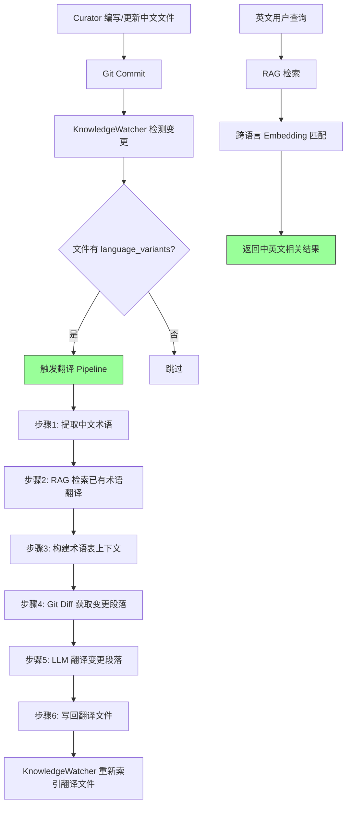

# YK-09-42: 知识库跨语言翻译 Pipeline — 自动化中英互译工作流

> 需求编号：YK-09-42 · 优先级：P2 · 人天：1.0d · 状态：需求已编写
> 依赖：YK-09-16（知识库国际化内容管理）

---

## 一、背景

### 1.1 问题描述

YiKnowledge 当前 800+ 文件全部为中文撰写。YK-09-16 已建立了 `language` 字段和 `language_variants` 关联机制，但翻译工作完全依赖人工。面临的核心问题：

1. **人力瓶颈**：800+ 文件逐一人工翻译需要约 200+ 人天，且新增/更新文件持续产生翻译需求。
2. **术语不一致**：同一技术术语（如"限流策略"、"混合检索"、"Embedding 维度对齐"）在不同文件中被不同人翻译成不同英文表达，导致跨语言 RAG 检索时语义断裂。
3. **翻译质量不可控**：人工翻译缺乏术语一致性校验，译文质量依赖个人经验和领域知识。
4. **双语检索失效**：英文查询无法命中中文文档，反之亦然——YK-09-31 多语言 Embedding 优化可缓解语义层问题，但词法检索（BM25）仍需双语内容。

### 1.2 影响范围

| 影响维度 | 严重程度 | 说明 |
|----------|---------|------|
| RAG 检索覆盖面 | 高 | 英文查询仅命中 `language=en` 的少数文件 |
| 国际化体验 | 高 | YiVad/YiPet 英文用户无法获取完整知识内容 |
| 术语一致性 | 中 | 人工翻译无术语表约束，同一概念多译 |
| 维护成本 | 中 | 知识更新后翻译同步滞后 |

### 1.3 核心挑战

- **术语一致性**：如何保证"限流策略"在 50+ 文件中被翻译为一致的 `rate limiting strategy` 而非 `throttling policy` / `flow control` 等变体。
- **上下文感知**：技术文档翻译需要理解领域上下文，纯机器翻译（如 Google Translate）无法处理技术术语的精确映射。
- **增量同步**：源文件更新后，翻译文件如何自动检测并同步更新——而非重新翻译整篇。

---

## 二、现状分析

### 2.1 当前数据流


### 2.2 根因分析矩阵

| 根因 | 类别 | 影响 | 优先级 |
|------|------|------|--------|
| 翻译依赖人工，无自动化流程 | 流程缺失 | 翻译覆盖率 < 5% | P0 |
| 无术语表/翻译记忆库 | 数据缺失 | 术语一致性 0% | P0 |
| 源文件更新后翻译未同步 | 流程缺失 | 翻译版本滞后 | P1 |
| BM25 检索无法跨语言匹配 | 架构限制 | 英文查询召回率低 | P1 |

### 2.3 现有资产

- YiAi 已集成 Ollama LLM（`qwen2.5:14b`），具备翻译能力。
- YiAi 已有 RAG 检索服务（`services/rag/`），可检索术语翻译上下文。
- YK-09-16 已定义 `language` 和 `language_variants` frontmatter 字段。
- `jieba` 分词库已在 YiAi 中可用，支持中文术语提取。

---

## 三、设计决策

### D-01：翻译引擎选择

| 方案 | 描述 | 优点 | 缺点 | 决策 |
|------|------|------|------|------|
| A: 外部 API（Google/DeepL） | 调用商业翻译 API | 翻译质量高，零部署成本 | 费用、隐私（知识文件外传）、术语不可控 | 否决 |
| B: 本地 Ollama LLM | 使用 YiAi 现有 LLM 翻译 | 零额外成本、数据不外传、可定制 Prompt | 质量依赖模型能力 | **采用** |
| C: 规则 + LLM 混合 | 术语表硬匹配 + LLM 润色 | 术语一致性最高 | 术语表维护成本高 | 补充方案 |

**决策**：采用方案 B 为主，方案 C 补充——RAG 检索已有翻译文件中的术语映射作为上下文注入 LLM Prompt。

### D-02：术语一致性策略

| 方案 | 描述 | 优点 | 缺点 | 决策 |
|------|------|------|------|------|
| A: 静态术语表 | 人工维护 `terms.json` 映射表 | 精确可控 | 维护成本高，覆盖不全 | 补充方案 |
| B: RAG 动态检索 | 从已有翻译文件中检索术语翻译 | 自动扩展，覆盖真实用法 | 冷启动阶段无已有翻译 | **采用** |
| C: LLM 自主翻译 | 直接翻译，不约束术语 | 最简单 | 术语不一致 | 否决 |

**决策**：采用 B + A 混合——RAG 检索为主要术语来源，静态术语表作为兜底（覆盖高频核心术语）。

### D-03：增量同步策略

| 方案 | 描述 | 优点 | 缺点 | 决策 |
|------|------|------|------|------|
| A: 全量重译 | 源文件更新后重新翻译全文 | 实现简单 | 浪费计算资源，译文不稳定 | 否决 |
| B: 语义版本对比 | 对比源文件 Embedding 变化，仅翻译变更段落 | 高效精准 | 实现复杂，分段对齐困难 | 远期方案 |
| C: Diff 驱动 | Git diff 检测变更段落，增量翻译 | 精准高效 | 依赖 Git 历史 | **采用** |

**决策**：采用方案 C——通过 Git diff 检测变更，仅翻译新增/修改的段落。

### D-04：翻译文件存储策略

| 方案 | 描述 | 优点 | 缺点 | 决策 |
|------|------|------|------|------|
| A: 独立文件 | 翻译结果存为新 markdown 文件 | Git 可追踪，人工可审阅 | 文件数量翻倍 | **采用** |
| B: Frontmatter 内嵌 | 翻译内容存储在 frontmatter 中 | 单文件管理 | frontmatter 膨胀，不可读 | 否决 |
| C: MongoDB 专用集合 | 翻译内容存储在 `translations` 集合 | 不污染文件系统 | 与 YiKnowledge 的 Git 管理理念冲突 | 否决 |

**决策**：采用方案 A——翻译文件与源文件同目录，文件名遵循 `{原名}.{lang}.md` 约定。

---

## 四、目标架构

### 4.1 目标数据流



### 4.2 核心指标

| 指标 | 当前值 | 目标值 | 测量方式 |
|------|--------|--------|----------|
| 翻译覆盖率 | < 5% | > 80%（核心文件） | `language_variants` 字段填充率 |
| 术语一致性 | 无衡量 | > 90% | 抽查 50 个术语的翻译一致性 |
| 翻译同步延迟 | 无自动化 | < 5 分钟 | 源文件更新到翻译文件更新的时间差 |
| 英文查询召回率 | ~20% | > 60% | RAG 检索评估集 |

### 4.3 架构权衡

| 权衡 | 选择 | 理由 |
|------|------|------|
| 翻译质量 vs 速度 | 优先质量 | 翻译可离线/异步，质量比实时性更重要 |
| 覆盖广度 vs 深度 | 优先核心文件 | 800+ 文件中优先翻译高频访问的 200 个核心文件 |
| 自动化 vs 人工审核 | 自动化 + 标记 | 自动翻译，但在 frontmatter 标记 `translation_reviewed: false` |

---

## 五、具体改动

### 5.1 核心代码

```python
# YiAi/src/services/knowledge/translator.py

class KnowledgeTranslator:
    """知识文件自动化翻译——基于 RAG 术语表保证一致性。"""

    def __init__(self, llm_service, rag_service, db):
        self.llm = llm_service
        self.rag = rag_service
        self.db = db

    async def translate(self, file_path: str,
                        target_lang: str = 'en') -> dict:
        """翻译知识文件到目标语言。

        流程: 1) 提取术语→2) RAG 检索术语翻译→3) Git Diff 变更→4) LLM 翻译
        """
        # 1. 读取源文件
        content = self._read_file(file_path)
        frontmatter = self._parse_frontmatter(content)

        # 2. 提取领域术语
        terms = self._extract_terms(content)

        # 3. RAG 检索——找已有翻译文件中相同术语的翻译
        term_translations = {}
        for term in terms:
            related = await self.rag.search(term, top_k=3,
                filter={'frontmatter.language': target_lang})
            if related:
                term_translations[term] = self._extract_term_mapping(term, related)

        # 4. Git Diff 获取变更内容
        changed_sections = self._get_changed_sections(file_path)

        # 5. LLM 翻译——术语表作为上下文
        glossary = '\n'.join(
            f'{zh} → {en}' for zh, en in term_translations.items()
        )
        prompt = f"""翻译以下知识文件内容到{'英文' if target_lang == 'en' else '中文'}。

术语表（保持术语一致性）:
{glossary}

翻译规则:
1. 保留所有 markdown 格式（标题、列表、代码块、表格）
2. 代码块中的代码不翻译，仅翻译注释
3. 技术术语使用术语表中的翻译
4. Frontmatter 中的 title 必须翻译，tags 保留原文

变更内容（仅翻译以下段落）:
{changed_sections}
"""
        translated = await self.llm.chat([{"role": "user", "content": prompt}])

        # 6. 写入翻译文件
        output_path = self._get_output_path(file_path, target_lang)
        self._write_translated_file(output_path, translated, frontmatter, target_lang)

        return {
            'source': file_path,
            'target_lang': target_lang,
            'output_path': output_path,
            'terms_used': len(term_translations),
            'new_terms': len(terms) - len(term_translations),
        }

    def _extract_terms(self, content: str) -> list[str]:
        """提取技术术语——jieba TF-IDF 关键词提取。"""
        import jieba.analyse
        # 过滤掉纯中文常见词，保留技术术语
        terms = jieba.analyse.extract_tags(content, topK=30, withWeight=False)
        # 过滤短词（单字）和纯标点
        return [t for t in terms if len(t) >= 2 and not t.isascii()]

    def _get_changed_sections(self, file_path: str) -> str:
        """通过 Git Diff 获取变更的段落。"""
        import subprocess
        result = subprocess.run(
            ['git', 'diff', 'HEAD~1', '--', file_path],
            capture_output=True, text=True
        )
        return self._parse_diff_to_sections(result.stdout)

    def _get_output_path(self, file_path: str, target_lang: str) -> str:
        """生成翻译文件路径。"""
        base = file_path.rsplit('.', 1)[0]
        ext = file_path.rsplit('.', 1)[1] if '.' in file_path else 'md'
        return f"{base}.{target_lang}.{ext}"

    async def batch_translate(self, role_dir: str = None,
                              target_lang: str = 'en',
                              max_files: int = 20) -> dict:
        """批量翻译——按角色目录分批处理。"""
        filter_query = {'frontmatter.language': {'$ne': target_lang}}
        if role_dir:
            filter_query['path'] = {'$regex': f'^{role_dir}/'}

        files = await self.db.knowledge_files.find(filter_query).to_list(max_files)

        results = []
        for file in files:
            result = await self.translate(file['path'], target_lang)
            results.append(result)

        return {
            'total': len(files),
            'translated': len([r for r in results if 'output_path' in r]),
            'details': results,
        }
```

### 5.2 文件变更清单

| 文件路径 | 操作 | 说明 |
|----------|------|------|
| `YiAi/src/services/knowledge/translator.py` | 新增 | 翻译 Pipeline 核心服务 |
| `YiAi/src/domain/knowledge/translation_term_table.py` | 新增 | 静态术语表（兜底） |
| `YiAi/src/services/knowledge/knowledge_watcher.py` | 修改 | 新增翻译触发钩子 |
| `YiKnowledge/curator/governance/term-table.json` | 新增 | 人工维护的核心术语表 |

---

## 六、实施步骤

| 步骤 | 内容 | 验证方法 | 人天 |
|------|------|----------|------|
| 1 | 创建静态术语表（200 个核心术语） | 人工审核术语覆盖 | 0.5 |
| 2 | 实现 `KnowledgeTranslator` 核心类 | 单元测试覆盖 `_extract_terms`、`_get_output_path` | 1.0 |
| 3 | 实现术语 RAG 检索逻辑 | 集成测试：给定中文术语，返回已有翻译 | 0.5 |
| 4 | 实现 Git Diff 变更检测 | 单元测试：模拟 diff 输出，验证段落提取 | 0.5 |
| 5 | 实现 LLM 翻译 Prompt 模板 | 手动测试 5 个文件翻译质量 | 0.5 |
| 6 | 集成到 KnowledgeWatcher 触发链 | 端到端：修改中文文件 → 自动生成翻译文件 | 0.5 |
| 7 | 批量翻译核心 200 文件 | 人工抽查 20 个文件翻译质量 | 1.0 |
| 8 | 前端 YiVad 展示双语切换 | 语言切换按钮 + 翻译文件加载 | 1.0 |

**总计**：5.5 人天

---

## 七、性能分析

### 7.1 翻译延迟基准

| 操作 | 耗时 | 说明 |
|------|------|------|
| 术语提取（jieba TF-IDF） | ~50ms | 30 个关键词，800 字文档 |
| RAG 术语检索（30 次） | ~3s | 每次 100ms，可并行优化 |
| LLM 翻译（500 字段落） | ~8s | qwen2.5:14b，单段落 |
| 文件写入 | ~10ms | Markdown 文件写入 |

**单文件翻译总延迟**：~12s（可接受，翻译为离线异步任务）

### 7.2 批量翻译容量规划

| 规模 | 总耗时 | 策略 |
|------|--------|------|
| 10 文件 | ~2 分钟 | 串行 |
| 50 文件 | ~10 分钟 | 串行 |
| 200 文件 | ~40 分钟 | 串行（分批 20 个/批，间隔 1 分钟） |
| 800 文件 | ~2.5 小时 | 分批 + 限速（避免 LLM 过载） |

### 7.3 资源消耗

| 资源 | 单文件 | 200 文件批量 |
|------|--------|------------|
| LLM Token 消耗 | ~2000 input + ~800 output | ~560K tokens |
| 内存 | ~50MB（术语表 + RAG 上下文） | ~50MB（复用） |
| 磁盘 | ~5KB（翻译文件） | ~1MB |

---

## 八、测试规格

### 8.1 单元测试

**测试用例 1：术语提取**

```
GIVEN 一个包含技术术语的中文知识文件
WHEN 调用 _extract_terms(content)
THEN 返回的术语列表应包含 "混合检索", "Embedding", "BM25"
AND 不包含单字词如 "的", "是", "在"
AND 不包含纯 ASCII 词汇（英文术语由人工维护）
```

**测试用例 2：翻译文件路径生成**

```
GIVEN 源文件路径 "aier/rag/hybrid-search-optimization.md"
WHEN 调用 _get_output_path(file_path, 'en')
THEN 返回 "aier/rag/hybrid-search-optimization.en.md"
```

**测试用例 3：Git Diff 段落提取**

```
GIVEN 一个包含三处修改的 Git Diff 输出
WHEN 调用 _parse_diff_to_sections(diff_output)
THEN 返回三个变更段落的文本
AND 每个段落包含上下文（前后各 2 行）
```

**测试用例 4：批量翻译过滤**

```
GIVEN 知识库有 100 个中文文件和 5 个英文文件
WHEN 调用 batch_translate(role_dir='aier', target_lang='en')
THEN 仅处理 role_dir='aier' 且 language!='en' 的文件
AND 英文文件被排除
```

### 8.2 集成测试

**测试用例 5：端到端翻译流程**

```
GIVEN 一个中文知识文件，其中包含术语 "混合检索" 和 "BM25"
AND 已有翻译文件包含 "混合检索 → hybrid search" 的映射
WHEN 触发 translate(file_path, 'en')
THEN 生成的翻译文件中 "混合检索" 被翻译为 "hybrid search"
AND 术语一致性 RAG 检索返回了正确的术语映射
AND frontmatter.language_variants.en 指向了新翻译文件
```

**测试用例 6：增量翻译（源文件更新）**

```
GIVEN 一个已翻译的中文文件及其英文翻译
WHEN 源文件新增一个段落
AND 触发翻译
THEN 仅翻译新增段落
AND 已有翻译内容保持不变
AND 翻译文件 frontmatter.updated 更新
```

---

## 九、风险与缓解

### 9.1 风险矩阵

| 风险 | 概率 | 影响 | 缓解措施 |
|------|------|------|----------|
| LLM 翻译质量不稳定 | 中 | 高——用户信任度下降 | 人工审核标记 + 用户反馈机制 |
| 术语 RAG 检索冷启动 | 高 | 中——初期翻译术语不一致 | 静态术语表兜底 200 核心术语 |
| LLM Hallucination 编造内容 | 低 | 高——技术文档准确性问题 | 翻译后 Embedding 相似度校验（与源文件 > 0.9） |
| Git Diff 段落对齐失败 | 中 | 中——增量翻译失效，退化为全量 | 失败时回退全量翻译 |
| 翻译文件数量膨胀 | 高 | 低——文件系统压力 | 仅翻译被引用的核心文件（start 计数 > 5） |
| LLM 并发请求过载 | 低 | 中——Ollama 响应变慢 | 分批翻译 + 间隔控制 |

### 9.2 质量保障措施

1. **翻译后 Embedding 校验**：源文件 Embedding 与翻译文件 Embedding 的余弦相似度应 > 0.85（跨语言模型）。
2. **人工审核标记**：翻译文件 frontmatter 包含 `translation_reviewed: false`，经 Curator 审核后改为 `true`。
3. **术语一致性报告**：每次批量翻译后生成术语一致性报告，列出多译术语。

---

## 十、回滚策略

| 场景 | 回滚操作 | 影响范围 |
|------|----------|----------|
| 翻译质量严重下降 | 删除近期翻译文件，恢复人工翻译流程 | 翻译文件失效 |
| LLM 服务不可用 | 翻译 Pipeline 暂停，不阻塞 KnowledgeWatcher 主流程 | 无新翻译生成 |
| 翻译文件路径冲突 | 回退 `_get_output_path` 逻辑，手动修复冲突文件 | 个别翻译文件 |

---

## 十一、设计决策记录

### D-01：翻译引擎——本地 Ollama LLM

**背景**：需要在翻译质量和数据隐私之间权衡。
**决策**：使用 YiAi 现有 Ollama LLM（qwen2.5:14b），数据不外传。静态术语表 + RAG 检索术语翻译作为上下文注入 Prompt。
**后果**：翻译质量依赖模型能力，需定期评估模型升级效果。

### D-02：术语一致性——RAG 动态检索 + 静态术语表

**背景**：术语一致性是知识库翻译的核心挑战。
**决策**：RAG 检索已有翻译文件中的术语映射为主要来源，静态术语表作为冷启动兜底。
**后果**：初期术语覆盖率低，随翻译文件增多逐步改善。

### D-03：增量同步——Git Diff 驱动

**背景**：源文件更新后需同步翻译，全量重译浪费资源。
**决策**：通过 Git Diff 检测变更段落，仅翻译新增/修改内容。
**后果**：依赖 Git 历史完整性，`git diff` 的段落对齐可能不完美。

---

## 十二、可观测性

### 12.1 指标

| 指标名称 | 类型 | 说明 |
|----------|------|------|
| `translation_coverage` | Gauge | 翻译覆盖率（已翻译文件数 / 总文件数） |
| `translation_term_consistency` | Gauge | 术语一致性（抽查 50 个术语的一致率） |
| `translation_latency_seconds` | Histogram | 单文件翻译延迟 |
| `translation_sync_lag_seconds` | Gauge | 源文件更新到翻译同步的时间差 |
| `translation_llm_errors` | Counter | LLM 翻译失败次数 |

### 12.2 日志

```python
logger.info(f"[Translator] 开始翻译: {file_path} → {target_lang}")
logger.info(f"[Translator] 术语提取: {len(terms)} 个术语, RAG 命中 {len(term_translations)}")
logger.warning(f"[Translator] 术语 '{term}' 无已有翻译，使用 LLM 自主翻译")
logger.error(f"[Translator] 翻译失败: {file_path}, 错误: {error}")
```

### 12.3 告警

| 告警 | 条件 | 级别 |
|------|------|------|
| 翻译覆盖率下降 | `translation_coverage` 下降 > 10% | P2 |
| LLM 翻译连续失败 | `translation_llm_errors` > 5 / 10 分钟 | P1 |
| 翻译同步延迟过大 | `translation_sync_lag_seconds` > 3600 | P2 |

---

## 十三、安全合规

| 要求 | 实现方式 |
|------|----------|
| 数据不外传 | 使用本地 Ollama LLM，知识文件不发送到外部 API |
| 翻译文件权限 | 继承源文件的 Git 访问控制 |
| 敏感内容过滤 | 翻译前检查 frontmatter，标记 `confidential: true` 的文件跳过自动翻译 |
| 审计日志 | 每次翻译操作记录到 `translation_log` 集合 |

---

## 十四、代码审查检查清单

- [ ] `KnowledgeTranslator` 使用 YiAi 现有 LLM 服务，不引入新的外部依赖
- [ ] 术语提取使用 `jieba.analyse.extract_tags`，过滤单字词和纯 ASCII 词汇
- [ ] RAG 术语检索仅查询 `language=target_lang` 的已有翻译文件
- [ ] 静态术语表（`term-table.json`）包含至少 200 个核心术语
- [ ] Git Diff 变更检测失败时回退到全量翻译
- [ ] 翻译文件路径遵循 `{原名}.{lang}.md` 约定
- [ ] 翻译后 Embedding 相似度校验（源文件 vs 翻译文件 > 0.85）
- [ ] 翻译文件 frontmatter 包含 `translation_reviewed: false` 标记
- [ ] 批量翻译支持分批 + 间隔控制，避免 LLM 过载
- [ ] `confidential: true` 的文件跳过自动翻译
- [ ] `batch_translate` 支持按角色目录过滤
- [ ] 翻译操作记录到 `translation_log` 集合

---

*PRD 来源: `projects/yiknowledge/requirements/2026-09/42-需求-跨语言翻译Pipeline.md`*