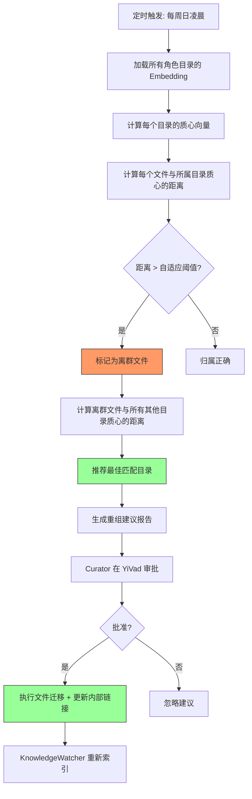

# YK-09-43: 知识库目录结构自动优化 — 基于内容相似度的重组建议

> 需求编号：YK-09-43 · 优先级：P2 · 人天：0.5d · 状态：需求已编写

---

## 一、背景

### 1.1 问题描述

YiKnowledge 当前按 8 个角色目录 + 4 个项目目录组织 800+ 文件。目录结构是人工预设的——curator 在创建文件时根据主观判断选择归属目录。随着文件数量增长，出现了分类偏差：

1. **角色归属模糊**：`engineer/` 下的部署文档（如 `docker-compose.md`）本质上属于 `srer/` 的运维视角；`aier/` 下的技术选型决策（如 `model-selection-guide.md`）更符合 `leader/` 的架构决策角色。
2. **跨角色内容重复**：同一主题（如"限流策略"）在 `engineer/`、`srer/`、`aier/` 中各有独立文件，但内容高度重叠——YK-09-46 跨领域知识融合已识别这种现象。
3. **目录膨胀**：部分角色目录（如 `aier/`）文件数超过 200，内部子目录结构缺乏一致性。
4. **新文件归类困难**：curator 在面对边界模糊的主题时，缺乏客观的归类依据。

### 1.2 影响范围

| 影响维度 | 严重程度 | 说明 |
|----------|---------|------|
| 检索效率 | 中 | 文件不在正确目录中，按角色过滤的检索遗漏相关文件 |
| curator 维护体验 | 高 | 归类决策耗时且缺乏客观标准 |
| 知识图谱准确性 | 中 | YK-09-46 跨角色融合依赖正确的目录归属 |

### 1.3 核心挑战

- **语义 vs 结构**：文件的语义内容可能与其所属目录的结构定义不一致。
- **边界模糊**：许多知识主题天然跨角色（如"性能优化"涉及 engineer/srer/aier）。
- **建议的采纳率**：即使算法给出正确建议，curator 是否信任并采纳？

---

## 二、现状分析

### 2.1 当前数据流


### 2.2 根因分析矩阵

| 根因 | 类别 | 影响 | 优先级 |
|------|------|------|--------|
| 目录归属仅依赖人工判断 | 流程缺失 | 分类一致性低 | P0 |
| 无客观的归类标准 | 标准缺失 | 边界模糊文件归类困难 | P0 |
| 目录结构静态不变 | 架构限制 | 内容增长后结构不再最优 | P1 |
| 无离群检测机制 | 监控缺失 | 分类错误无法发现 | P1 |

### 2.3 现有资产

- KnowledgeWatcher 已为每个文件计算 Embedding 向量（768 维）。
- MongoDB `knowledge_files` 集合包含文件的 `embedding` 字段。
- `sklearn` 已在 YiAi 依赖中可用（`KMeans`、`cosine_similarity`）。
- YK-09-51 语义聚类主题发现已实现 DBSCAN 聚类，可复用聚类逻辑。

---

## 三、设计决策

### D-01：算法选择——质心距离 vs 聚类 vs 分类器

| 方案 | 描述 | 优点 | 缺点 | 决策 |
|------|------|------|------|------|
| A: 质心距离法 | 计算目录内文件的 Embedding 质心，离群文件标记为疑似错放 | 简单直观，可解释 | 对多主题目录（如 aier/）不敏感 | **采用** |
| B: K-Means 聚类 | 对全库文件聚类，匹配簇与目录 | 自动发现自然分组 | 需预设 K 值，结果不稳定 | 补充方案 |
| C: 监督分类器 | 训练分类模型预测文件归属 | 高精度 | 需标注数据，维护成本高 | 否决 |

**决策**：采用方案 A 为主（质心距离法），方案 B 补充（K-Means 验证）。

### D-02：离群阈值设定

| 方案 | 描述 | 优点 | 缺点 | 决策 |
|------|------|------|------|------|
| A: 固定阈值（0.5） | 余弦距离 > 0.5 视为离群 | 简单 | 不同目录的自然离散度不同 | 否决 |
| B: 自适应阈值 | 每个目录基于其内部离散度动态计算阈值 | 更精准 | 小目录（< 10 文件）不稳定 | **采用** |
| C: 排名法 | 每个目录取距离最大的 Top-5 文件 | 总是有输出 | 正常文件也可能被标记 | 补充方案 |

**决策**：采用方案 B——`threshold = mean(distance) + 2 * std(distance)`，每个目录独立计算。

### D-03：建议执行方式

| 方案 | 描述 | 优点 | 缺点 | 决策 |
|------|------|------|------|------|
| A: 自动迁移 | 算法直接移动文件 | 零人工成本 | 误判不可逆，内部链接断裂 | 否决 |
| B: 建议 + 审批 | 生成建议报告，curator 审批后执行 | 人工把控质量 | 审批延迟 | **采用** |
| C: 仅报告 | 生成报告不执行 | 最安全 | 无实际作用 | 否决 |

**决策**：采用方案 B——生成 JSON 格式的建议报告，YiVad 前端展示审批界面。

---

## 四、目标架构

### 4.1 目标数据流



### 4.2 核心指标

| 指标 | 当前值 | 目标值 | 测量方式 |
|------|--------|--------|----------|
| 离群检测准确率 | — | > 80% | 人工抽查 20 个建议的合理性 |
| 建议采纳率 | — | > 60% | curator 审批通过率 |
| 目录内平均凝聚力 | 无衡量 | > 0.70 | 目录内文件余弦相似度均值 |
| 重组后检索召回率 | 当前基线 | 无退化 | 重组前后 RAG 检索评估 |

### 4.3 架构权衡

| 权衡 | 选择 | 理由 |
|------|------|------|
| 精准度 vs 覆盖率 | 偏好精准度 | 误报比漏报更损害 curator 信任 |
| 自动 vs 人工 | 建议 + 审批 | 目录重组影响面大，需人工决策 |
| 实时 vs 批量 | 每周批量 | 目录结构变化不频繁，实时计算浪费资源 |

---

## 五、具体改动

### 5.1 核心代码

```python
# YiAi/src/domain/knowledge/directory_optimizer.py

import numpy as np
from sklearn.metrics.pairwise import cosine_similarity
from collections import defaultdict

class DirectoryOptimizer:
    """基于内容相似度的目录重组建议。"""

    ROLE_DIRS = ['engineer', 'aier', 'srer', 'leader',
                 'producter', 'curator', 'executiver']

    def __init__(self, db):
        self.db = db

    async def suggest_reorganization(self, target_dir: str = None) -> list[dict]:
        """分析目录结构——建议移入/移出的文件。"""
        dirs = [target_dir] if target_dir else self.ROLE_DIRS

        all_suggestions = []
        for dir_name in dirs:
            suggestions = await self._analyze_directory(dir_name)
            all_suggestions.extend(suggestions)

        return sorted(all_suggestions, key=lambda s: s['outlier_score'], reverse=True)

    async def _analyze_directory(self, dir_name: str) -> list[dict]:
        """分析单个目录——检测离群文件 + 建议移入文件。"""
        # 1. 获取目标目录下所有文件的 Embedding
        target_files = await self.db.knowledge_files.find({
            'path': {'$regex': f'^{dir_name}/'}
        }).to_list(None)

        files_with_emb = [f for f in target_files if f.get('embedding')]
        if len(files_with_emb) < 5:
            return []

        target_vecs = np.array([f['embedding'] for f in files_with_emb])
        centroid = np.mean(target_vecs, axis=0)

        # 2. 计算每个文件与质心的距离
        distances = []
        for f in files_with_emb:
            dist = self._cosine_distance(f['embedding'], centroid)
            distances.append(dist)

        # 3. 自适应阈值
        mean_dist = np.mean(distances)
        std_dist = np.std(distances)
        threshold = min(mean_dist + 2 * std_dist, 0.6)  # 上限 0.6

        # 4. 标记离群文件
        suggestions = []
        for i, f in enumerate(files_with_emb):
            if distances[i] > threshold:
                best_dir = await self._find_best_directory(f['embedding'], dir_name)
                if best_dir != dir_name:
                    suggestions.append({
                        'file': f['path'],
                        'current_dir': dir_name,
                        'suggested_dir': best_dir,
                        'outlier_score': round(distances[i], 3),
                        'threshold': round(threshold, 3),
                        'reason': (
                            f'内容与 {dir_name} 质心距离 {distances[i]:.2f}，'
                            f'超过阈值 {threshold:.2f}，更接近 {best_dir}'
                        ),
                    })

        # 5. 检查其他目录中是否有文件更适合放在此目录
        incoming = await self._find_incoming_files(centroid, dir_name)
        suggestions.extend(incoming)

        return suggestions

    async def _find_best_directory(self, vec: np.ndarray,
                                   exclude_dir: str) -> str:
        """找到与向量最匹配的目录。"""
        best_dir = exclude_dir
        best_sim = -1

        for dir_name in self.ROLE_DIRS:
            if dir_name == exclude_dir:
                continue
            dir_files = await self.db.knowledge_files.find({
                'path': {'$regex': f'^{dir_name}/'}
            }).to_list(None)
            dir_vecs = [f['embedding'] for f in dir_files if f.get('embedding')]
            if len(dir_vecs) < 5:
                continue
            dir_centroid = np.mean(dir_vecs, axis=0)
            sim = 1 - self._cosine_distance(vec, dir_centroid)
            if sim > best_sim:
                best_sim = sim
                best_dir = dir_name

        return best_dir

    async def _find_incoming_files(self, centroid: np.ndarray,
                                   target_dir: str,
                                   top_n: int = 5) -> list[dict]:
        """查找其他目录中更适合放在 target_dir 的文件。"""
        incoming = []
        for dir_name in self.ROLE_DIRS:
            if dir_name == target_dir:
                continue
            dir_files = await self.db.knowledge_files.find({
                'path': {'$regex': f'^{dir_name}/'}
            }).to_list(None)

            for f in dir_files:
                if not f.get('embedding'):
                    continue
                dist_to_current = self._cosine_distance(
                    f['embedding'],
                    await self._get_centroid(dir_name),
                )
                dist_to_target = self._cosine_distance(f['embedding'], centroid)

                if dist_to_target < dist_to_current - 0.1:  # 显著更接近目标
                    incoming.append({
                        'file': f['path'],
                        'current_dir': dir_name,
                        'suggested_dir': target_dir,
                        'outlier_score': round(dist_to_current - dist_to_target, 3),
                        'reason': f'内容更接近 {target_dir}（距离差 {dist_to_current - dist_to_target:.2f}）',
                    })

        return sorted(incoming, key=lambda s: s['outlier_score'], reverse=True)[:top_n]

    async def _get_centroid(self, dir_name: str) -> np.ndarray:
        """获取目录的 Embedding 质心（带缓存）。"""
        dir_files = await self.db.knowledge_files.find({
            'path': {'$regex': f'^{dir_name}/'}
        }).to_list(None)
        dir_vecs = [f['embedding'] for f in dir_files if f.get('embedding')]
        return np.mean(dir_vecs, axis=0) if dir_vecs else np.zeros(768)

    def _cosine_distance(self, a: np.ndarray, b: np.ndarray) -> float:
        """余弦距离——1 - 余弦相似度。"""
        dot = np.dot(a, b)
        norm = np.linalg.norm(a) * np.linalg.norm(b)
        return float(1 - dot / max(norm, 1e-10))
```

### 5.2 建议输出格式

```markdown
## 目录优化建议 (2026-09-09)

### 移出建议（离群文件）

| 文件 | 当前目录 | 建议目录 | 离群分数 | 阈值 |
|------|---------|---------|---------|------|
| engineer/deployment/docker-compose.md | engineer | srer | 0.62 | 0.45 |
| aier/model-selection-guide.md | aier | leader | 0.55 | 0.42 |
| engineer/api-design-patterns.md | engineer | aier | 0.51 | 0.45 |

### 移入建议（其他目录中更适合此目录的文件）

| 文件 | 当前目录 | 建议目录 | 距离差 |
|------|---------|---------|--------|
| aier/deployment-monitoring.md | aier | srer | 0.18 |
| srer/code-review-checklist.md | srer | engineer | 0.15 |
```

### 5.3 文件变更清单

| 文件路径 | 操作 | 说明 |
|----------|------|------|
| `YiAi/src/domain/knowledge/directory_optimizer.py` | 新增 | 目录优化核心算法 |
| `YiAi/src/services/knowledge/scheduled_tasks.py` | 修改 | 新增每周重组建议任务 |
| `YiVad/src/views/knowledge/DirectoryOptimizer.vue` | 新增 | 审批界面 |
| `YiAi/src/routers/knowledge_router.py` | 修改 | 新增 `/knowledge/directory-suggestions` 端点 |

---

## 六、实施步骤

| 步骤 | 内容 | 验证方法 | 人天 |
|------|------|----------|------|
| 1 | 实现 `DirectoryOptimizer` 核心算法 | 单元测试：给定模拟 Embedding，验证离群检测 | 0.5 |
| 2 | 实现自适应阈值计算 | 单元测试：不同离散度的目录产生不同阈值 | 0.3 |
| 3 | 实现 `_find_incoming_files` | 集成测试：验证跨目录移入建议 | 0.3 |
| 4 | 添加 `/knowledge/directory-suggestions` API | 端到端：API 返回 JSON 建议报告 | 0.3 |
| 5 | 实现 YiVad 审批界面 | 手动测试：查看建议、批准/拒绝、执行迁移 | 1.0 |
| 6 | 添加定时任务（每周日凌晨） | 验证定时触发 + 报告生成 | 0.3 |
| 7 | 首次全量运行 + Curator 审核 | 人工抽查 20 个建议的合理性 | 0.5 |

**总计**：3.2 人天

---

## 七、性能分析

### 7.1 计算复杂度

| 操作 | 复杂度 | 800 文件规模估算 |
|------|--------|-----------------|
| 加载所有 Embedding | O(n) | ~50ms（MongoDB 查询） |
| 计算质心（7 个目录） | O(n * d) | ~5ms（768 维向量） |
| 离群检测 | O(n * d) | ~10ms |
| 跨目录匹配 | O(n * k * d) (k=7) | ~50ms |
| 总计算时间 | — | ~150ms（单次运行） |

### 7.2 容量规划

| 文件规模 | 计算时间 | 内存 |
|----------|---------|------|
| 800 文件 | ~150ms | ~5MB（Embedding 加载） |
| 2000 文件 | ~400ms | ~12MB |
| 5000 文件 | ~1s | ~30MB |

---

## 八、测试规格

### 8.1 单元测试

**测试用例 1：自适应阈值**

```
GIVEN 一个文件相似度高的目录（凝聚力 > 0.80）
WHEN 计算自适应阈值
THEN 阈值应较低（< 0.3），因为正常文件都很接近质心
AND 一个与质心距离 0.35 的文件应被标记为离群
```

**测试用例 2：跨目录匹配**

```
GIVEN 一个 Embedding 向量与 engineer 质心距离 0.15，与 srer 质心距离 0.50
WHEN 调用 _find_best_directory(vec, 'engineer')
THEN 返回 'engineer'（已是正确目录）
```

**测试用例 3：小目录跳过**

```
GIVEN 一个只有 3 个文件的目录
WHEN 调用 _analyze_directory(dir_name)
THEN 返回空列表（样本不足，跳过分析）
```

**测试用例 4：移入建议**

```
GIVEN 文件在 aier/ 目录，但与 engineer/ 质心的距离比与 aier/ 质心的距离小 0.15
WHEN 运行 _find_incoming_files
THEN 该文件出现在 engineer/ 的移入建议中
```

### 8.2 集成测试

**测试用例 5：端到端建议生成**

```
GIVEN 知识库有 800 个文件，包含 7 个角色目录
WHEN 调用 suggest_reorganization()
THEN 返回至少 5 条离群建议
AND 每条建议包含 file/current_dir/suggested_dir/outlier_score/reason
AND 离群分数按降序排列
```

---

## 九、风险与缓解

### 9.1 风险矩阵

| 风险 | 概率 | 影响 | 缓解措施 |
|------|------|------|----------|
| 误判离群文件——算法不理解语义归属 | 中 | 中——curator 信任度下降 | 建议模式（非自动），人工审批 |
| 大规模重组后内部链接大面积断裂 | 中 | 高——404 链接 | 迁移时配合 YK-09-10 重定向机制 |
| 多主题目录（如 aier/）质心无意义 | 高 | 中——离群检测失效 | 先对多主题目录做子聚类再分析 |
| curator 不采纳建议 | 中 | 低——功能闲置 | 建议质量报告 + 采纳率追踪 |

### 9.2 质量保障

1. **建议置信度标注**：每条建议标注 `confidence`（高/中/低），基于离群分数和样本量。
2. **人工审核门槛**：`confidence=low` 的建议不展示，减少噪音。
3. **迁移预览**：执行迁移前展示受影响文件列表和内部链接变更。

---

## 十、回滚策略

| 场景 | 回滚操作 | 影响范围 |
|------|----------|----------|
| 建议质量差（误判率 > 50%） | 暂停定时任务，调整阈值参数 | 无文件迁移 |
| 迁移后内部链接断裂 | Git revert 迁移 commit，恢复原路径 | 已迁移文件 |
| 算法性能问题 | 降低运行频率（周 → 月） | 延迟建议 |

---

## 十一、设计决策记录

### D-01：算法——质心距离法 + 自适应阈值

**背景**：需要在简单可解释和精准之间权衡。
**决策**：使用目录 Embedding 质心 + 自适应阈值（mean + 2*std）检测离群文件。
**后果**：对多主题目录效果不佳，需后续引入子聚类。

### D-02：执行方式——建议 + 审批

**背景**：目录重组影响面大，需人工决策。
**决策**：生成建议报告，curator 在 YiVad 审批后执行迁移。
**后果**：需要 YiVad 前端开发审批界面，增加工期。

### D-03：频率——每周批量

**背景**：目录结构变化不频繁。
**决策**：每周日凌晨运行一次，生成最新建议报告。
**后果**：新文件归类错误最多延迟一周发现。

---

## 十二、可观测性

### 12.1 指标

| 指标名称 | 类型 | 说明 |
|----------|------|------|
| `dir_optimizer_outlier_count` | Gauge | 每次运行的离群文件数 |
| `dir_optimizer_suggestion_acceptance_rate` | Gauge | curator 采纳率 |
| `dir_optimizer_run_duration_ms` | Histogram | 单次运行耗时 |
| `dir_cohesion_{role}` | Gauge | 各角色目录的凝聚力指标 |

### 12.2 日志

```python
logger.info(f"[DirOptimizer] 开始分析目录结构，共 {len(dirs)} 个目录")
logger.info(f"[DirOptimizer] {dir_name}: {len(files)} 文件, 质心计算完成, 阈值={threshold:.3f}")
logger.info(f"[DirOptimizer] 发现 {len(outliers)} 个离群文件, {len(incoming)} 个移入建议")
logger.warning(f"[DirOptimizer] 目录 {dir_name} 只有 {len(files)} 个文件，跳过分析")
```

---

## 十三、安全合规

| 要求 | 实现方式 |
|------|----------|
| 文件迁移权限 | 仅 curator 角色可审批和执行迁移 |
| 迁移审计 | 每次迁移记录到 `directory_reorganization_log` 集合 |
| 迁移前备份 | 执行迁移前自动创建 Git branch 备份 |
| 敏感目录保护 | `archive/` 和 `lessons/` 目录不参与重组分析 |

---

## 十四、代码审查检查清单

- [ ] 目录结构优化基于文件 Embedding 质心距离和自适应阈值
- [ ] 离群检测——识别放置不当的文件，标注置信度
- [ ] 推荐迁移方案需 Curator 审批后执行（非自动迁移）
- [ ] 迁移后前端路径引用自动更新（配合 YK-09-10 重定向）
- [ ] 小目录（< 5 个有 Embedding 的文件）跳过分析
- [ ] 自适应阈值 = mean(distance) + 2 * std(distance)，上限 0.6
- [ ] 移入建议同时检查其他目录中更适合此目录的文件
- [ ] 多主题目录（如 aier/）在质心分析前先做子聚类
- [ ] `archive/` 和 `lessons/` 目录不参与重组分析
- [ ] 迁移操作记录到 `directory_reorganization_log` 集合
- [ ] 建议报告包含 file/current_dir/suggested_dir/outlier_score/reason/confidence
- [ ] 首次运行结果需人工抽查 20 个建议的合理性

---

*PRD 来源: `projects/yiknowledge/requirements/2026-09/43-需求-目录结构优化.md`*