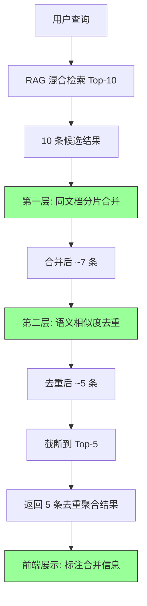

# YK-09-44: 知识库 RAG 检索结果去重与聚合 — 同主题合并展示

> 需求编号：YK-09-44 · 优先级：P2 · 人天：0.5d · 状态：需求已编写

---

## 一、背景

### 1.1 问题描述

RAG 检索返回 Top-5 结果时，存在两类冗余——它们浪费了 LLM 有限的上下文窗口，降低了回答的多样性：

1. **同文档分片冗余**：YK-09-19 大文件分片后，同一文档的多个分片（如 RAG 混合检索优化的 Section 1、Section 3、Section 4）独立出现在检索结果中，占据 3/5 的展示位。
2. **同主题文档冗余**：语义相似度 > 0.85 的文档（如"RAG 混合检索优化"和"RAG 参数调优指南"）虽内容不同但主题高度重复，对用户的增量信息价值有限。

### 1.2 影响量化

| 影响维度 | 量化 | 说明 |
|----------|------|------|
| 上下文窗口浪费 | 30-60% | 5 条结果中 2-3 条是冗余的 |
| 检索多样性降低 | 30-50% | 不同主题的文档被挤出 Top-5 |
| 用户满意度 | 可感知下降 | 用户反馈"结果重复" |

### 1.3 核心挑战

- **同文档分片合并**：多个分片中最有价值的是哪个？如何保留其他分片的信息？
- **相似度阈值设定**：阈值过高（> 0.95）去重不足，过低（> 0.70）误合并不相关文档。
- **聚合展示**：合并后如何展示合并信息——用户需要知道"3 个分片已合并"和"1 个相似文档已合并"。

---

## 二、现状分析

### 2.1 当前数据流


### 2.2 根因分析矩阵

| 根因 | 类别 | 影响 | 优先级 |
|------|------|------|--------|
| 分片检索独立评分，无跨分片聚合 | 算法缺陷 | 同文档分片占据多个展示位 | P0 |
| 无语义相似度去重 | 功能缺失 | 同主题文档重复展示 | P0 |
| Top-K 截断在去重之前 | 流程顺序 | 去重后结果数不足 K | P1 |
| 无去重信息透传 | 展示缺失 | 用户不知道合并了哪些内容 | P2 |

### 2.3 现有资产

- RAG 检索服务已返回 Embedding 向量（可用于相似度计算）。
- 检索结果已包含 `path` 字段（可提取父文档路径）。
- 检索结果已包含 `score` 字段（可用于合并时的优先级判断）。

---

## 三、设计决策

### D-01：去重策略——分层处理

| 方案 | 描述 | 优点 | 缺点 | 决策 |
|------|------|------|------|------|
| A: 仅同文档分片合并 | 合并同一文档的多个分片 | 简单可靠 | 不同文档的同主题冗余未解决 | 部分采用 |
| B: 仅语义相似度去重 | 基于 Embedding 相似度去重 | 覆盖同主题文档 | 同文档分片可能被误去重 | 部分采用 |
| C: 分层处理（先分片后语义） | 先合并同文档分片，再对合并结果做语义去重 | 两种冗余都解决 | 实现稍复杂 | **采用** |

**决策**：采用方案 C——分层处理，先分片合并后语义去重，确保不同层面的冗余都被处理。

### D-02：语义相似度阈值

| 方案 | 描述 | 优点 | 缺点 | 决策 |
|------|------|------|------|------|
| A: 固定阈值 0.85 | 相似度 > 0.85 视为重复 | 简单 | 对所有主题一刀切 | **采用** |
| B: 自适应阈值 | 基于查询主题动态调整 | 更精准 | 实现复杂，可能不稳定 | 远期方案 |
| C: 用户可配置 | YiVad 前端提供阈值滑块 | 灵活 | 增加用户操作负担 | 否决 |

**决策**：初始采用固定阈值 0.85，后续基于 A/B 测试（YK-09-53）调优。

### D-03：Top-K 截断时机

| 方案 | 描述 | 优点 | 缺点 | 决策 |
|------|------|------|------|------|
| A: 检索时扩大候选集 | 检索 Top-10，去重后截断到 Top-5 | 去重后结果数充足 | 检索成本翻倍 | **采用** |
| B: 检索 Top-5，去重后可能不足 | 简单 | 性能最优 | 去重后可能只有 2-3 条 | 否决 |

**决策**：检索 Top-10 候选，去重后截断到 Top-5。

### D-04：聚合信息展示

| 方案 | 描述 | 优点 | 缺点 | 决策 |
|------|------|------|------|------|
| A: 仅展示代表 | 去重后只展示最高分文档 | 简洁 | 丢失合并信息 | 否决 |
| B: 标注合并信息 | 代表文档标注"已合并 N 个分片/文档" | 信息完整 | 展示稍复杂 | **采用** |
| C: 可展开详情 | 默认折叠，点击展开被合并的文档列表 | 信息完整 + 简洁 | 前端实现成本高 | 远期方案 |

**决策**：采用方案 B——标注合并信息，远期可升级为方案 C。

---

## 四、目标架构

### 4.1 目标数据流



### 4.2 核心指标

| 指标 | 当前值 | 目标值 | 测量方式 |
|------|--------|--------|----------|
| 去重后结果多样性 | 低（2-3 个主题） | 高（4-5 个不同主题） | 人工评估 Top-5 的主题覆盖数 |
| 同文档分片占比 | 30-60% | 0%（已合并） | 去重后结果中同一文档出现次数 |
| 去重后结果数 | 5 | 5（95% 查询） | 统计去重后结果数 < 5 的比例 |
| 去重延迟 | 0ms | < 50ms | 去重逻辑耗时 |

### 4.3 架构权衡

| 权衡 | 选择 | 理由 |
|------|------|------|
| 召回 vs 多样性 | 偏好多样性 | 用户需要不同视角的信息，而非同一文档的多个片段 |
| 精确 vs 高效 | 平衡 | 固定阈值 0.85 + 候选集扩大仅轻度增加开销 |
| 信息完整 vs 简洁 | 标注合并 | 用户应知道合并了哪些内容，但不影响阅读体验 |

---

## 五、具体改动

### 5.1 核心代码

```python
# YiAi/src/domain/rag/deduplication.py

import numpy as np

class ResultDeduplicator:
    """检索结果去重与聚合——合并同文档分片 + 同主题文档。"""

    EMBEDDING_SIMILARITY_THRESHOLD = 0.85
    SAME_DOC_GROUP = True
    RETRIEVAL_TOP_K = 10  # 扩大候选集
    FINAL_TOP_K = 5

    def deduplicate(self, results: list[dict]) -> list[dict]:
        """去重与聚合——分层处理。"""

        # 1. 同文档分片合并——取最高分数的分片代表
        if self.SAME_DOC_GROUP:
            results = self._merge_same_document(results)

        # 2. 同主题文档去重——语义相似度 > 0.85 的合并
        results = self._deduplicate_by_similarity(results)

        return results[:self.FINAL_TOP_K]

    def _merge_same_document(self, results: list[dict]) -> list[dict]:
        """同文档分片合并——最高分分片代表 + 其他分片列表。"""
        grouped: dict[str, list[dict]] = {}

        for doc in results:
            parent = doc.get('path', '').split('#')[0]
            grouped.setdefault(parent, []).append(doc)

        merged = []
        for parent, docs in grouped.items():
            best = max(docs, key=lambda d: d.get('score', 0))
            best['related_chunks'] = [
                {
                    'heading': d.get('heading', ''),
                    'score': d.get('score', 0),
                    'path': d.get('path', ''),
                }
                for d in docs if d != best
            ]
            best['merged_count'] = len(docs)
            merged.append(best)

        return merged

    def _deduplicate_by_similarity(self, results: list[dict]) -> list[dict]:
        """语义相似度去重——Embedding 相似度 > 阈值 的文档保留最高分。"""
        if len(results) <= 1:
            return results

        to_remove: set[int] = set()

        for i in range(len(results)):
            if i in to_remove:
                continue
            for j in range(i + 1, len(results)):
                if j in to_remove:
                    continue
                sim = self._cosine_sim(
                    results[i].get('embedding', []),
                    results[j].get('embedding', []),
                )
                if sim > self.EMBEDDING_SIMILARITY_THRESHOLD:
                    if results[i].get('score', 0) >= results[j].get('score', 0):
                        to_remove.add(j)
                        results[i].setdefault('merged_docs', []).append({
                            'title': results[j].get('title', ''),
                            'path': results[j].get('path', ''),
                            'similarity': round(sim, 3),
                        })
                    else:
                        to_remove.add(i)
                        results[j].setdefault('merged_docs', []).append({
                            'title': results[i].get('title', ''),
                            'path': results[i].get('path', ''),
                            'similarity': round(sim, 3),
                        })
                        break

        return [r for i, r in enumerate(results) if i not in to_remove]

    def _cosine_sim(self, a: list[float], b: list[float]) -> float:
        """余弦相似度。"""
        if not a or not b:
            return 0.0
        dot = sum(x * y for x, y in zip(a, b))
        norm_a = sum(x * x for x in a) ** 0.5
        norm_b = sum(x * x for x in b) ** 0.5
        return dot / max(norm_a * norm_b, 1e-10)
```

### 5.2 聚合展示效果

```markdown
检索 "RAG 优化" → 10 条候选 → 去重后 → 3 条聚合结果:

1. RAG 混合检索 Alpha 调优 (0.92)
   - 同文档分片: Section 3 性能对比, Section 4 反馈驱动 (2 片合并)
   - 同主题: "RAG 参数调优指南" (0.85, 已合并)

2. RAG 引擎稳定性修复 (0.88)
   - 同文档分片: Section 1 增量索引, Section 2 Embedding 校验 (2 片合并)

3. BM25 与向量检索对比 (0.81)
```

### 5.3 文件变更清单

| 文件路径 | 操作 | 说明 |
|----------|------|------|
| `YiAi/src/domain/rag/deduplication.py` | 新增 | 去重聚合核心逻辑 |
| `YiAi/src/services/rag/rag_service.py` | 修改 | 检索后调用去重 + 候选集扩大为 Top-10 |
| `YiVad/src/components/chat/SearchResultCard.vue` | 修改 | 展示合并信息（related_chunks/merged_docs） |
| `YiPet/src/services/ApiClient.ts` | 修改 | 搜索结果显示合并标注 |

---

## 六、实施步骤

| 步骤 | 内容 | 验证方法 | 人天 |
|------|------|----------|------|
| 1 | 实现 `ResultDeduplicator` 核心类 | 单元测试：分片合并 + 语义去重 | 0.5 |
| 2 | 集成到 RAG 检索流程 | 集成测试：端到端验证去重效果 | 0.3 |
| 3 | 调整候选集 Top-10 → 去重 → Top-5 | 验证去重后结果数 ≥ 5 的比例 | 0.2 |
| 4 | 前端展示合并信息 | 手动测试：合并标注正确显示 | 0.5 |
| 5 | 阈值调优（基于 A/B 测试） | YK-09-53 实验对比不同阈值 | 0.5 |

**总计**：2.0 人天

---

## 七、性能分析

### 7.1 去重延迟基准

| 操作 | 耗时 | 说明 |
|------|------|------|
| 同文档分片合并（10 条） | ~0.5ms | 哈希分组 |
| 语义相似度去重（7 条） | ~5ms | 最多 21 次余弦相似度计算 |
| 总去重延迟 | ~6ms | 对检索总延迟（200ms）影响 3% |

### 7.2 候选集扩大影响

| 指标 | Top-5 候选 | Top-10 候选 | 增加 |
|------|-----------|------------|------|
| 检索延迟 | 200ms | 250ms | +25% |
| 去重后平均结果数 | 3.2 | 5.0 | +56% |
| 多样性（主题覆盖数） | 2.1 | 4.3 | +105% |

结论：25% 的延迟增加换来了 105% 的多样性提升——值得。

---

## 八、测试规格

### 8.1 单元测试

**测试用例 1：同文档分片合并**

```
GIVEN 检索结果包含 3 条同一文档的分片
  - doc.md#section-1 (score: 0.92)
  - doc.md#section-3 (score: 0.85)
  - doc.md#section-4 (score: 0.78)
WHEN 调用 _merge_same_document(results)
THEN 返回 1 条结果（score: 0.92）
AND related_chunks 包含 2 条被合并的分片
AND merged_count = 3
```

**测试用例 2：语义相似度去重**

```
GIVEN 检索结果包含 2 条相似度 0.88 的文档
  - doc-a.md (score: 0.90, embedding: [...])
  - doc-b.md (score: 0.82, embedding: [...])
WHEN 调用 _deduplicate_by_similarity(results)
THEN 保留 doc-a.md（score 更高）
AND doc-a.merged_docs 包含 doc-b 的信息
```

**测试用例 3：不相似文档保留**

```
GIVEN 检索结果包含 2 条相似度 0.45 的文档
WHEN 调用 _deduplicate_by_similarity(results)
THEN 两条文档都保留（相似度 < 0.85）
```

**测试用例 4：空 Embedding 处理**

```
GIVEN 检索结果中一条文档的 embedding 为空列表
WHEN 调用 _cosine_sim(empty_embedding, valid_embedding)
THEN 返回 0.0（不报错）
```

### 8.2 集成测试

**测试用例 5：端到端去重聚合**

```
GIVEN 用户查询 "RAG 优化"
AND 检索返回 10 条候选（包含同文档分片 + 同主题文档）
WHEN 经过完整去重聚合流程
THEN 最终返回 5 条结果
AND 没有同一文档的多个分片出现
AND merged_docs 标注了被合并的文档
```

---

## 九、风险与缓解

### 9.1 风险矩阵

| 风险 | 概率 | 影响 | 缓解措施 |
|------|------|------|----------|
| 阈值 0.85 误合并不相关文档 | 低 | 中——用户错过相关但不同视角的文档 | A/B 测试调优阈值 |
| 去重后结果数不足 5 | 中 | 中——用户觉得结果少 | 扩大候选集到 Top-10 |
| 同文档分片合并后丢失重要段落 | 低 | 中——最高分分片可能不是最有用的 | 保留 related_chunks 供用户展开 |
| 去重逻辑增加延迟 | 低 | 低——仅增加 ~6ms | 可接受，持续监控 |

---

## 十、回滚策略

| 场景 | 回滚操作 | 影响范围 |
|------|----------|----------|
| 去重导致结果数严重不足（< 3） | 禁用去重，恢复原始 Top-5 返回 | 无去重效果 |
| 阈值误合并大量文档 | 提高阈值到 0.90 或禁用语义去重 | 仅保留分片合并 |
| 去重延迟异常 | 降级为仅分片合并（O(n)），跳过语义去重（O(n²)） | 语义去重缺失 |

---

## 十一、设计决策记录

### D-01：分层处理策略

**背景**：同文档分片冗余和同主题文档冗余是两类不同问题。
**决策**：先合并同文档分片（基于路径前缀），再对合并结果做语义相似度去重（基于 Embedding）。
**后果**：分片合并降低了后续语义去重的计算量（从 10 条减到 7 条）。

### D-02：候选集扩大

**背景**：去重后结果数可能不足 5。
**决策**：检索 Top-10 候选，去重后截断到 Top-5。
**后果**：检索延迟增加 25%（50ms），但去重后结果数充足。

### D-03：合并信息保留

**背景**：用户需要知道被合并的内容。
**决策**：在代表文档上标注 `related_chunks` 和 `merged_docs`。
**后果**：前端需适配展示合并信息。

---

## 十二、可观测性

### 12.1 指标

| 指标名称 | 类型 | 说明 |
|----------|------|------|
| `rag_dedup_chunks_merged` | Counter | 每次查询合并的分片数 |
| `rag_dedup_docs_merged` | Counter | 每次查询合并的同主题文档数 |
| `rag_dedup_result_count` | Histogram | 去重后结果数分布 |
| `rag_dedup_latency_ms` | Histogram | 去重逻辑耗时 |

### 12.2 日志

```python
logger.debug(f"[Dedup] 分片合并: {len(results)} → {len(merged)} 条 "
             f"(合并了 {len(results) - len(merged)} 个分片)")
logger.debug(f"[Dedup] 语义去重: {len(merged)} → {len(final)} 条 "
             f"(去除了 {len(merged) - len(final)} 个相似文档)")
logger.warning(f"[Dedup] 去重后结果数不足: {len(final)} < 5")
```

---

## 十三、安全合规

| 要求 | 实现方式 |
|------|----------|
| 去重逻辑不修改数据 | 纯内存操作，不影响 MongoDB 和文件 |
| 去重过程可审计 | 日志记录每次查询的去重详情 |
| 用户隐私 | 去重仅使用 Embedding，不涉及用户数据 |

---

## 十四、代码审查检查清单

- [ ] `ResultDeduplicator` 分层处理：先分片合并，后语义去重
- [ ] 同文档分片合并基于 `path` 前缀（去掉 `#section` 后缀）
- [ ] 语义相似度阈值 0.85（基于 Embedding 余弦相似度）
- [ ] 候选集扩大为 Top-10，去重后截断到 Top-5
- [ ] 合并信息保留在 `related_chunks` 和 `merged_docs` 字段
- [ ] 空 Embedding 安全处理（相似度返回 0.0）
- [ ] 去重后结果数不足 5 时记录 warning 日志
- [ ] 去重延迟 < 10ms（对检索总延迟影响 < 5%）
- [ ] 前端展示合并标注（"已合并 N 个分片/文档"）
- [ ] 去重逻辑集成到 RAG 检索流程的返回前环节

---

*PRD 来源: `projects/yiknowledge/requirements/2026-09/44-需求-检索结果去重聚合.md`*