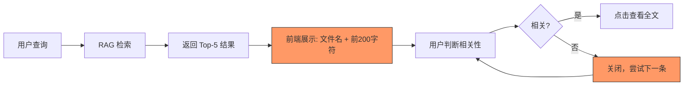
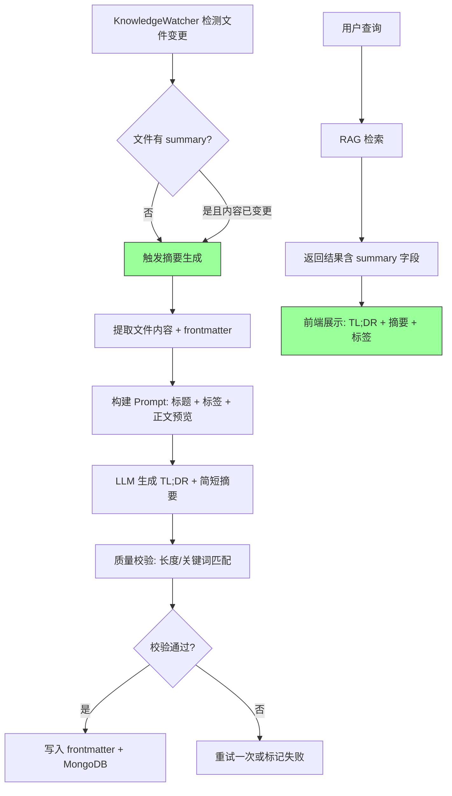

# YK-09-45: 知识库内容摘要自动生成 — LLM 驱动的 TL;DR 标注

> 需求编号：YK-09-45 · 优先级：P2 · 人天：0.5d · 状态：需求已编写

---

## 一、背景

### 1.1 问题描述

YiKnowledge 800+ 文件目前仅靠文件名和 tags 描述——在 RAG 检索结果中，用户看到的是文档前 200 字符的截断内容。这种预览方式存在三个问题：

1. **信息密度低**：文档前 200 字符通常包含 frontmatter 元数据、目录链接或过渡语句，而非核心内容摘要。
2. **判断效率低**：用户需要点开多个文档才能判断哪个真正相关——在 5 条结果中，平均有 2 条需要点开确认。
3. **无 TL;DR**：缺少一句话总结，用户无法快速判断文档对自己的价值（"这个文档讲的是 RAG 参数调优，但我需要的是 RAG 部署配置"）。

### 1.2 影响量化

| 影响维度 | 量化 | 说明 |
|----------|------|------|
| 用户判断时间 | 平均 15s/文档 | 需要点开并阅读开头才能判断相关性 |
| 无效点击率 | ~40% | 点开后发现不相关而关闭 |
| 检索预览质量 | 低 | 前 200 字符截断通常不是有效摘要 |

### 1.3 核心挑战

- **摘要质量**：LLM 生成的摘要是否准确反映文档核心内容——避免 Hallucination。
- **长度控制**：TL;DR 需要 ≤ 30 字，简短摘要 ≤ 100 字——LLM 能否精确控制字数。
- **批量生成**：800+ 文件批量生成摘要，如何避免 LLM 过载和速率限制。
- **增量更新**：文档内容更新后，摘要如何自动重新生成。

---

## 二、现状分析

### 2.1 当前数据流



### 2.2 根因分析矩阵

| 根因 | 类别 | 影响 | 优先级 |
|------|------|------|--------|
| 无文档摘要字段 | 数据缺失 | 检索预览质量低 | P0 |
| 前 200 字符截断非有效摘要 | 展示缺陷 | 用户判断效率低 | P0 |
| 无 TL;DR 快速总结 | 功能缺失 | 无法快速判断相关性 | P1 |
| 摘要生成依赖人工 | 流程缺失 | 800+ 文件覆盖不现实 | P1 |

### 2.3 现有资产

- YiAi 已集成 Ollama LLM，可生成摘要文本。
- 知识文件已有 frontmatter 结构，可新增 `summary` 和 `tldr` 字段。
- KnowledgeWatcher 可检测文件变更，触发摘要重新生成。
- YK-09-49 内容难度评级可复用内容分析逻辑。

---

## 三、设计决策

### D-01：摘要生成方式

| 方案 | 描述 | 优点 | 缺点 | 决策 |
|------|------|------|------|------|
| A: 规则提取（首段/首句） | 提取文档第一段作为摘要 | 简单，零 LLM 成本 | 首段可能是 frontmatter 或目录 | 否决 |
| B: LLM 生成 | 使用 LLM 根据全文生成摘要 | 高质量，准确 | 有 LLM 成本，可能有 Hallucination | **采用** |
| C: 混合（提取 + LLM 润色） | 先提取关键段落，再 LLM 总结 | 质量高 + 成本低 | 实现复杂 | 远期方案 |

**决策**：采用方案 B——LLM 直接生成，质量最高，后续可结合方案 C 优化成本。

### D-02：摘要长度控制

| 方案 | 描述 | 优点 | 缺点 | 决策 |
|------|------|------|------|------|
| A: Prompt 约束 | 在 Prompt 中要求字数限制 | 简单 | LLM 可能不精确遵守 | **采用** |
| B: 后处理截断 | 生成后按字数硬截断 | 精确 | 可能在句子中间截断 | 补充方案 |
| C: 多次生成直到满足 | 不满意就重新生成 | 质量最好 | 成本高 | 否决 |

**决策**：方案 A 为主（Prompt 约束），方案 B 兜底（后处理截断确保不超限）。

### D-03：批量生成策略

| 方案 | 描述 | 优点 | 缺点 | 决策 |
|------|------|------|------|------|
| A: 一次性全量 | 800+ 文件一次性生成 | 最快 | LLM 过载，可能超时 | 否决 |
| B: 分批限速 | 每批 20 个，间隔 1 分钟 | 稳定 | 耗时长（~40 批 × 1 分钟） | **采用** |
| C: 懒加载 | 仅在被检索时生成 | 成本最低 | 首次检索延迟高 | 补充方案 |

**决策**：采用方案 B + C——后台批量生成覆盖存量文件，检索时懒加载兜底新文件。

### D-04：摘要存储位置

| 方案 | 描述 | 优点 | 缺点 | 决策 |
|------|------|------|------|------|
| A: Frontmatter 字段 | 存储在文件 frontmatter 中 | 与文件共存，Git 可追踪 | frontmatter 膨胀 | **采用** |
| B: MongoDB 独立字段 | 存储在 `knowledge_files` 集合 | 不污染文件 | 与文件内容分离 | 补充方案 |
| C: 独立缓存文件 | 摘要单独存为 `.summary.json` | 文件与摘要解耦 | 文件数量翻倍 | 否决 |

**决策**：方案 A + B 双写——frontmatter 为主（Git 可追踪），MongoDB 为副本（检索时快速读取）。

---

## 四、目标架构

### 4.1 目标数据流



### 4.2 核心指标

| 指标 | 当前值 | 目标值 | 测量方式 |
|------|--------|--------|----------|
| 摘要覆盖率 | 0% | > 90% | `frontmatter.summary` 字段填充率 |
| 摘要准确率 | — | > 90% | 人工抽查 20 个摘要与原文的匹配度 |
| 摘要生成延迟 | — | < 10s/文件 | 单文件摘要生成耗时 |
| 用户判断效率 | 15s/文档 | < 5s/文档 | 用户从看到结果到点击的时间差 |

### 4.3 架构权衡

| 权衡 | 选择 | 理由 |
|------|------|------|
| 质量 vs 成本 | 优先质量 | LLM 生成质量高，成本可接受（~560K tokens/全量） |
| 实时 vs 离线 | 离线批量 + 检索懒加载 | 摘要对实时性要求不高 |
| 存储 vs 计算 | 存储摘要 | 一次生成多次使用，节省 LLM 重复调用 |

---

## 五、具体改动

### 5.1 核心代码

```python
# YiAi/src/domain/knowledge/summarizer.py

import re
from datetime import datetime, timedelta

class ContentSummarizer:
    """基于 LLM 的知识文件摘要自动生成。"""

    MAX_TLDR_LENGTH = 30   # TL;DR 最大字数
    MAX_SUMMARY_LENGTH = 100  # 简短摘要最大字数
    CONTENT_PREVIEW_LENGTH = 1500  # 发送给 LLM 的内容预览长度

    def __init__(self, llm_service, db, file_reader):
        self.llm = llm_service
        self.db = db
        self.reader = file_reader

    async def generate_summary(self, file_path: str) -> dict:
        """为知识文件生成 TL;DR + 简短摘要。"""
        content = self.reader.read(file_path)
        frontmatter = self.reader.parse_frontmatter(content)

        # 提取内容预览（去除 frontmatter 和代码块）
        body = self._extract_body(content)
        preview = body[:self.CONTENT_PREVIEW_LENGTH]

        # 构建 Prompt
        prompt = f"""为以下知识文件生成摘要:

文件名: {frontmatter.get('title', file_path)}
标签: {', '.join(frontmatter.get('tags', []))}
分类: {frontmatter.get('category', '')}

正文预览:
{preview}

请生成:
1. TL;DR: 一句话概括核心内容（≤ {self.MAX_TLDR_LENGTH} 字）
2. 摘要: 3 句话简述主要内容（≤ {self.MAX_SUMMARY_LENGTH} 字）

输出格式:
TL;DR: <内容>
摘要: <内容>
"""
        response = await self.llm.chat([{"role": "user", "content": prompt}])

        # 解析 LLM 输出
        tldr = self._parse_field(response, 'TL;DR')
        summary = self._parse_field(response, '摘要')

        # 后处理截断
        tldr = self._truncate(tldr, self.MAX_TLDR_LENGTH)
        summary = self._truncate(summary, self.MAX_SUMMARY_LENGTH)

        # 质量校验
        quality = self._validate_quality(tldr, summary, frontmatter)

        if quality['passed']:
            # 写入 frontmatter + MongoDB
            frontmatter['summary'] = summary
            frontmatter['tldr'] = tldr
            frontmatter['summary_generated_at'] = datetime.utcnow().isoformat()
            self.reader.update_frontmatter(file_path, frontmatter)

            await self.db.knowledge_files.update_one(
                {'path': file_path},
                {'$set': {
                    'frontmatter.summary': summary,
                    'frontmatter.tldr': tldr,
                    'frontmatter.summary_generated_at': datetime.utcnow().isoformat(),
                }}
            )

        return {
            'file': file_path,
            'tldr': tldr,
            'summary': summary,
            'quality': quality,
        }

    async def batch_generate(self, days_threshold: int = 30,
                             batch_size: int = 20,
                             interval_seconds: int = 60) -> dict:
        """批量生成——分批限速。"""
        cutoff = datetime.utcnow() - timedelta(days=days_threshold)

        # 优先处理最近更新且无摘要的文件
        files = await self.db.knowledge_files.find({
            '$or': [
                {'frontmatter.summary': {'$exists': False}},
                {'frontmatter.summary_generated_at': {'$exists': False}},
            ],
            'frontmatter.updated': {'$gte': cutoff.strftime('%Y-%m-%d')},
        }).sort('frontmatter.updated', -1).to_list(None)

        total = len(files)
        generated = 0
        failed = 0

        for i in range(0, total, batch_size):
            batch = files[i:i + batch_size]
            for file in batch:
                try:
                    result = await self.generate_summary(file['path'])
                    if result['quality']['passed']:
                        generated += 1
                    else:
                        failed += 1
                except Exception as e:
                    logger.error(f"[Summarizer] 摘要生成失败: {file['path']}, {e}")
                    failed += 1

            if i + batch_size < total:
                await asyncio.sleep(interval_seconds)

        return {'total': total, 'generated': generated, 'failed': failed}

    def _extract_body(self, content: str) -> str:
        """提取正文——去除 frontmatter 和代码块。"""
        # 去除 YAML frontmatter
        if content.startswith('---'):
            parts = content.split('---', 2)
            content = parts[2] if len(parts) > 2 else content
        # 去除代码块（用占位符替代）
        content = re.sub(r'```[\s\S]*?```', '[代码块]', content)
        return content.strip()

    def _parse_field(self, text: str, field: str) -> str:
        """从 LLM 输出中解析字段。"""
        pattern = rf'{field}[：:]\s*(.+)'
        match = re.search(pattern, text)
        return match.group(1).strip() if match else ''

    def _truncate(self, text: str, max_length: int) -> str:
        """截断到最大字数——在完整句子边界截断。"""
        if len(text) <= max_length:
            return text
        truncated = text[:max_length]
        # 找到最后一个句号或逗号
        last_punct = max(truncated.rfind('。'), truncated.rfind('，'), truncated.rfind('.'))
        if last_punct > max_length * 0.5:
            return truncated[:last_punct + 1]
        return truncated + '…'

    def _validate_quality(self, tldr: str, summary: str,
                          frontmatter: dict) -> dict:
        """质量校验。"""
        issues = []

        if not tldr:
            issues.append('TL;DR 为空')
        if not summary:
            issues.append('摘要为空')
        if len(tldr) > self.MAX_TLDR_LENGTH * 2:
            issues.append(f'TL;DR 过长 ({len(tldr)} 字)')
        if len(summary) > self.MAX_SUMMARY_LENGTH * 2:
            issues.append(f'摘要过长 ({len(summary)} 字)')

        # 关键词校验：摘要中至少包含 1 个标签词
        tags = frontmatter.get('tags', [])
        if tags and summary:
            tag_match = any(tag.lower() in summary.lower() for tag in tags)
            if not tag_match:
                issues.append('摘要未包含任何标签词——可能偏离主题')

        return {
            'passed': len(issues) == 0,
            'issues': issues,
        }
```

### 5.2 摘要展示效果

```markdown
┌─ 检索结果卡片 ─────────────────────────────────────┐
│ 📄 RAG 混合检索 Alpha 调优                          │
│ TL;DR: BM25 与向量检索的混合权重基于查询类型和反馈   │
│        数据自动优化，实现检索质量自适应提升。         │
│                                                     │
│ 摘要: 本文介绍了 RAG 混合检索中 alpha 参数的动态调优 │
│ 方法。基于查询类型分类（短查询偏 BM25，长查询偏语义）│
│ 和用户反馈的 EMA 平滑更新，实现检索质量的持续优化。   │
│                                                     │
│ 🏷 [RAG] [混合检索] [Alpha调优] [BM25] [向量检索]    │
│ 🌳 高级 (4.2/5) · 📊 权威性: 0.028 (被引用 38 次)    │
└─────────────────────────────────────────────────────┘
```

### 5.3 文件变更清单

| 文件路径 | 操作 | 说明 |
|----------|------|------|
| `YiAi/src/domain/knowledge/summarizer.py` | 新增 | 摘要生成核心逻辑 |
| `YiAi/src/services/knowledge/knowledge_watcher.py` | 修改 | 文件变更时触发摘要重新生成 |
| `YiAi/src/services/knowledge/scheduled_tasks.py` | 修改 | 新增批量摘要生成定时任务 |
| `YiVad/src/components/chat/SearchResultCard.vue` | 修改 | 展示 TL;DR + 摘要 |
| `YiPet/src/components/SearchResult.vue` | 修改 | 展示 TL;DR + 摘要 |

---

## 六、实施步骤

| 步骤 | 内容 | 验证方法 | 人天 |
|------|------|----------|------|
| 1 | 实现 `ContentSummarizer` 核心类 | 单元测试：摘要生成 + 质量校验 | 0.5 |
| 2 | 实现 Prompt 模板 + 输出解析 | 手动测试：5 个文件生成摘要质量 | 0.3 |
| 3 | 实现批量生成（分批限速） | 集成测试：20 个文件批量生成 | 0.3 |
| 4 | 集成到 KnowledgeWatcher | 端到端：修改文件 → 自动重新生成摘要 | 0.3 |
| 5 | 前端展示适配 | 手动测试：检索结果卡片展示摘要 | 0.5 |
| 6 | 首次全量批量生成 | 监控：800+ 文件生成进度和质量 | 0.5 |

**总计**：2.4 人天

---

## 七、性能分析

### 7.1 摘要生成延迟

| 操作 | 耗时 | 说明 |
|------|------|------|
| 文件读取 + frontmatter 解析 | ~10ms | 本地文件系统 |
| LLM 推理（摘要生成） | ~5s | qwen2.5:14b，1500 字输入 |
| 质量校验 + 写入 | ~20ms | 正则 + MongoDB 更新 |
| 单文件总延迟 | ~5s | — |

### 7.2 批量生成容量

| 规模 | 总耗时 | 策略 |
|------|--------|------|
| 20 文件（1 批） | ~2 分钟 | 串行处理 |
| 200 文件（10 批） | ~30 分钟 | 每批 20，间隔 1 分钟 |
| 800 文件（40 批） | ~2 小时 | 每批 20，间隔 1 分钟 |

### 7.3 LLM Token 消耗

| 项目 | 单文件 | 800 文件全量 |
|------|--------|------------|
| Input tokens | ~500 | ~400K |
| Output tokens | ~150 | ~120K |
| 总 tokens | ~650 | ~520K |

---

## 八、测试规格

### 8.1 单元测试

**测试用例 1：摘要生成成功**

```
GIVEN 一个包含 RAG 技术内容的知识文件
WHEN 调用 generate_summary(file_path)
THEN 返回的 tldr 长度 ≤ 30 字
AND 返回的 summary 长度 ≤ 100 字
AND quality.passed = True
```

**测试用例 2：空内容处理**

```
GIVEN 一个只有 frontmatter 没有正文的文件
WHEN 调用 generate_summary(file_path)
THEN 返回的 quality.passed = False
AND quality.issues 包含 "TL;DR 为空"
```

**测试用例 3：后处理截断**

```
GIVEN LLM 返回的摘要长度为 150 字（超过 100 字限制）
WHEN 调用 _truncate(summary, 100)
THEN 返回的摘要长度 ≤ 100 字
AND 在句号或逗号处截断（不在词中间）
```

**测试用例 4：关键词校验**

```
GIVEN 文件的 tags 包含 ["RAG", "混合检索"]
AND LLM 生成的摘要完全不包含这两个词
WHEN 调用 _validate_quality(tldr, summary, frontmatter)
THEN quality.issues 包含 "摘要未包含任何标签词"
```

### 8.2 集成测试

**测试用例 5：端到端检索展示**

```
GIVEN 知识库文件已生成 summary 和 tldr
WHEN 用户搜索 "RAG 优化"
AND 检索结果返回
THEN 每条结果包含 tldr 和 summary 字段
AND 前端展示 TL;DR 和摘要，而非原文截断
```

**测试用例 6：增量更新触发**

```
GIVEN 一个已有摘要的文件
WHEN 文件内容被修改
AND KnowledgeWatcher 检测到变更
THEN 自动触发摘要重新生成
AND 新摘要覆盖旧摘要
```

---

## 九、风险与缓解

### 9.1 风险矩阵

| 风险 | 概率 | 影响 | 缓解措施 |
|------|------|------|----------|
| LLM Hallucination——生成偏离主题的摘要 | 中 | 高——误导用户 | 关键词校验 + 人工抽查 |
| 批量生成触发 LLM 过载 | 低 | 中——生成延迟或失败 | 分批限速 + 间隔控制 |
| 摘要质量不稳定 | 中 | 中——不同文件摘要质量参差 | 质量校验 + 低质量标记 |
| 摘要与内容不同步 | 低 | 中——用户看到过时摘要 | KnowledgeWatcher 自动触发重新生成 |

### 9.2 质量保障

1. **关键词校验**：摘要中至少包含 1 个文件标签词——确保不偏离主题。
2. **长度校验**：TL;DR 和摘要不得超过最大长度 2 倍（否则明显异常）。
3. **人工抽查**：首次批量生成后抽查 20 个文件摘要质量。
4. **用户反馈**：检索结果中提供"摘要不准确"反馈按钮。

---

## 十、回滚策略

| 场景 | 回滚操作 | 影响范围 |
|------|----------|----------|
| 摘要质量大面积不达标 | 清空已生成的摘要字段，回退到原文截断展示 | 检索预览降级 |
| LLM 服务不可用 | 摘要生成暂停，检索预览回退到原文截断 | 无新摘要生成 |
| 摘要生成导致延迟 | 降级为懒加载模式（仅检索时生成，不批量处理） | 首次检索延迟增加 |

---

## 十一、设计决策记录

### D-01：生成方式——LLM 直接生成

**背景**：需要在摘要质量和生成成本之间权衡。
**决策**：使用 LLM 根据全文（含 frontmatter 元数据）直接生成 TL;DR 和简短摘要。
**后果**：生成质量高，但需控制 LLM 调用成本和速率。

### D-02：存储策略——Frontmatter + MongoDB 双写

**背景**：摘要需要与文件共存（Git 可追踪），同时需要高效检索（MongoDB 索引）。
**决策**：Frontmatter 为主存储，MongoDB 为副本（检索时无需解析文件）。
**后果**：需维护双写一致性，摘要更新时同步两处。

### D-03：批量策略——分批限速

**背景**：800+ 文件不能一次性生成，需避免 LLM 过载。
**决策**：每批 20 个文件，批间间隔 1 分钟。
**后果**：全量生成耗时约 2 小时，但可在后台运行，不影响用户体验。

---

## 十二、可观测性

### 12.1 指标

| 指标名称 | 类型 | 说明 |
|----------|------|------|
| `summary_coverage` | Gauge | 摘要覆盖率（有摘要的文件数 / 总文件数） |
| `summary_generation_latency_seconds` | Histogram | 单文件摘要生成耗时 |
| `summary_quality_pass_rate` | Gauge | 质量校验通过率 |
| `summary_batch_progress` | Gauge | 批量生成进度（已处理 / 总数） |

### 12.2 日志

```python
logger.info(f"[Summarizer] 开始生成摘要: {file_path}")
logger.info(f"[Summarizer] 摘要生成完成: {file_path}, "
            f"TL;DR={len(tldr)}字, 摘要={len(summary)}字, 质量={'通过' if quality['passed'] else '未通过'}")
logger.warning(f"[Summarizer] 摘要质量校验未通过: {file_path}, 问题: {quality['issues']}")
logger.info(f"[Summarizer] 批量生成进度: {generated}/{total}, 失败: {failed}")
```

### 12.3 告警

| 告警 | 条件 | 级别 |
|------|------|------|
| 摘要质量大面积不达标 | `summary_quality_pass_rate` < 70% | P2 |
| LLM 生成连续失败 | 连续 10 次生成失败 | P1 |
| 摘要覆盖率低 | `summary_coverage` < 50% | P2 |

---

## 十三、安全合规

| 要求 | 实现方式 |
|------|----------|
| 数据不外传 | 使用本地 Ollama LLM，文件内容不发送到外部 API |
| 敏感文件保护 | `confidential: true` 的文件跳过摘要生成 |
| 摘要不包含敏感信息 | Prompt 中要求不包含 API Key、密码等敏感信息 |
| 审计追踪 | 每次摘要生成记录到 `summary_generation_log` 集合 |

---

## 十四、代码审查检查清单

- [ ] 摘要通过 LLM 自动生成（基于文件内容和 frontmatter 元数据）
- [ ] TL;DR 长度限制 30 字，简短摘要限制 100 字
- [ ] 后处理截断在完整句子边界进行（句号/逗号处）
- [ ] 质量校验：长度检查 + 关键词匹配（至少 1 个标签词）
- [ ] 摘要存储在 frontmatter + MongoDB 双写
- [ ] 批量生成支持分批限速（20 个/批，间隔 1 分钟）
- [ ] KnowledgeWatcher 检测到文件变更时自动重新生成摘要
- [ ] `confidential: true` 的文件跳过摘要生成
- [ ] 检索结果前端展示 TL;DR + 摘要 + 标签
- [ ] 摘要生成操作记录到 `summary_generation_log` 集合
- [ ] 空内容和无标签文件的安全处理
- [ ] 首次批量生成后人工抽查 20 个文件摘要质量

---

*PRD 来源: `projects/yiknowledge/requirements/2026-09/45-需求-内容摘要自动生成.md`*