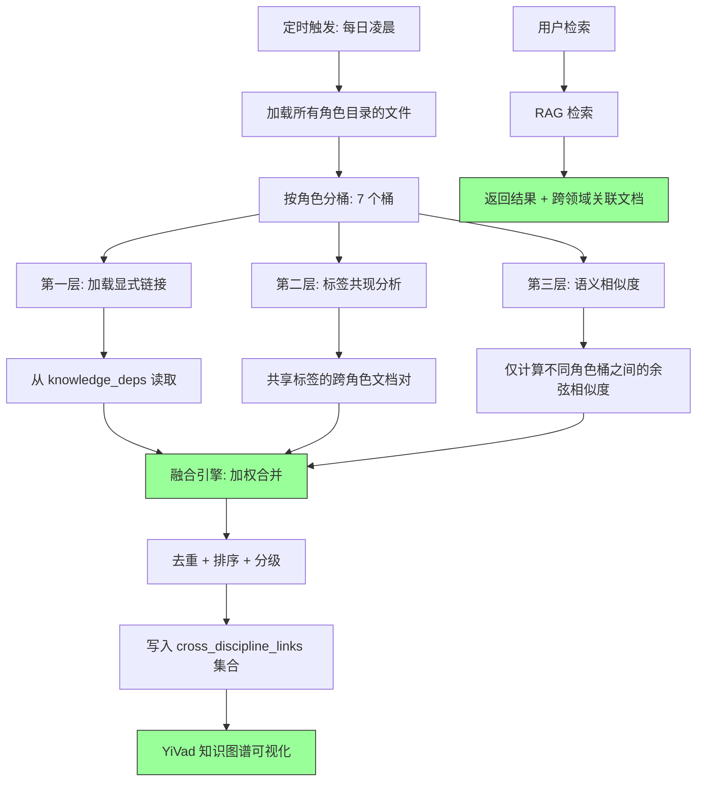

# YK-09-46: 知识库跨领域知识融合 — 多角色交叉引用与知识图谱

> 需求编号：YK-09-46 · 优先级：P2 · 人天：0.5d · 状态：需求已编写
> 依赖：YK-09-08（跨项目知识依赖图谱）、YK-09-27（链接拓扑可视化）

---

## 一、背景

### 1.1 问题描述

YiKnowledge 的 8 个角色目录从不同视角组织知识，但同一技术主题天然具有跨角色属性。以"限流策略"为例：

- `engineer/rate-limiting-impl.md`：代码实现视角——令牌桶算法、滑动窗口实现。
- `srer/rate-limit-config.md`：运维视角——K8s ingress 限流配置、Nginx 限流规则。
- `aier/model-rate-limiting.md`：AI 视角——LLM API 速率限制、Agent 并发控制。
- `leader/rate-limiting-strategy.md`：架构决策视角——限流策略选型与全局限流架构。

这四个文件在语义上高度相关，但当前知识库中它们之间没有任何显式链接——用户检索"限流策略"时只能看到单一角色视角的结果。

### 1.2 影响量化

| 影响维度 | 量化 | 说明 |
|----------|------|------|
| 知识碎片化 | 4+ 视角 | 同一主题分散在多个角色目录 |
| 检索遗漏 | 按角色过滤时丢失 75% 相关文档 | 用户只在一个角色目录中搜索 |
| 知识盲区 | 工程师不了解运维限流配置 | 跨角色知识未关联 |

### 1.3 核心挑战

- **语义相似度 vs 真正相关**：同一主题的不同视角文档在语义上可能相似度不高（"令牌桶算法"和"K8s ingress 配置"用词差异大），需要多维度关联策略。
- **计算复杂度**：800+ 文件两两比较需要 640K 次 Embedding 距离计算——O(n²) 不可接受。
- **融合置信度**：如何量化两个文档的跨领域关联强度——是"强相关"还是"弱参考"。

---

## 二、现状分析

### 2.1 当前数据流

```mermaid
graph LR
    A[engineer/rate-limiting.md] --> B[RAG 检索]
    C[srer/rate-limit-config.md] --> B
    D[aier/model-rate-limiting.md] --> B
    
    B --> E[用户查询 "限流策略"]
    E --> F{用户角色过滤?}
    F -->|engineer| G[仅返回 engineer/ 结果]
    F -->|无过滤| H[返回所有结果，但无关联标注]
    
    style G fill:#f96,stroke:#333
    style H fill:#f96,stroke:#333
```

### 2.2 根因分析矩阵

| 根因 | 类别 | 影响 | 优先级 |
|------|------|------|--------|
| 角色目录间无显式链接 | 结构缺失 | 跨角色知识不可发现 | P0 |
| 检索未融合跨角色结果 | 功能缺失 | 单一视角结果 | P0 |
| 无跨领域关联强度量化 | 算法缺失 | 关联质量不可控 | P1 |
| 两两比较计算量 O(n²) | 性能瓶颈 | 全量分析不可行 | P1 |

### 2.3 现有资产

- YK-09-08 已建立文件级别的显式依赖图（`knowledge_deps` 集合）。
- YK-09-27 已实现链接拓扑可视化（前端展示）。
- 每个文件已有 Embedding 向量（768 维）。
- 每个文件已有 tags 字段（可用于标签共现分析）。

---

## 三、设计决策

### D-01：关联发现策略——三层融合

| 方案 | 描述 | 优点 | 缺点 | 决策 |
|------|------|------|------|------|
| A: 仅显式链接 | 基于人工添加的 `[[wiki-link]]` | 精确 | 覆盖率低，依赖人工 | 部分采用 |
| B: 仅语义相似度 | 基于 Embedding 余弦相似度 | 自动发现 | 噪音多，计算量大 | 部分采用 |
| C: 三层融合（显式 + 标签 + 语义） | 三层关联，加权融合 | 覆盖全面 + 精度可控 | 实现复杂 | **采用** |

**决策**：采用方案 C——三层融合。

- **第一层：显式链接**（权重 3）：人工添加的 `[[wiki-link]]` 和 YK-09-08 依赖图——精确度最高。
- **第二层：标签共现**（权重 2）：共享标签的文档——如都标记了 `[限流]`、`[RateLimiting]`。
- **第三层：语义相似度**（权重 1）：Embedding 余弦相似度——自动发现未显式关联的文档。

### D-02：计算优化——按角色分桶

| 方案 | 描述 | 优点 | 缺点 | 决策 |
|------|------|------|------|------|
| A: 全量两两比较 | 800 文件 O(n²) | 完整 | 640K 次比较，太慢 | 否决 |
| B: 按角色分桶 | 仅比较不同角色目录间的文件 | 精准 + 高效 | 同角色内部关联缺失 | **采用** |
| C: 倒排索引加速 | 通过 tags 倒排索引减少候选 | 高效 | 依赖标签质量 | 补充方案 |

**决策**：采用方案 B——跨领域融合关注的是不同角色间的关联，同角色内的关联不在本需求范围内。

### D-03：关联强度分类

| 方案 | 描述 | 优点 | 缺点 | 决策 |
|------|------|------|------|------|
| A: 连续值 | 返回原始相似度值 | 信息完整 | 用户难以理解 | 否决 |
| B: 三级分类 | 强相关/中等/弱参考 | 直观 | 信息损失 | **采用** |
| C: 二分类 | 相关/不相关 | 最简单 | 过于粗糙 | 否决 |

**决策**：采用方案 B——`strong (>0.85)` / `moderate (0.75-0.85)` / `weak (0.65-0.75)`。

### D-04：知识图谱输出格式

| 方案 | 描述 | 优点 | 缺点 | 决策 |
|------|------|------|------|------|
| A: JSON 图数据 | 返回 nodes + edges | 灵活，前端可自由渲染 | 前端需自行实现可视化 | **采用** |
| B: Mermaid 代码 | 返回 Mermaid 图代码 | 前端可直接渲染 | 灵活性差 | 补充方案 |
| C: 静态图片 | 服务端渲染 PNG | 展示简单 | 不可交互 | 否决 |

**决策**：采用方案 A + B——JSON 为主（前端 D3.js/ECharts 渲染），Mermaid 为纯文本展示。

---

## 四、目标架构

### 4.1 目标数据流



### 4.2 核心指标

| 指标 | 当前值 | 目标值 | 测量方式 |
|------|--------|--------|----------|
| 跨角色关联密度 | < 1% | > 10% | 有跨角色链接的文件数 / 总文件数 |
| 关联准确率 | — | > 80% | 人工抽查 20 个关联的合理性 |
| 融合计算时间 | — | < 30s | 全量融合分析的耗时 |
| 检索结果关联展示 | 无 | 每条结果附带 2-3 个关联文档 | 统计关联文档展示数 |

### 4.3 架构权衡

| 权衡 | 选择 | 理由 |
|------|------|------|
| 精度 vs 覆盖 | 偏好精度 | 误关联比漏关联更损害信任 |
| 实时 vs 离线 | 离线计算 | 跨角色关联不频繁变化，离线计算足够 |
| 复杂度 vs 可维护性 | 三层架构 | 每层独立可调，降低整体复杂度 |

---

## 五、具体改动

### 5.1 核心代码

```python
# YiAi/src/domain/knowledge/cross_discipline.py

from collections import defaultdict
import numpy as np

class CrossDisciplineFusion:
    """跨角色知识融合——发现不同角色视角下的同一主题。"""

    ROLE_DIRS = ['engineer', 'aier', 'srer', 'leader',
                 'producter', 'curator', 'executiver']

    # 关联强度阈值
    THRESHOLDS = {
        'strong': 0.85,
        'moderate': 0.75,
        'weak': 0.65,
    }

    # 三层融合权重
    WEIGHTS = {
        'explicit': 3.0,
        'tag_cooccurrence': 2.0,
        'semantic': 1.0,
    }

    def __init__(self, db):
        self.db = db

    async def discover_links(self) -> dict:
        """三层融合——发现跨角色关联。"""
        # 加载所有角色文件
        role_docs = await self._load_role_docs()

        all_links = []

        # 第一层：显式链接
        explicit_links = await self._get_explicit_links()
        all_links.extend(explicit_links)

        # 第二层：标签共现
        tag_links = self._get_tag_cooccurrence_links(role_docs)
        all_links.extend(tag_links)

        # 第三层：语义相似度（仅跨角色）
        semantic_links = await self._get_semantic_links(role_docs)
        all_links.extend(semantic_links)

        # 融合 + 去重 + 分级
        merged = self._merge_links(all_links)
        ranked = self._rank_and_classify(merged)

        # 写入数据库
        await self._persist_links(ranked)

        return {
            'total_links': len(ranked),
            'by_strength': {
                'strong': len([l for l in ranked if l['strength'] == 'strong']),
                'moderate': len([l for l in ranked if l['strength'] == 'moderate']),
                'weak': len([l for l in ranked if l['strength'] == 'weak']),
            },
            'by_layer': {
                'explicit': len(explicit_links),
                'tag_cooccurrence': len(tag_links),
                'semantic': len(semantic_links),
            },
        }

    async def _load_role_docs(self) -> dict[str, list[dict]]:
        """按角色分桶加载文档。"""
        role_docs = defaultdict(list)
        for role in self.ROLE_DIRS:
            docs = await self.db.knowledge_files.find({
                'path': {'$regex': f'^{role}/'}
            }).to_list(None)
            role_docs[role] = [d for d in docs if d.get('embedding')]
        return role_docs

    async def _get_explicit_links(self) -> list[dict]:
        """第一层：显式链接——从 knowledge_deps 读取。"""
        deps = await self.db.knowledge_deps.find({
            'strength': {'$in': ['strong', 'moderate']},
        }).to_list(None)

        links = []
        for dep in deps:
            source_role = dep['source_file'].split('/')[0]
            target_role = dep['target_file'].split('/')[0]
            if source_role != target_role:  # 仅跨角色
                links.append({
                    'source': dep['source_file'],
                    'source_role': source_role,
                    'target': dep['target_file'],
                    'target_role': target_role,
                    'score': self.WEIGHTS['explicit'],
                    'layer': 'explicit',
                    'evidence': f"显式依赖: {dep.get('type', 'unknown')}",
                })
        return links

    def _get_tag_cooccurrence_links(self, role_docs: dict) -> list[dict]:
        """第二层：标签共现——共享标签的跨角色文档。"""
        links = []
        roles = list(role_docs.keys())

        for i, role_a in enumerate(roles):
            for role_b in roles[i + 1:]:
                for doc_a in role_docs[role_a]:
                    tags_a = set(doc_a.get('frontmatter', {}).get('tags', []))
                    for doc_b in role_docs[role_b]:
                        tags_b = set(doc_b.get('frontmatter', {}).get('tags', []))
                        shared = tags_a & tags_b
                        if len(shared) >= 2:  # 至少共享 2 个标签
                            links.append({
                                'source': doc_a['path'],
                                'source_role': role_a,
                                'target': doc_b['path'],
                                'target_role': role_b,
                                'score': self.WEIGHTS['tag_cooccurrence'] * len(shared),
                                'layer': 'tag_cooccurrence',
                                'shared_tags': list(shared),
                                'evidence': f"共享标签: {', '.join(shared)}",
                            })
        return links

    async def _get_semantic_links(self, role_docs: dict) -> list[dict]:
        """第三层：语义相似度——仅跨角色比较。"""
        links = []
        roles = list(role_docs.keys())

        for i, role_a in enumerate(roles):
            for role_b in roles[i + 1:]:
                for doc_a in role_docs[role_a]:
                    for doc_b in role_docs[role_b]:
                        sim = self._cosine_sim(
                            doc_a['embedding'], doc_b['embedding']
                        )
                        if sim >= self.THRESHOLDS['weak']:
                            links.append({
                                'source': doc_a['path'],
                                'source_role': role_a,
                                'target': doc_b['path'],
                                'target_role': role_b,
                                'score': self.WEIGHTS['semantic'] * sim,
                                'layer': 'semantic',
                                'similarity': round(sim, 3),
                                'evidence': f"语义相似度: {sim:.3f}",
                            })
        return links

    def _merge_links(self, links: list[dict]) -> list[dict]:
        """融合——同一文档对的多个来源合并。"""
        merged = {}
        for link in links:
            key = tuple(sorted([link['source'], link['target']]))
            if key not in merged:
                merged[key] = {**link, 'layers': [link['layer']], 'total_score': link['score']}
            else:
                merged[key]['total_score'] += link['score']
                merged[key]['layers'].append(link['layer'])
                if 'shared_tags' in link:
                    merged[key].setdefault('shared_tags', []).extend(link.get('shared_tags', []))
        return list(merged.values())

    def _rank_and_classify(self, links: list[dict]) -> list[dict]:
        """排序 + 分级。"""
        for link in links:
            normalized = link['total_score'] / sum(self.WEIGHTS.values())
            if normalized >= self.THRESHOLDS['strong']:
                link['strength'] = 'strong'
            elif normalized >= self.THRESHOLDS['moderate']:
                link['strength'] = 'moderate'
            else:
                link['strength'] = 'weak'

        return sorted(links, key=lambda l: l['total_score'], reverse=True)

    async def build_knowledge_graph(self) -> dict:
        """构建知识图谱——节点 + 边。"""
        nodes = []
        edges = []

        # 文件节点
        async for doc in self.db.knowledge_files.find():
            role = doc['path'].split('/')[0]
            nodes.append({
                'id': doc['path'],
                'label': doc.get('frontmatter', {}).get('title', doc['path']),
                'role': role,
                'tags': doc.get('frontmatter', {}).get('tags', []),
                'difficulty': doc.get('frontmatter', {}).get('difficulty', 'intermediate'),
            })

        # 跨角色关联边
        async for link in self.db.cross_discipline_links.find():
            edges.append({
                'source': link['source'],
                'target': link['target'],
                'type': 'cross_discipline',
                'strength': link['strength'],
                'layers': link.get('layers', []),
                'weight': {'strong': 3, 'moderate': 2, 'weak': 1}[link['strength']],
            })

        return {'nodes': nodes, 'edges': edges}

    def _cosine_sim(self, a: list[float], b: list[float]) -> float:
        dot = sum(x * y for x, y in zip(a, b))
        norm_a = sum(x * x for x in a) ** 0.5
        norm_b = sum(x * x for x in b) ** 0.5
        return dot / max(norm_a * norm_b, 1e-10)
```

### 5.2 跨角色融合示例

```markdown
主题: "限流策略"——跨角色知识融合

  engineer/rate-limiting-impl.md (代码实现)
  ├── 语义相似: 0.82 → srer/rate-limit-config.md
  └── 标签共现: [限流, RateLimiting] → aier/model-rate-limiting.md

  srer/rate-limit-config.md (运维配置)
  ├── 语义相似: 0.78 → aier/model-rate-limiting.md
  └── 显式链接: "参见 leader/rate-limiting-strategy.md"

  aier/model-rate-limiting.md (AI 限速)
  └── 显式链接: "参见 engineer/rate-limiting-impl.md"

  leader/rate-limiting-strategy.md (架构决策)
  └── 标签共现: [限流, 架构决策] → 所有限流相关文档
```

### 5.3 文件变更清单

| 文件路径 | 操作 | 说明 |
|----------|------|------|
| `YiAi/src/domain/knowledge/cross_discipline.py` | 新增 | 三层融合核心逻辑 |
| `YiAi/src/services/knowledge/scheduled_tasks.py` | 修改 | 新增每日融合分析任务 |
| `YiAi/src/routers/knowledge_router.py` | 修改 | 新增 `/knowledge/cross-discipline-links` 端点 |
| `YiVad/src/views/knowledge/KnowledgeGraph.vue` | 修改 | 展示跨角色关联（虚线边） |
| `YiAi/src/domain/knowledge/graph_builder.py` | 修改 | `build_knowledge_graph` 融入跨角色边 |

---

## 六、实施步骤

| 步骤 | 内容 | 验证方法 | 人天 |
|------|------|----------|------|
| 1 | 实现 `CrossDisciplineFusion` 三层融合 | 单元测试：每层独立验证 | 1.0 |
| 2 | 实现融合引擎（加权合并 + 去重 + 分级） | 单元测试：模拟多层来源合并 | 0.5 |
| 3 | 实现知识图谱构建（含跨角色边） | 集成测试：图谱数据完整性 | 0.5 |
| 4 | 新增 API 端点 | 端到端：API 返回跨角色关联数据 | 0.3 |
| 5 | 前端知识图谱展示跨角色关联 | 手动测试：虚线边展示 + 颜色编码 | 1.0 |
| 6 | 首次全量分析 + 人工抽查 | 抽查 20 个关联的合理性 | 0.5 |

**总计**：3.8 人天

---

## 七、性能分析

### 7.1 计算复杂度

| 操作 | 复杂度 | 800 文件规模估算 |
|------|--------|-----------------|
| 显式链接加载 | O(e) | ~5ms（从 knowledge_deps 读取） |
| 标签共现分析 | O(n² * k²) (k=7) | ~200ms（7 个角色桶，每个 ~100 文件） |
| 语义相似度 | O(n² * k²) | ~500ms（跨角色 Embedding 比较） |
| 融合 + 去重 + 分级 | O(m) | ~10ms |
| 总计算时间 | — | ~1s（单次运行，可接受） |

### 7.2 容量规划

| 文件规模 | 计算时间 | 内存 |
|----------|---------|------|
| 800 文件 | ~1s | ~10MB |
| 2000 文件 | ~5s | ~25MB |
| 5000 文件 | ~30s | ~60MB |

---

## 八、测试规格

### 8.1 单元测试

**测试用例 1：显式链接加载**

```
GIVEN knowledge_deps 集合中有 3 条跨角色依赖
WHEN 调用 _get_explicit_links()
THEN 返回 3 条链接
AND 每条链接的 source_role != target_role
AND layer = 'explicit'
```

**测试用例 2：标签共现**

```
GIVEN engineer/ 有文件 tags=['限流', 'RateLimiting', '令牌桶']
AND srer/ 有文件 tags=['限流', 'RateLimiting', 'Nginx']
WHEN 调用 _get_tag_cooccurrence_links(role_docs)
THEN 两个文件被关联
AND shared_tags = ['限流', 'RateLimiting']
AND score = WEIGHTS['tag_cooccurrence'] * 2
```

**测试用例 3：同角色不过滤**

```
GIVEN 两个文件都在 engineer/ 目录
WHEN 调用 _get_semantic_links(role_docs)
THEN 不计算它们之间的语义相似度（仅跨角色）
```

**测试用例 4：融合去重**

```
GIVEN 同一对文档有来自 explicit 和 semantic 两层来源的链接
WHEN 调用 _merge_links(links)
THEN 合并为一条链接
AND layers = ['explicit', 'semantic']
AND total_score = WEIGHTS['explicit'] + WEIGHTS['semantic'] * similarity
```

### 8.2 集成测试

**测试用例 5：端到端融合分析**

```
GIVEN 知识库有 800 个文件，分布在 7 个角色目录
WHEN 调用 discover_links()
THEN 返回跨角色关联总数 > 0
AND 按 strength 分类统计正确
AND 按 layer 分类统计正确
AND 关联写入 cross_discipline_links 集合
```

---

## 九、风险与缓解

### 9.1 风险矩阵

| 风险 | 概率 | 影响 | 缓解措施 |
|------|------|------|----------|
| 标签共现产生大量噪声推荐 | 中 | 中——标签粒度过粗导致误关联 | 要求至少共享 2 个标签 |
| 语义相似度计算量 O(n²) 爆炸 | 低 | 中——大文件库计算耗时 | 按角色分桶，仅跨角色计算 |
| 三层融合权重不合理 | 中 | 低——关联质量参差 | 权重可配置，A/B 测试调优 |
| 关联数据过期 | 低 | 中——新增文件未纳入关联 | 每日定时刷新 |

---

## 十、回滚策略

| 场景 | 回滚操作 | 影响范围 |
|------|----------|----------|
| 关联质量差（误判率 > 30%） | 调整权重/阈值，清空 cross_discipline_links 重建 | 关联数据丢失 |
| 计算超时（> 60s） | 降级为仅显式链接 + 标签共现，跳过语义层 | 语义关联缺失 |
| 前端图谱渲染崩溃 | 限制返回节点数（Top 100），分页加载 | 大图谱不可见 |

---

## 十一、设计决策记录

### D-01：三层融合策略

**背景**：单一关联方式（显式/标签/语义）各有盲区。
**决策**：三层融合——显式链接（权重 3）、标签共现（权重 2）、语义相似度（权重 1）。
**后果**：三层互补，覆盖更全面，但需维护三层数据的同步。

### D-02：按角色分桶优化

**背景**：全量两两比较 O(n²) 不可接受。
**决策**：仅计算不同角色目录间的文件相似度，同角色内视为已有结构关联。
**后果**：同角色内部的潜在关联被忽略，但跨角色是主要需求。

### D-03：关联强度三级分类

**背景**：用户需要知道关联的可靠性。
**决策**：strong (>0.85) / moderate (0.75-0.85) / weak (0.65-0.75)。
**后果**：阈值可能需根据实际数据分布调整。

---

## 十二、可观测性

### 12.1 指标

| 指标名称 | 类型 | 说明 |
|----------|------|------|
| `cross_discipline_total_links` | Gauge | 跨角色关联总数 |
| `cross_discipline_links_by_strength` | Gauge | 按强度分级的关联数 |
| `cross_discipline_links_by_layer` | Gauge | 按层分级的关联数 |
| `cross_discipline_compute_duration_ms` | Histogram | 融合分析计算耗时 |

### 12.2 日志

```python
logger.info(f"[CrossDiscipline] 开始跨角色融合分析，共 {len(ROLE_DIRS)} 个角色目录")
logger.info(f"[CrossDiscipline] 第一层(显式): {len(explicit)} 条, "
            f"第二层(标签): {len(tag)} 条, 第三层(语义): {len(semantic)} 条")
logger.info(f"[CrossDiscipline] 融合后: {len(merged)} 条关联, "
            f"strong={strong}, moderate={moderate}, weak={weak}")
```

---

## 十三、安全合规

| 要求 | 实现方式 |
|------|----------|
| 关联数据不暴露敏感内容 | 仅存储文件路径和关联分数，不存储内容 |
| 关联分析可审计 | 每次分析记录到 `cross_discipline_analysis_log` |
| 前端图谱权限控制 | 仅 curator 和 aier 角色可查看完整图谱 |

---

## 十四、代码审查检查清单

- [ ] 跨领域知识融合基于三层策略：显式链接 + 标签共现 + 语义相似度
- [ ] 三层权重：显式 3.0 / 标签共现 2.0 / 语义相似度 1.0
- [ ] 仅计算不同角色目录间的关联（按角色分桶）
- [ ] 标签共现至少共享 2 个标签才算关联
- [ ] 关联强度三级：strong (>0.85) / moderate (0.75-0.85) / weak (0.65-0.75)
- [ ] 融合结果去重——同一文档对的多层来源合并
- [ ] 关联结果写入 `cross_discipline_links` 集合
- [ ] 知识图谱包含跨角色边（虚线）+ 角色颜色编码
- [ ] 融合分析每日定时刷新（非检索时实时计算）
- [ ] 前端图谱支持按角色过滤和关联强度筛选
- [ ] 首次全量分析后人工抽查 20 个关联的合理性
- [ ] 三层权重可配置（通过配置文件调整）

---

*PRD 来源: `projects/yiknowledge/requirements/2026-09/46-需求-跨领域知识融合.md`*