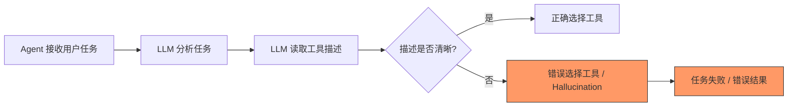
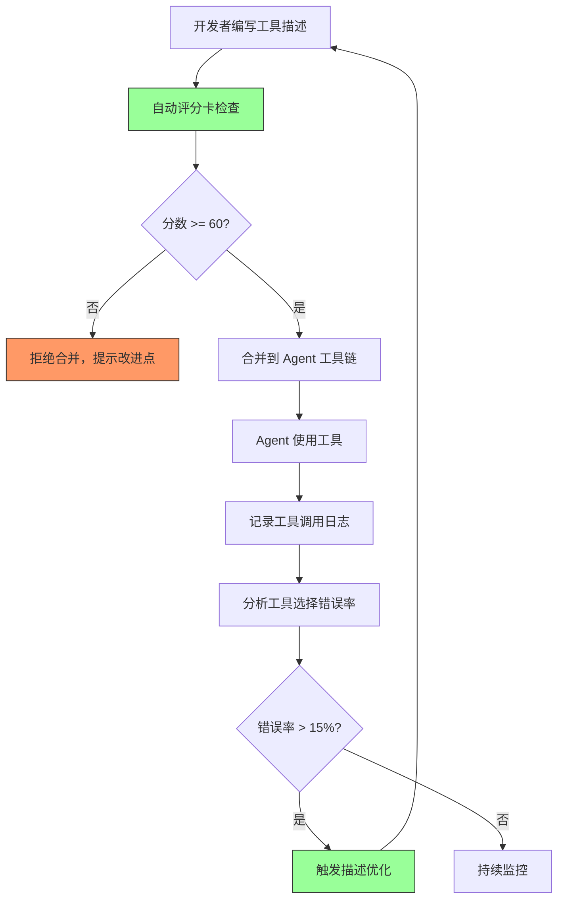

# YK-09-47: Agent 能力边界文档 — 工具描述最佳实践与 Hallucination 缓解

> 需求编号：YK-09-47 · 优先级：P2 · 人天：0.5d · 状态：需求已编写
> 依赖：YA-09-18（Agent 工具链插件化）

---

## 一、背景

### 1.1 问题描述

YiAi Agent 在执行任务时依赖 LLM 选择合适的工具——工具的选择基于 `description` 字段。当前工具描述存在三类问题：

1. **描述模糊**：如 `search_knowledge` 的描述为"搜索知识库"——太泛，Agent 不知道何时该用、何时不该用。
2. **错误调用**：Agent 将 `query_database` 用于查询知识库内容（应该用 `search_knowledge`），或将 `read_file` 用于读取 MongoDB 数据（应该用 `query_database`）。
3. **Hallucination 工具**：Agent 在 Prompt 中"发明"不存在的工具，如"我可以调用 `send_email` 发送报告"——但实际上 YiAi 没有 `send_email` 工具。

### 1.2 影响量化

| 影响维度 | 量化 | 说明 |
|----------|------|------|
| 工具选择错误率 | 15-25% | 用户反馈中 Agent 用错工具的比例 |
| Hallucination 工具调用 | 5-10% | Agent 声称可使用不存在的工具 |
| 任务完成率 | 70-80% | 因工具选择错误导致任务失败 |

### 1.3 核心挑战

- **描述语言**：如何用自然语言精确描述工具的适用场景——既要覆盖所有适用情况，又要排除不适用情况。
- **描述长度 vs 精度**：描述越长，Agent 越可能忽略关键信息；描述越短，越可能模糊。
- **能力边界表达**：如何让 Agent 理解"这个工具不能做什么"和"这个工具能做什么"同样重要。

---

## 二、现状分析

### 2.1 当前工具描述模式



### 2.2 根因分析矩阵

| 根因 | 类别 | 影响 | 优先级 |
|------|------|------|--------|
| 工具描述无"适用/不适用"区分 | 设计缺陷 | 工具选择错误率高 | P0 |
| 无 Few-shot 示例 | 设计缺陷 | LLM 难以匹配正确用法 | P0 |
| 无错误模式文档 | 设计缺陷 | Agent 无法优雅处理异常 | P1 |
| 无约束声明 | 设计缺陷 | Agent 越权调用 | P1 |
| 无工具描述质量评审 | 流程缺失 | 描述质量参差不齐 | P2 |

### 2.3 现有资产

- YA-09-18 已实现 Agent 工具链插件化，工具定义格式统一。
- YiAi 已有 Agent 工具执行日志，可分析工具调用模式。
- Ollama LLM 支持 Function Calling 格式的工具描述。

---

## 三、设计决策

### D-01：工具描述格式——结构化模板

| 方案 | 描述 | 优点 | 缺点 | 决策 |
|------|------|------|------|------|
| A: 自由文本 | 人工编写自然语言描述 | 灵活 | 质量不稳定，缺少结构 | 否决 |
| B: JSON Schema 模板 | 结构化描述：适用/不适用/参数/示例/错误/约束 | 质量可控，可自动评分 | 编写成本稍高 | **采用** |
| C: LLM 自动生成 | 让 LLM 根据工具代码生成描述 | 自动化 | 准确性不可控 | 补充方案 |

**决策**：采用方案 B——结构化模板确保所有工具描述覆盖关键维度，配合自动评分卡评估质量。

### D-02：Hallucination 缓解策略

| 方案 | 描述 | 优点 | 缺点 | 决策 |
|------|------|------|------|------|
| A: 明确能力边界 | 描述含"适用/不适用" | 减少错误工具调用 | 描述变长 | **采用** |
| B: Few-shot 示例 | 每个工具 2-3 个调用示例 | LLM 容易匹配正确用法 | 维护成本 | **采用** |
| C: 错误模式文档 | `error_patterns` 定义预期错误 | Agent 能优雅处理 | 需要预判所有错误 | **采用** |
| D: 约束声明 | `constraints` 字段定义限制 | 减少越权 | 约束可能不全 | **采用** |
| E: 系统级工具清单 | System Prompt 中列出所有可用工具 | 减少 Hallucination | Prompt 变长 | **采用** |

**决策**：采用全部五种策略，形成多层防御体系。

### D-03：工具描述质量评估

| 方案 | 描述 | 优点 | 缺点 | 决策 |
|------|------|------|------|------|
| A: 人工评审 | curator 评审每个工具描述 | 最高质量 | 耗时 | 补充方案 |
| B: 自动评分卡 | 基于规则的评分（0-100） | 快速，客观 | 可能遗漏语义问题 | **采用** |
| C: A/B 测试 | 对比不同描述的效果 | 数据驱动 | 慢，需大量流量 | 远期方案 |

**决策**：方案 B 为主——自动评分卡作为 CI 检查，低于 60 分的工具描述禁止合并。

---

## 四、目标架构

### 4.1 工具描述生命周期



### 4.2 核心指标

| 指标 | 当前值 | 目标值 | 测量方式 |
|------|--------|--------|----------|
| 工具描述评分均值 | ~40 | > 70 | 自动评分卡 |
| 工具选择错误率 | 15-25% | < 10% | 工具调用日志分析 |
| Hallucination 工具调用 | 5-10% | < 2% | 日志中不存在的工具名 |
| 工具描述覆盖率 | 60% | 100% | 所有工具都有结构化描述 |

### 4.3 架构权衡

| 权衡 | 选择 | 理由 |
|------|------|------|
| 描述长度 vs 精度 | 结构化长描述 | 工具描述是一次性编写成本，后续复用 |
| 自动化 vs 人工 | 自动评分 + 人工抽查 | 评分卡覆盖结构性检查，人工覆盖语义质量 |
| 严格 vs 宽松 | 评分 < 60 禁止合并 | 低质量描述是工具选择错误的根本原因 |

---

## 五、具体改动

### 5.1 工具描述模板

```python
# YiAi/src/domain/agent/tool_description.py

from dataclasses import dataclass, field
from typing import Any

@dataclass
class ToolDescription:
    """Agent 工具描述——结构化模板。"""

    name: str                            # 工具名——动词_名词
    description: str                     # 核心描述 (50-200 字)
    applicable: list[str] = field(default_factory=list)    # 适用场景
    not_applicable: list[str] = field(default_factory=list) # 不适用场景
    parameters: dict[str, dict] = field(default_factory=dict) # 参数定义
    examples: list[dict] = field(default_factory=list)     # Few-shot 示例
    error_patterns: list[str] = field(default_factory=list) # 预期错误
    constraints: list[str] = field(default_factory=list)   # 约束限制
    returns: str = ''                    # 返回值描述

    def to_prompt(self) -> str:
        """生成 LLM 可读的工具描述。"""
        parts = [f"### {self.name}\n"]
        parts.append(f"**描述**: {self.description}\n")

        if self.applicable:
            parts.append(f"**适用场景**: {', '.join(self.applicable)}")
        if self.not_applicable:
            parts.append(f"**不适用场景**: {', '.join(self.not_applicable)}")

        if self.parameters:
            parts.append("\n**参数**:")
            for name, info in self.parameters.items():
                parts.append(f"  - {name}: {info.get('description', '')} "
                            f"(类型: {info.get('type', 'any')}, "
                            f"默认: {info.get('default', 'N/A')})")

        if self.examples:
            parts.append("\n**使用示例**:")
            for ex in self.examples:
                parts.append(f"  {ex}")

        if self.error_patterns:
            parts.append(f"\n**预期错误**: {', '.join(self.error_patterns)}")

        if self.constraints:
            parts.append(f"\n**约束**: {', '.join(self.constraints)}")

        if self.returns:
            parts.append(f"\n**返回值**: {self.returns}")

        return '\n'.join(parts)


# 标准工具描述示例
SEARCH_KNOWLEDGE_TOOL = ToolDescription(
    name="search_knowledge",
    description=(
        "搜索 YiKnowledge 知识库，返回相关文档片段。"
        "基于 BM25 + 向量混合检索，可匹配中文和英文内容。"
    ),
    applicable=[
        "用户询问技术知识、最佳实践、架构决策时",
        "用户需要代码示例、配置参考时",
        "用户想了解某个概念的定义或解释时",
    ],
    not_applicable=[
        "实时数据查询——使用 query_database",
        "文件读写操作——使用 read_file / write_file",
        "外部 API 调用——使用 http_request",
        "发送消息或通知——使用 send_message",
    ],
    parameters={
        "query": {
            "type": "string",
            "description": "自然语言搜索关键词。使用用户原话中的关键术语。",
            "required": True,
        },
        "top_k": {
            "type": "integer",
            "default": 5,
            "description": "返回结果数。需要更多上下文时增大到 10，需要精准答案时减小到 3。",
        },
        "role_filter": {
            "type": "string",
            "default": None,
            "description": "按角色目录过滤。可选值: engineer, aier, srer, leader, producter, curator",
        },
    },
    examples=[
        {"query": "RAG 混合检索优化", "top_k": 5},
        {"query": "MongoDB 连接池配置", "top_k": 10, "role_filter": "engineer"},
        {"query": "限流策略架构决策", "top_k": 3, "role_filter": "leader"},
    ],
    error_patterns=[
        "query 为空时返回 []",
        "知识库无结果时返回 []——告知用户内容未覆盖，建议其他方式",
        "role_filter 无效时忽略过滤，返回所有角色结果",
    ],
    constraints=[
        "仅搜索 YiKnowledge 知识库，不搜索外部网站",
        "不返回文件全文，仅返回相关片段（最多 500 字/片段）",
        "搜索结果可能不是最新的——知识库更新的延迟最多 5 秒",
    ],
    returns="list[dict]——每个结果包含 title, path, snippet, score, summary",
)
```

### 5.2 工具描述评分卡

```python
# YiAi/src/domain/agent/tool_description_scorer.py

class ToolDescriptionScorer:
    """工具描述质量评分卡——0-100。"""

    def score(self, tool: ToolDescription) -> dict:
        """评估工具描述质量。"""
        score = 0
        details = []

        # 1. 核心描述长度 (10 分)
        desc_len = len(tool.description)
        if desc_len >= 100:
            score += 10
            details.append(('核心描述长度', 10, f'{desc_len} 字'))
        elif desc_len >= 50:
            score += 5
            details.append(('核心描述长度', 5, f'{desc_len} 字'))
        else:
            details.append(('核心描述长度', 0, f'{desc_len} 字——过短'))

        # 2. 适用场景 (20 分)
        if tool.applicable:
            score += 10
            details.append(('适用场景', 10, f'{len(tool.applicable)} 条'))
            if len(tool.applicable) >= 3:
                score += 10
                details.append(('适用场景丰富度', 10, f'≥ 3 条'))
        else:
            details.append(('适用场景', 0, '缺失'))

        # 3. 不适用场景 (20 分)
        if tool.not_applicable:
            score += 10
            details.append(('不适用场景', 10, f'{len(tool.not_applicable)} 条'))
            if len(tool.not_applicable) >= 3:
                score += 10
                details.append(('不适用场景丰富度', 10, f'≥ 3 条'))
        else:
            details.append(('不适用场景', 0, '缺失'))

        # 4. Few-shot 示例 (30 分)
        if tool.examples:
            score += 15
            details.append(('示例', 15, f'{len(tool.examples)} 个'))
            if len(tool.examples) >= 3:
                score += 15
                details.append(('示例丰富度', 15, f'≥ 3 个'))
        else:
            details.append(('示例', 0, '缺失'))

        # 5. 错误模式 (10 分)
        if tool.error_patterns:
            score += 10
            details.append(('错误模式', 10, f'{len(tool.error_patterns)} 种'))
        else:
            details.append(('错误模式', 0, '缺失'))

        # 6. 约束 (10 分)
        if tool.constraints:
            score += 10
            details.append(('约束', 10, f'{len(tool.constraints)} 条'))
        else:
            details.append(('约束', 0, '缺失'))

        grade = 'A' if score >= 80 else 'B' if score >= 60 else 'C' if score >= 40 else 'D'

        return {
            'score': score,
            'grade': grade,
            'details': details,
            'passed': score >= 60,
            'suggestions': self._generate_suggestions(tool, score),
        }

    def _generate_suggestions(self, tool: ToolDescription, score: int) -> list[str]:
        """生成改进建议。"""
        suggestions = []
        if not tool.applicable:
            suggestions.append('添加"适用场景"——描述什么情况下应使用此工具')
        if not tool.not_applicable:
            suggestions.append('添加"不适用场景"——明确此工具不能做什么')
        if not tool.examples:
            suggestions.append('添加 2-3 个使用示例——帮助 LLM 匹配正确用法')
        if not tool.error_patterns:
            suggestions.append('添加"预期错误"——描述工具可能返回的错误及处理方式')
        if not tool.constraints:
            suggestions.append('添加"约束"——描述工具的使用限制')
        return suggestions
```

### 5.3 Hallucination 缓解 Prompt 模板

```python
# YiAi/src/domain/agent/hallucination_guard.py

HALLUCINATION_GUARD_PROMPT = """
## 工具使用规则

1. **仅使用以下列出的工具**。不要调用或提及未列出的工具。
2. 如果一个任务需要未列出的工具，告知用户当前能力边界，而非编造工具。
3. **先检查适用场景**——确认工具是否适用于当前任务。
4. **检查不适用场景**——如果当前任务属于"不适用"范围，寻找其他工具。
5. 使用工具前，检查示例中的参数格式。

## 可用工具清单

{tools_description}

## 能力边界声明

当前 YiAi Agent 具备以下能力:
- 知识库检索（search_knowledge）
- 数据库查询（query_database）
- 文件读写（read_file / write_file）
- HTTP 请求（http_request）
- 消息发送（send_message）

当前不具备以下能力:
- 发送邮件（send_email）
- 操作 Kubernetes 集群
- 直接修改代码仓库
- 访问外部 API（除非通过 http_request 工具）

如需扩展能力，请联系 aier 角色添加新工具。
"""
```

### 5.4 文件变更清单

| 文件路径 | 操作 | 说明 |
|----------|------|------|
| `YiAi/src/domain/agent/tool_description.py` | 新增 | 结构化工具描述模板 |
| `YiAi/src/domain/agent/tool_description_scorer.py` | 新增 | 工具描述评分卡 |
| `YiAi/src/domain/agent/hallucination_guard.py` | 新增 | Hallucination 缓解 Prompt |
| `YiAi/src/domain/agent/agent_loop.py` | 修改 | 集成 Hallucination Guard Prompt |
| `YiAi/tests/domain/agent/test_tool_description.py` | 新增 | 工具描述评分测试 |
| `YiKnowledge/aier/agent/tool-description-guide.md` | 新增 | 工具描述最佳实践文档 |

---

## 六、实施步骤

| 步骤 | 内容 | 验证方法 | 人天 |
|------|------|----------|------|
| 1 | 定义 `ToolDescription` 结构化模板 | 代码审查：模板覆盖所有关键维度 | 0.3 |
| 2 | 实现 `ToolDescriptionScorer` 评分卡 | 单元测试：各维度评分逻辑 | 0.3 |
| 3 | 迁移现有工具描述到新模板 | 评分卡验证：所有工具得分 ≥ 60 | 0.5 |
| 4 | 实现 Hallucination Guard Prompt | 集成测试：Agent 不再编造工具 | 0.3 |
| 5 | 集成到 CI 流程（评分 < 60 禁止合并） | CI 验证：新工具描述自动评分 | 0.3 |
| 6 | 编写工具描述最佳实践文档 | 知识库文档完成 | 0.3 |

**总计**：2.0 人天

---

## 七、性能分析

### 7.1 Prompt 长度影响

| 项目 | 优化前 | 优化后 | 变化 |
|------|--------|--------|------|
| 工具描述平均长度 | ~50 字 | ~200 字 | +150 字 |
| System Prompt 总长度 | ~800 字 | ~1500 字 | +700 字 |
| LLM 首 Token 延迟 | ~1.5s | ~2.0s | +0.5s |

### 7.2 收益分析

| 指标 | 优化前 | 优化后（预估） | 改善 |
|------|--------|--------------|------|
| 工具选择错误率 | 15-25% | 5-10% | 60% 下降 |
| Hallucination 工具调用 | 5-10% | < 2% | 70% 下降 |
| 任务完成率 | 70-80% | 85-95% | 15% 提升 |

---

## 八、测试规格

### 8.1 单元测试

**测试用例 1：评分卡——完整描述**

```
GIVEN 一个包含所有字段（适用/不适用/示例/错误/约束）的工具描述
WHEN 调用 scorer.score(tool)
THEN score >= 80
AND grade = 'A'
AND passed = True
```

**测试用例 2：评分卡——缺失字段**

```
GIVEN 一个仅包含 name 和 description 的工具描述
WHEN 调用 scorer.score(tool)
THEN score < 40
AND grade = 'D'
AND passed = False
AND suggestions 包含 "添加适用场景" 等建议
```

**测试用例 3：Prompt 生成**

```
GIVEN 一个完整的 ToolDescription
WHEN 调用 tool.to_prompt()
THEN 返回的字符串包含: name, 描述, 适用场景, 不适用场景, 参数, 示例
AND 不包含空字段的标题
```

**测试用例 4：Hallucination Guard Prompt**

```
GIVEN Hallucination Guard Prompt 模板
WHEN 填充 tools_description 参数
THEN 生成的 Prompt 包含所有工具名称
AND 包含能力边界声明（具备/不具备）
AND 包含工具使用规则
```

### 8.2 集成测试

**测试用例 5：CI 评分检查**

```
GIVEN 一个新工具描述，评分 45
WHEN CI 运行评分检查
THEN 构建失败
AND 输出详细的改进建议
```

---

## 九、风险与缓解

### 9.1 风险矩阵

| 风险 | 概率 | 影响 | 缓解措施 |
|------|------|------|----------|
| 描述过长导致 LLM 忽略关键信息 | 低 | 中——工具选择错误率回升 | 关键信息前置（前 50 字） |
| 评分卡遗漏语义问题 | 中 | 低——形式合格但语义不准 | 人工抽查 + 工具调用日志分析 |
| 迁移现有工具描述工作量 | 中 | 低 | 现有工具数量 ~10 个，工作量可控 |

---

## 十、回滚策略

| 场景 | 回滚操作 | 影响范围 |
|------|----------|----------|
| 描述过长导致 Agent 性能下降 | 缩短描述（仅保留核心字段），移除 Hallucination Guard | Prompt 长度恢复 |
| 评分卡过于严格 | 降低阈值到 40，或移除 CI 阻断 | 低质量描述可合并 |
| 新模板导致工具调用错误率上升 | 回退到原描述格式 | 工具描述回退 |

---

## 十一、设计决策记录

### D-01：结构化模板

**背景**：自由文本描述质量不稳定，需要标准化。
**决策**：定义 `ToolDescription` 结构化模板，包含适用/不适用/示例/错误/约束六个维度。
**后果**：描述编写成本提高，但质量可控，可自动评分。

### D-02：自动评分卡

**背景**：需要确保工具描述质量，但人工评审耗时。
**决策**：自动评分卡（0-100），< 60 分禁止合并。
**后果**：评分卡可覆盖结构性检查，但语义问题仍需人工抽查。

### D-03：Hallucination Guard

**背景**：Agent 会编造不存在的工具。
**决策**：在 System Prompt 中明确列出所有可用工具 + 能力边界声明。
**后果**：Prompt 变长，但 Hallucination 工具调用显著减少。

---

## 十二、可观测性

### 12.1 指标

| 指标名称 | 类型 | 说明 |
|----------|------|------|
| `agent_tool_call_error_rate` | Gauge | 工具选择错误率 |
| `agent_tool_hallucination_rate` | Gauge | Hallucination 工具调用率 |
| `agent_tool_description_scores` | Gauge | 所有工具描述的平均评分 |
| `agent_task_completion_rate` | Gauge | 任务完成率 |

### 12.2 日志

```python
logger.info(f"[ToolDesc] 工具描述评分: {tool.name} = {score}/100 ({grade})")
logger.warning(f"[ToolDesc] 工具描述未通过评分: {tool.name} = {score}/100, 建议: {suggestions}")
logger.error(f"[Agent] Hallucination 工具调用: 工具 '{tool_name}' 不存在")
logger.info(f"[Agent] 工具选择错误: 任务={task}, 选择了 {actual}, 应选择 {expected}")
```

### 12.3 告警

| 告警 | 条件 | 级别 |
|------|------|------|
| 工具选择错误率上升 | `agent_tool_call_error_rate` > 20% | P1 |
| Hallucination 工具调用增加 | `agent_tool_hallucination_rate` > 5% | P1 |
| 工具描述评分下降 | `agent_tool_description_scores` < 60 | P2 |

---

## 十三、安全合规

| 要求 | 实现方式 |
|------|----------|
| 工具调用权限控制 | 工具描述中声明约束，Agent 不得越权 |
| 工具调用审计 | 每次工具调用记录到 `agent_tool_calls` 集合 |
| 敏感工具标记 | 敏感工具（如 write_file）在描述中标注 `sensitive: true` |

---

## 十四、代码审查检查清单

- [ ] 所有工具描述使用 `ToolDescription` 结构化模板
- [ ] 每个工具描述包含适用场景（≥ 3 条）和不适用场景（≥ 3 条）
- [ ] 每个工具描述包含 2-3 个 Few-shot 示例
- [ ] 每个工具描述包含预期错误模式和处理方式
- [ ] 每个工具描述包含约束声明
- [ ] 工具描述评分 ≥ 60 分（CI 自动检查）
- [ ] System Prompt 中包含 Hallucination Guard（工具清单 + 能力边界）
- [ ] 工具描述评分卡覆盖所有六个维度
- [ ] 工具调用日志记录工具名、参数、结果、耗时
- [ ] 敏感工具（write_file 等）描述中标注 `sensitive: true`
- [ ] 工具描述变更记录到 `tool_description_changelog` 集合
- [ ] 首次迁移后人工抽查所有工具描述的质量

---

*PRD 来源: `projects/yiknowledge/requirements/2026-09/47-需求-Agent能力边界文档.md`*