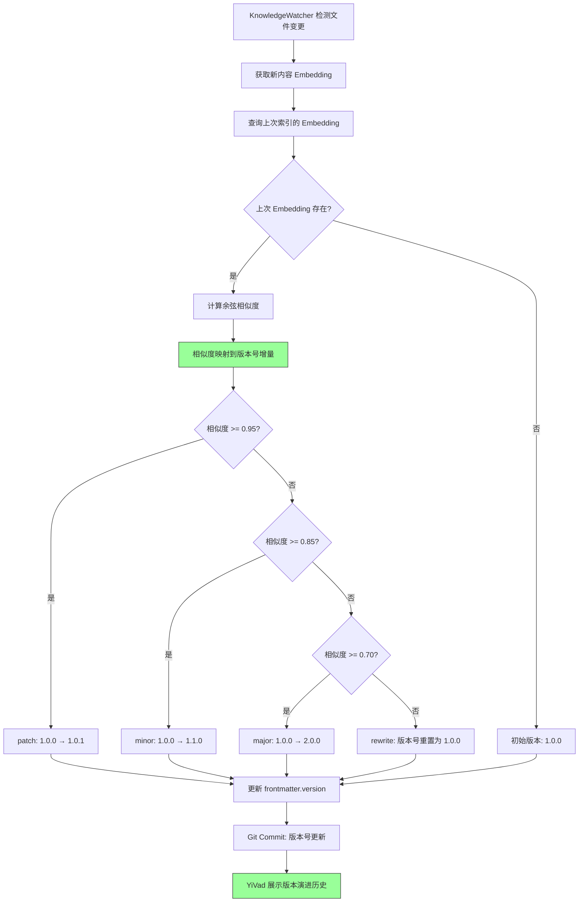

# YK-09-48: 知识库语义版本化 — 基于内容相似度的版本演进追踪

> 需求编号：YK-09-48 · 优先级：P2 · 人天：0.5d · 状态：需求已编写

---

## 一、背景

### 1.1 问题描述

Git 追踪了知识文件的文本级变更历史——每次 commit 记录了"增删了哪些行"。但 Git 无法回答语义层面的问题：

1. **变更影响有多大？** 从 v1.0.0 到 v1.1.0，"修改了 3 行"——但可能这 3 行是核心算法的重写，语义影响远超行数。
2. **版本号应该怎么定？** 当前知识文件没有版本号字段——"我上次读的是哪个版本？"无法回答。
3. **演进脉络是什么？** 文件从最初的简单介绍到现在的详细指南，经历了哪些"主要修订"（major change）？

### 1.2 影响量化

| 影响维度 | 量化 | 说明 |
|----------|------|------|
| 无版本追踪 | 100% 文件无版本号 | 用户无法判断文件新旧 |
| 变更影响不可见 | 行数变更 ≠ 语义变更 | 重大重写可能与小修小补看齐 |
| 知识演进不可追溯 | 无版本历史 | 无法回答"这个方案经历了哪些迭代" |

### 1.3 核心挑战

- **语义相似度 vs 文本差异**：Git diff 是文本级的，语义版本化需要 Embedding 级的相似度。
- **阈值设定**：相似度 0.95 vs 0.85 vs 0.70 分别对应什么级别的变更？
- **版本号连续性**：如何确保版本号不跳号、语义版本号与 Git 历史一致。

---

## 二、现状分析

### 2.1 当前数据流


### 2.2 根因分析矩阵

| 根因 | 类别 | 影响 | 优先级 |
|------|------|------|--------|
| 无语义版本号字段 | 数据缺失 | 用户无法追踪版本 | P0 |
| 变更影响无量化 | 功能缺失 | 小修与重写不可区分 | P0 |
| 版本号依赖人工判断 | 流程缺失 | 版本号不一致 | P1 |
| 无版本演进历史 | 展示缺失 | 知识演进不可追溯 | P1 |

### 2.3 现有资产

- KnowledgeWatcher 已为每次文件更新计算 Embedding 向量。
- Git 历史完整记录了文件变更。
- `knowledge_files` 集合存储了文件的 `updated` 时间戳。
- YK-09-56 内容世代管理依赖版本化信息。

---

## 三、设计决策

### D-01：版本号语义——SemVer 映射

| 方案 | 描述 | 优点 | 缺点 | 决策 |
|------|------|------|------|------|
| A: 基于文本行数变更 | 修改行数决定版本号 | 简单 | 行数 ≠ 语义影响 | 否决 |
| B: 基于 Embedding 相似度 | 相似度映射到 SemVer | 语义准确 | 需要阈值调优 | **采用** |
| C: 基于 Commit Message | 解析 commit message 关键词 | 直观 | 依赖人工 commit 规范 | 补充方案 |

**决策**：方案 B 为主——Embedding 相似度映射到 SemVer（major.minor.patch），方案 C 补充验证。

### D-02：相似度阈值

| 相似度 | SemVer | 含义 | 示例 |
|--------|--------|------|------|
| ≥ 0.95 | patch | 小修订——修正错字、补充说明 | 1.0.0 → 1.0.1 |
| ≥ 0.85 | minor | 功能更新——新增章节、扩展内容 | 1.0.0 → 1.1.0 |
| ≥ 0.70 | major | 大版本——重写核心内容、结构调整 | 1.0.0 → 2.0.0 |
| < 0.70 | rewrite | 重写——视为新文件 | 版本号重置 |

### D-03：版本号来源

| 方案 | 描述 | 优点 | 缺点 | 决策 |
|------|------|------|------|------|
| A: 仅 frontmatter | 版本号存储在 frontmatter 中 | 与文件共存 | 需人工维护 | **采用** |
| B: 仅 MongoDB | 版本号存储在 MongoDB | 不污染文件 | 与文件分离 | 否决 |
| C: 双写 | frontmatter + MongoDB | 冗余 | 一致性维护 | 补充方案 |

**决策**：方案 A——版本号存储在 frontmatter 中（`version: 1.0.0`），Tools 可自动更新。

---

## 四、目标架构

### 4.1 目标数据流



### 4.2 核心指标

| 指标 | 当前值 | 目标值 | 测量方式 |
|------|--------|--------|----------|
| 版本号覆盖率 | 0% | > 90% | `frontmatter.version` 字段填充率 |
| 版本号准确率 | — | > 85% | 人工抽查 20 个文件的版本号合理性 |
| 版本演进历史完整性 | 0% | > 80% | 有版本历史的文件比例 |

### 4.3 架构权衡

| 权衡 | 选择 | 理由 |
|------|------|------|
| 语义准确 vs 简单 | 语义准确 | 行数变更无法反映语义影响 |
| 自动 vs 人工 | 自动建议 + 人工可覆盖 | 版本号自动生成，但 curator 可手动调整 |
| 存储 vs 计算 | 存储版本号 | 版本号查询频率高，存储优于每次计算 |

---

## 五、具体改动

### 5.1 核心代码

```python
# YiAi/src/domain/knowledge/semantic_versioning.py

import numpy as np
from datetime import datetime

class SemanticVersionTracker:
    """基于内容 Embedding 的语义版本追踪。"""

    VERSION_THRESHOLDS = {
        'patch': 0.95,    # 相似度 > 0.95 → 小修订 (1.0.0 → 1.0.1)
        'minor': 0.85,    # 相似度 > 0.85 → 功能更新 (1.0.0 → 1.1.0)
        'major': 0.70,    # 相似度 > 0.70 → 大版本 (1.0.0 → 2.0.0)
        # 相似度 < 0.70 → 视为新文件
    }

    def __init__(self, db):
        self.db = db

    def classify_change(self, old_embedding: list[float],
                        new_embedding: list[float]) -> dict:
        """分类变更类型——基于语义相似度。"""
        sim = 1 - self._cosine_distance(old_embedding, new_embedding)

        if sim >= self.VERSION_THRESHOLDS['patch']:
            change_type = 'patch'
        elif sim >= self.VERSION_THRESHOLDS['minor']:
            change_type = 'minor'
        elif sim >= self.VERSION_THRESHOLDS['major']:
            change_type = 'major'
        else:
            change_type = 'rewrite'

        return {
            'type': change_type,
            'similarity': round(sim, 4),
            'threshold': self.VERSION_THRESHOLDS[change_type] if change_type != 'rewrite' else 0.70,
        }

    def suggest_version(self, file_path: str,
                        new_embedding: list[float]) -> dict:
        """为新版本建议版本号。"""
        doc = await self.db.knowledge_files.find_one({'path': file_path})

        if not doc or 'embedding' not in doc:
            return {'version': '1.0.0', 'change': 'initial', 'similarity': 1.0}

        old_embedding = doc['embedding']
        change = self.classify_change(old_embedding, new_embedding)
        current_version = doc.get('frontmatter', {}).get('version', '1.0.0')

        major, minor, patch = self._parse_version(current_version)

        if change['type'] == 'patch':
            patch += 1
        elif change['type'] == 'minor':
            minor += 1
            patch = 0
        elif change['type'] == 'major':
            major += 1
            minor = 0
            patch = 0
        else:  # rewrite
            major += 1
            minor = 0
            patch = 0

        new_version = f'{major}.{minor}.{patch}'

        return {
            'previous_version': current_version,
            'new_version': new_version,
            'change': change['type'],
            'similarity': change['similarity'],
        }

    async def get_version_history(self, file_path: str) -> list[dict]:
        """获取文件的语义版本演进历史。"""
        import subprocess

        try:
            git_log = subprocess.run(
                ['git', 'log', '--format=%H|%ai|%s', '--follow', '--', file_path],
                capture_output=True, text=True, timeout=5
            ).stdout.strip().split('\n')
        except (subprocess.TimeoutExpired, FileNotFoundError):
            return []

        history = []
        for line in git_log[-20:]:  # 最近 20 次修改
            if not line:
                continue
            try:
                hash_, date, msg = line.split('|', 2)
            except ValueError:
                continue

            # 尝试从 commit message 中提取版本号
            version = self._extract_version_from_message(msg)

            history.append({
                'commit': hash_[:8],
                'date': date[:10],
                'message': msg,
                'version': version,
                'change_type': self._classify_message(msg),
            })

        return history

    def _parse_version(self, version: str) -> tuple[int, int, int]:
        """解析版本号字符串。"""
        try:
            parts = version.split('.')
            return (int(parts[0]), int(parts[1]), int(parts[2]))
        except (ValueError, IndexError):
            return (1, 0, 0)

    def _extract_version_from_message(self, msg: str) -> str:
        """从 commit message 中提取版本号。"""
        import re
        match = re.search(r'v?(\d+\.\d+\.\d+)', msg)
        return match.group(1) if match else 'unknown'

    def _classify_message(self, msg: str) -> str:
        """基于 commit message 分类变更类型。"""
        msg_lower = msg.lower()
        if any(kw in msg_lower for kw in ['feat:', 'feat(', 'add:', '新增']):
            return 'minor'
        elif any(kw in msg_lower for kw in ['fix:', 'fix(', '修复', '修正']):
            return 'patch'
        elif any(kw in msg_lower for kw in ['refactor:', '重写', '重构']):
            return 'major'
        return 'unknown'

    def _cosine_distance(self, a: list[float], b: list[float]) -> float:
        """余弦距离——1 - 余弦相似度。"""
        dot = sum(x * y for x, y in zip(a, b))
        norm_a = sum(x * x for x in a) ** 0.5
        norm_b = sum(x * x for x in b) ** 0.5
        return float(1 - dot / max(norm_a * norm_b, 1e-10))
```

### 5.2 版本演进展示

```markdown
📄 RAG 混合检索优化.md

版本历史:
  2.1.0 (2026-09-08)  feat: 新增查询类型分类策略          [minor ↑, 相似度: 0.88]
  2.0.0 (2026-09-01)  refactor: 重写 alpha 调优算法        [major ↑, 相似度: 0.72]
  1.2.0 (2026-08-25)  feat: 新增代码查询类型 alpha=0.85   [minor ↑, 相似度: 0.89]
  1.1.3 (2026-08-20)  fix: 修正 EMA 平滑系数              [patch ↑, 相似度: 0.97]
  1.1.2 (2026-08-15)  docs: 补充性能分析章节              [patch ↑, 相似度: 0.96]
  1.1.1 (2026-08-12)  fix: 修正阈值计算公式               [patch ↑, 相似度: 0.98]
  1.1.0 (2026-08-05)  feat: 新增反馈驱动调优章节          [minor ↑, 相似度: 0.87]
  1.0.0 (2026-07-28)  Initial commit                      [initial]
```

### 5.3 文件变更清单

| 文件路径 | 操作 | 说明 |
|----------|------|------|
| `YiAi/src/domain/knowledge/semantic_versioning.py` | 新增 | 语义版本化核心逻辑 |
| `YiAi/src/services/knowledge/knowledge_watcher.py` | 修改 | 索引更新时自动建议版本号 |
| `YiVad/src/views/knowledge/FileDetail.vue` | 修改 | 展示版本演进历史 |
| `YiAi/src/routers/knowledge_router.py` | 修改 | 新增 `/knowledge/version-history` 端点 |

---

## 六、实施步骤

| 步骤 | 内容 | 验证方法 | 人天 |
|------|------|----------|------|
| 1 | 实现 `SemanticVersionTracker` 核心类 | 单元测试：阈值映射逻辑 | 0.5 |
| 2 | 实现 `get_version_history`（Git log 解析） | 单元测试：模拟 Git log 输出 | 0.3 |
| 3 | 集成到 KnowledgeWatcher——自动建议版本号 | 集成测试：修改文件 → 自动生成版本号 | 0.3 |
| 4 | 前端展示版本演进历史 | 手动测试：版本时间线展示 | 0.5 |
| 5 | 首次全量回填版本号（基于 Git 历史） | 验证：800+ 文件版本号回填 | 0.5 |

**总计**：2.1 人天

---

## 七、性能分析

### 7.1 计算开销

| 操作 | 耗时 | 说明 |
|------|------|------|
| Embedding 相似度计算 | ~0.5ms | 768 维向量余弦距离 |
| 版本号映射 | ~0.01ms | 纯逻辑判断 |
| Git log 查询 | ~50ms | 最近 20 次 commit |
| 单文件版本号生成 | ~51ms | 对索引总延迟影响 < 5% |

### 7.2 存储开销

| 项目 | 大小 | 说明 |
|------|------|------|
| frontmatter.version 字段 | ~10 bytes | 如 "1.0.0" |
| MongoDB 版本历史 | ~500 bytes/文件 | 20 次 commit 记录 |

---

## 八、测试规格

### 8.1 单元测试

**测试用例 1：Patch 变更**

```
GIVEN 旧 Embedding 和新 Embedding 的余弦相似度为 0.97
WHEN 调用 classify_change(old_emb, new_emb)
THEN 返回 change_type = 'patch'
AND 建议版本号 1.0.0 → 1.0.1
```

**测试用例 2：Minor 变更**

```
GIVEN 旧 Embedding 和新 Embedding 的余弦相似度为 0.88
WHEN 调用 classify_change(old_emb, new_emb)
THEN 返回 change_type = 'minor'
AND 建议版本号 1.0.0 → 1.1.0
```

**测试用例 3：Major 变更**

```
GIVEN 旧 Embedding 和新 Embedding 的余弦相似度为 0.72
WHEN 调用 classify_change(old_emb, new_emb)
THEN 返回 change_type = 'major'
AND 建议版本号 1.0.0 → 2.0.0
```

**测试用例 4：Git 历史解析**

```
GIVEN Git log 包含 "feat: 新增查询类型分类" 的 commit
WHEN 调用 get_version_history(file_path)
THEN 返回的历史列表包含该 commit
AND 该 commit 的 change_type = 'minor'
```

### 8.2 集成测试

**测试用例 5：端到端版本号自动生成**

```
GIVEN 一个文件当前版本为 1.2.0
AND 新内容的 Embedding 与旧 Embedding 相似度为 0.91
WHEN KnowledgeWatcher 检测到文件变更
THEN 自动更新 frontmatter.version 为 1.3.0
AND 记录变更类型为 'minor'
```

---

## 九、风险与缓解

### 9.1 风险矩阵

| 风险 | 概率 | 影响 | 缓解措施 |
|------|------|------|----------|
| 阈值不合理——小修改被判为 major | 中 | 中——版本号跳变 | 人工可覆盖版本号 |
| 新文件无历史 Embedding | 高 | 低——初始版本 1.0.0 | 默认初始版本号 |
| Git log 解析失败 | 低 | 中——版本历史不完整 | 降级为仅展示 frontmatter 版本号 |

---

## 十、回滚策略

| 场景 | 回滚操作 | 影响范围 |
|------|----------|----------|
| 版本号自动生成不准确 | 禁用自动版本号生成，回退到人工维护 | 版本号不再自动更新 |
| Git 历史展示异常 | 前端降级为仅展示当前版本号 | 版本历史不显示 |

---

## 十一、设计决策记录

### D-01：Embedding 相似度映射 SemVer

**背景**：需要量化语义变更的影响。
**决策**：相似度 ≥ 0.95 → patch, ≥ 0.85 → minor, ≥ 0.70 → major, < 0.70 → rewrite。
**后果**：阈值可能需根据实际数据分布调整，可通过 A/B 测试验证。

### D-02：版本号存储位置

**背景**：版本号需要与文件共存（Git 可追踪）且可被 Index 读取。
**决策**：存储在 frontmatter 中（`version: 1.0.0`），KnowledgeWatcher 自动更新。
**后果**：版本号更新会产生额外的 Git commit。

### D-03：版本历史来源

**背景**：需要展示文件的完整演进历史。
**决策**：Git log 为主要来源，frontmatter 版本号为补充验证。
**后果**：依赖 Git 历史完整性，分支合并可能影响历史线性。

---

## 十二、可观测性

### 12.1 指标

| 指标名称 | 类型 | 说明 |
|----------|------|------|
| `semver_coverage` | Gauge | 版本号覆盖率 |
| `semver_change_distribution` | Counter | 变更类型分布（patch/minor/major/rewrite） |
| `semver_git_log_parse_errors` | Counter | Git log 解析失败次数 |

### 12.2 日志

```python
logger.info(f"[SemVer] {file_path}: {old_version} → {new_version} "
            f"({change_type}, 相似度: {similarity:.4f})")
logger.warning(f"[SemVer] {file_path}: 版本号跳变过大 "
               f"({old_version} → {new_version}, 相似度: {similarity:.4f})")
logger.error(f"[SemVer] Git log 解析失败: {file_path}, {error}")
```

---

## 十三、安全合规

| 要求 | 实现方式 |
|------|----------|
| 版本号不可篡改 | 版本号更新通过 Git commit 记录，可追溯 |
| 版本历史完整性 | Git log 不可修改，确保历史真实性 |

---

## 十四、代码审查检查清单

- [ ] `SemanticVersionTracker` 基于 Embedding 相似度映射到 SemVer
- [ ] 阈值配置可调整（patch: 0.95, minor: 0.85, major: 0.70）
- [ ] 版本号存储在 frontmatter 中（`version: X.Y.Z`）
- [ ] 初始版本号默认为 1.0.0
- [ ] KnowledgeWatcher 检测到变更时自动建议版本号
- [ ] 版本号自动生成后 curator 可手动覆盖
- [ ] `get_version_history` 解析 Git log 获取完整演进历史
- [ ] Git log 解析失败时优雅降级
- [ ] 前端展示版本演进时间线（含版本号、日期、变更类型）
- [ ] 版本号与 YK-09-56 内容世代管理配合使用
- [ ] 版本号更新产生独立的 Git commit
- [ ] 首次全量回填版本号后人工抽查 20 个文件的合理性

---

*PRD 来源: `projects/yiknowledge/requirements/2026-09/48-需求-语义版本化追踪.md`*