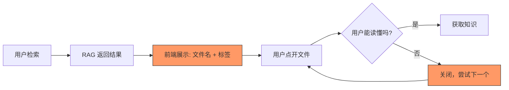
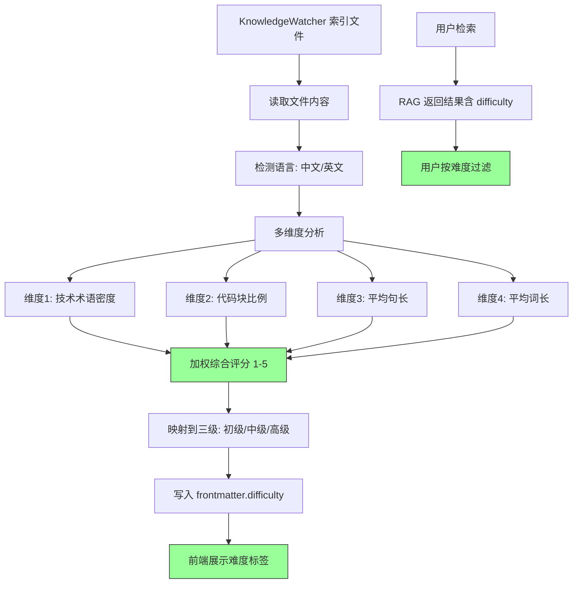

# YK-09-49: 知识库内容难度评级 — 基于可读性分析的初/中/高级标注

> 需求编号：YK-09-49 · 优先级：P2 · 人天：0.5d · 状态：需求已编写

---

## 一、背景

### 1.1 问题描述

YiKnowledge 800+ 文件面向不同技术水平的读者，但当前没有任何难度标注。导致两个问题：

1. **新手挫败**：初级开发者检索"RAG 入门"时，可能返回"RAG 混合检索 Embedding 维度对齐"（高级）——技术术语密度高、代码块占比大，新手读不懂。
2. **专家浪费时间**：高级工程师检索"限流实现"时，返回"Git 基础操作"（初级）——内容过于基础，浪费时间。

### 1.2 影响量化

| 影响维度 | 量化 | 说明 |
|----------|------|------|
| 内容匹配度 | 无难度过滤 | 用户无法按自身水平筛选内容 |
| 新手满意度 | 低 | 遇到高级内容产生挫败感 |
| 专家效率 | 低 | 遇到初级内容浪费时间 |

### 1.3 核心挑战

- **多维度评级**：难度不仅取决于技术术语密度，还取决于代码块比例、句长、概念抽象度。
- **中英文混合**：知识库包含中英文文件，可读性公式需要适配中英文。
- **主观性**：同一文件对不同背景的读者难度不同——需要有客观量化的评级标准。

---

## 二、现状分析

### 2.1 当前数据流



### 2.2 根因分析矩阵

| 根因 | 类别 | 影响 | 优先级 |
|------|------|------|--------|
| 无难度评级字段 | 数据缺失 | 无法按水平筛选内容 | P0 |
| 无客观评级标准 | 标准缺失 | 难度标注不一致 | P0 |
| 无难度过滤 | 功能缺失 | 用户无法跳过不匹配内容 | P1 |
| 无难度预览 | 展示缺失 | 检索结果中无难度提示 | P1 |

### 2.3 现有资产

- 知识文件已有完整内容，可进行文本分析。
- `jieba` 分词库已在 YiAi 可用。
- 知识文件已有 `tags` 和 `category` 字段（可交叉验证难度）。

---

## 三、设计决策

### D-01：评级算法——多维度加权

| 方案 | 描述 | 优点 | 缺点 | 决策 |
|------|------|------|------|------|
| A: 仅技术术语密度 | 统计技术术语占比 | 简单 | 忽略代码/结构复杂度 | 否决 |
| B: 仅可读性公式（Flesch） | 基于句长/词长的可读性 | 标准成熟 | 不感知技术内容 | 否决 |
| C: 多维度加权（术语 + 代码 + 可读性） | 综合三个维度 | 全面 | 权重需调优 | **采用** |

**决策**：采用方案 C——多维度加权评分，覆盖术语密度、代码块比例、句长三个维度。

### D-02：评级粒度——三级 vs 五级

| 方案 | 描述 | 优点 | 缺点 | 决策 |
|------|------|------|------|------|
| A: 三级（初级/中级/高级） | 简单直观 | 用户容易理解 | 边界模糊 | **采用** |
| B: 五级（1-5 星） | 更细粒度 | 信息更丰富 | 中间级别难以区分 | 补充方案 |

**决策**：方案 A 为主（三级：初级/中级/高级），方案 B 补充（1-5 分数作为内部指标）。

### D-03：中英文适配

| 方案 | 描述 | 优点 | 缺点 | 决策 |
|------|------|------|------|------|
| A: 统一公式 | 中英文使用相同公式 | 简单 | 中文可读性特征不同 | 否决 |
| B: 语言自适应 | 中文用 jieba 分词 + 汉语句长，英文用空格分词 | 精准 | 实现稍复杂 | **采用** |

**决策**：方案 B——根据文件语言自动选择分词和分析策略。

---

## 四、目标架构

### 4.1 目标数据流



### 4.2 核心指标

| 指标 | 当前值 | 目标值 | 测量方式 |
|------|--------|--------|----------|
| 难度评级覆盖率 | 0% | > 90% | `frontmatter.difficulty` 填充率 |
| 难度评级准确率 | — | > 85% | 人工抽查 20 个文件的评级合理性 |
| 难度过滤使用率 | 0% | > 30% | 检索请求中 `difficulty_filter` 参数占比 |

### 4.3 架构权衡

| 权衡 | 选择 | 理由 |
|------|------|------|
| 客观 vs 主观 | 客观公式 | 避免人工标注的不一致性 |
| 简单 vs 精确 | 多维度加权 | 任何单一维度都不足以准确评级 |
| 实时 vs 离线 | 索引时计算 | 难度不频繁变化，离线计算节省资源 |

---

## 五、具体改动

### 5.1 核心代码

```python
# YiAi/src/domain/knowledge/readability.py

import re
import math
from enum import Enum

class DifficultyLevel(str, Enum):
    BEGINNER = 'beginner'
    INTERMEDIATE = 'intermediate'
    ADVANCED = 'advanced'

class ReadabilityAnalyzer:
    """知识文件可读性分析与难度评级。"""

    # 技术术语表
    TECH_TERMS = {
        'api', 'sdk', 'rpc', 'rest', 'graphql', 'grpc', 'docker',
        'kubernetes', 'k8s', 'microservice', 'async', 'await', 'mongodb',
        'redis', 'postgresql', 'mysql', 'sqlite', 'embedding', 'vector',
        'bm25', 'tf-idf', 'llm', 'rag', 'agent', 'token', 'sse', 'cors',
        'jwt', 'oauth', 'rbac', 'acl', 'prometheus', 'grafana', 'nginx',
        'haproxy', 'envoy', 'istio', 'helm', 'terraform', 'ansible',
        'websocket', 'grpc', 'protobuf', 'avro', 'parquet', 'kafka',
        'rabbitmq', 'celery', 'spark', 'flink', 'hadoop', 'airflow',
        'pytorch', 'tensorflow', 'onnx', 'cuda', 'triton', 'vllm',
    }

    # 中文技术术语
    CN_TECH_TERMS = {
        '限流', '熔断', '降级', '路由', '负载均衡', '服务发现',
        '配置中心', '注册中心', '消息队列', '事件驱动', '领域驱动',
        '微服务', '容器化', '编排', '服务网格', '可观测性', '链路追踪',
        '分布式事务', '最终一致性', '强一致性', '读写分离', '分库分表',
        '冷热分离', '数据湖', '数据仓库', '流式计算', '批处理',
        '向量检索', '语义搜索', '混合检索', '重排序', '嵌入模型',
        '分词', '命名实体识别', '文本分类', '情感分析', '摘要生成',
    }

    def analyze(self, content: str, language: str = 'zh') -> dict:
        """分析文档可读性——返回难度评级 1-5。"""

        # 0. 检测语言
        if language == 'auto':
            language = self._detect_language(content)

        # 1. 文本统计
        if language == 'zh':
            words = self._tokenize_zh(content)
            sentences = self._split_sentences_zh(content)
        else:
            words = self._tokenize_en(content)
            sentences = self._split_sentences_en(content)

        chars = len(content)
        avg_word_len = sum(len(w) for w in words) / max(len(words), 1)
        avg_sentence_len = len(words) / max(len(sentences), 1)

        # 2. 技术术语密度
        tech_terms = self._count_tech_terms(content, language)
        tech_density = tech_terms / max(len(words), 1)

        # 3. 代码块比例
        code_ratio = self._code_block_ratio(content)

        # 4. 综合难度评分 (1-5)
        score = 1.0  # 基数
        if avg_word_len > 6: score += 0.5
        if avg_sentence_len > 25: score += 0.5
        if tech_density > 0.03: score += 0.5
        if tech_density > 0.06: score += 1.0
        if tech_density > 0.10: score += 0.5
        if code_ratio > 0.15: score += 0.5
        if code_ratio > 0.30: score += 0.5

        score = round(min(5.0, max(1.0, score)), 1)

        level = (
            DifficultyLevel.BEGINNER if score <= 2.0 else
            DifficultyLevel.INTERMEDIATE if score <= 3.5 else
            DifficultyLevel.ADVANCED
        )

        return {
            'score': score,
            'level': level.value,
            'label': {
                'beginner': '初级',
                'intermediate': '中级',
                'advanced': '高级',
            }[level.value],
            'metrics': {
                'avg_word_length': round(avg_word_len, 1),
                'avg_sentence_length': round(avg_sentence_len, 1),
                'tech_term_density': f'{tech_density:.1%}',
                'code_block_ratio': f'{code_ratio:.1%}',
                'tech_terms_count': tech_terms,
                'total_words': len(words),
            },
        }

    def _detect_language(self, content: str) -> str:
        """检测内容语言——基于中文字符比例。"""
        cn_chars = len(re.findall(r'[\u4e00-\u9fff]', content))
        total_chars = len(re.sub(r'\s', '', content))
        return 'zh' if cn_chars / max(total_chars, 1) > 0.3 else 'en'

    def _count_tech_terms(self, content: str, language: str) -> int:
        """统计技术术语——基于预定义术语表。"""
        lower = content.lower()
        count = 0

        # 英文术语
        for term in self.TECH_TERMS:
            if term in lower:
                count += 1

        # 中文术语（仅中文内容）
        if language == 'zh':
            for term in self.CN_TECH_TERMS:
                if term in content:
                    count += 1

        return count

    def _code_block_ratio(self, content: str) -> float:
        """代码块比例——代码块字符数 / 总字符数。"""
        code_blocks = re.findall(r'```[\s\S]*?```', content)
        code_chars = sum(len(block) for block in code_blocks)
        return code_chars / max(len(content), 1)

    def _tokenize_zh(self, text: str) -> list[str]:
        """中文分词。"""
        import jieba
        # 过滤标点和空白
        words = jieba.lcut(text)
        return [w for w in words if re.search(r'[\u4e00-\u9fff\w]', w)]

    def _tokenize_en(self, text: str) -> list[str]:
        """英文分词。"""
        return re.findall(r'\w+', text.lower())

    def _split_sentences_zh(self, text: str) -> list[str]:
        """中文句子分割。"""
        return re.split(r'[。！？；\n]+', text)

    def _split_sentences_en(self, text: str) -> list[str]:
        """英文句子分割。"""
        return re.split(r'[.!?;]+\s+', text)

    async def batch_analyze(self, role_dir: str = None) -> dict:
        """批量分析知识文件的难度。"""
        filter_query = {}
        if role_dir:
            filter_query['path'] = {'$regex': f'^{role_dir}/'}

        files = await self.db.knowledge_files.find(filter_query).to_list(None)

        results = {'total': len(files), 'beginner': 0, 'intermediate': 0, 'advanced': 0, 'errors': 0}

        for file in files:
            try:
                content = self._read_file(file['path'])
                analysis = self.analyze(content)
                results[analysis['level']] += 1

                # 写入 frontmatter
                await self.db.knowledge_files.update_one(
                    {'path': file['path']},
                    {'$set': {
                        'frontmatter.difficulty': analysis['level'],
                        'frontmatter.difficulty_score': analysis['score'],
                        'frontmatter.difficulty_metrics': analysis['metrics'],
                    }}
                )
            except Exception as e:
                logger.error(f"[Readability] 分析失败: {file['path']}, {e}")
                results['errors'] += 1

        return results
```

### 5.2 难度评级展示

```markdown
┌─ 检索结果卡片 ─────────────────────────────────────┐
│ 📄 RAG 混合检索 Alpha 调优                          │
│ 🟡 高级 (难度: 4.2/5)                               │
│                                                     │
│ 指标: 平均词长 6.8 · 平均句长 28.3                  │
│       术语密度 8.2% · 代码占比 25%                   │
│ 适合: 有 RAG 经验的 AI 工程师                        │
│                                                     │
│ 🏷 [RAG] [混合检索] [Alpha调优]                     │
└─────────────────────────────────────────────────────┘
```

### 5.3 文件变更清单

| 文件路径 | 操作 | 说明 |
|----------|------|------|
| `YiAi/src/domain/knowledge/readability.py` | 新增 | 可读性分析核心逻辑 |
| `YiAi/src/services/knowledge/knowledge_watcher.py` | 修改 | 索引时自动分析难度 |
| `YiVad/src/components/chat/SearchResultCard.vue` | 修改 | 展示难度标签 |
| `YiAi/src/routers/rag_router.py` | 修改 | 检索支持 `difficulty_filter` 参数 |

---

## 六、实施步骤

| 步骤 | 内容 | 验证方法 | 人天 |
|------|------|----------|------|
| 1 | 实现 `ReadabilityAnalyzer` 核心类 | 单元测试：各级别阈值的分类逻辑 | 0.5 |
| 2 | 实现中英文自适应分析 | 单元测试：中文/英文文件分别分析 | 0.3 |
| 3 | 扩展技术术语表（200+ 术语） | 人工审核术语覆盖 | 0.3 |
| 4 | 集成到 KnowledgeWatcher | 端到端：索引时自动分析难度 | 0.3 |
| 5 | 前端展示难度标签 + 过滤 | 手动测试：难度标签展示 + 过滤功能 | 0.5 |
| 6 | 首次全量分析 + 抽查 | 抽查 20 个文件的评级合理性 | 0.3 |

**总计**：2.2 人天

---

## 七、性能分析

### 7.1 分析延迟

| 操作 | 耗时 | 说明 |
|------|------|------|
| jieba 分词 (800 字) | ~20ms | 中文分词 |
| 技术术语统计 | ~5ms | 200 个术语匹配 |
| 代码块比例计算 | ~1ms | 正则匹配 |
| 单文件总延迟 | ~30ms | 对索引延迟影响 < 3% |

### 7.2 批量分析容量

| 规模 | 耗时 | 内存 |
|------|------|------|
| 100 文件 | ~3s | ~10MB |
| 800 文件 | ~25s | ~10MB |

---

## 八、测试规格

### 8.1 单元测试

**测试用例 1：初级文档**

```
GIVEN 一个内容简单、无代码块、少术语的中文文档
WHEN 调用 analyze(content)
THEN 返回 level = 'beginner'
AND score <= 2.0
```

**测试用例 2：高级文档**

```
GIVEN 一个包含大量代码块、术语密度 > 10%、长句的文档
WHEN 调用 analyze(content)
THEN 返回 level = 'advanced'
AND score >= 4.0
```

**测试用例 3：语言检测**

```
GIVEN 一个包含 80% 中文字符的文档
WHEN 调用 _detect_language(content)
THEN 返回 'zh'
```

**测试用例 4：英文文档**

```
GIVEN 一个纯英文文档
WHEN 调用 analyze(content, language='en')
THEN 使用英文分词和句子分割
AND 不匹配中文技术术语
```

### 8.2 集成测试

**测试用例 5：端到端难度标注**

```
GIVEN 一个新增的知识文件
WHEN KnowledgeWatcher 索引该文件
THEN frontmatter.difficulty 被自动填充
AND 检索结果包含难度标签
```

---

## 九、风险与缓解

### 9.1 风险矩阵

| 风险 | 概率 | 影响 | 缓解措施 |
|------|------|------|----------|
| 技术术语表不完整——高级文档被判为初级 | 中 | 中——难度评级偏低 | 持续扩展术语表 |
| jieba 分词对技术术语不敏感 | 中 | 低——术语密度统计偏低 | 添加自定义词典 |
| 难度评级公式权重不合理 | 中 | 低——评级偏差 | 人工抽查 + 权重调优 |

---

## 十、回滚策略

| 场景 | 回滚操作 | 影响范围 |
|------|----------|----------|
| 难度评级大面积不准确 | 清空难度字段，调整公式后重新分析 | 难度过滤失效 |
| jieba 分词性能问题 | 降级为仅使用英文术语表和代码占比 | 中文难度评级精度下降 |

---

## 十一、设计决策记录

### D-01：多维度加权评分

**背景**：单一维度（术语密度或代码占比）不足以准确评级。
**决策**：综合四个维度：术语密度、代码块比例、平均句长、平均词长。
**后果**：权重可能需根据实际反馈调整。

### D-02：中英文自适应

**背景**：知识库包含中英文文件，可读性特征不同。
**决策**：根据语言自动选择分词策略和术语表。
**后果**：需维护中英文两套术语表。

### D-03：三级评级

**背景**：需要直观的难度标签。
**决策**：初级（score ≤ 2.0）/ 中级（2.0-3.5）/ 高级（score ≥ 3.5）。
**后果**：边界文件可能被误判，但三级足够直观。

---

## 十二、可观测性

### 12.1 指标

| 指标名称 | 类型 | 说明 |
|----------|------|------|
| `readability_difficulty_distribution` | Gauge | 难度分布（初级/中级/高级比例） |
| `readability_analysis_latency_ms` | Histogram | 单文件分析耗时 |
| `readability_analysis_errors` | Counter | 分析失败次数 |

### 12.2 日志

```python
logger.info(f"[Readability] {file_path}: 难度={level}, 分数={score}, "
            f"术语密度={tech_density}, 代码占比={code_ratio}")
logger.warning(f"[Readability] 术语密度异常低: {file_path}, 可能术语表不完整")
```

---

## 十三、安全合规

| 要求 | 实现方式 |
|------|----------|
| 难度评级不涉及用户数据 | 仅分析文件内容 |
| 难度评级可审计 | 分析结果记录在 frontmatter 中 |

---

## 十四、代码审查检查清单

- [ ] `ReadabilityAnalyzer` 支持中英文自适应分析
- [ ] 四个维度：技术术语密度、代码块比例、平均句长、平均词长
- [ ] 技术术语表包含 200+ 中英文术语
- [ ] 三级评级：初级（≤ 2.0）/ 中级（2.0-3.5）/ 高级（≥ 3.5）
- [ ] 评级结果写入 frontmatter（difficulty、difficulty_score、difficulty_metrics）
- [ ] KnowledgeWatcher 索引时自动分析难度
- [ ] RAG 检索支持 `difficulty_filter` 参数
- [ ] 前端展示难度标签（颜色编码：绿/黄/红）
- [ ] 用户可切换难度过滤（全部/初级/中级/高级）
- [ ] jieba 分词对空内容和纯代码块的安全处理
- [ ] 首次全量分析后人工抽查 20 个文件的评级合理性
- [ ] 术语表可从配置文件动态加载（非硬编码）

---

*PRD 来源: `projects/yiknowledge/requirements/2026-09/49-需求-内容难度评级.md`*