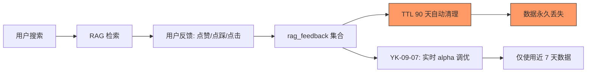
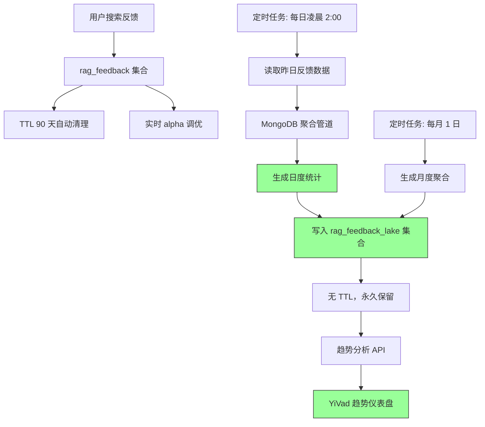

# YK-09-50: 知识库 RAG 检索反馈数据湖 — 长期反馈存储与趋势分析

> 需求编号：YK-09-50 · 优先级：P2 · 人天：0.5d · 状态：需求已编写
> 依赖：YK-09-07（知识检索反馈闭环）

---

## 一、背景

### 1.1 问题描述

YK-09-07 建立了 `rag_feedback` 集合用于收集用户对检索结果的反馈（点赞/点踩/点击/引用）。但该集合设置了 TTL 90 天——热数据用于实时 alpha 调优，过期后自动清理。带来的问题：

1. **长期趋势不可见**：无法回答"本季度检索满意度比上季度提升了多少"——历史数据已被清理。
2. **季度/年度报告无法生成**：产品决策需要跨月度的数据，但 TTL 限制了数据留存。
3. **异常检测不敏感**：检索质量的缓慢退化（如满意度从 82% 逐渐降到 75%）在 90 天窗口内难以察觉。

### 1.2 影响量化

| 影响维度 | 量化 | 说明 |
|----------|------|------|
| 长期数据缺失 | 90 天后数据不可恢复 | 季度对比分析无法进行 |
| 趋势分析不可行 | 无趋势数据 | 无法判断检索质量是在改善还是恶化 |
| 产品决策缺乏数据支撑 | 无长期数据 | 无法评估检索优化的长期效果 |

### 1.3 核心挑战

- **存储效率**：原始反馈数据量大（每天数百条），需压缩为聚合统计。
- **数据一致性**：原始反馈（TTL 90 天）和聚合统计（无 TTL）之间的数据一致性。
- **聚合粒度**：日度/周度/月度——不同分析需求需要不同粒度。

---

## 二、现状分析

### 2.1 当前数据流



### 2.2 根因分析矩阵

| 根因 | 类别 | 影响 | 优先级 |
|------|------|------|--------|
| TTL 导致长期数据丢失 | 架构缺陷 | 趋势分析不可行 | P0 |
| 无聚合存储层 | 架构缺失 | 原始数据被清理后无备份 | P0 |
| 无趋势分析功能 | 功能缺失 | 无法判断检索质量变化方向 | P1 |
| 无长期可视化 | 展示缺失 | 产品决策缺乏数据支撑 | P1 |

### 2.3 现有资产

- `rag_feedback` 集合已收集反馈数据，含 `feedback_type`、`weighted_score`、`timestamp`。
- MongoDB 聚合管道可用于日度统计。
- YiVad 已有 ECharts 图表组件可用。

---

## 三、设计决策

### D-01：存储策略——原始 + 聚合双层

| 方案 | 描述 | 优点 | 缺点 | 决策 |
|------|------|------|------|------|
| A: 延长 TTL | 将 TTL 从 90 天延长到 365 天 | 简单 | 存储成本高，性能下降 | 否决 |
| B: 仅聚合存储 | 每日聚合后删除原始数据 | 存储成本低 | 丢失原始数据细节 | 否决 |
| C: 双层存储 | 原始数据 TTL 90 天 + 聚合数据永久保留 | 平衡成本和可用性 | 需维护聚合任务 | **采用** |

**决策**：方案 C——原始数据保留 90 天（用于实时调优），日度聚合数据永久保留（用于趋势分析）。

### D-02：聚合粒度

| 方案 | 描述 | 优点 | 缺点 | 决策 |
|------|------|------|------|------|
| A: 仅日度 | 每天一条聚合记录 | 存储成本低 | 周/月趋势需二次聚合 | **采用** |
| B: 日度 + 周度 + 月度 | 多粒度预聚合 | 查询快 | 存储冗余 | 补充方案 |

**决策**：方案 A 为主——日度聚合（可灵活二次聚合为周/月），方案 B 补充（月度聚合用于季度报告）。

### D-03：聚合指标

| 指标 | 聚合方式 | 说明 |
|------|----------|------|
| 总反馈数 | COUNT | 每日反馈总量 |
| 点赞数 | COUNT (feedback_type='explicit_like') | 显式正面反馈 |
| 点踩数 | COUNT (feedback_type='explicit_dislike') | 显式负面反馈 |
| 点击率 | COUNT (click_through) / COUNT (total) | 用户点击结果的比例 |
| 引用率 | COUNT (source_cited) / COUNT (total) | 用户引用结果的比例 |
| 满意率 | 点赞/(点赞+点踩) | 净满意度 |
| 平均分数 | AVG (weighted_score) | 加权平均分数 |
| 空结果率 | COUNT (empty_result) / COUNT (total) | 无结果查询的比例 |
| Top 查询 | GROUP BY query TOP 10 | 高频查询 |
| Top 无结果查询 | GROUP BY query WHERE result_count=0 | 高频无结果查询 |

---

## 四、目标架构

### 4.1 目标数据流



### 4.2 核心指标

| 指标 | 当前值 | 目标值 | 测量方式 |
|------|--------|--------|----------|
| 长期数据保留 | 90 天 | 永久 | rag_feedback_lake 无 TTL |
| 数据压缩比 | 1:1 | 100:1 | 原始记录数 / 聚合记录数 |
| 趋势分析可用性 | 0% | 100% | 可查询任意时间范围的趋势 |

### 4.3 架构权衡

| 权衡 | 选择 | 理由 |
|------|------|------|
| 存储成本 vs 分析能力 | 日均 1 条记录，存储成本极低 | 聚合数据永久保留，价值远超成本 |
| 实时 vs 离线 | 离线聚合 | 趋势分析不需要实时性 |
| 单层 vs 双层 | 双层存储 | 原始数据用于实时调优，聚合数据用于长期分析 |

---

## 五、具体改动

### 5.1 核心代码

```python
# YiAi/src/domain/rag/feedback_lake.py

from datetime import datetime, timedelta

class FeedbackDataLake:
    """长期反馈存储——无 TTL 的聚合数据湖。"""

    def __init__(self, db):
        self.db = db

    async def aggregate_daily(self, date: datetime = None) -> dict:
        """每日聚合——原始反馈→日度统计（压缩比 ~100:1）。"""
        if date is None:
            date = datetime.utcnow() - timedelta(days=1)

        start = date.replace(hour=0, minute=0, second=0, microsecond=0)
        end = date.replace(hour=23, minute=59, second=59, microsecond=999999)

        pipeline = [
            {"$match": {
                "timestamp": {"$gte": start, "$lt": end},
            }},
            {"$group": {
                "_id": None,
                "total_feedback": {"$sum": 1},
                "explicit_likes": {"$sum": {"$cond": [
                    {"$eq": ["$feedback_type", "explicit_like"]}, 1, 0
                ]}},
                "explicit_dislikes": {"$sum": {"$cond": [
                    {"$eq": ["$feedback_type", "explicit_dislike"]}, 1, 0
                ]}},
                "click_throughs": {"$sum": {"$cond": [
                    {"$eq": ["$feedback_type", "click_through"]}, 1, 0
                ]}},
                "source_cited": {"$sum": {"$cond": [
                    {"$eq": ["$feedback_type", "source_cited"]}, 1, 0
                ]}},
                "empty_results": {"$sum": {"$cond": [
                    {"$eq": ["$feedback_type", "empty_result"]}, 1, 0
                ]}},
                "avg_weighted_score": {"$avg": "$weighted_score"},
                "top_queries": {"$push": "$query"},
                "unique_users": {"$addToSet": "$user_id"},
            }},
        ]

        daily_stats = await self.db.rag_feedback.aggregate(pipeline).to_list(None)

        if not daily_stats or daily_stats[0]['total_feedback'] == 0:
            return {'date': start.strftime('%Y-%m-%d'), 'total_feedback': 0}

        stats = daily_stats[0]

        # 计算衍生指标
        total_likes = stats['explicit_likes'] + stats['explicit_dislikes']
        satisfaction_rate = (
            stats['explicit_likes'] / max(total_likes, 1)
        )

        click_through_rate = (
            stats['click_throughs'] / max(stats['total_feedback'], 1)
        )

        source_cited_rate = (
            stats['source_cited'] / max(stats['total_feedback'], 1)
        )

        empty_result_rate = (
            stats['empty_results'] / max(stats['total_feedback'], 1)
        )

        # Top 查询统计
        query_counts = {}
        for q in stats['top_queries']:
            query_counts[q] = query_counts.get(q, 0) + 1
        top_queries = sorted(query_counts.items(), key=lambda x: x[1], reverse=True)[:10]

        daily_doc = {
            'date': start.strftime('%Y-%m-%d'),
            'total_feedback': stats['total_feedback'],
            'unique_users': len(stats['unique_users']),
            'explicit_likes': stats['explicit_likes'],
            'explicit_dislikes': stats['explicit_dislikes'],
            'click_throughs': stats['click_throughs'],
            'source_cited': stats['source_cited'],
            'empty_results': stats['empty_results'],
            'satisfaction_rate': round(satisfaction_rate, 4),
            'click_through_rate': round(click_through_rate, 4),
            'source_cited_rate': round(source_cited_rate, 4),
            'empty_result_rate': round(empty_result_rate, 4),
            'avg_weighted_score': round(stats['avg_weighted_score'], 4),
            'top_queries': [{'query': q, 'count': c} for q, c in top_queries],
            'aggregated_at': datetime.utcnow(),
        }

        # Upsert——防止重复聚合
        await self.db.rag_feedback_lake.update_one(
            {'date': daily_doc['date']},
            {'$set': daily_doc},
            upsert=True,
        )

        return daily_doc

    async def get_trend(self, days: int = 90) -> list[dict]:
        """获取检索质量趋势——日度时间序列。"""
        cutoff = (datetime.utcnow() - timedelta(days=days)).strftime('%Y-%m-%d')

        daily = await self.db.rag_feedback_lake.find({
            'date': {'$gte': cutoff}
        }).sort('date', 1).to_list(None)

        return [{
            'date': d['date'],
            'total_feedback': d['total_feedback'],
            'likes': d['explicit_likes'],
            'dislikes': d['explicit_dislikes'],
            'satisfaction_rate': d['satisfaction_rate'],
            'click_through_rate': d['click_through_rate'],
            'source_cited_rate': d['source_cited_rate'],
            'empty_result_rate': d['empty_result_rate'],
            'avg_score': d['avg_weighted_score'],
            'unique_users': d['unique_users'],
        } for d in daily]

    async def get_monthly_summary(self, months: int = 6) -> list[dict]:
        """获取月度汇总——用于季度/年度报告。"""
        daily = await self.get_trend(days=months * 30)

        monthly = {}
        for d in daily:
            month_key = d['date'][:7]  # YYYY-MM
            if month_key not in monthly:
                monthly[month_key] = {
                    'month': month_key,
                    'total_feedback': 0,
                    'total_likes': 0,
                    'total_dislikes': 0,
                    'days': 0,
                    'satisfaction_rates': [],
                }
            monthly[month_key]['total_feedback'] += d['total_feedback']
            monthly[month_key]['total_likes'] += d['likes']
            monthly[month_key]['total_dislikes'] += d['dislikes']
            monthly[month_key]['days'] += 1
            monthly[month_key]['satisfaction_rates'].append(d['satisfaction_rate'])

        return [{
            'month': m['month'],
            'total_feedback': m['total_feedback'],
            'avg_daily_feedback': round(m['total_feedback'] / max(m['days'], 1)),
            'satisfaction_rate': round(
                m['total_likes'] / max(m['total_likes'] + m['total_dislikes'], 1), 4
            ),
            'avg_daily_satisfaction': round(
                sum(m['satisfaction_rates']) / max(len(m['satisfaction_rates']), 1), 4
            ),
        } for m in sorted(monthly.values(), key=lambda x: x['month'])]

    async def get_top_empty_queries(self, days: int = 30) -> list[dict]:
        """获取高频无结果查询——用于内容缺口分析。"""
        cutoff = datetime.utcnow() - timedelta(days=days)

        pipeline = [
            {"$match": {
                "feedback_type": "empty_result",
                "timestamp": {"$gte": cutoff},
            }},
            {"$group": {
                "_id": "$query",
                "count": {"$sum": 1},
            }},
            {"$sort": {"count": -1}},
            {"$limit": 20},
        ]

        return await self.db.rag_feedback.aggregate(pipeline).to_list(None)

    async def backfill_history(self, start_date: str, end_date: str):
        """回填历史数据——从原始反馈中聚合已过去的数据。"""
        start = datetime.strptime(start_date, '%Y-%m-%d')
        end = datetime.strptime(end_date, '%Y-%m-%d')

        current = start
        while current <= end:
            await self.aggregate_daily(current)
            current += timedelta(days=1)

        return {'backfilled_from': start_date, 'backfilled_to': end_date}
```

### 5.2 趋势可视化

```markdown
┌─ RAG 检索质量趋势 (90 天) ────────────────────────────────┐
│                                                              │
│ 📈 满意度趋势 (折线图)                                        │
│   82% ┤     ╭─╮    ╭──╮                                     │
│   78% ┤  ╭──╯  ╰──╯   ╰──╮                                  │
│   74% ┤──╯                  ╰──                               │
│       ├────┼────┼────┼────┼────┤                             │
│       7/1  7/15 8/1  8/15 9/1  9/9                           │
│                                                              │
│ 📊 关键指标 (本月 vs 上月)                                     │
│   满意度: 82% ↑ (+3%)                                        │
│   点击率: 35% → (+5%)                                        │
│   来源引用率: 42% ↑ (+8%)                                    │
│   空结果率: 3.2% ↓ (-1.1%)                                   │
│                                                              │
│ 🔍 高频无结果查询 (本月 Top 5)                                 │
│   1. "GraphQL 订阅实现" (12 次)                              │
│   2. "WebAssembly 性能对比" (8 次)                           │
│   3. "Kubernetes 多集群管理" (6 次)                          │
└──────────────────────────────────────────────────────────────┘
```

### 5.3 文件变更清单

| 文件路径 | 操作 | 说明 |
|----------|------|------|
| `YiAi/src/domain/rag/feedback_lake.py` | 新增 | 反馈数据湖核心逻辑 |
| `YiAi/src/services/rag/scheduled_tasks.py` | 新增 | 每日聚合定时任务 |
| `YiAi/src/routers/rag_router.py` | 修改 | 新增 `/rag/trend` 和 `/rag/monthly-summary` 端点 |
| `YiVad/src/views/rag/TrendDashboard.vue` | 新增 | 趋势仪表盘页面 |

---

## 六、实施步骤

| 步骤 | 内容 | 验证方法 | 人天 |
|------|------|----------|------|
| 1 | 创建 `rag_feedback_lake` 集合（无 TTL） | 验证集合创建成功 | 0.1 |
| 2 | 实现 `FeedbackDataLake` 核心类 | 单元测试：日度聚合逻辑 | 0.5 |
| 3 | 实现趋势查询 API | 集成测试：API 返回时间序列数据 | 0.3 |
| 4 | 实现月度汇总 + 无结果查询分析 | 集成测试：月度聚合正确 | 0.3 |
| 5 | 实现定时任务（每日凌晨 2:00） | 验证定时触发 + 聚合正确 | 0.2 |
| 6 | 回填历史数据（最近 90 天） | 验证回填数据完整性 | 0.3 |
| 7 | 前端趋势仪表盘 | 手动测试：折线图 + 指标卡 | 1.0 |

**总计**：2.7 人天

---

## 七、性能分析

### 7.1 聚合性能

| 操作 | 耗时 | 说明 |
|------|------|------|
| 日度聚合（100 条原始反馈） | ~50ms | MongoDB 聚合管道 |
| 日度聚合（1000 条原始反馈） | ~200ms | MongoDB 聚合管道 |
| 趋势查询（90 天） | ~10ms | 读取 90 条日度聚合记录 |
| 月度汇总（6 个月） | ~20ms | 二次聚合 180 条日度记录 |

### 7.2 存储容量

| 项目 | 大小 | 说明 |
|------|------|------|
| 日度聚合记录 | ~1KB/天 | 包含所有统计指标 |
| 年度存储 | ~365KB | 极低 |
| 原始反馈（对比） | ~100KB/天 | 假设 100 条/天 |
| 压缩比 | ~100:1 | 原始 → 聚合 |

---

## 八、测试规格

### 8.1 单元测试

**测试用例 1：日度聚合**

```
GIVEN 昨日有 50 条反馈（30 点赞、10 点踩、10 点击）
WHEN 调用 aggregate_daily()
THEN 聚合记录包含 total_feedback=50
AND satisfaction_rate = 30/40 = 0.75
AND click_through_rate = 10/50 = 0.20
```

**测试用例 2：空数据日**

```
GIVEN 昨日没有任何反馈
WHEN 调用 aggregate_daily()
THEN 返回 total_feedback=0
AND 不写入 rag_feedback_lake
```

**测试用例 3：趋势查询**

```
GIVEN rag_feedback_lake 有 90 天数据
WHEN 调用 get_trend(days=30)
THEN 返回最近 30 天的日度时间序列
AND 按日期升序排列
```

**测试用例 4：月度汇总**

```
GIVEN 有 3 个月的日度数据
WHEN 调用 get_monthly_summary(months=3)
THEN 返回 3 条月度汇总记录
AND 每条包含 total_feedback, avg_daily_feedback, satisfaction_rate
```

### 8.2 集成测试

**测试用例 5：端到端趋势展示**

```
GIVEN 数据湖有 90 天历史数据
WHEN 前端请求趋势数据
THEN 返回完整的时间序列
AND 前端渲染折线图和指标卡
```

---

## 九、风险与缓解

### 9.1 风险矩阵

| 风险 | 概率 | 影响 | 缓解措施 |
|------|------|------|----------|
| 定时任务遗漏——某天未聚合 | 中 | 中——数据缺口 | 定时任务支持补跑，回填历史数据 |
| 原始数据清理过快——聚合未完成 | 低 | 高——数据永久丢失 | 聚合在 TTL 之前（90 天 vs 每日聚合） |
| 聚合指标计算错误 | 低 | 中——趋势分析偏差 | 单元测试覆盖所有聚合指标 |

---

## 十、回滚策略

| 场景 | 回滚操作 | 影响范围 |
|------|----------|----------|
| 聚合数据异常 | 清空 rag_feedback_lake，从原始数据重新聚合 | 趋势数据暂时不可用 |
| 定时任务故障 | 手动运行回填脚本 | 数据缺口可修复 |
| 趋势仪表盘性能问题 | 降级为仅展示最近 30 天 | 长期趋势不可见 |

---

## 十一、设计决策记录

### D-01：双层存储架构

**背景**：原始数据需要 TTL 控制存储成本，但长期数据需要保留。
**决策**：原始数据 TTL 90 天 + 日度聚合永久保留。
**后果**：需维护每日聚合任务，但存储成本极低。

### D-02：日度聚合粒度

**背景**：需要在存储成本和查询灵活性之间权衡。
**决策**：日度聚合——可灵活二次聚合为周/月/季度。
**后果**：查询时需二次聚合，但 90 天仅 90 条记录，查询速度极快。

### D-03：聚合时机

**背景**：需要确保聚合在数据清理前完成。
**决策**：每日凌晨 2:00 聚合前一天数据（比 TTL 90 天早得多）。
**后果**：聚合延迟最多 26 小时，对趋势分析无影响。

---

## 十二、可观测性

### 12.1 指标

| 指标名称 | 类型 | 说明 |
|----------|------|------|
| `feedback_lake_daily_aggregation_success` | Counter | 日度聚合成功次数 |
| `feedback_lake_daily_aggregation_failure` | Counter | 日度聚合失败次数 |
| `feedback_lake_last_aggregation_date` | Gauge | 最近一次聚合日期 |
| `feedback_lake_total_records` | Gauge | 聚合记录总数 |

### 12.2 日志

```python
logger.info(f"[FeedbackLake] 日度聚合完成: {date}, 总反馈: {total}, 满意率: {rate:.2%}")
logger.warning(f"[FeedbackLake] 日度聚合: {date} 无反馈数据")
logger.error(f"[FeedbackLake] 日度聚合失败: {date}, {error}")
```

### 12.3 告警

| 告警 | 条件 | 级别 |
|------|------|------|
| 日度聚合失败 | 连续 2 天聚合失败 | P1 |
| 数据缺口 | 聚合记录日期不连续 | P2 |

---

## 十三、安全合规

| 要求 | 实现方式 |
|------|----------|
| 用户隐私 | 聚合数据仅保留统计指标，不保留个体用户数据 |
| 数据完整性 | 聚合记录不可修改（仅 upsert） |
| 数据保留 | 聚合数据永久保留，原始数据 TTL 90 天 |

---

## 十四、代码审查检查清单

- [ ] `FeedbackDataLake` 实现双层存储：原始 TTL 90 天 + 聚合永久保留
- [ ] 日度聚合包含 10 个指标：满意度/点击率/引用率/空结果率/平均分/Top 查询/等
- [ ] 聚合使用 MongoDB Upsert——防止重复聚合
- [ ] 空数据日不写入聚合记录
- [ ] 月度汇总支持二次聚合
- [ ] 无结果查询 Top 20 分析用于内容缺口识别
- [ ] 定时任务每日凌晨 2:00 执行
- [ ] 支持回填历史数据（从原始反馈重新聚合）
- [ ] 前端趋势仪表盘展示折线图 + 指标卡
- [ ] 聚合记录不可修改（仅 upsert），确保数据完整性
- [ ] 日度聚合延迟 < 26 小时（前一天数据次日凌晨聚合）
- [ ] 聚合数据不保留个体用户信息

---

*PRD 来源: `projects/yiknowledge/requirements/2026-09/50-需求-反馈数据湖与趋势分析.md`*