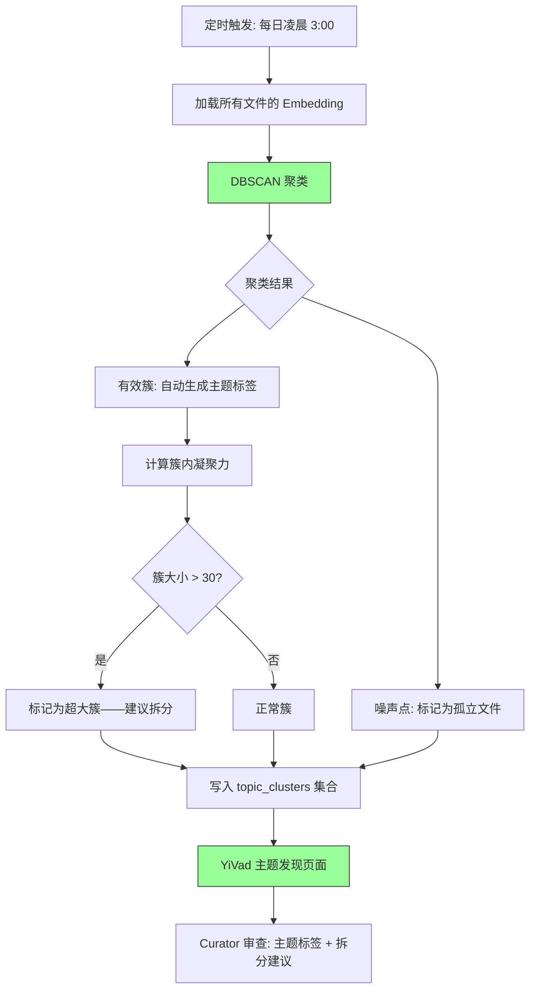

# YK-09-51: 知识库语义聚类与主题发现 — Embedding 自动揭示隐藏结构

> 需求编号：YK-09-51 · 优先级：P2 · 人天：0.5d · 状态：需求已编写

---

## 一、背景

### 1.1 问题描述

YiKnowledge 的 800+ 文件按 8 个角色目录和 4 个项目目录组织——这是人工预设的"结构视角"。但知识的自然聚类可能跨越这些人为边界：

1. **隐藏主题**：某些主题天然跨角色（如"性能优化"），相关文件分散在 `engineer/`（代码实现）、`srer/`（监控调优）、`aier/`（模型优化）中，人工视角无法发现这些隐藏的语义聚类。
2. **超大簇群**：`aier/` 目录下 200+ 文件可能包含多个子主题（如 RAG 技术、知识库治理、翻译 Pipeline），但人工子目录分类可能不准确。
3. **孤立文件**：某些文件在语义上不属于任何大的主题簇——可能是"知识孤岛"，需要合并或丰富。

### 1.2 影响量化

| 影响维度 | 量化 | 说明 |
|----------|------|------|
| 主题发现缺失 | 100% 依赖人工分类 | 无自动发现机制 |
| 目录结构固化 | 角色边界 = 知识边界 | 跨角色主题不可见 |
| 知识盲区 | 孤立文件不可见 | 缺少内容的问题可能被忽略 |

### 1.3 核心挑战

- **聚类算法选择**：K-Means 需要预设 K 值，但知识库的主题数未知。
- **簇的可解释性**：聚类结果需要有人类可理解的主题标签。
- **噪声点处理**：DBSCAN 将无法聚类到任何簇的文件标记为噪声——这些"孤立文件"如何处理？

---

## 二、现状分析

### 2.1 当前数据流


### 2.2 根因分析矩阵

| 根因 | 类别 | 影响 | 优先级 |
|------|------|------|--------|
| 无自动主题发现 | 功能缺失 | 隐藏主题不可见 | P0 |
| 目录结构仅为人预设 | 架构限制 | 与自然聚类不一致 | P0 |
| 无簇大小分析 | 功能缺失 | 超大簇群未拆分 | P1 |
| 无孤立文件检测 | 功能缺失 | 知识盲区不可见 | P1 |

### 2.3 现有资产

- 每个文件已有 Embedding 向量（768 维）。
- `sklearn` 已在 YiAi 依赖中可用（`DBSCAN`、`KMeans`、`PCA`）。
- YK-09-43 目录结构优化已实现质心计算逻辑，可复用。

---

## 三、设计决策

### D-01：聚类算法选择

| 方案 | 描述 | 优点 | 缺点 | 决策 |
|------|------|------|------|------|
| A: K-Means | 预设 K 个簇 | 速度快 | 需预设 K，对噪声敏感 | 否决 |
| B: DBSCAN | 基于密度的聚类 | 自动发现簇数，抗噪声 | 参数敏感（eps, min_samples） | **采用** |
| C: HDBSCAN | DBSCAN 的改进版 | 自动选择 eps | 依赖额外库 | 远期方案 |

**决策**：采用 DBSCAN——自动发现簇数，天然处理噪声点（孤立文件）。eps=0.3（余弦距离），min_samples=3。

### D-02：主题标签生成

| 方案 | 描述 | 优点 | 缺点 | 决策 |
|------|------|------|------|------|
| A: 最常见 Tags | 取簇内文件的最常见标签 | 简单，已有数据 | 标签可能不准确 | **采用** |
| B: LLM 生成 | 让 LLM 根据簇内文件标题生成主题名 | 语义准确 | 额外 LLM 成本 | 补充方案 |
| C: TF-IDF 关键词 | 提取簇内文件的 TF-IDF 关键词 | 自动 | 可能不人类可读 | 否决 |

**决策**：方案 A 为主（最常见标签），方案 B 补充（LLM 生成更精确的主题名）。

### D-03：聚类执行频率

| 方案 | 描述 | 优点 | 缺点 | 决策 |
|------|------|------|------|------|
| A: 实时 | 每次查询时聚类 | 结果最新 | 延迟高 | 否决 |
| B: 每日 | 每天凌晨重新聚类 | 平衡 | 新增文件最多延迟 1 天 | **采用** |
| C: 每周 | 每周聚类 | 计算成本低 | 新增文件延迟 1 周 | 否决 |

**决策**：方案 B——每日凌晨重新聚类，新增文件最快 1 天被发现。

---

## 四、目标架构

### 4.1 目标数据流



### 4.2 核心指标

| 指标 | 当前值 | 目标值 | 测量方式 |
|------|--------|--------|----------|
| 主题发现数 | 0 | 10-20 个 | DBSCAN 自动发现的簇数 |
| 平均簇凝聚力 | 无 | > 0.70 | 簇内文件余弦相似度均值 |
| 孤立文件比例 | 无 | < 15% | 噪声点 / 总文件数 |
| 超大簇比例 | 无 | < 10% | 簇大小 > 30 的比例 |

### 4.3 架构权衡

| 权衡 | 选择 | 理由 |
|------|------|------|
| 自动发现 vs 人工分类 | 自动发现 + 人工审查 | 自动发现隐藏主题，人工审核主题标签 |
| 精确 vs 覆盖 | 偏好精确 | 误聚类比漏聚类更损害信任 |
| 实时 vs 离线 | 每日离线 | 知识结构变化不频繁 |

---

## 五、具体改动

### 5.1 核心代码

```python
# YiAi/src/domain/knowledge/topic_discovery.py

from sklearn.cluster import DBSCAN
from sklearn.metrics.pairwise import cosine_similarity
import numpy as np
from collections import Counter

class TopicDiscovery:
    """基于 Embedding 的语义聚类与主题发现。"""

    def __init__(self, db, llm_service=None):
        self.db = db
        self.llm = llm_service

    async def cluster(self, eps: float = 0.3,
                      min_samples: int = 3) -> list[dict]:
        """DBSCAN 聚类——自动发现主题簇。"""

        # 1. 加载所有文件的 Embedding
        docs = await self.db.knowledge_files.find({
            'embedding': {'$exists': True}
        }).to_list(None)

        if len(docs) < 10:
            return []

        vectors = np.array([d['embedding'] for d in docs])
        paths = [d['path'] for d in docs]

        # 2. DBSCAN——基于密度的聚类
        clustering = DBSCAN(eps=eps, min_samples=min_samples, metric='cosine')
        labels = clustering.fit_predict(vectors)

        # 3. 统计
        unique_labels = set(labels)
        n_clusters = len(unique_labels) - (1 if -1 in unique_labels else 0)
        n_noise = sum(1 for l in labels if l == -1)

        # 4. 为每个簇生成主题标签
        topics = {}
        for i, label in enumerate(labels):
            if label == -1:  # 噪声点
                continue
            topics.setdefault(int(label), []).append({
                'path': paths[i],
                'title': docs[i].get('frontmatter', {}).get('title', paths[i]),
                'tags': docs[i].get('frontmatter', {}).get('tags', []),
                'role': paths[i].split('/')[0],
                'embedding': docs[i]['embedding'],
            })

        # 5. 为每个簇生成主题名称 + 凝聚力
        results = []
        for cluster_id, files in topics.items():
            all_tags = [t for f in files for t in f['tags']]
            tag_counts = Counter(all_tags)
            top_tags = [t for t, _ in tag_counts.most_common(5)]

            # 角色分布
            roles = Counter(f['role'] for f in files)

            # 凝聚力
            file_vectors = np.array([f['embedding'] for f in files])
            cohesion = self._calculate_cohesion(file_vectors)

            result = {
                'cluster_id': cluster_id,
                'size': len(files),
                'top_tags': top_tags,
                'suggested_topic': ' / '.join(top_tags[:3]),
                'role_distribution': dict(roles.most_common()),
                'cohesion': cohesion,
                'files': files[:5],  # 每个簇展示前 5 个文件
                'is_cross_role': len(roles) > 1,
            }

            # 超大类建议拆分
            if len(files) > 30:
                result['suggestion'] = (
                    f'该主题包含 {len(files)} 个文件（凝聚力 {cohesion:.2f}）——'
                    f'建议拆分为子主题'
                )
            elif cohesion < 0.60:
                result['suggestion'] = (
                    f'簇内凝聚力偏低（{cohesion:.2f}）——'
                    f'可能包含多个子主题，建议审查'
                )

            results.append(result)

        # 6. 噪声点（孤立文件）
        noise_files = [
            {
                'path': paths[i],
                'title': docs[i].get('frontmatter', {}).get('title', paths[i]),
                'role': paths[i].split('/')[0],
            }
            for i, l in enumerate(labels) if l == -1
        ]

        return {
            'clusters': sorted(results, key=lambda c: c['size'], reverse=True),
            'noise': noise_files,
            'summary': {
                'total_files': len(docs),
                'n_clusters': n_clusters,
                'n_noise': n_noise,
                'noise_ratio': round(n_noise / len(docs), 3),
                'avg_cohesion': round(
                    sum(c['cohesion'] for c in results) / max(len(results), 1), 3
                ),
            },
        }

    def _calculate_cohesion(self, vectors: np.ndarray) -> float:
        """簇内凝聚力——平均余弦相似度。"""
        if len(vectors) < 2:
            return 1.0
        sim_matrix = cosine_similarity(vectors)
        upper_tri = sim_matrix[np.triu_indices_from(sim_matrix, k=1)]
        return float(np.mean(upper_tri))

    async def generate_topic_labels(self, cluster: dict) -> str:
        """使用 LLM 生成更精确的主题标签。"""
        if not self.llm:
            return cluster['suggested_topic']

        file_titles = [f['title'] for f in cluster['files'][:5]]
        prompt = f"""以下是一个知识簇中的文件标题，请为这个簇生成一个简洁的主题名称（≤ 10 字）:

文件:
{chr(10).join(f'- {t}' for t in file_titles)}

当前标签: {', '.join(cluster['top_tags'])}

主题名称:"""

        response = await self.llm.chat([{"role": "user", "content": prompt}])
        return response.strip()

    async def save_clusters(self, result: dict):
        """保存聚类结果到数据库。"""
        # 清空旧结果
        await self.db.topic_clusters.delete_many({})

        for cluster in result['clusters']:
            await self.db.topic_clusters.insert_one({
                'cluster_id': cluster['cluster_id'],
                'size': cluster['size'],
                'top_tags': cluster['top_tags'],
                'suggested_topic': cluster['suggested_topic'],
                'cohesion': cluster['cohesion'],
                'role_distribution': cluster['role_distribution'],
                'is_cross_role': cluster['is_cross_role'],
                'suggestion': cluster.get('suggestion'),
                'file_paths': [f['path'] for f in cluster['files']],
                'created_at': datetime.utcnow(),
            })

        # 保存噪声点
        if result['noise']:
            await self.db.topic_clusters.insert_one({
                'cluster_id': -1,
                'type': 'noise',
                'size': len(result['noise']),
                'files': result['noise'],
                'created_at': datetime.utcnow(),
            })
```

### 5.2 聚类发现示例

```markdown
🔍 自动发现 12 个主题簇 (总文件: 800, 噪声: 15, 平均凝聚力: 0.78)

1. RAG 检索技术 (28 文件, 凝聚力: 0.82) 🌐 跨角色
   标签: [RAG, 混合检索, BM25, 向量检索, Embedding]
   角色: aier(18), engineer(6), srer(4)
   ⚠️ 建议拆分: 28 个文件——考虑拆分为 RAG引擎/RAG优化

2. Chrome 扩展开发 (22 文件, 凝聚力: 0.85)
   标签: [Chrome扩展, MV3, ContentScript, ServiceWorker]
   角色: engineer(20), aier(2)

3. 知识库治理 (18 文件, 凝聚力: 0.78)
   标签: [治理, Frontmatter, 生命周期, 质量]
   角色: curator(15), aier(3)

...

🟡 噪声点 (15 个孤立文件):
   - aier/obscure-model-evaluation.md
   - engineer/legacy-system-migration.md
   - srer/one-off-deployment-script.md
   ...
```

### 5.3 文件变更清单

| 文件路径 | 操作 | 说明 |
|----------|------|------|
| `YiAi/src/domain/knowledge/topic_discovery.py` | 新增 | 语义聚类核心逻辑 |
| `YiAi/src/services/knowledge/scheduled_tasks.py` | 修改 | 新增每日聚类任务 |
| `YiAi/src/routers/knowledge_router.py` | 修改 | 新增 `/knowledge/topic-clusters` 端点 |
| `YiVad/src/views/knowledge/TopicDiscovery.vue` | 新增 | 主题发现页面 |

---

## 六、实施步骤

| 步骤 | 内容 | 验证方法 | 人天 |
|------|------|----------|------|
| 1 | 实现 `TopicDiscovery` 核心类 | 单元测试：DBSCAN 聚类 + 凝聚力计算 | 0.5 |
| 2 | 实现主题标签生成（LLM + tags） | 单元测试：标签生成逻辑 | 0.3 |
| 3 | 实现超大类检测 + 拆分建议 | 单元测试：size > 30 触发建议 | 0.2 |
| 4 | 新增 API 端点 | 集成测试：API 返回聚类结果 | 0.3 |
| 5 | 实现每日定时聚类任务 | 验证定时触发 + 结果保存 | 0.2 |
| 6 | 前端主题发现页面 | 手动测试：聚类可视化 + 详情 | 1.0 |

**总计**：2.5 人天

---

## 七、性能分析

### 7.1 聚类计算复杂度

| 操作 | 复杂度 | 800 文件估算 |
|------|--------|-------------|
| 加载 Embedding | O(n) | ~50ms |
| DBSCAN 聚类 | O(n log n) | ~200ms |
| 凝聚力计算 | O(k * m²) (k=簇数, m=簇大小) | ~100ms |
| 总计算时间 | — | ~400ms |

### 7.2 容量规划

| 文件规模 | 计算时间 | 内存 |
|----------|---------|------|
| 800 文件 | ~400ms | ~15MB |
| 2000 文件 | ~1.5s | ~40MB |
| 5000 文件 | ~5s | ~100MB |

---

## 八、测试规格

### 8.1 单元测试

**测试用例 1：DBSCAN 聚类**

```
GIVEN 100 个文件的 Embedding 向量，包含 3 个自然簇
WHEN 调用 cluster(eps=0.3, min_samples=3)
THEN 返回 3 个有效簇
AND 噪声点数量 < 总文件的 15%
```

**测试用例 2：凝聚力计算**

```
GIVEN 一个簇包含 5 个高度相似的文件（两两相似度 > 0.85）
WHEN 调用 _calculate_cohesion(vectors)
THEN 返回的凝聚力 > 0.80
```

**测试用例 3：跨角色检测**

```
GIVEN 一个簇包含来自 engineer/ 和 srer/ 的文件
WHEN 评估 is_cross_role
THEN is_cross_role = True
AND role_distribution 包含两个角色
```

**测试用例 4：超大类检测**

```
GIVEN 一个簇包含 35 个文件
WHEN 评估簇大小
THEN result.suggestion 包含 "建议拆分为子主题"
```

### 8.2 集成测试

**测试用例 5：端到端主题发现**

```
GIVEN 知识库有 800 个文件
WHEN 执行完整的聚类分析
THEN 返回 10-20 个主题簇
AND 每个簇包含 top_tags、cohesion、role_distribution
AND 噪声点（孤立文件）被正确标记
AND 结果写入 topic_clusters 集合
```

---

## 九、风险与缓解

### 9.1 风险矩阵

| 风险 | 概率 | 影响 | 缓解措施 |
|------|------|------|----------|
| DBSCAN 参数不合理——过多噪声点 | 中 | 中——大量文件被标记为孤立 | 参数可调（eps, min_samples） |
| 聚类结果不稳定——每次结果不同 | 低 | 中——curator 困惑 | 保存历史聚类结果，对比变化 |
| 超大簇建议拆分但 curator 不采纳 | 中 | 低 | 建议自动化的子聚类 |

---

## 十、回滚策略

| 场景 | 回滚操作 | 影响范围 |
|------|----------|----------|
| 聚类结果质量差 | 调整 eps/min_samples 参数，重新聚类 | 聚类结果变化 |
| 性能问题（> 10s） | 降级为仅对前 500 个文件聚类 | 覆盖不全 |
| 前端页面渲染问题 | 限制返回簇数（Top 10） | 不完整 |

---

## 十一、设计决策记录

### D-01：DBSCAN 聚类

**背景**：需要自动发现簇数，处理噪声点。
**决策**：DBSCAN（eps=0.3, min_samples=3, metric='cosine'）。
**后果**：参数需要根据实际数据分布调优，eps 越大簇越少。

### D-02：主题标签——常见 Tags + LLM

**背景**：聚类结果需要人类可读的主题标签。
**决策**：最常见标签作为默认主题名，LLM 生成作为补充。
**后果**：标签质量依赖 tags 准确性，LLM 生成有额外成本。

### D-03：每日执行

**背景**：知识结构变化不频繁。
**决策**：每日凌晨重新聚类。
**后果**：新增文件最多延迟 24 小时被纳入聚类。

---

## 十二、可观测性

### 12.1 指标

| 指标名称 | 类型 | 说明 |
|----------|------|------|
| `topic_clusters_count` | Gauge | 发现的簇数 |
| `topic_clusters_avg_cohesion` | Gauge | 平均凝聚力 |
| `topic_clusters_noise_ratio` | Gauge | 噪声点比例 |
| `topic_clusters_compute_duration_ms` | Histogram | 聚类计算耗时 |

### 12.2 日志

```python
logger.info(f"[TopicDiscovery] 聚类完成: {n_clusters} 个簇, "
            f"{n_noise} 个噪声点, 平均凝聚力 {avg_cohesion:.3f}")
logger.warning(f"[TopicDiscovery] 噪声点比例过高: {noise_ratio:.1%}")
logger.info(f"[TopicDiscovery] 超大簇: {cluster_id}, {size} 个文件")
```

---

## 十三、安全合规

| 要求 | 实现方式 |
|------|----------|
| 聚类结果不暴露文件内容 | 仅存储文件路径、标题、标签 |
| 聚类历史可追溯 | 每次聚类结果保存到 topic_clusters，保留历史 |

---

## 十四、代码审查检查清单

- [ ] `TopicDiscovery` 使用 DBSCAN 聚类（eps=0.3, min_samples=3, metric='cosine'）
- [ ] 自动发现簇数，无需预设 K 值
- [ ] 噪声点（label=-1）标记为孤立文件
- [ ] 主题标签基于簇内最常见 tags（Top 5）
- [ ] 可选 LLM 生成更精确的主题标签
- [ ] 簇内凝聚力计算（平均余弦相似度）
- [ ] 超大类（size > 30）自动建议拆分
- [ ] 低凝聚力（< 0.60）自动建议审查
- [ ] 跨角色检测（is_cross_role）
- [ ] 聚类结果写入 topic_clusters 集合
- [ ] 每日凌晨定时执行聚类
- [ ] 前端主题发现页面支持簇详情展开

---

*PRD 来源: `projects/yiknowledge/requirements/2026-09/51-需求-语义聚类主题发现.md`*