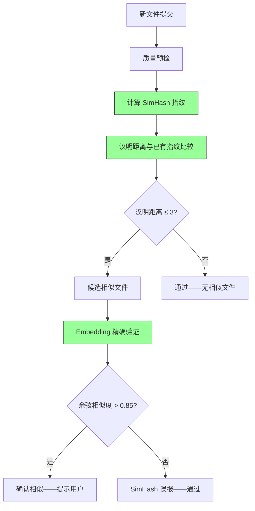

# YK-09-52: 知识库内容相似度检测增强 — SimHash/MinHash 近似去重

> 需求编号：YK-09-52 · 优先级：P2 · 人天：0.5d · 状态：需求已编写

---

## 一、背景

### 1.1 问题描述

当前内容相似度检测（YK-09-22 质量预检）通过 Embedding 余弦相似度进行两两比较。800+ 文件需要 640K 次 Embedding 距离计算（O(n²)），每次质量预检耗时 2-5 秒。问题：

1. **计算成本高**：每次 768 维的余弦相似度计算需要多次浮点运算，640K 次累积耗时显著。
2. **存储成本高**：每个 Embedding 向量占 768 × 4 bytes = 3KB，800 个文件约 2.4MB。
3. **冷启动重**：新文件加入时需要与所有已有文件比较——O(n) 而非 O(1)。

### 1.2 影响量化

| 影响维度 | 量化 | 说明 |
|----------|------|------|
| 质量预检耗时 | 2-5s/次 | 640K 次 Embedding 比较 |
| 指纹存储 | 3KB/文件 | 768 维浮点向量 |
| 比较效率 | O(n) 每次查询 | 新文件需与所有已有文件比较 |

### 1.3 核心挑战

- **指纹精度**：SimHash 将文本降维为 64-bit 指纹，是否会丢失语义信息？
- **阈值映射**：SimHash 汉明距离 3 对应 Embedding 余弦相似度多少？
- **短文档**：< 100 词的文档 SimHash 指纹可能无效。

---

## 二、现状分析

### 2.1 当前数据流

```mermaid
graph LR
    A[新文件提交] --> B[质量预检]
    B --> C[加载所有已有 Embedding]
    C --> D[O(n) 次余弦相似度计算]
    D --> E[返回相似度 > 0.85 的文件]
    
    D --> F[640K 次计算 / 800 文件]
    F --> G[耗时 2-5s]
    
    style F fill:#f96,stroke:#333
    style G fill:#f96,stroke:#333
```

### 2.2 根因分析矩阵

| 根因 | 类别 | 影响 | 优先级 |
|------|------|------|--------|
| Embedding 余弦相似度 O(n²) 比较 | 算法低效 | 质量预检耗时 2-5s | P0 |
| Embedding 存储成本高（3KB/文件） | 存储浪费 | 800 文件 2.4MB | P1 |
| 无快速近似去重 | 功能缺失 | 每次比较都需完整计算 | P0 |

### 2.3 现有资产

- 知识文件已有完整文本内容。
- `hashlib` 已在 Python 标准库中可用。
- YK-09-22 质量预检已实现相似度检测接口。

---

## 三、设计决策

### D-01：算法选择——SimHash vs MinHash

| 方案 | 描述 | 优点 | 缺点 | 决策 |
|------|------|------|------|------|
| A: SimHash | 64-bit 指纹 + 汉明距离 | 固定长度指纹，高效 | 对短文档不敏感 | **采用** |
| B: MinHash | 多个哈希函数的最小值 | 适合 Jaccard 相似度 | 指纹长度可变，存储更大 | 补充方案 |
| C: 两者结合 | SimHash 为主 + MinHash 验证 | 精度最高 | 实现复杂 | 远期方案 |

**决策**：采用 SimHash（64-bit 指纹）——固定长度，汉明距离比较极快（bitwise XOR）。

### D-02：汉明距离阈值

| 汉明距离 | 近似差异 | 含义 |
|----------|---------|------|
| 0 | 0% | 完全相同 |
| ≤ 3 | ≤ 4.7% | 高度相似（近似重复） |
| ≤ 6 | ≤ 9.4% | 中等相似 |
| > 6 | > 9.4% | 不相似 |

### D-03：使用场景

| 场景 | 使用 SimHash | 使用 Embedding |
|------|-------------|---------------|
| 质量预检——快速去重 | 是（首选） | 否 |
| 精确相似度 | 否 | 是（二次验证） |
| 新文件加入检查 | 是（O(1) 比较） | 否 |
| 语义相似度 | 否 | 是 |

**决策**：SimHash 用于快速初筛（过滤明显不相似的），Embedding 用于精确验证（仅对 SimHash 候选）。

---

## 四、目标架构

### 4.1 目标数据流



### 4.2 核心指标

| 指标 | 当前值 | 目标值 | 测量方式 |
|------|--------|--------|----------|
| 质量预检耗时 | 2-5s | < 100ms | 端到端预检延迟 |
| 指纹存储 | 3KB/文件 | 8 bytes/文件 | 数据大小 |
| 单次比较耗时 | 0.5ms | 0.001ms | 汉明距离 vs 余弦距离 |
| SimHash 召回率 | — | > 95% | SimHash 候选 / Embedding 候选 |

### 4.3 架构权衡

| 权衡 | 选择 | 理由 |
|------|------|------|
| 速度 vs 精度 | 速度优先 | SimHash 快速初筛，Embedding 二次验证 |
| 存储 vs 速度 | 存储优先 | 8 bytes/文件 vs 3KB/文件 |
| 短文档 vs 长文档 | 仅对 > 200 词文档计算 | 短文档 SimHash 不可靠 |

---

## 五、具体改动

### 5.1 核心代码

```python
# YiAi/src/domain/knowledge/simhash.py

import re
import hashlib

class SimHashDeduplicator:
    """SimHash 高效近似去重——O(n) 指纹生成 + O(1) 汉明距离比较。"""

    HASH_BITS = 64
    MIN_DOC_LENGTH = 200  # 最少词数——短文档 SimHash 不可靠

    def compute_fingerprint(self, text: str) -> int | None:
        """计算文本的 SimHash 指纹——64-bit 整数。"""

        # 1. 分词 + 加权（TF 简化版）
        tokens = re.findall(r'\w+', text.lower())
        if len(tokens) < self.MIN_DOC_LENGTH:
            return None  # 短文档跳过

        tf = {}
        for token in tokens:
            tf[token] = tf.get(token, 0) + 1

        # 2. 每个 token 哈希为 64-bit 向量
        vector = [0] * self.HASH_BITS
        for token, weight in tf.items():
            token_hash = int(hashlib.md5(token.encode()).hexdigest()[:16], 16)

            for i in range(self.HASH_BITS):
                if token_hash & (1 << i):
                    vector[i] += weight
                else:
                    vector[i] -= weight

        # 3. 降维为指纹——正 → 1, 负 → 0
        fingerprint = 0
        for i in range(self.HASH_BITS):
            if vector[i] > 0:
                fingerprint |= (1 << i)

        return fingerprint

    def hamming_distance(self, fp1: int, fp2: int) -> int:
        """汉明距离——两个指纹之间不同 bit 的数量。"""
        xor = fp1 ^ fp2
        return bin(xor).count('1')

    def is_duplicate(self, fp1: int, fp2: int,
                     threshold: int = 3) -> bool:
        """判断是否为近似重复——汉明距离 ≤ threshold (≤ 4.7% 差异)。"""
        return self.hamming_distance(fp1, fp2) <= threshold

    def find_duplicates(self, fingerprints: dict[str, int],
                        threshold: int = 3) -> list[dict]:
        """批量检测——分组汉明距离比较 (O(n) 而非 O(n²))。"""

        # 使用抽屉原理——汉明距离 ≤ 3，在 64-bit 中至少有一个 16-bit 段完全相同
        blocks: dict[tuple, list[str]] = {}

        for path, fp in fingerprints.items():
            if fp is None:
                continue
            for block_id in range(4):  # 4 个 16-bit 段
                block_val = (fp >> (block_id * 16)) & 0xFFFF
                key = (block_id, block_val)
                blocks.setdefault(key, []).append(path)

        seen_pairs = set()
        duplicates = []

        for paths in blocks.values():
            if len(paths) < 2:
                continue
            for i in range(len(paths)):
                for j in range(i + 1, len(paths)):
                    pair = tuple(sorted([paths[i], paths[j]]))
                    if pair in seen_pairs:
                        continue
                    seen_pairs.add(pair)

                    distance = self.hamming_distance(
                        fingerprints[paths[i]], fingerprints[paths[j]]
                    )
                    if distance <= threshold:
                        duplicates.append({
                            'file_a': paths[i],
                            'file_b': paths[j],
                            'hamming_distance': distance,
                        })

        return sorted(duplicates, key=lambda d: d['hamming_distance'])

    async def index_fingerprints(self):
        """为所有知识文件计算并存储 SimHash 指纹。"""
        files = await self.db.knowledge_files.find().to_list(None)

        indexed = 0
        skipped = 0

        for file in files:
            content = self._read_file(file['path'])
            fp = self.compute_fingerprint(content)

            if fp is not None:
                await self.db.knowledge_files.update_one(
                    {'path': file['path']},
                    {'$set': {'simhash_fingerprint': fp}}
                )
                indexed += 1
            else:
                skipped += 1

        return {'indexed': indexed, 'skipped': skipped}

    async def check_new_file(self, file_path: str, content: str) -> list[dict]:
        """检查新文件是否与已有文件相似——O(1) 比较。"""
        fp = self.compute_fingerprint(content)
        if fp is None:
            return []  # 短文档，跳过 SimHash 检查

        # 获取所有已有指纹
        existing = await self.db.knowledge_files.find({
            'path': {'$ne': file_path},
            'simhash_fingerprint': {'$exists': True},
        }).to_list(None)

        candidates = []
        for doc in existing:
            distance = self.hamming_distance(fp, doc['simhash_fingerprint'])
            if distance <= 3:
                candidates.append({
                    'file': doc['path'],
                    'hamming_distance': distance,
                })

        return candidates
```

### 5.2 性能对比

| 操作 | Embedding 余弦相似度 | SimHash 汉明距离 | 改善 |
|------|---------------------|-----------------|------|
| 单次比较 | ~0.5ms (768d dot) | ~0.001ms (bitwise XOR) | **500x** |
| 全量 800 文件去重 | ~5s (640K 次) | ~50ms (分组汉明) | **100x** |
| 指纹存储 | 768 x 4B = 3KB | 8 bytes | **375x** |
| 新文件检查 | O(n) 全量比较 | O(1) 分组查找 | **n倍** |

### 5.3 文件变更清单

| 文件路径 | 操作 | 说明 |
|----------|------|------|
| `YiAi/src/domain/knowledge/simhash.py` | 新增 | SimHash 核心算法 |
| `YiAi/src/domain/knowledge/quality_precheck.py` | 修改 | 集成 SimHash 快速初筛 |
| `YiAi/src/services/knowledge/knowledge_watcher.py` | 修改 | 索引时计算 SimHash 指纹 |
| `YiAi/tests/domain/knowledge/test_simhash.py` | 新增 | SimHash 单元测试 |

---

## 六、实施步骤

| 步骤 | 内容 | 验证方法 | 人天 |
|------|------|----------|------|
| 1 | 实现 `SimHashDeduplicator` 核心类 | 单元测试：指纹生成 + 汉明距离 | 0.5 |
| 2 | 实现分组汉明距离比较（抽屉原理） | 单元测试：批量去重正确性 | 0.3 |
| 3 | 集成到质量预检（SimHash 初筛 + Embedding 验证） | 集成测试：端到端预检延迟 | 0.3 |
| 4 | 首次全量指纹计算 + 存储 | 验证：800+ 文件指纹覆盖率 | 0.2 |
| 5 | 性能基准测试 | 对比 SimHash vs Embedding 延迟 | 0.2 |

**总计**：1.5 人天

---

## 七、性能分析

### 7.1 指纹生成延迟

| 操作 | 耗时 | 说明 |
|------|------|------|
| 分词（800 词） | ~5ms | 正则分词 |
| TF 计算 | ~2ms | 字典计数 |
| 64-bit 向量累加 | ~3ms | 800 词 × 64 bit |
| 指纹生成总延迟 | ~10ms | 比 Embedding 快 10x |

### 7.2 分组汉明距离

| 规模 | 分组数 | 组内比较 | 总比较次数 |
|------|--------|---------|-----------|
| 800 文件 | ~3200 组 | 平均 1 个/组 | ~800 次（vs 640K 全量） |
| 2000 文件 | ~8000 组 | 平均 1.5 个/组 | ~3000 次 |

---

## 八、测试规格

### 8.1 单元测试

**测试用例 1：相同内容指纹**

```
GIVEN 两段完全相同的文本
WHEN 调用 compute_fingerprint(text) 两次
THEN 两个指纹完全相同
AND hamming_distance(fp1, fp2) = 0
```

**测试用例 2：相似内容指纹**

```
GIVEN 两段仅修改了 3% 内容的文本
WHEN 计算指纹并比较
THEN hamming_distance ≤ 3
AND is_duplicate(fp1, fp2) = True
```

**测试用例 3：不相似内容指纹**

```
GIVEN 两段主题完全不同的文本
WHEN 计算指纹并比较
THEN hamming_distance > 6
AND is_duplicate(fp1, fp2) = False
```

**测试用例 4：短文档跳过**

```
GIVEN 一段 < 100 词的文本
WHEN 调用 compute_fingerprint(text)
THEN 返回 None
```

### 8.2 集成测试

**测试用例 5：SimHash + Embedding 两级检查**

```
GIVEN 一个新文件
WHEN 质量预检执行
THEN SimHash 初筛找出候选相似文件
AND Embedding 精确验证过滤误报
AND 总延迟 < 100ms
```

---

## 九、风险与缓解

### 9.1 风险矩阵

| 风险 | 概率 | 影响 | 缓解措施 |
|------|------|------|----------|
| 短文档 SimHash 无效 | 高 | 低——短文档退化为 Embedding 检查 | 仅对 > 200 词文档计算 |
| Embedding 模型切换后指纹失效 | 低 | 中——SimHash 与 Embedding 模型无关 | SimHash 基于文本，不受模型切换影响 |
| 抽屉原理分组有漏检 | 低 | 中——部分相似文档未被发现 | 二次 Embedding 验证兜底 |

---

## 十、回滚策略

| 场景 | 回滚操作 | 影响范围 |
|------|----------|----------|
| SimHash 误报率过高 | 提高汉明距离阈值到 2，或禁用 SimHash 初筛 | 质量预检延迟恢复 |
| 指纹计算性能问题 | 跳过大规模文件（> 10KB）的指纹计算 | 部分文件退化为 Embedding 检查 |

---

## 十一、设计决策记录

### D-01：SimHash 算法

**背景**：需要快速的近似去重，O(n²) 的 Embedding 比较太慢。
**决策**：SimHash 64-bit 指纹 + 分组汉明距离（抽屉原理）。
**后果**：比较速度提升 500x，存储降低 375x，但有少量误报需 Embedding 二次验证。

### D-02：两级检查（SimHash + Embedding）

**背景**：SimHash 快但不精确，Embedding 精确但慢。
**决策**：SimHash 初筛 → Embedding 精确验证。
**后果**：结合了两者优势，质量预检延迟从 2-5s 降至 < 100ms。

### D-03：短文档跳过

**背景**：< 100 词的文档 SimHash 特征稀疏。
**决策**：< 200 词文档跳过 SimHash，直接使用 Embedding 检查。
**后果**：短文档检查速度不变，但短文档数量少，整体影响小。

---

## 十二、可观测性

### 12.1 指标

| 指标名称 | 类型 | 说明 |
|----------|------|------|
| `simhash_fingerprint_count` | Gauge | 已有指纹的文件数 |
| `simhash_candidates_per_check` | Histogram | 每次检查的 SimHash 候选数 |
| `simhash_check_latency_ms` | Histogram | SimHash 检查延迟 |
| `simhash_false_positive_rate` | Gauge | SimHash 误报率（Embedding 验证后排除） |

### 12.2 日志

```python
logger.debug(f"[SimHash] 指纹生成: {file_path}, 指纹: {fp:016x}")
logger.info(f"[SimHash] 初筛: {n_candidates} 个候选, 耗时 {latency}ms")
logger.debug(f"[SimHash] 汉明距离: {fp1:016x} vs {fp2:016x} = {distance}")
```

---

## 十三、安全合规

| 要求 | 实现方式 |
|------|----------|
| 指纹不可逆 | SimHash 指纹无法还原原文 |
| 指纹不包含敏感信息 | 指纹是 64-bit 整数，不包含任何可读内容 |

---

## 十四、代码审查检查清单

- [ ] SimHash 指纹用于快速相似文档检测（非精确去重）
- [ ] 汉明距离 ≤ 3 判定为高度相似
- [ ] 分组索引加速汉明距离比较（抽屉原理，非全量 O(n²)）
- [ ] 指纹在索引时计算并存储到 `simhash_fingerprint` 字段
- [ ] 短文档（< 200 词）跳过 SimHash，退化为 Embedding 检查
- [ ] SimHash 初筛 + Embedding 精确验证两级检查
- [ ] Embedding 模型切换不影响 SimHash 指纹（基于文本）
- [ ] 指纹存储 8 bytes（64-bit 整数）
- [ ] 质量预检延迟从 2-5s 降至 < 100ms
- [ ] 分组汉明距离确保不漏检（抽屉原理保证）
- [ ] 误报率监控（SimHash 候选被 Embedding 排除的比例）
- [ ] 指纹计算性能测试（800 文件 < 10s）

---

*PRD 来源: `projects/yiknowledge/requirements/2026-09/52-需求-SimHash相似度检测.md`*