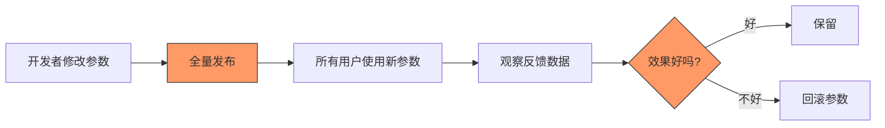

# YK-09-53: 知识库检索 A/B 测试框架 — 多策略并行对比与统计分析

> 需求编号：YK-09-53 · 优先级：P2 · 人天：1.0d · 状态：需求已编写
> 依赖：YK-09-07（知识检索反馈闭环）、YK-09-40（特性开关）

---

## 一、背景

### 1.1 问题描述

检索质量优化（alpha 调优、同义词扩展、多语言 Embedding、结果去重等）依赖"改参数→观察反馈→再改"的手动循环。问题：

1. **无对照实验**：无法回答"新策略比旧策略好多少？"——缺乏 A/B 对照组。
2. **决策主观**：参数调优依赖开发者的直觉和手动分析，而非统计显著性。
3. **全量发布风险**：参数变更直接全量发布，一旦效果不好影响所有用户。

### 1.2 影响量化

| 影响维度 | 量化 | 说明 |
|----------|------|------|
| 优化决策周期 | 1-2 周/轮 | 改参数 → 观察 → 判断 |
| 优化效果不确定 | 无统计显著性验证 | 可能是随机波动 |
| 全量发布风险 | 100% 用户受影响 | 无灰度机制 |

### 1.3 核心挑战

- **用户分组**：如何确保同一用户始终分配到同一变体（避免体验不一致）。
- **统计显著性**：需要多少样本才能得出可靠结论。
- **实验生命周期**：实验从创建到全量发布的标准流程。

---

## 二、现状分析

### 2.1 当前数据流



### 2.2 根因分析矩阵

| 根因 | 类别 | 影响 | 优先级 |
|------|------|------|--------|
| 无 A/B 对照实验 | 功能缺失 | 无法量化优化效果 | P0 |
| 无统计显著性验证 | 功能缺失 | 决策依赖直觉 | P0 |
| 无灰度发布机制 | 功能缺失 | 全量发布风险 | P1 |
| 无实验生命周期管理 | 流程缺失 | 实验混乱 | P1 |

### 2.3 现有资产

- YK-09-07 已收集检索反馈数据（点赞/点踩/点击/引用）。
- YK-09-40 特性开关已实现参数动态切换。
- `scipy.stats` 可用于统计检验。

---

## 三、设计决策

### D-01：用户分组策略

| 方案 | 描述 | 优点 | 缺点 | 决策 |
|------|------|------|------|------|
| A: 随机分配 | 每次请求随机分配变体 | 简单 | 同一用户可能切换变体 | 否决 |
| B: 哈希分桶 | 基于 user_id 哈希确定分配 | 确定性，用户稳定 | 需 user_id | **采用** |
| C: Session 级 | 基于 session 分配 | 灵活 | session 过期后可能切换 | 补充方案 |

**决策**：方案 B——基于 `hash(experiment_id + user_id) % 100` 确定性分配到变体。

### D-02：统计检验方法

| 方案 | 描述 | 优点 | 缺点 | 决策 |
|------|------|------|------|------|
| A: Chi-square | 检验点击率/满意率差异 | 标准，广泛使用 | 需足够样本量 | **采用** |
| B: T-test | 检验平均分数差异 | 适合连续指标 | 假设正态分布 | 补充方案 |
| C: Bayesian | 贝叶斯 A/B 测试 | 可提前停止 | 实现复杂 | 远期方案 |

**决策**：Chi-square 为主（点击率/满意率），t-test 补充（平均分数）。

### D-03：最小样本量

| 指标 | 最小样本量 | 说明 |
|------|-----------|------|
| 满意率差异 5% | ~1000/变体 | alpha=0.05, power=0.80 |
| 点击率差异 5% | ~1000/变体 | alpha=0.05, power=0.80 |
| 保守估算 | 1500/变体 | 安全边际 |

**决策**：最小样本量 1000/变体，持续运行至少 7 天。

---

## 四、目标架构

### 4.1 目标数据流

```mermaid
graph TB
    A[创建实验: 定义变体 + 流量分配] --> B[实验状态: draft]
    B --> C[启动实验: running]
    C --> D[用户请求检索]
    D --> E[hash(user_id + experiment_id) → 分配变体]
    E --> F[变体 A: 控制组]
    E --> G[变体 B: 实验组]
    
    F --> H[执行检索]
    G --> H
    
    H --> I[收集反馈: 变体标签]
    I --> J[rag_feedback 集合]
    
    K[定时分析: 每日] --> L{样本量 ≥ 1000?}
    L -->|是| M[统计显著性检验]
    L -->|否| N[继续收集数据]
    
    M --> O{显著?}
    O -->|是| P[推荐优胜变体]
    O -->|否| Q[继续实验]
    
    P --> R[人工确认全量发布]
    R --> S[实验状态: rolled_out]
    
    style E fill:#9f9,stroke:#333
    style M fill:#9f9,stroke:#333
    style R fill:#9f9,stroke:#333
```

### 4.2 核心指标

| 指标 | 当前值 | 目标值 | 测量方式 |
|------|--------|--------|----------|
| 实验创建到结论时间 | 无 | 7-14 天 | 从 running 到 completed 的天数 |
| 统计显著性验证 | 无 | 100% | 所有实验在发布前完成显著性检验 |
| 全量发布风险 | 100% | 50%（灰度） | 灰度发布比例 |

### 4.3 架构权衡

| 权衡 | 选择 | 理由 |
|------|------|------|
| 速度 vs 可靠性 | 可靠性优先 | 错误的优化比不优化更差 |
| 自动化 vs 人工 | 自动分析 + 人工确认 | 统计能发现差异，但业务判断需人工 |
| 简单 vs 灵活 | 简单优先 | 初期支持 2-3 变体，50/50 分流 |

---

## 五、具体改动

### 5.1 核心代码

```python
# YiAi/src/domain/rag/ab_testing.py

from enum import Enum
from datetime import datetime
import hashlib
from scipy import stats

class ExperimentStatus(str, Enum):
    DRAFT = 'draft'
    RUNNING = 'running'
    COMPLETED = 'completed'
    ROLLED_OUT = 'rolled_out'
    STOPPED = 'stopped'

class ABTestEngine:
    """检索策略 A/B 测试引擎。"""

    MIN_SAMPLE_SIZE = 1000  # 最小样本量/变体
    MIN_DURATION_DAYS = 7   # 最小运行天数

    def __init__(self, db):
        self.db = db

    async def create_experiment(self, name: str, variants: list[dict],
                                traffic_split: list[float] = None,
                                metrics: list[str] = None) -> str:
        """创建新实验。"""
        if traffic_split is None:
            traffic_split = [1.0 / len(variants)] * len(variants)

        experiment = {
            'name': name,
            'variants': variants,
            'traffic_split': traffic_split,
            'metrics': metrics or ['satisfaction_rate', 'click_through_rate'],
            'status': ExperimentStatus.DRAFT,
            'min_sample_size': self.MIN_SAMPLE_SIZE,
            'min_duration_days': self.MIN_DURATION_DAYS,
            'created_at': datetime.utcnow(),
            'started_at': None,
            'completed_at': None,
        }

        result = await self.db.ab_experiments.insert_one(experiment)
        return str(result.inserted_id)

    def assign_variant(self, user_id: str, experiment_id: str,
                       experiment: dict) -> tuple[int, dict]:
        """确定性地将用户分配到变体。"""
        hash_input = f"{experiment_id}:{user_id}"
        hash_val = int(hashlib.md5(hash_input.encode()).hexdigest()[:8], 16)
        bucket = (hash_val % 100) / 100  # 0.0-0.99

        cumulative = 0
        for i, split in enumerate(experiment['traffic_split']):
            cumulative += split
            if bucket < cumulative:
                return i, experiment['variants'][i]

        return 0, experiment['variants'][0]

    async def start_experiment(self, experiment_id: str):
        """启动实验。"""
        await self.db.ab_experiments.update_one(
            {'_id': experiment_id},
            {'$set': {
                'status': ExperimentStatus.RUNNING,
                'started_at': datetime.utcnow(),
            }}
        )

    async def analyze_results(self, experiment_id: str) -> dict:
        """统计分析——判断哪一变体显著更优。"""
        experiment = await self.db.ab_experiments.find_one({'_id': experiment_id})
        if not experiment:
            return {'error': '实验不存在'}

        results = {}
        for i, variant in enumerate(experiment['variants']):
            feedback = await self.db.rag_feedback.find({
                'experiment_id': experiment_id,
                'variant_index': i,
            }).to_list(None)

            total = len(feedback)
            likes = sum(1 for f in feedback if f.get('feedback_type') == 'explicit_like')
            dislikes = sum(1 for f in feedback if f.get('feedback_type') == 'explicit_dislike')
            clicks = sum(1 for f in feedback if f.get('feedback_type') == 'click_through')

            results[variant['name']] = {
                'sample_size': total,
                'likes': likes,
                'dislikes': dislikes,
                'satisfaction_rate': likes / max(likes + dislikes, 1),
                'click_through_rate': clicks / max(total, 1),
            }

        # 检查样本量
        sufficient = all(
            r['sample_size'] >= self.MIN_SAMPLE_SIZE
            for r in results.values()
        )

        # 统计显著性检验
        winner = None
        p_value = None
        if sufficient and len(results) == 2:
            names = list(results.keys())
            a, b = results[names[0]], results[names[1]]

            # Chi-square for satisfaction rate
            likes_a, dislikes_a = a['likes'], a['dislikes']
            likes_b, dislikes_b = b['likes'], b['dislikes']

            if likes_a + dislikes_a > 0 and likes_b + dislikes_b > 0:
                contingency = [[likes_a, dislikes_a], [likes_b, dislikes_b]]
                chi2, p_value, _, _ = stats.chi2_contingency(contingency)

                if p_value < 0.05:
                    winner = names[0] if a['satisfaction_rate'] > b['satisfaction_rate'] else names[1]

        return {
            'experiment_id': experiment_id,
            'results': results,
            'sufficient_sample': sufficient,
            'winner': winner,
            'p_value': round(p_value, 4) if p_value else None,
            'significant': p_value is not None and p_value < 0.05,
            'recommendation': (
                f'推荐全量发布变体 "{winner}"' if winner
                else '样本量不足或差异不显著，继续收集数据'
            ),
        }

    async def complete_experiment(self, experiment_id: str, winner_variant: str):
        """完成实验——全量发布优胜变体。"""
        await self.db.ab_experiments.update_one(
            {'_id': experiment_id},
            {'$set': {
                'status': ExperimentStatus.ROLLED_OUT,
                'winner': winner_variant,
                'completed_at': datetime.utcnow(),
            }}
        )

    async def list_experiments(self, status: str = None) -> list[dict]:
        """列出所有实验。"""
        filter_query = {}
        if status:
            filter_query['status'] = status

        experiments = await self.db.ab_experiments.find(filter_query).to_list(None)
        return [{
            'id': str(e['_id']),
            'name': e['name'],
            'status': e['status'],
            'variants': [v['name'] for v in e['variants']],
            'created_at': e['created_at'].isoformat() if e.get('created_at') else None,
        } for e in experiments]
```

### 5.2 实验结果展示

```markdown
🧪 实验: Alpha 参数优化 (50/50 分流)

| 变体 | 样本 | 满意率 | 点击率 | 
|------|------|--------|--------|
| Control (α=0.70) | 1245 | 78.2% | 35.1% |
| Test (α=0.50) | 1238 | 82.4% | 38.7% |

📊 统计检验: Chi-square, p=0.032 (显著)
🏆 优胜: Test (α=0.50) — 满意率 +4.2%
📊 建议: 全量发布 Test 变体 (α=0.50)
```

### 5.3 文件变更清单

| 文件路径 | 操作 | 说明 |
|----------|------|------|
| `YiAi/src/domain/rag/ab_testing.py` | 新增 | A/B 测试引擎 |
| `YiAi/src/services/rag/rag_service.py` | 修改 | 检索时根据实验分配变体 |
| `YiAi/src/routers/rag_router.py` | 修改 | 新增 `/rag/experiments` CRUD 端点 |
| `YiVad/src/views/rag/ExperimentDashboard.vue` | 新增 | 实验管理仪表盘 |

---

## 六、实施步骤

| 步骤 | 内容 | 验证方法 | 人天 |
|------|------|------|------|
| 1 | 创建 `ab_experiments` 集合 | 验证集合创建 | 0.1 |
| 2 | 实现 `ABTestEngine` 核心类 | 单元测试：分配 + 分析 | 0.5 |
| 3 | 实现统计显著性检验（Chi-square） | 单元测试：模拟数据验证 | 0.3 |
| 4 | 集成到 RAG 检索流程 | 集成测试：变体分配 + 反馈收集 | 0.5 |
| 5 | 实现实验管理 API | 端到端：创建/启动/分析/完成 | 0.3 |
| 6 | 前端实验管理仪表盘 | 手动测试：实验创建到全量发布 | 1.0 |

**总计**：2.7 人天

---

## 七、性能分析

### 7.1 实验开销

| 操作 | 耗时 | 说明 |
|------|------|------|
| 用户分组（哈希） | ~0.1ms | MD5 哈希 |
| 变体配置读取 | ~1ms | MongoDB 查询（可缓存） |
| 反馈收集（额外字段） | ~0.5ms | experiment_id + variant_index |
| 统计分析 | ~50ms | 聚合查询 + Chi-square |

### 7.2 对检索延迟的影响

总增加 < 2ms，对检索延迟（200ms）影响 < 1%。

---

## 八、测试规格

### 8.1 单元测试

**测试用例 1：用户分组确定性**

```
GIVEN 同一 user_id 和 experiment_id
WHEN 调用 assign_variant 两次
THEN 返回相同的变体索引
```

**测试用例 2：流量分配准确性**

```
GIVEN 1000 个不同 user_id，50/50 分流
WHEN 分配变体
THEN 变体 A 分配比例 ≈ 50%（误差 < 5%）
AND 变体 B 分配比例 ≈ 50%
```

**测试用例 3：统计显著性**

```
GIVEN 变体 A 满意率 78%，变体 B 满意率 82%，各 1000 样本
WHEN 调用 analyze_results
THEN significant = True
AND p_value < 0.05
```

**测试用例 4：样本不足**

```
GIVEN 每个变体仅 100 个样本
WHEN 调用 analyze_results
THEN sufficient_sample = False
AND 不进行显著性检验
```

### 8.2 集成测试

**测试用例 5：端到端实验流程**

```
GIVEN 创建一个实验（2 个变体，50/50）
WHEN 启动实验 → 用户检索 → 收集反馈 → 分析结果
THEN 实验状态从 draft → running → completed → rolled_out
AND 优胜变体被正确识别
```

---

## 九、风险与缓解

### 9.1 风险矩阵

| 风险 | 概率 | 影响 | 缓解措施 |
|------|------|------|----------|
| 小样本过早宣布胜出 | 中 | 高——错误决策 | 最小样本量 1000 + 最短 7 天 |
| 变体切换时用户体验不一致 | 低 | 中 | 确定性哈希分组，用户始终在同一变体 |
| 多个实验互相干扰 | 中 | 中 | 同一时间最多 1 个活跃实验 |

---

## 十、回滚策略

| 场景 | 回滚操作 | 影响范围 |
|------|----------|----------|
| 实验导致检索质量下降 | 立即停止实验，恢复控制组参数 | 实验组用户 |
| 统计分析错误 | 重新分析，手动验证数据 | 实验结论 |
| 实验管理系统故障 | 禁用实验机制，所有用户使用默认参数 | 无 A/B 分流 |

---

## 十一、设计决策记录

### D-01：确定性哈希分组

**背景**：需要确保同一用户始终在同一变体。
**决策**：基于 `MD5(experiment_id + user_id) % 100` 确定性分配。
**后果**：用户不会因实验切换变体，体验一致。

### D-02：Chi-square 检验

**背景**：需要统计显著性验证。
**决策**：Chi-square 检验满意率/点击率差异，p < 0.05 视为显著。
**后果**：需要足够样本量（1000+/变体），小流量实验不适用。

### D-03：实验生命周期

**背景**：需要标准化的实验管理流程。
**决策**：draft → running → completed → rolled_out，最小 7 天 + 1000 样本。
**后果**：实验周期较长，但结论可靠。

---

## 十二、可观测性

### 12.1 指标

| 指标名称 | 类型 | 说明 |
|----------|------|------|
| `ab_active_experiments` | Gauge | 活跃实验数 |
| `ab_variant_distribution` | Gauge | 各变体用户分布 |
| `ab_significance_tests` | Counter | 显著性检验次数 |
| `ab_winners_rolled_out` | Counter | 优胜变体全量发布次数 |

### 12.2 日志

```python
logger.info(f"[ABTest] 创建实验: {name}, 变体: {variants}")
logger.info(f"[ABTest] 分配变体: user={user_id}, experiment={experiment_id}, variant={variant_index}")
logger.info(f"[ABTest] 分析结果: {experiment_id}, winner={winner}, p={p_value}")
```

---

## 十三、安全合规

| 要求 | 实现方式 |
|------|----------|
| 用户分组不暴露个人信息 | 使用 MD5 哈希，不可逆 |
| 实验数据隔离 | 每个实验独立的 experiment_id |
| 实验审计 | 实验状态变更记录到日志 |

---

## 十四、代码审查检查清单

- [ ] A/B 测试框架用于检索策略对比（alpha 值/排序算法/Embedding 模型）
- [ ] 用户分组基于确定性哈希（`MD5(experiment_id + user_id) % 100`）
- [ ] 统计显著性检测（Chi-square, p < 0.05）
- [ ] 最小样本量 1000/变体 + 最短运行 7 天
- [ ] 实验生命周期：draft → running → completed → rolled_out
- [ ] 同一时间最多 1 个活跃实验（避免互相干扰）
- [ ] 胜出变体需人工确认后全量发布
- [ ] 实验不影响反馈数据收集（额外的 experiment_id 字段）
- [ ] 前端实验管理仪表盘（创建/启动/分析/完成）
- [ ] 实验暂停/停止支持（紧急回滚）

---

*PRD 来源: `projects/yiknowledge/requirements/2026-09/53-需求-AB测试框架.md`*