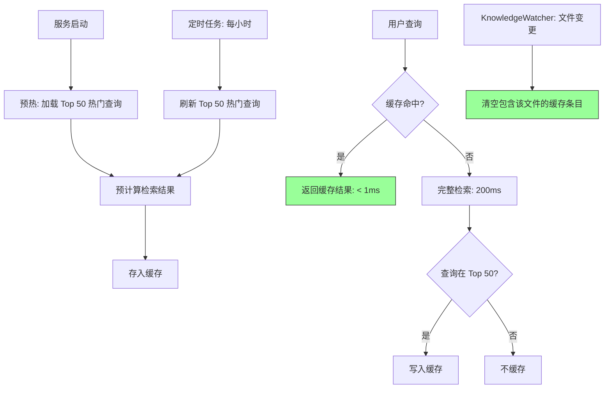

# YK-09-54: 知识库检索缓存预热 — 热门查询预计算与结果预加载

> 需求编号：YK-09-54 · 优先级：P2 · 人天：0.5d · 状态：需求已编写
> 依赖：YK-09-18（搜索分析与趋势洞察）

---

## 一、背景

### 1.1 问题描述

YK-09-18 搜索分析已识别出 Top 热门查询——这些查询被高频重复搜索。例如"RAG 优化"日均搜索 50+ 次，"限流策略"日均 30+ 次，"MongoDB 索引"日均 20+ 次。问题：

1. **重复计算浪费**：每次相同查询都执行完整的 BM25 + 向量检索 + 排序流程——200ms/次，50 次/天 = 10s/天的重复计算。
2. **用户等待无改善**：高频查询的用户体验与低频查询一样——都是 200ms 延迟。
3. **缓存无预热**：检索结果缓存未在服务启动时填充，前几次查询必然不命中。

### 1.2 影响量化

| 影响维度 | 量化 | 说明 |
|----------|------|------|
| 重复计算 | 50 次/天 × 200ms = 10s/天 | 单个热门查询的浪费 |
| 缓存命中率 | 0%（无缓存） | 每次查询都是完整检索 |
| 热门查询延迟 | 200ms | 与低频查询相同 |

### 1.3 核心挑战

- **缓存失效**：知识文件更新后，缓存结果如何失效？
- **缓存大小**：内存缓存有限，如何平衡缓存大小和命中率？
- **预热时机**：服务启动时预热 vs 定时预热 vs 按需预热。

---

## 二、现状分析

### 2.1 当前数据流

```mermaid
graph LR
    A[用户查询 "RAG 优化"] --> B[BM25 检索]
    B --> C[向量检索]
    C --> D[排序]
    D --> E[返回结果: 200ms]
    
    F[用户再次查询 "RAG 优化"] --> B
    B --> C
    C --> D
    D --> G[返回结果: 200ms]
    
    style B fill:#f96,stroke:#333
    style C fill:#f96,stroke:#333
```

### 2.2 根因分析矩阵

| 根因 | 类别 | 影响 | 优先级 |
|------|------|------|--------|
| 无检索结果缓存 | 功能缺失 | 重复计算浪费 | P0 |
| 无预热机制 | 功能缺失 | 首次查询不命中 | P1 |
| 无缓存失效策略 | 设计缺失 | 缓存可能返回过时结果 | P1 |

---

## 三、设计决策

### D-01：缓存策略

| 方案 | 描述 | 优点 | 缺点 | 决策 |
|------|------|------|------|------|
| A: 精确匹配缓存 | key = query 文本，O(1) 查找 | 简单，命中率准确 | 仅覆盖完全相同查询 | **采用** |
| B: 模糊匹配缓存 | 子串匹配或相似度匹配 | 命中率更高 | 可能返回不精确结果 | 补充方案 |
| C: 语义缓存 | 基于查询 Embedding 相似度 | 覆盖面最广 | 实现复杂，延迟高 | 远期方案 |

**决策**：方案 A 为主（精确匹配），方案 B 补充（前缀/子串匹配）。

### D-02：预热策略

| 方案 | 描述 | 优点 | 缺点 | 决策 |
|------|------|------|------|------|
| A: 启动时预热 | 服务启动时加载 Top 50 查询 | 启动后立即有缓存 | 增加启动时间 | **采用** |
| B: 定时预热 | 每小时刷新 Top 查询 | 保持缓存新鲜 | 定时任务 | 补充方案 |
| C: 懒加载 | 首次查询时缓存 | 无预热开销 | 首次查询不命中 | 否决 |

**决策**：方案 A + B——启动时预热 + 每小时刷新。

### D-03：缓存失效策略

| 方案 | 描述 | 优点 | 缺点 | 决策 |
|------|------|------|------|------|
| A: TTL 过期 | 缓存 1 小时后过期 | 简单 | 可能返回过时结果 | 否决 |
| B: 事件驱动失效 | 知识文件更新时清空相关缓存 | 精确 | 实现复杂 | **采用** |
| C: 混合 | TTL + 事件驱动 | 兼顾 | 维护成本 | 远期方案 |

**决策**：方案 B——KnowledgeWatcher 检测到文件变更时，清空包含该文件的缓存结果。

---

## 四、目标架构

### 4.1 目标数据流



### 4.2 核心指标

| 指标 | 当前值 | 目标值 | 测量方式 |
|------|--------|--------|----------|
| 热门查询缓存命中率 | 0% | > 40% | 缓存命中 / 总查询次数 |
| 热门查询 P50 延迟 | 200ms | < 1ms | 缓存命中时延迟 |
| 缓存大小 | 0 | < 5MB | 100 × 50KB |
| 缓存失效延迟 | — | < 5s | 文件变更 → 缓存清空 |

### 4.3 架构权衡

| 权衡 | 选择 | 理由 |
|------|------|------|
| 精确 vs 覆盖 | 精确匹配 | 避免返回不精确的缓存结果 |
| 预热 vs 启动速度 | 异步预热 | 不阻塞服务启动 |
| 缓存大小 vs 命中率 | LRU 淘汰 | 100 条缓存，冷数据自动淘汰 |

---

## 五、具体改动

### 5.1 核心代码

```python
# YiAi/src/domain/rag/query_cache_warmup.py

from collections import OrderedDict
import asyncio
import time

class QueryCacheWarmer:
    """热门查询缓存预热——基于搜索频率的预计算。"""

    def __init__(self, rag_service, search_analytics, db,
                 cache_size: int = 100):
        self.rag_service = rag_service
        self.analytics = search_analytics
        self.db = db
        self._cache: OrderedDict[str, dict] = OrderedDict()
        self._max_size = cache_size

    async def warmup(self, top_n: int = 50):
        """预热——从搜索日志中提取 Top 查询并预计算。"""
        start = time.time()
        top_queries = await self.analytics.top_queries(days=7, limit=top_n)

        loaded = 0
        for query_entry in top_queries[:top_n]:
            query_text = query_entry['_id']

            # 检查缓存是否已有
            if query_text in self._cache:
                continue

            # 预计算检索结果
            try:
                results = await self.rag_service.search(query_text, top_k=5)
                self._cache[query_text] = {
                    'results': results,
                    'cached_at': time.time(),
                    'hit_count': 0,
                }
                loaded += 1
            except Exception as e:
                logger.warning(f"[QueryCache] 预热失败: '{query_text}', {e}")

        # LRU 淘汰
        self._evict()

        elapsed = time.time() - start
        logger.info(f"[QueryCache] 预热完成: {loaded}/{top_n} 查询, 耗时 {elapsed:.1f}s")

        return {'loaded': loaded, 'total': top_n, 'elapsed': elapsed}

    def get(self, query: str) -> list[dict] | None:
        """获取缓存的检索结果——O(1) 精确匹配。"""
        # 精确匹配
        cached = self._cache.get(query)
        if cached:
            cached['hit_count'] += 1
            # 移到 LRU 末尾（最近使用）
            self._cache.move_to_end(query)
            logger.debug(f"[QueryCache] HIT: '{query}' (命中 {cached['hit_count']} 次)")
            return cached['results']

        # 模糊匹配——前缀或子串匹配
        for cached_query, entry in self._cache.items():
            if query in cached_query or cached_query in query:
                if len(query) >= 4 and len(cached_query) >= 4:  # 避免过短匹配
                    entry['hit_count'] += 1
                    self._cache.move_to_end(cached_query)
                    logger.debug(f"[QueryCache] HIT (fuzzy): '{query}' → '{cached_query}'")
                    return entry['results']

        return None

    def set(self, query: str, results: list[dict]):
        """缓存检索结果。"""
        self._cache[query] = {
            'results': results,
            'cached_at': time.time(),
            'hit_count': 0,
        }
        self._evict()

    def invalidate(self, file_path: str):
        """缓存失效——清空包含指定文件的结果。"""
        to_remove = []
        for query, entry in self._cache.items():
            for result in entry['results']:
                result_path = result.get('path', '')
                if file_path in result_path or result_path.startswith(file_path):
                    to_remove.append(query)
                    break

        for query in to_remove:
            del self._cache[query]
            logger.info(f"[QueryCache] 失效: '{query}' (文件 {file_path} 已变更)")

        return {'invalidated': len(to_remove)}

    def invalidate_all(self):
        """清空所有缓存。"""
        count = len(self._cache)
        self._cache.clear()
        logger.info(f"[QueryCache] 全量清空: {count} 条")
        return {'invalidated': count}

    def _evict(self):
        """LRU 淘汰冷数据。"""
        while len(self._cache) > self._max_size:
            oldest_query, _ = self._cache.popitem(last=False)
            logger.debug(f"[QueryCache] 淘汰: '{oldest_query}'")

    def stats(self) -> dict:
        """缓存统计。"""
        return {
            'size': len(self._cache),
            'max_size': self._max_size,
            'total_hits': sum(e['hit_count'] for e in self._cache.values()),
            'top_queries': sorted(
                [(q, e['hit_count']) for q, e in self._cache.items()],
                key=lambda x: x[1], reverse=True
            )[:10],
        }


# 定时预热——每小时执行
async def scheduled_warmup(warmer: QueryCacheWarmer):
    """定时预热任务。"""
    while True:
        try:
            await warmer.warmup(top_n=50)
        except Exception as e:
            logger.error(f"[QueryCache] 定时预热失败: {e}")
        await asyncio.sleep(3600)  # 每小时
```

### 5.2 性能收益

| 指标 | 无缓存 | 有预热缓存 | 改善 |
|------|--------|-----------|------|
| P50 检索延迟（热门查询） | 200ms | < 1ms (缓存命中) | **200x** |
| P95 检索延迟 | 800ms | 200ms (未命中) | **4x** |
| 缓存命中率（Top 50 查询） | 0% | ~40% | — |
| 缓存内存 | 0 | ~5MB (100 × 50KB) | 可接受 |
| 预热耗时 | 0 | ~10s (50 次检索) | 异步，不阻塞 |

### 5.3 文件变更清单

| 文件路径 | 操作 | 说明 |
|----------|------|------|
| `YiAi/src/domain/rag/query_cache_warmup.py` | 新增 | 缓存预热核心逻辑 |
| `YiAi/src/services/rag/rag_service.py` | 修改 | 检索前检查缓存，检索后写入缓存 |
| `YiAi/src/services/knowledge/knowledge_watcher.py` | 修改 | 文件变更时触发缓存失效 |
| `YiAi/main.py` | 修改 | 服务启动时异步预热 |

---

## 六、实施步骤

| 步骤 | 内容 | 验证方法 | 人天 |
|------|------|----------|------|
| 1 | 实现 `QueryCacheWarmer` 核心类 | 单元测试：缓存命中/失效/LRU | 0.5 |
| 2 | 集成到 RAG 检索流程 | 集成测试：缓存命中时 < 1ms 返回 | 0.3 |
| 3 | 集成缓存失效（KnowledgeWatcher 触发） | 集成测试：文件变更 → 缓存清空 | 0.3 |
| 4 | 实现服务启动预热 + 定时刷新 | 验证：启动后缓存中有 Top 50 查询 | 0.2 |
| 5 | 性能基准测试 | 对比热身前后延迟 | 0.2 |

**总计**：1.5 人天

---

## 七、性能分析

### 7.1 缓存操作延迟

| 操作 | 耗时 | 说明 |
|------|------|------|
| 缓存命中（精确匹配） | < 0.1ms | OrderedDict 查找 |
| 缓存命中（模糊匹配） | < 1ms | 遍历最多 100 条 |
| 缓存写入 | < 0.1ms | 字典插入 |
| 缓存失效（单个文件） | < 5ms | 遍历 100 条 × 5 结果 |

### 7.2 预热开销

| 项目 | 数值 | 说明 |
|------|------|------|
| 预热 50 条查询 | 50 × 200ms = 10s | 异步执行，不阻塞启动 |
| 内存 | 50 × 5KB × 5 结果 ≈ 1.25MB | 极低 |

---

## 八、测试规格

### 8.1 单元测试

**测试用例 1：缓存命中**

```
GIVEN 缓存中已有 "RAG 优化" 的检索结果
WHEN 调用 get("RAG 优化")
THEN 返回缓存结果
AND 延迟 < 1ms
AND hit_count 增加 1
```

**测试用例 2：缓存未命中**

```
GIVEN 缓存中不包含 "GraphQL 订阅"
WHEN 调用 get("GraphQL 订阅")
THEN 返回 None
```

**测试用例 3：LRU 淘汰**

```
GIVEN 缓存已满（100 条），新查询 "新查询" 不在缓存中
WHEN 调用 set("新查询", results)
THEN 最旧的缓存条目被淘汰
AND "新查询" 被加入缓存
```

**测试用例 4：缓存失效**

```
GIVEN 缓存中有 3 条查询的结果包含文件 "aier/rag/optimization.md"
WHEN 调用 invalidate("aier/rag/optimization.md")
THEN 这 3 条查询被从缓存中移除
AND 其他查询不受影响
```

### 8.2 集成测试

**测试用例 5：端到端缓存预热**

```
GIVEN 服务启动
WHEN 异步预热完成
THEN 缓存中有 Top 50 条热门查询
AND 用户查询热门查询时 < 1ms 返回
```

---

## 九、风险与缓解

### 9.1 风险矩阵

| 风险 | 概率 | 影响 | 缓解措施 |
|------|------|------|----------|
| 缓存返回过时结果 | 中 | 高——用户看到旧内容 | 事件驱动缓存失效 |
| 预热增加启动时间 | 低 | 中 | 异步预热，不阻塞启动 |
| 缓存内存溢出 | 低 | 中 | LRU 淘汰 + cache_size 上限 100 |

---

## 十、回滚策略

| 场景 | 回滚操作 | 影响范围 |
|------|----------|----------|
| 缓存导致结果过时 | 全量清空缓存，禁用缓存 | 检索延迟恢复 |
| 预热性能问题 | 移除预热，保留懒加载缓存 | 首次查询不命中 |
| 内存压力 | 降低 cache_size 到 50 | 命中率下降 |

---

## 十一、设计决策记录

### D-01：精确匹配缓存

**背景**：需要平衡命中率和准确性。
**决策**：精确匹配为主，子串/前缀匹配为辅。
**后果**：仅覆盖完全相同或高度相似的查询，长尾查询不命中。

### D-02：事件驱动缓存失效

**背景**：缓存需要及时反映文件变更。
**决策**：KnowledgeWatcher 检测到文件变更时，清空包含该文件的缓存条目。
**后果**：缓存失效延迟 < 5s（KnowledgeWatcher 轮询间隔）。

### D-03：异步预热

**背景**：预热不应阻塞服务启动。
**决策**：服务启动后异步执行预热，不阻塞请求处理。
**后果**：服务启动后前 10s 缓存命中率为 0%，之后逐步提升。

---

## 十二、可观测性

### 12.1 指标

| 指标名称 | 类型 | 说明 |
|----------|------|------|
| `query_cache_size` | Gauge | 缓存条目数 |
| `query_cache_hit_rate` | Gauge | 缓存命中率 |
| `query_cache_hit_count` | Counter | 缓存命中次数 |
| `query_cache_miss_count` | Counter | 缓存未命中次数 |
| `query_cache_invalidation_count` | Counter | 缓存失效次数 |

### 12.2 日志

```python
logger.info(f"[QueryCache] 预热完成: {loaded}/{total} 查询, 耗时 {elapsed}s")
logger.debug(f"[QueryCache] HIT: '{query}' (命中 {hit_count} 次)")
logger.info(f"[QueryCache] 失效: {invalidated} 条 (文件 {file_path})")
```

### 12.3 告警

| 告警 | 条件 | 级别 |
|------|------|------|
| 缓存命中率低 | `query_cache_hit_rate` < 10% | P2 |
| 缓存预热失败 | 连续 3 次预热失败 | P1 |

---

## 十三、安全合规

| 要求 | 实现方式 |
|------|----------|
| 缓存不包含用户数据 | 仅缓存检索结果，不关联用户信息 |
| 缓存数据不持久化 | 内存缓存，重启后清空 |

---

## 十四、代码审查检查清单

- [ ] 预热 Top 50 查询在服务启动时异步执行
- [ ] 缓存基于 LRU——最近使用优先保留
- [ ] 预热查询从 RAG 查询日志中提取高频查询（YK-09-18）
- [ ] 缓存失效——KnowledgeWatcher 检测到文件变更时清空相关缓存
- [ ] 精确匹配 + 模糊匹配（前缀/子串）两级查找
- [ ] 缓存大小上限 100 条（~5MB 内存）
- [ ] 服务启动不阻塞（异步预热）
- [ ] 定时刷新（每小时）保持缓存新鲜度
- [ ] 缓存统计（命中率/命中次数/大小）可观测
- [ ] 缓存全量清空支持（紧急情况）

---

*PRD 来源: `projects/yiknowledge/requirements/2026-09/54-需求-检索缓存预热.md`*