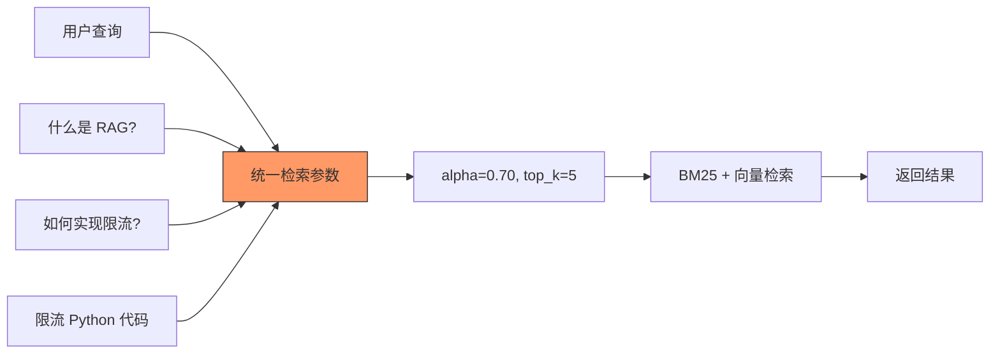
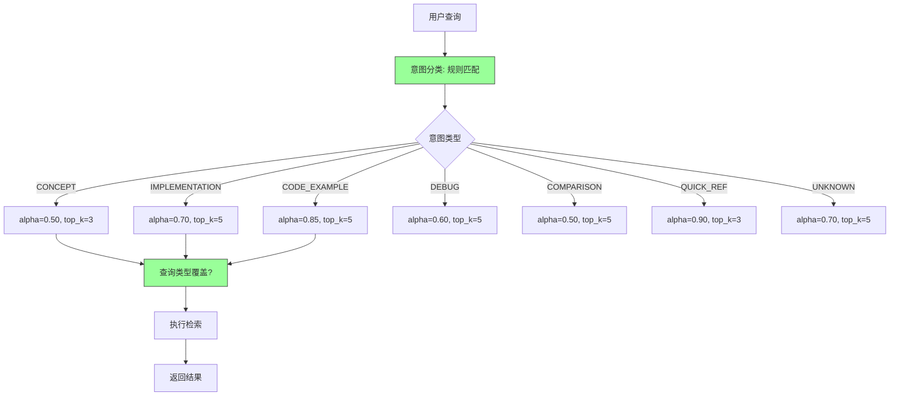

# YK-09-55: 知识库检索查询意图分类 — NLP 意图识别与策略路由

> 需求编号：YK-09-55 · 优先级：P2 · 人天：0.5d · 状态：需求已编写

---

## 一、背景

### 1.1 问题描述

不同意图的查询需要不同的检索策略。当前 RAG 检索对所有查询使用相同的参数（alpha=0.70, top_k=5），忽略了查询意图的差异：

1. **概念查询**："什么是 RAG？"——需要语义理解，偏向量检索（alpha 低）。
2. **实现查询**："如何实现限流？"——需要精确匹配代码和配置，偏 BM25（alpha 高）。
3. **代码示例查询**："限流 Python 示例"——需要包含代码块的文档，偏 BM25 + 代码优先。
4. **故障排查**："RAG 返回空结果原因"——需要标签匹配（debug/故障排查），偏标签优先。
5. **对比查询**："BM25 vs 向量检索"——需要同时包含两个概念的文档，偏语义 + 多样化。

### 1.2 影响量化

| 影响维度 | 量化 | 说明 |
|----------|------|------|
| 检索满意度 | 约 75%（统一参数） | 意图相关参数可能提升 5-10% |
| 检索结果相关性 | 不同意图差异大 | 代码查询用高 alpha 更好 |

### 1.3 核心挑战

- **意图识别精度**：如何准确区分"如何实现"（实现）和"什么是"（概念）。
- **混合意图**：查询可能同时包含代码和概念意图（如"RAG 代码实现原理"）。
- **分类器轻量**：不能使用 LLM 做意图分类（增加延迟），需纯规则/关键词。

---

## 二、现状分析

### 2.1 当前数据流



### 2.2 根因分析矩阵

| 根因 | 类别 | 影响 | 优先级 |
|------|------|------|--------|
| 无查询意图分类 | 功能缺失 | 检索参数非最优 | P0 |
| 统一检索参数 | 设计缺陷 | 不同意图使用相同参数 | P0 |
| 无策略路由 | 功能缺失 | 无法根据意图调整策略 | P1 |

---

## 三、设计决策

### D-01：意图分类器——规则 vs LLM

| 方案 | 描述 | 优点 | 缺点 | 决策 |
|------|------|------|------|------|
| A: 规则匹配 | 关键词 + 正则模式 | 快速（< 1ms），零成本 | 覆盖面有限 | **采用** |
| B: LLM 分类 | 让 LLM 判断意图 | 精度高，灵活 | 延迟高（+200ms），成本 | 否决 |
| C: 混合 | 规则为主 + LLM 补充 | 兼顾 | 实现复杂 | 远期方案 |

**决策**：方案 A——纯规则/关键词匹配，< 1ms 延迟，零 LLM 成本。

### D-02：意图类别

| 意图 | 关键词模式 | 策略 |
|------|-----------|------|
| CONCEPT | 什么/什么是/含义/概念/定义 | alpha=0.50, top_k=3, 标签优先 |
| IMPLEMENTATION | 如何/怎么/实现/搭建/构建/配置 | alpha=0.70, top_k=5, 代码优先 |
| CODE_EXAMPLE | 代码/示例/example/demo/用法 | alpha=0.85, top_k=5, 代码优先 |
| DEBUG | 错误/报错/失败/问题/原因/为什么 | alpha=0.60, top_k=5, 标签优先 |
| COMPARISON | 比较/区别/对比/vs/哪个更好 | alpha=0.50, top_k=5, 多样化 |
| QUICK_REF | 参数/配置/选项/api/命令 | alpha=0.90, top_k=3, 精确匹配 |

### D-03：策略路由优先级

| 优先级 | 来源 | 覆盖策略 |
|--------|------|----------|
| 1 | 意图分类 | 基础 alpha, top_k, boost 策略 |
| 2 | 查询类型（YK-09-14） | 可覆盖 alpha（短/长/代码查询） |
| 3 | 用户难度过滤 | 可覆盖 role_filter |
| 4 | 默认参数 | 兜底策略 |

---

## 四、目标架构

### 4.1 目标数据流



### 4.2 核心指标

| 指标 | 当前值 | 目标值 | 测量方式 |
|------|--------|--------|----------|
| 意图分类准确率 | 无 | > 85% | 人工标注 100 条查询对比 |
| 意图分类延迟 | 0ms | < 1ms | 规则匹配耗时 |
| 检索满意度提升 | 基线 | +5-10% | A/B 测试对比 |

### 4.3 架构权衡

| 权衡 | 选择 | 理由 |
|------|------|------|
| 精度 vs 速度 | 速度优先 | 分类器在检索关键路径上，不能增加延迟 |
| 覆盖 vs 准确 | 准确优先 | 未知意图降级为默认策略，比误分类好 |
| 规则 vs 学习 | 规则优先 | 初期规则覆盖 80% 场景，后续可引入 ML |

---

## 五、具体改动

### 5.1 核心代码

```python
# YiAi/src/domain/rag/intent_classifier.py

from enum import Enum
import re

class QueryIntent(str, Enum):
    CONCEPT = 'concept'          # 概念理解
    IMPLEMENTATION = 'impl'      # 实现导向
    CODE_EXAMPLE = 'code'        # 代码示例
    DEBUG = 'debug'              # 故障排查
    COMPARISON = 'comparison'    # 对比分析
    QUICK_REF = 'quick_ref'      # 快速参考
    UNKNOWN = 'unknown'          # 未知意图

class IntentClassifier:
    """查询意图分类——基于规则 + 特征匹配。"""

    INTENT_PATTERNS = {
        QueryIntent.CONCEPT: [
            r'(什么|什么是|是什么|含义|概念|定义|overview|what\s+is|explain)',
            r'(介绍|简述|概述|了解|认识)',
        ],
        QueryIntent.IMPLEMENTATION: [
            r'(如何|怎么|怎样|实现|搭建|构建|配置|部署|开发)',
            r'(how\s+to|implement|setup|configure|build|create)',
            r'(步骤|流程|方法|方案|实践|指南|教程)',
        ],
        QueryIntent.CODE_EXAMPLE: [
            r'(代码|示例|example|demo|snippet|usage|用法)',
            r'(怎么写|怎么用|调用|接口)',
            r'(\.py|\.js|\.ts|\.go|\.java|\.rs)',
        ],
        QueryIntent.DEBUG: [
            r'(错误|报错|失败|问题|为什么|原因|异常)',
            r'(error|fail|bug|debug|issue|problem|troubleshoot)',
            r'(不工作|不行|无效|没用|出错)',
        ],
        QueryIntent.COMPARISON: [
            r'(比较|区别|对比|差异|vs\.?|versus)',
            r'(哪个.*好|哪个.*适合|选择|选型)',
            r'(comparison|difference|vs\s|versus|better)',
            r'(还是|或者|优劣|优缺点|pros?\s*and\s*cons?)',
        ],
        QueryIntent.QUICK_REF: [
            r'(参数|配置|选项|api|命令|command|参数列表)',
            r'(参数.*表|配置.*项|选项.*列表)',
            r'(怎么配|参数.*多少|默认.*值)',
        ],
    }

    INTENT_STRATEGY = {
        QueryIntent.CONCEPT: {
            'alpha': 0.50, 'top_k': 3, 'boost_tags': True,
            'boost_code': False, 'description': '概念查询——偏语义理解',
        },
        QueryIntent.IMPLEMENTATION: {
            'alpha': 0.70, 'top_k': 5, 'boost_tags': False,
            'boost_code': True, 'description': '实现查询——均衡匹配',
        },
        QueryIntent.CODE_EXAMPLE: {
            'alpha': 0.85, 'top_k': 5, 'boost_tags': False,
            'boost_code': True, 'description': '代码查询——偏精确匹配',
        },
        QueryIntent.DEBUG: {
            'alpha': 0.60, 'top_k': 5, 'boost_tags': True,
            'boost_code': False, 'description': '故障排查——偏语义+标签',
        },
        QueryIntent.COMPARISON: {
            'alpha': 0.50, 'top_k': 5, 'boost_tags': True,
            'boost_code': False, 'description': '对比分析——偏语义+多样化',
        },
        QueryIntent.QUICK_REF: {
            'alpha': 0.90, 'top_k': 3, 'boost_tags': False,
            'boost_code': False, 'description': '快速参考——偏精确匹配',
        },
        QueryIntent.UNKNOWN: {
            'alpha': 0.70, 'top_k': 5, 'boost_tags': False,
            'boost_code': False, 'description': '未知意图——默认策略',
        },
    }

    def classify(self, query: str) -> QueryIntent:
        """分类查询意图——返回最佳匹配。"""
        scores = {}

        for intent, patterns in self.INTENT_PATTERNS.items():
            score = 0
            for pattern in patterns:
                matches = re.findall(pattern, query, re.IGNORECASE)
                score += len(matches)
            if score > 0:
                scores[intent] = score

        if not scores:
            return QueryIntent.UNKNOWN

        return max(scores, key=scores.get)

    def get_strategy(self, query: str, alpha_override: float = None) -> dict:
        """获取检索策略——意图 + 查询类型双重路由。"""
        intent = self.classify(query)
        strategy = self.INTENT_STRATEGY[intent].copy()

        # 查询类型（YK-09-14）可覆盖 alpha
        if alpha_override is not None and alpha_override != 0.70:
            strategy['alpha'] = alpha_override

        strategy['intent'] = intent.value
        return strategy

    def classify_with_confidence(self, query: str) -> dict:
        """分类并返回置信度。"""
        scores = {}

        for intent, patterns in self.INTENT_PATTERNS.items():
            score = 0
            for pattern in patterns:
                matches = re.findall(pattern, query, re.IGNORECASE)
                score += len(matches)
            if score > 0:
                scores[intent] = score

        if not scores:
            return {'intent': QueryIntent.UNKNOWN, 'confidence': 0.0}

        total = sum(scores.values())
        best_intent = max(scores, key=scores.get)
        confidence = scores[best_intent] / total

        return {
            'intent': best_intent,
            'confidence': round(confidence, 3),
            'all_scores': {k.value: v for k, v in scores.items()},
        }
```

### 5.2 意图路由效果

| 查询 | 意图 | Alpha | Top-K | 策略 |
|------|------|-------|-------|------|
| "什么是 RAG" | concept | 0.50 | 3 | 偏语义 + 标签优先 |
| "如何实现限流" | impl | 0.70 | 5 | 均衡 + 代码优先 |
| "限流 Python 示例" | code | 0.85 | 5 | 偏 BM25 + 代码优先 |
| "RAG 返回空结果原因" | debug | 0.60 | 5 | 偏语义 + 标签优先 |
| "BM25 vs 向量检索" | comparison | 0.50 | 5 | 偏语义 + 多样化 |
| "MongoDB 连接池参数" | quick_ref | 0.90 | 3 | 偏 BM25 + 精确匹配 |

### 5.3 文件变更清单

| 文件路径 | 操作 | 说明 |
|----------|------|------|
| `YiAi/src/domain/rag/intent_classifier.py` | 新增 | 意图分类核心逻辑 |
| `YiAi/src/services/rag/rag_service.py` | 修改 | 检索前调用意图分类，路由策略 |
| `YiAi/tests/domain/rag/test_intent_classifier.py` | 新增 | 意图分类单元测试 |

---

## 六、实施步骤

| 步骤 | 内容 | 验证方法 | 人天 |
|------|------|----------|------|
| 1 | 实现 `IntentClassifier` 核心类 | 单元测试：6 种意图分类 | 0.3 |
| 2 | 定义 6 种意图的检索策略 | 单元测试：策略参数正确 | 0.2 |
| 3 | 集成到 RAG 检索流程 | 集成测试：意图路由到不同参数 | 0.3 |
| 4 | 人工标注 100 条查询，评估准确率 | 准确率 > 85% | 0.3 |
| 5 | A/B 测试对比意图路由效果 | YK-09-53 实验对比 | 0.5 |

**总计**：1.6 人天

---

## 七、性能分析

### 7.1 分类延迟

| 操作 | 耗时 | 说明 |
|------|------|------|
| 6 种意图 × 2-3 个正则 | < 0.5ms | 正则匹配 |
| 策略选择 | < 0.1ms | 字典查找 |
| 总延迟 | < 0.6ms | 对检索延迟影响 < 0.3% |

### 7.2 内存

| 项目 | 大小 | 说明 |
|------|------|------|
| 正则模式编译 | ~2KB | 预编译正则 |
| 策略字典 | ~1KB | 6 种意图 |

---

## 八、测试规格

### 8.1 单元测试

**测试用例 1：概念查询**

```
GIVEN 查询 "什么是 RAG 混合检索"
WHEN 调用 classify(query)
THEN 返回 QueryIntent.CONCEPT
AND get_strategy() 返回 alpha=0.50, top_k=3
```

**测试用例 2：实现查询**

```
GIVEN 查询 "如何实现分布式限流"
WHEN 调用 classify(query)
THEN 返回 QueryIntent.IMPLEMENTATION
AND get_strategy() 返回 alpha=0.70, top_k=5
```

**测试用例 3：代码查询**

```
GIVEN 查询 "限流 Python 代码示例"
WHEN 调用 classify(query)
THEN 返回 QueryIntent.CODE_EXAMPLE
AND get_strategy() 返回 alpha=0.85, boost_code=True
```

**测试用例 4：对比查询**

```
GIVEN 查询 "BM25 和向量检索哪个更好"
WHEN 调用 classify(query)
THEN 返回 QueryIntent.COMPARISON
```

**测试用例 5：未知意图**

```
GIVEN 查询 "RAG"
WHEN 调用 classify(query)
THEN 返回 QueryIntent.UNKNOWN
AND get_strategy() 返回默认策略 alpha=0.70
```

**测试用例 6：置信度**

```
GIVEN 查询 "如何实现 Redis 限流"
WHEN 调用 classify_with_confidence(query)
THEN intent = QueryIntent.IMPLEMENTATION
AND confidence > 0.5
AND all_scores 包含 impl 和 code 的分数
```

### 8.2 集成测试

**测试用例 7：端到端意图路由**

```
GIVEN 用户查询 "如何实现限流"
WHEN 检索流程执行
THEN 意图分类为 IMPLEMENTATION
AND 检索使用 alpha=0.70, top_k=5, boost_code=True
AND 返回结果偏代码实现
```

---

## 九、风险与缓解

### 9.1 风险矩阵

| 风险 | 概率 | 影响 | 缓解措施 |
|------|------|------|----------|
| 混合意图被错误分类 | 中 | 中——检索参数非最优 | 置信度低时降级为默认策略 |
| 新领域查询分类器不识别 | 高 | 低——未知意图降级 | 默认策略兜底 |
| 正则模式覆盖不全 | 中 | 低——部分查询分类错误 | 持续扩展正则模式库 |

---

## 十、回滚策略

| 场景 | 回滚操作 | 影响范围 |
|------|----------|----------|
| 分类准确率低 | 禁用意图分类，所有查询使用默认策略 | 检索参数统一 |
| 分类延迟异常 | 降级为 UNKNOWN 意图 | 默认策略 |

---

## 十一、设计决策记录

### D-01：规则分类器

**背景**：需要在检索关键路径上进行意图分类，不能增加延迟。
**决策**：纯规则/正则匹配，6 种意图，< 1ms 延迟。
**后果**：覆盖面有限（~80%），但速度和成本最优。

### D-02：策略路由优先级

**背景**：意图分类和查询类型（YK-09-14）可能冲突。
**决策**：意图为基础策略，查询类型可覆盖 alpha 值。
**后果**：短代码查询（如"RAG Python"）被意图分类为 CODE_EXAMPLE（alpha=0.85），但查询类型可能覆盖为 0.50。

### D-03：6 种意图类别

**背景**：需要覆盖主要的查询意图。
**决策**：CONCEPT / IMPLEMENTATION / CODE_EXAMPLE / DEBUG / COMPARISON / QUICK_REF。
**后果**：类别间可能有重叠，但通过置信度判断最匹配的意图。

---

## 十二、可观测性

### 12.1 指标

| 指标名称 | 类型 | 说明 |
|----------|------|------|
| `intent_distribution` | Counter | 各意图的查询分布 |
| `intent_unknown_rate` | Gauge | 未知意图比例 |
| `intent_classification_latency_us` | Histogram | 分类延迟（微秒） |

### 12.2 日志

```python
logger.debug(f"[IntentClassifier] 查询 '{query}' → 意图 {intent.value} (置信度 {confidence})")
logger.info(f"[IntentClassifier] 策略路由: {intent.value} → alpha={alpha}, top_k={top_k}")
```

---

## 十三、安全合规

| 要求 | 实现方式 |
|------|----------|
| 意图分类不存储用户数据 | 纯内存计算，不记录查询内容 |
| 分类逻辑透明 | 正则模式可审计，非黑盒模型 |

---

## 十四、代码审查检查清单

- [ ] 意图分类：concept/impl/code/debug/comparison/quick_ref 六类
- [ ] 分类基于查询特征（关键词 + 正则模式）
- [ ] 不同意图对应不同的 alpha 值、top_k 和 boost 策略
- [ ] 分类器轻量——纯规则 + 关键词（非 LLM）
- [ ] 未知意图降级为默认策略（alpha=0.70, top_k=5）
- [ ] 意图分类 + 查询类型（YK-09-14）双重路由
- [ ] 意图分类延迟 < 1ms
- [ ] 置信度低的分类降级为 UNKNOWN
- [ ] 正则模式可扩展（通过配置文件）
- [ ] 人工标注 100 条查询，准确率 > 85%

---

*PRD 来源: `projects/yiknowledge/requirements/2026-09/55-需求-查询意图分类.md`*