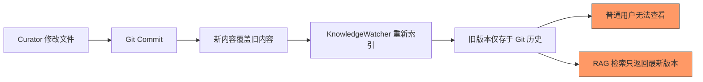
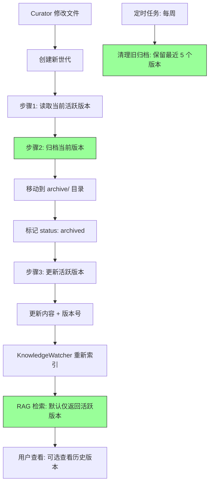

# YK-09-56: 知识库内容世代管理 — 版本化文档的渐进式更新与历史归档

> 需求编号：YK-09-56 · 优先级：P2 · 人天：0.5d · 状态：需求已编写
> 依赖：YK-09-48（语义版本化追踪）、YK-09-06（知识生命周期自动化）

---

## 一、背景

### 1.1 问题描述

知识文件随时间演进而非替换——但当前 YiKnowledge 的文件更新方式是以新内容覆盖旧内容。问题：

1. **历史版本丢失**：curator 修改文件后，旧版本仅存在于 Git 历史中——普通用户无法查看。
2. **RAG 检索默认返回最新版本**：用户无法选择查看历史版本了解演进脉络。
3. **版本爆炸**：频繁修改的文件（如"RAG 混合检索优化"已修改 20+ 次）产生大量历史版本，如何管理？
4. **跨版本引用断裂**：旧版本中的内部链接指向已变更的文件路径。

### 1.2 影响量化

| 影响维度 | 量化 | 说明 |
|----------|------|------|
| 历史版本不可见 | 100% 用户只能看到最新版本 | Git 历史对普通用户不友好 |
| 知识演进不可追溯 | 无版本时光机 | 无法回答"这个方案经历了哪些迭代" |
| 无归档策略 | 旧版本散落在 Git 中 | 无结构化归档 |

### 1.3 核心挑战

- **归档 vs 活跃**：如何区分"活跃版本"（检索默认返回）和"归档版本"（可查看但不检索）。
- **存储膨胀**：频繁修改的文件产生大量历史版本，归档存储如何控制。
- **版本关联**：如何关联同一文件的不同世代——通过 `generation_of` 字段。

---

## 二、现状分析

### 2.1 当前数据流



### 2.2 根因分析矩阵

| 根因 | 类别 | 影响 | 优先级 |
|------|------|------|--------|
| 无版本归档机制 | 功能缺失 | 历史版本不可见 | P0 |
| 无活跃/归档区分 | 设计缺失 | 检索返回所有版本或仅最新 | P0 |
| 无版本生命周期 | 流程缺失 | 归档版本无限积累 | P1 |
| 无跨版本引用维护 | 功能缺失 | 旧版本链接断裂 | P1 |

### 2.3 现有资产

- YK-09-48 已实现语义版本号追踪（`frontmatter.version`）。
- YK-09-06 已实现知识生命周期状态管理（`frontmatter.status`）。
- Git 历史完整记录了文件的所有变更。
- `knowledge_files` 集合已存储文件的元数据。

---

## 三、设计决策

### D-01：世代管理模型

| 方案 | 描述 | 优点 | 缺点 | 决策 |
|------|------|------|------|------|
| A: 仅 Git 历史 | 版本历史完全依赖 Git | 简单，无额外存储 | 普通用户无法使用 | 否决 |
| B: 归档目录 + MongoDB | 旧版本移到 `archive/` 目录，标记 `status: archived` | 结构化，可检索 | 文件系统膨胀 | **采用** |
| C: 仅 MongoDB 归档 | 旧版本仅存储在 MongoDB | 不污染文件系统 | 与 Git 管理理念冲突 | 补充方案 |

**决策**：方案 B——归档版本移到 `archive/` 目录，保留文件系统可追溯性，同时标记 `status: archived`。

### D-02：检索策略

| 方案 | 描述 | 优点 | 缺点 | 决策 |
|------|------|------|------|------|
| A: 仅返回活跃版本 | 检索默认过滤 `status != 'archived'` | 简洁 | 用户无法查看历史 | **采用**（默认） |
| B: 返回所有版本 | 检索不过滤状态 | 信息完整 | 结果混乱 | 否决 |
| C: 可选查看历史 | 默认活跃，可切换查看历史 | 灵活 | 前端实现成本 | 远期方案 |

**决策**：方案 A——默认仅返回活跃版本，通过 `include_archived=true` 参数可选查看历史。

### D-03：归档保留策略

| 方案 | 描述 | 优点 | 缺点 | 决策 |
|------|------|------|------|------|
| A: 无限保留 | 所有历史版本永久保留 | 完整 | 存储膨胀 | 否决 |
| B: TTL 清理 | 归档版本 N 天后删除 | 控制存储 | 可能丢失重要历史 | 否决 |
| C: 保留最后 N 个版本 | 每个文件保留最近 5 个归档版本 | 平衡 | 更早版本丢失 | **采用** |

**决策**：方案 C——每个文件保留最近 5 个归档版本，更早的版本依赖 Git 历史。

---

## 四、目标架构

### 4.1 目标数据流



### 4.2 核心指标

| 指标 | 当前值 | 目标值 | 测量方式 |
|------|--------|--------|----------|
| 版本归档覆盖率 | 0% | 100% | 每次更新自动归档 |
| 归档版本数/文件 | 0 | ≤ 5 | 每个文件的归档版本数 |
| 检索结果准确性 | 仅最新版本 | 仅活跃版本 | 检索过滤 `status != 'archived'` |

### 4.3 架构权衡

| 权衡 | 选择 | 理由 |
|------|------|------|
| 完整性 vs 存储 | 保留最近 5 个版本 | 平衡历史可追溯性和存储成本 |
| 自动 vs 人工 | 自动归档 | 减少 curator 操作负担 |
| 文件 vs 数据库 | 文件归档（archive/ 目录） | 与 Git 管理理念一致 |

---

## 五、具体改动

### 5.1 核心代码

```python
# YiAi/src/domain/knowledge/generation_manager.py

import os
import shutil
from datetime import datetime

class GenerationManager:
    """知识文件世代管理——活跃版本 + 历史归档。"""

    ARCHIVE_DIR = 'archive'
    MAX_ARCHIVED_VERSIONS = 5

    def __init__(self, db, version_tracker, file_system):
        self.db = db
        self.version_tracker = version_tracker
        self.fs = file_system

    async def create_new_generation(self, file_path: str,
                                    new_content: str) -> dict:
        """创建新世代——旧版本自动归档。"""

        # 1. 读取当前版本
        current = await self.db.knowledge_files.find_one({
            'path': file_path,
            'frontmatter.status': {'$ne': 'archived'},
        })
        if not current:
            return {'error': '源文件不存在或已归档'}

        # 2. 归档当前版本
        archive_result = await self._archive_version(current)

        # 3. 更新活跃版本
        new_embedding = await self._compute_embedding(new_content)
        version_info = await self.version_tracker.suggest_version(
            file_path, new_embedding
        )

        await self.db.knowledge_files.update_one(
            {'path': file_path},
            {'$set': {
                'content': new_content,
                'embedding': new_embedding,
                'frontmatter.version': version_info['new_version'],
                'frontmatter.previous_version': version_info['previous_version'],
                'frontmatter.change_type': version_info['change'],
                'frontmatter.updated': datetime.utcnow().strftime('%Y-%m-%d'),
                'frontmatter.generation': current.get('frontmatter', {}).get('generation', 1) + 1,
            }}
        )

        return {
            'status': 'archived_and_updated',
            'previous_version': version_info['previous_version'],
            'new_version': version_info['new_version'],
            'change_type': version_info['change'],
            'archived_path': archive_result['archive_path'],
        }

    async def _archive_version(self, doc: dict) -> dict:
        """归档一个版本——移动到 archive/ 目录。"""
        file_path = doc['path']
        version = doc.get('frontmatter', {}).get('version', '0.0.0')

        # 生成归档路径
        safe_name = file_path.replace('/', '_').replace('\\', '_')
        archive_path = f"{self.ARCHIVE_DIR}/{safe_name}_v{version}.md"

        # 确保归档目录存在
        os.makedirs(os.path.dirname(archive_path), exist_ok=True)

        # 移动文件到归档目录
        if os.path.exists(file_path):
            shutil.move(file_path, archive_path)

        # 更新 MongoDB 记录
        await self.db.knowledge_files.update_one(
            {'path': file_path},
            {'$set': {
                'path': archive_path,
                'frontmatter.status': 'archived',
                'frontmatter.archived_at': datetime.utcnow().isoformat(),
                'frontmatter.generation_of': file_path,  # 关联到原始路径
            }}
        )

        return {
            'archive_path': archive_path,
            'original_path': file_path,
            'version': version,
        }

    async def get_generations(self, file_path: str) -> list[dict]:
        """获取文件的所有世代——活跃 + 历史。"""
        # 活跃版本
        active = await self.db.knowledge_files.find_one({
            'path': file_path,
            'frontmatter.status': {'$ne': 'archived'},
        })

        # 归档版本
        archived = await self.db.knowledge_files.find({
            'frontmatter.generation_of': file_path,
            'frontmatter.status': 'archived',
        }).sort('frontmatter.archived_at', -1).to_list(None)

        generations = []
        if active:
            generations.append({
                'version': active.get('frontmatter', {}).get('version', 'unknown'),
                'status': 'active',
                'updated': active.get('frontmatter', {}).get('updated'),
                'path': active['path'],
                'generation': active.get('frontmatter', {}).get('generation', 1),
            })

        for doc in archived:
            generations.append({
                'version': doc.get('frontmatter', {}).get('version', 'unknown'),
                'status': 'archived',
                'archived_at': doc.get('frontmatter', {}).get('archived_at'),
                'path': doc['path'],
                'change_type': doc.get('frontmatter', {}).get('change_type'),
            })

        return generations

    async def cleanup_old_archives(self):
        """清理旧归档——每个文件保留最近 5 个版本。"""
        # 按 generation_of 分组，每个文件保留最近 5 个归档
        pipeline = [
            {"$match": {"frontmatter.status": "archived"}},
            {"$sort": {"frontmatter.archived_at": -1}},
            {"$group": {
                "_id": "$frontmatter.generation_of",
                "archives": {"$push": "$path"},
                "count": {"$sum": 1},
            }},
            {"$match": {"count": {"$gt": self.MAX_ARCHIVED_VERSIONS}}},
        ]

        groups = await self.db.knowledge_files.aggregate(pipeline).to_list(None)

        deleted = 0
        for group in groups:
            # 保留前 5 个，删除其余的
            to_delete = group['archives'][self.MAX_ARCHIVED_VERSIONS:]
            for path in to_delete:
                if os.path.exists(path):
                    os.remove(path)
                await self.db.knowledge_files.delete_one({'path': path})
                deleted += 1

        return {'deleted': deleted, 'groups_cleaned': len(groups)}

    async def restore_version(self, archive_path: str) -> dict:
        """恢复归档版本为活跃版本。"""
        archived = await self.db.knowledge_files.find_one({
            'path': archive_path,
            'frontmatter.status': 'archived',
        })
        if not archived:
            return {'error': '归档版本不存在'}

        original_path = archived.get('frontmatter', {}).get('generation_of')
        if not original_path:
            return {'error': '归档版本缺少 generation_of 字段'}

        # 归档当前活跃版本
        current = await self.db.knowledge_files.find_one({
            'path': original_path,
            'frontmatter.status': {'$ne': 'archived'},
        })
        if current:
            await self._archive_version(current)

        # 恢复归档版本
        if os.path.exists(archive_path):
            shutil.move(archive_path, original_path)

        await self.db.knowledge_files.update_one(
            {'path': archive_path},
            {'$set': {
                'path': original_path,
                'frontmatter.status': 'active',
                'frontmatter.restored_at': datetime.utcnow().isoformat(),
            }}
        )

        return {
            'restored_path': original_path,
            'version': archived.get('frontmatter', {}).get('version'),
        }
```

### 5.2 世代演进展示

```markdown
📄 RAG 混合检索优化.md

世代历史:
  v2.1.0 (活跃)    — 2026-09-08  feat: 新增查询类型分类         [generation 5]
  v2.0.0 (archived) — 2026-09-01  refactor: 重写 alpha 算法    [generation 4]
  v1.2.0 (archived) — 2026-08-25  feat: 新增代码查询类型       [generation 3]
  v1.1.3 (archived) — 2026-08-20  fix: 修正 EMA 系数           [generation 2]
  v1.1.2 (archived) — 2026-08-15  docs: 补充性能分析章节       [generation 1]

RAG 检索——默认返回 v2.1.0（最新活跃版本）
历史版本可通过 api?include_archived=true 查看
```

### 5.3 文件变更清单

| 文件路径 | 操作 | 说明 |
|----------|------|------|
| `YiAi/src/domain/knowledge/generation_manager.py` | 新增 | 世代管理核心逻辑 |
| `YiAi/src/services/knowledge/knowledge_watcher.py` | 修改 | 检测到变更时自动归档旧版本 |
| `YiAi/src/routers/knowledge_router.py` | 修改 | 新增 `/knowledge/generations` 端点 |
| `YiAi/src/services/knowledge/scheduled_tasks.py` | 修改 | 新增每周清理旧归档任务 |
| `YiVad/src/views/knowledge/FileDetail.vue` | 修改 | 展示世代演进时间线 |

---

## 六、实施步骤

| 步骤 | 内容 | 验证方法 | 人天 |
|------|------|----------|------|
| 1 | 创建 `archive/` 目录结构 | 验证目录创建 | 0.1 |
| 2 | 实现 `GenerationManager` 核心类 | 单元测试：归档/恢复/清理 | 0.5 |
| 3 | 集成到 KnowledgeWatcher | 集成测试：修改文件 → 自动归档 | 0.3 |
| 4 | 实现世代查询 API | 集成测试：API 返回世代列表 | 0.2 |
| 5 | 实现归档清理定时任务 | 验证：每个文件保留 ≤ 5 个归档 | 0.2 |
| 6 | 前端展示世代演进时间线 | 手动测试：版本时间线展示 | 0.5 |

**总计**：1.8 人天

---

## 七、性能分析

### 7.1 归档操作延迟

| 操作 | 耗时 | 说明 |
|------|------|------|
| 文件移动（归档） | ~10ms | 本地文件系统 |
| MongoDB 更新 | ~5ms | 状态标记 |
| 新版本写入 | ~10ms | 文件写入 |
| 总归档延迟 | ~30ms | 对索引延迟影响 < 3% |

### 7.2 存储容量

| 项目 | 估算 | 说明 |
|------|------|------|
| 单文件归档 | ~5KB | 平均文件大小 |
| 800 文件 × 5 归档 | ~20MB | 最坏情况 |
| 实际归档 | ~5MB | 仅部分文件频繁修改 |

---

## 八、测试规格

### 8.1 单元测试

**测试用例 1：创建新世代**

```
GIVEN 文件 v1.0.0 为活跃版本
WHEN 调用 create_new_generation(file_path, new_content)
THEN v1.0.0 被移动到 archive/ 目录
AND 状态标记为 'archived'
AND 新版本 v1.1.0 为活跃版本
AND generation_of 指向原始路径
```

**测试用例 2：获取世代列表**

```
GIVEN 文件有 1 个活跃版本和 3 个归档版本
WHEN 调用 get_generations(file_path)
THEN 返回 4 条记录
AND 活跃版本在前
AND 归档版本按 archived_at 降序排列
```

**测试用例 3：清理旧归档**

```
GIVEN 文件有 8 个归档版本（超过 5 个上限）
WHEN 调用 cleanup_old_archives()
THEN 删除最旧的 3 个归档版本
AND 保留最近 5 个归档版本
```

**测试用例 4：恢复归档版本**

```
GIVEN 归档版本 v1.0.0 在 archive/ 目录
WHEN 调用 restore_version(archive_path)
THEN 当前活跃版本被归档
AND v1.0.0 被恢复为活跃版本
AND 状态标记为 'active'
```

### 8.2 集成测试

**测试用例 5：端到端世代管理**

```
GIVEN 一个知识文件
WHEN curator 修改文件内容
THEN 旧版本自动归档到 archive/ 目录
AND 新版本版本号自动递增
AND RAG 检索默认返回新版本（活跃版本）
AND 用户可通过 API 查看历史版本
```

---

## 九、风险与缓解

### 9.1 风险矩阵

| 风险 | 概率 | 影响 | 缓解措施 |
|------|------|------|----------|
| 版本积累导致存储膨胀 | 中 | 中——文件系统压力 | 每文件保留 ≤ 5 个归档，定期清理 |
| 跨版本引用断裂 | 中 | 中——旧版本链接 404 | 归档版本保留原始路径关联 |
| 归档文件路径冲突 | 低 | 低——同名文件归档冲突 | 路径编码（`/` → `_`） |

---

## 十、回滚策略

| 场景 | 回滚操作 | 影响范围 |
|------|----------|----------|
| 归档导致文件丢失 | 从 Git 历史恢复文件 | 归档版本 |
| 存档目录膨胀 | 手动清理旧归档 | 归档版本 |
| 归档操作失败 | 不归档，仅更新活跃版本 | 无归档版本 |

---

## 十一、设计决策记录

### D-01：归档目录模型

**背景**：需要区分活跃版本和归档版本。
**决策**：归档版本移到 `archive/` 目录，标记 `status: archived`，关联 `generation_of` 字段。
**后果**：文件系统有冗余，但与 Git 管理理念一致。

### D-02：保留最近 5 个版本

**背景**：需要控制存储膨胀。
**决策**：每个文件保留最近 5 个归档版本，更早的依赖 Git 历史。
**后果**：更早版本对普通用户不可见，但 Git 历史仍可追溯。

### D-03：检索默认过滤归档

**背景**：用户通常只需要最新版本。
**决策**：RAG 检索默认过滤 `status != 'archived'`，通过 `include_archived=true` 参数可选查看历史。
**后果**：用户默认看到的是最新活跃版本，历史版本需主动查询。

---

## 十二、可观测性

### 12.1 指标

| 指标名称 | 类型 | 说明 |
|----------|------|------|
| `generation_archived_count` | Counter | 归档版本数 |
| `generation_active_count` | Gauge | 活跃版本数 |
| `generation_cleanup_deleted` | Counter | 清理删除的归档数 |
| `generation_restore_count` | Counter | 版本恢复次数 |

### 12.2 日志

```python
logger.info(f"[Generation] 归档: {file_path} v{version} → {archive_path}")
logger.info(f"[Generation] 新世代: {file_path} v{old} → v{new} ({change_type})")
logger.info(f"[Generation] 清理: 删除 {deleted} 个旧归档")
```

---

## 十三、安全合规

| 要求 | 实现方式 |
|------|----------|
| 归档版本不可修改 | 归档版本标记 `status: archived`，不可编辑 |
| 归档操作可审计 | 每次归档记录到 `generation_log` 集合 |
| 版本恢复需权限 | 仅 curator 角色可恢复归档版本 |

---

## 十四、代码审查检查清单

- [ ] 内容版本管理：每次修改创建新版本（非覆盖），自动归档旧版本
- [ ] RAG 检索默认返回最新活跃版本（过滤 `status != 'archived'`）
- [ ] 历史版本可通过 `include_archived=true` 参数访问
- [ ] 归档版本存储在 `archive/` 目录，标记 `status: archived`
- [ ] 归档版本关联 `generation_of` 字段指向原始文件路径
- [ ] 每个文件保留最近 5 个归档版本（定期清理旧归档）
- [ ] 版本恢复功能（curator 可恢复归档版本为活跃版本）
- [ ] 版本差异对比（diff 视图）
- [ ] 前端展示世代演进时间线
- [ ] 归档操作记录到 `generation_log` 集合
- [ ] 归档版本不可编辑（只读）
- [ ] 与 YK-09-48 语义版本号配合使用

---

*PRD 来源: `projects/yiknowledge/requirements/2026-09/56-需求-内容世代管理.md`*