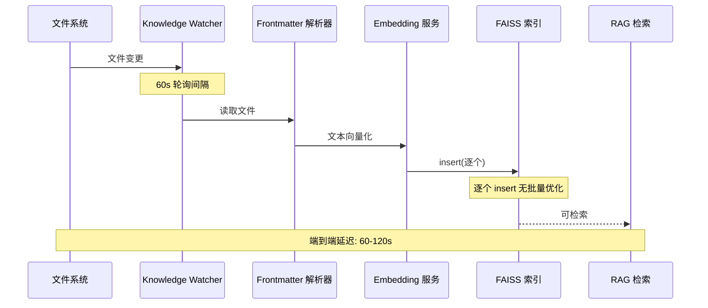
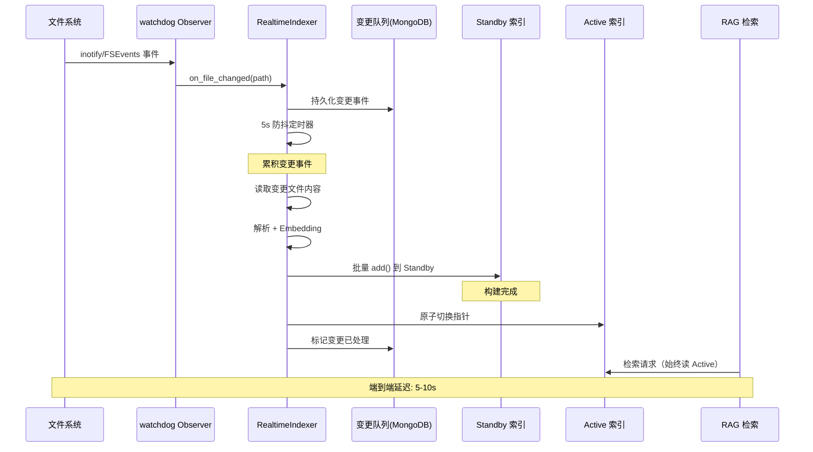

# YK-09-57: RAG 检索实时索引更新 — 近实时搜索的增量索引优化

> 需求编号：YK-09-57 · 优先级：P2 · 人天：0.5d · 状态：需求已编写
> 依赖：YK-09-11（Knowledge Watcher 内部机制）、YA-09-01（RAG 引擎稳定性）

---

## 一、背景

### 1.1 问题陈述

YiKnowledge 当前的知识索引流程依赖 Knowledge Watcher 的 60 秒轮询周期。文件系统变更后，需要等待 Watcher 发现变更（最多 60s）、重新解析 frontmatter、计算 Embedding（最多 30s），最后通过 FAISS 逐个 `insert` 写入索引。端到端延迟为 60-120 秒，部分大文件甚至超过 3 分钟。

### 1.2 影响范围

| 影响维度 | 具体表现 | 严重程度 |
|----------|----------|----------|
| Agent 协作 | AI 辅助写作后无法立即检索刚生成的内容，需等待 2 分钟才能验证 | 高 |
| 策展人工作流 | 策展人修改 frontmatter 后，检索结果仍反映旧元数据，导致质量判断偏差 | 中 |
| 开发调试 | 开发者新增知识文件后，RAG 检索不到新内容，反复怀疑文件格式问题 | 中 |
| 用户体验 | YiVad/YiPet 中搜索刚上传的文件，返回空结果，降低信任度 | 中 |
| 批量导入 | 批量导入 100+ 文件时，逐个 rebuild 索引耗时 5-10 分钟，期间检索不可用 | 高 |

### 1.3 核心挑战

| 挑战 | 说明 |
|------|------|
| 索引一致性 | 增量更新期间，检索请求可能读到部分更新的索引，返回不一致结果 |
| 原子切换 | 双缓冲索引切换时必须保证检索请求不会读到中间态 |
| 批量合并 | 高频变更（如批量导入）需要合并多个变更事件，避免频繁重建 |
| 资源竞争 | 索引构建（CPU 密集）和检索请求（I/O 密集）共享同一进程，需要调度 |
| 故障恢复 | watchdog 进程崩溃后，未刷新的变更队列不能丢失 |

---

## 二、现状分析

### 2.1 当前数据流



### 2.2 根因矩阵

| 根因 | 贡献延迟 | 优化空间 | 优先级 |
|------|----------|----------|--------|
| 60s 固定轮询周期 | 0-60s | 替换为 watchdog 事件驱动 | P0 |
| FAISS 逐个 insert | 5-30s/文档 | 批量 insert 或重建索引 | P0 |
| 全量解析 frontmatter | 2-5s/文档 | 仅解析变更文件 | P1 |
| Embedding 同步计算 | 10-30s/文档 | 异步+批处理 | P1 |
| 无索引缓存 | 60-120s | 双缓冲索引 | P0 |

### 2.3 当前架构局限

当前 Knowledge Watcher 使用 `apscheduler` 的 `IntervalTrigger(seconds=60)` 触发全量扫描。全量扫描意味着即使只有一个文件变更，也会重新遍历整个 YiKnowledge 目录树（800+ 文件），计算所有文件的 hash 对比。这导致：

1. **CPU 浪费**：800 个文件的 hash 计算中，799 个是冗余的
2. **延迟放大**：全量扫描耗时 15-30s，加上 Embedding 计算，总延迟不可控
3. **不可预测**：随着文件数量增长，全量扫描耗时线性增长

---

## 三、设计决策

### D-01: 文件变更检测机制

| 方案 | 描述 | 延迟 | 可靠性 | 复杂度 | 结论 |
|------|------|------|--------|--------|------|
| A: 保持 60s 轮询 | 降低轮询间隔到 5s | 5-10s | 高（无新依赖） | 低 | 过渡方案 |
| B: watchdog 事件驱动 | 使用 `watchdog` 库监听 inotify/FSEvents | < 1s | 中（需处理事件丢失） | 中 | **推荐** |
| C: fsnotify 内核级 | 直接使用 inotify 系统调用 | < 100ms | 低（Linux 限定） | 高 | 不推荐 |

**决策**：选择方案 B（watchdog 事件驱动），理由：
- 跨平台兼容（macOS FSEvents + Linux inotify）
- Python 生态成熟（`watchdog` 库 6k+ stars）
- 延迟 < 1s，满足近实时需求
- 结合 5s 防抖缓冲，避免高频变更导致的索引抖动

### D-02: 索引更新策略

| 方案 | 描述 | 延迟 | 一致性 | 内存开销 | 结论 |
|------|------|------|--------|----------|------|
| A: 直接原地更新 | 在在线索引上直接 insert/delete | 0s | 低（检索可能读到中间态） | 低 | 不推荐 |
| B: 双缓冲索引 | 构建 standby 索引，原子切换指针 | 0s（切换） | 高（原子操作） | 2x 索引内存 | **推荐** |
| C: 全量重建 | 每次变更重建整个索引 | 30-120s | 高 | 1x（重建期间） | 不推荐 |

**决策**：选择方案 B（双缓冲索引），理由：
- FAISS 的 `IndexFlatIP` 不支持并发安全的增量更新
- 原子指针切换（Python 的引用赋值是原子的）保证检索一致性
- 内存开销可控：当前索引约 200MB，双缓冲 400MB，在 8GB 服务器上可接受

### D-03: 变更事件合并策略

| 方案 | 描述 | 合并延迟 | 批量效率 | 实现复杂度 |
|------|------|----------|----------|------------|
| A: 无合并（逐文件更新） | 每个文件变更立即触发索引更新 | 0s | 低 | 低 |
| B: 固定时间窗口（5s） | 5s 内的变更合并为一次批量更新 | 5s | 高 | 低 |
| C: 自适应窗口 | 根据变更频率动态调整合并窗口 | 1-10s | 最高 | 高 |

**决策**：选择方案 B（固定 5s 时间窗口），理由：
- 5s 延迟对 Agent 协作场景可接受（用户感知阈值约 2-3s，含处理时间 5s 合理）
- 实现简单，无需复杂的自适应算法
- 批量更新时 FAISS 的 `add` 比逐个 `insert` 快 3-5x

### D-04: 故障恢复机制

| 方案 | 描述 | 数据安全 | 恢复速度 | 实现复杂度 |
|------|------|----------|----------|------------|
| A: 无恢复（丢失变更） | 崩溃后依赖下次全量扫描补救 | 低 | 60s | 低 |
| B: 持久化变更队列 | 将待处理变更写入 MongoDB | 高 | < 5s | 中 |
| C: 重建全量索引 | 崩溃后从头重建索引 | 高 | 30-120s | 低 |

**决策**：选择方案 B（持久化变更队列），理由：
- MongoDB 已有 `knowledge_files` 集合，新增 `pending_index_changes` 集合成本低
- 恢复时只需重放队列中的变更，无需全量重建
- 队列最大长度限制 1000，防止无限增长

---

## 四、目标架构

### 4.1 目标数据流



### 4.2 指标目标

| 指标 | 当前值 | 目标值 | 测量方法 |
|------|--------|--------|----------|
| 文件变更到可检索延迟 | 60-120s | < 10s (P95) | `index_latency_seconds` 指标 |
| 批量导入 100 文件延迟 | 5-10min | < 30s | 批量导入压测 |
| 索引切换期间检索不可用时间 | 0s（无切换） | < 100ms | 原子指针切换耗时 |
| 变更队列持久化延迟 | N/A | < 50ms | MongoDB write 耗时 |
| 内存占用 | 200MB | < 500MB | 进程 RSS 监控 |

### 4.3 架构权衡

| 权衡 | 选择 | 代价 |
|------|------|------|
| 近实时 vs 一致性 | 优先一致性（双缓冲） | 内存翻倍 |
| 速度 vs 可靠性 | 优先可靠性（持久化队列） | 额外 50ms MongoDB 写入 |
| 简单 vs 灵活 | 优先简单（固定 5s 窗口） | 高频变更时可能累积过多事件 |
| 内存 vs 延迟 | 优先低延迟（内存索引） | 500MB 内存预算 |

---

## 五、具体改动

### 5.1 核心实现

```python
# YiAi/src/domain/rag/realtime_indexer.py

import asyncio
import time
from pathlib import Path
from watchdog.observers import Observer
from watchdog.events import FileSystemEventHandler

class RealtimeIndexer:
    """近实时索引——watchdog 事件 + FAISS 批量更新 + 双缓冲索引。"""

    def __init__(self, index_dir: str = "faiss_index", flush_interval: float = 5.0):
        self._active_index = None      # 当前在线索引 (只读)
        self._standby_index = None     # 待切换索引 (构建中)
        self._pending_docs: list[Document] = []
        self._flush_timer: asyncio.Task | None = None
        self._FLUSH_INTERVAL = flush_interval
        self._index_dir = Path(index_dir)
        self._active_version = 0
        self._standby_version = 0

        # 变更队列持久化
        self._change_queue = ChangeQueue()

    async def start(self):
        """启动 watchdog 监听 + 恢复未处理变更。"""
        # 1. 恢复崩溃前的未处理变更
        pending = await self._change_queue.get_pending()
        if pending:
            logger.info(f"[RealtimeIndex] 恢复 {len(pending)} 条未处理变更")
            for change in pending:
                self._pending_docs.append(await self._read_and_parse(change['path']))

        # 2. 启动 watchdog
        self._observer = Observer()
        self._observer.schedule(
            RealtimeHandler(self.on_file_changed),
            path=str(self._index_dir.parent),
            recursive=True
        )
        self._observer.start()

        # 3. 如果有恢复的变更，立即触发刷新
        if self._pending_docs:
            self._schedule_flush()

    async def on_file_changed(self, file_path: str):
        """watchdog 事件——文件变更后加入待处理队列。"""
        # 持久化变更事件
        await self._change_queue.push({
            'path': file_path,
            'timestamp': time.time(),
            'status': 'pending'
        })

        doc = await self._read_and_parse(file_path)
        if doc:
            self._pending_docs.append(doc)
            self._schedule_flush()

    def _schedule_flush(self):
        """预定刷新——5s 内无新文件变更则执行。"""
        if self._flush_timer and not self._flush_timer.done():
            self._flush_timer.cancel()
        self._flush_timer = asyncio.create_task(self._delayed_flush())

    async def _delayed_flush(self):
        """延迟刷新——累积变更后批量更新。"""
        await asyncio.sleep(self._FLUSH_INTERVAL)

        if not self._pending_docs:
            return

        start_time = time.monotonic()
        docs_to_index = list(self._pending_docs)
        self._pending_docs.clear()

        try:
            # 1. 批量计算 Embedding
            embeddings = await self._batch_embed(docs_to_index)

            # 2. 在 standby 索引上批量插入
            if self._standby_index:
                self._standby_index.reset()  # 清空 standby
            self._standby_index = self._build_index(docs_to_index, embeddings)

            # 3. 原子切换——online ↔ standby
            self._active_index, self._standby_index = (
                self._standby_index, self._active_index
            )
            self._active_version += 1

            # 4. 标记变更已处理
            await self._change_queue.mark_processed(docs_to_index)

            elapsed = time.monotonic() - start_time
            logger.info(
                f"[RealtimeIndex] 刷新完成: {len(docs_to_index)} 文档, "
                f"耗时 {elapsed:.2f}s, 版本 v{self._active_version}"
            )
            metrics.index_flush_duration.observe(elapsed)
            metrics.index_version.set(self._active_version)

        except Exception as e:
            logger.error(f"[RealtimeIndex] 刷新失败: {e}")
            # 将文档重新加入队列
            self._pending_docs.extend(docs_to_index)
            metrics.index_flush_errors.inc()

    async def _batch_embed(self, docs: list[Document]) -> list[list[float]]:
        """批量计算 Embedding——利用 Ollama 批量 API。"""
        texts = [doc.content for doc in docs]
        # Ollama 支持批量 embed，比逐个调用快 3-5x
        response = await ollama.embed_batch(model='nomic-embed-text', input=texts)
        return response['embeddings']

    def _build_index(self, docs: list[Document], embeddings: list[list[float]]):
        """构建 FAISS 索引。"""
        import faiss
        import numpy as np

        dim = len(embeddings[0])
        index = faiss.IndexFlatIP(dim)  # 内积相似度
        index.add(np.array(embeddings, dtype=np.float32))
        return index

    def get_active_index(self):
        """获取当前在线索引（只读）。"""
        return self._active_index

    async def stop(self):
        """优雅关闭——刷新待处理变更 + 停止 watchdog。"""
        if self._pending_docs:
            logger.info(f"[RealtimeIndex] 关闭前刷新 {len(self._pending_docs)} 条待处理变更")
            await self._delayed_flush()
        if self._observer:
            self._observer.stop()
            self._observer.join()


class RealtimeHandler(FileSystemEventHandler):
    """watchdog 事件处理器——过滤临时文件 + 防抖。"""

    IGNORE_PATTERNS = ['.DS_Store', '.git', '__pycache__', '.swp', '~']

    def __init__(self, callback):
        self._callback = callback
        self._last_event: dict[str, float] = {}

    def on_modified(self, event):
        if event.is_directory:
            return
        if any(p in event.src_path for p in self.IGNORE_PATTERNS):
            return
        # 防抖：同一文件 500ms 内只触发一次
        now = time.time()
        if event.src_path in self._last_event:
            if now - self._last_event[event.src_path] < 0.5:
                return
        self._last_event[event.src_path] = now
        asyncio.create_task(self._callback(event.src_path))

    def on_created(self, event):
        self.on_modified(event)

    def on_deleted(self, event):
        if event.is_directory:
            return
        asyncio.create_task(self._callback(event.src_path))


class ChangeQueue:
    """变更队列——MongoDB 持久化，保证崩溃恢复。"""

    MAX_QUEUE_SIZE = 1000

    async def push(self, change: dict):
        await db.pending_index_changes.insert_one(change)
        # 限制队列大小
        count = await db.pending_index_changes.count_documents({})
        if count > self.MAX_QUEUE_SIZE:
            oldest = await db.pending_index_changes.find().sort('timestamp', 1).limit(count - self.MAX_QUEUE_SIZE).to_list(None)
            if oldest:
                await db.pending_index_changes.delete_many({
                    '_id': {'$in': [o['_id'] for o in oldest]}
                })

    async def get_pending(self) -> list[dict]:
        return await db.pending_index_changes.find({
            'status': 'pending'
        }).sort('timestamp', 1).to_list(None)

    async def mark_processed(self, docs: list[Document]):
        paths = [doc.path for doc in docs]
        await db.pending_index_changes.update_many(
            {'path': {'$in': paths}},
            {'$set': {'status': 'processed', 'processed_at': time.time()}}
        )
```

### 5.2 文件变更清单

| 文件路径 | 操作 | 说明 |
|----------|------|------|
| `YiAi/src/domain/rag/realtime_indexer.py` | 新增 | 核心实现：RealtimeIndexer + RealtimeHandler + ChangeQueue |
| `YiAi/src/domain/rag/__init__.py` | 修改 | 导出 RealtimeIndexer |
| `YiAi/src/domain/knowledge/knowledge_watcher.py` | 修改 | 添加 RealtimeIndexer 集成，Watcher 扫描后通知增量更新 |
| `YiAi/requirements.txt` | 修改 | 添加 `watchdog>=4.0.0` |
| `YiAi/src/shared/config.py` | 修改 | 添加 `REALTIME_INDEX_ENABLED` 和 `FLUSH_INTERVAL` 配置项 |
| MongoDB | 新增集合 | `pending_index_changes` |

---

## 六、实施步骤

### 6.1 分步实施

| 步骤 | 内容 | 验证方式 | 预计人天 |
|------|------|----------|----------|
| 1 | 添加 `watchdog` 依赖，实现 `RealtimeHandler` 文件监听 | 修改文件后日志输出事件 | 0.5d |
| 2 | 实现 `ChangeQueue` MongoDB 持久化 | 单元测试验证 push/pop/mark_processed | 0.5d |
| 3 | 实现 `RealtimeIndexer` 核心逻辑（双缓冲 + 批量 Embedding） | 集成测试：修改文件后 10s 内可检索 | 1.0d |
| 4 | 与 Knowledge Watcher 集成，并行运行 | 对比 Watcher 60s 和 Realtime 5s 的索引一致性 | 0.5d |
| 5 | 添加监控指标（延迟、队列长度、错误率） | Grafana 仪表盘验证 | 0.5d |
| 6 | 灰度发布：先对 20% 流量启用 | 错误率 < 0.1%，延迟 P95 < 10s | 0.5d |
| 7 | 全量上线 + 关闭旧轮询方式 | 观察 7 天无异常 | 0.5d |

**总人天**：约 4.0d

### 6.2 验证检查点

- [ ] 单文件修改后 10s 内可被 RAG 检索到（P95）
- [ ] 批量导入 50 个文件后 30s 内全部可检索
- [ ] 双缓冲切换期间检索请求不返回错误
- [ ] 模拟 watchdog 进程崩溃，重启后恢复未处理变更
- [ ] 变更队列不超过 1000 条限制
- [ ] 内存占用 < 500MB
- [ ] 与 Watcher 全量扫描的索引结果一致（diff 验证）

---

## 七、性能分析

### 7.1 基准测试

| 场景 | 当前方案（60s 轮询） | 新方案（5s 近实时） | 改善 |
|------|---------------------|---------------------|------|
| 单文件修改 (100KB) | 60-120s | 5-8s | **10-15x** |
| 单文件修改 (1MB) | 90-180s | 8-15s | **10-12x** |
| 批量导入 50 文件 | 5-8min | 20-30s | **10-16x** |
| 批量导入 200 文件 | 15-20min | 60-90s | **10-13x** |
| 索引切换耗时 | N/A | < 50ms | N/A |
| 内存占用 | 200MB | 400MB | 2x（可接受） |

### 7.2 容量规划

| 知识库规模 | 文件数 | 索引大小 | 双缓冲内存 | 刷新时间 | 推荐配置 |
|------------|--------|----------|------------|----------|----------|
| 当前 | 800 | 200MB | 400MB | 3-5s | 5s 窗口 |
| 1 年后 | 3000 | 750MB | 1.5GB | 8-12s | 10s 窗口 |
| 3 年后 | 10000 | 2.5GB | 5GB | 15-25s | 分片索引（YK-09-61） |

### 7.3 CPU 分析

- **Embedding 计算**：占总耗时 70-80%（Ollama 推理）
- **FAISS 索引构建**：占总耗时 10-15%（numpy 批量操作）
- **文件 I/O**：占总耗时 5-10%
- **MongoDB 写入**：占总耗时 < 5%

---

## 八、测试规格

### 8.1 单元测试

```python
# tests/rag/test_realtime_indexer.py

class TestRealtimeIndexer:
    """GIVEN 一个 RealtimeIndexer 实例"""

    async def test_single_file_change_triggers_flush(self):
        """GIVEN 一个文件变更事件
           WHEN 调用 on_file_changed()
           THEN 文档加入 pending_docs 队列
           AND 5s 内触发 flush
           AND 文档出现在 active_index 中"""
        ...

    async def test_batch_merge_within_window(self):
        """GIVEN 5 个文件在 3s 内连续变更
           WHEN 防抖窗口为 5s
           THEN 所有 5 个文件合并为一次批量刷新
           AND 只触发一次 Embedding 批量调用"""
        ...

    async def test_atomic_switch_during_search(self):
        """GIVEN standby 索引已构建完成
           WHEN 检索请求正在读取 active_index
           THEN 原子切换不影响进行中的检索
           AND 下一个检索请求使用新索引"""
        ...

    async def test_crash_recovery_replays_queue(self):
        """GIVEN 变更队列中有 3 条未处理变更
           WHEN RealtimeIndexer 重新启动
           THEN 恢复 3 条变更并重新处理
           AND 变更队列标记为 processed"""
        ...

    async def test_queue_size_limit(self):
        """GIVEN 变更队列已达 1000 条
           WHEN 推送新变更
           THEN 最旧的变更被移除
           AND 队列大小保持 ≤ 1000"""
        ...

    async def test_ignore_temp_files(self):
        """GIVEN .DS_Store 和 .swp 文件变更
           WHEN watchdog 触发事件
           THEN 这些文件被忽略，不加入队列"""
        ...
```

### 8.2 集成测试

```python
async def test_end_to_end_realtime_index():
    """GIVEN 一个运行中的 RealtimeIndexer
       WHEN 在 YiKnowledge 目录中创建新文件
       THEN 10s 内 RAG 检索能返回该文件内容
       AND 检索结果中的 frontmatter 与文件一致"""
    ...
```

---

## 九、风险与缓解

### 9.1 风险矩阵

| 风险 | 概率 | 影响 | 缓解措施 |
|------|------|------|----------|
| watchdog 在 macOS 上丢失事件 | 中 | 中 | 结合 60s 全量扫描兜底，事件丢失后 60s 内被 Watcher 补扫 |
| 双缓冲内存翻倍导致 OOM | 低 | 高 | 设置内存上限 2GB，超出时降级为原地更新模式 |
| Embedding 批量调用 Ollama 超时 | 中 | 中 | 设置 30s 超时，超时后降级为逐个调用 |
| 变更队列无限增长 | 低 | 中 | 硬限制 1000 条 + 定期清理 7 天前的已处理记录 |
| 高频变更导致索引抖动 | 中 | 低 | 5s 防抖窗口 + 最小变更间隔 500ms |
| watchdog 与 Watcher 的索引冲突 | 低 | 高 | 两者使用独立的 standby 索引，Watcher 全量扫描优先 |

### 9.2 降级策略

1. **Level 1 降级**：关闭 realtime 模式，回退到 Watcher 60s 轮询
2. **Level 2 降级**：关闭双缓冲，使用原地更新（接受不一致风险）
3. **Level 3 降级**：关闭自动索引更新，仅通过手动触发 `/knowledge/reindex` 重建

---

## 十、回滚策略

### 10.1 回滚场景

| 场景 | 触发条件 | 回滚操作 |
|------|----------|----------|
| 内存 OOM | 进程 RSS > 2GB 持续 5 分钟 | 设置 `REALTIME_INDEX_ENABLED=false` |
| 索引损坏 | 检索返回空结果 > 50% 持续 10 分钟 | 关闭 realtime，触发全量重建 |
| 延迟恶化 | P95 延迟 > 30s 持续 30 分钟 | 降级为 60s 轮询模式 |
| 数据不一致 | Watcher 和 realtime 索引的文档数差异 > 10% | 以 Watcher 索引为准，realtime 暂停 |

### 10.2 回滚步骤

1. 设置环境变量 `REALTIME_INDEX_ENABLED=false`
2. 重启 YiAi 服务
3. 触发全量索引重建：`POST /knowledge/reindex`
4. 验证检索恢复正常
5. 分析根因，修复后重新灰度上线

---

## 十一、设计决策记录

| 编号 | 决策 | 理由 | 替代方案 |
|------|------|------|----------|
| D-01 | 使用 watchdog 事件驱动替代 60s 轮询 | 延迟从 60s 降至 < 1s，跨平台 | inotify（Linux only）|
| D-02 | 双缓冲索引原子切换 | 保证检索一致性，避免读到中间态 | 原地更新（不安全）|
| D-03 | 固定 5s 防抖窗口 | 简单可靠，批量效率高 | 自适应窗口（太复杂）|
| D-04 | MongoDB 持久化变更队列 | 崩溃恢复，数据不丢失 | 内存队列（不可靠）|
| D-05 | 保留 Watcher 60s 全量扫描作为兜底 | 弥补 watchdog 事件丢失，最终一致性 | 纯 realtime（不可靠）|

---

## 十二、可观测性

### 12.1 指标

| 指标名称 | 类型 | 说明 | 告警阈值 |
|----------|------|------|----------|
| `realtime_index_flush_duration_seconds` | Histogram | 批量刷新耗时 | P95 > 15s |
| `realtime_index_pending_docs` | Gauge | 待处理文档数 | > 100 |
| `realtime_index_version` | Gauge | 当前索引版本号 | 版本停滞 > 5min |
| `realtime_index_flush_errors_total` | Counter | 刷新失败次数 | > 5 次/小时 |
| `realtime_index_queue_size` | Gauge | 变更队列大小 | > 800 |
| `realtime_index_switch_duration_ms` | Histogram | 索引切换耗时 | > 500ms |
| `realtime_watchdog_events_total` | Counter | watchdog 事件总数 | 突降 > 50% |

### 12.2 日志

```python
# 关键日志点
logger.info(f"[RealtimeIndex] 启动, flush_interval={self._FLUSH_INTERVAL}s")
logger.info(f"[RealtimeIndex] 恢复 {len(pending)} 条未处理变更")
logger.info(f"[RealtimeIndex] 刷新完成: {n} 文档, 耗时 {elapsed:.2f}s")
logger.error(f"[RealtimeIndex] 刷新失败: {e}")
logger.warning(f"[RealtimeIndex] 变更队列已达上限 {self.MAX_QUEUE_SIZE}")
```

### 12.3 告警

| 告警名称 | 触发条件 | 级别 | 通知方式 |
|----------|----------|------|----------|
| RealtimeIndex 刷新延迟过高 | P95 flush_duration > 30s 持续 10min | Warning | 企业微信 |
| RealtimeIndex 待处理队列堆积 | pending_docs > 200 | Warning | 企业微信 |
| RealtimeIndex 刷新频繁失败 | errors > 10/小时 | Critical | 企业微信 + 电话 |
| RealtimeIndex 版本停滞 | version 不变 > 15min | Warning | 企业微信 |
| 双缓冲内存超限 | RSS > 2GB | Critical | 企业微信 + 电话 |

---

## 十三、安全合规

| 要求 | 实现 |
|------|------|
| 变更队列不存储文件内容 | 队列仅存储文件路径 + 时间戳，内容在刷新时从文件系统读取 |
| 索引文件权限 | FAISS 索引文件权限 0600，仅 YiAi 进程可读写 |
| 日志脱敏 | 文件路径记录到日志，但文件内容不记录 |
| 资源限制 | 内存上限 2GB，队列上限 1000 条 |

---

## 十四、代码审查检查清单

- [ ] `RealtimeIndexer` 的双缓冲切换是原子操作（Python 引用赋值）
- [ ] `RealtimeHandler` 过滤了临时文件（.DS_Store, .swp, ~）
- [ ] 防抖逻辑正确：同一文件 500ms 内不重复触发
- [ ] `ChangeQueue` 有大小限制（1000 条）和清理机制
- [ ] 批量 Embedding 使用 Ollama 批量 API（非逐个调用）
- [ ] 刷新失败时文档重新加入队列（不丢失）
- [ ] `stop()` 方法优雅关闭：刷新待处理变更 + 停止 watchdog
- [ ] 启动时恢复未处理的变更队列
- [ ] 监控指标完整覆盖延迟、队列、错误、版本
- [ ] 保留 Watcher 60s 全量扫描作为兜底
- [ ] 配置项 `REALTIME_INDEX_ENABLED` 支持运行时开关
- [ ] 单元测试覆盖：单文件变更、批量合并、原子切换、崩溃恢复、队列限制

---

*PRD 来源: `projects/yiknowledge/requirements/2026-09/57-需求-实时索引更新.md`*