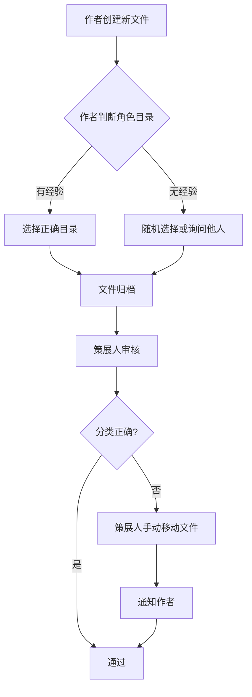
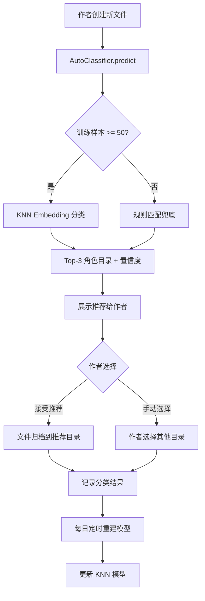

# YK-09-58: 知识库内容自动分类 — Embedding+KNN 新文件角色目录推荐

> 需求编号：YK-09-58 · 优先级：P2 · 人天：0.5d · 状态：需求已编写

---

## 一、背景

### 1.1 问题陈述

YiKnowledge 采用 7 角色目录结构（`engineer/`、`aier/`、`srer/`、`leader/`、`producter/`、`curator/`、`executiver/`），每个角色目录有独立的领域边界。然而，新手作者（尤其是新加入团队的成员）经常困惑："这个文件应该放在哪个角色目录？"

当前，文件分类完全依赖作者手动判断。错误分类导致：
- 策展人需要额外审核并移动文件
- RAG 检索因角色目录过滤而漏掉被错放的内容
- 知识图谱（YK-09-08）的依赖关系因分类错误而不准确

### 1.2 影响范围

| 影响维度 | 具体表现 | 严重程度 |
|----------|----------|----------|
| 策展人工作量 | 每周约 15-20% 的新文件需要重新分类，策展人手动审核耗时 | 中 |
| 检索质量 | 按角色目录过滤检索时，错放文件不会被返回，Recall 降低 5-10% | 高 |
| 新人上手 | 新成员不了解 7 角色边界，前 2 周分类错误率 > 30% | 中 |
| 知识图谱 | 跨角色依赖关系因分类错误而断裂 | 中 |
| 内容治理 | 错误分类导致内容重复（同一主题分散在多个角色目录） | 低 |

### 1.3 核心挑战

| 挑战 | 说明 |
|------|------|
| 冷启动 | 新角色目录缺少训练样本时，KNN 无法有效分类 |
| 跨领域内容 | 某些文件同时涉及多个角色领域（如"Docker 部署"既属于 srer 也属于 engineer） |
| 领域漂移 | 随着知识库增长，角色目录的语义边界可能漂移，旧模型失效 |
| 多语言 | 中文内容为主，但部分文件为英文，Embedding 模型需支持多语言 |
| 置信度校准 | 低置信度的推荐不应强制引导，需给作者保留手动选择权 |

---

## 二、现状分析

### 2.1 当前分类流程



### 2.2 根因矩阵

| 根因 | 贡献比例 | 解决难度 | 优先级 |
|------|----------|----------|--------|
| 角色边界不清晰 | 40% | 中（需文档化） | P0 |
| 无自动分类辅助 | 35% | 中（需 ML 模型） | P0 |
| 新成员培训不足 | 15% | 低（需培训材料） | P1 |
| 跨领域内容无明确归属规则 | 10% | 高（需治理规范） | P2 |

### 2.3 数据现状

| 指标 | 当前值 |
|------|--------|
| 知识库总文件数 | 800+ |
| 有 Embedding 的文件数 | 750+ |
| 角色目录数 | 7 |
| 平均每角色文件数 | 110 |
| 最小角色文件数 | 45（executiver） |
| 最大角色文件数 | 180（engineer） |
| 分类错误率（估计） | 15-20% |
| 跨领域文件比例 | 8-12% |

---

## 三、设计决策

### D-01: 分类算法选择

| 方案 | 描述 | 准确率 | 训练成本 | 推理速度 | 结论 |
|------|------|--------|----------|----------|------|
| A: 规则匹配 | 关键词→角色映射表 | 60-70% | 低（人工维护） | 极快 | 基线对比 |
| B: KNN (Embedding) | 基于内容 Embedding 的 K 近邻 | 80-85% | 低（无需训练） | 快（< 10ms） | **推荐** |
| C: 微调 BERT 分类器 | 在 YiKnowledge 数据上微调 | 88-92% | 高（GPU 训练） | 中（50ms） | 未来优化 |
| D: LLM 零样本分类 | 直接让 LLM 判断角色 | 85-90% | 零 | 慢（500ms+） | 高成本 |

**决策**：选择方案 B（KNN + Embedding），理由：
- 无需训练，利用已有的 Embedding 数据即可
- 推理速度快（< 10ms），适合实时推荐
- 准确率 80-85% 满足辅助推荐场景（非自动决策）
- 可随知识库增长自动更新（重新 fit 即可）

### D-02: 多标签 vs 单标签分类

| 方案 | 描述 | 适用场景 | 复杂度 | 结论 |
|------|------|----------|--------|------|
| A: 单标签（Top-1） | 只推荐一个最佳角色目录 | 简单明确 | 低 | 不推荐（忽略跨领域） |
| B: Top-3 推荐 | 推荐 Top 3 角色目录 + 置信度 | 覆盖跨领域 | 低 | **推荐** |
| C: 多标签（阈值） | 置信度 > 阈值的所有角色 | 精确但复杂 | 中 | 未来优化 |

**决策**：选择方案 B（Top-3 推荐），理由：
- 覆盖跨领域内容（如文件同时属于 engineer 和 srer）
- 置信度让作者自行判断可靠性
- 实现简单，KNN 的 `predict_proba` 直接支持

### D-03: 模型更新策略

| 方案 | 描述 | 更新频率 | 数据一致性 | 结论 |
|------|------|----------|------------|------|
| A: 静态模型 | 训练一次，不再更新 | 永不 | 逐渐漂移 | 不推荐 |
| B: 定时重建 | 每日/每周重新 fit | 1 天 | 有延迟 | **推荐** |
| C: 实时增量 | 每次新文件加入立即更新 | 实时 | 高 | 过复杂 |

**决策**：选择方案 B（每日定时重建），理由：
- 知识库增长缓慢（每天 2-5 个新文件），每日更新足够
- 重新 fit 成本低（750 个样本，< 1s）
- 避免实时更新的复杂性和潜在不一致

### D-04: 冷启动处理

| 方案 | 描述 | 适用场景 | 结论 |
|------|------|----------|------|
| A: 回退到规则分类 | 样本不足时使用关键词规则 | 新角色目录 | **推荐** |
| B: 拒绝推荐 | 样本不足时不推荐 | 保守 | 用户体验差 |
| C: 使用全局模型 | 不区分角色，直接分类 | 模糊 | 不推荐 |

**决策**：选择方案 A（回退到规则分类），理由：
- 规则分类（关键词→角色映射表）作为兜底
- 当样本数 < 50 时自动切换
- 规则表由策展人维护，确保准确性

---

## 四、目标架构

### 4.1 目标数据流



### 4.2 指标目标

| 指标 | 当前值 | 目标值 | 测量方法 |
|------|--------|--------|----------|
| Top-1 分类准确率 | N/A | > 80% | 人工标注 100 个测试样本 |
| Top-3 覆盖准确率 | N/A | > 95% | 正确角色在 Top-3 中的比例 |
| 分类错误率（人工） | 15-20% | < 8% | 策展人审核统计数据 |
| 推理延迟 | N/A | < 10ms | API 响应时间 |
| 模型更新耗时 | N/A | < 5s | 每日重建耗时 |

---

## 五、具体改动

### 5.1 核心实现

```python
# YiAi/src/domain/knowledge/auto_classifier.py

import numpy as np
from sklearn.neighbors import KNeighborsClassifier
from collections import Counter

class AutoClassifier:
    """KNN 分类器——基于 Embedding 的角色目录推荐。"""

    ROLE_DIRS = ['engineer', 'aier', 'srer', 'leader',
                 'producter', 'curator', 'executiver']

    # 规则兜底——关键词→角色映射
    KEYWORD_RULES = {
        'engineer': ['代码', '架构', 'API', '数据库', '接口', '性能', '重构',
                     'TypeScript', 'Python', 'Vue', 'FastAPI', 'MongoDB'],
        'aier': ['AI', '模型', '训练', '推理', 'Prompt', 'RAG', 'Embedding',
                 'LLM', 'Agent', 'Ollama', 'llama_index'],
        'srer': ['部署', 'Docker', 'K8s', '监控', '告警', 'CI/CD', '日志',
                 '高可用', '扩容', '降级', '备份'],
        'leader': ['规划', 'Roadmap', '里程碑', '资源', '排期', 'OKR',
                   '复盘', '决策', '优先级'],
        'producter': ['需求', 'PRD', '用户', '体验', '原型', '交互',
                      '验收', '灰度', '上线'],
        'curator': ['规范', '命名', 'Frontmatter', '模板', '审核',
                    '质量', '治理', '分类'],
        'executiver': ['日报', '周报', '会议', '纪要', '沟通', '协作',
                       '流程', '审批'],
    }

    MIN_TRAIN_SAMPLES = 50

    def __init__(self):
        self._knn: KNeighborsClassifier | None = None
        self._trained = False
        self._last_train_time: float = 0
        self._class_distribution: dict[str, int] = {}

    async def train(self) -> bool:
        """训练 KNN——使用所有已有文件的 Embedding + 角色目录标签。"""
        docs = await db.knowledge_files.find({
            'embedding': {'$exists': True},
            'path': {'$regex': '^(engineer|aier|srer|leader|producter|curator|executiver)/'},
        }).to_list(None)

        if len(docs) < self.MIN_TRAIN_SAMPLES:
            logger.warning(f"[AutoClassifier] 训练样本不足: {len(docs)} < {self.MIN_TRAIN_SAMPLES}")
            return False

        X = np.array([d['embedding'] for d in docs], dtype=np.float32)
        y = [d['path'].split('/')[0] for d in docs]

        # 类别分布统计
        self._class_distribution = dict(Counter(y))

        # 自动选择 k：min(5, sqrt(n))
        k = min(5, int(np.sqrt(len(X))))
        self._knn = KNeighborsClassifier(
            n_neighbors=k,
            metric='cosine',
            weights='distance'  # 距离加权——近邻权重更高
        )
        self._knn.fit(X, y)
        self._trained = True
        self._last_train_time = time.time()

        logger.info(
            f"[AutoClassifier] 训练完成: {len(X)} 样本, "
            f"k={k}, 类别分布: {self._class_distribution}"
        )
        return True

    def predict(self, embedding: list[float]) -> dict:
        """预测文件的最佳角色目录——返回 Top 3 推荐。

        Returns:
            {
                'method': 'knn' | 'rule',
                'top_recommendation': 'engineer',
                'confidence': 0.87,
                'alternatives': [
                    {'role': 'srer', 'confidence': 0.65},
                    {'role': 'aier', 'confidence': 0.42},
                ],
                'class_distribution': {...}
            }
        """
        if self._trained and self._knn is not None:
            return self._predict_knn(embedding)
        else:
            return self._predict_rule(embedding)

    def _predict_knn(self, embedding: list[float]) -> dict:
        """KNN 预测。"""
        probs = self._knn.predict_proba([embedding])[0]
        classes = self._knn.classes_

        # 排序获取 Top 3
        top3_idx = np.argsort(probs)[::-1][:3]

        return {
            'method': 'knn',
            'top_recommendation': classes[top3_idx[0]],
            'confidence': round(float(probs[top3_idx[0]]), 3),
            'alternatives': [
                {
                    'role': classes[i],
                    'confidence': round(float(probs[i]), 3)
                }
                for i in top3_idx[1:] if probs[i] > 0.05
            ],
            'class_distribution': self._class_distribution,
        }

    def _predict_rule(self, embedding: list[float]) -> dict:
        """规则兜底——基于关键词匹配。
        注意：embedding 参数在此方法中不使用，保留以保持接口一致。
        """
        # 规则分类需要文件内容，但这里只有 embedding
        # 返回提示：需要文件内容才能进行规则分类
        return {
            'method': 'rule',
            'top_recommendation': None,
            'confidence': 0,
            'alternatives': [],
            'message': '分类器未训练，请提供文件内容以使用规则分类',
        }

    def predict_with_content(self, content: str, title: str = '') -> dict:
        """基于文本内容的规则分类——冷启动兜底。"""
        scores = {}
        combined = f"{title} {content[:500]}"  # 前 500 字符足够

        for role, keywords in self.KEYWORD_RULES.items():
            score = sum(1 for kw in keywords if kw.lower() in combined.lower())
            scores[role] = score / len(keywords) if keywords else 0

        # 排序获取 Top 3
        ranked = sorted(scores.items(), key=lambda x: x[1], reverse=True)
        top3 = ranked[:3]

        return {
            'method': 'rule',
            'top_recommendation': top3[0][0] if top3[0][1] > 0 else None,
            'confidence': round(top3[0][1], 3) if top3 else 0,
            'alternatives': [
                {'role': r, 'confidence': round(s, 3)}
                for r, s in top3[1:] if s > 0
            ],
            'keyword_matches': {
                role: {'score': round(s, 3), 'matched': sum(1 for kw in self.KEYWORD_RULES[role] if kw.lower() in combined.lower())}
                for role, s in scores.items() if s > 0
            },
        }

    async def record_classification_feedback(self, file_path: str,
                                              recommended: str,
                                              actual: str):
        """记录分类反馈——用于模型评估。"""
        await db.classification_feedback.insert_one({
            'file_path': file_path,
            'recommended': recommended,
            'actual': actual,
            'correct': recommended == actual,
            'timestamp': time.time(),
        })

    async def get_accuracy_stats(self, days: int = 30) -> dict:
        """获取分类准确率统计。"""
        cutoff = time.time() - days * 86400
        feedbacks = await db.classification_feedback.find({
            'timestamp': {'$gte': cutoff}
        }).to_list(None)

        if not feedbacks:
            return {'sample_size': 0, 'accuracy': 0}

        correct = sum(1 for f in feedbacks if f['correct'])
        return {
            'sample_size': len(feedbacks),
            'accuracy': round(correct / len(feedbacks), 3),
            'by_role': {
                role: round(
                    sum(1 for f in feedbacks if f['actual'] == role and f['correct']) /
                    max(sum(1 for f in feedbacks if f['actual'] == role), 1), 3
                )
                for role in self.ROLE_DIRS
            }
        }
```

### 5.2 API 端点

```python
# YiAi/src/domain/knowledge/classification_api.py

@router.post("/knowledge/classify")
async def classify_file(request: ClassifyRequest):
    """分类新文件——返回角色目录推荐。

    Request: { content: str, title: str, embedding?: list[float] }
    Response: { top_recommendation, confidence, alternatives, method }
    """
    classifier = get_classifier()

    if request.embedding:
        result = classifier.predict(request.embedding)
    else:
        # 无 embedding 时使用规则分类
        result = classifier.predict_with_content(request.content, request.title)

    return success_response(result)


@router.post("/knowledge/classify/feedback")
async def classify_feedback(request: FeedbackRequest):
    """记录分类反馈。

    Request: { file_path: str, recommended: str, actual: str }
    """
    classifier = get_classifier()
    await classifier.record_classification_feedback(
        request.file_path, request.recommended, request.actual
    )
    return success_response({"acknowledged": True})


@router.get("/knowledge/classify/accuracy")
async def classify_accuracy(days: int = 30):
    """获取分类准确率统计。"""
    classifier = get_classifier()
    stats = await classifier.get_accuracy_stats(days)
    return success_response(stats)
```

### 5.3 定时任务

```python
# YiAi/src/domain/knowledge/classification_scheduler.py

async def schedule_model_retrain():
    """每日凌晨 2 点重建分类模型。"""
    while True:
        now = datetime.now()
        # 计算到凌晨 2 点的等待时间
        next_run = now.replace(hour=2, minute=0, second=0, microsecond=0)
        if next_run <= now:
            next_run += timedelta(days=1)

        await asyncio.sleep((next_run - now).total_seconds())

        classifier = get_classifier()
        success = await classifier.train()
        if success:
            logger.info("[ClassificationScheduler] 模型重建成功")
            accuracy = await classifier.get_accuracy_stats(days=7)
            logger.info(f"[ClassificationScheduler] 近 7 天准确率: {accuracy}")
        else:
            logger.warning("[ClassificationScheduler] 模型重建失败（样本不足）")
```

### 5.4 文件变更清单

| 文件路径 | 操作 | 说明 |
|----------|------|------|
| `YiAi/src/domain/knowledge/auto_classifier.py` | 新增 | KNN 分类器 + 规则兜底 + 反馈收集 |
| `YiAi/src/domain/knowledge/classification_api.py` | 新增 | 分类 API 端点 |
| `YiAi/src/domain/knowledge/classification_scheduler.py` | 新增 | 每日模型重建定时任务 |
| `YiAi/requirements.txt` | 修改 | 添加 `scikit-learn>=1.3.0` |
| MongoDB | 新增集合 | `classification_feedback` |

---

## 六、实施步骤

| 步骤 | 内容 | 验证方式 | 预计人天 |
|------|------|----------|----------|
| 1 | 实现规则分类器（关键词映射表） | 对 50 个已有文件进行规则分类，人工评估准确率 | 0.5d |
| 2 | 实现 KNN 分类器 + Embedding 训练 | 对 100 个测试样本评估 Top-1/Top-3 准确率 | 0.5d |
| 3 | 实现分类 API 端点 | 集成测试：POST classify → 返回合理推荐 | 0.5d |
| 4 | 实现分类反馈收集 | 验证反馈写入 MongoDB 并可用于统计 | 0.5d |
| 5 | 实现每日模型重建定时任务 | 验证模型每天自动更新 | 0.5d |
| 6 | 前端集成（YiVad 文件创建页面） | 展示 Top-3 推荐 + 置信度 | 1.0d |
| 7 | 灰度发布 + 准确率监控 | 1 周内分类错误率 < 8% | 0.5d |

**总人天**：约 4.0d

---

## 七、性能分析

| 操作 | 当前耗时 | 目标耗时 | 说明 |
|------|----------|----------|------|
| KNN 训练（750 样本） | N/A | < 1s | numpy 批量操作 |
| KNN 推理（单文件） | N/A | < 10ms | sklearn 优化 |
| 规则分类（单文件） | N/A | < 1ms | 纯字符串匹配 |
| 模型重建（全量） | N/A | < 5s | 含 MongoDB 查询 |
| API 响应（含 Embedding） | N/A | < 200ms | 主要耗时在 Embedding 计算 |

---

## 八、测试规格

```python
class TestAutoClassifier:
    """GIVEN 一个 AutoClassifier 实例"""

    async def test_knn_top1_accuracy_above_80_percent(self):
        """GIVEN 已训练的 KNN 模型
           WHEN 对 100 个标注样本进行分类
           THEN Top-1 准确率 >= 80%"""

    async def test_knn_top3_coverage_above_95_percent(self):
        """GIVEN 已训练的 KNN 模型
           WHEN 对 100 个标注样本进行分类
           THEN 正确角色在 Top-3 中的比例 >= 95%"""

    async def test_rule_fallback_when_untrained(self):
        """GIVEN 未训练的 AutoClassifier
           WHEN 调用 predict_with_content()
           THEN 使用规则分类返回结果
           AND method 字段为 'rule'"""

    async def test_cold_start_returns_empty_when_no_match(self):
        """GIVEN 内容与所有角色关键词都不匹配
           WHEN 调用 predict_with_content()
           THEN top_recommendation 为 None
           AND confidence 为 0"""

    async def test_feedback_recording(self):
        """GIVEN 分类推荐结果
           WHEN 用户选择实际角色与推荐不同
           THEN feedback 正确记录到 MongoDB"""

    async def test_model_retrain_updates_knn(self):
        """GIVEN 新增 50 个文件后
           WHEN 执行每日模型重建
           THEN 新文件被纳入训练数据
           AND 模型版本更新"""
```

---

## 九、风险与缓解

| 风险 | 概率 | 影响 | 缓解措施 |
|------|------|------|----------|
| 小角色目录（executiver）训练样本不足 | 中 | 中 | 规则分类兜底 + 策展人手动标注补充样本 |
| Embedding 模型切换导致分类失效 | 低 | 高 | 模型切换后强制重新训练 + 准确率回归测试 |
| 领域漂移导致准确率下降 | 中 | 中 | 每日自动重建 + 准确率监控告警 |
| 跨领域内容被错误归入单一角色 | 高 | 低 | Top-3 推荐覆盖多角色 + 作者手动选择 |
| 规则关键词表维护成本高 | 低 | 低 | 仅作为冷启动兜底，主要依赖 KNN |

---

## 十、回滚策略

| 场景 | 触发条件 | 回滚操作 |
|------|----------|----------|
| 分类准确率骤降 | Top-1 准确率 < 60% 持续 3 天 | 关闭自动推荐，仅保留手动分类 |
| 模型训练失败 | 连续 3 天训练失败 | 回退到纯规则分类 |
| API 性能下降 | P95 延迟 > 500ms | 禁用 KNN，仅使用规则分类 |

---

## 十一、设计决策记录

| 编号 | 决策 | 理由 | 替代方案 |
|------|------|------|----------|
| D-01 | KNN + Embedding 作为主要分类算法 | 无需训练，准确率高，推理快 | 微调 BERT（成本高）、LLM 零样本（慢） |
| D-02 | Top-3 推荐而非单标签 | 覆盖跨领域内容，给作者选择权 | 单标签（忽略跨领域） |
| D-03 | 每日定时重建模型 | 知识库增长缓慢，实时更新不必要 | 实时增量（太复杂） |
| D-04 | 规则分类作为冷启动兜底 | 新角色目录样本不足时的保障 | 拒绝推荐（用户体验差） |

---

## 十二、可观测性

| 指标名称 | 类型 | 说明 | 告警阈值 |
|----------|------|------|----------|
| `auto_classifier_accuracy_top1` | Gauge | Top-1 分类准确率（7 天滑动） | < 70% |
| `auto_classifier_accuracy_top3` | Gauge | Top-3 覆盖准确率 | < 90% |
| `auto_classifier_training_duration_seconds` | Histogram | 模型训练耗时 | P95 > 10s |
| `auto_classifier_inference_duration_ms` | Histogram | 推理耗时 | P95 > 50ms |
| `auto_classifier_training_samples` | Gauge | 训练样本数 | < 50 |
| `auto_classifier_feedback_total` | Counter | 反馈总数 | — |

---

## 十三、安全合规

| 要求 | 实现 |
|------|------|
| 文件内容不存储在分类器 | 仅使用 Embedding 向量，不存储原始文本 |
| 分类反馈匿名化 | 不记录用户身份，仅记录文件路径和分类结果 |
| 模型文件权限 | 每日重建的模型文件权限 0600 |

---

## 十四、代码审查检查清单

- [ ] 自动分类基于文件内容 + 已有标签的 Embedding 相似度
- [ ] 多角色目录候选排序（Top 3 + 置信度）
- [ ] 策展人确认后应用分类（非自动覆盖）
- [ ] 模型随分类结果反馈持续优化
- [ ] 冷启动时回退到规则分类（关键词映射表）
- [ ] 小角色目录（< 50 样本）使用规则兜底
- [ ] 分类反馈记录到 `classification_feedback` 集合
- [ ] 每日自动重建模型，记录准确率
- [ ] API 支持无 Embedding 时的纯文本规则分类
- [ ] 跨领域内容（多角色匹配）在 Top-3 中体现

---

*PRD 来源: `projects/yiknowledge/requirements/2026-09/58-需求-内容自动分类.md`*