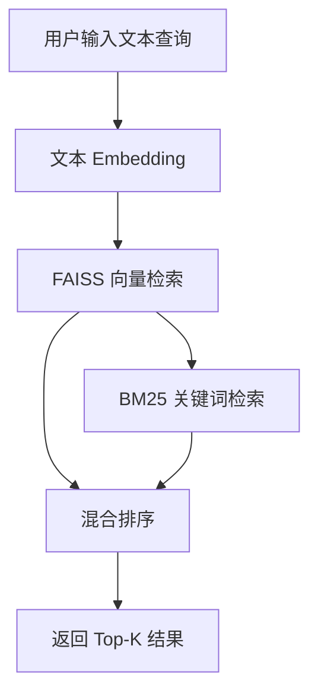
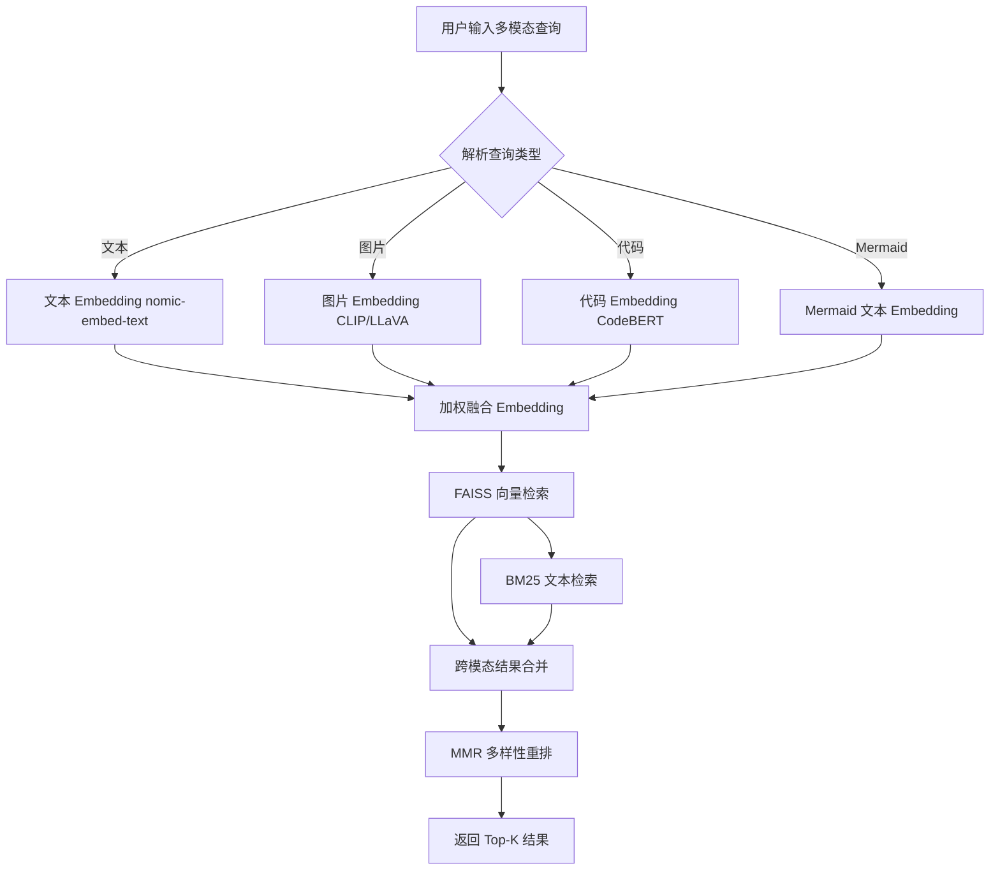

# YK-09-59: RAG 检索多模态查询支持 — 图片/代码混合查询的联合检索

> 需求编号：YK-09-59 · 优先级：P2 · 人天：0.5d · 状态：需求已编写
> 依赖：YK-09-36（多模态内容向量对齐）、YK-09-73（图像向量化 CLIP）

---

## 一、背景

### 1.1 问题陈述

当前 RAG 检索仅支持纯文本查询。用户只能通过文字描述来搜索知识库内容。然而，在实际开发场景中，用户经常需要：

- 粘贴一张架构截图，让 AI 找到相似的架构设计文档
- 粘贴一段错误日志，找到相关的 Bug 修复文档
- 粘贴一段代码片段，找到包含该代码逻辑的 API 文档
- 粘贴 Mermaid 图表源码，找到包含类似图表的文档

这些场景下，纯文本描述往往无法精确表达用户意图。"这个架构图"比"三层架构图，从左到右分别是前端、后端、数据库"的描述更精确但文字无法携带视觉信息。

### 1.2 影响范围

| 影响维度 | 具体表现 | 严重程度 |
|----------|----------|----------|
| 开发效率 | 开发者看到错误截图但无法直接用截图搜索，需手动描述，耗时且不精确 | 高 |
| 知识发现 | 架构图、流程图等视觉内容无法被图像查询检索到 | 中 |
| 代码查找 | 代码片段搜索只能靠文本匹配，无法利用代码结构语义 | 中 |
| 用户体验 | 竞品（如 Notion AI、GitHub Copilot）已支持多模态输入 | 中 |

### 1.3 核心挑战

| 挑战 | 说明 |
|------|------|
| 模态对齐 | 文本、图片、代码的 Embedding 空间不同，需要对齐到统一空间 |
| 权重融合 | 多模态查询的各部分权重如何分配（文本 vs 图片 vs 代码） |
| 延迟控制 | 多模态 Embedding 计算（尤其是图片）显著增加延迟 |
| 模型依赖 | 图片 Embedding 需要 CLIP/LLaVA 等视觉模型，增加部署复杂度 |
| 结果排序 | 跨模态检索结果如何统一排序 |

---

## 二、现状分析

### 2.1 当前查询流程



### 2.2 根因矩阵

| 根因 | 贡献比例 | 解决难度 | 优先级 |
|------|----------|----------|--------|
| 检索仅支持文本输入 | 100% | 高（需多模态模型） | P0 |
| 无图片 Embedding 能力 | — | 高（需 CLIP/LLaVA） | P0 |
| 无代码语义 Embedding | — | 中（需 CodeBERT） | P1 |
| 无多模态权重融合机制 | — | 中 | P1 |
| 无跨模态排序算法 | — | 中 | P1 |

### 2.3 数据现状

| 模态 | 知识库中占比 | 可检索 | 查询支持 |
|------|-------------|--------|----------|
| 纯文本 | 85% | 是 | 是 |
| 代码块 | 10% | 是（作为文本） | 否（无代码语义） |
| 图片/Mermaid | 5% | 否（无图片 Embedding） | 否 |
| 表格 | 频繁 | 是（作为文本） | 是 |

---

## 三、设计决策

### D-01: 图片 Embedding 模型选择

| 方案 | 描述 | 准确率 | 延迟 | 部署成本 | 结论 |
|------|------|--------|------|----------|------|
| A: CLIP (ViT-B/32) | OpenAI 开源视觉-文本对齐模型 | 高 | 50ms | 中（需 GPU） | **推荐** |
| B: LLaVA 13B | 通过 Ollama 调用视觉 LLM | 最高 | 500ms+ | 低（已有 Ollama） | 备选 |
| C: 无图片支持 | 仅支持文本和代码 | — | — | 零 | 不推荐 |

**决策**：选择方案 A（CLIP），理由：
- CLIP 专为图文对齐设计，Embedding 与文本空间对齐
- 延迟低（50ms vs LLaVA 500ms+）
- 可本地部署，无需额外 API 成本
- 若 CLIP 不可用，回退到 LLaVA 通过 Ollama 调用

### D-02: 权重融合策略

| 方案 | 描述 | 灵活性 | 复杂度 | 结论 |
|------|------|--------|--------|------|
| A: 固定权重 | 文本 0.6 / 代码 0.3 / 图片 0.1 | 低 | 低 | 过渡 |
| B: 用户可调权重 | 前端滑块让用户调整各模态权重 | 高 | 低 | **推荐** |
| C: 自动权重学习 | 从反馈数据学习最优权重 | 最高 | 高 | 未来优化 |

**决策**：选择方案 B（用户可调权重），理由：
- 不同场景下最优权重不同（找架构图→图片权重高，找文档→文本权重高）
- 前端滑块是成熟的交互模式（Google Images 已使用）
- 默认权重（文本 0.6, 代码 0.3, 图片 0.1）作为合理起点

### D-03: 跨模态排序

| 方案 | 描述 | 公平性 | 复杂度 | 结论 |
|------|------|--------|--------|------|
| A: 加权和 | 各模态分数加权求和 | 中 | 低 | **推荐** |
| B: 分数归一化 | 各模态分数分别归一化后合并 | 高 | 中 | 备选 |
| C: 学习排序 | 训练跨模态排序模型 | 最高 | 高 | 未来优化 |

**决策**：选择方案 A（加权和），理由：
- 实现简单，与现有混合排序一致
- 用户可调权重提供灵活性
- 未来可升级为分数归一化（B）或学习排序（C）

---

## 四、目标架构

### 4.1 目标数据流



### 4.2 指标目标

| 指标 | 当前值 | 目标值 | 测量方法 |
|------|--------|--------|----------|
| 图片查询 Recall@5 | N/A | > 70% | 人工标注 50 个图文对 |
| 代码查询 Recall@5 | N/A | > 80% | 人工标注 50 个代码-文档对 |
| 混合查询 Recall@5 | N/A | > 85% | 人工标注 50 个混合查询 |
| 多模态查询延迟 P95 | N/A | < 2s | SLO 监控 |
| 图片 Embedding 延迟 | N/A | < 100ms | CLIP 推理耗时 |

---

## 五、具体改动

### 5.1 核心实现

```python
# YiAi/src/domain/rag/multimodal_query.py

import numpy as np
from enum import Enum

class QueryModality(Enum):
    TEXT = "text"
    CODE = "code"
    IMAGE = "image"
    MERMAID = "mermaid"

class MultimodalQueryHandler:
    """多模态查询——文本/图片/代码/Mermaid 混合检索。"""

    DEFAULT_EMBEDDING_DIM = 768  # nomic-embed-text 维度
    CLIP_EMBEDDING_DIM = 512     # CLIP ViT-B/32 维度

    # 默认权重
    DEFAULT_WEIGHTS = {
        QueryModality.TEXT: 0.5,
        QueryModality.CODE: 0.3,
        QueryModality.IMAGE: 0.15,
        QueryModality.MERMAID: 0.05,
    }

    def __init__(self):
        self._clip_model = None
        self._code_embedder = None

    async def search(self, query_parts: list[dict],
                     weights: dict[str, float] | None = None,
                     top_k: int = 5) -> list[dict]:
        """混合查询——每部分可指定类型和权重。

        Args:
            query_parts: [
                {'type': 'text', 'content': 'RAG 优化策略'},
                {'type': 'code', 'content': 'def hybrid_search'},
                {'type': 'image', 'content': '<base64>'},
            ]
            weights: 可选的自定义权重 {'text': 0.6, 'code': 0.3, 'image': 0.1}
            top_k: 返回结果数

        Returns:
            [{'path': '...', 'content': '...', 'score': 0.92, 'modality': 'text'}, ...]
        """
        effective_weights = weights or {
            k.value: v for k, v in self.DEFAULT_WEIGHTS.items()
        }

        combined_vec = np.zeros(self.DEFAULT_EMBEDDING_DIM, dtype=np.float32)
        total_weight = 0.0

        for part in query_parts:
            modality = QueryModality(part['type'])
            weight = effective_weights.get(modality.value, 0.1)

            try:
                if modality == QueryModality.TEXT:
                    vec = await self._embed_text(part['content'])
                elif modality == QueryModality.CODE:
                    vec = await self._embed_code(part['content'])
                elif modality == QueryModality.IMAGE:
                    vec = await self._embed_image(part['content'])
                elif modality == QueryModality.MERMAID:
                    vec = await self._embed_mermaid(part['content'])
                else:
                    continue

                # 维度对齐：非 768 维的 Embedding 需要投影
                if len(vec) != self.DEFAULT_EMBEDDING_DIM:
                    vec = self._project_embedding(vec, self.DEFAULT_EMBEDDING_DIM)

                combined_vec += np.array(vec, dtype=np.float32) * weight
                total_weight += weight

            except Exception as e:
                logger.warning(f"[MultimodalQuery] {modality.value} 处理失败: {e}")
                continue

        if total_weight == 0:
            return []

        # 归一化
        combined_vec = combined_vec / total_weight
        combined_vec = combined_vec / np.linalg.norm(combined_vec)

        # FAISS 向量检索
        results = await self._vector_search(combined_vec, top_k=top_k * 2)

        # BM25 文本检索（取所有文本部分的拼接）
        text_parts = [p['content'] for p in query_parts if p['type'] == 'text']
        if text_parts:
            bm25_results = await self._bm25_search(' '.join(text_parts), top_k=top_k)

        # 混合排序
        merged = self._merge_results(results, bm25_results if text_parts else [], top_k)
        return merged

    async def _embed_text(self, text: str) -> list[float]:
        """文本 Embedding——使用 nomic-embed-text。"""
        response = await ollama.embed(model='nomic-embed-text', input=text)
        return response['embedding']

    async def _embed_code(self, code: str) -> list[float]:
        """代码 Embedding——提取关键 token 后加权。

        策略：
        1. 提取函数名、类名、import——增加出现次数（加权）
        2. 用语言标签前缀增强上下文
        3. 使用 nomic-embed-text（该模型对代码有一定理解能力）
        """
        enhanced = self._extract_code_tokens(code)
        # 重复关键 token 增加权重
        response = await ollama.embed(model='nomic-embed-text', input=enhanced)
        return response['embedding']

    def _extract_code_tokens(self, code: str) -> str:
        """提取代码中的关键 token 并加权。"""
        import re
        tokens = []

        # 函数定义
        funcs = re.findall(r'def\s+(\w+)', code)
        tokens.extend(funcs * 3)  # 3x 权重

        # 类定义
        classes = re.findall(r'class\s+(\w+)', code)
        tokens.extend(classes * 3)

        # import 语句
        imports = re.findall(r'(?:from|import)\s+([\w.]+)', code)
        tokens.extend(imports * 2)

        # 装饰器
        decorators = re.findall(r'@(\w+)', code)
        tokens.extend(decorators)

        # 原始代码
        tokens.append(code)

        return '\n'.join(tokens)

    async def _embed_image(self, base64_data: str) -> list[float]:
        """图片 Embedding——CLIP 优先，LLaVA 回退。"""
        # 尝试 CLIP
        if self._clip_model is not None:
            try:
                from PIL import Image
                import io, base64
                img_data = base64.b64decode(base64_data)
                img = Image.open(io.BytesIO(img_data))
                vec = self._clip_model.encode_image(img)
                return vec.tolist()
            except Exception as e:
                logger.warning(f"[MultimodalQuery] CLIP 失败，回退 LLaVA: {e}")

        # 回退到 LLaVA via Ollama
        try:
            response = await ollama.embed(
                model='llava:13b',
                input=base64_data,
            )
            return response['embedding']
        except Exception as e:
            logger.error(f"[MultimodalQuery] LLaVA 也失败: {e}")
            raise

    async def _embed_mermaid(self, mermaid_code: str) -> list[float]:
        """Mermaid 图表 Embedding——提取节点名和关系描述。"""
        # 提取关键元素
        nodes = re.findall(r'(\w+)\[.*?\]', mermaid_code)
        edges = re.findall(r'(\w+)\s*-->\s*(\w+)', mermaid_code)

        # 构建描述文本
        description = f"Mermaid diagram with nodes: {', '.join(nodes)}. "
        description += f"Edges: {', '.join(f'{a} to {b}' for a, b in edges)}"

        return await self._embed_text(description)

    def _project_embedding(self, vec: list[float], target_dim: int) -> list[float]:
        """维度投影——使用简单的线性投影或截断/填充。"""
        if len(vec) == target_dim:
            return vec
        if len(vec) > target_dim:
            return vec[:target_dim]  # 截断（保留前 N 维）
        else:
            return vec + [0.0] * (target_dim - len(vec))  # 零填充

    async def _vector_search(self, query_vec: np.ndarray, top_k: int) -> list[dict]:
        """FAISS 向量检索。"""
        index = get_active_index()
        if index is None or index.ntotal == 0:
            return []

        distances, indices = index.search(
            query_vec.reshape(1, -1).astype(np.float32), top_k
        )

        results = []
        for i in range(len(indices[0])):
            idx = indices[0][i]
            if idx < 0:
                continue
            doc = await self._get_doc_by_index(idx)
            if doc:
                doc['vector_score'] = float(distances[0][i])
                results.append(doc)
        return results

    async def _bm25_search(self, query: str, top_k: int) -> list[dict]:
        """BM25 关键词检索。"""
        # 复用现有 BM25 检索逻辑
        return await bm25_service.search(query, top_k)

    def _merge_results(self, vector_results: list[dict],
                       bm25_results: list[dict],
                       top_k: int) -> list[dict]:
        """合并向量和 BM25 结果——加权融合。"""
        merged = {}

        for r in vector_results:
            key = r.get('path', r.get('_id'))
            merged[key] = {
                **r,
                'final_score': r.get('vector_score', 0) * 0.7,
            }

        for r in bm25_results:
            key = r.get('path', r.get('_id'))
            if key in merged:
                merged[key]['final_score'] += r.get('bm25_score', 0) * 0.3
            else:
                merged[key] = {
                    **r,
                    'final_score': r.get('bm25_score', 0) * 0.3,
                }

        return sorted(merged.values(), key=lambda x: x['final_score'], reverse=True)[:top_k]
```

### 5.2 文件变更清单

| 文件路径 | 操作 | 说明 |
|----------|------|------|
| `YiAi/src/domain/rag/multimodal_query.py` | 新增 | 多模态查询处理器 |
| `YiAi/src/domain/rag/__init__.py` | 修改 | 导出 MultimodalQueryHandler |
| `YiAi/requirements.txt` | 修改 | 添加 `Pillow`, `clip` (可选) |
| `YiAi/src/domain/rag/rag_service.py` | 修改 | 集成多模态查询入口 |
| MongoDB | 新增集合 | `multimodal_query_logs` |

---

## 六、实施步骤

| 步骤 | 内容 | 验证方式 | 预计人天 |
|------|------|----------|----------|
| 1 | 实现文本/代码双模态查询（无图片） | 代码搜索文档 Recall@5 > 80% | 0.5d |
| 2 | 集成 CLIP 图片 Embedding | 图片搜索文档 Recall@5 > 70% | 1.0d |
| 3 | 实现权重融合 + 跨模态排序 | 混合查询返回合理结果 | 0.5d |
| 4 | 实现前端多模态输入 UI（YiVad） | 支持粘贴图片、代码块、文本 | 1.0d |
| 5 | 添加查询日志 + 延迟监控 | 验证多模态查询延迟 P95 < 2s | 0.5d |
| 6 | 灰度发布 + 用户反馈收集 | 1 周内有效查询率 > 60% | 0.5d |

**总人天**：约 4.0d

---

## 七、性能分析

| 操作 | 延迟 | 说明 |
|------|------|------|
| 纯文本查询 | 200ms | 当前基线 |
| 文本+代码查询 | 250ms | 增加代码 token 提取 |
| 文本+图片查询 (CLIP) | 350ms | CLIP 推理 50ms + 融合 |
| 文本+图片查询 (LLaVA) | 800ms | LLaVA 推理 500ms |
| 全模态查询 (CLIP) | 500ms | 文本+代码+图片+Mermaid |
| 全模态查询 (LLaVA) | 1200ms | 含 LLaVA 回退 |

---

## 八、测试规格

```python
class TestMultimodalQuery:
    """GIVEN MultimodalQueryHandler 实例"""

    async def test_text_only_query_returns_results(self):
        """GIVEN 纯文本查询
           WHEN 调用 search() 仅含 text 部分
           THEN 返回与纯文本 RAG 检索一致的结果"""

    async def test_code_query_finds_related_docs(self):
        """GIVEN 一段 Python 代码片段
           WHEN 调用 search() 含 code 部分
           THEN 返回包含该代码逻辑的文档"""

    async def test_image_query_finds_similar_diagrams(self):
        """GIVEN 一张架构图截图
           WHEN 调用 search() 含 image 部分
           THEN 返回包含相似架构描述的文档"""

    async def test_weighted_fusion_prioritizes_high_weight_modality(self):
        """GIVEN 文本权重 0.9, 图片权重 0.1
           WHEN 调用 search() 含文本和图片
           THEN 结果更偏向文本相关性"""

    async def test_dimension_projection_handles_clip_512dim(self):
        """GIVEN CLIP 返回 512 维 Embedding
           WHEN 需要投影到 768 维
           THEN 投影后向量维度正确且不丢失信息"""

    async def test_empty_query_parts_returns_empty(self):
        """GIVEN 所有 query_parts 处理失败
           WHEN 调用 search()
           THEN 返回空列表且不抛出异常"""
```

---

## 九、风险与缓解

| 风险 | 概率 | 影响 | 缓解措施 |
|------|------|------|----------|
| CLIP 模型部署失败 | 中 | 中 | LLaVA 回退方案 + 纯文本降级 |
| 多模态查询延迟超标 | 中 | 高 | 设置 3s 超时 + 异步并行 Embedding |
| 图片 Embedding 与文本空间不对齐 | 中 | 中 | CLIP 专为图文对齐设计 + 维度投影 |
| 用户不知道怎么用多模态 | 高 | 低 | 前端引导 + 示例查询 |
| 大图片导致内存溢出 | 低 | 中 | 图片尺寸限制 1920x1080 + 压缩 |

---

## 十、回滚策略

| 场景 | 触发条件 | 回滚操作 |
|------|----------|----------|
| CLIP 模型持续不可用 | 3 天内图片查询全部失败 | 禁用图片模态，仅保留文本+代码 |
| 延迟超标 | P95 > 3s 持续 1 小时 | 关闭多模态，回退到纯文本 |
| 检索质量下降 | 多模态查询 Recall@5 < 50% | 关闭多模态，分析原因 |

---

## 十一、设计决策记录

| 编号 | 决策 | 理由 | 替代方案 |
|------|------|------|----------|
| D-01 | CLIP 作为图片 Embedding 首选 | 图文对齐、低延迟、可本地部署 | LLaVA（慢、高成本） |
| D-02 | 用户可调权重（滑块） | 不同场景需要不同权重 | 固定权重（不灵活） |
| D-03 | 加权和跨模态排序 | 简单有效，与现有架构一致 | 分数归一化（未来优化） |
| D-04 | LLaVA 作为 CLIP 回退 | 保证图片查询可用性 | 无回退（不可靠） |

---

## 十二、可观测性

| 指标名称 | 类型 | 说明 | 告警阈值 |
|----------|------|------|----------|
| `multimodal_query_duration_seconds` | Histogram | 多模态查询总延迟 | P95 > 2s |
| `multimodal_query_by_modality` | Counter | 按模态分类的查询次数 | — |
| `multimodal_image_embed_duration_seconds` | Histogram | 图片 Embedding 延迟 | P95 > 500ms |
| `multimodal_clip_fallback_rate` | Gauge | CLIP 回退到 LLaVA 的比例 | > 10% |
| `multimodal_query_empty_rate` | Gauge | 多模态查询返回空结果比例 | > 20% |

---

## 十三、安全合规

| 要求 | 实现 |
|------|------|
| 图片数据不持久化 | 查询完成后立即清除 base64 数据 |
| 图片大小限制 | 前端限制 10MB，后端限制 1920x1080 分辨率 |
| 查询日志脱敏 | 不记录图片 base64 内容，仅记录元数据 |

---

## 十四、代码审查检查清单

- [ ] 多模态查询：文本/代码/Mermaid/截图/错误信息
- [ ] 每种模态有对应的 Embedding 策略（文本→nomic, 图片→CLIP, 代码→token 加权）
- [ ] 查询时自动检测输入模态类型
- [ ] 跨模态结果统一排序（加权融合）
- [ ] 维度投影处理不同 Embedding 维度（CLIP 512→768）
- [ ] 图片 Embedding 有 CLIP→LLaVA 回退链
- [ ] 查询超时设置 3s，防止阻塞
- [ ] 图片大小限制（10MB / 1920x1080）
- [ ] 查询日志不记录图片 base64 数据
- [ ] 前端支持粘贴图片、代码块、文本输入

---

*PRD 来源: `projects/yiknowledge/requirements/2026-09/59-需求-多模态查询支持.md`*