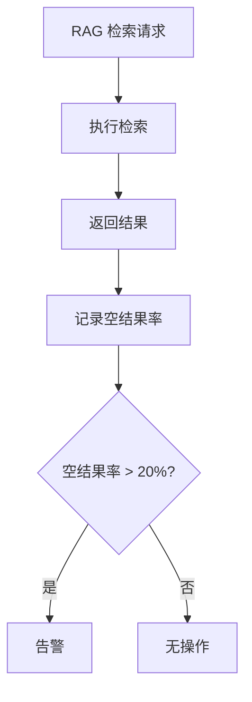
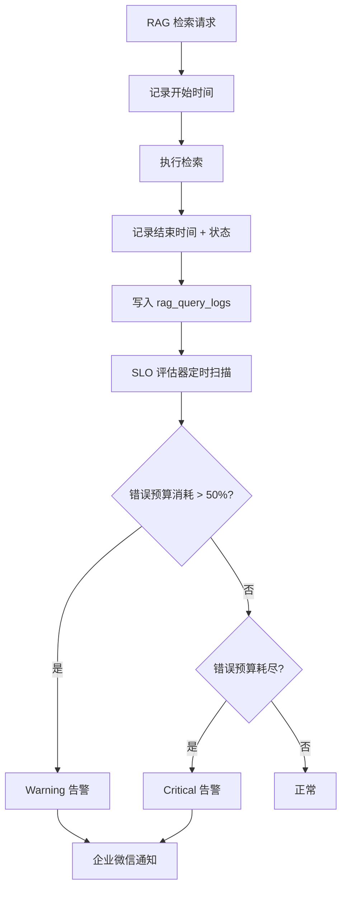

# YK-09-60: 知识库 RAG 检索延迟 SLO 定义与监控 — 服务质量等级协议

> 需求编号：YK-09-60 · 优先级：P2 · 人天：0.5d · 状态：需求已编写
> 依赖：YK-09-04（RAG 检索质量监控）、YK-09-68（延迟分位统计）

---

## 一、背景

### 1.1 问题陈述

RAG 检索是 YiVad 和 YiPet 的核心依赖——每次 AI 聊天、知识搜索、Agent 推理都依赖 RAG 检索结果。然而，当前监控体系存在以下盲区：

- **只有"空结果率"指标**：知道检索有没有返回结果，但不知道返回得快不快
- **无延迟分位统计**：P50/P95/P99 延迟未知，无法评估用户体验
- **无错误预算概念**：不知道还有多少"犯错空间"，无法做风险决策
- **无 SLO 告警**：延迟超标时无人知晓，直到用户投诉

### 1.2 影响范围

| 影响维度 | 具体表现 | 严重程度 |
|----------|----------|----------|
| 用户体验 | 检索慢（> 3s）时用户放弃等待，转向其他工具 | 高 |
| Agent 推理 | Agent 循环中每次 RAG 调用慢，整体推理延迟放大 5-10x | 高 |
| 故障发现 | 延迟劣化无法及时发现，故障持续数小时 | 高 |
| 容量规划 | 不知道当前资源利用率，无法预判扩容时机 | 中 |
| 发布信心 | 新版本上线后无法量化延迟变化，缺乏回滚决策依据 | 中 |

### 1.3 核心挑战

| 挑战 | 说明 |
|------|------|
| 多场景 SLO | 纯检索 vs 聊天检索 vs 代码检索，延迟特征不同，需要分开定义 |
| 错误预算计算 | 如何定义"错误"，如何计算预算消耗率 |
| 告警阈值 | 太敏感→告警疲劳，太迟钝→故障漏报 |
| 数据采集 | 在不影响检索性能的前提下采集延迟数据 |

---

## 二、现状分析

### 2.1 当前监控流程



### 2.2 根因矩阵

| 根因 | 贡献比例 | 解决难度 | 优先级 |
|------|----------|----------|--------|
| 无延迟采集 | 40% | 低（加日志即可） | P0 |
| 无 SLO 定义 | 30% | 中（需业务对齐） | P0 |
| 无分位统计 | 15% | 低 | P1 |
| 无错误预算 | 10% | 中 | P1 |
| 无告警联动 | 5% | 低 | P2 |

### 2.3 当前数据盲区

| 维度 | 已知 | 未知 |
|------|------|------|
| 检索量 | 日均 2000 次 | 按小时分布 |
| 空结果率 | 12% | 按查询类型分布 |
| 延迟 | 不知道 | P50/P95/P99 全部未知 |
| 错误率 | 不知道 | 5xx/超时 全部未知 |
| 可用性 | 不知道 | 99.x% 未知 |

---

## 三、设计决策

### D-01: SLO 目标值设定

| 方案 | rag_query P95 | rag_chat P95 | 错误预算 | 结论 |
|------|--------------|-------------|----------|------|
| A: 宽松 | < 2s | < 5s | 10% | 太宽松，无约束力 |
| B: 适中 | < 1s | < 3s | 5% | **推荐** |
| C: 严格 | < 500ms | < 1s | 1% | 当前基础设施难达成 |

**决策**：选择方案 B（适中），理由：
- P95 < 1s 对纯检索是可达成目标（当前估计 800ms）
- P95 < 3s 对聊天检索（含 LLM 首 token）合理
- 5% 错误预算给运维留出缓冲空间

### D-02: 错误预算计算方式

| 方案 | 描述 | 准确性 | 复杂度 | 结论 |
|------|------|--------|--------|------|
| A: 超 P95 阈值即错误 | 超过 P95 目标的请求算错误 | 中 | 低 | **推荐** |
| B: 时间窗口内错误率 | 滑动窗口内错误请求占比 | 高 | 中 | 备选 |
| C: 燃尽率 | 按时间比例消耗预算 | 最高 | 高 | 未来优化 |

**决策**：选择方案 A（超 P95 阈值即错误），理由：
- 直观易懂——"P95 超过 1s 就算一次错误"
- 实现简单——无需复杂的滑动窗口计算
- 与 Google SRE 的错误预算定义一致

### D-03: 告警策略

| 方案 | 描述 | 灵敏度 | 告警疲劳 | 结论 |
|------|------|--------|----------|------|
| A: 预算耗尽告警 | 错误预算消耗 > 阈值时告警 | 低 | 低 | 太迟钝 |
| B: 预算消耗率告警 | 消耗速率 > 预期时提前告警 | 中 | 中 | **推荐** |
| C: 实时阈值告警 | 每次超阈值都告警 | 高 | 高 | 太敏感 |

**决策**：选择方案 B（预算消耗率告警），理由：
- 在预算耗尽前提前预警（如 1 小时内消耗了 50% 的日预算）
- 避免"预算耗尽才告警"的被动局面
- 结合预算剩余比例告警（剩余 < 20%）

---

## 四、目标架构

### 4.1 目标监控流程



### 4.2 指标目标

| 指标 | 当前值 | 目标值 | 测量方法 |
|------|--------|--------|----------|
| rag_query P95 | 未知 | < 1000ms | 延迟分位统计 |
| rag_query P99 | 未知 | < 3000ms | 延迟分位统计 |
| rag_chat P95 | 未知 | < 3000ms | 延迟分位统计 |
| rag_chat 错误预算 | 未知 | < 5% | 超 P95 比例 |
| SLO 达标率 (月) | 未知 | > 99.5% | 月度统计 |

---

## 五、具体改动

### 5.1 核心实现

```python
# YiAi/src/domain/rag/slo_monitor.py

import time
import asyncio
from dataclasses import dataclass, field
from enum import Enum

class AlertLevel(Enum):
    INFO = "info"
    WARNING = "warning"
    CRITICAL = "critical"

@dataclass
class SloDefinition:
    """SLO 定义。"""
    name: str
    p50_target_ms: int
    p95_target_ms: int
    p99_target_ms: int
    error_budget_percent: float  # 错误预算百分比
    description: str = ""

class RagSloMonitor:
    """RAG 检索 SLO 监控——延迟分位 + 错误预算 + 告警。"""

    SLO_DEFINITIONS = {
        'rag_query': SloDefinition(
            name='rag_query',
            p50_target_ms=200,
            p95_target_ms=1000,
            p99_target_ms=3000,
            error_budget_percent=5.0,
            description='纯检索查询（不含 LLM 调用）',
        ),
        'rag_chat': SloDefinition(
            name='rag_chat',
            p50_target_ms=500,
            p95_target_ms=3000,
            p99_target_ms=8000,
            error_budget_percent=10.0,
            description='聊天检索（含 LLM 首 token 延迟）',
        ),
        'rag_code': SloDefinition(
            name='rag_code',
            p50_target_ms=300,
            p95_target_ms=1500,
            p99_target_ms=4000,
            error_budget_percent=5.0,
            description='代码检索查询',
        ),
    }

    # 告警阈值
    BUDGET_WARNING_THRESHOLD = 50.0   # 消耗 > 50% 时 Warning
    BUDGET_CRITICAL_THRESHOLD = 90.0  # 消耗 > 90% 时 Critical
    BURN_RATE_WARNING = 5.0           # 燃尽率 > 5x 时 Warning

    def __init__(self):
        self._alert_cooldown: dict[str, float] = {}  # 告警冷却

    async def record_query(self, slo_type: str, duration_ms: float,
                           success: bool = True, metadata: dict = None):
        """记录一次检索请求。

        Args:
            slo_type: 'rag_query' | 'rag_chat' | 'rag_code'
            duration_ms: 请求耗时（毫秒）
            success: 是否成功返回结果
            metadata: 额外元数据（查询词长度、Top-K 等）
        """
        await db.rag_query_logs.insert_one({
            'type': slo_type,
            'duration_ms': duration_ms,
            'success': success,
            'metadata': metadata or {},
            'timestamp': time.time(),
        })

    async def evaluate_slo(self, window_minutes: int = 60) -> dict:
        """评估最近 N 分钟的 SLO 达标情况。

        Returns:
            {
                'rag_query': {
                    'sample_size': 1245,
                    'p50_ms': 180,
                    'p95_ms': 850,
                    'p99_ms': 2100,
                    'p50_ok': True,
                    'p95_ok': True,
                    'p99_ok': True,
                    'error_budget_consumed': 2.1,
                    'status': 'healthy'
                },
                ...
            }
        """
        cutoff = time.time() - window_minutes * 60
        query_logs = await db.rag_query_logs.find({
            'timestamp': {'$gte': cutoff},
        }).to_list(None)

        results = {}
        for slo_key, slo_def in self.SLO_DEFINITIONS.items():
            logs = [l for l in query_logs if l.get('type') == slo_key]
            if not logs:
                results[slo_key] = {
                    'sample_size': 0,
                    'status': 'no_data',
                }
                continue

            latencies = sorted([l['duration_ms'] for l in logs])
            n = len(latencies)

            p50 = latencies[int(n * 0.50)] if n > 0 else 0
            p95 = latencies[int(n * 0.95)] if n > 0 else 0
            p99 = latencies[int(n * 0.99)] if n > 0 else 0

            # 错误预算消耗：超过 P95 目标的请求比例
            over_p95 = sum(1 for l in latencies if l > slo_def.p95_target_ms)
            budget_consumed = round(over_p95 / n * 100, 1) if n > 0 else 0

            # 状态判断
            if budget_consumed <= slo_def.error_budget_percent:
                status = 'healthy'
            elif budget_consumed <= slo_def.error_budget_percent * 2:
                status = 'degraded'
            else:
                status = 'critical'

            results[slo_key] = {
                'sample_size': n,
                'p50_ms': p50,
                'p95_ms': p95,
                'p99_ms': p99,
                'p50_ok': p50 <= slo_def.p50_target_ms,
                'p95_ok': p95 <= slo_def.p95_target_ms,
                'p99_ok': p99 <= slo_def.p99_target_ms,
                'error_budget_consumed': budget_consumed,
                'error_budget_limit': slo_def.error_budget_percent,
                'status': status,
            }

        return results

    async def check_and_alert(self):
        """检查 SLO 并触发告警。"""
        results = await self.evaluate_slo(window_minutes=60)

        for slo_key, metrics in results.items():
            if metrics.get('status') == 'no_data':
                continue

            slo_def = self.SLO_DEFINITIONS[slo_key]
            budget_consumed = metrics['error_budget_consumed']

            # 冷却检查：同一 SLO 类型 5 分钟内不重复告警
            cooldown_key = f"{slo_key}_alert"
            if cooldown_key in self._alert_cooldown:
                if time.time() - self._alert_cooldown[cooldown_key] < 300:
                    continue

            if budget_consumed > self.BUDGET_CRITICAL_THRESHOLD:
                await self._send_alert(
                    AlertLevel.CRITICAL,
                    slo_key,
                    f"错误预算消耗 {budget_consumed}% > {self.BUDGET_CRITICAL_THRESHOLD}%",
                    metrics
                )
                self._alert_cooldown[cooldown_key] = time.time()

            elif budget_consumed > self.BUDGET_WARNING_THRESHOLD:
                await self._send_alert(
                    AlertLevel.WARNING,
                    slo_key,
                    f"错误预算消耗 {budget_consumed}% > {self.BUDGET_WARNING_THRESHOLD}%",
                    metrics
                )
                self._alert_cooldown[cooldown_key] = time.time()

    async def _send_alert(self, level: AlertLevel, slo_key: str,
                          message: str, metrics: dict):
        """发送告警。"""
        slo_def = self.SLO_DEFINITIONS[slo_key]

        alert_msg = (
            f"[RAG SLO] {level.value.upper()}: {slo_key}\n"
            f"{message}\n"
            f"P50={metrics['p50_ms']}ms (目标 <{slo_def.p50_target_ms}ms)\n"
            f"P95={metrics['p95_ms']}ms (目标 <{slo_def.p95_target_ms}ms)\n"
            f"P99={metrics['p99_ms']}ms (目标 <{slo_def.p99_target_ms}ms)\n"
            f"样本数: {metrics['sample_size']}\n"
            f"错误预算: {metrics['error_budget_consumed']}%/{slo_def.error_budget_percent}%"
        )

        logger.warning(alert_msg)

        # 发送到告警路由
        await alert_router.alert(
            level=level,
            title=f"RAG SLO 告警: {slo_key}",
            message=alert_msg,
        )

    async def get_monthly_slo_report(self) -> dict:
        """获取月度 SLO 报告。"""
        month_start = time.time() - 30 * 86400
        query_logs = await db.rag_query_logs.find({
            'timestamp': {'$gte': month_start},
        }).to_list(None)

        report = {}
        for slo_key, slo_def in self.SLO_DEFINITIONS.items():
            logs = [l for l in query_logs if l.get('type') == slo_key]
            if not logs:
                continue

            total = len(logs)
            latencies = [l['duration_ms'] for l in logs]
            over_p95 = sum(1 for l in latencies if l > slo_def.p95_target_ms)
            failed = sum(1 for l in logs if not l.get('success', True))

            report[slo_key] = {
                'total_requests': total,
                'p50_ms': sorted(latencies)[int(total * 0.50)] if total > 0 else 0,
                'p95_ms': sorted(latencies)[int(total * 0.95)] if total > 0 else 0,
                'p99_ms': sorted(latencies)[int(total * 0.99)] if total > 0 else 0,
                'slo_violations': over_p95,
                'slo_violation_rate': round(over_p95 / total * 100, 2),
                'failure_rate': round(failed / total * 100, 2),
                'slo_met': (over_p95 / total * 100) <= slo_def.error_budget_percent if total > 0 else True,
                'availability': round((total - failed) / total * 100, 2) if total > 0 else 100,
            }

        return report

    async def get_budget_burn_rate(self, slo_key: str,
                                    window_minutes: int = 60) -> float:
        """计算错误预算燃尽率（相对于线性消耗）。"""
        results = await self.evaluate_slo(window_minutes=window_minutes)
        metrics = results.get(slo_key, {})

        if metrics.get('sample_size', 0) == 0:
            return 0.0

        slo_def = self.SLO_DEFINITIONS[slo_key]
        # 线性消耗率 = 消耗比例 / 时间窗口比例
        expected_rate = window_minutes / (30 * 24 * 60)  # 30 天月
        actual_rate = metrics['error_budget_consumed'] / 100

        if expected_rate == 0:
            return 0.0

        return actual_rate / expected_rate  # > 1.0 表示消耗快于预期
```

### 5.2 SLO 仪表盘 API

```python
@router.get("/rag/slo/status")
async def get_slo_status(window_minutes: int = 60):
    """获取当前 SLO 状态。"""
    monitor = get_slo_monitor()
    results = await monitor.evaluate_slo(window_minutes)
    return success_response(results)

@router.get("/rag/slo/report/monthly")
async def get_monthly_report():
    """获取月度 SLO 报告。"""
    monitor = get_slo_monitor()
    report = await monitor.get_monthly_slo_report()
    return success_response(report)

@router.get("/rag/slo/burn-rate")
async def get_burn_rate(slo_key: str = 'rag_query'):
    """获取错误预算燃尽率。"""
    monitor = get_slo_monitor()
    rate = await monitor.get_budget_burn_rate(slo_key)
    return success_response({'slo_key': slo_key, 'burn_rate': rate})
```

### 5.3 中间件集成

```python
# YiAi/src/middleware/slo_middleware.py

from fastapi import Request
import time

async def slo_middleware(request: Request, call_next):
    """SLO 中间件——自动记录 RAG 检索延迟。"""
    # 只监控 RAG 相关路径
    if not request.url.path.startswith('/rag/'):
        return await call_next(request)

    start = time.monotonic()
    slo_type = 'rag_query'

    # 根据路径判断 SLO 类型
    if 'chat' in request.url.path:
        slo_type = 'rag_chat'
    elif 'code' in request.url.path:
        slo_type = 'rag_code'

    try:
        response = await call_next(request)
        duration_ms = (time.monotonic() - start) * 1000

        # 记录到 SLO 监控
        monitor = get_slo_monitor()
        await monitor.record_query(
            slo_type=slo_type,
            duration_ms=duration_ms,
            success=response.status_code < 500,
        )

        return response
    except Exception as e:
        duration_ms = (time.monotonic() - start) * 1000
        monitor = get_slo_monitor()
        await monitor.record_query(
            slo_type=slo_type,
            duration_ms=duration_ms,
            success=False,
        )
        raise
```

### 5.4 文件变更清单

| 文件路径 | 操作 | 说明 |
|----------|------|------|
| `YiAi/src/domain/rag/slo_monitor.py` | 新增 | SLO 监控核心 |
| `YiAi/src/middleware/slo_middleware.py` | 新增 | FastAPI 中间件自动记录延迟 |
| `YiAi/main.py` | 修改 | 注册 SLO 中间件 + 定时评估任务 |
| MongoDB | 新增集合 | `rag_query_logs`（TTL 索引 90 天） |

---

## 六、实施步骤

| 步骤 | 内容 | 验证方式 | 预计人天 |
|------|------|----------|----------|
| 1 | 实现 SLO 日志记录（中间件） | 查询 rag_query_logs 有数据 | 0.5d |
| 2 | 实现 SLO 评估器（分位计算 + 错误预算） | 单元测试验证分位计算正确 | 0.5d |
| 3 | 实现告警逻辑（消耗率 + 阈值） | 模拟高延迟触发告警 | 0.5d |
| 4 | 实现 SLO API 端点 | 集成测试返回正确分位数据 | 0.5d |
| 5 | 配置 Grafana 仪表盘 | 可视化 P50/P95/P99 + 错误预算 | 0.5d |
| 6 | 观察 1 周，调整 SLO 阈值 | 基于实际数据微调 | 0.5d |

**总人天**：约 3.0d

---

## 七、性能分析

| 操作 | 开销 | 说明 |
|------|------|------|
| 中间件记录延迟 | < 1ms | 仅记录时间戳 + MongoDB 异步写入 |
| SLO 评估（60 分钟窗口） | < 50ms | 查询 + 内存排序 |
| 月度报告生成 | < 200ms | 30 天数据聚合 |
| MongoDB 写入 | 异步 | 不阻塞检索请求 |

**MongoDB 存储估算**：
- 日均 2000 次查询 x 每条日志 200 bytes = 400KB/天
- 90 天 TTL = 约 36MB
- 可忽略不计

---

## 八、测试规格

```python
class TestRagSloMonitor:
    """GIVEN RagSloMonitor 实例"""

    async def test_p50_p95_p99_calculation(self):
        """GIVEN 100 条延迟记录 [100, 200, ..., 10000]
           WHEN 调用 evaluate_slo()
           THEN P50/P95/P99 计算正确"""

    async def test_error_budget_consumed_calculation(self):
        """GIVEN 100 条记录中 8 条超过 P95 目标
           WHEN 错误预算上限为 5%
           THEN error_budget_consumed = 8%
           AND status = 'degraded'"""

    async def test_alert_triggered_when_budget_exhausted(self):
        """GIVEN 错误预算消耗 > 90%
           WHEN 调用 check_and_alert()
           THEN 触发 CRITICAL 级别告警"""

    async def test_alert_cooldown_prevents_spam(self):
        """GIVEN 5 分钟内已触发过告警
           WHEN 再次触发同样 SLO 类型的告警
           THEN 不重复发送"""

    async def test_no_data_handled_gracefully(self):
        """GIVEN 最近 60 分钟无查询日志
           WHEN 调用 evaluate_slo()
           THEN 返回 status='no_data' 且不抛出异常"""

    async def test_burn_rate_calculation(self):
        """GIVEN 1 小时内消耗了 10% 的月预算
           WHEN 正常线性消耗应为 0.14%
           THEN burn_rate = ~71x（远高于正常水平）"""
```

---

## 九、风险与缓解

| 风险 | 概率 | 影响 | 缓解措施 |
|------|------|------|----------|
| 日志量过大导致 MongoDB 膨胀 | 低 | 中 | TTL 索引 90 天自动清理 |
| 中间件增加检索延迟 | 低 | 中 | 异步写入，不阻塞请求 |
| 告警疲劳 | 中 | 中 | 5 分钟冷却 + 消耗率告警（非每次超标） |
| SLO 阈值不合理 | 中 | 低 | 观察 1 周实际数据后微调 |

---

## 十、回滚策略

| 场景 | 触发条件 | 回滚操作 |
|------|----------|----------|
| 中间件性能影响 | P50 延迟增加 > 10ms | 禁用 SLO 中间件 |
| MongoDB 写入压力 | 写入延迟 > 100ms | 降低日志采样率到 10% |
| 告警风暴 | 1 小时内 > 20 条告警 | 暂停告警，分析根因 |

---

## 十一、设计决策记录

| 编号 | 决策 | 理由 | 替代方案 |
|------|------|------|----------|
| D-01 | P95 < 1000ms 作为 rag_query SLO | 平衡用户体验和技术可行性 | P95 < 500ms（过严） |
| D-02 | 超 P95 阈值即计入错误预算 | 与 Google SRE 一致，简单直观 | 时间窗口错误率（复杂） |
| D-03 | 消耗率告警（非耗尽告警） | 提前预警，避免被动 | 耗尽告警（太晚） |
| D-04 | 5 分钟告警冷却 | 防止告警风暴 | 无冷却（告警疲劳） |

---

## 十二、可观测性

| 指标名称 | 类型 | 说明 | 告警阈值 |
|----------|------|------|----------|
| `rag_query_p95_ms` | Gauge | rag_query P95 延迟 | > 1000ms |
| `rag_query_error_budget_remaining` | Gauge | 剩余错误预算百分比 | < 20% |
| `rag_query_burn_rate` | Gauge | 错误预算燃尽率 | > 5x |
| `rag_query_sample_count` | Gauge | 评估窗口内样本数 | < 10（样本不足） |
| `rag_slo_monthly_availability` | Gauge | 月度可用性 | < 99.5% |

---

## 十三、安全合规

| 要求 | 实现 |
|------|------|
| 查询内容不记录 | 日志仅记录延迟、类型、时间戳，不记录查询词 |
| 日志保留策略 | TTL 索引 90 天自动清理 |
| 告警通道安全 | 企业微信告警走内部 API |

---

## 十四、代码审查检查清单

- [ ] SLO 定义覆盖 rag_query / rag_chat / rag_code 三种场景
- [ ] 中间件异步记录延迟，不阻塞检索请求
- [ ] 分位计算使用排序后索引（P50=n*0.50, P95=n*0.95, P99=n*0.99）
- [ ] 错误预算 = 超 P95 目标的请求数 / 总请求数
- [ ] 告警有 5 分钟冷却机制
- [ ] 燃尽率 > 5x 时触发 Warning
- [ ] 月度报告包含可用性、SLO 达标率、失败率
- [ ] rag_query_logs 有 TTL 索引（90 天）
- [ ] 查询日志不记录查询内容（仅类型、延迟、时间戳）
- [ ] SLO API 支持自定义时间窗口

---

*PRD 来源: `projects/yiknowledge/requirements/2026-09/60-需求-RAG检索SLO监控.md`*