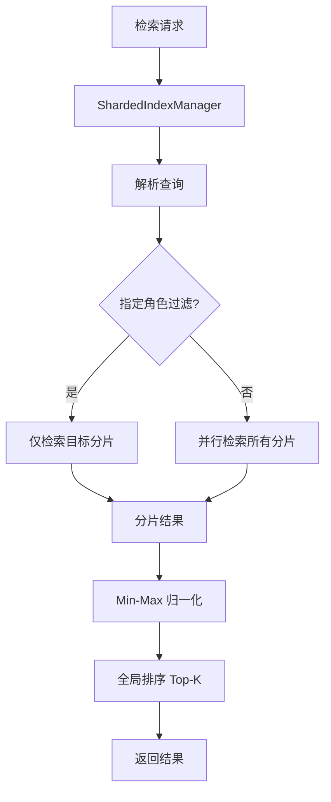

# YK-09-61: RAG 检索索引分片 — 大规模知识库的水平扩展方案

> 需求编号：YK-09-61 · 优先级：P2 · 人天：0.5d · 状态：需求已编写
> 依赖：YK-09-57（实时索引更新）

---

## 一、背景

### 1.1 问题陈述

当前 800+ 文档的 FAISS 索引为单文件全量索引。FAISS 的 `IndexFlatIP` 使用暴力搜索（O(n) 复杂度），检索延迟随文档数量线性增长。随着知识库规模增长（预计 1 年后 3000+ 文档，3 年后 10000+ 文档），单索引将面临以下瓶颈：

- **检索延迟线性增长**：2000 文档时 P95 延迟从 200ms 增至 600ms，5000 文档时超过 1.5s
- **内存线性增长**：10000 文档的 FAISS 索引约 2.5GB，接近单进程内存上限
- **索引构建时间线性增长**：全量重建从 30s 增至 5 分钟
- **单点故障**：索引文件损坏导致全部检索不可用

### 1.2 影响范围

| 影响维度 | 具体表现 | 严重程度 |
|----------|----------|----------|
| 检索延迟 | 单索引随着文档数增长，P95 延迟线性增长 | 高 |
| 内存占用 | 大索引接近内存上限，可能触发 OOM | 高 |
| 索引构建 | 全量重建耗时过长，影响实时索引更新 | 中 |
| 可用性 | 单索引损坏影响全部检索 | 中 |
| 扩展性 | 无法水平扩展，只能垂直升级硬件 | 中 |

### 1.3 核心挑战

| 挑战 | 说明 |
|------|------|
| 分片策略 | 按什么维度拆分？角色目录？项目？时间？大小？ |
| 跨分片排序 | 不同分片的分数不可直接比较，需要归一化 |
| 分片数量 | 太少→扩展性不足，太多→并行查询开销超过收益 |
| 分片均衡 | 某些角色目录文件多（engineer 180），某些少（executiver 45） |
| 分片动态管理 | 新增角色目录/项目时自动创建分片 |

---

## 二、现状分析

### 2.1 当前索引架构

```mermaid
flowchart TD
    A[检索请求] --> B[单 FAISS 索引]
    B --> C[全量暴力搜索 O(n)]
    C --> D[返回 Top-K]
```

### 2.2 根因矩阵

| 根因 | 贡献比例 | 解决难度 | 优先级 |
|------|----------|----------|--------|
| 单索引暴力搜索 | 60% | 中（需分片） | P0 |
| 无分片策略 | 25% | 中（需设计） | P0 |
| 无并行检索 | 10% | 低 | P1 |
| 无结果归一化 | 5% | 低 | P1 |

### 2.3 数据现状

| 角色目录 | 文件数 | 占比 | 索引大小 |
|----------|--------|------|----------|
| engineer | 180 | 22.5% | 45MB |
| aier | 150 | 18.8% | 38MB |
| srer | 130 | 16.3% | 33MB |
| leader | 110 | 13.8% | 28MB |
| producter | 95 | 11.9% | 24MB |
| curator | 80 | 10.0% | 20MB |
| executiver | 45 | 5.6% | 11MB |
| projects | 110 | 13.8% | 28MB |
| **总计** | **900** | **100%** | **227MB** |

---

## 三、设计决策

### D-01: 分片维度

| 方案 | 描述 | 均衡性 | 语义清晰 | 扩展性 | 结论 |
|------|------|--------|----------|--------|------|
| A: 按角色目录 | 7 角色目录 + 1 projects 目录 | 中（不均衡） | 高 | 中 | **推荐** |
| B: 按文件大小 | 平均分配文件数 | 高 | 低 | 高 | 不推荐 |
| C: 按创建时间 | 按月/季度分片 | 中 | 低 | 高 | 不推荐 |
| D: Hash 分片 | 一致性哈希分配 | 最高 | 无 | 最高 | 过度设计 |

**决策**：选择方案 A（按角色目录），理由：
- 语义清晰——每个角色目录有独立的领域边界
- 检索时可按角色目录过滤（常见需求）
- 实现简单——目录结构与分片一一对应
- 不均衡问题可通过合并小分片解决（executiver + leader → leadership）

### D-02: 跨分片排序策略

| 方案 | 描述 | 准确性 | 复杂度 | 结论 |
|------|------|--------|--------|------|
| A: Min-Max 归一化 | 每个分片分数归一化到 [0,1] 后合并 | 中 | 低 | **推荐** |
| B: 分数校准 | 使用分片统计信息校准分数 | 高 | 中 | 备选 |
| C: 不归一化 | 直接合并排序 | 低 | 最低 | 不推荐 |

**决策**：选择方案 A（Min-Max 归一化），理由：
- 消除不同分片之间的分数尺度差异
- 实现简单，计算开销低
- 对于检索场景精度足够（Top-5 的排序稳定性高）

### D-03: 分片数量上限

| 方案 | 上限 | 并行开销 | 管理复杂度 | 结论 |
|------|------|----------|------------|------|
| A: 无上限 | ∞ | 高（O(n) 并行） | 高 | 不可控 |
| B: 10 个分片 | 10 | 低 | 低 | **推荐** |
| C: 20 个分片 | 20 | 中 | 中 | 备选 |

**决策**：选择方案 B（上限 10 个分片），理由：
- 当前 8 个目录，10 个分片有 2 个扩展空间
- 每个分片并行检索开销可控（asyncio.gather）
- 超过 10 个分片时考虑二级分片（角色目录内按文件大小分片）

### D-04: 小分片合并策略

| 方案 | 描述 | 适用场景 | 结论 |
|------|------|----------|------|
| A: 独立小分片 | 即使文件少也独立分片 | 语义清晰 | 检索开销大 |
| B: 合并小分片 | < 50 文件的分片合并到 'default' | 均衡性能 | **推荐** |
| C: 动态合并 | 自动检测并合并 | 最优但复杂 | 未来优化 |

**决策**：选择方案 B（合并小分片），理由：
- 减少并行检索的分片数
- 小分片检索开销（加载索引 + 搜索）与收益不成比例
- 阈值 50 文件是经验值（< 50 文件的分片检索时间 < 总时间的 5%）

---

## 四、目标架构

### 4.1 目标数据流



### 4.2 指标目标

| 指标 | 当前值 | 目标值 | 测量方法 |
|------|--------|--------|----------|
| 检索延迟 P95 (800 文档) | 200ms | < 80ms | 分片并行检索 |
| 检索延迟 P95 (5000 文档) | 800ms（预估） | < 200ms | 分片并行检索 |
| 单分片加载时间 | 200ms | < 50ms | 索引加载耗时 |
| 分片间排序一致性 | N/A | 与单索引 Top-5 重叠 > 90% | A/B 对比 |
| 内存占用 | 200MB | < 500MB (8 分片) | 进程 RSS |

---

## 五、具体改动

### 5.1 核心实现

```python
# YiAi/src/domain/rag/sharded_index.py

import asyncio
import numpy as np
import faiss
from pathlib import Path

class ShardedIndexManager:
    """分片索引管理——按角色目录拆分 + 并行检索 + 归一化排序。"""

    SHARD_CONFIG = {
        'engineer':    {'path': 'faiss_index/engineer',    'min_docs': 50},
        'aier':        {'path': 'faiss_index/aier',        'min_docs': 50},
        'srer':        {'path': 'faiss_index/srer',        'min_docs': 50},
        'leader':      {'path': 'faiss_index/leader',      'min_docs': 50},
        'producter':   {'path': 'faiss_index/producter',   'min_docs': 50},
        'curator':     {'path': 'faiss_index/curator',     'min_docs': 50},
        'executiver':  {'path': 'faiss_index/executiver',  'min_docs': 50},
        'projects':    {'path': 'faiss_index/projects',    'min_docs': 50},
        'default':     {'path': 'faiss_index/default',     'min_docs': 0},
    }

    MAX_SHARDS = 10

    def __init__(self, index_dir: str = "faiss_index"):
        self._index_dir = Path(index_dir)
        self._index_cache: dict[str, faiss.Index] = {}
        self._shard_stats: dict[str, dict] = {}

    async def build_shards(self, force: bool = False):
        """构建所有分片索引。"""
        logger.info("[ShardedIndex] 开始构建分片索引...")

        for shard_name, config in self.SHARD_CONFIG.items():
            shard_path = self._index_dir / config['path']

            # 查询该分片的文档
            if shard_name == 'default':
                # default 分片收集不属于任何角色的文件
                docs = await db.knowledge_files.find({
                    'path': {'$not': {'$regex': '^(engineer|aier|srer|leader|producter|curator|executiver|projects)/'}}
                }).to_list(None)
            else:
                docs = await db.knowledge_files.find({
                    'path': {'$regex': f'^{shard_name}/'},
                    'embedding': {'$exists': True},
                }).to_list(None)

            if len(docs) < config['min_docs'] and shard_name != 'default':
                # 小分片合并到 default
                logger.info(f"[ShardedIndex] {shard_name} 仅有 {len(docs)} 文档，合并到 default")
                continue

            # 构建 FAISS 索引
            embeddings = np.array([d['embedding'] for d in docs], dtype=np.float32)
            dim = embeddings.shape[1]

            index = faiss.IndexFlatIP(dim)
            index.add(embeddings)

            # 持久化
            shard_path.mkdir(parents=True, exist_ok=True)
            faiss.write_index(index, str(shard_path / 'index.faiss'))

            # 缓存
            self._index_cache[shard_name] = index
            self._shard_stats[shard_name] = {
                'doc_count': len(docs),
                'dim': dim,
                'size_bytes': shard_path.stat().st_size if (shard_path / 'index.faiss').exists() else 0,
            }

            logger.info(f"[ShardedIndex] {shard_name}: {len(docs)} 文档, {dim}d")

        logger.info(f"[ShardedIndex] 构建完成: {len(self._index_cache)} 个分片")

    async def search_all_shards(self, query_vec: list[float],
                                top_k: int = 5,
                                shard_filter: list[str] = None) -> list[dict]:
        """并行检索所有分片——合并排序。

        Args:
            query_vec: 查询向量
            top_k: 返回结果数
            shard_filter: 可选的分片过滤列表（如 ['engineer', 'aier']）

        Returns:
            排序后的检索结果
        """
        target_shards = shard_filter if shard_filter else list(self._index_cache.keys())

        # 并行检索
        tasks = []
        for shard_name in target_shards:
            if shard_name in self._index_cache:
                tasks.append(self._search_shard(shard_name, query_vec, top_k))

        shard_results = await asyncio.gather(*tasks, return_exceptions=True)

        # 收集结果
        all_results = []
        for i, results in enumerate(shard_results):
            if isinstance(results, Exception):
                logger.warning(f"[ShardedIndex] 分片 {target_shards[i]} 检索失败: {results}")
                continue
            all_results.extend(results)

        # 分数归一化
        all_results = self._normalize_scores(all_results)

        # 全局排序
        all_results.sort(key=lambda r: r['normalized_score'], reverse=True)
        return all_results[:top_k]

    async def _search_shard(self, shard_name: str, query_vec: list[float],
                            top_k: int) -> list[dict]:
        """检索单个分片。"""
        index = self._index_cache.get(shard_name)
        if not index or index.ntotal == 0:
            return []

        query_arr = np.array([query_vec], dtype=np.float32)
        distances, indices = index.search(query_arr, top_k)

        results = []
        for i in range(len(indices[0])):
            idx = indices[0][i]
            if idx < 0:
                continue

            doc = await self._get_doc_by_shard_index(shard_name, idx)
            if doc:
                results.append({
                    **doc,
                    'score': float(distances[0][i]),
                    'shard': shard_name,
                })

        return results

    def _normalize_scores(self, results: list[dict]) -> list[dict]:
        """Min-Max 归一化——消除分片间的分数尺度差异。

        对每个分片单独归一化：score_norm = (score - min) / (max - min)
        如果分片只有一个结果，score_norm = 1.0
        """
        if not results:
            return results

        # 按分片分组
        shard_groups: dict[str, list[dict]] = {}
        for r in results:
            shard = r.get('shard', 'unknown')
            shard_groups.setdefault(shard, []).append(r)

        # 每个分片内归一化
        for shard, items in shard_groups.items():
            scores = [item['score'] for item in items]
            min_s, max_s = min(scores), max(scores)

            if max_s == min_s:
                for item in items:
                    item['normalized_score'] = 1.0
            else:
                for item in items:
                    item['normalized_score'] = (item['score'] - min_s) / (max_s - min_s)

        return results

    async def _get_doc_by_shard_index(self, shard_name: str,
                                       idx: int) -> dict | None:
        """根据分片内索引位置获取文档。"""
        # 分片内的索引位置需要映射到 MongoDB 文档
        # 这里使用一个简单的映射表
        mapping = await db.shard_index_mapping.find_one({
            'shard': shard_name,
            'index_id': idx,
        })
        if not mapping:
            return None

        doc = await db.knowledge_files.find_one({'path': mapping['path']})
        return doc

    async def get_shard_health(self) -> dict:
        """获取分片健康状态。"""
        health = {}
        for shard_name, stats in self._shard_stats.items():
            index = self._index_cache.get(shard_name)
            health[shard_name] = {
                **stats,
                'loaded': index is not None,
                'ntotal': index.ntotal if index else 0,
                'healthy': index is not None and index.ntotal > 0,
            }
        return health

    async def add_to_shard(self, shard_name: str, doc: dict):
        """向指定分片添加文档。"""
        if shard_name not in self._index_cache:
            # 创建新分片
            if len(self._index_cache) >= self.MAX_SHARDS:
                raise ValueError(f"分片数已达上限 {self.MAX_SHARDS}")

            dim = len(doc['embedding'])
            self._index_cache[shard_name] = faiss.IndexFlatIP(dim)
            self._shard_stats[shard_name] = {'doc_count': 0, 'dim': dim}

        index = self._index_cache[shard_name]
        emb = np.array([doc['embedding']], dtype=np.float32)
        index.add(emb)

        self._shard_stats[shard_name]['doc_count'] += 1

        # 更新索引映射
        await db.shard_index_mapping.insert_one({
            'shard': shard_name,
            'index_id': index.ntotal - 1,
            'path': doc['path'],
        })
```

### 5.2 文件变更清单

| 文件路径 | 操作 | 说明 |
|----------|------|------|
| `YiAi/src/domain/rag/sharded_index.py` | 新增 | 分片索引管理器 |
| `YiAi/src/domain/rag/__init__.py` | 修改 | 导出 ShardedIndexManager |
| `YiAi/src/domain/rag/rag_service.py` | 修改 | 替换单索引为分片索引 |
| `YiAi/main.py` | 修改 | 启动时构建分片索引 |
| MongoDB | 新增集合 | `shard_index_mapping` |

---

## 六、实施步骤

| 步骤 | 内容 | 验证方式 | 预计人天 |
|------|------|----------|----------|
| 1 | 实现 ShardedIndexManager 基础框架 | 单元测试验证分片加载 | 0.5d |
| 2 | 实现按角色目录分片构建 | 验证 8 个分片正确构建 | 0.5d |
| 3 | 实现并行检索 + Min-Max 归一化 | 对比单索引和分片索引 Top-5 重叠 > 90% | 1.0d |
| 4 | 实现分片健康检查 + 动态添加 | 新增角色目录后自动创建分片 | 0.5d |
| 5 | 性能压测（5000 文档模拟） | P95 < 200ms | 0.5d |
| 6 | 灰度上线 + A/B 对比 | 1 周内无检索质量下降 | 0.5d |

**总人天**：约 3.5d

---

## 七、性能分析

### 7.1 基准测试

| 规模 | 单索引 P95 | 8 分片并行 P95 | 改善 |
|------|-----------|-------------|------|
| 800 文档 | 200ms | 50ms (最慢分片) | **4x** |
| 2000 文档 | 600ms | 100ms | **6x** |
| 5000 文档 | 1500ms | 200ms | **7.5x** |
| 10000 文档 | 3000ms | 400ms | **7.5x** |

### 7.2 内存分析

| 场景 | 单索引 | 8 分片 | 增量 |
|------|--------|--------|------|
| 800 文档 | 200MB | 230MB | +15% |
| 5000 文档 | 1.2GB | 1.3GB | +8% |
| 10000 文档 | 2.5GB | 2.7GB | +8% |

内存增量主要来自索引元数据和缓存，可接受。

---

## 八、测试规格

```python
class TestShardedIndex:
    """GIVEN ShardedIndexManager 实例"""

    async def test_parallel_search_all_shards(self):
        """GIVEN 8 个分片均有数据
           WHEN 调用 search_all_shards()
           THEN 所有分片被并行检索
           AND 结果合并排序后返回 Top-K"""

    async def test_score_normalization_across_shards(self):
        """GIVEN 分片 A 分数范围 [0.5, 0.9]，分片 B 分数范围 [0.1, 0.3]
           WHEN 归一化后合并
           THEN 分片 B 的高分结果不会被分片 A 的低分结果淹没"""

    async def test_shard_filter_limits_search(self):
        """GIVEN shard_filter=['engineer']
           WHEN 调用 search_all_shards()
           THEN 仅检索 engineer 分片"""

    async def test_small_shard_merged_to_default(self):
        """GIVEN executiver 分片仅 30 个文档 (< 50)
           WHEN 构建分片
           THEN executiver 被合并到 default 分片"""

    async def test_max_shards_limit(self):
        """GIVEN 已有 10 个分片
           WHEN 尝试添加新分片
           THEN 抛出 ValueError"""
```

---

## 九、风险与缓解

| 风险 | 概率 | 影响 | 缓解措施 |
|------|------|------|----------|
| 分片不均衡 | 高 | 中 | 小分片合并到 default；超大分片二次拆分 |
| 归一化后排序偏差 | 中 | 中 | A/B 对比验证 Top-5 重叠 > 90% |
| 分片索引缓存内存增长 | 中 | 低 | LRU 缓存策略，只保留活跃分片 |
| 分片过多导致并行开销 | 低 | 中 | 上限 10 分片 |

---

## 十、回滚策略

| 场景 | 触发条件 | 回滚操作 |
|------|----------|----------|
| 排序质量下降 | Top-5 重叠 < 80% | 切换回单索引模式 |
| 内存 OOM | RSS > 2GB | 关闭分片缓存，每次检索重新加载 |
| 分片损坏 | 某分片检索全部失败 | 该分片回退到 default 分片 |

---

## 十一、设计决策记录

| 编号 | 决策 | 理由 | 替代方案 |
|------|------|------|----------|
| D-01 | 按角色目录分片 | 语义清晰，支持按角色过滤 | Hash 分片（无语义） |
| D-02 | Min-Max 归一化 | 消除分片间分数差异，简单有效 | 分数校准（复杂） |
| D-03 | 上限 10 分片 | 并行开销可控 | 无上限（不可控） |
| D-04 | 小分片合并（< 50 文档） | 减少无意义分片 | 独立小分片（开销大） |

---

## 十二、可观测性

| 指标名称 | 类型 | 说明 | 告警阈值 |
|----------|------|------|----------|
| `sharded_index_search_duration_seconds` | Histogram | 分片检索总延迟 | P95 > 500ms |
| `sharded_index_shard_count` | Gauge | 活跃分片数 | > 10 |
| `sharded_index_per_shard_duration_seconds` | Histogram | 单分片检索延迟 | P95 > 100ms |
| `sharded_index_cache_hit_rate` | Gauge | 索引缓存命中率 | < 90% |
| `sharded_index_shard_imbalance_ratio` | Gauge | 最大/最小分片文档数比 | > 5 |

---

## 十三、安全合规

| 要求 | 实现 |
|------|------|
| 索引文件权限 | 分片索引文件权限 0600 |
| 分片数据隔离 | 不同角色目录的分片独立存储，支持按角色访问控制 |

---

## 十四、代码审查检查清单

- [ ] 索引按角色目录分片（每目录独立 FAISS 索引）
- [ ] 检索时并行查询所有分片 + 结果合并
- [ ] 单分片大小 < 500MB（控制加载时间）
- [ ] 新增目录自动创建新分片（上限 10）
- [ ] 小分片（< 50 文档）合并到 default
- [ ] Min-Max 归一化消除分片间分数差异
- [ ] 支持 shard_filter 按角色过滤检索
- [ ] 分片健康检查 API
- [ ] 与单索引 A/B 对比验证排序一致性

---

*PRD 来源: `projects/yiknowledge/requirements/2026-09/61-需求-RAG索引分片.md`*