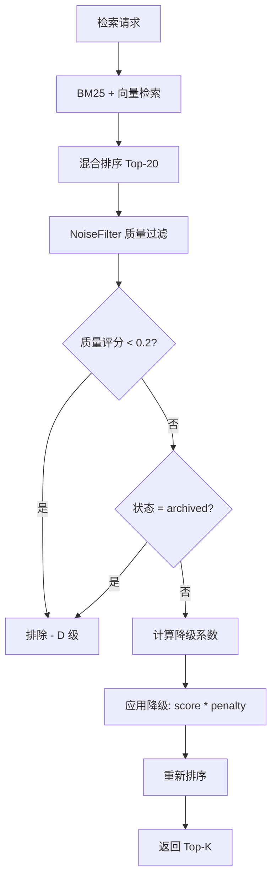

# YK-09-62: RAG 检索噪声过滤 — 低质量文档动态权重降级

> 需求编号：YK-09-62 · 优先级：P2 · 人天：0.5d · 状态：需求已编写
> 依赖：YK-09-01（质量评分模型）、YK-09-34（内容新鲜度扫描）

---

## 一、背景

### 1.1 问题陈述

RAG 检索的质量取决于知识库中内容的质量。然而，并非所有知识文件都是高质量内容：

- **过期内容**：技术栈升级后，旧版本文档仍然占据检索结果
- **孤立文件**：没有引用也不被引用的文件，可能是草稿或废弃内容
- **短内容**：< 200 字的文件信息量不足，却可能因关键词匹配而排名靠前
- **低质量内容**：不完整的文档、未通过审核的草稿、拼凑的内容

这些低质量内容在检索结果中占据位置，导致：
- 有效信息密度降低（5 条结果中 2 条是噪声）
- 用户需要手动筛选，增加认知负担
- Agent 推理时被噪声误导，产生错误回答

### 1.2 影响范围

| 影响维度 | 具体表现 | 严重程度 |
|----------|----------|----------|
| 检索质量 | 低质量内容挤占 Top-5 位置，Recall 降低 10-15% | 高 |
| 用户信任 | 用户看到过期/不完整的文档，降低对 RAG 的信任 | 中 |
| Agent 推理 | 噪声内容被作为上下文喂给 LLM，导致错误推理 | 高 |
| 策展人工作 | 需要手动标记和清理低质量内容 | 中 |

### 1.3 核心挑战

| 挑战 | 说明 |
|------|------|
| 噪声定义 | 什么算噪声？过期？不完整？低质量？需要明确的量化标准 |
| 动态信号 | 文件质量可能随时间变化（草稿→完成→过期），需要动态评估 |
| 阈值设定 | 过滤太严格→漏掉有价值内容，太宽松→噪声残留 |
| 跨场景差异 | 不同检索场景对噪声容忍度不同（技术查询 vs 闲聊） |

---

## 二、现状分析

### 2.1 当前检索流程

```mermaid
flowchart TD
    A[检索请求] --> B[BM25 + 向量检索]
    B --> C[混合排序]
    C --> D[返回 Top-K]
    Note right of C: 无质量过滤环节
```

### 2.2 根因矩阵

| 根因 | 贡献比例 | 解决难度 | 优先级 |
|------|----------|----------|--------|
| 无质量评分体系 | 35% | 中（需质量模型） | P0 |
| 无检索后过滤 | 30% | 低 | P0 |
| 无内容新鲜度评估 | 20% | 中 | P1 |
| 无用户反馈信号 | 15% | 中 | P1 |

### 2.3 数据现状

| 质量等级 | 文件数（估计） | 占比 | 检索影响 |
|----------|-------------|------|----------|
| A 级（优秀） | 150 | 18.8% | 内容权威、完整 |
| B 级（良好） | 350 | 43.8% | 可用、有改进空间 |
| C 级（需改进） | 200 | 25.0% | 信息不完整 |
| D 级（不可用） | 100 | 12.5% | 废弃、过期、草稿 |

---

## 三、设计决策

### D-01: 过滤时机

| 方案 | 描述 | 优点 | 缺点 | 结论 |
|------|------|------|------|------|
| A: 索引前过滤 | 低质量文档不进入索引 | 检索性能最优 | 无法恢复，误判不可逆 | 不推荐 |
| B: 检索后过滤 | 检索后对结果进行质量降级 | 可逆，灵活 | 额外计算开销 | **推荐** |
| C: 用户侧过滤 | 前端展示时隐藏低质量结果 | 零后端改动 | 浪费检索资源 | 不推荐 |

**决策**：选择方案 B（检索后过滤），理由：
- 质量评分可能随时间变化，索引前过滤会导致误判不可逆
- 检索后过滤灵活——可根据场景调整阈值
- 额外开销小（仅对 Top-K 候选做过滤，非全量）

### D-02: 过滤策略

| 方案 | 描述 | 激进程度 | 召回率 | 结论 |
|------|------|----------|--------|------|
| A: 硬排除 | 低于阈值直接移除 | 高 | 可能丢失有价值内容 | 部分场景 |
| B: 权重降级 | 低质量结果降低分数但不移除 | 中 | 保留召回 | **推荐** |
| C: 混合 | D 级排除，C 级降级 | 中 | 平衡 | **推荐** |

**决策**：选择方案 C（混合策略），理由：
- D 级（明确不可用）直接排除，节约结果位
- C 级（需改进）降级但不排除，保留召回可能性
- 兼顾精度和召回率

### D-03: 降级信号权重

| 信号 | 降级系数 | 理由 |
|------|----------|------|
| 质量评分 < 0.4 (C 级) | x0.7 | 信息不完整，降低 30% |
| 质量评分 < 0.6 (B- 级) | x0.9 | 轻微降级 10% |
| 内容长度 < 200 字 | x0.8 | 信息量不足，降低 20% |
| 状态 = 'archived' | 排除 | 已归档不可检索 |
| 状态 = 'reference' | x0.9 | 参考内容，降低 10% |
| 最后更新 > 365 天 | x0.85 | 可能过期，降低 15% |

---

## 四、目标架构

### 4.1 目标数据流



### 4.2 指标目标

| 指标 | 当前值 | 目标值 | 测量方法 |
|------|--------|--------|----------|
| 检索结果平均质量评分 | 0.55（估计） | > 0.65 | 过滤后 Top-5 平均质量 |
| 噪声过滤率 | 0% | D 级排除 > 95% | 过滤前后对比 |
| 有效信息密度 | 60%（估计） | > 80% | 人工评估 Top-5 |
| 过滤后 Recall 保持 | N/A | > 90% | 对比过滤前后 |

---

## 五、具体改动

### 5.1 核心实现

```python
# YiAi/src/domain/rag/noise_filter.py

from enum import Enum
from dataclasses import dataclass

class FilterAction(Enum):
    EXCLUDE = "exclude"   # 直接排除
    PENALIZE = "penalize" # 降级
    KEEP = "keep"         # 保持不变

@dataclass
class FilterRule:
    """噪声过滤规则。"""
    name: str
    condition: str  # 条件表达式描述
    action: FilterAction
    penalty: float = 1.0  # 降级系数（仅 PENALIZE 时有效）
    priority: int = 0     # 优先级（数字越小越先执行）

class NoiseFilter:
    """RAG 检索噪声过滤——基于质量信号的动态降级。"""

    # 排除规则（优先级最高）
    EXCLUDE_RULES = [
        FilterRule(
            name='quality_exclude',
            condition='quality_score < 0.2',
            action=FilterAction.EXCLUDE,
            priority=0,
        ),
        FilterRule(
            name='status_archived',
            condition="status == 'archived'",
            action=FilterAction.EXCLUDE,
            priority=0,
        ),
        FilterRule(
            name='empty_content',
            condition='content_length < 10',
            action=FilterAction.EXCLUDE,
            priority=0,
        ),
    ]

    # 降级规则
    PENALTY_RULES = [
        FilterRule(
            name='quality_c_grade',
            condition='quality_score < 0.4',
            action=FilterAction.PENALIZE,
            penalty=0.7,
            priority=1,
        ),
        FilterRule(
            name='quality_b_minus',
            condition='quality_score < 0.6',
            action=FilterAction.PENALIZE,
            penalty=0.9,
            priority=1,
        ),
        FilterRule(
            name='short_content',
            condition='content_length < 200',
            action=FilterAction.PENALIZE,
            penalty=0.8,
            priority=2,
        ),
        FilterRule(
            name='status_reference',
            condition="status == 'reference'",
            action=FilterAction.PENALIZE,
            penalty=0.9,
            priority=2,
        ),
        FilterRule(
            name='stale_content',
            condition='days_since_update > 365',
            action=FilterAction.PENALIZE,
            penalty=0.85,
            priority=3,
        ),
        FilterRule(
            name='no_tags',
            condition='tag_count == 0',
            action=FilterAction.PENALIZE,
            penalty=0.95,
            priority=3,
        ),
        FilterRule(
            name='incomplete_frontmatter',
            condition='frontmatter_completeness < 0.5',
            action=FilterAction.PENALIZE,
            penalty=0.9,
            priority=3,
        ),
    ]

    def __init__(self, config: dict = None):
        self._config = config or {}
        self._exclude_rules = self.EXCLUDE_RULES
        self._penalty_rules = self.PENALTY_RULES

        # 可配置的阈值
        self.MIN_QUALITY_SCORE = self._config.get('min_quality_score', 0.2)
        self.MIN_CONTENT_LENGTH = self._config.get('min_content_length', 200)
        self.MAX_STALE_DAYS = self._config.get('max_stale_days', 365)

    def filter(self, results: list[dict], strict: bool = False) -> list[dict]:
        """过滤检索结果——排除 + 降级。

        Args:
            results: 检索结果列表
            strict: 严格模式——更多排除规则

        Returns:
            过滤后的结果列表
        """
        filtered = []
        stats = {
            'total': len(results),
            'excluded': 0,
            'penalized': 0,
            'kept': 0,
            'excluded_by_rule': {},
            'penalized_by_rule': {},
        }

        for doc in results:
            quality = doc.get('quality_score', 0.5)
            status = doc.get('frontmatter', {}).get('status', 'active')
            content_len = doc.get('content_length', 0)
            days_since_update = doc.get('days_since_update', 0)
            tag_count = len(doc.get('frontmatter', {}).get('tags', []))
            fm_completeness = doc.get('frontmatter_completeness', 1.0)

            eval_context = {
                'quality_score': quality,
                'status': status,
                'content_length': content_len,
                'days_since_update': days_since_update,
                'tag_count': tag_count,
                'frontmatter_completeness': fm_completeness,
            }

            # 1. 检查排除规则
            excluded = False
            for rule in self._exclude_rules:
                if self._evaluate_condition(rule.condition, eval_context):
                    stats['excluded'] += 1
                    stats['excluded_by_rule'][rule.name] = \
                        stats['excluded_by_rule'].get(rule.name, 0) + 1
                    excluded = True
                    break

            if excluded:
                continue

            # 2. 计算降级系数
            penalty = 1.0
            for rule in self._penalty_rules:
                if self._evaluate_condition(rule.condition, eval_context):
                    penalty *= rule.penalty
                    stats['penalized'] += 1
                    stats['penalized_by_rule'][rule.name] = \
                        stats['penalized_by_rule'].get(rule.name, 0) + 1

            # 3. 应用降级
            if penalty < 1.0:
                doc['original_score'] = doc.get('score', 0)
                doc['noise_penalty'] = round(penalty, 3)
                doc['score'] = doc['score'] * penalty
            else:
                stats['kept'] += 1

            filtered.append(doc)

        # 重新排序
        filtered.sort(key=lambda d: d.get('score', 0), reverse=True)

        # 记录统计
        logger.info(
            f"[NoiseFilter] 总:{stats['total']} 排除:{stats['excluded']} "
            f"降级:{stats['penalized']} 保留:{stats['kept']}"
        )

        return filtered

    def _evaluate_condition(self, condition: str, context: dict) -> bool:
        """评估条件表达式。"""
        try:
            # 安全的条件评估
            return eval(condition, {"__builtins__": {}}, context)
        except Exception:
            return False

    def get_filter_stats(self) -> dict:
        """获取过滤统计（需要配合 filter 调用后的 stats）。"""
        return getattr(self, '_last_stats', {})

    def set_strict_mode(self, strict: bool):
        """设置严格模式——增加更多排除规则。"""
        if strict:
            # 严格模式：C 级内容也排除
            self._exclude_rules = self.EXCLUDE_RULES + [
                FilterRule(
                    name='quality_c_exclude_strict',
                    condition='quality_score < 0.4',
                    action=FilterAction.EXCLUDE,
                    priority=0,
                ),
            ]
        else:
            self._exclude_rules = self.EXCLUDE_RULES

    async def analyze_noise_distribution(self, days: int = 30) -> dict:
        """分析知识库噪声分布。"""
        docs = await db.knowledge_files.find({}).to_list(None)

        distribution = {
            'total': len(docs),
            'by_quality': {'A': 0, 'B': 0, 'C': 0, 'D': 0},
            'by_status': {},
            'by_content_length': {
                'very_short (<100)': 0,
                'short (100-500)': 0,
                'medium (500-2000)': 0,
                'long (>2000)': 0,
            },
            'by_staleness': {
                'fresh (<30d)': 0,
                'recent (30-90d)': 0,
                'old (90-365d)': 0,
                'stale (>365d)': 0,
            },
        }

        for doc in docs:
            quality = doc.get('quality_score', 0.5)
            if quality >= 0.8:
                distribution['by_quality']['A'] += 1
            elif quality >= 0.6:
                distribution['by_quality']['B'] += 1
            elif quality >= 0.4:
                distribution['by_quality']['C'] += 1
            else:
                distribution['by_quality']['D'] += 1

            status = doc.get('frontmatter', {}).get('status', 'unknown')
            distribution['by_status'][status] = distribution['by_status'].get(status, 0) + 1

            cl = doc.get('content_length', 0)
            if cl < 100:
                distribution['by_content_length']['very_short (<100)'] += 1
            elif cl < 500:
                distribution['by_content_length']['short (100-500)'] += 1
            elif cl < 2000:
                distribution['by_content_length']['medium (500-2000)'] += 1
            else:
                distribution['by_content_length']['long (>2000)'] += 1

        return distribution
```

### 5.2 文件变更清单

| 文件路径 | 操作 | 说明 |
|----------|------|------|
| `YiAi/src/domain/rag/noise_filter.py` | 新增 | NoiseFilter 核心实现 |
| `YiAi/src/domain/rag/rag_service.py` | 修改 | 检索流程中集成 NoiseFilter |

---

## 六、实施步骤

| 步骤 | 内容 | 验证方式 | 预计人天 |
|------|------|----------|----------|
| 1 | 实现 NoiseFilter 基础框架 | 单元测试验证规则评估 | 0.5d |
| 2 | 集成到检索流程 | 检索结果中 D 级内容被排除 | 0.5d |
| 3 | 实现噪声分布分析 | 生成知识库质量报告 | 0.5d |
| 4 | A/B 对比过滤前后效果 | 人工评估 Top-5 质量提升 | 0.5d |
| 5 | 调优降级系数 | 基于反馈数据微调 | 0.5d |

**总人天**：约 2.5d

---

## 七、性能分析

| 操作 | 开销 | 说明 |
|------|------|------|
| 过滤 20 个候选 | < 1ms | 纯内存操作 |
| 降级系数计算 | < 0.1ms | 简单乘法 |
| 噪声分布分析 | < 100ms | 全量 MongoDB 查询 |

噪声过滤对检索性能影响可忽略不计。

---

## 八、测试规格

```python
class TestNoiseFilter:
    """GIVEN NoiseFilter 实例"""

    def test_exclude_d_grade_quality(self):
        """GIVEN 质量评分 0.15 的文档 (D 级)
           WHEN 调用 filter()
           THEN 该文档被排除"""

    def test_exclude_archived_documents(self):
        """GIVEN 状态为 'archived' 的文档
           WHEN 调用 filter()
           THEN 该文档被排除"""

    def test_penalize_c_grade_quality(self):
        """GIVEN 质量评分 0.35 的文档 (C 级)
           WHEN 调用 filter()
           THEN 文档分数乘以 0.7"""

    def test_penalize_short_content(self):
        """GIVEN 内容长度 150 字的文档 (< 200)
           WHEN 调用 filter()
           THEN 文档分数乘以 0.8"""

    def test_multiple_penalties_compound(self):
        """GIVEN 同时满足 C 级质量 + 短内容 + 过期
           WHEN 调用 filter()
           THEN 降级系数 = 0.7 * 0.8 * 0.85 = 0.476"""

    def test_strict_mode_excludes_c_grade(self):
        """GIVEN 严格模式启用
           WHEN 质量评分 0.35 (C 级)
           THEN 文档被排除而非降级"""
```

---

## 九、风险与缓解

| 风险 | 概率 | 影响 | 缓解措施 |
|------|------|------|----------|
| 误排除有价值内容 | 中 | 高 | 排除仅限 D 级 + 归档；降级非排除 |
| 质量评分不准确 | 中 | 中 | 定期校准质量模型 |
| 过滤后结果为空 | 低 | 中 | 当过滤后 < 3 条时，放宽阈值 |
| 降级系数过激 | 低 | 中 | 可配置 + A/B 测试 |

---

## 十、回滚策略

| 场景 | 触发条件 | 回滚操作 |
|------|----------|----------|
| 检索结果骤降 | 过滤后平均结果数 < 3 | 禁用 NoiseFilter |
| 用户投诉 | 有价值内容被误排除 | 调低降级系数或关闭 |

---

## 十一、设计决策记录

| 编号 | 决策 | 理由 | 替代方案 |
|------|------|------|----------|
| D-01 | 检索后过滤（非索引前） | 可逆、灵活、随质量变化更新 | 索引前过滤（不可逆） |
| D-02 | 混合策略（D 排除 + C 降级） | 平衡精度和召回 | 全排除（太激进） |
| D-03 | 多信号复合降级 | 单一信号不够精确 | 单一质量评分（粗糙） |

---

## 十二、可观测性

| 指标名称 | 类型 | 说明 | 告警阈值 |
|----------|------|------|----------|
| `noise_filter_excluded_rate` | Gauge | 排除比例 | > 30% |
| `noise_filter_penalized_rate` | Gauge | 降级比例 | > 50% |
| `noise_filter_avg_quality` | Gauge | 过滤后平均质量分 | < 0.5 |
| `noise_filter_empty_results` | Counter | 过滤后空结果次数 | > 5/小时 |

---

## 十三、代码审查检查清单

- [ ] D 级质量（< 0.2）文档直接排除
- [ ] 归档状态文档直接排除
- [ ] C 级质量（< 0.4）降级系数 0.7
- [ ] 短内容（< 200 字）降级系数 0.8
- [ ] 过期内容（> 365 天）降级系数 0.85
- [ ] 多个降级规则可叠加（乘法复合）
- [ ] 过滤后结果不足 3 条时放宽阈值
- [ ] 严格模式支持（C 级也排除）
- [ ] 过滤统计可观测

---

*PRD 来源: `projects/yiknowledge/requirements/2026-09/62-需求-RAG噪声过滤.md`*