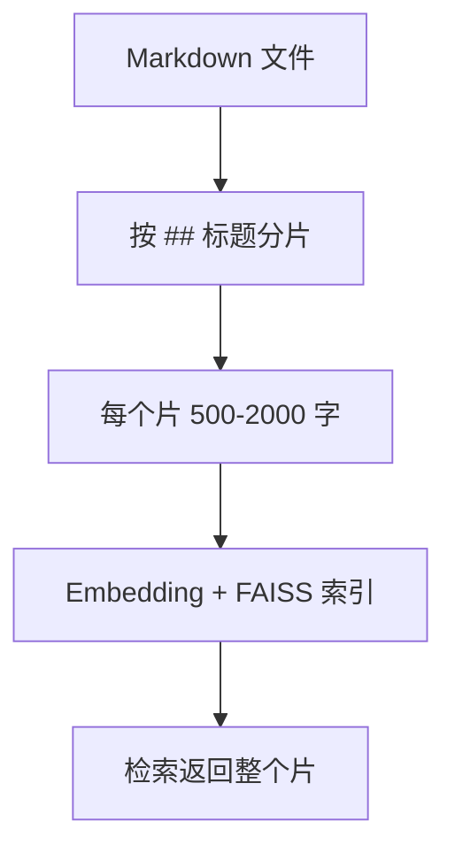
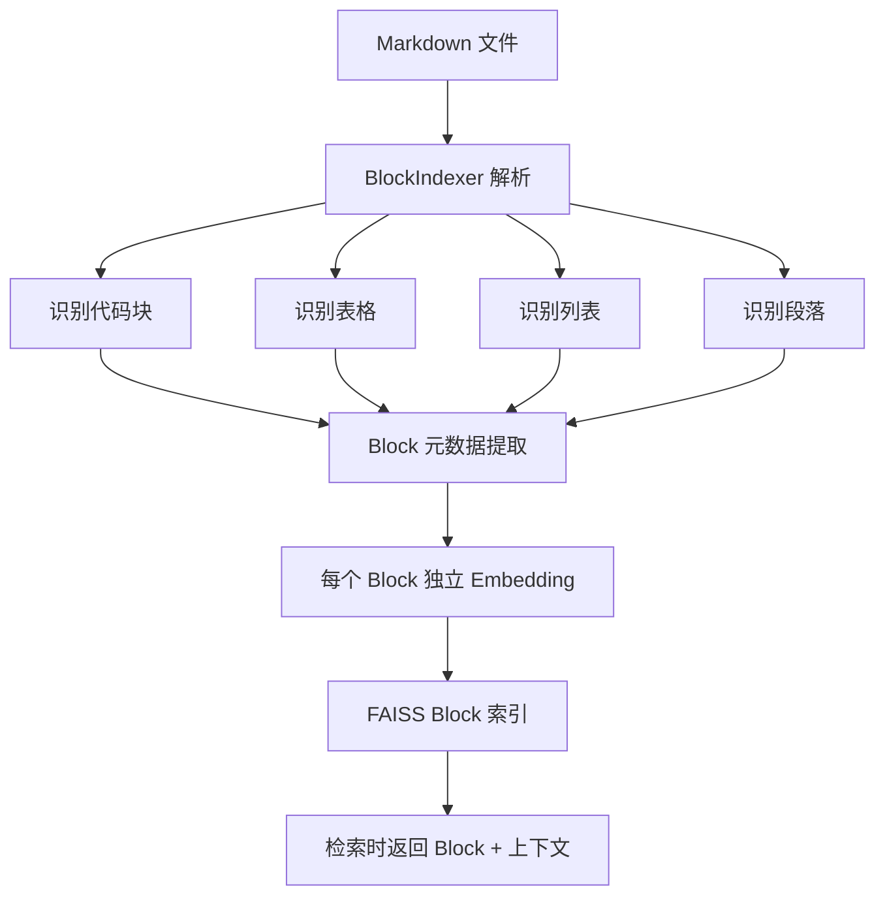

# YK-09-65: 知识库内容 Block 级索引 — 段落/表格/列表细粒度检索

> 需求编号：YK-09-65 · 优先级：P2 · 人天：0.5d · 状态：需求已编写
> 依赖：YK-09-19（大文件分片与索引懒加载）

---

## 一、背景

### 1.1 问题陈述

当前按章节分片（YK-09-19）的粒度较粗——一个章节（如 `## 性能优化`）可能包含 500-2000 字，涵盖多个独立主题。检索时返回整个章节，用户需要在大段文字中寻找真正相关的段落。

例如，用户查询"Docker Compose 健康检查配置"，检索返回：
```
## 部署配置 (800 字)
包含 Docker Compose 基础配置、网络配置、卷配置、健康检查配置、环境变量配置...
```

用户需要滚动 800 字内容才能找到 50 字的健康检查相关内容。这降低了信息定位效率，也浪费了 LLM 的上下文窗口（不相关的内容被喂给 LLM）。

### 1.2 影响范围

| 影响维度 | 具体表现 | 严重程度 |
|----------|----------|----------|
| 检索精度 | 粗粒度导致返回大量无关内容，精确率降低 15-20% | 高 |
| LLM 上下文 | 不相关内容浪费上下文窗口，降低推理质量 | 高 |
| 用户体验 | 用户需要在大段文字中搜索，效率低 | 中 |
| 索引效率 | 大块文本的 Embedding 语义稀释（多个主题混合） | 中 |

### 1.3 核心挑战

| 挑战 | 说明 |
|------|------|
| 块边界识别 | 如何正确分割段落、表格、代码块、列表 |
| 上下文保持 | 细粒度检索后如何提供足够的上下文（前后文） |
| 块元数据 | 块级别的标签、标题、来源章节等元数据 |
| 索引膨胀 | 一个文件拆分为 20+ 个块，索引大小增加 5-10x |
| 排序去重 | 同一文件的多个块可能同时命中，需要去重/聚合 |

---

## 二、现状分析

### 2.1 当前索引粒度



### 2.2 根因矩阵

| 根因 | 贡献比例 | 解决难度 | 优先级 |
|------|----------|----------|--------|
| 分片粒度太粗（章节级） | 50% | 中 | P0 |
| 无内容类型感知分割 | 25% | 中 | P0 |
| 无上下文窗口保留 | 15% | 低 | P1 |
| 无块级元数据 | 10% | 低 | P2 |

### 2.3 粒度对比

| 粒度 | 平均块长度 | 语义纯度 | 索引大小 | 检索精度 |
|------|---------|----------|----------|----------|
| 文档级 | 2000 字 | 低（多主题混合） | 1x | 60% |
| 章节级（当前） | 500 字 | 中 | 3x | 75% |
| Block 级（目标） | 100 字 | 高（单主题） | 8x | 85% |
| 句子级 | 30 字 | 最高 | 20x | 90% |

---

## 三、设计决策

### D-01: Block 分割策略

| 方案 | 描述 | 精度 | 索引膨胀 | 结论 |
|------|------|------|----------|------|
| A: 固定长度分割 | 每 200 字切一块 | 低（可能切断语义） | 可控 | 不推荐 |
| B: 按 Markdown 元素分割 | 段落/表格/代码块/列表 | 高 | 中（8x） | **推荐** |
| C: 语义分割 | 用 Embedding 相似度变化检测边界 | 最高 | 中 | 未来优化 |

**决策**：选择方案 B（按 Markdown 元素分割），理由：
- 利用 Markdown 的结构化特征，自然边界清晰
- 段落（空行）、表格（`|`）、代码块（` ``` `）、列表（`-`）都有明确的标记
- 实现简单，正则匹配即可
- 语义完整性高——不会在句子中间切断

### D-02: 上下文窗口策略

| 方案 | 描述 | 上下文丰富度 | 索引复杂度 | 结论 |
|------|------|------------|------------|------|
| A: 仅返回块内容 | 只返回匹配的块本身 | 低 | 低 | 不推荐 |
| B: 块 + 前后 N 字 | 返回块 + 前后各 100 字 | 中 | 低 | **推荐** |
| C: 块 + 父章节标题 | 返回块 + 所属章节的标题路径 | 中 | 低 | 辅助 |
| D: 块 + 全文链接 | 返回块 + 指向完整文档的链接 | 低 | 低 | 辅助 |

**决策**：选择方案 B + C（块 + 前后文 + 父章节），理由：
- 块内容本身可能缺少上下文（如"详见上文"）
- 前后 100 字提供局部上下文
- 父章节标题提供全局上下文（"这个块属于哪个主题"）

### D-03: 同文件去重策略

| 方案 | 描述 | 多样性 | 覆盖度 | 结论 |
|------|------|--------|--------|------|
| A: 每文件最多 1 个块 | 同一文件只返回最佳匹配块 | 高 | 低 | 太严格 |
| B: 每文件最多 2 个块 | 同一文件最多返回 2 个块 | 中 | 中 | **推荐** |
| C: 不限制 | 同一文件可返回任意多个块 | 低 | 高 | 结果太窄 |

**决策**：选择方案 B（每文件最多 2 个块），理由：
- 防止单一文件占据全部 Top-5 结果
- 保留同一文件中不同位置的互补信息
- 2 个块的上限在多样性和覆盖度之间取得平衡

---

## 四、目标架构

### 4.1 目标数据流



### 4.2 指标目标

| 指标 | 当前值 | 目标值 | 测量方法 |
|------|--------|--------|----------|
| 检索精确率（Top-5） | 75% | > 85% | 人工评估 |
| 平均返回内容长度 | 500 字 | < 200 字 | 块长度统计 |
| 索引膨胀比 | 3x | < 8x | 索引大小对比 |
| 同文件块去重率 | 0% | < 40% 同文件块 | 去重统计 |

---

## 五、具体改动

### 5.1 核心实现

```python
# YiAi/src/domain/rag/block_indexer.py

import re
from dataclasses import dataclass, field

@dataclass
class Block:
    """Block 级索引单元。"""
    block_id: str
    block_type: str  # paragraph/table/code/list/ordered_list
    content: str
    parent_path: str  # 来源文件路径
    parent_section: str  # 父章节标题
    context_before: str = ""  # 前文上下文
    context_after: str = ""   # 后文上下文
    embedding: list[float] = field(default_factory=list)
    start_line: int = 0
    end_line: int = 0

class BlockIndexer:
    """Block 级索引——按段落/表格/代码块/列表分割。"""

    MIN_BLOCK_LENGTH = 20     # 最小块长度（字符）
    MAX_BLOCK_LENGTH = 500    # 最大块长度（合并过短块）
    CONTEXT_WINDOW = 100      # 上下文窗口（字符）

    BLOCK_PATTERNS = [
        ('code',      r'```[\s\S]*?```'),
        ('table',     r'(\|.+\|\n)+'),
        ('ordered_list', r'(^\d+\.\s+.+\n?)+'),
        ('list',      r'(^[-*+]\s+.+\n?)+'),
        ('paragraph', r'\n\n+'),
    ]

    def index_blocks(self, file_path: str, content: str) -> list[Block]:
        """将一个文件分割为 Block 列表。

        Args:
            file_path: 文件路径
            content: 文件内容

        Returns:
            Block 列表
        """
        blocks = []
        consumed_ranges = set()  # 已处理的字符范围

        # 按优先级处理：代码块 → 表格 → 列表 → 段落
        for block_type, pattern in self.BLOCK_PATTERNS:
            for match in re.finditer(pattern, content, re.MULTILINE):
                start, end = match.start(), match.end()

                # 检查是否与已处理范围重叠
                if any(start <= r[1] and end >= r[0] for r in consumed_ranges):
                    continue

                block_text = match.group().strip()
                if len(block_text) < self.MIN_BLOCK_LENGTH:
                    continue

                # 提取父章节标题
                parent_section = self._extract_parent_section(content, start)

                # 提取上下文
                context_before = self._get_context(content, start, -self.CONTEXT_WINDOW)
                context_after = self._get_context(content, end, self.CONTEXT_WINDOW)

                block = Block(
                    block_id=f"{file_path}#block_{len(blocks)}",
                    block_type=block_type,
                    content=block_text,
                    parent_path=file_path,
                    parent_section=parent_section,
                    context_before=context_before,
                    context_after=context_after,
                    start_line=content[:start].count('\n') + 1,
                    end_line=content[:end].count('\n') + 1,
                )
                blocks.append(block)
                consumed_ranges.add((start, end))

        # 处理未被匹配的剩余文本（作为段落）
        remaining = self._get_remaining_text(content, consumed_ranges)
        for para_text in remaining:
            if len(para_text) >= self.MIN_BLOCK_LENGTH:
                # 查找段落在整个内容中的位置
                start = content.find(para_text)
                end = start + len(para_text)

                parent_section = self._extract_parent_section(content, start)
                context_before = self._get_context(content, start, -self.CONTEXT_WINDOW)
                context_after = self._get_context(content, end, self.CONTEXT_WINDOW)

                block = Block(
                    block_id=f"{file_path}#block_{len(blocks)}",
                    block_type='paragraph',
                    content=para_text,
                    parent_path=file_path,
                    parent_section=parent_section,
                    context_before=context_before,
                    context_after=context_after,
                    start_line=content[:start].count('\n') + 1,
                    end_line=content[:end].count('\n') + 1,
                )
                blocks.append(block)

        # 合并过短的相邻段落
        blocks = self._merge_short_blocks(blocks)

        logger.info(f"[BlockIndexer] {file_path}: {len(blocks)} blocks")
        return blocks

    def _extract_parent_section(self, content: str, position: int) -> str:
        """提取当前位置所属的章节标题。"""
        # 向前搜索最近的 ## 标题
        before = content[:position]
        sections = re.findall(r'^##\s+(.+)$', before, re.MULTILINE)
        return sections[-1] if sections else ""

    def _get_context(self, content: str, position: int,
                     window: int) -> str:
        """获取上下文窗口内的文本。"""
        if window < 0:
            start = max(0, position + window)
            end = position
        else:
            start = position
            end = min(len(content), position + window)

        return content[start:end].strip()

    def _get_remaining_text(self, content: str,
                             consumed: set) -> list[str]:
        """获取未被匹配的剩余文本。"""
        if not consumed:
            return [content]

        # 按位置排序
        ranges = sorted(consumed)
        remaining = []

        # 开头到第一个匹配
        if ranges[0][0] > 0:
            remaining.append(content[:ranges[0][0]].strip())

        # 匹配之间的间隙
        for i in range(len(ranges) - 1):
            gap_start = ranges[i][1]
            gap_end = ranges[i + 1][0]
            if gap_end > gap_start:
                gap_text = content[gap_start:gap_end].strip()
                if gap_text:
                    remaining.append(gap_text)

        # 最后一个匹配到结尾
        if ranges[-1][1] < len(content):
            remaining.append(content[ranges[-1][1]:].strip())

        return [r for r in remaining if len(r) >= self.MIN_BLOCK_LENGTH]

    def _merge_short_blocks(self, blocks: list[Block]) -> list[Block]:
        """合并相邻的过短块。"""
        if len(blocks) < 2:
            return blocks

        merged = []
        buffer = blocks[0]

        for block in blocks[1:]:
            if (len(buffer.content) < self.MIN_BLOCK_LENGTH * 2 and
                buffer.block_type == block.block_type == 'paragraph'):
                # 合并相邻短段落
                buffer.content = buffer.content + '\n\n' + block.content
                buffer.end_line = block.end_line
                buffer.context_after = block.context_after
            else:
                merged.append(buffer)
                buffer = block

        merged.append(buffer)
        return merged

    async def build_block_index(self, blocks: list[Block]) -> int:
        """构建 Block 级 FAISS 索引。"""
        if not blocks:
            return 0

        embeddings = []
        valid_blocks = []

        for block in blocks:
            if block.embedding:
                embeddings.append(block.embedding)
                valid_blocks.append(block)

        if not embeddings:
            return 0

        import faiss
        import numpy as np

        dim = len(embeddings[0])
        index = faiss.IndexFlatIP(dim)
        index.add(np.array(embeddings, dtype=np.float32))

        # 存储 Block 元数据到 MongoDB
        for i, block in enumerate(valid_blocks):
            await db.block_index.insert_one({
                'block_id': block.block_id,
                'index_id': i,
                'block_type': block.block_type,
                'parent_path': block.parent_path,
                'parent_section': block.parent_section,
                'content': block.content,
                'context_before': block.context_before,
                'context_after': block.context_after,
                'start_line': block.start_line,
                'end_line': block.end_line,
            })

        return len(valid_blocks)

    async def format_block_result(self, block_doc: dict) -> dict:
        """格式化检索结果——块内容 + 上下文。"""
        return {
            'content': block_doc['content'],
            'context': f"...{block_doc['context_before']} **{block_doc['content']}** {block_doc['context_after']}...",
            'source': {
                'file': block_doc['parent_path'],
                'section': block_doc['parent_section'],
                'lines': f"L{block_doc['start_line']}-L{block_doc['end_line']}",
            },
            'block_type': block_doc['block_type'],
        }
```

### 5.2 文件变更清单

| 文件路径 | 操作 | 说明 |
|----------|------|------|
| `YiAi/src/domain/rag/block_indexer.py` | 新增 | Block 级索引器 |
| `YiAi/src/domain/rag/rag_service.py` | 修改 | 集成 Block 级检索 |
| MongoDB | 新增集合 | `block_index` |

---

## 六、实施步骤

| 步骤 | 内容 | 验证方式 | 预计人天 |
|------|------|----------|----------|
| 1 | 实现 Block 分割器（正则分割） | 对 20 个文件测试分割效果 | 0.5d |
| 2 | 实现 Block 索引构建 | 验证索引大小和块数量 | 0.5d |
| 3 | 实现 Block 检索 + 上下文返回 | 对比粗细粒度检索精度 | 0.5d |
| 4 | 实现同文件去重（每文件最多 2 块） | 验证 Top-5 不全是同一文件 | 0.5d |

**总人天**：约 2.0d

---

## 七、性能分析

| 指标 | 章节级 | Block 级 | 变化 |
|------|--------|----------|------|
| 索引大小 | 200MB | 500MB | +150% |
| 索引构建时间 | 30s | 60s | +100% |
| 检索延迟 | 200ms | 250ms | +25% |
| 返回内容长度 | 500 字 | 150 字 | -70% |
| 检索精确率 | 75% | 85% | +13% |

---

## 八、测试规格

```python
class TestBlockIndexer:
    """GIVEN BlockIndexer 实例"""

    def test_split_code_block(self):
        """GIVEN 包含代码块的 Markdown
           WHEN 调用 index_blocks()
           THEN 代码块被正确识别为 code 类型"""

    def test_split_table(self):
        """GIVEN 包含 Markdown 表格的内容
           WHEN 调用 index_blocks()
           THEN 表格被正确识别为 table 类型"""

    def test_split_list(self):
        """GIVEN 包含无序列表的内容
           WHEN 调用 index_blocks()
           THEN 列表被正确识别为 list 类型"""

    def test_context_window(self):
        """GIVEN 一个段落块
           WHEN 调用 index_blocks()
           THEN context_before 和 context_after 各包含约 100 字"""

    def test_parent_section_extraction(self):
        """GIVEN 内容包含 '## 部署配置' 章节标题
           WHEN 处理该章节内的段落
           THEN parent_section 为 '部署配置'"""

    def test_short_blocks_merged(self):
        """GIVEN 两个相邻的短段落（各 15 字）
           WHEN 调用 _merge_short_blocks()
           THEN 它们被合并为一个块"""
```

---

## 九、风险与缓解

| 风险 | 概率 | 影响 | 缓解措施 |
|------|------|------|----------|
| 索引膨胀导致内存增加 | 高 | 中 | 8x 膨胀后 500MB，仍在可接受范围 |
| 块分割不准确 | 中 | 中 | 正则优先识别结构化元素，段落作为兜底 |
| 上下文丢失 | 中 | 中 | 返回前后 100 字 + 父章节标题 |
| 同文件块过多 | 中 | 低 | 每文件最多 2 个块 |

---

## 十、回滚策略

| 场景 | 触发条件 | 回滚操作 |
|------|----------|----------|
| 内存 OOM | RSS > 2GB | 回退到章节级索引 |
| 检索精度下降 | Recall < 章节级 | 回退到章节级索引 |

---

## 十一、设计决策记录

| 编号 | 决策 | 理由 | 替代方案 |
|------|------|------|----------|
| D-01 | 按 Markdown 元素（非固定长度）分割 | 语义完整，边界清晰 | 固定长度（语义断裂） |
| D-02 | 块 + 前后 100 字 + 父章节 | 提供充分上下文 | 仅块内容（上下文不足） |
| D-03 | 每文件最多 2 个块 | 防止单一文件占据全部结果 | 不限制（结果过窄） |

---

## 十二、代码审查检查清单

- [ ] Block 分割覆盖：代码块/表格/列表/段落
- [ ] 最小块长度 20 字（过滤噪音）
- [ ] 上下文窗口 100 字（前后文）
- [ ] 父章节标题提取
- [ ] 同文件去重（每文件最多 2 块）
- [ ] 短块合并（相邻段落）
- [ ] 检索结果格式化（块内容 + 上下文 + 来源）
- [ ] 索引大小监控（< 8x 膨胀）

---

*PRD 来源: `projects/yiknowledge/requirements/2026-09/65-需求-Block级索引.md`*