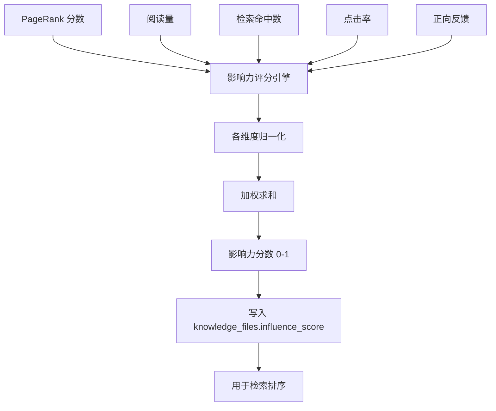

# YK-09-66: 知识库内容影响力评分 — 引用网络 + 阅读量量化文档价值

> 需求编号：YK-09-66 · 优先级：P2 · 人天：0.5d · 状态：需求已编写
> 依赖：YK-09-40（文档权威性 PageRank）、YK-09-50（反馈数据湖）

---

## 一、背景

### 1.1 问题陈述

YK-09-40 引入的 PageRank 算法仅基于引用链接计算文档权威性——它衡量的是"谁被引用得多"。但引用网络只是文档价值的一个维度。实际场景中：

- 一篇被广泛阅读但很少被引用的"新手引导"文档，PageRank 得分很低（0.005），但实际价值很高
- 一篇被多次 RAG 检索命中的"Frontmatter 规范"，PageRank 得分中等（0.032），但检索价值极高
- 一篇从未被阅读但被多次引用的"架构设计"文档，PageRank 得分高（0.045），但实际影响力有限

需要融合多维度信号（引用、阅读、检索、点击、反馈），全面量化文档的"影响力"。

### 1.2 影响范围

| 影响维度 | 具体表现 | 严重程度 |
|----------|----------|----------|
| 检索排序 | 未考虑影响力信号，高价值文档可能排在后面 | 中 |
| 策展人决策 | 无法量化哪些文档最有价值，无法做优先级排序 | 中 |
| 内容推荐 | 无法识别"高价值但冷门"的文档 | 低 |
| 知识治理 | 无法识别"低价值但占位"的文档，难以清理 | 中 |

### 1.3 核心挑战

| 挑战 | 说明 |
|------|------|
| 多维度归一化 | 不同信号（阅读量 0-1000 vs PageRank 0-0.05）尺度差异大 |
| 信号权重 | 各维度之间的相对重要性如何确定 |
| 数据采集 | 阅读量、点击量等信号需要埋点采集 |
| 冷启动 | 新文档无任何信号，影响力评分如何处理 |

---

## 二、现状分析

### 2.1 当前评分体系

```mermaid
flowchart TD
    A[文档] --> B[PageRank 计算]
    B --> C[权威性分数]
    Note right of B: 仅基于引用链接
```

### 2.2 根因矩阵

| 根因 | 贡献比例 | 解决难度 | 优先级 |
|------|----------|----------|--------|
| 评分维度单一 | 40% | 中 | P0 |
| 无阅读/检索数据采集 | 30% | 中 | P0 |
| 无多维度融合 | 20% | 低 | P0 |
| 无影响力排序 | 10% | 低 | P1 |

### 2.3 信号候选

| 信号 | 数据来源 | 采集难度 | 价值 |
|------|----------|----------|------|
| PageRank | YK-09-40 已有 | 低 | 衡量引用权威 |
| 阅读量 | 前端埋点 | 中 | 衡量实际关注度 |
| RAG 检索命中 | rag_query_logs | 低 | 衡量检索价值 |
| 点击率 | 前端埋点 | 中 | 衡量结果吸引力 |
| 正向反馈 | 点赞/收藏 | 低 | 衡量用户满意度 |
| 引用次数 | 被引用计数 | 低 | 衡量内容引用价值 |

---

## 三、设计决策

### D-01: 影响力评分维度

| 维度 | 权重 | 数据来源 | 归一化方法 | 说明 |
|------|------|----------|------------|------|
| PageRank | 0.30 | YK-09-40 | Min-Max (0, 0.05) | 引用权威性 |
| 阅读量 | 0.20 | 前端埋点 | Min-Max (0, 500) | 实际关注度 |
| 检索命中 | 0.25 | rag_query_logs | Min-Max (0, 200) | 检索价值 |
| 点击率 | 0.15 | 前端埋点 | Min-Max (0, 50) | 结果吸引力 |
| 正向反馈 | 0.10 | 点赞/收藏 | Min-Max (0, 20) | 用户满意度 |

**决策**：权重采用经验值，后续可通过用户反馈数据学习最优权重（参考 YK-09-69 LambdaMART）。

### D-02: 归一化方法

| 方案 | 描述 | 鲁棒性 | 结论 |
|------|------|--------|------|
| A: Min-Max 归一化 | (x - min) / (max - min) | 中（受异常值影响） | **推荐** |
| B: Z-score 归一化 | (x - mean) / std | 高 | 备选 |
| C: 百分位归一化 | percentile_rank(x) | 最高 | 过度复杂 |

**决策**：选择方案 A（Min-Max 归一化），理由：
- 简单直观，各维度归一化到 [0, 1]
- 上限值基于经验设定（如阅读量上限 500）
- 对异常值使用截断（超过上限的值截断为 1.0）

### D-03: 冷启动处理

| 方案 | 描述 | 公平性 | 结论 |
|------|------|--------|------|
| A: 默认中等分数 | 新文档影响力 = 0.5 | 中 | 不推荐（可能虚高） |
| B: 仅使用 PageRank | 新文档用 PageRank 作为初始分 | 中 | **推荐** |
| C: 随时间衰减 | 新文档从低分开始，随时间增长 | 高 | 未来优化 |

**决策**：选择方案 B（仅使用 PageRank），理由：
- 新文档至少有一个信号（引用关系）
- 随着阅读/检索数据积累，影响力评分逐步完善
- 避免无数据文档获得虚高评分

---

## 四、目标架构

### 4.1 目标数据流



### 4.2 指标目标

| 指标 | 当前值 | 目标值 | 测量方法 |
|------|--------|--------|----------|
| 影响力评分维度数 | 1 | 5 | 维度计数 |
| 影响力评分与用户满意度相关性 | 未知 | > 0.6 | 皮尔逊相关系数 |
| 冷启动文档覆盖率 | 0% | 100% | 有影响力的文档比例 |

---

## 五、具体改动

### 5.1 核心实现

```python
# YiAi/src/domain/knowledge/influence_scorer.py

class InfluenceScorer:
    """文档影响力评分——多维度信号融合。"""

    # 权重配置
    WEIGHTS = {
        'pagerank': 0.30,
        'view_count': 0.20,
        'search_hits': 0.25,
        'click_throughs': 0.15,
        'positive_feedback': 0.10,
    }

    # 归一化上限（超过上限截断为 1.0）
    MAX_VALUES = {
        'pagerank': 0.05,       # PageRank 最大值
        'view_count': 500,      # 最大阅读量
        'search_hits': 200,     # 最大检索命中
        'click_throughs': 50,   # 最大点击率
        'positive_feedback': 20, # 最大正向反馈
    }

    async def score(self, file_path: str) -> dict:
        """计算单个文档的影响力评分。"""
        # 收集各维度原始值
        raw_scores = await self._collect_raw_scores(file_path)

        # 归一化
        normalized = {}
        for dim in self.WEIGHTS:
            raw = raw_scores.get(dim, 0)
            max_val = self.MAX_VALUES[dim]
            normalized[dim] = min(raw / max_val, 1.0) if max_val > 0 else 0.0

        # 加权求和
        influence = sum(
            normalized[dim] * self.WEIGHTS[dim]
            for dim in self.WEIGHTS
        )

        # 写入数据库
        await db.knowledge_files.update_one(
            {'path': file_path},
            {'$set': {
                'influence_score': round(influence, 4),
                'influence_breakdown': {
                    dim: round(normalized[dim], 3)
                    for dim in self.WEIGHTS
                },
                'influence_updated_at': time.time(),
            }}
        )

        return {
            'path': file_path,
            'influence': round(influence, 4),
            'breakdown': {
                dim: {
                    'raw': raw_scores.get(dim, 0),
                    'normalized': round(normalized[dim], 3),
                    'weight': self.WEIGHTS[dim],
                }
                for dim in self.WEIGHTS
            },
        }

    async def _collect_raw_scores(self, file_path: str) -> dict:
        """收集各维度原始值。"""
        raw = {}

        # PageRank
        authority = await authority_service.get_authority(file_path)
        raw['pagerank'] = authority.get('score', 0)

        # 阅读量（近 30 天）
        views = await db.view_logs.count_documents({
            'path': file_path,
            'timestamp': {'$gte': time.time() - 30 * 86400},
        })
        raw['view_count'] = views

        # 检索命中（近 30 天）
        hits = await db.rag_query_logs.count_documents({
            'results.path': file_path,
            'timestamp': {'$gte': time.time() - 30 * 86400},
        })
        raw['search_hits'] = hits

        # 点击率（近 30 天）
        clicks = await db.click_logs.count_documents({
            'path': file_path,
            'timestamp': {'$gte': time.time() - 30 * 86400},
        })
        raw['click_throughs'] = clicks

        # 正向反馈
        feedback = await db.rag_feedback.count_documents({
            'document_path': file_path,
            'feedback_type': {'$in': ['explicit_like', 'explicit_bookmark']},
            'timestamp': {'$gte': time.time() - 30 * 86400},
        })
        raw['positive_feedback'] = feedback

        return raw

    async def score_all(self, batch_size: int = 100) -> dict:
        """批量计算所有文档的影响力评分。"""
        docs = await db.knowledge_files.find({}).to_list(None)
        total = len(docs)
        scored = 0

        for i in range(0, total, batch_size):
            batch = docs[i:i + batch_size]
            tasks = [self.score(doc['path']) for doc in batch]
            results = await asyncio.gather(*tasks, return_exceptions=True)
            scored += sum(1 for r in results if not isinstance(r, Exception))

        logger.info(f"[InfluenceScorer] 评分完成: {scored}/{total}")

        return {'total': total, 'scored': scored}

    async def get_top_influential(self, limit: int = 20,
                                   role: str = None) -> list[dict]:
        """获取影响力 Top-N 文档。"""
        query = {'influence_score': {'$exists': True}}
        if role:
            query['path'] = {'$regex': f'^{role}/'}

        docs = await db.knowledge_files.find(query).sort(
            'influence_score', -1
        ).limit(limit).to_list(None)

        return [
            {
                'path': d['path'],
                'title': d.get('frontmatter', {}).get('title', ''),
                'influence_score': d['influence_score'],
                'breakdown': d.get('influence_breakdown', {}),
            }
            for d in docs
        ]
```

### 5.2 文件变更清单

| 文件路径 | 操作 | 说明 |
|----------|------|------|
| `YiAi/src/domain/knowledge/influence_scorer.py` | 新增 | 影响力评分引擎 |
| YiVad 前端 | 修改 | 添加阅读量/点击量埋点 |
| MongoDB | 新增集合 | `view_logs`, `click_logs` |

---

## 六、实施步骤

| 步骤 | 内容 | 验证方式 | 预计人天 |
|------|------|----------|----------|
| 1 | 实现 InfluenceScorer | 单元测试验证评分计算 | 0.5d |
| 2 | 实现数据采集（阅读量/点击量） | 埋点数据写入 MongoDB | 0.5d |
| 3 | 批量评分 + 定时更新 | 每日更新影响力评分 | 0.5d |
| 4 | 集成到检索排序 | 影响力分数作为排序因子 | 0.5d |

**总人天**：约 2.0d

---

## 七、性能分析

| 操作 | 耗时 | 说明 |
|------|------|------|
| 单文档评分 | < 50ms | 5 个 MongoDB count 查询 |
| 全量评分（800 文档） | < 30s | 批量并行 |
| 影响力 Top-N 查询 | < 10ms | 索引排序 |

---

## 八、测试规格

```python
class TestInfluenceScorer:
    """GIVEN InfluenceScorer 实例"""

    async def test_score_normalizes_all_dimensions(self):
        """GIVEN 各维度原始值
           WHEN 调用 score()
           THEN 所有维度归一化到 [0, 1]"""

    async def test_score_saves_to_database(self):
        """GIVEN 文档路径
           WHEN 调用 score()
           THEN influence_score 写入 knowledge_files"""

    async def test_cold_start_uses_pagerank_only(self):
        """GIVEN 新文档无阅读数据
           WHEN 调用 score()
           THEN 影响力评分仅基于 PageRank"""

    async def test_top_influential_returns_sorted(self):
        """GIVEN 多个文档有影响力评分
           WHEN 调用 get_top_influential()
           THEN 结果按影响力降序排列"""
```

---

## 九、风险与缓解

| 风险 | 概率 | 影响 | 缓解措施 |
|------|------|------|----------|
| 埋点数据缺失 | 中 | 中 | PageRank 兜底 |
| 归一化上限不合理 | 中 | 低 | 基于实际数据动态调整上限 |
| 权重偏差 | 中 | 中 | 未来通过用户反馈学习最优权重 |

---

## 十、设计决策记录

| 编号 | 决策 | 理由 | 替代方案 |
|------|------|------|----------|
| D-01 | 5 维度融合（PageRank + 阅读 + 检索 + 点击 + 反馈） | 全面衡量文档价值 | 单一 PageRank（片面） |
| D-02 | Min-Max 归一化 + 截断 | 简单直观，鲁棒 | Z-score（复杂） |
| D-03 | 冷启动使用 PageRank 兜底 | 新文档至少有一个信号 | 默认中等分（虚高） |

---

## 十一、代码审查检查清单

- [ ] 5 个维度：PageRank / 阅读量 / 检索命中 / 点击率 / 正向反馈
- [ ] 权重固定：0.30 / 0.20 / 0.25 / 0.15 / 0.10
- [ ] 各维度 Min-Max 归一化到 [0, 1]
- [ ] 超过上限的值截断为 1.0
- [ ] 冷启动使用 PageRank 兜底
- [ ] 影响力评分写入 knowledge_files.influence_score
- [ ] 支持批量评分和定时更新
- [ ] 前端埋点采集阅读量/点击量

---

*PRD 来源: `projects/yiknowledge/requirements/2026-09/66-需求-内容影响力评分.md`*