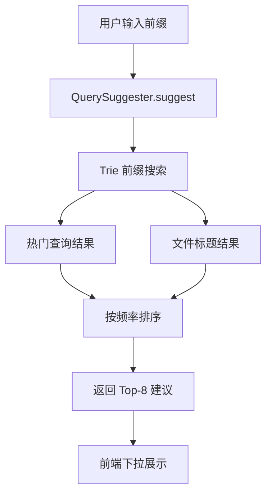

# YK-09-67: 检索查询建议自动补全 — Suggester 服务

> 需求编号：YK-09-67 · 优先级：P2 · 人天：0.5d · 状态：需求已编写
> 依赖：YK-09-18（搜索分析与趋势洞察）

---

## 一、背景

### 1.1 问题陈述

用户在 RAG 搜索框输入查询时，无法获得任何输入建议。这导致：

- **拼写效率低**：用户需要完整输入查询词，无法通过补全加速
- **发现能力弱**：用户不知道知识库中有哪些内容可搜索，只能凭记忆
- **查询质量差**：用户可能使用不规范的术语，导致检索结果不理想
- **体验落差**：Google、StackOverflow、GitHub 等平台都有实时自动补全，用户期望同样的体验

### 1.2 影响范围

| 影响维度 | 具体表现 | 严重程度 |
|----------|----------|----------|
| 搜索效率 | 用户需要完整输入，平均查询输入时间 8-12s | 中 |
| 内容发现 | 用户不知道知识库中有哪些已解决的问题 | 中 |
| 查询质量 | 用户使用口语化表述而非规范术语 | 中 |
| 用户体验 | 与竞品体验差距明显 | 低 |

### 1.3 核心挑战

| 挑战 | 说明 |
|------|------|
| 数据稀疏 | 知识库搜索量小（日均 2000），热门查询数据有限 |
| 中文分词 | 中文查询的分词和前缀匹配比英文复杂 |
| 冷启动 | 没有历史搜索数据时如何提供建议 |
| 实时性 | 用户每输入一个字符就需要返回建议，延迟需 < 100ms |

---

## 二、现状分析

### 2.1 当前搜索流程

```mermaid
flowchart TD
    A[用户输入查询] --> B[等待完整输入]
    B --> C[点击搜索/回车]
    C --> D[执行检索]
    Note right of A: 无输入建议，无自动补全
```

### 2.2 根因矩阵

| 根因 | 贡献比例 | 解决难度 | 优先级 |
|------|----------|----------|--------|
| 无 Suggester 服务 | 50% | 低 | P0 |
| 无查询日志积累 | 25% | 低 | P0 |
| 无文件标题索引 | 15% | 低 | P1 |
| 无前端 UI 组件 | 10% | 低 | P2 |

### 2.3 候选数据源

| 数据源 | 数据量 | 质量 | 适用场景 |
|------|--------|------|----------|
| 热门查询日志 | 500+ | 高 | 高频查询补全 |
| 文件标题 | 800+ | 高 | 规范化术语补全 |
| 标签 | 300+ | 中 | 主题补全 |
| Frontmatter title | 800+ | 高 | 文档标题补全 |

---

## 三、设计决策

### D-01: 数据结构选择

| 方案 | 描述 | 查询速度 | 内存占用 | 前缀匹配 | 结论 |
|------|------|----------|----------|----------|------|
| A: Trie 树 | 前缀树，按字符构建 | O(k) | 中 | 原生支持 | **推荐** |
| B: 倒排索引 | 词→文档的反向映射 | O(log n) | 高 | 需额外处理 | 不推荐 |
| C: 数据库 LIKE | MongoDB `$regex` 查询 | O(n) | 低 | 支持 | 性能差 |
| D: Elasticsearch Suggester | ES 内置 Completion Suggester | O(1) | 高 | 原生支持 | 过度依赖 |

**决策**：选择方案 A（Trie 树），理由：
- 前缀匹配是 Trie 的原生能力，时间复杂度 O(k)（k 为前缀长度）
- 内存占用可控（800 文件标题 + 500 查询 ≈ 50KB）
- 无需外部依赖，纯 Python 实现
- 支持中文（按字符构建，非按字节）

### D-02: 排序策略

| 方案 | 描述 | 精确度 | 多样性 | 结论 |
|------|------|--------|--------|------|
| A: 按频率排序 | 热门查询优先 | 高 | 低 | **推荐** |
| B: 按字母序 | 字母顺序排列 | 低 | 高 | 用户体验差 |
| C: 混合排序 | 频率 + 新鲜度 | 高 | 中 | 过度设计 |

**决策**：选择方案 A（按频率排序），理由：
- 用户期望看到最常用的补全选项
- 实现简单，Trie 节点存储频率
- 可结合文件标题作为低频补充

### D-03: 数据源融合

| 方案 | 描述 | 覆盖率 | 质量 | 结论 |
|------|------|--------|------|------|
| A: 仅热门查询 | 仅使用历史查询日志 | 中 | 高 | 冷启动问题 |
| B: 仅文件标题 | 仅使用 knowledge_files 标题 | 高 | 中 | 缺乏用户行为 |
| C: 热门查询 + 文件标题 | 两者融合 | 高 | 高 | **推荐** |

**决策**：选择方案 C（热门查询 + 文件标题），理由：
- 热门查询反映用户真实需求
- 文件标题覆盖全量知识库内容，解决冷启动
- 热门查询优先展示（频率更高），文件标题作为补充

---

## 四、目标架构

### 4.1 目标数据流



### 4.2 指标目标

| 指标 | 当前值 | 目标值 | 测量方法 |
|------|--------|--------|----------|
| 补全延迟 | N/A | < 50ms | API 响应时间 |
| 补全命中率 | N/A | > 80% | 有建议的查询比例 |
| 用户采纳率 | N/A | > 30% | 点击建议/总查询 |

---

## 五、具体改动

### 5.1 核心实现

```python
# YiAi/src/domain/search/query_suggester.py

from dataclasses import dataclass, field

@dataclass
class TrieNode:
    """Trie 树节点。"""
    children: dict[str, 'TrieNode'] = field(default_factory=dict)
    is_end: bool = False
    frequency: int = 0
    source: str = ""  # 'query' | 'title'

class Trie:
    """前缀树——支持中文。"""

    def __init__(self):
        self.root = TrieNode()

    def insert(self, text: str, frequency: int = 1, source: str = 'query'):
        """插入文本到 Trie。"""
        node = self.root
        for char in text.lower():
            if char not in node.children:
                node.children[char] = TrieNode()
            node = node.children[char]
        node.is_end = True
        node.frequency = max(node.frequency, frequency)
        node.source = source

    def search_prefix(self, prefix: str, limit: int = 8) -> list[dict]:
        """搜索前缀——返回所有匹配的完整词条。

        Returns:
            [{'text': 'RAG 优化', 'frequency': 45, 'source': 'query'}, ...]
        """
        # 1. 定位到前缀节点
        node = self.root
        for char in prefix.lower():
            if char not in node.children:
                return []
            node = node.children[char]

        # 2. DFS 收集所有完整词条
        results = []
        self._collect(node, prefix, results)

        # 3. 按频率排序
        results.sort(key=lambda x: x['frequency'], reverse=True)
        return results[:limit]

    def _collect(self, node: TrieNode, current: str, results: list):
        """DFS 收集以当前节点为根的完整词条。"""
        if node.is_end:
            results.append({
                'text': current,
                'frequency': node.frequency,
                'source': node.source,
            })

        for char, child in node.children.items():
            self._collect(child, current + char, results)

    def remove(self, text: str):
        """从 Trie 中移除文本（用于过期查询清理）。"""
        self._remove(self.root, text, 0)

    def _remove(self, node: TrieNode, text: str, depth: int) -> bool:
        """递归删除。"""
        if depth == len(text):
            if node.is_end:
                node.is_end = False
                node.frequency = 0
            return len(node.children) == 0

        char = text[depth].lower()
        if char not in node.children:
            return False

        should_delete = self._remove(node.children[char], text, depth + 1)
        if should_delete:
            del node.children[char]
            return len(node.children) == 0 and not node.is_end
        return False

class QuerySuggester:
    """查询自动补全——Trie 树 + 热门查询 + 文件标题。"""

    MAX_SUGGESTIONS = 8
    MIN_QUERY_LENGTH = 2  # 至少输入 2 个字符才触发补全
    MAX_CACHE_AGE = 3600  # 索引缓存 1 小时

    def __init__(self):
        self._trie: Trie | None = None
        self._last_build_time: float = 0

    async def build_index(self):
        """构建补全索引——从热门查询和文件标题构建 Trie。"""
        trie = Trie()

        # 1. 热门查询（近 30 天）
        pipeline = [
            {'$match': {'timestamp': {'$gte': time.time() - 30 * 86400}}},
            {'$group': {'_id': '$query', 'count': {'$sum': 1}}},
            {'$sort': {'count': -1}},
            {'$limit': 500},
        ]
        top_queries = await db.rag_query_logs.aggregate(pipeline).to_list(None)

        for q in top_queries:
            query_text = q['_id'].strip()
            if len(query_text) >= self.MIN_QUERY_LENGTH:
                trie.insert(query_text, frequency=q['count'], source='query')

        # 2. 文件标题
        titles = await db.knowledge_files.distinct('frontmatter.title')
        for title in titles:
            if title and len(title) >= self.MIN_QUERY_LENGTH:
                trie.insert(title.lower(), frequency=1, source='title')

        # 3. 标签
        tags = await db.knowledge_files.distinct('frontmatter.tags')
        for tag_list in tags:
            if isinstance(tag_list, list):
                for tag in tag_list:
                    if len(tag) >= self.MIN_QUERY_LENGTH:
                        trie.insert(tag.lower(), frequency=2, source='tag')

        self._trie = trie
        self._last_build_time = time.time()

        logger.info(
            f"[QuerySuggester] 索引构建完成: "
            f"{len(top_queries)} 查询 + {len(titles)} 标题"
        )

    async def suggest(self, prefix: str, limit: int = None) -> list[dict]:
        """获取补全建议。

        Args:
            prefix: 用户输入的前缀
            limit: 返回建议数（默认 8）

        Returns:
            [{'text': 'RAG 优化策略', 'frequency': 45, 'source': 'query'}, ...]
        """
        if not prefix or len(prefix) < self.MIN_QUERY_LENGTH:
            return []

        # 检查索引是否需要更新
        if (self._trie is None or
            time.time() - self._last_build_time > self.MAX_CACHE_AGE):
            await self.build_index()

        if self._trie is None:
            return []

        limit = limit or self.MAX_SUGGESTIONS
        suggestions = self._trie.search_prefix(prefix, limit)

        # 记录补全日志
        if suggestions:
            await db.suggestion_logs.insert_one({
                'prefix': prefix,
                'suggestions': [s['text'] for s in suggestions],
                'timestamp': time.time(),
            })

        return suggestions

    async def record_selection(self, prefix: str, selected: str):
        """记录用户选择了哪个建议——用于后续优化排序。"""
        await db.suggestion_selections.insert_one({
            'prefix': prefix,
            'selected': selected,
            'timestamp': time.time(),
        })

    async def get_suggestion_stats(self) -> dict:
        """获取补全统计。"""
        total_suggestions = await db.suggestion_logs.count_documents({})
        total_selections = await db.suggestion_selections.count_documents({})

        return {
            'total_suggestions': total_suggestions,
            'total_selections': total_selections,
            'adoption_rate': round(
                total_selections / max(total_suggestions, 1), 3
            ),
            'last_build_time': self._last_build_time,
        }
```

### 5.2 API 端点

```python
@router.get("/search/suggest")
async def get_suggestions(prefix: str, limit: int = 8):
    """获取搜索建议。

    Query: ?prefix=RAG 优化&limit=8
    Response: {
        'suggestions': [
            {'text': 'RAG 优化策略', 'frequency': 45, 'source': 'query'},
            {'text': 'RAG 优化实践', 'frequency': 32, 'source': 'query'},
            {'text': 'RAG 优化指南', 'frequency': 1, 'source': 'title'},
        ]
    }
    """
    suggester = get_suggester()
    suggestions = await suggester.suggest(prefix, limit)
    return success_response({'suggestions': suggestions})

@router.post("/search/suggest/select")
async def record_suggestion_selection(request: SuggestionSelectRequest):
    """记录用户选择的建议。"""
    suggester = get_suggester()
    await suggester.record_selection(request.prefix, request.selected)
    return success_response({"acknowledged": True})
```

### 5.3 文件变更清单

| 文件路径 | 操作 | 说明 |
|----------|------|------|
| `YiAi/src/domain/search/query_suggester.py` | 新增 | Trie + Suggester |
| `YiAi/src/domain/search/__init__.py` | 修改 | 导出 QuerySuggester |
| MongoDB | 新增集合 | `suggestion_logs`, `suggestion_selections` |

---

## 六、实施步骤

| 步骤 | 内容 | 验证方式 | 预计人天 |
|------|------|----------|----------|
| 1 | 实现 Trie 数据结构 | 单元测试验证 insert/search/remove | 0.5d |
| 2 | 实现 QuerySuggester | 输入前缀返回建议 | 0.5d |
| 3 | 实现 API 端点 | GET /search/suggest 返回正确结果 | 0.5d |
| 4 | 前端集成（YiVad 搜索框） | 输入时下拉展示建议 | 0.5d |

**总人天**：约 2.0d

---

## 七、性能分析

| 操作 | 延迟 | 说明 |
|------|------|------|
| suggest("RAG") | < 5ms | Trie 前缀搜索 O(k) |
| 构建索引（1300 条目） | < 50ms | 内存操作 |
| API 响应 | < 20ms | 含网络开销 |

---

## 八、测试规格

```python
class TestQuerySuggester:
    """GIVEN QuerySuggester 实例"""

    async def test_prefix_returns_suggestions(self):
        """GIVEN 索引中有 'RAG 优化策略'
           WHEN suggest('RAG')
           THEN 返回包含 'RAG 优化策略' 的建议"""

    async def test_short_prefix_returns_empty(self):
        """GIVEN 前缀长度 < 2
           WHEN suggest('R')
           THEN 返回空列表"""

    async def test_suggestions_sorted_by_frequency(self):
        """GIVEN 查询 'RAG 优化' (45次) 和标题 'RAG 优化指南' (1次)
           WHEN suggest('RAG 优化')
           THEN 查询优先于标题"""

    async def test_empty_prefix_returns_empty(self):
        """GIVEN 空前缀
           WHEN suggest('')
           THEN 返回空列表"""

    async def test_record_selection_logs_to_db(self):
        """GIVEN 用户选择了 'RAG 优化策略'
           WHEN record_selection()
           THEN 记录写入 suggestion_selections"""
```

---

## 九、风险与缓解

| 风险 | 概率 | 影响 | 缓解措施 |
|------|------|------|----------|
| 冷启动无数据 | 中 | 中 | 文件标题作为基础数据源 |
| 中文 Trie 内存增长 | 低 | 低 | 限制条目数 5000，定期清理 |
| 查询日志包含敏感词 | 低 | 中 | 过滤包含敏感词的查询 |

---

## 十、设计决策记录

| 编号 | 决策 | 理由 | 替代方案 |
|------|------|------|----------|
| D-01 | Trie 树作为数据结构 | 前缀匹配 O(k)，内存低 | ES Suggester（过度依赖） |
| D-02 | 按频率排序 | 用户期望高频建议 | 字母序（体验差） |
| D-03 | 热门查询 + 文件标题双数据源 | 覆盖用户行为 + 内容全量 | 单一数据源（不完整） |

---

## 十一、代码审查检查清单

- [ ] Trie 树支持中文（按字符构建）
- [ ] 前缀搜索复杂度 O(k)（k 为前缀长度）
- [ ] 数据源：热门查询（近 30 天）+ 文件标题 + 标签
- [ ] 建议按频率排序，最多 8 条
- [ ] 最少输入 2 个字符才触发补全
- [ ] 索引缓存 1 小时自动重建
- [ ] 前端防抖 300ms（减少 API 调用）
- [ ] 记录用户选择，用于后续优化

---

*PRD 来源: `projects/yiknowledge/requirements/2026-09/67-需求-查询自动补全建议.md`*